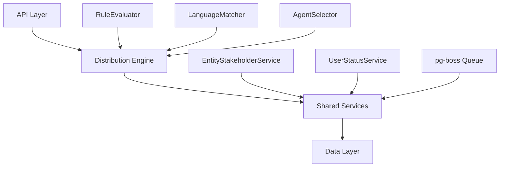

# Distribution Module Specification

<Info>
**Status:** Active — fully implemented  
**Module Path:** `src/modules/crm/distribution/`
</Info>

## Overview

The Distribution Module automates lead assignment within organizations. When a new lead is created, the system evaluates org-defined rules to automatically assign the lead to the most appropriate agent — based on lead attributes, UserStatus online/away state, working-hours eligibility, language compatibility, and capacity.

### Design Principles

<CardGroup cols={2}>
  <Card title="Async Distribution" icon="clock">
    `createLead()` emits `LEAD_CREATED` after commit; a pg-boss worker handles distribution
  </Card>
  <Card title="Stakeholder System Reuse" icon="users">
    Distribution creates `EntityStakeholder` records via `EntityStakeholderService`
  </Card>
  <Card title="First-Match-Wins Rules" icon="trophy">
    Rules are evaluated top-to-bottom by priority; the first matching rule wins
  </Card>
  <Card title="Idempotency" icon="shield-check">
    Distribution engine checks for existing stakeholders or pending offers before running
  </Card>
</CardGroup>

<Note>
No retroactive distribution: Existing leads are unaffected when rules are created; only new leads trigger distribution.
</Note>

### Distribution Paths

The engine supports two execution paths:

**Path A — Org-level distribution** (`runDistribution`): triggered when a lead enters the org with no team context. Evaluates org-scoped rules, applies the org default method, and can bridge to Path B if a rule or default method routes to a team that has `distributionEnabled = true`.

**Path B — Team-level distribution** (`runTeamDistribution`): triggered directly when:
- A lead is created with a `teamId` in the event payload (team pool assignment)
- A bulk-imported lead has a team-only assignment
- Path A determines the lead belongs to an auto-distributing team
- Idempotency check finds a single team-only stakeholder with auto-distribute enabled

## Architecture

### High-Level Diagram



### Component Responsibilities

<AccordionGroup>
  <Accordion title="DistributionEngine">
    Orchestrator: receives a lead, evaluates rules, selects agent, creates assignment. Supports Path A (org) and Path B (team).
  </Accordion>
  
  <Accordion title="RuleEvaluator">
    Evaluates rule conditions against lead data; returns first matching rule.
  </Accordion>
  
  <Accordion title="LanguageMatcher">
    Filters and ranks agents by language compatibility with the lead's person.
  </Accordion>
  
  <Accordion title="AgentSelector">
    Applies the distribution method (round-robin, weighted, weighted-round-robin, direct) to the filtered agent pool.
  </Accordion>
  
  <Accordion title="DistributionCapacityService">
    Two-phase capacity enforcement: Phase 1 `filterByCapacity()` (lead counts vs limits); Phase 2 `confirmCapacityAndAssign()` (advisory locks + atomic stakeholder creation).
  </Accordion>
</AccordionGroup>

## Entity Specifications

### DistributionSettings (1 per org)

Org-level configuration for the distribution engine. Auto-created with defaults on first access via `getOrgSettingsRaw()`. Unique constraint on `organization_id`.

| Column | Type | Notes |
|--------|------|-------|
| id | uuid PK | |
| organization_id | uuid FK UNIQUE | RLS |
| distribution_enabled | bool | default `false`. Master on/off switch |
| max_active_leads_per_agent | int | default 50 |
| max_new_leads_per_day | int | default 20 |
| business_hours_enabled | bool | default `false` |
| business_hours_start | time | default '09:00:00' |
| business_hours_end | time | default '17:00:00' |
| business_hours_timezone | varchar(50) | default 'UTC' |
| business_hours_days | text[] | default ['monday','tuesday','wednesday','thursday','friday'] |
| default_distribution_method | enum | default 'round_robin' |
| default_target_type | enum | default 'user' |
| default_target_id | uuid | nullable FK to user/team |
| language_matching_enabled | bool | default `true` |
| created_at | timestamptz | |
| updated_at | timestamptz | |

### TeamDistributionSettings

Team-level overrides for distribution behavior. Optional — teams inherit org settings if not present.

| Column | Type | Notes |
|--------|------|-------|
| id | uuid PK | |
| organization_id | uuid FK | RLS |
| team_id | uuid FK UNIQUE | |
| distribution_enabled | bool | default `false` |
| max_active_leads_per_agent | int | nullable, inherits from org |
| max_new_leads_per_day | int | nullable, inherits from org |
| distribution_method | enum | default 'round_robin' |
| language_matching_enabled | bool | nullable, inherits from org |
| created_at | timestamptz | |
| updated_at | timestamptz | |

### DistributionRule

Rules that route leads to specific targets based on conditions. Evaluated in priority order (lowest number = highest priority).

<Warning>
Rules with `target_type = 'team'` can bridge to team-level distribution if the target team has `distributionEnabled = true`.
</Warning>

| Column | Type | Notes |
|--------|------|-------|
| id | uuid PK | |
| organization_id | uuid FK | RLS |
| team_id | uuid FK | nullable, for team-scoped rules |
| name | varchar(255) | |
| description | text | nullable |
| is_enabled | bool | default `true` |
| priority | int | lower = higher priority |
| conditions | jsonb | rule logic |
| target_type | enum | 'user' or 'team' |
| target_id | uuid FK | |
| created_at | timestamptz | |
| updated_at | timestamptz | |

### DistributionLog

Audit trail for all distribution attempts, successful or failed.

| Column | Type | Notes |
|--------|------|-------|
| id | uuid PK | |
| organization_id | uuid FK | RLS |
| team_id | uuid FK | nullable, for team-scoped distributions |
| lead_id | uuid FK | |
| rule_id | uuid FK | nullable |
| target_type | enum | |
| target_id | uuid FK | nullable |
| distribution_method | enum | |
| status | enum | 'success', 'failed', 'no_agents_available' |
| error_message | text | nullable |
| metadata | jsonb | execution details |
| created_at | timestamptz | |

## Type Definitions

### Enums

<CodeGroup>

```typescript DistributionMethod
export enum DistributionMethod {
  ROUND_ROBIN = 'round_robin',
  WEIGHTED = 'weighted',
  WEIGHTED_ROUND_ROBIN = 'weighted_round_robin',
  DIRECT = 'direct'
}
```

```typescript TargetType
export enum TargetType {
  USER = 'user',
  TEAM = 'team'
}
```

```typescript DistributionStatus
export enum DistributionStatus {
  SUCCESS = 'success',
  FAILED = 'failed',
  NO_AGENTS_AVAILABLE = 'no_agents_available'
}
```

</CodeGroup>

### Interfaces

<CodeGroup>

```typescript DistributionJobPayload
export interface DistributionJobPayload {
  leadId: string;
  organizationId: string;
  teamId?: string; // for team-level distribution
}
```

```typescript RuleConditions
export interface RuleConditions {
  source?: string[];
  status?: string[];
  value_min?: number;
  value_max?: number;
  person_location?: {
    countries?: string[];
    states?: string[];
    cities?: string[];
  };
  person_languages?: string[];
  custom_fields?: Record<string, any>;
}
```

</CodeGroup>

## Distribution Engine

### Core Methods

<Steps>
  <Step title="runDistribution (Path A)">
    Org-level distribution entry point. Checks for existing assignments, evaluates org rules, applies default method.
  </Step>
  
  <Step title="runTeamDistribution (Path B)">
    Team-level distribution entry point. Evaluates team rules, uses team settings with org fallback.
  </Step>
  
  <Step title="evaluateRules">
    Finds the first matching rule based on priority order and lead attributes.
  </Step>
  
  <Step title="selectAgent">
    Applies distribution method to filtered agent pool, handles capacity constraints.
  </Step>
</Steps>

### Business Hours Gating

<Note>
Business hours are enforced at the org level only. Individual agent working hours are handled separately by `UserStatusService.filterByWorkingHours()`.
</Note>

```typescript
private isWithinBusinessHours(settings: DistributionSettings): boolean {
  if (!settings.business_hours_enabled) return true;
  
  const now = DateTime.now().setZone(settings.business_hours_timezone);
  const currentDay = now.toFormat('cccc').toLowerCase();
  const currentTime = now.toFormat('HH:mm:ss');
  
  return settings.business_hours_days.includes(currentDay) &&
         currentTime >= settings.business_hours_start &&
         currentTime <= settings.business_hours_end;
}
```

## pg-boss Job Configuration

### Queue Setup

<CodeGroup>

```typescript Job Registration
await this.pgBoss.createJob('distribution-job', {
  retryLimit: 3,
  retryDelay: 30, // seconds
  expireInHours: 24
});
```

```typescript Handler
@OnWorkerEvent('distribution-job')
async handleDistributionJob(job: Job<DistributionJobPayload>) {
  const { leadId, organizationId, teamId } = job.data;
  
  try {
    if (teamId) {
      await this.distributionEngine.runTeamDistribution(leadId, organizationId, teamId);
    } else {
      await this.distributionEngine.runDistribution(leadId, organizationId);
    }
  } catch (error) {
    this.logger.error('Distribution job failed', { leadId, error: error.message });
    throw error;
  }
}
```

</CodeGroup>

### Batch Operations

For bulk imports and team assignments:

```typescript
async enqueueBatch(jobs: DistributionJobPayload[]): Promise<void> {
  const batchSize = 100;
  for (let i = 0; i < jobs.length; i += batchSize) {
    const batch = jobs.slice(i, i + batchSize);
    await this.pgBoss.sendBatch('distribution-job', batch);
  }
}
```

## API Endpoints

### Distribution Settings

<Tabs>
  <Tab title="GET /v1/distribution/settings">
    ```typescript
    // Get org distribution settings
    @Get('/settings')
    @UseGuards(JwtAuthGuard, RolesGuard)
    @Roles('admin', 'manager')
    async getSettings(@Req() req: AuthenticatedRequest) {
      return this.distributionSettingsService.getSettings(req.user.organization_id);
    }
    ```
  </Tab>
  
  <Tab title="PATCH /v1/distribution/settings">
    ```typescript
    // Update org distribution settings
    @Patch('/settings')
    @UseGuards(JwtAuthGuard, RolesGuard)
    @Roles('admin', 'manager')
    async updateSettings(
      @Req() req: AuthenticatedRequest,
      @Body() dto: UpdateDistributionSettingsDto
    ) {
      return this.distributionSettingsService.updateSettings(
        req.user.organization_id,
        dto
      );
    }
    ```
  </Tab>
</Tabs>

### Distribution Rules

<Tabs>
  <Tab title="GET /v1/distribution/rules">
    ```typescript
    @Get('/rules')
    @UseGuards(JwtAuthGuard, RolesGuard)
    @Roles('admin', 'manager')
    async getRules(
      @Req() req: AuthenticatedRequest,
      @Query('teamId') teamId?: string
    ) {
      return this.distributionRulesService.getRules(
        req.user.organization_id,
        teamId
      );
    }
    ```
  </Tab>
  
  <Tab title="POST /v1/distribution/rules">
    ```typescript
    @Post('/rules')
    @UseGuards(JwtAuthGuard, RolesGuard)
    @Roles('admin', 'manager')
    async createRule(
      @Req() req: AuthenticatedRequest,
      @Body() dto: CreateDistributionRuleDto
    ) {
      return this.distributionRulesService.createRule(
        req.user.organization_id,
        dto
      );
    }
    ```
  </Tab>
</Tabs>

### Team Distribution

<Tabs>
  <Tab title="GET /v1/teams/:teamId/distribution">
    ```typescript
    @Get('/:teamId/distribution')
    @UseGuards(JwtAuthGuard, RolesGuard)
    @Roles('admin', 'manager', 'agent')
    async getTeamDistribution(
      @Req() req: AuthenticatedRequest,
      @Param('teamId') teamId: string
    ) {
      return this.teamDistributionService.getTeamSettings(
        req.user.organization_id,
        teamId
      );
    }
    ```
  </Tab>
  
  <Tab title="PATCH /v1/teams/:teamId/distribution">
    ```typescript
    @Patch('/:teamId/distribution')
    @UseGuards(JwtAuthGuard, RolesGuard)
    @Roles('admin', 'manager')
    async updateTeamDistribution(
      @Req() req: AuthenticatedRequest,
      @Param('teamId') teamId: string,
      @Body() dto: UpdateTeamDistributionDto
    ) {
      return this.teamDistributionService.updateSettings(
        req.user.organization_id,
        teamId,
        dto
      );
    }
    ```
  </Tab>
</Tabs>

## Security & Permissions

### Role-Based Access Control

<Warning>
Only admins and managers can modify distribution settings and rules. Agents can view team distribution settings they belong to.
</Warning>

| Role | Permissions |
|------|-------------|
| **admin** | Full access to org and team settings, rules, analytics |
| **manager** | Full access to team settings, rules, analytics for managed teams |
| **agent** | Read-only access to own team distribution settings |

### Row-Level Security (RLS)

All distribution entities include `organization_id` for RLS enforcement:

```sql
-- Example RLS policy
CREATE POLICY distribution_settings_org_isolation ON distribution_settings
  FOR ALL TO authenticated
  USING (organization_id = current_setting('app.current_organization_id')::uuid);
```

## Observability & Audit

### Distribution Logging

Every distribution attempt is logged in `distribution_log`:

<CodeGroup>

```typescript Success Log
{
  "lead_id": "uuid",
  "rule_id": "uuid",
  "target_type": "user",
  "target_id": "uuid",
  "distribution_method": "round_robin",
  "status": "success",
  "metadata": {
    "agents_evaluated": 5,
    "execution_time_ms": 150,
    "capacity_check": true
  }
}
```

```typescript Failure Log
{
  "lead_id": "uuid",
  "rule_id": null,
  "target_type": "user",
  "target_id": null,
  "distribution_method": "round_robin",
  "status": "no_agents_available",
  "error_message": "No eligible agents found after capacity filtering",
  "metadata": {
    "agents_evaluated": 0,
    "filters_applied": ["online_status", "capacity", "working_hours"]
  }
}
```

</CodeGroup>

### Performance Metrics

<Tip>
Key metrics are tracked for distribution performance monitoring and optimization.
</Tip>

- **Distribution Success Rate**: Percentage of successful assignments
- **Average Assignment Time**: Time from lead creation to assignment
- **Agent Utilization**: Distribution of leads across agents
- **Rule Effectiveness**: Which rules are matching most frequently

## Analytics & Metrics

### Distribution Analytics Endpoints

<Tabs>
  <Tab title="Distribution Performance">
    ```typescript
    @Get('/analytics/performance')
    async getDistributionPerformance(
      @Req() req: AuthenticatedRequest,
      @Query() query: AnalyticsQueryDto
    ) {
      return this.distributionAnalyticsService.getPerformanceMetrics(
        req.user.organization_id,
        query
      );
    }
    ```
  </Tab>
  
  <Tab title="Agent Workload">
    ```typescript
    @Get('/analytics/workload')
    async getAgentWorkload(
      @Req() req: AuthenticatedRequest,
      @Query() query: WorkloadQueryDto
    ) {
      return this.distributionAnalyticsService.getAgentWorkload(
        req.user.organization_id,
        query
      );
    }
    ```
  </Tab>
</Tabs>

## Edge Case Handling

### No Eligible Agents

<Steps>
  <Step title="Filter Application">
    If all agents are filtered out by status, capacity, or working hours
  </Step>
  
  <Step title="Fallback Behavior">
    Log failure with `NO_AGENTS_AVAILABLE` status, do not assign lead
  </Step>
  
  <Step title="Manual Assignment">
    Admins can manually assign leads that failed distribution
  </Step>
</Steps>

### Concurrent Distribution

<Info>
The system handles concurrent distribution attempts through advisory locks in the capacity service to prevent double-assignment.
</Info>

```typescript
async confirmCapacityAndAssign(
  leadId: string,
  userId: string,
  organizationId: string
): Promise<boolean> {
  // Advisory lock prevents concurrent assignments
  const lockKey = `dist_${userId}_${organizationId}`;
  
  return this.em.transactional(async (em) => {
    await em.getConnection().execute(`SELECT pg_advisory_xact_lock(hashtext($1))`, [lockKey]);
    
    // Re-check capacity and create assignment atomically
    const currentCount = await this.getCurrentLeadCount(userId, em);
    if (currentCount >= maxLeads) return false;
    
    await this.entityStakeholderService.createStakeholder({
      entity_type: 'lead',
      entity_id: leadId,
      user_id: userId,
      organization_id: organizationId,
      stakeholder_type: 'assignee'
    }, em);
    
    return true;
  });
}
```

## Performance & Scaling

### Optimization Strategies

<CardGroup cols={2}>
  <Card title="Database Indexing" icon="database">
    Strategic indexes on organization_id, team_id, priority, and status fields
  </Card>
  <Card title="Capacity Caching" icon="bolt">
    Redis cache for agent lead counts with TTL-based invalidation
  </Card>
  <Card title="Batch Processing" icon="layer-group">
    Bulk job enqueuing for imports and team assignments
  </Card>
  <Card title="Connection Pooling" icon="server">
    Optimized database connection management for high-throughput scenarios
  </Card>
</CardGroup>

### Scaling Considerations

- **pg-boss Workers**: Scale horizontally by adding worker instances
- **Rule Complexity**: Monitor rule evaluation performance, consider rule simplification
- **Capacity Checks**: Cache agent lead counts to reduce database load
- **Event Processing**: Async event handling prevents blocking lead creation

## Integration Points

### External Dependencies

<AccordionGroup>
  <Accordion title="EntityStakeholderService">
    Creates and manages lead assignments through the stakeholder system
  </Accordion>
  
  <Accordion title="UserStatusService">
    Filters agents by online status and working hours
  </Accordion>
  
  <Accordion title="EventEmitter2">
    Publishes and subscribes to lead lifecycle events
  </Accordion>
  
  <Accordion title="pg-boss">
    Reliable job queue for async distribution processing
  </Accordion>
</AccordionGroup>

### Event Integration

The module integrates with the event system for:

- **LEAD_CREATED**: Triggers distribution workflow
- **LEAD_ASSIGNED**: Emitted after successful distribution
- **DISTRIBUTION_FAILED**: Emitted when no agents available

## Environment Configuration

<CodeGroup>

```env Development
# Distribution Module Configuration
DISTRIBUTION_ENABLED=true
DISTRIBUTION_BATCH_SIZE=100
DISTRIBUTION_RETRY_LIMIT=3
DISTRIBUTION_RETRY_DELAY=30

# pg-boss Configuration
PGBOSS_POLL_INTERVAL=5000
PGBOSS_MAX_CONNECTIONS=10
```

```env Production
# Distribution Module Configuration
DISTRIBUTION_ENABLED=true
DISTRIBUTION_BATCH_SIZE=500
DISTRIBUTION_RETRY_LIMIT=5
DISTRIBUTION_RETRY_DELAY=60

# pg-boss Configuration
PGBOSS_POLL_INTERVAL=2000
PGBOSS_MAX_CONNECTIONS=20
```

</CodeGroup>

<Check>
The Distribution Module is production-ready with comprehensive error handling, observability, and performance optimizations.
</Check>