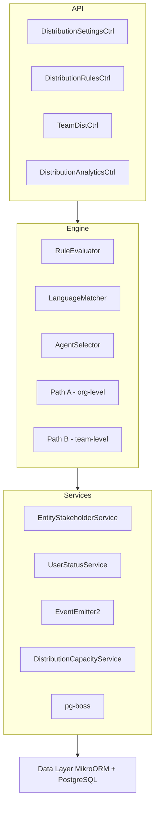

<Note>
**Status:** Active — fully implemented  
**Module Path:** `src/modules/crm/distribution/`
</Note>

## Overview

The Distribution Module automates lead assignment within organizations. When a new lead is created, the system evaluates org-defined rules to automatically assign the lead to the most appropriate agent — based on lead attributes, UserStatus online/away state, working-hours eligibility, language compatibility, and capacity.

### Design Principles

<CardGroup cols={2}>
  <Card title="Async Distribution" icon="clock">
    `createLead()` emits `LEAD_CREATED` after commit; a pg-boss worker handles distribution
  </Card>
  <Card title="Stakeholder System Reuse" icon="users">
    Distribution creates `EntityStakeholder` records via `EntityStakeholderService`
  </Card>
  <Card title="First-Match-Wins Rules" icon="trophy">
    Rules are evaluated top-to-bottom by priority; the first matching rule wins
  </Card>
  <Card title="Idempotency" icon="shield-check">
    Distribution engine checks for existing stakeholders before running
  </Card>
</CardGroup>

<Info>
**Critical Behavior:** Listener/emit failures are logged only — HTTP lead creation still returns success; manual assignment or backfill may be needed if enqueue never ran.
</Info>

### Distribution Paths

The engine supports two execution paths:

<Tabs>
  <Tab title="Path A - Org-Level">
    **Org-level distribution** (`runDistribution`): triggered when a lead enters the org with no team context. Evaluates org-scoped rules, applies the org default method, and can bridge to Path B if a rule or default method routes to a team that has `distributionEnabled = true`.
  </Tab>
  <Tab title="Path B - Team-Level">
    **Team-level distribution** (`runTeamDistribution`): triggered directly when:
    - A lead is created with a `teamId` in the event payload (team pool assignment)
    - Path A determines the lead belongs to an auto-distributing team
    - Idempotency check finds a single team-only stakeholder with auto-distribute enabled
  </Tab>
</Tabs>

## Architecture

### High-Level System Diagram



### Component Responsibilities

| Component | Responsibility |
|-----------|----------------|
| **DistributionEngine** | Orchestrator: receives a lead, evaluates rules, selects agent, creates assignment |
| **RuleEvaluator** | Evaluates rule conditions against lead data; returns first matching rule |
| **LanguageMatcher** | Filters and ranks agents by language compatibility |
| **AgentSelector** | Applies distribution methods (round-robin, weighted, etc.) |
| **DistributionCapacityService** | Two-phase capacity enforcement with advisory locks |
| **UserStatusService** | Filters by ONLINE status and working hours |

## Entity Specifications

### DistributionSettings (1 per org)

<Warning>
Org-level configuration for the distribution engine. Auto-created with defaults on first access.
</Warning>

| Column | Type | Default | Notes |
|--------|------|---------|-------|
| `id` | uuid PK | - | Primary key |
| `organization_id` | uuid FK UNIQUE | - | RLS compliance |
| `distribution_enabled` | bool | `false` | Master on/off switch |
| `max_active_leads_per_agent` | int | 50 | Capacity limit |
| `max_new_leads_per_day` | int | 15 | Daily assignment limit |
| `capacity_enforcement_enabled` | bool | `false` | Enable capacity checks |
| `respect_business_hours` | bool | `true` | Use org business hours |
| `outside_hours_action` | enum | - | `QUEUE`, `POOL`, `DUTY_AGENT` |
| `duty_agent_id` | uuid FK nullable | - | For duty agent assignment |
| `default_method` | enum | - | `ROUND_ROBIN`, `POOL`, `SPECIFIC_TEAM` |
| `default_team_id` | uuid FK nullable | - | For specific team routing |
| `default_language_matching_mode` | enum | - | `STRICT`, `PREFERRED` |

<Accordion title="Master Toggle Behavior">
  - **`distributionEnabled = false`** (default): Engine is off. No pg-boss jobs created, leads go to pool
  - **`distributionEnabled = true`**: Engine is active. Auto-upgrades `defaultMethod` from `POOL` to `ROUND_ROBIN`
  - **Backfill on toggle:** When enabled, automatically processes up to 2000 unassigned leads
</Accordion>

### TeamDistributionSettings

Per-team distribution configuration with unique constraint on `(organization, team)` pair.

```typescript
interface TeamDistributionSettings {
  id: string;
  organizationId: string;
  teamId: string;
  distributionEnabled: boolean; // default: false
  distributionMethod: DistributionMethod;
  agentWeights?: Record<string, number>;
  languageMatchingEnabled: boolean;
  capacityEnforcementEnabled: boolean;
  maxActiveLeadsPerAgent?: number; // null = inherit from org
  maxNewLeadsPerDay?: number; // null = inherit from org
  respectBusinessHours: boolean;
  lastAssignedIndex: number; // Round-robin cursor
}
```

<Tip>
**Effective Capacity Resolution:** Team settings override org settings when `capacityEnforcementEnabled` is true. Otherwise, no capacity checks are applied.
</Tip>

### DistributionRule

<Steps>
  <Step title="Rule Evaluation">
    Rules are evaluated in ascending `priority` order (lower number = higher priority)
  </Step>
  <Step title="First Match Wins">
    The first matching rule determines the assignment outcome
  </Step>
  <Step title="Fallback Handling">
    If no rules match, the system uses default distribution method
  </Step>
</Steps>

| Column | Type | Notes |
|--------|------|-------|
| `id` | uuid PK | Primary key |
| `organization_id` | uuid FK | RLS compliance |
| `name` | varchar | Rule display name |
| `priority` | int | Lower = higher priority |
| `is_active` | bool | Enable/disable rule |
| `scope` | enum | `ORGANIZATION`, `TEAM` |
| `team_id` | uuid FK nullable | Required for team-scoped rules |
| `conditions` | jsonb | Rule matching criteria |
| `action_type` | enum | Assignment action to take |
| `action_config` | jsonb | Action-specific configuration |

### DistributionLog

Audit trail for all distribution outcomes, including failures and manual assignments.

```sql
CREATE TABLE distribution_log (
  id uuid PRIMARY KEY,
  organization_id uuid NOT NULL,
  lead_id uuid NOT NULL,
  team_id uuid NULL,
  outcome enum NOT NULL,
  assigned_user_id uuid NULL,
  matched_rule_id uuid NULL,
  distribution_method enum NULL,
  execution_time_ms int NOT NULL,
  error_message text NULL,
  metadata jsonb NULL,
  created_at timestamptz DEFAULT now()
);
```

## Distribution Engine

### Path A: Organization-Level Distribution

<CodeGroup>
```typescript Path A Flow
async runDistribution(leadId: string): Promise<DistributionOutcome> {
  // 1. Load lead and validate
  const lead = await this.loadLead(leadId);
  
  // 2. Check for existing assignment (idempotency)
  if (await this.hasExistingAssignment(leadId)) {
    return { outcome: 'ALREADY_ASSIGNED' };
  }
  
  // 3. Evaluate organization rules
  const matchedRule = await this.ruleEvaluator.evaluateOrgRules(lead);
  
  if (matchedRule) {
    return await this.executeRuleAction(lead, matchedRule);
  }
  
  // 4. Apply default distribution method
  return await this.applyDefaultMethod(lead);
}
```

```typescript Rule Evaluation
async evaluateOrgRules(lead: Lead): Promise<DistributionRule | null> {
  const rules = await this.getActiveOrgRules(lead.organizationId);
  
  for (const rule of rules.sort(r => r.priority)) {
    if (await this.matchesConditions(lead, rule.conditions)) {
      return rule;
    }
  }
  
  return null; // No matching rule
}
```
</CodeGroup>

### Path B: Team-Level Distribution

Team-level distribution is triggered when:
- Lead is created with explicit `teamId`
- Org-level rule routes to auto-distributing team
- Manual team assignment to auto-distributing team

<Note>
Path B evaluates team-scoped rules first, then falls back to team's default distribution method.
</Note>

## Agent Selection Methods

<Tabs>
  <Tab title="Round Robin">
    **Round Robin**: Cycles through eligible agents in order
    ```typescript
    async selectRoundRobin(agents: User[]): Promise<User> {
      const index = await this.getNextRoundRobinIndex();
      return agents[index % agents.length];
    }
    ```
  </Tab>
  
  <Tab title="Weighted">
    **Weighted**: Random selection based on agent weights
    ```typescript
    async selectWeighted(agents: User[], weights: Record<string, number>): Promise<User> {
      const totalWeight = Object.values(weights).reduce((a, b) => a + b, 0);
      const random = Math.random() * totalWeight;
      // Select based on cumulative weight ranges
    }
    ```
  </Tab>
  
  <Tab title="Weighted Round Robin">
    **Weighted Round Robin**: Round-robin with weight-based frequency
    ```typescript
    async selectWeightedRoundRobin(agents: User[]): Promise<User> {
      // Maintains virtual queues based on weights
      // Ensures fair distribution over time
    }
    ```
  </Tab>
  
  <Tab title="Direct Assignment">
    **Direct**: Assigns to specific agent
    ```typescript
    async selectDirect(targetUserId: string): Promise<User> {
      return await this.validateAndGetUser(targetUserId);
    }
    ```
  </Tab>
</Tabs>

## API Endpoints

### Distribution Settings

<AccordionGroup>
  <Accordion title="GET /v1/distribution/settings">
    **Get Organization Settings**
    
    Returns current distribution configuration for the organization.
    
    ```json Response
    {
      "distributionEnabled": true,
      "maxActiveLeadsPerAgent": 50,
      "maxNewLeadsPerDay": 15,
      "defaultMethod": "ROUND_ROBIN",
      "respectBusinessHours": true,
      "outsideHoursAction": "QUEUE"
    }
    ```
  </Accordion>
  
  <Accordion title="PATCH /v1/distribution/settings">
    **Update Organization Settings**
    
    ```json Request
    {
      "distributionEnabled": true,
      "maxActiveLeadsPerAgent": 75,
      "defaultMethod": "WEIGHTED_ROUND_ROBIN"
    }
    ```
    
    <Warning>
    Enabling distribution triggers automatic backfill of up to 2000 unassigned leads.
    </Warning>
  </Accordion>
</AccordionGroup>

### Distribution Rules

<AccordionGroup>
  <Accordion title="GET /v1/distribution/rules">
    **List Distribution Rules**
    
    Query parameters:
    - `scope`: Filter by `ORGANIZATION` or `TEAM`
    - `teamId`: Filter by team (required for team-scoped rules)
    - `active`: Filter by active status
  </Accordion>
  
  <Accordion title="POST /v1/distribution/rules">
    **Create Distribution Rule**
    
    ```json Request
    {
      "name": "Enterprise Leads to Sales Team",
      "priority": 10,
      "scope": "ORGANIZATION",
      "conditions": {
        "leadSource": ["website", "referral"],
        "companySize": "enterprise"
      },
      "actionType": "ASSIGN_TO_TEAM",
      "actionConfig": {
        "teamId": "team-uuid"
      }
    }
    ```
  </Accordion>
  
  <Accordion title="PUT /v1/distribution/rules/:id">
    **Update Distribution Rule**
    
    <Note>
    Rule changes only affect new leads. Existing assignments are not modified.
    </Note>
  </Accordion>
  
  <Accordion title="POST /v1/distribution/rules/reorder">
    **Reorder Rules**
    
    ```json Request
    {
      "ruleIds": ["rule1-uuid", "rule2-uuid", "rule3-uuid"]
    }
    ```
  </Accordion>
</AccordionGroup>

### Team Distribution

<AccordionGroup>
  <Accordion title="GET /v1/teams/:teamId/distribution">
    **Get Team Distribution Settings**
  </Accordion>
  
  <Accordion title="PATCH /v1/teams/:teamId/distribution">
    **Update Team Distribution Settings**
    
    ```json Request
    {
      "distributionEnabled": true,
      "distributionMethod": "WEIGHTED",
      "agentWeights": {
        "user1-uuid": 3,
        "user2-uuid": 2,
        "user3-uuid": 1
      }
    }
    ```
  </Accordion>
</AccordionGroup>

### Analytics & Manual Actions

<AccordionGroup>
  <Accordion title="GET /v1/distribution/analytics">
    **Distribution Analytics**
    
    Returns metrics on assignment outcomes, rule effectiveness, and capacity utilization.
  </Accordion>
  
  <Accordion title="POST /v1/distribution/manual-assign">
    **Manual Lead Assignment**
    
    ```json Request
    {
      "leadId": "lead-uuid",
      "userId": "user-uuid",
      "reason": "Customer request"
    }
    ```
  </Accordion>
  
  <Accordion title="POST /v1/distribution/backfill">
    **Trigger Distribution Backfill**
    
    Manually trigger backfill for unassigned leads.
    
    Query parameters:
    - `teamId`: Backfill specific team (optional)
    - `limit`: Maximum leads to process (default: 2000)
  </Accordion>
</AccordionGroup>

## Security & Permissions

### Permission Requirements

| Action | Required Permission | Notes |
|--------|-------------------|-------|
| View distribution settings | `distribution:read` | Org members only |
| Update distribution settings | `distribution:write` | Org admins only |
| Create/edit rules | `distribution:rules:write` | Org admins + team managers |
| View analytics | `distribution:analytics:read` | Managers and above |
| Manual assignment | `leads:assign` | Lead managers |
| Backfill operations | `distribution:admin` | System admins |

### Row-Level Security (RLS)

<Check>
All distribution entities include `organization_id` for RLS compliance.
</Check>

```sql RLS Policies
-- Distribution Settings
CREATE POLICY distribution_settings_org_policy ON distribution_settings
FOR ALL USING (organization_id = current_organization_id());

-- Distribution Rules  
CREATE POLICY distribution_rules_org_policy ON distribution_rules
FOR ALL USING (organization_id = current_organization_id());

-- Team Distribution Settings
CREATE POLICY team_distribution_org_policy ON team_distribution_settings
FOR ALL USING (organization_id = current_organization_id());
```

## Observability & Audit

### Logging & Monitoring

<Tabs>
  <Tab title="Distribution Logs">
    Every distribution attempt is logged with:
    - Lead ID and organization context
    - Matched rule (if any) and execution path
    - Assignment outcome and timing
    - Error details for failures
    - Metadata for debugging
  </Tab>
  
  <Tab title="Performance Metrics">
    - Distribution job queue depth
    - Average processing time per lead
    - Rule evaluation performance
    - Capacity check timing
    - Agent selection method performance
  </Tab>
  
  <Tab title="Business Metrics">
    - Assignment success rate
    - Rule match distribution
    - Capacity utilization by agent/team
    - Business hours vs after-hours volume
  </Tab>
</Tabs>

### Error Handling

<Warning>
**Fault Isolation**: Distribution failures do not prevent lead creation. Failed distributions are logged and can be retried via backfill.
</Warning>

Common failure scenarios:
- No eligible agents (capacity/availability)
- Rule evaluation errors
- Database connectivity issues
- Business hours configuration errors

## Performance & Scaling

### Optimization Strategies

<Steps>
  <Step title="Database Indexing">
    Optimize queries with indexes on `organization_id`, `team_id`, and rule evaluation fields
  </Step>
  <Step title="Caching">
    Cache frequently accessed settings and rule configurations
  </Step>
  <Step title="Batch Processing">
    Process multiple leads in batches during high-volume periods
  </Step>
  <Step title="Async Architecture">
    Leverage pg-boss for reliable background processing
  </Step>
</Steps>

### Scaling Considerations

| Component | Scaling Strategy |
|-----------|------------------|
| **Rule Evaluation** | Limit rules per org (50 max), optimize condition matching |
| **Agent Selection** | Pre-filter eligible agents, cache team memberships |
| **Capacity Checks** | Use advisory locks, batch capacity updates |
| **Job Processing** | Scale pg-boss workers horizontally |

## Edge Case Handling

<AccordionGroup>
  <Accordion title="No Eligible Agents">
    **Scenario**: All agents are at capacity or offline
    
    **Resolution**: Lead goes to team/org pool with `FALLBACK_TEAM` or `FALLBACK_POOL` outcome
  </Accordion>
  
  <Accordion title="Rule Conflicts">
    **Scenario**: Multiple rules could match a lead
    
    **Resolution**: First rule by priority wins (lower number = higher priority)
  </Accordion>
  
  <Accordion title="Agent Unavailable During Assignment">
    **Scenario**: Selected agent becomes unavailable between selection and assignment
    
    **Resolution**: Use advisory locks during capacity confirmation phase
  </Accordion>
  
  <Accordion title="Business Hours Edge Cases">
    **Scenario**: Lead created exactly at business hours boundary
    
    **Resolution**: Use UTC timestamps and clear timezone handling
  </Accordion>
  
  <Accordion title="Deleted Entities">
    **Scenario**: Referenced team/user is deleted after rule creation
    
    **Resolution**: Validate entity existence during rule execution, fallback to default method
  </Accordion>
</AccordionGroup>

## Module Structure

```
src/modules/crm/distribution/
├── controllers/
│   ├── distribution-settings.controller.ts
│   ├── distribution-rules.controller.ts
│   ├── team-distribution.controller.ts
│   └── distribution-analytics.controller.ts
├── services/
│   ├── distribution.service.ts
│   ├── distribution-settings.service.ts
│   ├── distribution-capacity.service.ts
│   ├── rule-evaluator.service.ts
│   ├── agent-selector.service.ts
│   └── language-matcher.service.ts
├── entities/
│   ├── distribution-settings.entity.ts
│   ├── team-distribution-settings.entity.ts
│   ├── distribution-rule.entity.ts
│   └── distribution-log.entity.ts
├── listeners/
│   └── distribution.listener.ts
├── jobs/
│   └── distribution-job.handler.ts
├── types/
│   ├── distribution.types.ts
│   ├── rule-conditions.types.ts
│   └── distribution-outcomes.types.ts
└── __tests__/
    ├── distribution.service.spec.ts
    ├── rule-evaluator.spec.ts
    └── integration/
```

## Integration Points

<CardGroup cols={2}>
  <Card title="Lead Management" icon="user-plus">
    Integrates with lead creation workflow via event listeners
  </Card>
  <Card title="Team Management" icon="users">
    Uses team membership and settings for agent selection
  </Card>
  <Card title="User Status" icon="circle-dot">
    Leverages UserStatusService for availability filtering
  </Card>
  <Card title="Entity Stakeholders" icon="handshake">
    Creates assignments through EntityStakeholderService
  </Card>
</CardGroup>

## Environment Configuration

```env Environment Variables
# Distribution Settings
DISTRIBUTION_ENABLED=true
DISTRIBUTION_JOB_CONCURRENCY=5
DISTRIBUTION_BATCH_SIZE=100

# Capacity Enforcement
CAPACITY_LOCK_TIMEOUT_MS=5000
CAPACITY_CHECK_ENABLED=true

# Performance
DISTRIBUTION_CACHE_TTL=300
RULE_EVALUATION_TIMEOUT=10000

# Monitoring
DISTRIBUTION_METRICS_ENABLED=true
DISTRIBUTION_LOG_LEVEL=info
```

<Tip>
**Production Recommendations**: 
- Enable capacity enforcement for high-volume orgs
- Set appropriate job concurrency based on database capacity  
- Monitor distribution queue depth and processing times
- Use business hours gating to prevent after-hours assignments
</Tip>