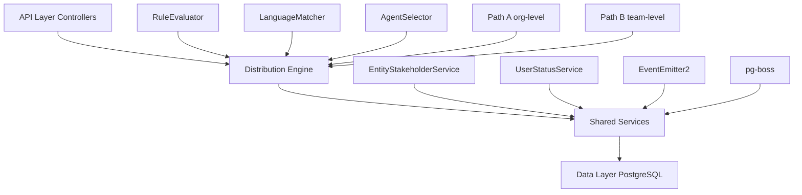

# Distribution Module Specification

<Info>
**Status:** Active — fully implemented  
**Module Path:** `src/modules/crm/distribution/`
</Info>

## Overview

The Distribution Module automates lead assignment within organizations. When a new lead is created, the system evaluates org-defined rules to automatically assign the lead to the most appropriate agent — based on lead attributes, UserStatus online/away state, working-hours eligibility, language compatibility, and capacity.

### Design Principles

<AccordionGroup>
<Accordion title="Async distribution">
`createLead()` emits `LEAD_CREATED` after commit; a pg-boss worker handles distribution. Listener / emit failures are logged only — HTTP lead creation still returns success; manual assignment or backfill may be needed if enqueue never ran. Bulk lead import sets `skipEmitLeadCreated` per row and calls `DistributionJobHandler.enqueueBatch()` once after the import loop.
</Accordion>

<Accordion title="Stakeholder system reuse">
Distribution creates `EntityStakeholder` records via `EntityStakeholderService`, not a new paradigm
</Accordion>

<Accordion title="First-match-wins rules">
Rules are evaluated top-to-bottom by priority; the first matching rule wins
</Accordion>

<Accordion title="Idempotency">
Distribution engine checks for existing stakeholders or pending offers before running
</Accordion>

<Accordion title="No retroactive distribution">
Existing leads are unaffected when rules are created; only new leads trigger distribution
</Accordion>

<Accordion title="pg-boss scheduling">
Distribution queue uses pg-boss for reliability and retry guarantees
</Accordion>

<Accordion title="RLS compliance">
All entities carry `organization_id` for row-level security
</Accordion>
</AccordionGroup>

### Distribution Paths

The engine supports two execution paths:

<Tabs>
<Tab title="Path A — Org-level distribution">
Triggered when a lead enters the org with no team context. Evaluates org-scoped rules, applies the org default method, and can bridge to Path B if a rule or default method routes to a team that has `distributionEnabled = true`.
</Tab>

<Tab title="Path B — Team-level distribution">
Triggered directly when:
- A lead is created with a `teamId` in the event payload (team pool assignment)
- A bulk-imported lead has a team-only assignment; `LeadImportService` batch-enqueues the job with `teamId`
- Path A determines the lead belongs to an auto-distributing team
- Idempotency check finds a single team-only stakeholder with auto-distribute enabled

Path B evaluates team-scoped rules, uses team settings (with org fallback for capacity), and logs the team FK on the resulting `DistributionLog` record.
</Tab>
</Tabs>

## Architecture

### High-Level Diagram



### Component Responsibilities

<AccordionGroup>
<Accordion title="DistributionEngine">
Orchestrator: receives a lead, evaluates rules, selects agent, creates assignment. Supports Path A (org) and Path B (team).
</Accordion>

<Accordion title="RuleEvaluator">
Evaluates rule conditions against lead data; returns first matching rule
</Accordion>

<Accordion title="LanguageMatcher">
Filters and ranks agents by language compatibility with the lead's person
</Accordion>

<Accordion title="AgentSelector">
Applies the distribution method (round-robin, weighted, weighted-round-robin, direct) to the filtered agent pool
</Accordion>

<Accordion title="DistributionCapacityService">
Two-phase capacity enforcement: Phase 1 `filterByCapacity()` (lead counts vs limits); Phase 2 `confirmCapacityAndAssign()` (advisory locks + atomic stakeholder creation). No entity of its own — queries `entity_stakeholder`.
</Accordion>

<Accordion title="UserStatusService">
Pre-filters candidate agents to ONLINE status; filters by per-user working hours (`filterByWorkingHours`); provides `isWithinWorkingHours()` for org-level business hours check.
</Accordion>

<Accordion title="DistributionListener">
Listens for `LEAD_CREATED` events and enqueues pg-boss jobs. The handler is fault-isolated (try/catch): settings lookup and enqueue errors are logged and do not fail `POST /v1/leads`.
</Accordion>

<Accordion title="DistributionJobHandler">
pg-boss worker that processes distribution jobs
</Accordion>
</AccordionGroup>

## Entity Specifications

### DistributionSettings (1 per org)

Org-level configuration for the distribution engine. Auto-created with defaults on first access via `getOrgSettingsRaw()`. Unique constraint on `organization_id`.

<Note>
This entity is automatically created with default values when first accessed for an organization.
</Note>

| Column | Type | Description |
|--------|------|-------------|
| `id` | uuid PK | Primary key |
| `organization_id` | uuid FK UNIQUE | RLS enabled |
| `distribution_enabled` | bool | Default `false`. Master on/off switch |
| `max_active_leads_per_agent` | int | Default 50 |
| `max_new_leads_per_day` | int | Default 20 |
| `default_method` | enum | `'round_robin'`, `'weighted'`, `'weighted_round_robin'`, `'direct'` |
| `business_hours_enabled` | bool | Default `false` |
| `business_hours_start` | time | Default `'09:00:00'` |
| `business_hours_end` | time | Default `'17:00:00'` |
| `business_hours_timezone` | string | Default `'UTC'` |
| `business_hours_days` | int[] | Default `[1,2,3,4,5]` (Mon-Fri) |
| `language_matching_enabled` | bool | Default `false` |
| `allow_reassignment` | bool | Default `true` |
| `created_at` | timestamptz | |
| `updated_at` | timestamptz | |

### TeamDistributionSettings (0-1 per team)

Team-specific overrides for distribution behavior. Teams inherit org settings where no override exists.

| Column | Type | Description |
|--------|------|-------------|
| `id` | uuid PK | Primary key |
| `organization_id` | uuid FK | RLS enabled |
| `team_id` | uuid FK UNIQUE | One settings record per team |
| `distribution_enabled` | bool | Team-level toggle |
| `max_active_leads_per_agent` | int nullable | Override org setting |
| `max_new_leads_per_day` | int nullable | Override org setting |
| `default_method` | enum nullable | Override org method |
| `created_at` | timestamptz | |
| `updated_at` | timestamptz | |

### DistributionRule

Rules define conditional lead assignment logic. Evaluated in priority order (lower numbers first).

<Warning>
Rules are evaluated top-to-bottom by priority. The first matching rule wins and stops evaluation.
</Warning>

| Column | Type | Description |
|--------|------|-------------|
| `id` | uuid PK | Primary key |
| `organization_id` | uuid FK | RLS enabled |
| `team_id` | uuid FK nullable | NULL = org-level rule |
| `name` | string | Human-readable rule name |
| `priority` | int | Sort order (lower = higher priority) |
| `conditions` | JSONB | Rule matching criteria |
| `action` | JSONB | Assignment action configuration |
| `is_active` | bool | Default `true` |
| `created_at` | timestamptz | |
| `updated_at` | timestamptz | |

#### Condition Schema

<CodeGroup>
```json Conditions Example
{
  "all": [
    {
      "field": "lead.source",
      "operator": "equals",
      "value": "website"
    },
    {
      "field": "person.country_code",
      "operator": "in",
      "value": ["US", "CA", "GB"]
    }
  ]
}
```

```json Complex Conditions
{
  "any": [
    {
      "field": "lead.estimated_value",
      "operator": "gte",
      "value": 10000
    },
    {
      "all": [
        {
          "field": "person.language_codes",
          "operator": "intersects",
          "value": ["es", "pt"]
        },
        {
          "field": "lead.source",
          "operator": "not_equals",
          "value": "cold_outreach"
        }
      ]
    }
  ]
}
```
</CodeGroup>

#### Action Schema

<Tabs>
<Tab title="Direct Assignment">
```json
{
  "type": "assign_to_agent",
  "agent_id": "uuid-here"
}
```
</Tab>

<Tab title="Team Assignment">
```json
{
  "type": "assign_to_team",
  "team_id": "uuid-here",
  "method": "round_robin"
}
```
</Tab>

<Tab title="Method Override">
```json
{
  "type": "use_method",
  "method": "weighted_round_robin"
}
```
</Tab>
</Tabs>

### DistributionLog

Audit trail for all distribution attempts and outcomes.

| Column | Type | Description |
|--------|------|-------------|
| `id` | uuid PK | Primary key |
| `organization_id` | uuid FK | RLS enabled |
| `lead_id` | uuid FK | Target lead |
| `team_id` | uuid FK nullable | Team context (Path B) |
| `assigned_agent_id` | uuid FK nullable | Resulting assignment |
| `rule_id` | uuid FK nullable | Matching rule (if any) |
| `method_used` | enum | Distribution method applied |
| `status` | enum | `'success'`, `'failed'`, `'no_agents_available'` |
| `reason` | string nullable | Failure reason or notes |
| `candidate_count` | int | Agents considered |
| `metadata` | JSONB nullable | Additional context |
| `created_at` | timestamptz | |

## Distribution Engine

### Core Algorithm

<Steps>
<Step title="Idempotency Check">
Verify no existing stakeholders or pending distribution jobs for the lead
</Step>

<Step title="Path Selection">
Determine if this is org-level (Path A) or team-level (Path B) distribution
</Step>

<Step title="Rule Evaluation">
Find the first matching rule based on priority order and conditions
</Step>

<Step title="Agent Filtering">
Apply status, capacity, working hours, and language filters
</Step>

<Step title="Agent Selection">
Use the specified distribution method to select from eligible agents
</Step>

<Step title="Assignment Creation">
Create EntityStakeholder record with role `'assigned_agent'`
</Step>
</Steps>

### Distribution Methods

<AccordionGroup>
<Accordion title="Round Robin">
**Algorithm:** Cycles through agents in consistent order  
**Use case:** Equal distribution regardless of agent performance  
**Implementation:** Uses `last_assigned_index` tracking
</Accordion>

<Accordion title="Weighted">
**Algorithm:** Random selection based on agent weights  
**Use case:** Distribute more leads to high-performing agents  
**Implementation:** Weighted random sampling
</Accordion>

<Accordion title="Weighted Round Robin">
**Algorithm:** Round robin with weight-based frequency  
**Use case:** Balanced approach between equality and performance  
**Implementation:** Each agent gets `weight` consecutive assignments
</Accordion>

<Accordion title="Direct Assignment">
**Algorithm:** Assigns to specific agent (from rule action)  
**Use case:** VIP leads, specialized expertise requirements  
**Implementation:** Direct assignment with capacity validation
</Accordion>
</AccordionGroup>

## API Endpoints

### Distribution Settings

<CodeGroup>
```typescript GET /v1/distribution/settings
// Get organization distribution settings
interface Response {
  id: string;
  distributionEnabled: boolean;
  maxActiveLeadsPerAgent: number;
  maxNewLeadsPerDay: number;
  defaultMethod: DistributionMethod;
  businessHours: {
    enabled: boolean;
    start: string;
    end: string;
    timezone: string;
    days: number[];
  };
  languageMatchingEnabled: boolean;
  allowReassignment: boolean;
}
```

```typescript PUT /v1/distribution/settings
// Update organization distribution settings
interface Request {
  distributionEnabled?: boolean;
  maxActiveLeadsPerAgent?: number;
  maxNewLeadsPerDay?: number;
  defaultMethod?: DistributionMethod;
  businessHours?: {
    enabled?: boolean;
    start?: string;
    end?: string;
    timezone?: string;
    days?: number[];
  };
  languageMatchingEnabled?: boolean;
  allowReassignment?: boolean;
}
```
</CodeGroup>

### Distribution Rules

<CodeGroup>
```typescript GET /v1/distribution/rules
// List distribution rules
interface QueryParams {
  teamId?: string;
  includeInactive?: boolean;
}

interface Response {
  rules: DistributionRule[];
  total: number;
}
```

```typescript POST /v1/distribution/rules
// Create distribution rule
interface Request {
  name: string;
  teamId?: string;
  priority: number;
  conditions: RuleCondition;
  action: RuleAction;
  isActive?: boolean;
}
```

```typescript PUT /v1/distribution/rules/:id
// Update distribution rule
interface Request {
  name?: string;
  priority?: number;
  conditions?: RuleCondition;
  action?: RuleAction;
  isActive?: boolean;
}
```
</CodeGroup>

### Team Distribution Settings

<CodeGroup>
```typescript GET /v1/teams/:teamId/distribution/settings
// Get team distribution settings
interface Response {
  id?: string;
  teamId: string;
  distributionEnabled: boolean;
  maxActiveLeadsPerAgent?: number;
  maxNewLeadsPerDay?: number;
  defaultMethod?: DistributionMethod;
  // Inherited org settings shown when no override
}
```

```typescript PUT /v1/teams/:teamId/distribution/settings
// Update team distribution settings
interface Request {
  distributionEnabled?: boolean;
  maxActiveLeadsPerAgent?: number;
  maxNewLeadsPerDay?: number;
  defaultMethod?: DistributionMethod;
}
```
</CodeGroup>

## Security & Permissions

### Required Permissions

<AccordionGroup>
<Accordion title="Distribution Settings">
- **View:** `ORG_SETTINGS_READ`
- **Modify:** `ORG_SETTINGS_WRITE`
</Accordion>

<Accordion title="Distribution Rules">
- **View:** `DISTRIBUTION_RULES_READ`
- **Create/Update/Delete:** `DISTRIBUTION_RULES_WRITE`
</Accordion>

<Accordion title="Team Distribution">
- **View:** `TEAM_SETTINGS_READ` + team membership
- **Modify:** `TEAM_SETTINGS_WRITE` + team admin role
</Accordion>

<Accordion title="Distribution Analytics">
- **View:** `ANALYTICS_READ` + appropriate scope
- **Export:** `ANALYTICS_EXPORT`
</Accordion>
</AccordionGroup>

### Row-Level Security (RLS)

All distribution entities include `organization_id` for RLS enforcement:

<CodeGroup>
```sql Distribution Settings Policy
CREATE POLICY distribution_settings_tenant_isolation ON distribution_settings
    USING (organization_id = current_setting('app.current_organization_id')::uuid);
```

```sql Distribution Rules Policy
CREATE POLICY distribution_rules_tenant_isolation ON distribution_rule
    USING (organization_id = current_setting('app.current_organization_id')::uuid);
```

```sql Team Settings Policy
CREATE POLICY team_distribution_settings_tenant_isolation ON team_distribution_settings
    USING (organization_id = current_setting('app.current_organization_id')::uuid);
```
</CodeGroup>

## Observability & Audit

### Logging

<Note>
All distribution operations are logged with structured context for troubleshooting.
</Note>

<CodeGroup>
```typescript Distribution Attempt
{
  event: 'distribution_started',
  leadId: 'uuid',
  organizationId: 'uuid',
  teamId?: 'uuid',
  path: 'A' | 'B',
  candidateCount: number,
  method: DistributionMethod
}
```

```typescript Rule Evaluation
{
  event: 'rule_evaluated',
  ruleId: 'uuid',
  ruleName: 'string',
  matched: boolean,
  conditions: object,
  leadData: object
}
```

```typescript Assignment Success
{
  event: 'lead_assigned',
  leadId: 'uuid',
  agentId: 'uuid',
  method: DistributionMethod,
  ruleId?: 'uuid',
  duration: number
}
```
</CodeGroup>

### Metrics

Key metrics tracked for distribution performance:

- **Distribution Rate:** Percentage of leads successfully assigned
- **Assignment Latency:** Time from lead creation to assignment
- **Agent Utilization:** Active leads per agent vs. capacity
- **Rule Effectiveness:** Match rates for each rule
- **Method Performance:** Success rates by distribution method

## Analytics & Metrics

### Distribution Analytics Endpoints

<CodeGroup>
```typescript GET /v1/distribution/analytics/overview
interface QueryParams {
  startDate: string;
  endDate: string;
  teamId?: string;
}

interface Response {
  totalLeads: number;
  assignedLeads: number;
  assignmentRate: number;
  avgAssignmentTime: number;
  topPerformingAgents: Array<{
    agentId: string;
    agentName: string;
    leadsAssigned: number;
    conversionRate: number;
  }>;
  methodBreakdown: Record<DistributionMethod, number>;
}
```

```typescript GET /v1/distribution/analytics/agent-performance
interface Response {
  agents: Array<{
    id: string;
    name: string;
    activeLeads: number;
    maxCapacity: number;
    utilizationRate: number;
    avgResponseTime: number;
    conversionRate: number;
  }>;
}
```
</CodeGroup>

## Edge Case Handling

<Warning>
The distribution engine handles various edge cases to ensure reliable lead assignment.
</Warning>

### No Available Agents

When no agents meet the criteria:

<Steps>
<Step title="Log Failure">
Create `DistributionLog` entry with status `'no_agents_available'`
</Step>

<Step title="Admin Notification">
Emit event for admin alert system (if configured)
</Step>

<Step title="Manual Assignment">
Lead remains unassigned for manual intervention
</Step>
</Steps>

### Capacity Exhaustion

When all agents are at capacity:

- **Phase 1:** Filter excludes over-capacity agents
- **Phase 2:** If selection succeeds but capacity check fails, retry with next candidate
- **Fallback:** Mark as failed distribution for manual review

### Business Hours Violations

When distribution occurs outside business hours:

<Tabs>
<Tab title="Enabled + Outside Hours">
- Skip distribution entirely
- Log with reason "outside_business_hours"
- Lead remains unassigned
</Tab>

<Tab title="Enabled + Inside Hours">
- Proceed with normal distribution
- Apply individual agent working hours
</Tab>

<Tab title="Disabled">
- Ignore business hours completely
- Distribute based on agent availability only
</Tab>
</Tabs>

## Performance & Scaling

### Database Optimization

<Tip>
Key indexes for optimal query performance:
</Tip>

<CodeGroup>
```sql Distribution Rules
CREATE INDEX idx_distribution_rule_org_team_priority 
    ON distribution_rule (organization_id, team_id, priority)
    WHERE is_active = true;
```

```sql Distribution Logs
CREATE INDEX idx_distribution_log_lead_created 
    ON distribution_log (lead_id, created_at DESC);

CREATE INDEX idx_distribution_log_org_status_created 
    ON distribution_log (organization_id, status, created_at DESC);
```

```sql Entity Stakeholders (Capacity Queries)
CREATE INDEX idx_entity_stakeholder_agent_role_active 
    ON entity_stakeholder (assigned_agent_id, role, is_active)
    WHERE entity_type = 'lead' AND role = 'assigned_agent';
```
</CodeGroup>

### pg-boss Configuration

<CodeGroup>
```typescript Job Configuration
const jobConfig = {
  name: 'lead-distribution',
  priority: 5,
  retryLimit: 3,
  retryDelay: 30,
  expireInMinutes: 60,
  singletonKey: 'lead-${leadId}' // Prevent duplicate jobs
};
```

```typescript Batch Processing
// For bulk import scenarios
await this.pgBoss.insertJobs('lead-distribution', jobs, {
  batchSize: 100,
  priority: 3 // Lower priority for bulk operations
});
```
</CodeGroup>

### Scaling Considerations

- **Worker Concurrency:** Configure pg-boss workers based on database capacity
- **Rule Complexity:** Limit nested condition depth to prevent evaluation overhead  
- **Capacity Queries:** Use advisory locks to prevent race conditions
- **Event Emission:** Async handling prevents blocking lead creation API

## Module Structure

```
src/modules/crm/distribution/
├── controllers/
│   ├── distribution-settings.controller.ts
│   ├── distribution-rules.controller.ts
│   ├── team-distribution.controller.ts
│   └── distribution-analytics.controller.ts
├── services/
│   ├── distribution-engine.service.ts
│   ├── rule-evaluator.service.ts
│   ├── language-matcher.service.ts
│   ├── agent-selector.service.ts
│   └── distribution-capacity.service.ts
├── entities/
│   ├── distribution-settings.entity.ts
│   ├── team-distribution-settings.entity.ts
│   ├── distribution-rule.entity.ts
│   └── distribution-log.entity.ts
├── dto/
│   ├── distribution-settings.dto.ts
│   ├── distribution-rule.dto.ts
│   └── distribution-analytics.dto.ts
├── listeners/
│   └── distribution.listener.ts
├── jobs/
│   └── distribution-job.handler.ts
├── types/
│   └── distribution.types.ts
└── distribution.module.ts
```

## Integration Points

### Entity Stakeholder Integration

Distribution creates assignments via `EntityStakeholderService`:

<CodeGroup>
```typescript Stakeholder Creation
await this.entityStakeholderService.create({
  organizationId,
  entityType: 'lead',
  entityId: leadId,
  userId: selectedAgentId,
  role: 'assigned_agent',
  assignedAt: new Date(),
  assignedBy: 'system' // System assignment
});
```
</CodeGroup>

### Event System Integration

<CodeGroup>
```typescript Event Emission
// Lead creation triggers distribution
this.eventEmitter.emit('LEAD_CREATED', {
  leadId,
  organizationId,
  teamId?, // Optional team context
  skipDistribution: false
});
```

```typescript Event Listening
@OnEvent('LEAD_CREATED')
async handleLeadCreated(payload: LeadCreatedEvent) {
  // Enqueue distribution job
}
```
</CodeGroup>

## Environment Configuration

<CodeGroup>
```env Distribution Settings
# pg-boss queue configuration
DISTRIBUTION_QUEUE_CONCURRENCY=5
DISTRIBUTION_RETRY_LIMIT=3
DISTRIBUTION_RETRY_DELAY=30

# Business hours defaults
DEFAULT_BUSINESS_HOURS_START=09:00:00
DEFAULT_BUSINESS_HOURS_END=17:00:00
DEFAULT_BUSINESS_HOURS_TIMEZONE=UTC

# Capacity defaults
DEFAULT_MAX_ACTIVE_LEADS=50
DEFAULT_MAX_NEW_LEADS_PER_DAY=20

# Feature flags
ENABLE_LANGUAGE_MATCHING=false
ENABLE_BUSINESS_HOURS=true
ENABLE_DISTRIBUTION_ANALYTICS=true
```
</CodeGroup>

<Check>
The Distribution Module provides comprehensive lead assignment automation with robust rule evaluation, multiple distribution methods, and extensive observability for enterprise CRM operations.
</Check>