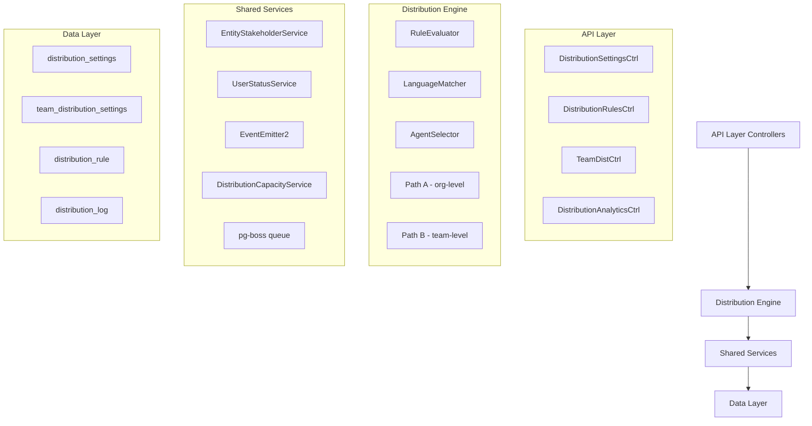

## Overview

The Distribution Module automates lead assignment within organizations. When a new lead is created, the system evaluates org-defined rules to automatically assign the lead to the most appropriate agent — based on lead attributes, UserStatus online/away state, working-hours eligibility, language compatibility, and capacity.

<Note>
This module is **Active** and fully implemented at `src/modules/crm/distribution/`
</Note>

### Design Principles

| Principle | Decision |
|-----------|----------|
| **Async distribution** | `createLead()` emits `LEAD_CREATED` after commit; a pg-boss worker handles distribution. Listener / emit failures are logged only — HTTP lead creation still returns success |
| **Stakeholder system reuse** | Distribution creates `EntityStakeholder` records via `EntityStakeholderService`, not a new paradigm |
| **First-match-wins rules** | Rules are evaluated top-to-bottom by priority; the first matching rule wins |
| **Idempotency** | Distribution engine checks for existing stakeholders or pending offers before running |
| **No retroactive distribution** | Existing leads are unaffected when rules are created; only new leads trigger distribution |
| **Default routing control** | Organizations can disable default routing via `defaultRoutingEnabled` setting |
| **pg-boss scheduling** | Distribution queue uses pg-boss for reliability and retry guarantees |
| **RLS compliance** | All entities carry `organization_id` for row-level security |

### Distribution Paths

The engine supports two execution paths:

<Tabs>
  <Tab title="Path A - Org-level">
    **Org-level distribution** (`runDistribution`): triggered when a lead enters the org with no team context. Evaluates org-scoped rules, applies the org default method, and can bridge to Path B if a rule or default method routes to a team that has `distributionEnabled = true`.
  </Tab>
  <Tab title="Path B - Team-level">
    **Team-level distribution** (`runTeamDistribution`): triggered directly when:
    - A lead is created with a `teamId` in the event payload (team pool assignment)
    - A bulk-imported lead has a team-only assignment
    - Path A determines the lead belongs to an auto-distributing team
    - Idempotency check finds a single team-only stakeholder with auto-distribute enabled
  </Tab>
</Tabs>

## Architecture

### High-Level Diagram



### Component Responsibilities

<AccordionGroup>
  <Accordion title="DistributionEngine">
    Orchestrator: receives a lead, evaluates rules, selects agent, creates assignment. Supports Path A (org) and Path B (team).
  </Accordion>
  
  <Accordion title="RuleEvaluator">
    Evaluates rule conditions against lead data; returns first matching rule
  </Accordion>
  
  <Accordion title="LanguageMatcher">
    Filters and ranks agents by language compatibility with the lead's person
  </Accordion>
  
  <Accordion title="AgentSelector">
    Applies the distribution method (round-robin, weighted, weighted-round-robin, direct) to the filtered agent pool
  </Accordion>
  
  <Accordion title="DistributionCapacityService">
    Two-phase capacity enforcement: Phase 1 `filterByCapacity()` (lead counts vs limits); Phase 2 `confirmCapacityAndAssign()` (advisory locks + atomic stakeholder creation). No entity of its own — queries `entity_stakeholder`.
  </Accordion>
  
  <Accordion title="UserStatusService">
    Pre-filters candidate agents to ONLINE status; filters by per-user working hours (`filterByWorkingHours`); provides `isWithinWorkingHours()` for org-level business hours check.
  </Accordion>
  
  <Accordion title="DistributionListener">
    Listens for `LEAD_CREATED` events and enqueues pg-boss jobs. The handler is fault-isolated (try/catch): settings lookup and enqueue errors are logged and do not fail `POST /v1/leads`.
  </Accordion>
  
  <Accordion title="DistributionJobHandler">
    pg-boss worker that processes distribution jobs
  </Accordion>
</AccordionGroup>

## Entity Specifications

### DistributionSettings (1 per org)

Org-level configuration for the distribution engine. Auto-created with defaults on first access via `getOrgSettingsRaw()`. Unique constraint on `organization_id`.

| Column | Type | Notes |
|--------|------|-------|
| `id` | uuid PK | Primary key |
| `organization_id` | uuid FK UNIQUE | RLS constraint |
| `enabled` | boolean | Default: true |
| `defaultMethod` | enum | RR, WEIGHTED, WRR, DIRECT |
| `defaultRoutingEnabled` | boolean | Default: true |
| `businessHoursEnabled` | boolean | Default: false |
| `businessHoursStart` | time | Default: 09:00 |
| `businessHoursEnd` | time | Default: 17:00 |
| `businessHoursTimezone` | string | Default: UTC |
| `capacityEnabled` | boolean | Default: false |
| `defaultCapacityLimit` | integer | Default: 10 |
| `languageMatchingEnabled` | boolean | Default: false |
| `fallbackToAnyAgent` | boolean | Default: true |
| `retryAttempts` | integer | Default: 3 |
| `retryDelayMs` | integer | Default: 5000 |
| `created_at` | timestamptz | Auto-set |
| `updated_at` | timestamptz | Auto-updated |

### TeamDistributionSettings (0-1 per team)

Team-level overrides for distribution settings. Only created when a team needs custom configuration.

| Column | Type | Notes |
|--------|------|-------|
| `id` | uuid PK | Primary key |
| `team_id` | uuid FK UNIQUE | References team.id |
| `organization_id` | uuid FK | RLS constraint |
| `distributionEnabled` | boolean | Default: false |
| `method` | enum | RR, WEIGHTED, WRR, DIRECT |
| `capacityLimit` | integer | Override org default |
| `created_at` | timestamptz | Auto-set |
| `updated_at` | timestamptz | Auto-updated |

### DistributionRule

Defines conditional routing logic for leads. Rules are evaluated in priority order (lower number = higher priority).

<Warning>
Rules use first-match-wins evaluation - order matters!
</Warning>

| Column | Type | Notes |
|--------|------|-------|
| `id` | uuid PK | Primary key |
| `organization_id` | uuid FK | RLS constraint |
| `name` | varchar(255) | Human-readable name |
| `description` | text | Optional description |
| `priority` | integer | Lower = higher priority |
| `enabled` | boolean | Default: true |
| `conditions` | jsonb | Rule conditions |
| `actions` | jsonb | Assignment actions |
| `created_at` | timestamptz | Auto-set |
| `updated_at` | timestamptz | Auto-updated |

### DistributionLog

Audit trail for all distribution attempts and outcomes.

| Column | Type | Notes |
|--------|------|-------|
| `id` | uuid PK | Primary key |
| `organization_id` | uuid FK | RLS constraint |
| `lead_id` | uuid FK | References lead.id |
| `team_id` | uuid FK | Optional team context |
| `rule_id` | uuid FK | Rule that matched (if any) |
| `assigned_user_id` | uuid FK | Final assignee |
| `method_used` | enum | RR, WEIGHTED, WRR, DIRECT |
| `status` | enum | SUCCESS, FAILED, SKIPPED |
| `reason` | text | Explanation of outcome |
| `metadata` | jsonb | Additional context |
| `created_at` | timestamptz | Auto-set |

## Type Definitions

### Core Types

<CodeGroup>
```typescript Distribution Method
export enum DistributionMethod {
  ROUND_ROBIN = 'ROUND_ROBIN',
  WEIGHTED = 'WEIGHTED', 
  WEIGHTED_ROUND_ROBIN = 'WEIGHTED_ROUND_ROBIN',
  DIRECT = 'DIRECT'
}
```

```typescript Distribution Status
export enum DistributionStatus {
  SUCCESS = 'SUCCESS',
  FAILED = 'FAILED',
  SKIPPED = 'SKIPPED'
}
```

```typescript Rule Condition
export interface RuleCondition {
  field: string;
  operator: 'equals' | 'contains' | 'in' | 'greater_than' | 'less_than';
  value: any;
  logicalOperator?: 'AND' | 'OR';
}
```

```typescript Rule Action
export interface RuleAction {
  type: 'ASSIGN_TO_USER' | 'ASSIGN_TO_TEAM' | 'SET_METHOD';
  value: string | DistributionMethod;
}
```
</CodeGroup>

### Event Payloads

<CodeGroup>
```typescript Lead Created Event
export interface LeadCreatedEventPayload {
  leadId: string;
  organizationId: string;
  teamId?: string; // Team pool assignment
  skipDistribution?: boolean;
  metadata?: Record<string, any>;
}
```

```typescript Distribution Job Data
export interface DistributionJobData {
  leadId: string;
  organizationId: string;
  teamId?: string;
  attempt?: number;
  metadata?: Record<string, any>;
}
```
</CodeGroup>

## Distribution Engine

### Engine Flow

<Steps>
  <Step title="Idempotency Check">
    Verify no existing stakeholders or pending offers for the lead
  </Step>
  
  <Step title="Rule Evaluation">
    Evaluate active rules in priority order, return first match
  </Step>
  
  <Step title="Agent Pool Filtering">
    Filter by online status, working hours, and language compatibility
  </Step>
  
  <Step title="Capacity Filtering">
    Apply capacity limits if enabled
  </Step>
  
  <Step title="Agent Selection">
    Apply distribution method to select final agent
  </Step>
  
  <Step title="Assignment Creation">
    Create EntityStakeholder record with capacity confirmation
  </Step>
  
  <Step title="Audit Logging">
    Record distribution attempt in DistributionLog
  </Step>
</Steps>

### Agent Selection Methods

<Tabs>
  <Tab title="Round Robin">
    Distributes leads sequentially through the agent pool. Uses `lastAssignedIndex` tracking to ensure fair distribution.
    
    ```typescript
    // Pseudo-code
    nextIndex = (lastAssignedIndex + 1) % eligibleAgents.length;
    selectedAgent = eligibleAgents[nextIndex];
    ```
  </Tab>
  
  <Tab title="Weighted">
    Assigns leads based on agent weight values. Higher weights receive proportionally more leads.
    
    ```typescript
    // Weighted random selection
    totalWeight = agents.reduce((sum, agent) => sum + agent.weight, 0);
    randomValue = Math.random() * totalWeight;
    // Select agent based on cumulative weight ranges
    ```
  </Tab>
  
  <Tab title="Weighted Round Robin">
    Combines round-robin fairness with weighted distribution. Agents with higher weights appear more frequently in the rotation.
  </Tab>
  
  <Tab title="Direct">
    Assigns to a specific agent identified in the rule action.
  </Tab>
</Tabs>

### Capacity Management

The capacity system operates in two phases:

<Info>
**Phase 1**: `filterByCapacity()` - Filters agents based on current lead counts vs capacity limits
**Phase 2**: `confirmCapacityAndAssign()` - Uses advisory locks for atomic assignment with capacity verification
</Info>

<CodeGroup>
```sql Advisory Lock Query
SELECT pg_try_advisory_xact_lock(
  ('x' || substr(md5($1::text), 1, 8))::bit(32)::int,
  ('x' || substr(md5($2::text), 1, 8))::bit(32)::int
) as acquired
```

```sql Current Capacity Query
SELECT COUNT(*) as current_count
FROM entity_stakeholder es
WHERE es.user_id = $1
  AND es.entity_type = 'LEAD'
  AND es.stakeholder_type = 'ASSIGNEE'
  AND es.organization_id = $2
```
</CodeGroup>

## pg-boss Job Configuration

### Job Queue Setup

<CodeGroup>
```typescript Queue Configuration
const DISTRIBUTION_QUEUE = 'lead-distribution';

const queueOptions = {
  retryLimit: 3,
  retryDelay: 5000,
  retryBackoff: true,
  expireInHours: 24,
  singletonKey: 'leadId' // Prevent duplicate jobs
};
```

```typescript Job Handler Registration
await this.pgBoss.work(
  DISTRIBUTION_QUEUE,
  { teamSize: 5, teamConcurrency: 1 },
  this.handleDistributionJob.bind(this)
);
```
</CodeGroup>

### Error Handling

<Warning>
Job failures are retried up to 3 times with exponential backoff. After final failure, the job is marked as failed and requires manual intervention.
</Warning>

<Steps>
  <Step title="Attempt 1">
    Immediate execution
  </Step>
  
  <Step title="Attempt 2">
    5 second delay
  </Step>
  
  <Step title="Attempt 3">
    10 second delay (with backoff)
  </Step>
  
  <Step title="Final Failure">
    Job marked as failed, manual assignment needed
  </Step>
</Steps>

## API Endpoints

### Distribution Settings

<AccordionGroup>
  <Accordion title="GET /v1/distribution/settings">
    **Description**: Get org distribution settings
    
    **Response**:
    ```json
    {
      "id": "uuid",
      "enabled": true,
      "defaultMethod": "ROUND_ROBIN",
      "defaultRoutingEnabled": true,
      "businessHoursEnabled": false,
      "capacityEnabled": true,
      "defaultCapacityLimit": 10
    }
    ```
  </Accordion>
  
  <Accordion title="PATCH /v1/distribution/settings">
    **Description**: Update org distribution settings
    
    **Request Body**:
    ```json
    {
      "enabled": true,
      "defaultMethod": "WEIGHTED",
      "capacityEnabled": true,
      "defaultCapacityLimit": 15
    }
    ```
  </Accordion>
</AccordionGroup>

### Distribution Rules

<AccordionGroup>
  <Accordion title="GET /v1/distribution/rules">
    **Description**: List all distribution rules for organization
    
    **Query Parameters**:
    - `enabled?: boolean` - Filter by enabled status
    - `page?: number` - Page number (default: 1)
    - `limit?: number` - Items per page (default: 20)
  </Accordion>
  
  <Accordion title="POST /v1/distribution/rules">
    **Description**: Create new distribution rule
    
    **Request Body**:
    ```json
    {
      "name": "VIP Customers",
      "priority": 1,
      "enabled": true,
      "conditions": [{
        "field": "lead.source",
        "operator": "equals",
        "value": "referral"
      }],
      "actions": [{
        "type": "ASSIGN_TO_TEAM",
        "value": "team-uuid"
      }]
    }
    ```
  </Accordion>
  
  <Accordion title="PUT /v1/distribution/rules/:ruleId">
    **Description**: Update existing distribution rule
  </Accordion>
  
  <Accordion title="DELETE /v1/distribution/rules/:ruleId">
    **Description**: Delete distribution rule
  </Accordion>
</AccordionGroup>

### Team Distribution

<AccordionGroup>
  <Accordion title="GET /v1/teams/:teamId/distribution">
    **Description**: Get team distribution settings
  </Accordion>
  
  <Accordion title="PATCH /v1/teams/:teamId/distribution">
    **Description**: Update team distribution settings
    
    **Request Body**:
    ```json
    {
      "distributionEnabled": true,
      "method": "WEIGHTED",
      "capacityLimit": 20
    }
    ```
  </Accordion>
</AccordionGroup>

### Analytics & Metrics

<AccordionGroup>
  <Accordion title="GET /v1/distribution/analytics/summary">
    **Description**: Get distribution analytics summary
    
    **Response**:
    ```json
    {
      "totalDistributed": 1250,
      "successRate": 0.95,
      "averageAssignmentTime": "2.3s",
      "methodBreakdown": {
        "ROUND_ROBIN": 800,
        "WEIGHTED": 350,
        "DIRECT": 100
      }
    }
    ```
  </Accordion>
  
  <Accordion title="GET /v1/distribution/analytics/agent-performance">
    **Description**: Get per-agent distribution metrics
    
    **Query Parameters**:
    - `startDate: string` - ISO date string
    - `endDate: string` - ISO date string
    - `teamId?: string` - Filter by team
  </Accordion>
</AccordionGroup>

## Security & Permissions

### Row-Level Security (RLS)

All distribution entities enforce RLS based on `organization_id`:

<CodeGroup>
```sql Distribution Settings RLS
CREATE POLICY distribution_settings_org_isolation ON distribution_settings
  FOR ALL TO authenticated
  USING (organization_id = current_setting('app.current_organization_id')::uuid);
```

```sql Distribution Rules RLS  
CREATE POLICY distribution_rules_org_isolation ON distribution_rule
  FOR ALL TO authenticated
  USING (organization_id = current_setting('app.current_organization_id')::uuid);
```

```sql Distribution Log RLS
CREATE POLICY distribution_log_org_isolation ON distribution_log
  FOR ALL TO authenticated  
  USING (organization_id = current_setting('app.current_organization_id')::uuid);
```
</CodeGroup>

### Permission Requirements

| Action | Required Permission |
|--------|-------------------|
| View distribution settings | `distribution:read` |
| Update distribution settings | `distribution:write` |
| Create/edit rules | `distribution_rules:write` |
| View distribution logs | `distribution:audit` |
| Manage team distribution | `teams:write` |

<Note>
Super admins bypass all permission checks but still respect RLS policies.
</Note>

## Observability & Audit

### Logging Strategy

<Tabs>
  <Tab title="Structured Logging">
    All distribution events use structured logging with consistent fields:
    
    ```typescript
    logger.info('Distribution completed', {
      leadId,
      organizationId,
      assignedUserId,
      method: 'ROUND_ROBIN',
      duration: '1.2s',
      ruleId: 'rule-uuid'
    });
    ```
  </Tab>
  
  <Tab title="Error Tracking">
    Distribution failures are logged with full context:
    
    ```typescript
    logger.error('Distribution failed', {
      leadId,
      organizationId,
      error: err.message,
      stack: err.stack,
      attempt: 2,
      eligibleAgents: agents.length
    });
    ```
  </Tab>
</Tabs>

### Audit Trail

The `DistributionLog` entity provides complete audit trail:

- **Success cases**: Records rule matched, method used, assigned agent
- **Failure cases**: Records reason for failure, attempted agents
- **Skip cases**: Records why distribution was skipped

### Metrics Collection

Key metrics tracked:

<CardGroup cols={2}>
  <Card title="Distribution Rate" icon="chart-line">
    Percentage of leads successfully distributed vs failed/skipped
  </Card>
  
  <Card title="Assignment Time" icon="clock">
    Average time from lead creation to agent assignment
  </Card>
  
  <Card title="Agent Workload" icon="users">
    Current and historical lead assignments per agent
  </Card>
  
  <Card title="Rule Effectiveness" icon="bullseye">
    Which rules are matching most frequently
  </Card>
</CardGroup>

## Edge Case Handling

### Common Scenarios

<AccordionGroup>
  <Accordion title="No Eligible Agents">
    **Scenario**: All agents are offline, at capacity, or outside working hours
    
    **Handling**: 
    - Log as FAILED with reason "No eligible agents"
    - Optionally queue for retry during business hours
    - Fallback to manual assignment notification
  </Accordion>
  
  <Accordion title="Capacity Race Conditions">
    **Scenario**: Multiple leads assigned simultaneously could exceed capacity
    
    **Handling**:
    - Use PostgreSQL advisory locks during assignment
    - Re-check capacity after acquiring lock
    - Fail gracefully if capacity exceeded
  </Accordion>
  
  <Accordion title="Rule Conflicts">
    **Scenario**: Multiple rules could match the same lead
    
    **Handling**:
    - First-match-wins based on priority order
    - Clear priority numbering prevents ambiguity
    - Audit log shows which rule was applied
  </Accordion>
  
  <Accordion title="Team Dissolution">
    **Scenario**: Team is deleted while having distribution settings
    
    **Handling**:
    - Cascade delete team distribution settings
    - Update rules that reference the deleted team
    - Fallback to org-level distribution
  </Accordion>
</AccordionGroup>

### Failure Recovery

<Steps>
  <Step title="Automatic Retry">
    pg-boss automatically retries failed jobs up to 3 times
  </Step>
  
  <Step title="Manual Assignment">
    Failed distributions can be manually assigned through the UI
  </Step>
  
  <Step title="Bulk Reassignment">
    Admin tools for bulk reassignment of failed distributions
  </Step>
  
  <Step title="Rule Adjustment">
    Analyze failure patterns and adjust rules accordingly
  </Step>
</Steps>

## Performance & Scaling

### Optimization Strategies

<Tip>
The distribution engine is optimized for high-throughput lead processing with several performance considerations:
</Tip>

<AccordionGroup>
  <Accordion title="Database Indexing">
    Key indexes for performance:
    
    ```sql
    -- Fast rule lookups
    CREATE INDEX idx_distribution_rule_org_priority 
    ON distribution_rule(organization_id, priority, enabled);
    
    -- Agent capacity queries  
    CREATE INDEX idx_entity_stakeholder_capacity
    ON entity_stakeholder(user_id, entity_type, stakeholder_type, organization_id);
    
    -- Distribution log queries
    CREATE INDEX idx_distribution_log_lead_org
    ON distribution_log(lead_id, organization_id, created_at);
    ```
  </Accordion>
  
  <Accordion title="Connection Pooling">
    - pg-boss uses dedicated connection pool
    - Distribution queries use read replicas when available
    - Advisory locks use primary database connection
  </Accordion>
  
  <Accordion title="Caching Strategy">
    - Distribution settings cached for 5 minutes
    - Agent status cached for 30 seconds  
    - Rule evaluations cached per request context
  </Accordion>
  
  <Accordion title="Async Processing">
    - All distribution happens asynchronously via pg-boss
    - Bulk operations use batch job enqueueing
    - No blocking operations in lead creation API
  </Accordion>
</AccordionGroup>

### Scaling Considerations

| Metric | Threshold | Action |
|--------|-----------|--------|
| **Queue Depth** | >1000 pending | Scale worker instances |
| **Assignment Time** | >10 seconds | Review rule complexity |
| **Failure Rate** | >5% | Investigate agent availability |
| **DB Connection Usage** | >80% | Scale connection pool |

## Module Structure

```
src/modules/crm/distribution/
├── controllers/
│   ├── distribution-settings.controller.ts
│   ├── distribution-rules.controller.ts  
│   ├── team-distribution.controller.ts
│   └── distribution-analytics.controller.ts
├── services/
│   ├── distribution.engine.ts
│   ├── distribution-settings.service.ts
│   ├── distribution-rules.service.ts
│   ├── distribution-capacity.service.ts
│   ├── rule-evaluator.service.ts
│   ├── language-matcher.service.ts
│   └── agent-selector.service.ts
├── entities/
│   ├── distribution-settings.entity.ts
│   ├── team-distribution-settings.entity.ts
│   ├── distribution-rule.entity.ts
│   └── distribution-log.entity.ts
├── listeners/
│   └── distribution.listener.ts
├── jobs/
│   └── distribution-job.handler.ts
├── dto/
│   ├── distribution-settings.dto.ts
│   ├── distribution-rule.dto.ts
│   └── distribution-analytics.dto.ts
├── types/
│   └── distribution.types.ts
└── distribution.module.ts
```

## Integration Points

### External Dependencies

<CardGroup cols={2}>
  <Card title="EntityStakeholder Module" icon="link">
    Creates assignment records via `EntityStakeholderService`
  </Card>
  
  <Card title="User Status Module" icon="wifi">
    Filters agents by online status and working hours
  </Card>
  
  <Card title="Team Module" icon="users">
    Team membership and settings integration
  </Card>
  
  <Card title="Lead Module" icon="user-plus">
    Listens for `LEAD_CREATED` events to trigger distribution
  </Card>
</CardGroup>

### Event System Integration

<CodeGroup>
```typescript Event Emission
// Lead creation emits distribution trigger
this.eventEmitter.emit('LEAD_CREATED', {
  leadId: lead.id,
  organizationId: lead.organizationId,
  teamId: lead.teamId, // Optional team context
  metadata: { source: 'api' }
});
```

```typescript Event Listening
@OnEvent('LEAD_CREATED')
async handleLeadCreated(payload: LeadCreatedEventPayload) {
  try {
    await this.distributionJobHandler.enqueue(payload);
  } catch (error) {
    this.logger.error('Failed to enqueue distribution job', {
      leadId: payload.leadId,
      error: error.message
    });
    // Don't throw - lead creation should still succeed
  }
}
```
</CodeGroup>

## Environment Configuration

### Required Environment Variables

<CodeGroup>
```bash Production
# Distribution settings
DISTRIBUTION_ENABLED=true
DISTRIBUTION_WORKER_CONCURRENCY=5
DISTRIBUTION_RETRY_ATTEMPTS=3
DISTRIBUTION_RETRY_DELAY_MS=5000

# Capacity management
DISTRIBUTION_CAPACITY_LOCK_TIMEOUT_MS=10000

# Business hours
DEFAULT_BUSINESS_HOURS_START=09:00
DEFAULT_BUSINESS_HOURS_END=17:00
DEFAULT_BUSINESS_HOURS_TIMEZONE=UTC
```

```bash Development
# Distribution settings
DISTRIBUTION_ENABLED=true
DISTRIBUTION_WORKER_CONCURRENCY=1
DISTRIBUTION_RETRY_ATTEMPTS=1
DISTRIBUTION_RETRY_DELAY_MS=1000

# Debug settings
DISTRIBUTION_DEBUG_LOGGING=true
DISTRIBUTION_SIMULATE_FAILURES=false
```
</CodeGroup>

### Feature Flags

| Flag | Default | Description |
|------|---------|-------------|
| `ENABLE_DISTRIBUTION_ANALYTICS` | `true` | Enable analytics endpoints |
| `ENABLE_CAPACITY_MANAGEMENT` | `true` | Enable capacity-based filtering |
| `ENABLE_WORKING_HOURS` | `true` | Enable working hours filtering |
| `ENABLE_LANGUAGE_MATCHING` | `false` | Enable language-based agent matching |

<Check>
The Distribution Module is production-ready and handles enterprise-scale lead routing with comprehensive audit trails and performance optimizations.
</Check>