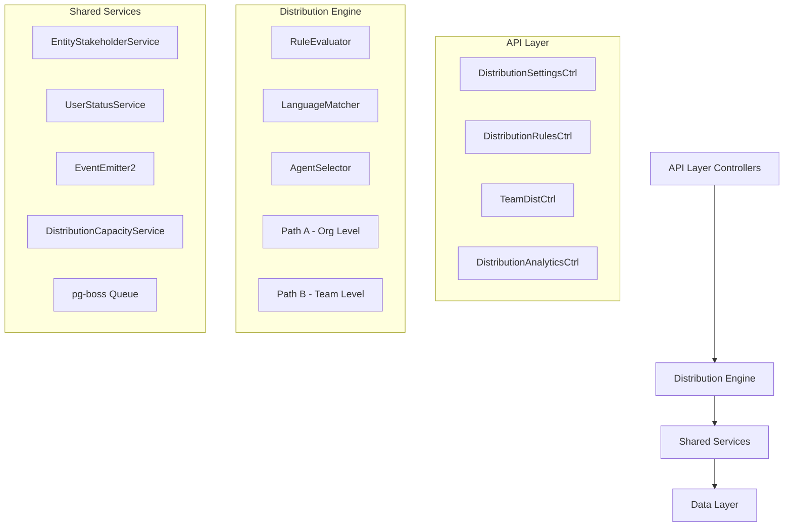

## Overview

The Distribution Module automates lead assignment within organizations. When a new lead is created, the system evaluates org-defined rules to automatically assign the lead to the most appropriate agent — based on lead attributes, UserStatus online/away state, working-hours eligibility, language compatibility, and capacity.

<Info>
**Status:** Active — fully implemented  
**Module Path:** `src/modules/crm/distribution/`
</Info>

### Design Principles

<CardGroup cols={2}>
<Card title="Async Distribution" icon="clock">
`createLead()` emits `LEAD_CREATED` after commit; a pg-boss worker handles distribution
</Card>
<Card title="Stakeholder System Reuse" icon="users">
Distribution creates `EntityStakeholder` records via `EntityStakeholderService`
</Card>
<Card title="First-Match-Wins Rules" icon="target">
Rules are evaluated top-to-bottom by priority; the first matching rule wins
</Card>
<Card title="Idempotency" icon="check-double">
Distribution engine checks for existing stakeholders or pending offers before running
</Card>
</CardGroup>

<Note>
No retroactive distribution: Existing leads are unaffected when rules are created; only new leads trigger distribution
</Note>

### Distribution Paths

The engine supports two execution paths:

<Tabs>
<Tab title="Path A — Org-level">
**Org-level distribution** (`runDistribution`): triggered when a lead enters the org with no team context. Evaluates org-scoped rules, applies the org default method, and can bridge to Path B if a rule or default method routes to a team that has `distributionEnabled = true`.
</Tab>
<Tab title="Path B — Team-level">
**Team-level distribution** (`runTeamDistribution`): triggered directly when:
- A lead is created with a `teamId` in the event payload (team pool assignment)
- A bulk-imported lead has a team-only assignment
- Path A determines the lead belongs to an auto-distributing team
- Idempotency check finds a single team-only stakeholder with auto-distribute enabled
</Tab>
</Tabs>

## Architecture

### High-Level Diagram



### Component Responsibilities

| Component | Responsibility |
|-----------|----------------|
| **DistributionEngine** | Orchestrator: receives a lead, evaluates rules, selects agent, creates assignment. Supports Path A (org) and Path B (team) |
| **RuleEvaluator** | Evaluates rule conditions against lead data; returns first matching rule |
| **LanguageMatcher** | Filters and ranks agents by language compatibility with the lead's person |
| **AgentSelector** | Applies the distribution method (round-robin, weighted, weighted-round-robin, direct) to the filtered agent pool |
| **DistributionCapacityService** | Two-phase capacity enforcement with advisory locks and atomic stakeholder creation |
| **UserStatusService** | Pre-filters candidate agents to ONLINE status and working hours eligibility |

## Entity Specifications

### DistributionSettings (1 per org)

Org-level configuration for the distribution engine. Auto-created with defaults on first access via `getOrgSettingsRaw()`.

<AccordionGroup>
<Accordion title="Schema Definition">
| Column | Type | Notes |
|--------|------|-------|
| id | uuid PK | |
| organization_id | uuid FK UNIQUE | RLS |
| distribution_enabled | bool | default `false`. Master on/off switch |
| max_active_leads_per_agent | int | default 50 |
| max_new_leads_per_day | int | default 20 |
| default_distribution_method | enum | `ROUND_ROBIN`, `WEIGHTED`, `WEIGHTED_ROUND_ROBIN` |
| business_hours_start | time | default `09:00:00` |
| business_hours_end | time | default `17:00:00` |
| business_hours_timezone | varchar | default `UTC` |
| business_days | int[] | default `[1,2,3,4,5]` (Mon-Fri) |
| enforce_business_hours | bool | default `false` |
| enforce_agent_working_hours | bool | default `false` |
| created_at | timestamptz | |
| updated_at | timestamptz | |
</Accordion>
</AccordionGroup>

### TeamDistributionSettings (1 per team)

Team-level overrides for distribution settings.

<AccordionGroup>
<Accordion title="Schema Definition">
| Column | Type | Notes |
|--------|------|-------|
| id | uuid PK | |
| organization_id | uuid FK | RLS |
| team_id | uuid FK UNIQUE | |
| distribution_enabled | bool | default `false` |
| distribution_method | enum | Overrides org default |
| max_active_leads_per_agent | int | null = inherit from org |
| max_new_leads_per_day | int | null = inherit from org |
| created_at | timestamptz | |
| updated_at | timestamptz | |
</Accordion>
</AccordionGroup>

### DistributionRule

Rules for automatic lead routing based on conditions.

<AccordionGroup>
<Accordion title="Schema Definition">
| Column | Type | Notes |
|--------|------|-------|
| id | uuid PK | |
| organization_id | uuid FK | RLS |
| name | varchar(255) | |
| description | text | nullable |
| priority | int | Lower = higher priority |
| is_active | bool | default `true` |
| conditions | jsonb | Rule matching conditions |
| action_type | enum | `ASSIGN_TO_TEAM`, `ASSIGN_TO_AGENT` |
| action_target_id | uuid | Team or Agent ID |
| created_at | timestamptz | |
| updated_at | timestamptz | |
</Accordion>
</AccordionGroup>

### DistributionLog

Audit trail of distribution decisions and outcomes.

<AccordionGroup>
<Accordion title="Schema Definition">
| Column | Type | Notes |
|--------|------|-------|
| id | uuid PK | |
| organization_id | uuid FK | RLS |
| lead_id | uuid FK | |
| team_id | uuid FK | nullable, Path B context |
| assigned_to_user_id | uuid FK | nullable if no assignment |
| distribution_method | enum | Method used |
| rule_id | uuid FK | nullable if fallback |
| execution_path | enum | `ORG_LEVEL`, `TEAM_LEVEL` |
| status | enum | `SUCCESS`, `NO_ELIGIBLE_AGENTS`, `CAPACITY_EXCEEDED`, `ERROR` |
| agent_pool_size | int | Candidates before selection |
| error_message | text | nullable |
| processing_duration_ms | int | Performance tracking |
| created_at | timestamptz | |
</Accordion>
</AccordionGroup>

## Distribution Engine

The core distribution logic is implemented in the `DistributionEngine` service with support for both organizational and team-level distribution paths.

### Rule Evaluation

<Steps>
<Step title="Fetch Active Rules">
Query `distribution_rule` table ordered by priority (ascending)
</Step>
<Step title="Evaluate Conditions">
For each rule, check if lead data matches all conditions in the rule's `conditions` JSON
</Step>
<Step title="Apply First Match">
Return the first rule that matches all conditions (first-match-wins)
</Step>
<Step title="Fallback Handling">
If no rules match, use organization's default distribution method
</Step>
</Steps>

### Agent Selection Methods

<Tabs>
<Tab title="Round Robin">
```typescript
// Selects next agent in rotation based on last assignment
async selectRoundRobin(agents: User[], context: SelectionContext): Promise<User>
```
</Tab>
<Tab title="Weighted">
```typescript
// Selects agent based on weighted random selection
async selectWeighted(agents: User[], context: SelectionContext): Promise<User>
```
</Tab>
<Tab title="Weighted Round Robin">
```typescript
// Combines round-robin fairness with weighted preferences
async selectWeightedRoundRobin(agents: User[], context: SelectionContext): Promise<User>
```
</Tab>
<Tab title="Direct Assignment">
```typescript
// Direct assignment to specific agent (from rule action)
async selectDirect(targetUserId: string, context: SelectionContext): Promise<User>
```
</Tab>
</Tabs>

### Capacity Management

The distribution system enforces capacity limits through a two-phase approach:

<Warning>
Phase 1 performs filtering based on current lead counts, while Phase 2 uses advisory locks for atomic capacity checking and assignment creation.
</Warning>

<CodeGroup>
```typescript Phase 1 - Filtering
async filterByCapacity(
  agents: User[], 
  maxActive: number, 
  maxDaily: number
): Promise<User[]> {
  // Filter out agents at capacity limits
}
```

```typescript Phase 2 - Atomic Assignment
async confirmCapacityAndAssign(
  selectedAgent: User,
  lead: Lead,
  context: AssignmentContext
): Promise<EntityStakeholder> {
  // Use advisory locks for atomic check + assignment
}
```
</CodeGroup>

## API Endpoints

### Distribution Settings

<AccordionGroup>
<Accordion title="GET /v1/organizations/{orgId}/distribution/settings">
**Description:** Get organization distribution settings

**Response:**
```json
{
  "id": "uuid",
  "distributionEnabled": true,
  "maxActiveLeadsPerAgent": 50,
  "maxNewLeadsPerDay": 20,
  "defaultDistributionMethod": "ROUND_ROBIN",
  "businessHours": {
    "start": "09:00:00",
    "end": "17:00:00",
    "timezone": "UTC",
    "days": [1, 2, 3, 4, 5]
  },
  "enforceBusinessHours": false,
  "enforceAgentWorkingHours": false
}
```
</Accordion>

<Accordion title="PUT /v1/organizations/{orgId}/distribution/settings">
**Description:** Update organization distribution settings

**Request Body:**
```json
{
  "distributionEnabled": true,
  "maxActiveLeadsPerAgent": 75,
  "defaultDistributionMethod": "WEIGHTED"
}
```
</Accordion>
</AccordionGroup>

### Distribution Rules

<AccordionGroup>
<Accordion title="GET /v1/organizations/{orgId}/distribution/rules">
**Description:** List distribution rules for organization

**Query Parameters:**
- `page` (optional): Page number
- `limit` (optional): Results per page
- `isActive` (optional): Filter by active status

**Response:**
```json
{
  "data": [
    {
      "id": "uuid",
      "name": "High Value Leads",
      "priority": 1,
      "isActive": true,
      "conditions": {
        "lead_value": { "gte": 10000 }
      },
      "actionType": "ASSIGN_TO_TEAM",
      "actionTargetId": "team-uuid"
    }
  ],
  "pagination": {
    "page": 1,
    "limit": 20,
    "total": 5
  }
}
```
</Accordion>

<Accordion title="POST /v1/organizations/{orgId}/distribution/rules">
**Description:** Create new distribution rule

**Request Body:**
```json
{
  "name": "Enterprise Leads",
  "description": "Route enterprise leads to senior team",
  "priority": 1,
  "conditions": {
    "company_size": { "gte": 1000 }
  },
  "actionType": "ASSIGN_TO_TEAM",
  "actionTargetId": "senior-team-uuid"
}
```
</Accordion>
</AccordionGroup>

### Team Distribution

<AccordionGroup>
<Accordion title="GET /v1/teams/{teamId}/distribution">
**Description:** Get team distribution settings

**Response:**
```json
{
  "id": "uuid",
  "teamId": "uuid",
  "distributionEnabled": true,
  "distributionMethod": "WEIGHTED_ROUND_ROBIN",
  "maxActiveLeadsPerAgent": 60,
  "maxNewLeadsPerDay": 25
}
```
</Accordion>

<Accordion title="PUT /v1/teams/{teamId}/distribution">
**Description:** Update team distribution settings

**Request Body:**
```json
{
  "distributionEnabled": true,
  "distributionMethod": "ROUND_ROBIN",
  "maxActiveLeadsPerAgent": 40
}
```
</Accordion>
</AccordionGroup>

## Security & Permissions

### Row-Level Security (RLS)

All distribution entities implement RLS policies based on `organization_id`:

<CodeGroup>
```sql Distribution Settings Policy
CREATE POLICY distribution_settings_org_isolation ON distribution_settings
  FOR ALL USING (organization_id = current_setting('app.current_organization_id')::uuid);
```

```sql Distribution Rules Policy  
CREATE POLICY distribution_rules_org_isolation ON distribution_rule
  FOR ALL USING (organization_id = current_setting('app.current_organization_id')::uuid);
```

```sql Team Distribution Policy
CREATE POLICY team_distribution_org_isolation ON team_distribution_settings
  FOR ALL USING (organization_id = current_setting('app.current_organization_id')::uuid);
```
</CodeGroup>

### Permission Requirements

| Action | Required Permission |
|--------|-------------------|
| View distribution settings | `READ_DISTRIBUTION_SETTINGS` |
| Update distribution settings | `MANAGE_DISTRIBUTION_SETTINGS` |
| Create/edit distribution rules | `MANAGE_DISTRIBUTION_RULES` |
| View distribution analytics | `READ_DISTRIBUTION_ANALYTICS` |
| Manage team distribution | `MANAGE_TEAM_DISTRIBUTION` |

## Analytics & Metrics

### Distribution Analytics

<Tabs>
<Tab title="Assignment Metrics">
- Total assignments by period
- Assignment success rate
- Average processing time
- Capacity utilization
</Tab>
<Tab title="Agent Performance">
- Leads per agent
- Distribution fairness score
- Agent utilization rates
- Capacity breach frequency
</Tab>
<Tab title="Rule Effectiveness">
- Rule match frequency
- Rule processing time
- Fallback usage rate
- Rule coverage analysis
</Tab>
</Tabs>

### Key Performance Indicators

<CardGroup cols={2}>
<Card title="Assignment Success Rate" icon="percent">
Percentage of leads successfully assigned vs. total distribution attempts
</Card>
<Card title="Distribution Fairness" icon="balance-scale">
Coefficient of variation in lead distribution across eligible agents
</Card>
<Card title="Processing Latency" icon="clock">
Average time from lead creation to assignment completion
</Card>
<Card title="Capacity Utilization" icon="chart-bar">
Percentage of agent capacity currently utilized across teams
</Card>
</CardGroup>

## Edge Case Handling

### No Eligible Agents

<Steps>
<Step title="Check Agent Availability">
If no agents are online or within working hours, log `NO_ELIGIBLE_AGENTS` status
</Step>
<Step title="Capacity Constraints">
If all agents are at capacity limits, log `CAPACITY_EXCEEDED` status
</Step>
<Step title="Manual Assignment">
Lead remains unassigned and requires manual intervention
</Step>
<Step title="Notification">
System can optionally notify administrators of unassigned leads
</Step>
</Steps>

### Rule Conflicts

<Warning>
Rules are evaluated in priority order (ascending). The first matching rule wins, preventing conflicts.
</Warning>

### Business Hours Violations

When `enforceBusinessHours` is enabled:
- Leads created outside business hours are queued
- Distribution occurs when business hours resume
- Critical leads can bypass business hours via rule conditions

## Performance & Scaling

### Database Optimization

<AccordionGroup>
<Accordion title="Indexing Strategy">
```sql
-- Critical indexes for distribution performance
CREATE INDEX CONCURRENTLY idx_distribution_rule_org_priority 
  ON distribution_rule(organization_id, priority) 
  WHERE is_active = true;

CREATE INDEX CONCURRENTLY idx_distribution_log_lead_created 
  ON distribution_log(lead_id, created_at);

CREATE INDEX CONCURRENTLY idx_entity_stakeholder_capacity_check
  ON entity_stakeholder(user_id, entity_type, created_at)
  WHERE role = 'ASSIGNEE';
```
</Accordion>

<Accordion title="Query Optimization">
- Use prepared statements for rule evaluation
- Implement query result caching for settings
- Batch capacity checks when possible
- Optimize agent eligibility queries
</Accordion>
</AccordionGroup>

### Scaling Considerations

<Tip>
The pg-boss queue system provides natural horizontal scaling capabilities. Additional worker processes can be spawned to handle increased distribution load.
</Tip>

**Queue Configuration:**
```typescript
{
  retryLimit: 3,
  retryDelay: 30,
  retryBackoff: true,
  expireInSeconds: 300
}
```

## Module Structure

```
src/modules/crm/distribution/
├── controllers/
│   ├── distribution-settings.controller.ts
│   ├── distribution-rules.controller.ts
│   ├── team-distribution.controller.ts
│   └── distribution-analytics.controller.ts
├── entities/
│   ├── distribution-settings.entity.ts
│   ├── team-distribution-settings.entity.ts
│   ├── distribution-rule.entity.ts
│   └── distribution-log.entity.ts
├── services/
│   ├── distribution-engine.service.ts
│   ├── rule-evaluator.service.ts
│   ├── agent-selector.service.ts
│   ├── language-matcher.service.ts
│   ├── distribution-capacity.service.ts
│   └── distribution-analytics.service.ts
├── listeners/
│   └── distribution.listener.ts
├── jobs/
│   └── distribution-job.handler.ts
├── types/
│   └── distribution.types.ts
├── dto/
│   ├── distribution-settings.dto.ts
│   ├── distribution-rule.dto.ts
│   └── team-distribution.dto.ts
└── distribution.module.ts
```

## Integration Points

### Event System

<CodeGroup>
```typescript Lead Created Event
// Emitted after lead creation
{
  type: 'LEAD_CREATED',
  payload: {
    leadId: 'uuid',
    organizationId: 'uuid', 
    teamId?: 'uuid', // Optional team context
    skipDistribution?: boolean
  }
}
```

```typescript Distribution Complete Event  
// Emitted after successful assignment
{
  type: 'LEAD_DISTRIBUTED',
  payload: {
    leadId: 'uuid',
    assignedToUserId: 'uuid',
    distributionMethod: 'ROUND_ROBIN',
    executionPath: 'ORG_LEVEL'
  }
}
```
</CodeGroup>

### External Dependencies

| Service | Usage | Fallback Behavior |
|---------|-------|-------------------|
| UserStatusService | Agent availability checking | Assume offline if service unavailable |
| EntityStakeholderService | Assignment creation | Fail distribution attempt |
| TeamService | Team membership validation | Skip team-based rules |
| UserService | Agent profile and language data | Use cached data if available |

---

<Check>
The Distribution Module provides comprehensive automated lead assignment with robust fallback mechanisms, detailed audit trails, and flexible rule-based routing to optimize lead handling efficiency across organizations.
</Check>