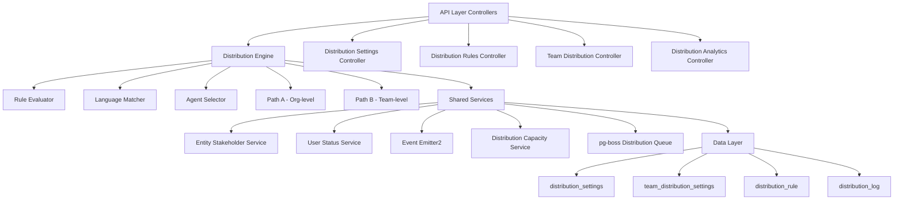

The Distribution Module automates lead assignment within organizations. When a new lead is created, the system evaluates org-defined rules to automatically assign the lead to the most appropriate agent — based on lead attributes, agent availability, language compatibility, and capacity.

## Overview

<Note>
The Distribution Module is fully implemented with **Active** status located at `src/modules/crm/distribution/`
</Note>

### Design Principles

| Principle | Decision |
|-----------|----------|
| Async distribution | `createLead()` emits `LEAD_CREATED`; a pg-boss worker handles distribution — lead creation is never blocked |
| Stakeholder system reuse | Distribution creates `EntityStakeholder` records via `EntityStakeholderService`, not a new paradigm |
| First-match-wins rules | Rules are evaluated top-to-bottom by priority; the first matching rule wins |
| Idempotency | Distribution engine checks for existing stakeholders or pending offers before running |
| No retroactive distribution | Existing leads are unaffected when rules are created; only new leads trigger distribution |
| pg-boss scheduling | Distribution queue uses pg-boss for reliability and retry guarantees |
| RLS compliance | All entities carry `organization_id` for row-level security |

### Distribution Paths

The engine supports two execution paths:

<Tabs>
<Tab title="Path A — Org-level distribution">
**Trigger:** When a lead enters the org with no team context

- Evaluates org-scoped rules
- Applies the org default method
- Can bridge to Path B if a rule or default method routes to a team that has `distributionEnabled = true`

Function: `runDistribution`
</Tab>
<Tab title="Path B — Team-level distribution">
**Trigger:** Direct activation when:
- A lead is created with a `teamId` in the event payload (team pool assignment)
- Path A determines the lead belongs to an auto-distributing team
- Idempotency check finds a single team-only stakeholder with auto-distribute enabled

Function: `runTeamDistribution`

Evaluates team-scoped rules, uses team settings (with org fallback for capacity), and logs the team FK on the resulting `DistributionLog` record.
</Tab>
</Tabs>

## Architecture

### High-level diagram



### Component responsibilities

| Component | Responsibility |
|-----------|----------------|
| **DistributionEngine** | Orchestrator: receives a lead, evaluates rules, selects agent, creates assignment. Supports Path A (org) and Path B (team). |
| **RuleEvaluator** | Evaluates rule conditions against lead data; returns first matching rule |
| **LanguageMatcher** | Filters and ranks agents by language compatibility with the lead's person |
| **AgentSelector** | Applies the distribution method (round-robin, weighted, weighted-round-robin, direct) to the filtered agent pool |
| **DistributionCapacityService** | Two-phase capacity enforcement: Phase 1 `filterByCapacity()` (lead counts vs limits); Phase 2 `confirmCapacityAndAssign()` (advisory locks + atomic stakeholder creation). No entity of its own — queries `entity_stakeholder`. |
| **UserStatusService** | Pre-filters candidate agents to ONLINE status; filters by per-user working hours (`filterByWorkingHours`); provides `isWithinWorkingHours()` for org-level business hours check. |
| **DistributionListener** | Listens for `LEAD_CREATED` events and enqueues pg-boss jobs |
| **DistributionJobHandler** | pg-boss worker that processes distribution jobs |

## Entity specifications

### DistributionSettings (1 per org)

<Info>
Org-level configuration for the distribution engine. Auto-created with defaults on first access via `getOrgSettingsRaw()`. Unique constraint on `organization_id`.
</Info>

| Column | Type | Notes |
|--------|------|-------|
| id | uuid PK | |
| organization_id | uuid FK UNIQUE | RLS |
| distribution_enabled | bool | default `false`. Master on/off switch — when `false`, no pg-boss jobs are enqueued. |
| max_active_leads_per_agent | int | default 50 |
| max_new_leads_per_day | int | default 15 |
| capacity_enforcement_enabled | bool | default `false` |
| respect_business_hours | bool | default `true`. Gating uses `Organization.settings.businessHours`; both `businessHours.enabled` AND this flag must be `true` for BH gating to apply. |
| outside_hours_action | enum | `QUEUE`, `POOL`, `DUTY_AGENT` |
| duty_agent_id | uuid FK nullable | used when `outside_hours_action = DUTY_AGENT` |
| default_method | enum | `ROUND_ROBIN`, `POOL`, `SPECIFIC_TEAM` |
| default_team_id | uuid FK nullable | used when `default_method = SPECIFIC_TEAM` |
| default_language_matching_mode | enum | `STRICT`, `PREFERRED` |
| default_balancing_factors | jsonb nullable | Optional balancing configuration |
| pool_alert_enabled | bool | Whether to send pool-overload alerts |
| pool_alert_threshold | int | Lead count that triggers an alert |
| pool_alert_window_minutes | int | Rolling window for counting unassigned leads |
| updated_by | uuid FK nullable | |
| created_at, updated_at | timestamp | |

<Warning>
**Master toggle behavior:**
- `distributionEnabled = false` (new-org default): Engine is off. `DistributionListener` and `LeadImportService` skip enqueue entirely — leads go to pool, no pg-boss jobs created.
- `distributionEnabled = true`: Engine is active. When toggled from `false` → `true` in `DistributionSettingsService.update()`, if `defaultMethod` is still `POOL` it is auto-upgraded to `ROUND_ROBIN` for a smooth first-run experience.
</Warning>

<Note>
**Business hours source:** Business hours schedule (timezone, weekly slots, enabled flag) is stored on `Organization.settings.businessHours` (`BusinessHoursConfig`), not on `DistributionSettings`. The `respectBusinessHours` field on this entity only controls whether the distribution engine gates against that org-level schedule.
</Note>

### TeamDistributionSettings (1 per org+team)

Per-team distribution configuration. One record per `(organization, team)` pair — unique index `uq_team_distribution_settings_org_team`. Auto-created on first access.

| Column | Type | Notes |
|--------|------|-------|
| id | uuid PK | |
| organization_id | uuid FK | RLS |
| team_id | uuid FK | (required, not nullable) |
| distribution_enabled | bool | default `false`. When `true`, leads in this team's pool are auto-distributed via Path B. |
| distribution_method | enum | default `ROUND_ROBIN`. Method for this team's auto-distribution. |
| agent_weights | jsonb nullable | `{ [userId]: weight }` — used with WEIGHTED method |
| language_matching_enabled | bool | default `false` |
| language_matching_mode | enum nullable | Language matching mode override |
| capacity_enforcement_enabled | bool | default `false`. Independent from org toggle. |
| max_active_leads_per_agent | int nullable | `null` = inherit from org settings |
| max_new_leads_per_day | int nullable | `null` = inherit from org settings |
| respect_business_hours | bool | default `false`. Whether BH gating applies for this team's distributions. |
| last_assigned_index | int | default 0. Round-robin cursor for the team-fallback path (no matching team rule). Atomically incremented. |
| default_balancing_factors | jsonb nullable | |
| updated_by | uuid FK nullable | |
| created_at, updated_at | timestamp | |

**Effective capacity resolution** (`DistributionSettingsService.resolveEffectiveCapacity`):

```typescript
if (team.capacityEnforcementEnabled) {
  maxActive = team.maxActiveLeadsPerAgent ?? org.maxActiveLeadsPerAgent
  maxDaily  = team.maxNewLeadsPerDay ?? org.maxNewLeadsPerDay
} else {
  // no capacity checks applied for this team's distributions
}
```

### DistributionRule

<Info>
Rules are evaluated in ascending `priority` order (lower number = higher priority). First match wins.
</Info>

| Column | Type | Notes |
|--------|------|-------|
| id | uuid PK | |
| organization_id | uuid FK | RLS |
| name | varchar | |
| priority | int | lower = higher priority |
| is_active | bool | default true |
| scope | enum | `ORGANIZATION`, `TEAM` |
| team_id | uuid FK nullable | for team-scoped rules |
| condition_groups | jsonb | `[{conditions:[{field,operator,value}]}]` — AND-within-OR groups |
| method | enum | `ROUND_ROBIN`, `WEIGHTED`, `WEIGHTED_ROUND_ROBIN`, `DIRECT` |
| recipients | jsonb | `{agentIds?, teamId?, poolId?, weights?}` |
| language_matching_enabled | bool | default true |
| language_matching_mode | enum | `STRICT`, `PREFERRED` |
| balancing_factors | jsonb nullable | Optional balancing configuration |
| last_assigned_index | int | round-robin cursor; updated atomically |
| created_by | uuid FK | |
| created_at, updated_at | timestamp | |
| is_deleted | bool | soft delete |

#### Rule conditions — Supported fields

| Field | Operator(s) | Example Value |
|-------|-------------|---------------|
| `leadSource` | `eq`, `in` | `'WEBSITE'`, `['WEBSITE', 'REFERRAL']` |
| `temperature` | `eq`, `in` | `'HOT'` |
| `language` | `eq` | `'ar'` (matched against `person.languages[].code`) |
| `budget` | `gte`, `lte`, `between` | `500000` |
| `tags` | `contains` | `['vip']` |
| `sourceChannel` | `eq`, `in` | `'WHATSAPP'` |
| `intent` | `eq` | `'BUY'` |
| `area` | `eq`, `in`, `contains` | `'Dubai Marina'`, `['JBR', 'Downtown Dubai']` |

<Note>
All string-based condition fields use **case-insensitive matching**. The `area` field requires data from `LeadPropertyInterest.preferredAreas[]` — the engine pre-loads the lead's property interests before evaluation.
</Note>

## Type definitions

### Core enums

```typescript
enum DistributionMethod {
  ROUND_ROBIN = 'ROUND_ROBIN',
  WEIGHTED = 'WEIGHTED',
  WEIGHTED_ROUND_ROBIN = 'WEIGHTED_ROUND_ROBIN',
  DIRECT = 'DIRECT',
  POOL = 'POOL',
  SPECIFIC_TEAM = 'SPECIFIC_TEAM'
}

enum OutsideHoursAction {
  QUEUE = 'QUEUE',
  POOL = 'POOL', 
  DUTY_AGENT = 'DUTY_AGENT'
}

enum LanguageMatchingMode {
  STRICT = 'STRICT',
  PREFERRED = 'PREFERRED'
}

enum RuleScope {
  ORGANIZATION = 'ORGANIZATION',
  TEAM = 'TEAM'
}
```

### Distribution context

```typescript
interface DistributionContext {
  lead: LeadEntity;
  organization: OrganizationEntity;
  person?: PersonEntity;
  propertyInterests?: LeadPropertyInterestEntity[];
  teamId?: string; // Path B context
  sourceEvent?: 'LEAD_CREATED' | 'TEAM_ASSIGNMENT';
  skipBusinessHours?: boolean;
}
```

### Rule evaluation

```typescript
interface RuleConditionGroup {
  conditions: RuleCondition[];
}

interface RuleCondition {
  field: string;
  operator: 'eq' | 'in' | 'gte' | 'lte' | 'between' | 'contains';
  value: any;
}

interface RuleRecipients {
  agentIds?: string[];
  teamId?: string;
  poolId?: string;
  weights?: Record<string, number>;
}
```

## Distribution engine

### Core workflow

<Steps>
<Step title="Entry point validation">
The engine receives a `DistributionContext` and performs initial validation:
- Check for existing stakeholders (idempotency)
- Validate lead state and organization settings
- Determine distribution path (A or B)
</Step>

<Step title="Business hours gating">
If `respectBusinessHours` is enabled and the organization is outside business hours:
- **QUEUE**: Schedule distribution for next business day
- **POOL**: Send lead to pool immediately
- **DUTY_AGENT**: Assign to designated duty agent
</Step>

<Step title="Rule evaluation">
Evaluate applicable rules in priority order:
- Load org-scoped rules (Path A) or team-scoped rules (Path B)
- Check rule conditions against lead data
- Return first matching rule or fall back to default method
</Step>

<Step title="Agent selection">
Apply the distribution method to filtered agent pool:
- Filter by online status and working hours
- Apply language matching if enabled
- Enforce capacity limits if configured
- Select agent using specified method
</Step>

<Step title="Assignment creation">
Create the final assignment:
- Generate `EntityStakeholder` record
- Log distribution activity
- Emit assignment events
</Step>
</Steps>

### Agent selection methods

<Tabs>
<Tab title="Round Robin">
Cycles through available agents in a fixed order.

```typescript
// Atomic cursor increment
const nextIndex = (rule.lastAssignedIndex + 1) % eligibleAgents.length;
const selectedAgent = eligibleAgents[nextIndex];
await this.updateRuleIndex(rule.id, nextIndex);
```
</Tab>

<Tab title="Weighted">
Selects agents based on assigned weights with random distribution.

```typescript
const weights = rule.recipients.weights || {};
const weightedAgents = eligibleAgents.map(agent => ({
  agent,
  weight: weights[agent.id] || 1
}));
// Use weighted random selection
```
</Tab>

<Tab title="Weighted Round Robin">
Combines round-robin cycling with weight-based probability.

```typescript
// Distribute based on weights but maintain round-robin fairness
const weightedPool = buildWeightedPool(eligibleAgents, weights);
const selectedAgent = weightedPool[currentIndex % weightedPool.length];
```
</Tab>

<Tab title="Direct">
Assigns to specifically designated agents.

```typescript
const targetAgents = rule.recipients.agentIds || [];
const availableTargets = eligibleAgents.filter(agent => 
  targetAgents.includes(agent.id)
);
// Select first available target agent
```
</Tab>
</Tabs>

## pg-boss Job configuration

### Job types

| Job Name | Pattern | Priority | Retry | Delay |
|----------|---------|----------|--------|-------|
| `distribution:process` | Single execution | Normal | 3 attempts | Exponential backoff |
| `distribution:schedule` | Cron-based | High | 1 attempt | None |
| `distribution:cleanup` | Maintenance | Low | 2 attempts | Fixed 5min |

### Job payload structure

```typescript
interface DistributionJobData {
  leadId: string;
  organizationId: string;
  teamId?: string; // Path B context
  sourceEvent: 'LEAD_CREATED' | 'TEAM_ASSIGNMENT';
  priority?: number;
  scheduledFor?: Date; // For queued distributions
  retryCount?: number;
}
```

### Job handler configuration

```typescript
// In DistributionJobHandler
async handleDistributionJob(job: Job<DistributionJobData>) {
  const { leadId, organizationId, teamId } = job.data;
  
  try {
    const context = await this.buildDistributionContext({
      leadId,
      organizationId,
      teamId
    });
    
    if (teamId) {
      await this.distributionEngine.runTeamDistribution(context);
    } else {
      await this.distributionEngine.runDistribution(context);
    }
    
  } catch (error) {
    this.logger.error('Distribution job failed', error);
    throw error; // Triggers retry
  }
}
```

## API endpoints

### Distribution settings endpoints

<AccordionGroup>
<Accordion title="GET /api/distribution/settings">
**Description:** Retrieve organization distribution settings

**Response:**
```json
{
  "distributionEnabled": true,
  "maxActiveLeadsPerAgent": 50,
  "maxNewLeadsPerDay": 15,
  "capacityEnforcementEnabled": false,
  "respectBusinessHours": true,
  "outsideHoursAction": "QUEUE",
  "defaultMethod": "ROUND_ROBIN",
  "defaultLanguageMatchingMode": "PREFERRED"
}
```
</Accordion>

<Accordion title="PUT /api/distribution/settings">
**Description:** Update organization distribution settings

**Request body:**
```json
{
  "distributionEnabled": true,
  "maxActiveLeadsPerAgent": 75,
  "capacityEnforcementEnabled": true,
  "defaultMethod": "WEIGHTED_ROUND_ROBIN"
}
```

**Response:** Updated settings object
</Accordion>
</AccordionGroup>

### Distribution rules endpoints

<AccordionGroup>
<Accordion title="GET /api/distribution/rules">
**Description:** List organization distribution rules

**Query parameters:**
- `scope`: Filter by rule scope (`ORGANIZATION` | `TEAM`)
- `teamId`: Filter by team (for team-scoped rules)
- `isActive`: Filter by active status

**Response:**
```json
{
  "rules": [
    {
      "id": "rule-uuid",
      "name": "VIP Lead Rule",
      "priority": 1,
      "isActive": true,
      "scope": "ORGANIZATION",
      "conditionGroups": [...],
      "method": "DIRECT",
      "recipients": {
        "agentIds": ["agent1", "agent2"]
      }
    }
  ]
}
```
</Accordion>

<Accordion title="POST /api/distribution/rules">
**Description:** Create new distribution rule

**Request body:**
```json
{
  "name": "Hot Leads Rule",
  "priority": 5,
  "scope": "ORGANIZATION",
  "conditionGroups": [
    {
      "conditions": [
        {
          "field": "temperature",
          "operator": "eq",
          "value": "HOT"
        }
      ]
    }
  ],
  "method": "ROUND_ROBIN",
  "recipients": {
    "agentIds": ["agent1", "agent2", "agent3"]
  },
  "languageMatchingEnabled": true
}
```
</Accordion>

<Accordion title="PUT /api/distribution/rules/:id">
**Description:** Update existing distribution rule

**Request body:** Same structure as POST, partial updates supported
</Accordion>

<Accordion title="DELETE /api/distribution/rules/:id">
**Description:** Soft delete distribution rule

**Response:** `204 No Content`
</Accordion>
</AccordionGroup>

### Team distribution endpoints

<AccordionGroup>
<Accordion title="GET /api/distribution/teams/:teamId/settings">
**Description:** Get team distribution settings

**Response:**
```json
{
  "distributionEnabled": false,
  "distributionMethod": "ROUND_ROBIN",
  "languageMatchingEnabled": true,
  "capacityEnforcementEnabled": false,
  "maxActiveLeadsPerAgent": null,
  "respectBusinessHours": false
}
```
</Accordion>

<Accordion title="PUT /api/distribution/teams/:teamId/settings">
**Description:** Update team distribution settings

**Request body:**
```json
{
  "distributionEnabled": true,
  "distributionMethod": "WEIGHTED",
  "agentWeights": {
    "agent1": 3,
    "agent2": 2,
    "agent3": 1
  },
  "capacityEnforcementEnabled": true
}
```
</Accordion>
</AccordionGroup>

## Security & permissions

### Role-based access control

| Role | Distribution Settings | Distribution Rules | Team Settings | Analytics |
|------|----------------------|-------------------|---------------|-----------|
| **Admin** | Full CRUD | Full CRUD | Full CRUD | Full access |
| **Manager** | Read, Update | Full CRUD | Team-specific CRUD | Team analytics |
| **Agent** | Read-only | Read-only | Read-only | Personal metrics |

### RLS policies

All distribution entities enforce organization-level RLS:

```sql
-- Example RLS policy for distribution_settings
CREATE POLICY distribution_settings_rls ON distribution_settings
FOR ALL TO authenticated
USING (organization_id = current_setting('app.current_organization_id')::uuid);
```

### API authentication

<Warning>
All distribution endpoints require:
- Valid JWT token in Authorization header
- Active organization context in session
- Appropriate role permissions for the requested operation
</Warning>

## Observability & audit

### Distribution logging

Every distribution attempt creates a `DistributionLog` record:

```typescript
interface DistributionLog {
  id: string;
  organizationId: string;
  leadId: string;
  teamId?: string; // Path B distributions
  ruleId?: string; // Matched rule, if any
  method: DistributionMethod;
  assignedUserId?: string;
  status: 'SUCCESS' | 'FAILED' | 'QUEUED' | 'CANCELLED';
  reason?: string; // Failure reason or assignment rationale
  processingTimeMs: number;
  metadata?: Record<string, any>; // Additional context
  createdAt: Date;
}
```

### Metrics collection

<Tabs>
<Tab title="Performance metrics">
- Distribution processing time
- Rule evaluation latency
- Agent selection duration
- Job queue depth and processing rate
</Tab>

<Tab title="Business metrics">
- Distribution success rate
- Agent workload balance
- Lead assignment delays
- Capacity utilization
</Tab>

<Tab title="Error tracking">
- Failed distribution attempts
- Rule evaluation errors
- Capacity violations
- Business hours conflicts
</Tab>
</Tabs>

### Audit trail

<Check>
All configuration changes are audited through the standard audit system:
- Settings modifications tracked with `updated_by`
- Rule changes logged with full context
- Administrative actions recorded
- API access patterns monitored
</Check>

## Analytics & metrics

### Distribution analytics endpoints

<AccordionGroup>
<Accordion title="GET /api/distribution/analytics/overview">
**Description:** High-level distribution metrics

**Query parameters:**
- `startDate`, `endDate`: Date range filter
- `teamId`: Team-specific metrics

**Response:**
```json
{
  "totalDistributions": 1250,
  "successRate": 94.5,
  "averageProcessingTime": 1.2,
  "agentUtilization": {
    "agent1": 85,
    "agent2": 72,
    "agent3": 91
  },
  "methodBreakdown": {
    "ROUND_ROBIN": 60,
    "WEIGHTED": 25,
    "DIRECT": 15
  }
}
```
</Accordion>

<Accordion title="GET /api/distribution/analytics/agents">
**Description:** Agent-specific distribution metrics

**Response:**
```json
{
  "agents": [
    {
      "userId": "agent1",
      "assignedLeads": 45,
      "activeLeads": 23,
      "completionRate": 88.5,
      "averageResponseTime": 15.2,
      "capacityUtilization": 85.3
    }
  ]
}
```
</Accordion>

<Accordion title="GET /api/distribution/analytics/rules">
**Description:** Rule effectiveness metrics

**Response:**
```json
{
  "rules": [
    {
      "ruleId": "rule-uuid",
      "name": "VIP Lead Rule",
      "matchCount": 125,
      "successRate": 98.2,
      "averageAssignmentTime": 0.8
    }
  ]
}
```
</Accordion>
</AccordionGroup>

## Edge case handling

### Common edge cases and solutions

<AccordionGroup>
<Accordion title="No eligible agents">
**Scenario:** All agents are offline, at capacity, or filtered out

**Solution:**
1. Try fallback to pool assignment
2. Queue for next business hours if outside hours
3. Alert administrators if pool threshold exceeded
4. Create unassigned stakeholder record for manual intervention
</Accordion>

<Accordion title="Concurrent distribution attempts">
**Scenario:** Multiple jobs processing same lead simultaneously

**Solution:**
1. Idempotency check at job start
2. Advisory locks during agent assignment
3. Atomic stakeholder creation with unique constraints
4. Job deduplication in pg-boss queue
</Accordion>

<Accordion title="Agent becomes unavailable during assignment">
**Scenario:** Agent goes offline between selection and assignment

**Solution:**
1. Re-validate agent status before final assignment
2. Fallback to next eligible agent in pool
3. Update distribution log with retry information
4. Maintain assignment atomicity
</Accordion>

<Accordion title="Rule condition evaluation failures">
**Scenario:** Missing or invalid lead data for rule conditions

**Solution:**
1. Graceful degradation to next rule
2. Log evaluation errors with context
3. Fallback to organization default method
4. Alert on repeated evaluation failures
</Accordion>
</AccordionGroup>

## Performance & scaling

### Optimization strategies

<Tabs>
<Tab title="Database optimization">
- Indexed columns: `organization_id`, `team_id`, `priority`, `is_active`
- Partitioning for `distribution_log` by date
- Connection pooling for high-concurrency scenarios
- Query optimization for agent eligibility checks
</Tab>

<Tab title="Caching strategy">
- Distribution settings cached per organization
- Agent availability status cached (30-second TTL)
- Rule evaluation results cached per lead signature
- Team configuration cached with cache invalidation
</Tab>

<Tab title="Job processing">
- Horizontal scaling of pg-boss workers
- Job priority queuing for urgent distributions
- Batch processing for bulk lead imports
- Circuit breakers for external service calls
</Tab>
</Tabs>

### Scaling considerations

<Warning>
**High-volume scenarios:**
- Monitor job queue depth and processing latency
- Scale worker processes based on organization size
- Implement rate limiting for API endpoints
- Consider read replicas for analytics queries
</Warning>

## RLS policies

### Entity-level security

All distribution entities implement organization-scoped RLS policies:

```sql
-- Distribution settings RLS
CREATE POLICY distribution_settings_org_isolation ON distribution_settings
FOR ALL TO authenticated
USING (organization_id = current_setting('app.current_organization_id')::uuid);

-- Distribution rules RLS
CREATE POLICY distribution_rules_org_isolation ON distribution_rules
FOR ALL TO authenticated
USING (organization_id = current_setting('app.current_organization_id')::uuid);

-- Team distribution settings RLS
CREATE POLICY team_distribution_settings_org_isolation ON team_distribution_settings
FOR ALL TO authenticated
USING (organization_id = current_setting('app.current_organization_id')::uuid);

-- Distribution log RLS
CREATE POLICY distribution_log_org_isolation ON distribution_log
FOR ALL TO authenticated
USING (organization_id = current_setting('app.current_organization_id')::uuid);
```

## Module structure

```
src/modules/crm/distribution/
├── controllers/
│   ├── distribution-settings.controller.ts
│   ├── distribution-rules.controller.ts
│   ├── team-distribution.controller.ts
│   └── distribution-analytics.controller.ts
├── services/
│   ├── distribution-engine.service.ts
│   ├── distribution-settings.service.ts
│   ├── distribution-capacity.service.ts
│   ├── rule-evaluator.service.ts
│   ├── agent-selector.service.ts
│   └── language-matcher.service.ts
├── entities/
│   ├── distribution-settings.entity.ts
│   ├── team-distribution-settings.entity.ts
│   ├── distribution-rule.entity.ts
│   └── distribution-log.entity.ts
├── listeners/
│   └── distribution.listener.ts
├── jobs/
│   └── distribution-job.handler.ts
├── dto/
│   ├── distribution-settings.dto.ts
│   ├── distribution-rule.dto.ts
│   └── team-distribution.dto.ts
├── types/
│   ├── distribution.types.ts
│   └── rule-condition.types.ts
└── distribution.module.ts
```

## Integration points

### External module dependencies

<CardGroup cols={2}>
<Card title="CRM Core" href="#crm-integration">
- Lead entity access
- Person and organization data
- Entity stakeholder management
</Card>

<Card title="User Management" href="#user-integration">
- Agent availability status
- Working hours configuration
- Role and permission validation
</Card>

<Card title="Team Management" href="#team-integration">
- Team membership queries
- Team-based agent filtering
- Organizational hierarchy
</Card>

<Card title="Notification System" href="#notification-integration">
- Assignment notifications
- Pool overflow alerts
- Distribution failure alerts
</Card>
</CardGroup>

### Event system integration

The module participates in the following event flows:

```typescript
// Incoming events
LEAD_CREATED -> DistributionListener -> pg-boss job
TEAM_ASSIGNMENT -> Direct distribution trigger

// Outgoing events
LEAD_ASSIGNED -> Notification system
DISTRIBUTION_FAILED -> Alert system
AGENT_OVERLOADED -> Capacity management
```

## Environment configuration

### Required environment variables

```bash
# Distribution feature flags
DISTRIBUTION_ENABLED=true
DISTRIBUTION_DEFAULT_CAPACITY=50
DISTRIBUTION_MAX_RETRIES=3

# pg-boss configuration
PGBOSS_DISTRIBUTION_QUEUE=distribution
PGBOSS_MAX_WORKERS=5
PGBOSS_RETRY_DELAY=30000

# Business hours defaults
DEFAULT_BUSINESS_HOURS_ENABLED=true
DEFAULT_TIMEZONE=Asia/Dubai

# Performance tuning
DISTRIBUTION_CACHE_TTL=300
AGENT_STATUS_CACHE_TTL=30
RULE_CACHE_SIZE=1000
```

### Feature flags

<Tabs>
<Tab title="Organization level">
```typescript
interface DistributionFeatureFlags {
  distributionEnabled: boolean;
  capacityEnforcementEnabled: boolean;
  respectBusinessHours: boolean;
  languageMatchingEnabled: boolean;
  advancedAnalytics: boolean;
}
```
</Tab>

<Tab title="System level">
```typescript
interface SystemFeatureFlags {
  distributionModule: boolean;
  asyncJobProcessing: boolean;
  distributionAnalytics: boolean;
  capacityManagement: boolean;
}
```
</Tab>
</Tabs>

<Tip>
Use feature flags to gradually roll out distribution functionality to organizations and enable A/B testing of different distribution strategies.
</Tip>