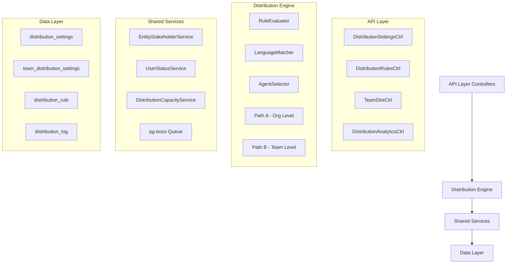

The Distribution Module automates lead assignment within organizations. When a new lead is created, the system evaluates org-defined rules to automatically assign the lead to the most appropriate agent — based on lead attributes, agent availability, language compatibility, and capacity.

<Info>
**Module Status:** Active — fully implemented  
**Module Path:** `src/modules/crm/distribution/`
</Info>

## Design Principles

The Distribution Module follows these core design principles:

<CardGroup cols={2}>
  <Card title="Async Distribution" icon="clock">
    `createLead()` emits `LEAD_CREATED`; a pg-boss worker handles distribution — lead creation is never blocked
  </Card>
  <Card title="Stakeholder System Reuse" icon="users">
    Distribution creates `EntityStakeholder` records via `EntityStakeholderService`, not a new paradigm
  </Card>
  <Card title="First-Match-Wins Rules" icon="trophy">
    Rules are evaluated top-to-bottom by priority; the first matching rule wins
  </Card>
  <Card title="Idempotency" icon="shield-check">
    Distribution engine checks for existing stakeholders or pending offers before running
  </Card>
</CardGroup>

<Note>
**No Retroactive Distribution:** Existing leads are unaffected when rules are created; only new leads trigger distribution.
</Note>

## Distribution Paths

The engine supports two execution paths:

<Tabs>
  <Tab title="Path A - Org-Level">
    **Path A — Org-level distribution** (`runDistribution`): triggered when a lead enters the org with no team context. Evaluates org-scoped rules, applies the org default method, and can bridge to Path B if a rule or default method routes to a team that has `distributionEnabled = true`.
  </Tab>
  <Tab title="Path B - Team-Level">
    **Path B — Team-level distribution** (`runTeamDistribution`): triggered directly when:
    - A lead is created with a `teamId` in the event payload (team pool assignment)
    - Path A determines the lead belongs to an auto-distributing team
    - Idempotency check finds a single team-only stakeholder with auto-distribute enabled
  </Tab>
</Tabs>

## Architecture

### High-Level Diagram



### Component Responsibilities

| Component | Responsibility |
|-----------|----------------|
| **DistributionEngine** | Orchestrator: receives a lead, evaluates rules, selects agent, creates assignment. Supports Path A (org) and Path B (team). |
| **RuleEvaluator** | Evaluates rule conditions against lead data; returns first matching rule |
| **LanguageMatcher** | Filters and ranks agents by language compatibility with the lead's person |
| **AgentSelector** | Applies the distribution method (round-robin, weighted, weighted-round-robin, direct) to the filtered agent pool |
| **DistributionCapacityService** | Two-phase capacity enforcement: Phase 1 `filterByCapacity()` (lead counts vs limits); Phase 2 `confirmCapacityAndAssign()` (advisory locks + atomic stakeholder creation). |
| **UserStatusService** | Pre-filters candidate agents to ONLINE status; filters by per-user working hours |
| **DistributionListener** | Listens for `LEAD_CREATED` events and enqueues pg-boss jobs |
| **DistributionJobHandler** | pg-boss worker that processes distribution jobs |

## Entity Specifications

### DistributionSettings (1 per org)

Org-level configuration for the distribution engine. Auto-created with defaults on first access via `getOrgSettingsRaw()`.

<AccordionGroup>
  <Accordion title="Database Schema">
    | Column | Type | Notes |
    |--------|------|-------|
    | id | uuid PK | |
    | organization_id | uuid FK UNIQUE | RLS |
    | distribution_enabled | bool | default `false`. Master on/off switch |
    | max_active_leads_per_agent | int | default 50 |
    | max_new_leads_per_day | int | default 15 |
    | capacity_enforcement_enabled | bool | default `false` |
    | respect_business_hours | bool | default `true` |
    | outside_hours_action | enum | `QUEUE`, `POOL`, `DUTY_AGENT` |
    | duty_agent_id | uuid FK nullable | used when `outside_hours_action = DUTY_AGENT` |
    | default_method | enum | `ROUND_ROBIN`, `POOL`, `SPECIFIC_TEAM` |
    | default_team_id | uuid FK nullable | used when `default_method = SPECIFIC_TEAM` |
    | default_language_matching_mode | enum | `STRICT`, `PREFERRED` |
    | default_balancing_factors | jsonb nullable | Optional balancing configuration |
    | pool_alert_enabled | bool | Whether to send pool-overload alerts |
    | pool_alert_threshold | int | Lead count that triggers an alert |
    | pool_alert_window_minutes | int | Rolling window for counting unassigned leads |
    | updated_by | uuid FK nullable | |
    | created_at, updated_at | timestamp | |
  </Accordion>
</AccordionGroup>

<Warning>
**Master Toggle Behavior:**
- `distributionEnabled = false` (new-org default): Engine is off. No pg-boss jobs created.
- `distributionEnabled = true`: Engine is active. When toggled from `false` → `true`, if `defaultMethod` is still `POOL` it is auto-upgraded to `ROUND_ROBIN`.
</Warning>

### TeamDistributionSettings (1 per org+team)

Per-team distribution configuration. One record per `(organization, team)` pair.

<AccordionGroup>
  <Accordion title="Database Schema">
    | Column | Type | Notes |
    |--------|------|-------|
    | id | uuid PK | |
    | organization_id | uuid FK | RLS |
    | team_id | uuid FK | (required, not nullable) |
    | distribution_enabled | bool | default `false` |
    | distribution_method | enum | default `ROUND_ROBIN` |
    | agent_weights | jsonb nullable | `{ [userId]: weight }` |
    | language_matching_enabled | bool | default `false` |
    | language_matching_mode | enum nullable | Language matching mode override |
    | capacity_enforcement_enabled | bool | default `false` |
    | max_active_leads_per_agent | int nullable | `null` = inherit from org |
    | max_new_leads_per_day | int nullable | `null` = inherit from org |
    | respect_business_hours | bool | default `false` |
    | last_assigned_index | int | default 0. Round-robin cursor |
    | default_balancing_factors | jsonb nullable | |
    | updated_by | uuid FK nullable | |
    | created_at, updated_at | timestamp | |
  </Accordion>
</AccordionGroup>

### DistributionRule

Rules are evaluated in ascending `priority` order (lower number = higher priority). First match wins.

<AccordionGroup>
  <Accordion title="Database Schema">
    | Column | Type | Notes |
    |--------|------|-------|
    | id | uuid PK | |
    | organization_id | uuid FK | RLS |
    | name | varchar | |
    | priority | int | lower = higher priority |
    | is_active | bool | default true |
    | scope | enum | `ORGANIZATION`, `TEAM` |
    | team_id | uuid FK nullable | for team-scoped rules |
    | condition_groups | jsonb | `[{conditions:[{field,operator,value}]}]` |
    | method | enum | `ROUND_ROBIN`, `WEIGHTED`, `WEIGHTED_ROUND_ROBIN`, `DIRECT` |
    | recipients | jsonb | `{agentIds?, teamId?, poolId?, weights?}` |
    | language_matching_enabled | bool | default true |
    | language_matching_mode | enum | `STRICT`, `PREFERRED` |
    | balancing_factors | jsonb nullable | Optional balancing configuration |
    | last_assigned_index | int | round-robin cursor |
    | created_by | uuid FK | |
    | created_at, updated_at | timestamp | |
    | is_deleted | bool | soft delete |
  </Accordion>
  <Accordion title="Supported Rule Conditions">
    | Field | Operator(s) | Example Value |
    |-------|-------------|---------------|
    | `leadSource` | `eq`, `in` | `'WEBSITE'`, `['WEBSITE', 'REFERRAL']` |
    | `temperature` | `eq`, `in` | `'HOT'` |
    | `language` | `eq` | `'ar'` (matched against `person.preferredLanguage`) |
    | `budget` | `gte`, `lte`, `between` | `500000` |
    | `tags` | `contains` | `['vip']` |
    | `sourceChannel` | `eq`, `in` | `'WHATSAPP'` |
    | `intent` | `eq` | `'BUY'` |
    | `area` | `eq`, `in`, `contains` | `'Dubai Marina'`, `['JBR', 'Downtown Dubai']` |

    <Note>
    All string-based condition fields use **case-insensitive matching**.
    </Note>
  </Accordion>
</AccordionGroup>

## Distribution Engine

### Core Engine Flow

<Steps>
  <Step title="Event Reception">
    Engine receives `LEAD_CREATED` event via pg-boss job queue
  </Step>
  <Step title="Idempotency Check">
    Verify lead doesn't already have stakeholders or pending offers
  </Step>
  <Step title="Path Selection">
    Determine whether to use Path A (org-level) or Path B (team-level) distribution
  </Step>
  <Step title="Rule Evaluation">
    Evaluate rules in priority order until first match is found
  </Step>
  <Step title="Agent Selection">
    Apply distribution method to filtered agent pool
  </Step>
  <Step title="Capacity Validation">
    Confirm agent has capacity using advisory locks
  </Step>
  <Step title="Assignment Creation">
    Create EntityStakeholder record and log distribution
  </Step>
</Steps>

### Distribution Methods

<Tabs>
  <Tab title="Round Robin">
    Cycles through agents in order. Uses `last_assigned_index` to track position.
    
    ```typescript
    const nextIndex = (lastAssignedIndex + 1) % eligibleAgents.length;
    const selectedAgent = eligibleAgents[nextIndex];
    ```
  </Tab>
  <Tab title="Weighted">
    Selects agents based on configured weights. Higher weight = higher probability.
    
    ```typescript
    const totalWeight = Object.values(weights).reduce((sum, w) => sum + w, 0);
    const randomValue = Math.random() * totalWeight;
    // Select agent based on cumulative weight thresholds
    ```
  </Tab>
  <Tab title="Weighted Round Robin">
    Combines round-robin fairness with weighted preferences.
  </Tab>
  <Tab title="Direct">
    Assigns to specific agent(s) defined in rule recipients.
  </Tab>
</Tabs>

## API Endpoints

### Distribution Settings

<CodeGroup>

```typescript GET /api/distribution/settings
// Get organization distribution settings
GET /api/distribution/settings
Authorization: Bearer <token>

Response: {
  id: string;
  organizationId: string;
  distributionEnabled: boolean;
  maxActiveLeadsPerAgent: number;
  maxNewLeadsPerDay: number;
  capacityEnforcementEnabled: boolean;
  respectBusinessHours: boolean;
  outsideHoursAction: 'QUEUE' | 'POOL' | 'DUTY_AGENT';
  dutyAgentId?: string;
  defaultMethod: 'ROUND_ROBIN' | 'POOL' | 'SPECIFIC_TEAM';
  defaultTeamId?: string;
  // ... other fields
}
```

```typescript PATCH /api/distribution/settings
// Update organization distribution settings
PATCH /api/distribution/settings
Authorization: Bearer <token>
Content-Type: application/json

{
  "distributionEnabled": true,
  "maxActiveLeadsPerAgent": 75,
  "capacityEnforcementEnabled": true,
  "defaultMethod": "ROUND_ROBIN"
}

Response: DistributionSettings
```

</CodeGroup>

### Distribution Rules

<CodeGroup>

```typescript GET /api/distribution/rules
// List distribution rules
GET /api/distribution/rules?scope=ORGANIZATION&teamId=uuid
Authorization: Bearer <token>

Response: {
  data: DistributionRule[];
  total: number;
}
```

```typescript POST /api/distribution/rules
// Create distribution rule
POST /api/distribution/rules
Authorization: Bearer <token>
Content-Type: application/json

{
  "name": "VIP Arabic Leads",
  "priority": 10,
  "scope": "ORGANIZATION",
  "conditionGroups": [
    {
      "conditions": [
        { "field": "tags", "operator": "contains", "value": ["vip"] },
        { "field": "language", "operator": "eq", "value": "ar" }
      ]
    }
  ],
  "method": "WEIGHTED",
  "recipients": {
    "agentIds": ["agent1-uuid", "agent2-uuid"],
    "weights": { "agent1-uuid": 70, "agent2-uuid": 30 }
  },
  "languageMatchingEnabled": true,
  "languageMatchingMode": "STRICT"
}

Response: DistributionRule
```

</CodeGroup>

### Team Distribution Settings

<CodeGroup>

```typescript GET /api/distribution/teams/:teamId/settings
// Get team distribution settings
GET /api/distribution/teams/uuid/settings
Authorization: Bearer <token>

Response: TeamDistributionSettings
```

```typescript PATCH /api/distribution/teams/:teamId/settings
// Update team distribution settings
PATCH /api/distribution/teams/uuid/settings
Authorization: Bearer <token>
Content-Type: application/json

{
  "distributionEnabled": true,
  "distributionMethod": "WEIGHTED",
  "agentWeights": {
    "agent1-uuid": 60,
    "agent2-uuid": 40
  },
  "capacityEnforcementEnabled": true,
  "maxActiveLeadsPerAgent": 50
}

Response: TeamDistributionSettings
```

</CodeGroup>

### Analytics & Metrics

<CodeGroup>

```typescript GET /api/distribution/analytics/performance
// Get distribution performance metrics
GET /api/distribution/analytics/performance?startDate=2024-01-01&endDate=2024-01-31&teamId=uuid
Authorization: Bearer <token>

Response: {
  totalDistributions: number;
  successfulDistributions: number;
  failedDistributions: number;
  averageDistributionTime: number;
  agentWorkload: Array<{
    agentId: string;
    agentName: string;
    leadsAssigned: number;
    activeLeads: number;
    capacityUtilization: number;
  }>;
  ruleEffectiveness: Array<{
    ruleId: string;
    ruleName: string;
    matches: number;
    successRate: number;
  }>;
}
```

```typescript GET /api/distribution/analytics/capacity
// Get capacity utilization metrics
GET /api/distribution/analytics/capacity?teamId=uuid
Authorization: Bearer <token>

Response: {
  organizationCapacity: {
    totalAgents: number;
    activeAgents: number;
    averageUtilization: number;
    atCapacityCount: number;
  };
  teamCapacities?: Array<{
    teamId: string;
    teamName: string;
    totalAgents: number;
    activeAgents: number;
    averageUtilization: number;
    atCapacityCount: number;
  }>;
  agentCapacities: Array<{
    agentId: string;
    agentName: string;
    activeLeads: number;
    maxActiveLeads: number;
    utilizationPercentage: number;
    dailyLeads: number;
    maxDailyLeads: number;
  }>;
}
```

</CodeGroup>

## Security & Permissions

### Row Level Security (RLS)

All distribution entities implement RLS policies based on `organization_id`:

<CodeGroup>

```sql RLS Policies
-- Distribution Settings
CREATE POLICY distribution_settings_org_access ON distribution_settings
  USING (organization_id = auth.current_org_id());

-- Team Distribution Settings  
CREATE POLICY team_distribution_settings_org_access ON team_distribution_settings
  USING (organization_id = auth.current_org_id());

-- Distribution Rules
CREATE POLICY distribution_rules_org_access ON distribution_rule
  USING (organization_id = auth.current_org_id());

-- Distribution Logs
CREATE POLICY distribution_log_org_access ON distribution_log
  USING (organization_id = auth.current_org_id());
```

</CodeGroup>

### Permission Requirements

| Action | Required Permission |
|--------|-------------------|
| View distribution settings | `DISTRIBUTION_READ` |
| Modify distribution settings | `DISTRIBUTION_WRITE` |
| Create/edit distribution rules | `DISTRIBUTION_RULES_WRITE` |
| View distribution analytics | `DISTRIBUTION_ANALYTICS_READ` |
| Manage team distribution | `TEAM_DISTRIBUTION_WRITE` |

## Performance & Scaling

### Optimization Strategies

<CardGroup cols={2}>
  <Card title="Advisory Locks" icon="lock">
    Two-phase capacity checking with PostgreSQL advisory locks prevents race conditions during assignment
  </Card>
  <Card title="Job Queue" icon="queue-list">
    pg-boss provides reliable job processing with retry logic and dead letter handling
  </Card>
  <Card title="Index Strategy" icon="magnifying-glass">
    Strategic indexes on frequently queried fields like `organization_id`, `team_id`, and `priority`
  </Card>
  <Card title="Capacity Caching" icon="bolt">
    In-memory caching of capacity calculations with cache invalidation on assignment changes
  </Card>
</CardGroup>

### Monitoring & Observability

<Tabs>
  <Tab title="Metrics">
    - Distribution job success/failure rates
    - Average assignment time per lead
    - Agent capacity utilization
    - Rule match effectiveness
    - Queue depth and processing times
  </Tab>
  <Tab title="Logging">
    - All distributions logged to `distribution_log` table
    - Structured logging for debugging failed distributions
    - Performance timing logs for slow operations
  </Tab>
  <Tab title="Alerts">
    - Pool overload alerts when unassigned leads exceed threshold
    - Capacity alerts when agents reach limits
    - Failed distribution alerts for system issues
  </Tab>
</Tabs>

## Integration Points

### Event System

The distribution module integrates with the event system:

```typescript
// Listens for
LEAD_CREATED -> triggers distribution job
USER_STATUS_CHANGED -> invalidates agent availability cache

// Emits  
LEAD_ASSIGNED -> when successful assignment occurs
DISTRIBUTION_FAILED -> when assignment fails
POOL_OVERLOAD -> when unassigned leads exceed threshold
```

### External Dependencies

<CardGroup cols={2}>
  <Card title="EntityStakeholderService" icon="users">
    Creates assignment relationships between leads and agents
  </Card>
  <Card title="UserService" icon="user">
    Validates agent availability and working hours
  </Card>
  <Card title="TeamService" icon="people-group">
    Retrieves team membership and hierarchy information
  </Card>
  <Card title="NotificationService" icon="bell">
    Sends alerts for pool overload and capacity issues
  </Card>
</CardGroup>

<Check>
The Distribution Module is fully implemented and operational, providing automated lead assignment with comprehensive rule-based routing, capacity management, and performance analytics.
</Check>