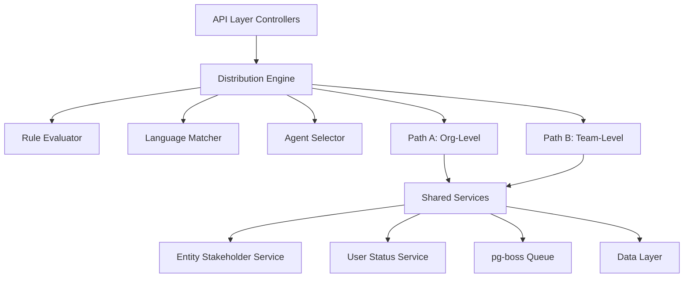

## Overview

The Distribution Module automates lead assignment within organizations. When a new lead is created, the system evaluates org-defined rules to automatically assign the lead to the most appropriate agent — based on lead attributes, UserStatus online/away state, working-hours eligibility, language compatibility, and capacity.

<Info>
**Status:** Active — fully implemented  
**Module Path:** `src/modules/crm/distribution/`
</Info>

### Design Principles

<CardGroup cols={2}>
  <Card title="Async Distribution" icon="clock">
    `createLead()` emits `LEAD_CREATED` after commit; a pg-boss worker handles distribution
  </Card>
  <Card title="Stakeholder System Reuse" icon="users">
    Distribution creates `EntityStakeholder` records via `EntityStakeholderService`
  </Card>
  <Card title="First-Match-Wins Rules" icon="list-check">
    Rules are evaluated top-to-bottom by priority; the first matching rule wins
  </Card>
  <Card title="Idempotency" icon="shield-check">
    Distribution engine checks for existing stakeholders or pending offers before running
  </Card>
</CardGroup>

<Note>
**No Retroactive Distribution:** Existing leads are unaffected when rules are created; only new leads trigger distribution.
</Note>

<Warning>
Listener / emit failures are logged only — HTTP lead creation still returns success; manual assignment or backfill may be needed if enqueue never ran.
</Warning>

### Distribution Paths

The engine supports two execution paths:

<Tabs>
  <Tab title="Path A — Org-Level">
    **Org-level distribution** (`runDistribution`): triggered when a lead enters the org with no team context. 
    
    - Evaluates org-scoped rules
    - Applies the org default method
    - Can bridge to Path B if a rule or default method routes to a team that has `distributionEnabled = true`
  </Tab>
  <Tab title="Path B — Team-Level">
    **Team-level distribution** (`runTeamDistribution`): triggered directly when:

    - A lead is created with a `teamId` in the event payload (team pool assignment)
    - A bulk-imported lead has a team-only assignment
    - Path A determines the lead belongs to an auto-distributing team
    - Idempotency check finds a single team-only stakeholder with auto-distribute enabled

    Path B evaluates team-scoped rules, uses team settings (with org fallback for capacity), and logs the team FK on the resulting `DistributionLog` record.
  </Tab>
</Tabs>

<Tip>
Bulk lead import sets `skipEmitLeadCreated` per row and calls `DistributionJobHandler.enqueueBatch()` once after the import loop for optimal performance.
</Tip>

## Architecture

### High-Level Diagram



### Component Responsibilities

<AccordionGroup>
  <Accordion title="DistributionEngine">
    Orchestrator: receives a lead, evaluates rules, selects agent, creates assignment. Supports Path A (org) and Path B (team).
  </Accordion>
  
  <Accordion title="RuleEvaluator">
    Evaluates rule conditions against lead data; returns first matching rule.
  </Accordion>
  
  <Accordion title="LanguageMatcher">
    Filters and ranks agents by language compatibility with the lead's person.
  </Accordion>
  
  <Accordion title="AgentSelector">
    Applies the distribution method (round-robin, weighted, weighted-round-robin, direct) to the filtered agent pool.
  </Accordion>
  
  <Accordion title="DistributionCapacityService">
    Two-phase capacity enforcement:
    - **Phase 1:** `filterByCapacity()` (lead counts vs limits)
    - **Phase 2:** `confirmCapacityAndAssign()` (advisory locks + atomic stakeholder creation)
    
    No entity of its own — queries `entity_stakeholder`.
  </Accordion>
  
  <Accordion title="UserStatusService">
    - Pre-filters candidate agents to ONLINE status
    - Filters by per-user working hours (`filterByWorkingHours`)
    - Provides `isWithinWorkingHours()` for org-level business hours check
  </Accordion>
  
  <Accordion title="DistributionListener">
    Listens for `LEAD_CREATED` events and enqueues pg-boss jobs. The handler is fault-isolated (try/catch): settings lookup and enqueue errors are logged and do not fail `POST /v1/leads`.
  </Accordion>
  
  <Accordion title="DistributionJobHandler">
    pg-boss worker that processes distribution jobs.
  </Accordion>
</AccordionGroup>

## Entity Specifications

### DistributionSettings (1 per org)

Org-level configuration for the distribution engine. Auto-created with defaults on first access via `getOrgSettingsRaw()`. Unique constraint on `organization_id`.

<Info>
All entities carry `organization_id` for row-level security (RLS) compliance.
</Info>

| Column | Type | Notes |
|--------|------|-------|
| `id` | uuid PK | Primary key |
| `organization_id` | uuid FK UNIQUE | RLS anchor; references `organizations.id` |
| `defaultRoutingEnabled` | boolean | When `false`, only explicit rule matches trigger distribution |
| `defaultMethod` | enum | `ROUND_ROBIN`, `WEIGHTED_ROUND_ROBIN`, `WEIGHTED`, `DIRECT` |
| `directUserId` | uuid FK | Required if `defaultMethod = DIRECT`; references `users.id` |
| `defaultCapacityLimit` | int | Default capacity limit for agents (org-wide) |
| `businessHoursEnabled` | boolean | When `true`, distribution respects business hours |
| `businessHoursTimezone` | text | IANA timezone for business hours calculations |
| `businessHours` | jsonb | Working hours by day of week |
| `offerTimeoutMinutes` | int | Minutes before an offer expires |
| `created_at` | timestamptz | Creation timestamp |
| `updated_at` | timestamptz | Last update timestamp |
| `created_by` | uuid FK | User who created the settings |
| `updated_by` | uuid FK | User who last updated the settings |

<CodeGroup>
```typescript Business Hours Schema
{
  monday: { enabled: boolean; start: "HH:mm"; end: "HH:mm" },
  tuesday: { enabled: boolean; start: "HH:mm"; end: "HH:mm" },
  wednesday: { enabled: boolean; start: "HH:mm"; end: "HH:mm" },
  thursday: { enabled: boolean; start: "HH:mm"; end: "HH:mm" },
  friday: { enabled: boolean; start: "HH:mm"; end: "HH:mm" },
  saturday: { enabled: boolean; start: "HH:mm"; end: "HH:mm" },
  sunday: { enabled: boolean; start: "HH:mm"; end: "HH:mm" }
}
```

```typescript Default Values
{
  defaultRoutingEnabled: true,
  defaultMethod: DistributionMethod.ROUND_ROBIN,
  directUserId: null,
  defaultCapacityLimit: 50,
  businessHoursEnabled: false,
  businessHoursTimezone: 'UTC',
  businessHours: { /* all days disabled */ },
  offerTimeoutMinutes: 5
}
```
</CodeGroup>

### TeamDistributionSettings (1 per team)

Team-level override for distribution configuration. Created on-demand. Unique constraint on `team_id`.

| Column | Type | Notes |
|--------|------|-------|
| `id` | uuid PK | Primary key |
| `organization_id` | uuid FK | RLS anchor |
| `team_id` | uuid FK UNIQUE | References `teams.id` |
| `distributionEnabled` | boolean | If `false`, team does not participate in auto-distribution |
| `defaultMethod` | enum | Team-specific distribution method (nullable) |
| `directUserId` | uuid FK | Team-specific direct assignment user (nullable) |
| `capacityLimit` | int | Team-specific capacity override (nullable) |
| `created_at` | timestamptz | Creation timestamp |
| `updated_at` | timestamptz | Last update timestamp |
| `created_by` | uuid FK | User who created the settings |
| `updated_by` | uuid FK | User who last updated the settings |

<Note>
Nullable fields indicate "inherit from org settings". Only non-null values override org defaults.
</Note>

### DistributionRule

Defines conditional routing logic. Rules are evaluated in priority order (ascending). First match wins.

| Column | Type | Notes |
|--------|------|-------|
| `id` | uuid PK | Primary key |
| `organization_id` | uuid FK | RLS anchor |
| `name` | text | Human-readable rule name |
| `isActive` | boolean | Active rules are evaluated; inactive rules are skipped |
| `priority` | int | Lower numbers = higher priority; rules sorted ASC |
| `conditions` | jsonb | Array of condition objects |
| `action` | jsonb | Action to take when rule matches |
| `created_at` | timestamptz | Creation timestamp |
| `updated_at` | timestamptz | Last update timestamp |
| `created_by` | uuid FK | User who created the rule |
| `updated_by` | uuid FK | User who last updated the rule |

<Steps>
  <Step title="Condition Evaluation">
    Each condition in the `conditions` array must match (AND logic) for the rule to fire.
  </Step>
  
  <Step title="Action Execution">
    When a rule matches, the engine executes the action (assign to team, assign to user, or use specific distribution method).
  </Step>
  
  <Step title="First Match Wins">
    Once a rule matches, evaluation stops. Lower priority rules are not checked.
  </Step>
</Steps>

<CodeGroup>
```typescript Condition Schema
{
  field: string;        // e.g., "lead.source", "person.country"
  operator: "eq" | "neq" | "in" | "nin" | "contains" | "startsWith" | "endsWith" | "gt" | "gte" | "lt" | "lte";
  value: any;           // Comparison value
}
```

```typescript Action Schema
{
  type: "ASSIGN_TO_TEAM" | "ASSIGN_TO_USER" | "USE_METHOD";
  teamId?: string;                    // Required for ASSIGN_TO_TEAM
  userId?: string;                    // Required for ASSIGN_TO_USER
  method?: DistributionMethod;        // Required for USE_METHOD
  directUserId?: string;              // Required if method = DIRECT
}
```

```typescript Example Rule
{
  name: "High-value leads to Sales Team",
  priority: 10,
  isActive: true,
  conditions: [
    {
      field: "lead.estimatedValue",
      operator: "gte",
      value: 10000
    },
    {
      field: "lead.source",
      operator: "in",
      value: ["website", "referral"]
    }
  ],
  action: {
    type: "ASSIGN_TO_TEAM",
    teamId: "uuid-of-sales-team"
  }
}
```
</CodeGroup>

### DistributionLog

Audit trail for every distribution attempt. Records outcome, selected agent, and execution details.

| Column | Type | Notes |
|--------|------|-------|
| `id` | uuid PK | Primary key |
| `organization_id` | uuid FK | RLS anchor |
| `lead_id` | uuid FK | References `leads.id` |
| `team_id` | uuid FK | Team context (nullable; Path B only) |
| `rule_id` | uuid FK | Matching rule (nullable) |
| `status` | enum | `SUCCESS`, `NO_AGENTS`, `CAPACITY_FULL`, `OUTSIDE_HOURS`, `ERROR` |
| `method` | enum | Distribution method used |
| `assigned_user_id` | uuid FK | User assigned (nullable if failed) |
| `eligible_count` | int | Number of eligible agents considered |
| `evaluation_time_ms` | int | Time taken to evaluate (milliseconds) |
| `failure_reason` | text | Error message if status = ERROR (nullable) |
| `metadata` | jsonb | Additional context (rule name, filters applied, etc.) |
| `created_at` | timestamptz | Log entry timestamp |

<Check>
Every distribution attempt is logged, successful or not, providing complete audit trail and debugging capability.
</Check>

## Type Definitions

### Distribution Methods

```typescript
enum DistributionMethod {
  ROUND_ROBIN = 'ROUND_ROBIN',
  WEIGHTED_ROUND_ROBIN = 'WEIGHTED_ROUND_ROBIN',
  WEIGHTED = 'WEIGHTED',
  DIRECT = 'DIRECT'
}
```

<Tabs>
  <Tab title="Round Robin">
    **ROUND_ROBIN**: Agents are selected in rotating order. Each agent gets an equal share of leads over time.
    
    - Simple and predictable
    - No configuration required
    - Fair distribution across team
  </Tab>
  
  <Tab title="Weighted">
    **WEIGHTED**: Agents are selected based on their weight. Higher weight = more leads assigned immediately.
    
    - Uses `users.distributionWeight` (default: 1)
    - Probabilistic selection based on weight ratio
    - Good for mixed experience levels
  </Tab>
  
  <Tab title="Weighted Round Robin">
    **WEIGHTED_ROUND_ROBIN**: Combines round-robin fairness with weighted priority. Agents with higher weights appear more frequently in the rotation.
    
    - Each agent appears `weight` times per cycle
    - Balanced approach between RR and WEIGHTED
    - Predictable but weighted distribution
  </Tab>
  
  <Tab title="Direct">
    **DIRECT**: All leads are assigned to a specific user.
    
    - Requires `directUserId` to be set
    - Useful for testing or single-agent teams
    - No rotation or weighting logic
  </Tab>
</Tabs>

### Distribution Status

```typescript
enum DistributionStatus {
  SUCCESS = 'SUCCESS',
  NO_AGENTS = 'NO_AGENTS',
  CAPACITY_FULL = 'CAPACITY_FULL',
  OUTSIDE_HOURS = 'OUTSIDE_HOURS',
  ERROR = 'ERROR'
}
```

<AccordionGroup>
  <Accordion title="SUCCESS">
    Lead was successfully assigned to an agent. A stakeholder record was created.
  </Accordion>
  
  <Accordion title="NO_AGENTS">
    No eligible agents available after filtering (offline, out of hours, wrong language, etc.).
  </Accordion>
  
  <Accordion title="CAPACITY_FULL">
    All eligible agents have reached their capacity limit.
  </Accordion>
  
  <Accordion title="OUTSIDE_HOURS">
    Distribution attempted outside business hours and `businessHoursEnabled = true`.
  </Accordion>
  
  <Accordion title="ERROR">
    An error occurred during distribution (logged with `failure_reason`).
  </Accordion>
</AccordionGroup>

### Condition Operators

```typescript
type ConditionOperator =
  | 'eq'           // Equals
  | 'neq'          // Not equals
  | 'in'           // In array
  | 'nin'          // Not in array
  | 'contains'     // String contains
  | 'startsWith'   // String starts with
  | 'endsWith'     // String ends with
  | 'gt'           // Greater than
  | 'gte'          // Greater than or equal
  | 'lt'           // Less than
  | 'lte';         // Less than or equal
```

## Distribution Engine

### Path A: Org-Level Distribution

<Steps>
  <Step title="Idempotency Check">
    Check if lead already has stakeholders or pending offers. If yes, skip distribution.
  </Step>
  
  <Step title="Business Hours Gate">
    If `businessHoursEnabled = true`, check if current time is within business hours. If not, log and exit.
  </Step>
  
  <Step title="Rule Evaluation">
    Evaluate active rules in priority order. First match wins.
    
    - Load lead with relations (person, contact)
    - Check each condition against lead data
    - Return matching rule action
  </Step>
  
  <Step title="Action Execution">
    Execute the matched rule action or fall back to org default:
    
    - **ASSIGN_TO_TEAM**: Bridge to Path B if team has `distributionEnabled = true`
    - **ASSIGN_TO_USER**: Direct assign via `EntityStakeholderService`
    - **USE_METHOD**: Apply specified distribution method at org level
  </Step>
  
  <Step title="Agent Selection">
    If no direct assignment:
    
    1. Get candidate agents (team members or org users)
    2. Filter by online status
    3. Filter by working hours
    4. Filter by language compatibility
    5. Filter by capacity
    6. Apply distribution method to select agent
  </Step>
  
  <Step title="Assignment">
    Create stakeholder record via `EntityStakeholderService.addStakeholder()`.
  </Step>
  
  <Step title="Logging">
    Create `DistributionLog` record with outcome and metadata.
  </Step>
</Steps>

<Warning>
If no agents are eligible after filtering, the lead remains unassigned. Manual assignment or offer system may be required.
</Warning>

### Path B: Team-Level Distribution

<Steps>
  <Step title="Team Settings Load">
    Load `TeamDistributionSettings` for the team. Use org settings as fallback for null fields.
  </Step>
  
  <Step title="Distribution Enabled Check">
    If `distributionEnabled = false`, skip distribution (manual assignment required).
  </Step>
  
  <Step title="Rule Evaluation (if enabled)">
    When `defaultRoutingEnabled` is disabled, consult active distribution rules via the rule service to respect rule-based routing controls.
  </Step>
  
  <Step title="Team Member Selection">
    Get active team members with `role IN ('member', 'manager')`.
  </Step>
  
  <Step title="Filtering Pipeline">
    Apply same filters as Path A:
    
    - Online status
    - Working hours
    - Language compatibility
    - Capacity (using team or org limit)
  </Step>
  
  <Step title="Method Application">
    Use team's `defaultMethod` or org default to select agent.
  </Step>
  
  <Step title="Assignment & Logging">
    Create stakeholder and log with `team_id` populated.
  </Step>
</Steps>

<Tip>
Path B respects team-specific capacity limits, allowing different teams to have different workload management strategies.
</Tip>

### Agent Selection Methods

<CodeGroup>
```typescript Round Robin
async selectRoundRobin(agents: User[]): Promise<User> {
  // Sort by last assignment time
  const sorted = agents.sort((a, b) => {
    const aLast = a.lastLeadAssignedAt?.getTime() || 0;
    const bLast = b.lastLeadAssignedAt?.getTime() || 0;
    return aLast - bLast;
  });
  
  return sorted[0];
}
```

```typescript Weighted
async selectWeighted(agents: User[]): Promise<User> {
  const totalWeight = agents.reduce(
    (sum, a) => sum + (a.distributionWeight || 1),
    0
  );
  
  let random = Math.random() * totalWeight;
  
  for (const agent of agents) {
    random -= agent.distributionWeight || 1;
    if (random <= 0) return agent;
  }
  
  return agents[0]; // Fallback
}
```

```typescript Weighted Round Robin
async selectWeightedRoundRobin(agents: User[]): Promise<User> {
  // Build rotation list with weighted repetition
  const rotation: User[] = [];
  for (const agent of agents) {
    const weight = agent.distributionWeight || 1;
    for (let i = 0; i < weight; i++) {
      rotation.push(agent);
    }
  }
  
  // Sort by last assigned, pick first
  rotation.sort((a, b) => {
    const aLast = a.lastLeadAssignedAt?.getTime() || 0;
    const bLast = b.lastLeadAssignedAt?.getTime() || 0;
    return aLast - bLast;
  });
  
  return rotation[0];
}
```

```typescript Direct
async selectDirect(directUserId: string): Promise<User> {
  const user = await this.em.findOne(User, {
    id: directUserId,
    isActive: true
  });
  
  if (!user) {
    throw new Error('Direct user not found or inactive');
  }
  
  return user;
}
```
</CodeGroup>

## pg-boss Job Configuration

### Queue Setup

```typescript
const QUEUE_NAME = 'distribution';
const QUEUE_OPTIONS = {
  retryLimit: 3,
  retryDelay: 60,        // 1 minute
  retryBackoff: true,
  expireInSeconds: 3600  // 1 hour
};
```

<Info>
The distribution queue uses pg-boss for reliability and automatic retry with exponential backoff.
</Info>

### Job Payload

```typescript
interface DistributionJobPayload {
  leadId: string;
  organizationId: string;
  teamId?: string;        // Present for Path B
  triggeredBy?: string;   // User ID who triggered distribution
  source?: 'api' | 'import' | 'rule';
}
```

### Job Lifecycle

<Steps>
  <Step title="Enqueue">
    `DistributionListener` receives `LEAD_CREATED` event and enqueues job:
    
    ```typescript
    await this.jobHandler.enqueue({
      leadId: lead.id,
      organizationId: lead.organizationId,
      teamId: event.teamId,
      triggeredBy: event.userId,
      source: 'api'
    });
    ```
  </Step>
  
  <Step title="Process">
    `DistributionJobHandler.process()` runs distribution engine:
    
    ```typescript
    const result = await this.engine.distribute({
      leadId: job.data.leadId,
      teamId: job.data.teamId,
      organizationId: job.data.organizationId
    });
    ```
  </Step>
  
  <Step title="Retry on Failure">
    If process throws, pg-boss retries up to 3 times with 1-minute delay and exponential backoff.
  </Step>
  
  <Step title="Dead Letter">
    After 3 failures, job moves to failed state. Admin can manually re-trigger via UI or API.
  </Step>
</Steps>

<Warning>
Failed jobs are logged but do not prevent lead creation. Manual assignment or retry may be required for failed distributions.
</Warning>

### Batch Enqueue (Import)

For bulk imports, jobs are batched for efficiency:

```typescript
await this.jobHandler.enqueueBatch(jobs, {
  priority: 5,  // Lower priority than real-time distribution
  batchSize: 100
});
```

<Tip>
Bulk imports use batch enqueue with lower priority to avoid overwhelming the distribution queue during large data imports.
</Tip>

## API Endpoints

### Distribution Settings

<CodeGroup>
```typescript GET /v1/distribution/settings
// Get org distribution settings
GET /v1/distribution/settings

Response:
{
  id: string;
  organizationId: string;
  defaultRoutingEnabled: boolean;
  defaultMethod: DistributionMethod;
  directUserId?: string;
  defaultCapacityLimit: number;
  businessHoursEnabled: boolean;
  businessHoursTimezone: string;
  businessHours: BusinessHours;
  offerTimeoutMinutes: number;
  createdAt: string;
  updatedAt: string;
}
```

```typescript PATCH /v1/distribution/settings
// Update org distribution settings
PATCH /v1/distribution/settings

Body:
{
  defaultRoutingEnabled?: boolean;
  defaultMethod?: DistributionMethod;
  directUserId?: string;
  defaultCapacityLimit?: number;
  businessHoursEnabled?: boolean;
  businessHoursTimezone?: string;
  businessHours?: BusinessHours;
  offerTimeoutMinutes?: number;
}

Response: DistributionSettings
```
</CodeGroup>

### Team Distribution Settings

<CodeGroup>
```typescript GET /v1/distribution/teams/:teamId/settings
// Get team distribution settings
GET /v1/distribution/teams/:teamId/settings

Response:
{
  id: string;
  organizationId: string;
  teamId: string;
  distributionEnabled: boolean;
  defaultMethod?: DistributionMethod;
  directUserId?: string;
  capacityLimit?: number;
  createdAt: string;
  updatedAt: string;
}
```

```typescript PATCH /v1/distribution/teams/:teamId/settings
// Update team distribution settings
PATCH /v1/distribution/teams/:teamId/settings

Body:
{
  distributionEnabled?: boolean;
  defaultMethod?: DistributionMethod;
  directUserId?: string;
  capacityLimit?: number;
}

Response: TeamDistributionSettings
```
</CodeGroup>

### Distribution Rules

<CodeGroup>
```typescript GET /v1/distribution/rules
// List all distribution rules
GET /v1/distribution/rules

Query:
- isActive?: boolean
- sort?: 'priority' | 'name' | 'createdAt'
- order?: 'asc' | 'desc'

Response:
{
  rules: DistributionRule[];
  total: number;
}
```

```typescript POST /v1/distribution/rules
// Create a new distribution rule
POST /v1/distribution/rules

Body:
{
  name: string;
  isActive?: boolean;
  priority: number;
  conditions: Condition[];
  action: Action;
}

Response: DistributionRule
```

```typescript PATCH /v1/distribution/rules/:ruleId
// Update a distribution rule
PATCH /v1/distribution/rules/:ruleId

Body:
{
  name?: string;
  isActive?: boolean;
  priority?: number;
  conditions?: Condition[];
  action?: Action;
}

Response: DistributionRule
```

```typescript DELETE /v1/distribution/rules/:ruleId
// Delete a distribution rule
DELETE /v1/distribution/rules/:ruleId

Response: 204 No Content
```
</CodeGroup>

### Manual Distribution

```typescript
POST /v1/distribution/distribute/:leadId

// Manually trigger distribution for a lead
// Useful for:
// - Retry after failed distribution
// - Re-distribute after rule changes
// - Admin override

Body:
{
  teamId?: string;  // Force specific team
  force?: boolean;  // Bypass idempotency check
}

Response:
{
  success: boolean;
  assignedUserId?: string;
  status: DistributionStatus;
  message: string;
}
```

<Warning>
Manual distribution with `force = true` bypasses idempotency checks and may result in multiple assignments. Use with caution.
</Warning>

### Distribution Analytics

<CodeGroup>
```typescript GET /v1/distribution/analytics/summary
// Get distribution summary statistics
GET /v1/distribution/analytics/summary

Query:
- startDate: ISO8601
- endDate: ISO8601
- teamId?: string

Response:
{
  totalDistributions: number;
  successfulDistributions: number;
  failedDistributions: number;
  successRate: number;
  averageEvaluationTimeMs: number;
  distributionByMethod: {
    [method: string]: number;
  };
  distributionByStatus: {
    [status: string]: number;
  };
}
```

```typescript GET /v1/distribution/analytics/agent-stats
// Get per-agent distribution statistics
GET /v1/distribution/analytics/agent-stats

Query:
- startDate: ISO8601
- endDate: ISO8601
- teamId?: string

Response:
{
  agents: Array<{
    userId: string;
    userName: string;
    leadsAssigned: number;
    currentCapacity: number;
    capacityLimit: number;
    averageResponseTimeMinutes: number;
  }>;
}
```

```typescript GET /v1/distribution/analytics/rule-performance
// Get rule performance metrics
GET /v1/distribution/analytics/rule-performance

Query:
- startDate: ISO8601
- endDate: ISO8601

Response:
{
  rules: Array<{
    ruleId: string;
    ruleName: string;
    matchCount: number;
    successCount: number;
    failureCount: number;
    averageEvaluationTimeMs: number;
  }>;
}
```
</CodeGroup>

## Security & Permissions

### Permission Matrix

| Endpoint | Permission Required | Notes |
|----------|-------------------|-------|
| `GET /distribution/settings` | `read:distribution_settings` | Org-level settings |
| `PATCH /distribution/settings` | `write:distribution_settings` | Admin or owner only |
| `GET /distribution/teams/:teamId/settings` | `read:team_distribution_settings` | Team member access |
| `PATCH /distribution/teams/:teamId/settings` | `write:team_distribution_settings` | Team manager or admin |
| `GET /distribution/rules` | `read:distribution_rules` | All authenticated users |
| `POST /distribution/rules` | `write:distribution_rules` | Admin or owner only |
| `PATCH /distribution/rules/:ruleId` | `write:distribution_rules` | Admin or owner only |
| `DELETE /distribution/rules/:ruleId` | `write:distribution_rules` | Admin or owner only |
| `POST /distribution/distribute/:leadId` | `write:lead_assignment` | Admin, manager, or lead owner |
| `GET /distribution/analytics/*` | `read:distribution_analytics` | Manager and above |

<Check>
All endpoints enforce organization-level RLS. Users can only access distribution data for their organization.
</Check>

### Row-Level Security (RLS)

All distribution entities include `organization_id` for RLS enforcement:

```sql
-- Example RLS policy for distribution_settings
CREATE POLICY distribution_settings_org_isolation
  ON distribution_settings
  FOR ALL
  USING (organization_id = current_setting('app.current_organization_id')::uuid);

-- Example RLS policy for distribution_rule
CREATE POLICY distribution_rule_org_isolation
  ON distribution_rule
  FOR ALL
  USING (organization_id = current_setting('app.current_organization_id')::uuid);
```

<Info>
RLS policies are automatically applied via `@UseRLS()` decorator in repositories.
</Info>

## Observability & Audit

### Logging

<CodeGroup>
```typescript Distribution Start
logger.info('Distribution started', {
  leadId,
  organizationId,
  teamId,
  source: 'api' | 'import' | 'rule'
});
```

```typescript Rule Match
logger.info('Distribution rule matched', {
  leadId,
  ruleId,
  ruleName,
  priority,
  action
});
```

```typescript Agent Selection
logger.info('Agent selected for distribution', {
  leadId,
  userId,
  method,
  eligibleCount,
  evaluationTimeMs
});
```

```typescript Distribution Failure
logger.warn('Distribution failed', {
  leadId,
  status: DistributionStatus,
  reason,
  eligibleCount,
  organizationId
});
```

```typescript Distribution Error
logger.error('Distribution error', {
  leadId,
  error: error.message,
  stack: error.stack,
  organizationId
});
```
</CodeGroup>

### Audit Trail

Every distribution attempt is logged to `distribution_log`:

```typescript
{
  id: uuid,
  organizationId: uuid,
  leadId: uuid,
  teamId?: uuid,
  ruleId?: uuid,
  status: DistributionStatus,
  method: DistributionMethod,
  assignedUserId?: uuid,
  eligibleCount: number,
  evaluationTimeMs: number,
  failureReason?: string,
  metadata: {
    ruleName?: string,
    filtersApplied: string[],
    candidateCount: number,
    source: string
  },
  createdAt: timestamp
}
```

<Tip>
Use `distribution_log` for debugging failed distributions, analyzing rule performance, and generating agent workload reports.
</Tip>

### Metrics & Monitoring

<AccordionGroup>
  <Accordion title="Distribution Success Rate">
    Percentage of successful distributions vs. total attempts.
    
    ```sql
    SELECT 
      COUNT(*) FILTER (WHERE status = 'SUCCESS') * 100.0 / COUNT(*) as success_rate
    FROM distribution_log
    WHERE created_at >= NOW() - INTERVAL '24 hours';
    ```
  </Accordion>
  
  <Accordion title="Average Evaluation Time">
    Mean time to evaluate rules and select agent.
    
    ```sql
    SELECT AVG(evaluation_time_ms) as avg_eval_time_ms
    FROM distribution_log
    WHERE created_at >= NOW() - INTERVAL '24 hours';
    ```
  </Accordion>
  
  <Accordion title="Distribution by Status">
    Breakdown of distribution outcomes.
    
    ```sql
    SELECT status, COUNT(*) as count
    FROM distribution_log
    WHERE created_at >= NOW() - INTERVAL '24 hours'
    GROUP BY status;
    ```
  </Accordion>
  
  <Accordion title="Queue Depth">
    Number of pending distribution jobs.
    
    ```sql
    SELECT COUNT(*) as pending_jobs
    FROM pgboss.job
    WHERE name = 'distribution'
      AND state = 'created';
    ```
  </Accordion>
</AccordionGroup>

## Analytics & Metrics

### Distribution Summary

```typescript
interface DistributionSummary {
  totalDistributions: number;
  successfulDistributions: number;
  failedDistributions: number;
  successRate: number;
  averageEvaluationTimeMs: number;
  distributionByMethod: Record<DistributionMethod, number>;
  distributionByStatus: Record<DistributionStatus, number>;
  topFailureReasons: Array<{
    reason: string;
    count: number;
  }>;
}
```

### Agent Statistics

```typescript
interface AgentStats {
  userId: string;
  userName: string;
  leadsAssigned: number;
  currentCapacity: number;
  capacityLimit: number;
  capacityUtilization: number;  // Percentage
  averageResponseTimeMinutes: number;
  distributionWeight: number;
  lastAssignedAt?: Date;
}
```

### Rule Performance

```typescript
interface RulePerformance {
  ruleId: string;
  ruleName: string;
  priority: number;
  matchCount: number;
  successCount: number;
  failureCount: number;
  successRate: number;
  averageEvaluationTimeMs: number;
  mostCommonFailureReason?: string;
}
```

<Tip>
Use analytics endpoints to:
- Identify bottlenecks in distribution
- Optimize rule conditions
- Balance team workloads
- Monitor agent performance
</Tip>

## Edge Case Handling

<AccordionGroup>
  <Accordion title="No Eligible Agents">
    **Scenario:** All agents are offline, at capacity, or outside working hours.
    
    **Handling:**
    - Log with status `NO_AGENTS` or `CAPACITY_FULL`
    - Lead remains unassigned
    - Admin notification (if configured)
    - Manual assignment required
    
    **Mitigation:**
    - Adjust capacity limits
    - Extend business hours
    - Add more team members
    - Enable offer system for offline agents
  </Accordion>
  
  <Accordion title="Distribution Rule Conflicts">
    **Scenario:** Multiple rules could match the same lead.
    
    **Handling:**
    - Rules are evaluated in priority order (ASC)
    - First match wins, evaluation stops
    - Lower priority rules are never checked
    
    **Best Practice:**
    - Use priority to establish clear hierarchy
    - Test rules with sample leads
    - Review rule performance analytics
  </Accordion>
  
  <Accordion title="Team Has No Distribution Settings">
    **Scenario:** Path B triggered but team has no settings record.
    
    **Handling:**
    - Fall back to org settings
    - Use org default method and capacity
    - Log team ID for audit trail
    
    **Note:**
    - Team settings are created on-demand
    - Null fields inherit from org
  </Accordion>
  
  <Accordion title="Direct User Unavailable">
    **Scenario:** Distribution method is DIRECT but user is offline or at capacity.
    
    **Handling:**
    - Check user online status first
    - Check capacity before assignment
    - If unavailable, log failure with `NO_AGENTS`
    - Consider fallback to team method
    
    **Configuration:**
    - Set `directUserId` to active, available user
    - Monitor direct user capacity
    - Use offer system for offline direct assignments
  </Accordion>
  
  <Accordion title="Language Mismatch">
    **Scenario:** Lead's person has language preference but no agents speak that language.
    
    **Handling:**
    - Log language mismatch in metadata
    - Fall back to agents without language filter
    - Or fail with `NO_AGENTS` if strict matching enabled
    
    **Configuration:**
    - Set user languages in profile
    - Enable fallback language matching
    - Consider multilingual agents
  </Accordion>
  
  <Accordion title="Concurrent Distribution Attempts">
    **Scenario:** Same lead distributed twice (race condition in imports).
    
    **Handling:**
    - Idempotency check at start of engine
    - Advisory locks in capacity service
    - Atomic stakeholder creation
    - Second attempt exits early
    
    **Prevention:**
    - Use `skipEmitLeadCreated` in bulk imports
    - Batch enqueue after import loop
    - Transaction-level locking
  </Accordion>
  
  <Accordion title="Business Hours Edge Cases">
    **Scenario:** Distribution attempted exactly at business hours boundary.
    
    **Handling:**
    - Use timezone-aware datetime comparison
    - Inclusive start time, exclusive end time
    - Log exact timestamp for debugging
    
    **Example:**
    ```typescript
    // Business hours: 9:00 - 17:00
    // 9:00:00 = WITHIN
    // 17:00:00 = OUTSIDE
    ```
  </Accordion>
  
  <Accordion title="Rule Condition Errors">
    **Scenario:** Rule references a field that doesn't exist on lead.
    
    **Handling:**
    - Gracefully skip rule (log warning)
    - Continue to next rule
    - Don't fail entire distribution
    
    **Best Practice:**
    - Validate rule conditions in UI
    - Use autocomplete for field names
    - Test rules before activation
  </Accordion>
</AccordionGroup>

## Performance & Scaling

### Optimization Strategies

<CardGroup cols={2}>
  <Card title="Database Indexing" icon="database">
    ```sql
    CREATE INDEX idx_distribution_log_lead 
      ON distribution_log(lead_id);
    
    CREATE INDEX idx_distribution_log_org_created 
      ON distribution_log(organization_id, created_at DESC);
    
    CREATE INDEX idx_distribution_rule_priority 
      ON distribution_rule(organization_id, priority ASC) 
      WHERE is_active = true;
    ```
  </Card>
  
  <Card title="Query Optimization" icon="magnifying-glass">
    - Use selective indexes
    - Limit rule evaluation depth
    - Cache org/team settings
    - Batch stakeholder queries
  </Card>
  
  <Card title="Async Processing" icon="clock">
    - pg-boss handles concurrency
    - Workers can scale horizontally
    - Job retries with backoff
    - Dead letter queue for failures
  </Card>
  
  <Card title="Capacity Management" icon="gauge">
    - Advisory locks prevent over-assignment
    - Two-phase capacity check
    - Atomic stakeholder creation
    - Real-time capacity tracking
  </Card>
</CardGroup>

### Scaling Considerations

<Steps>
  <Step title="Horizontal Scaling">
    Add more pg-boss workers to process distribution jobs in parallel:
    
    ```typescript
    // Worker count scales with load
    const workerCount = Math.ceil(queueDepth / 100);
    await boss.work('distribution', { teamSize: workerCount }, handler);
    ```
  </Step>
  
  <Step title="Database Connection Pooling">
    Ensure adequate connection pool size for concurrent distributions:
    
    ```typescript
    // mikroorm.config.ts
    {
      pool: {
        min: 10,
        max: 50
      }
    }
    ```
  </Step>
  
  <Step title="Caching">
    Cache frequently accessed settings:
    
    ```typescript
    // Cache org settings for 5 minutes
    @Cacheable({ ttl: 300 })
    async getOrgSettings(orgId: string) {
      return this.settingsRepo.findOne({ organizationId: orgId });
    }
    ```
  </Step>
  
  <Step title="Rate Limiting">
    Prevent distribution queue overload:
    
    ```typescript
    // Limit bulk import distribution rate
    await this.rateLimiter.consume(orgId, bulkJobCount);
    ```
  </Step>
</Steps>

<Warning>
High-volume organizations (>1000 leads/day) should monitor queue depth and worker capacity. Consider dedicated workers for distribution.
</Warning>

### Performance Targets

| Metric | Target | Notes |
|--------|--------|-------|
| Distribution latency | < 2 seconds | Time from job enqueue to completion |
| Rule evaluation | < 100ms | Per rule evaluation time |
| Agent selection | < 50ms | Method application time |
| Queue processing rate | > 100 jobs/min | Per worker throughput |
| Database query time | < 50ms | P95 for distribution queries |

## RLS Policies

### Distribution Settings

```sql
-- Org-level distribution settings
CREATE POLICY distribution_settings_org_isolation
  ON distribution_settings
  FOR ALL
  USING (organization_id = current_setting('app.current_organization_id')::uuid);

-- Read access for all org members
CREATE POLICY distribution_settings_read
  ON distribution_settings
  FOR SELECT
  USING (
    organization_id IN (
      SELECT organization_id 
      FROM user_organizations 
      WHERE user_id = current_setting('app.current_user_id')::uuid
    )
  );

-- Write access for admins only
CREATE POLICY distribution_settings_write
  ON distribution_settings
  FOR UPDATE
  USING (
    organization_id IN (
      SELECT uo.organization_id 
      FROM user_organizations uo
      WHERE uo.user_id = current_setting('app.current_user_id')::uuid
        AND uo.role IN ('admin', 'owner')
    )
  );
```

### Team Distribution Settings

```sql
-- Team-level distribution settings
CREATE POLICY team_distribution_settings_org_isolation
  ON team_distribution_settings
  FOR ALL
  USING (organization_id = current_setting('app.current_organization_id')::uuid);

-- Read access for team members
CREATE POLICY team_distribution_settings_read
  ON team_distribution_settings
  FOR SELECT
  USING (
    team_id IN (
      SELECT team_id 
      FROM team_members 
      WHERE user_id = current_setting('app.current_user_id')::uuid
    )
  );

-- Write access for team managers and org admins
CREATE POLICY team_distribution_settings_write
  ON team_distribution_settings
  FOR UPDATE
  USING (
    team_id IN (
      SELECT tm.team_id 
      FROM team_members tm
      WHERE tm.user_id = current_setting('app.current_user_id')::uuid
        AND tm.role IN ('manager', 'admin')
    )
    OR organization_id IN (
      SELECT uo.organization_id 
      FROM user_organizations uo
      WHERE uo.user_id = current_setting('app.current_user_id')::uuid
        AND uo.role IN ('admin', 'owner')
    )
  );
```

### Distribution Rules

```sql
-- Distribution rules org isolation
CREATE POLICY distribution_rule_org_isolation
  ON distribution_rule
  FOR ALL
  USING (organization_id = current_setting('app.current_organization_id')::uuid);

-- Read access for all org members
CREATE POLICY distribution_rule_read
  ON distribution_rule
  FOR SELECT
  USING (
    organization_id IN (
      SELECT organization_id 
      FROM user_organizations 
      WHERE user_id = current_setting('app.current_user_id')::uuid
    )
  );

-- Write access for admins only
CREATE POLICY distribution_rule_write
  ON distribution_rule
  FOR INSERT
  USING (
    organization_id IN (
      SELECT uo.organization_id 
      FROM user_organizations uo
      WHERE uo.user_id = current_setting('app.current_user_id')::uuid
        AND uo.role IN ('admin', 'owner')
    )
  );

CREATE POLICY distribution_rule_update
  ON distribution_rule
  FOR UPDATE
  USING (
    organization_id IN (
      SELECT uo.organization_id 
      FROM user_organizations uo
      WHERE uo.user_id = current_setting('app.current_user_id')::uuid
        AND uo.role IN ('admin', 'owner')
    )
  );

CREATE POLICY distribution_rule_delete
  ON distribution_rule
  FOR DELETE
  USING (
    organization_id IN (
      SELECT uo.organization_id 
      FROM user_organizations uo
      WHERE uo.user_id = current_setting('app.current_user_id')::uuid
        AND uo.role IN ('admin', 'owner')
    )
  );
```

### Distribution Logs

```sql
-- Distribution logs org isolation
CREATE POLICY distribution_log_org_isolation
  ON distribution_log
  FOR ALL
  USING (organization_id = current_setting('app.current_organization_id')::uuid);

-- Read access for managers and above
CREATE POLICY distribution_log_read
  ON distribution_log
  FOR SELECT
  USING (
    organization_id IN (
      SELECT uo.organization_id 
      FROM user_organizations uo
      WHERE uo.user_id = current_setting('app.current_user_id')::uuid
        AND uo.role IN ('admin', 'owner', 'manager')
    )
  );

-- Insert only (no updates/deletes for audit integrity)
CREATE POLICY distribution_log_insert
  ON distribution_log
  FOR INSERT
  WITH CHECK (
    organization_id = current_setting('app.current_organization_id')::uuid
  );
```

<Check>
RLS policies ensure complete data isolation between organizations and proper access control based on user roles.
</Check>

## Module Structure

```
src/modules/crm/distribution/
├── controllers/
│   ├── distribution-settings.controller.ts
│   ├── distribution-rules.controller.ts
│   ├── team-distribution.controller.ts
│   └── distribution-analytics.controller.ts
├── services/
│   ├── distribution-engine.service.ts
│   ├── distribution-settings.service.ts
│   ├── distribution-rules.service.ts
│   ├── team-distribution.service.ts
│   ├── distribution-capacity.service.ts
│   ├── rule-evaluator.service.ts
│   ├── language-matcher.service.ts
│   └── agent-selector.service.ts
├── entities/
│   ├── distribution-settings.entity.ts
│   ├── team-distribution-settings.entity.ts
│   ├── distribution-rule.entity.ts
│   └── distribution-log.entity.ts
├── repositories/
│   ├── distribution-settings.repository.ts
│   ├── team-distribution-settings.repository.ts
│   ├── distribution-rule.repository.ts
│   └── distribution-log.repository.ts
├── jobs/
│   ├── distribution-job.handler.ts
│   └── distribution.listener.ts
├── dtos/
│   ├── distribution-settings.dto.ts
│   ├── team-distribution-settings.dto.ts
│   ├── distribution-rule.dto.ts
│   └── distribution-analytics.dto.ts
├── types/
│   ├── distribution-method.enum.ts
│   ├── distribution-status.enum.ts
│   ├── condition.interface.ts
│   └── action.interface.ts
└── distribution.module.ts
```

## Integration Points

### Lead Module

<CodeGroup>
```typescript Event Emission
// LeadService.createLead()
await this.eventEmitter.emitAsync('LEAD_CREATED', {
  lead,
  organizationId: lead.organizationId,
  userId: context.userId,
  teamId: createDto.teamId
});
```

```typescript Bulk Import
// LeadImportService.importLeads()
const jobs = importedLeads
  .filter(l => shouldDistribute(l))
  .map(l => ({
    leadId: l.id,
    organizationId: l.organizationId,
    teamId: l.teamId,
    source: 'import'
  }));

await distributionJobHandler.enqueueBatch(jobs);
```
</CodeGroup>

### Entity Stakeholder Module

```typescript
// Distribution creates stakeholder assignments
await this.stakeholderService.addStakeholder({
  entityId: lead.id,
  entityType: 'lead',
  userId: selectedAgent.id,
  role: 'owner',
  isPrimary: true,
  organizationId: lead.organizationId
});
```

### User Status Module

```typescript
// Filter agents by online status
const onlineAgents = await this.userStatusService
  .filterOnlineUsers(candidates);

// Filter by working hours
const availableAgents = await this.userStatusService
  .filterByWorkingHours(onlineAgents);
```

### Team Module

```typescript
// Get team members for distribution
const teamMembers = await this.teamService
  .getActiveMembers(teamId, {
    roles: ['member', 'manager']
  });
```

### Notification Module

```typescript
// Notify agent of new assignment (future)
await this.notificationService.notify({
  userId: selectedAgent.id,
  type: 'LEAD_ASSIGNED',
  data: {
    leadId: lead.id,
    leadTitle: lead.title,
    assignedAt: new Date()
  }
});
```

## Environment Configuration

```bash
# pg-boss configuration
PGBOSS_SCHEMA=pgboss
PGBOSS_POLL_INTERVAL=5000
PGBOSS_EXPIRE_CHECK_INTERVAL=60000
PGBOSS_ARCHIVE_COMPLETED_AFTER_SECONDS=86400

# Distribution queue settings
DISTRIBUTION_QUEUE_NAME=distribution
DISTRIBUTION_RETRY_LIMIT=3
DISTRIBUTION_RETRY_DELAY=60
DISTRIBUTION_EXPIRE_IN_SECONDS=3600

# Default capacity limits
DISTRIBUTION_DEFAULT_CAPACITY=50
DISTRIBUTION_MAX_CAPACITY=200

# Business hours
DISTRIBUTION_DEFAULT_TIMEZONE=UTC
DISTRIBUTION_BUSINESS_HOURS_ENABLED=false

# Offer system (future)
DISTRIBUTION_OFFER_TIMEOUT_MINUTES=5
DISTRIBUTION_OFFER_ENABLED=false

# Analytics
DISTRIBUTION_ANALYTICS_RETENTION_DAYS=365

# Performance
DISTRIBUTION_MAX_EVALUATION_TIME_MS=5000
DISTRIBUTION_MAX_RULES_PER_ORG=100
```

<Info>
Configuration values can be overridden per organization via `DistributionSettings` entity.
</Info>

---

<CardGroup cols={2}>
  <Card title="Lead Module" icon="user-plus" href="/backend/crm/lead-module">
    Integration with lead creation and import
  </Card>
  <Card title="Entity Stakeholder Module" icon="users" href="/backend/crm/entity-stakeholder-module">
    Assignment and ownership management
  </Card>
  <Card title="User Status Module" icon="signal" href="/backend/crm/user-status-module">
    Online status and working hours
  </Card>
  <Card title="Team Module" icon="people-group" href="/backend/crm/team-module">
    Team member management and roles
  </Card>
</CardGroup>