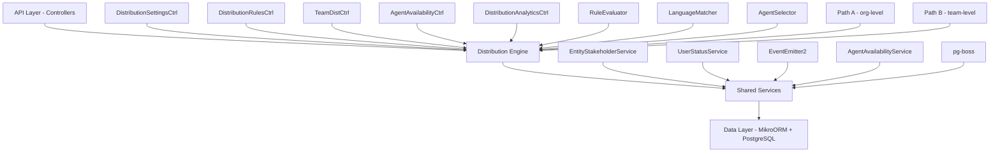

## Overview

The Distribution Module automates lead assignment within organizations. When a new lead is created, the system evaluates org-defined rules to automatically assign the lead to the most appropriate agent — based on lead attributes, agent availability, language compatibility, and capacity.

<Info>
The module is fully implemented and active at `src/modules/crm/distribution/`
</Info>

### Design Principles

| Principle | Decision |
|-----------|----------|
| Async distribution | `createLead()` emits `LEAD_CREATED`; a pg-boss worker handles distribution — lead creation is never blocked |
| Stakeholder system reuse | Distribution creates `EntityStakeholder` records via `EntityStakeholderService`, not a new paradigm |
| First-match-wins rules | Rules are evaluated top-to-bottom by priority; the first matching rule wins |
| Idempotency | Distribution engine checks for existing stakeholders or pending offers before running |
| No retroactive distribution | Existing leads are unaffected when rules are created; only new leads trigger distribution |
| pg-boss scheduling | Distribution queue uses pg-boss for reliability and retry guarantees |
| RLS compliance | All entities carry `organization_id` for row-level security |

### Distribution Paths

The engine supports two execution paths:

<Tabs>
<Tab title="Path A — Org-level">
**Org-level distribution** (`runDistribution`): triggered when a lead enters the org with no team context. Evaluates org-scoped rules, applies the org default method, and can bridge to Path B if a rule or default method routes to a team that has `distributionEnabled = true`.
</Tab>
<Tab title="Path B — Team-level">
**Team-level distribution** (`runTeamDistribution`): triggered directly when:
- A lead is created with a `teamId` in the event payload (team pool assignment)
- Path A determines the lead belongs to an auto-distributing team
- Idempotency check finds a single team-only stakeholder with auto-distribute enabled

Path B evaluates team-scoped rules, uses team settings (with org fallback for capacity), and logs the team FK on the resulting `DistributionLog` record.
</Tab>
</Tabs>

## Architecture

### High-level Diagram



### Component Responsibilities

<AccordionGroup>
<Accordion title="DistributionEngine">
Orchestrator: receives a lead, evaluates rules, selects agent, creates assignment. Supports Path A (org) and Path B (team).
</Accordion>
<Accordion title="RuleEvaluator">
Evaluates rule conditions against lead data; returns first matching rule
</Accordion>
<Accordion title="LanguageMatcher">
Filters and ranks agents by language compatibility with the lead's person
</Accordion>
<Accordion title="AgentSelector">
Applies the distribution method (round-robin, weighted, weighted-round-robin, direct) to the filtered agent pool
</Accordion>
<Accordion title="AgentAvailabilityService">
Checks agent capacity, business hours, leave status. Two-phase capacity enforcement with advisory locks.
</Accordion>
<Accordion title="UserStatusService">
Pre-filters candidate agents to only those with ONLINE status
</Accordion>
<Accordion title="DistributionListener">
Listens for `LEAD_CREATED` events and enqueues pg-boss jobs
</Accordion>
<Accordion title="DistributionJobHandler">
pg-boss worker that processes distribution jobs
</Accordion>
</AccordionGroup>

## Entity Specifications

### DistributionSettings (1 per org)

Org-level configuration for the distribution engine. Auto-created with defaults on first access via `getOrgSettingsRaw()`. Unique constraint on `organization_id`.

<CodeGroup>
```sql Schema
CREATE TABLE distribution_settings (
    id uuid PRIMARY KEY,
    organization_id uuid UNIQUE REFERENCES organizations(id),
    distribution_enabled boolean DEFAULT false,
    max_active_leads_per_agent integer DEFAULT 50,
    max_new_leads_per_day integer DEFAULT 15,
    capacity_enforcement_enabled boolean DEFAULT false,
    respect_business_hours boolean DEFAULT true,
    outside_hours_action text CHECK (outside_hours_action IN ('QUEUE', 'POOL', 'DUTY_AGENT')),
    duty_agent_id uuid REFERENCES users(id),
    default_method text CHECK (default_method IN ('ROUND_ROBIN', 'POOL', 'SPECIFIC_TEAM')),
    default_team_id uuid REFERENCES teams(id),
    default_language_matching_mode text CHECK (default_language_matching_mode IN ('STRICT', 'PREFERRED')),
    default_balancing_factors jsonb,
    pool_alert_enabled boolean,
    pool_alert_threshold integer,
    pool_alert_window_minutes integer,
    updated_by uuid REFERENCES users(id),
    created_at timestamp DEFAULT now(),
    updated_at timestamp DEFAULT now()
);
```
</CodeGroup>

<Warning>
**Master toggle behavior:**
- `distributionEnabled = false` (new-org default): Engine is off. `DistributionListener` and `LeadImportService` skip enqueue entirely — leads go to pool, no pg-boss jobs created.
- `distributionEnabled = true`: Engine is active. When toggled from `false` → `true`, if `defaultMethod` is still `POOL` it is auto-upgraded to `ROUND_ROBIN`.
</Warning>

<Note>
**Business hours source:** Business hours schedule (timezone, weekly slots, enabled flag) is stored on `Organization.settings.businessHours` (`BusinessHoursConfig`), not on `DistributionSettings`. The `respectBusinessHours` field only controls whether the distribution engine gates against that org-level schedule.
</Note>

### TeamDistributionSettings (1 per org+team)

Per-team distribution configuration. One record per `(organization, team)` pair — unique index `uq_team_distribution_settings_org_team`. Auto-created on first access.

<CodeGroup>
```sql Schema
CREATE TABLE team_distribution_settings (
    id uuid PRIMARY KEY,
    organization_id uuid REFERENCES organizations(id),
    team_id uuid NOT NULL REFERENCES teams(id),
    distribution_enabled boolean DEFAULT false,
    distribution_method text DEFAULT 'ROUND_ROBIN',
    agent_weights jsonb,
    language_matching_enabled boolean DEFAULT false,
    language_matching_mode text CHECK (language_matching_mode IN ('STRICT', 'PREFERRED')),
    capacity_enforcement_enabled boolean DEFAULT false,
    max_active_leads_per_agent integer,
    max_new_leads_per_day integer,
    respect_business_hours boolean DEFAULT false,
    last_assigned_index integer DEFAULT 0,
    default_balancing_factors jsonb,
    updated_by uuid REFERENCES users(id),
    created_at timestamp DEFAULT now(),
    updated_at timestamp DEFAULT now(),
    UNIQUE(organization_id, team_id)
);
```
</CodeGroup>

**Effective capacity resolution** (`DistributionSettingsService.resolveEffectiveCapacity`):

```typescript
if (team.capacityEnforcementEnabled) {
  maxActive = team.maxActiveLeadsPerAgent ?? org.maxActiveLeadsPerAgent
  maxDaily = team.maxNewLeadsPerDay ?? org.maxNewLeadsPerDay
} else {
  // no capacity checks applied for this team's distributions
}
```

### DistributionRule

Rules are evaluated in ascending `priority` order (lower number = higher priority). First match wins.

<CodeGroup>
```sql Schema
CREATE TABLE distribution_rule (
    id uuid PRIMARY KEY,
    organization_id uuid REFERENCES organizations(id),
    name varchar NOT NULL,
    priority integer NOT NULL,
    is_active boolean DEFAULT true,
    scope text CHECK (scope IN ('ORGANIZATION', 'TEAM')),
    team_id uuid REFERENCES teams(id),
    condition_groups jsonb NOT NULL,
    method text CHECK (method IN ('ROUND_ROBIN', 'WEIGHTED', 'WEIGHTED_ROUND_ROBIN', 'DIRECT')),
    recipients jsonb NOT NULL,
    language_matching_enabled boolean DEFAULT true,
    language_matching_mode text CHECK (language_matching_mode IN ('STRICT', 'PREFERRED')),
    balancing_factors jsonb,
    last_assigned_index integer DEFAULT 0,
    created_by uuid REFERENCES users(id),
    created_at timestamp DEFAULT now(),
    updated_at timestamp DEFAULT now(),
    is_deleted boolean DEFAULT false
);
```
</CodeGroup>

**Rule Conditions — Supported Fields:**

<AccordionGroup>
<Accordion title="Lead Source">
- **Field:** `leadSource`
- **Operators:** `eq`, `in`
- **Example:** `'WEBSITE'`, `['WEBSITE', 'REFERRAL']`
</Accordion>
<Accordion title="Temperature">
- **Field:** `temperature`
- **Operators:** `eq`, `in`
- **Example:** `'HOT'`
</Accordion>
<Accordion title="Language">
- **Field:** `language`
- **Operators:** `eq`
- **Example:** `'ar'` (matched against `person.preferredLanguage`)
</Accordion>
<Accordion title="Budget">
- **Field:** `budget`
- **Operators:** `gte`, `lte`, `between`
- **Example:** `500000`
</Accordion>
<Accordion title="Tags">
- **Field:** `tags`
- **Operators:** `contains`
- **Example:** `['vip']`
</Accordion>
<Accordion title="Source Channel">
- **Field:** `sourceChannel`
- **Operators:** `eq`, `in`
- **Example:** `'WHATSAPP'`
</Accordion>
<Accordion title="Intent">
- **Field:** `intent`
- **Operators:** `eq`
- **Example:** `'BUY'`
</Accordion>
<Accordion title="Area">
- **Field:** `area`
- **Operators:** `eq`, `in`, `contains`
- **Example:** `'Dubai Marina'`, `['JBR', 'Downtown Dubai']`
</Accordion>
</AccordionGroup>

<Info>
All string-based condition fields use **case-insensitive matching**. The `area` field requires data from `LeadPropertyInterest.preferredAreas[]` — the engine pre-loads the lead's property interests before calling the evaluator.
</Info>

**Scope & team rules:**
- **Org-level rules** (`scope = ORGANIZATION`): `team` is null. Evaluated during Path A.
- **Team-scoped rules** (`scope = TEAM`): `team` is set. Only evaluated during Path B for the matching team.

## Distribution Engine

### Core Distribution Flow

<Steps>
<Step title="Lead Creation Event">
When a lead is created, the system emits a `LEAD_CREATED` event
</Step>
<Step title="Job Enqueueing">
`DistributionListener` catches the event and enqueues a pg-boss job (if distribution is enabled)
</Step>
<Step title="Job Processing">
`DistributionJobHandler` processes the job asynchronously
</Step>
<Step title="Path Selection">
Engine determines Path A (org-level) or Path B (team-level) based on context
</Step>
<Step title="Rule Evaluation">
`RuleEvaluator` finds the first matching rule by priority
</Step>
<Step title="Agent Selection">
`AgentSelector` applies the distribution method to eligible agents
</Step>
<Step title="Assignment">
Creates `EntityStakeholder` record via `EntityStakeholderService`
</Step>
</Steps>

### Rule Evaluation Logic

```typescript
interface ConditionGroup {
  conditions: Condition[]
}

interface Condition {
  field: string
  operator: 'eq' | 'in' | 'gte' | 'lte' | 'between' | 'contains'
  value: any
}
```

Rules use **OR-of-ANDs** logic: `[{conditions: [A, B]}, {conditions: [C]}]` means `(A AND B) OR (C)`.

### Agent Selection Methods

<Tabs>
<Tab title="Round Robin">
Cycles through agents sequentially using `last_assigned_index`
```typescript
const nextIndex = (currentIndex + 1) % eligibleAgents.length
```
</Tab>
<Tab title="Weighted">
Assigns based on agent weights from rule configuration
```typescript
const totalWeight = sum(Object.values(weights))
const randomValue = Math.random() * totalWeight
```
</Tab>
<Tab title="Weighted Round Robin">
Combines round-robin with weighting for fair distribution
</Tab>
<Tab title="Direct">
Assigns to specific agent(s) listed in rule recipients
</Tab>
</Tabs>

## pg-boss Job Configuration

The distribution system uses pg-boss for reliable job processing with the following configuration:

<CodeGroup>
```typescript Configuration
const JOB_NAMES = {
  DISTRIBUTE_LEAD: 'distribute-lead',
  DISTRIBUTION_ANALYTICS: 'distribution-analytics'
}

const JOB_OPTIONS = {
  retryLimit: 3,
  retryDelay: 30, // seconds
  retryBackoff: true,
  expireInHours: 24
}
```
</CodeGroup>

### Job Payload Structure

```typescript
interface DistributeLeadPayload {
  leadId: string
  organizationId: string
  teamId?: string // for Path B
  triggeredBy?: 'LEAD_CREATED' | 'MANUAL' | 'IMPORT'
}
```

### Error Handling & Retries

<Warning>
Jobs that fail after 3 retries are moved to the failed jobs table for manual investigation. Common failure scenarios:
- Database connectivity issues
- Rule evaluation errors
- Agent availability service timeouts
</Warning>

## API Endpoints

### Distribution Settings

<CodeGroup>
```http GET /organizations/{orgId}/distribution/settings
GET /organizations/{orgId}/distribution/settings
Authorization: Bearer {token}

Response:
{
  "distributionEnabled": true,
  "maxActiveLeadsPerAgent": 50,
  "maxNewLeadsPerDay": 15,
  "defaultMethod": "ROUND_ROBIN",
  // ... other settings
}
```

```http PUT /organizations/{orgId}/distribution/settings
PUT /organizations/{orgId}/distribution/settings
Authorization: Bearer {token}
Content-Type: application/json

{
  "distributionEnabled": true,
  "maxActiveLeadsPerAgent": 75,
  "respectBusinessHours": false
}
```
</CodeGroup>

### Distribution Rules

<CodeGroup>
```http GET /organizations/{orgId}/distribution/rules
GET /organizations/{orgId}/distribution/rules
Authorization: Bearer {token}

Response:
{
  "rules": [
    {
      "id": "rule-uuid",
      "name": "VIP Leads",
      "priority": 1,
      "isActive": true,
      "scope": "ORGANIZATION",
      "method": "DIRECT",
      "conditionGroups": [...],
      "recipients": {...}
    }
  ]
}
```

```http POST /organizations/{orgId}/distribution/rules
POST /organizations/{orgId}/distribution/rules
Authorization: Bearer {token}
Content-Type: application/json

{
  "name": "High Budget Leads",
  "priority": 10,
  "scope": "ORGANIZATION",
  "conditionGroups": [
    {
      "conditions": [
        {
          "field": "budget",
          "operator": "gte",
          "value": 1000000
        }
      ]
    }
  ],
  "method": "ROUND_ROBIN",
  "recipients": {
    "agentIds": ["agent-1", "agent-2"]
  }
}
```
</CodeGroup>

### Team Distribution

<CodeGroup>
```http GET /organizations/{orgId}/teams/{teamId}/distribution
GET /organizations/{orgId}/teams/{teamId}/distribution
Authorization: Bearer {token}

Response:
{
  "distributionEnabled": false,
  "distributionMethod": "ROUND_ROBIN",
  "languageMatchingEnabled": true,
  "capacityEnforcementEnabled": false
}
```
</CodeGroup>

### Agent Availability

<CodeGroup>
```http PUT /organizations/{orgId}/agents/{agentId}/availability
PUT /organizations/{orgId}/agents/{agentId}/availability
Authorization: Bearer {token}
Content-Type: application/json

{
  "isAvailable": true,
  "maxActiveLeads": 25,
  "maxNewLeadsPerDay": 10
}
```
</CodeGroup>

## Security & Permissions

### Role-based Access Control

| Role | Permissions |
|------|-------------|
| **Admin** | Full CRUD on all distribution entities |
| **Manager** | Read/write distribution settings and rules for their teams |
| **Agent** | Read own availability settings, update availability status |
| **Viewer** | Read-only access to distribution analytics |

### Row Level Security (RLS)

All distribution entities include `organization_id` for RLS enforcement:

<CodeGroup>
```sql RLS Policies
-- Distribution Settings
CREATE POLICY distribution_settings_org_isolation ON distribution_settings
  USING (organization_id = current_setting('app.current_organization_id')::uuid);

-- Distribution Rules  
CREATE POLICY distribution_rules_org_isolation ON distribution_rule
  USING (organization_id = current_setting('app.current_organization_id')::uuid);

-- Team Distribution Settings
CREATE POLICY team_distribution_settings_org_isolation ON team_distribution_settings
  USING (organization_id = current_setting('app.current_organization_id')::uuid);

-- Agent Availability
CREATE POLICY agent_availability_org_isolation ON agent_availability
  USING (organization_id = current_setting('app.current_organization_id')::uuid);
```
</CodeGroup>

## Observability & Audit

### Distribution Logging

Every distribution attempt creates a `DistributionLog` record:

<CodeGroup>
```sql Schema
CREATE TABLE distribution_log (
    id uuid PRIMARY KEY,
    organization_id uuid REFERENCES organizations(id),
    lead_id uuid REFERENCES leads(id),
    team_id uuid REFERENCES teams(id), -- for Path B
    rule_id uuid REFERENCES distribution_rule(id),
    assigned_agent_id uuid REFERENCES users(id),
    distribution_method text,
    execution_path text CHECK (execution_path IN ('PATH_A', 'PATH_B')),
    execution_time_ms integer,
    failure_reason text,
    metadata jsonb,
    created_at timestamp DEFAULT now()
);
```
</CodeGroup>

### Metrics & Analytics

<Tabs>
<Tab title="Distribution Metrics">
- Assignment success rate
- Average distribution time
- Rule match rates
- Agent workload distribution
</Tab>
<Tab title="Performance Metrics">
- Job processing latency
- Rule evaluation performance
- Database query execution times
</Tab>
<Tab title="Business Metrics">
- Lead conversion by assignment method
- Agent performance by distribution path
- Peak distribution times
</Tab>
</Tabs>

### Event Emissions

The distribution engine emits events for external integrations:

```typescript
// Successfully assigned lead
eventEmitter.emit('LEAD_DISTRIBUTED', {
  leadId,
  organizationId,
  assignedAgentId,
  distributionMethod,
  ruleId,
  executionPath
})

// Distribution failed
eventEmitter.emit('DISTRIBUTION_FAILED', {
  leadId,
  organizationId,
  reason,
  attemptCount
})
```

## Edge Case Handling

### No Available Agents

<Steps>
<Step title="Check Eligibility">
System checks for agents matching language, availability, and capacity constraints
</Step>
<Step title="Fallback Logic">
If no agents available, lead goes to pool with reason logged
</Step>
<Step title="Alert Generation">
Pool alert sent if threshold exceeded (configurable)
</Step>
<Step title="Retry Logic">
pg-boss will retry the job based on configuration
</Step>
</Steps>

### Business Hours Handling

When `respectBusinessHours = true` and outside business hours:

<Tabs>
<Tab title="QUEUE">
Job is scheduled to run at next business hours start
</Tab>
<Tab title="POOL">
Lead goes directly to pool
</Tab>
<Tab title="DUTY_AGENT">
Assigned to designated duty agent (if available)
</Tab>
</Tabs>

### Concurrent Distribution

<Note>
The system uses PostgreSQL advisory locks during agent selection to prevent double-assignment:
```sql
SELECT pg_advisory_lock(hash_agent_id);
-- perform capacity checks and assignment
SELECT pg_advisory_unlock(hash_agent_id);
```
</Note>

## Performance & Scaling

### Database Optimization

<CodeGroup>
```sql Indexes
-- Distribution rules performance
CREATE INDEX idx_distribution_rule_org_priority_active 
ON distribution_rule(organization_id, priority, is_active) 
WHERE is_deleted = false;

-- Agent availability lookups  
CREATE INDEX idx_agent_availability_org_agent 
ON agent_availability(organization_id, agent_id);

-- Distribution log analytics
CREATE INDEX idx_distribution_log_org_created 
ON distribution_log(organization_id, created_at);

-- Round-robin cursor updates
CREATE INDEX idx_distribution_rule_last_assigned 
ON distribution_rule(id) WHERE method IN ('ROUND_ROBIN', 'WEIGHTED_ROUND_ROBIN');
```
</CodeGroup>

### Scaling Considerations

<Warning>
**High-volume environments** (>1000 leads/hour) should consider:
- Dedicated pg-boss workers for distribution jobs
- Redis caching for frequently accessed rules and settings  
- Database connection pooling optimization
- Monitoring queue depth and processing latency
</Warning>

### Batch Processing

For lead imports, the system supports batch distribution:

```typescript
// LeadImportService enqueues multiple jobs efficiently
const jobs = leads.map(lead => ({
  name: 'distribute-lead',
  data: { leadId: lead.id, organizationId, triggeredBy: 'IMPORT' }
}))

await pgBoss.insertBatch(jobs)
```

## Module Structure

```
src/modules/crm/distribution/
├── controllers/
│   ├── distribution-settings.controller.ts
│   ├── distribution-rules.controller.ts  
│   ├── team-distribution.controller.ts
│   ├── agent-availability.controller.ts
│   └── distribution-analytics.controller.ts
├── services/
│   ├── distribution.service.ts
│   ├── distribution-engine.service.ts
│   ├── distribution-settings.service.ts
│   ├── agent-availability.service.ts
│   └── distribution-analytics.service.ts
├── entities/
│   ├── distribution-settings.entity.ts
│   ├── team-distribution-settings.entity.ts
│   ├── distribution-rule.entity.ts
│   ├── agent-availability.entity.ts
│   └── distribution-log.entity.ts
├── dto/
│   ├── create-distribution-rule.dto.ts
│   ├── update-distribution-settings.dto.ts
│   └── agent-availability.dto.ts
├── listeners/
│   └── distribution.listener.ts
├── jobs/
│   └── distribution-job.handler.ts
├── types/
│   └── distribution.types.ts
└── distribution.module.ts
```

## Integration Points

### CRM Module Dependencies

<CardGroup cols={2}>
<Card title="Entity Stakeholder Service" icon="users">
Creates assignment relationships between agents and leads
</Card>
<Card title="Lead Service" icon="bullseye">
Retrieves lead data and property interests for rule evaluation
</Card>
<Card title="Team Service" icon="people-group">  
Provides team membership and hierarchy information
</Card>
<Card title="User Service" icon="user">
Validates agent eligibility and status
</Card>
</CardGroup>

### External Integrations

- **Business Hours:** Reads from `Organization.settings.businessHours`
- **Notifications:** Emits events for external notification systems
- **Analytics:** Provides metrics for dashboards and reporting
- **Audit Trail:** Logs all distribution decisions for compliance

## Environment Configuration

<CodeGroup>
```env Development
# Distribution job processing
DISTRIBUTION_JOB_CONCURRENCY=5
DISTRIBUTION_JOB_RETRY_LIMIT=3
DISTRIBUTION_JOB_RETRY_DELAY=30

# Performance tuning  
DISTRIBUTION_BATCH_SIZE=100
DISTRIBUTION_CACHE_TTL=300

# Monitoring
DISTRIBUTION_METRICS_ENABLED=true
DISTRIBUTION_DEBUG_LOGGING=true
```

```env Production  
# Distribution job processing
DISTRIBUTION_JOB_CONCURRENCY=20
DISTRIBUTION_JOB_RETRY_LIMIT=3
DISTRIBUTION_JOB_RETRY_DELAY=60

# Performance tuning
DISTRIBUTION_BATCH_SIZE=500
DISTRIBUTION_CACHE_TTL=600

# Monitoring
DISTRIBUTION_METRICS_ENABLED=true
DISTRIBUTION_DEBUG_LOGGING=false
```
</CodeGroup>

<Check>
The Distribution Module provides a comprehensive, scalable solution for automated lead assignment with extensive configuration options, robust error handling, and detailed observability.
</Check>