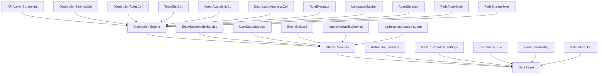

The Distribution Module automates lead assignment within organizations. When a new lead is created, the system evaluates org-defined rules to automatically assign the lead to the most appropriate agent — based on lead attributes, agent availability, language compatibility, and capacity.

## Overview

<Note>
The distribution system operates asynchronously - `createLead()` emits `LEAD_CREATED` events that are processed by pg-boss workers, ensuring lead creation is never blocked by distribution logic.
</Note>

### Design Principles

| Principle | Decision |
|-----------|----------|
| Async distribution | `createLead()` emits `LEAD_CREATED`; a pg-boss worker handles distribution — lead creation is never blocked |
| Stakeholder system reuse | Distribution creates `EntityStakeholder` records via `EntityStakeholderService`, not a new paradigm |
| First-match-wins rules | Rules are evaluated top-to-bottom by priority; the first matching rule wins |
| Idempotency | Distribution engine checks for existing stakeholders or pending offers before running |
| No retroactive distribution | Existing leads are unaffected when rules are created; only new leads trigger distribution |
| pg-boss scheduling | Distribution queue uses pg-boss for reliability and retry guarantees |
| RLS compliance | All entities carry `organization_id` for row-level security |

### Distribution Paths

The engine supports two execution paths:

<Tabs>
  <Tab title="Path A - Org-level">
    **Org-level distribution** (`runDistribution`): triggered when a lead enters the org with no team context. Evaluates org-scoped rules, applies the org default method, and can bridge to Path B if a rule or default method routes to a team that has `distributionEnabled = true`.
  </Tab>
  <Tab title="Path B - Team-level">
    **Team-level distribution** (`runTeamDistribution`): triggered directly when:
    - A lead is created with a `teamId` in the event payload (team pool assignment)
    - Path A determines the lead belongs to an auto-distributing team
    - Idempotency check finds a single team-only stakeholder with auto-distribute enabled

    Path B evaluates team-scoped rules, uses team settings (with org fallback for capacity), and logs the team FK on the resulting `DistributionLog` record.
  </Tab>
</Tabs>

## Architecture

### High-Level Diagram



### Component Responsibilities

| Component | Responsibility |
|-----------|----------------|
| **DistributionEngine** | Orchestrator: receives a lead, evaluates rules, selects agent, creates assignment. Supports Path A (org) and Path B (team). |
| **RuleEvaluator** | Evaluates rule conditions against lead data; returns first matching rule |
| **LanguageMatcher** | Filters and ranks agents by language compatibility with the lead's person |
| **AgentSelector** | Applies the distribution method (round-robin, weighted, weighted-round-robin, direct) to the filtered agent pool |
| **AgentAvailabilityService** | Checks agent capacity, business hours, leave status. Two-phase capacity enforcement with advisory locks. |
| **UserStatusService** | Pre-filters candidate agents to only those with ONLINE status |
| **DistributionListener** | Listens for `LEAD_CREATED` events and enqueues pg-boss jobs |
| **DistributionJobHandler** | pg-boss worker that processes distribution jobs |

## Entity Specifications

### DistributionSettings (1 per org)

Org-level configuration for the distribution engine. Auto-created with defaults on first access via `getOrgSettingsRaw()`. Unique constraint on `organization_id`.

<AccordionGroup>
  <Accordion title="Column Specifications">
    | Column | Type | Notes |
    |--------|------|-------|
    | id | uuid PK | |
    | organization_id | uuid FK UNIQUE | RLS |
    | distribution_enabled | bool | default `false`. Master on/off switch — when `false`, no pg-boss jobs are enqueued. |
    | max_active_leads_per_agent | int | default 50 |
    | max_new_leads_per_day | int | default 15 |
    | capacity_enforcement_enabled | bool | default `false` |
    | respect_business_hours | bool | default `true`. Gating uses `Organization.settings.businessHours`; both `businessHours.enabled` AND this flag must be `true` for BH gating to apply. |
    | outside_hours_action | enum | `QUEUE`, `POOL`, `DUTY_AGENT` |
    | duty_agent_id | uuid FK nullable | used when `outside_hours_action = DUTY_AGENT` |
    | default_method | enum | `ROUND_ROBIN`, `POOL`, `SPECIFIC_TEAM` |
    | default_team_id | uuid FK nullable | used when `default_method = SPECIFIC_TEAM` |
    | default_language_matching_mode | enum | `STRICT`, `PREFERRED` |
    | default_balancing_factors | jsonb nullable | Optional balancing configuration |
    | pool_alert_enabled | bool | Whether to send pool-overload alerts |
    | pool_alert_threshold | int | Lead count that triggers an alert |
    | pool_alert_window_minutes | int | Rolling window for counting unassigned leads |
    | updated_by | uuid FK nullable | |
    | created_at, updated_at | timestamp | |
  </Accordion>
</AccordionGroup>

<Warning>
**Master toggle behavior:**
- `distributionEnabled = false` (new-org default): Engine is off. `DistributionListener` and `LeadImportService` skip enqueue entirely — leads go to pool, no pg-boss jobs created.
- `distributionEnabled = true`: Engine is active. When toggled from `false` → `true` in `DistributionSettingsService.update()`, if `defaultMethod` is still `POOL` it is auto-upgraded to `ROUND_ROBIN` for a smooth first-run experience.
</Warning>

<Info>
**Business hours source:** Business hours schedule (timezone, weekly slots, enabled flag) is stored on `Organization.settings.businessHours` (`BusinessHoursConfig`), not on `DistributionSettings`. The `respectBusinessHours` field on this entity only controls whether the distribution engine gates against that org-level schedule.
</Info>

### TeamDistributionSettings (1 per org+team)

Per-team distribution configuration. One record per `(organization, team)` pair — unique index `uq_team_distribution_settings_org_team`. Auto-created on first access.

<AccordionGroup>
  <Accordion title="Column Specifications">
    | Column | Type | Notes |
    |--------|------|-------|
    | id | uuid PK | |
    | organization_id | uuid FK | RLS |
    | team_id | uuid FK | (required, not nullable) |
    | distribution_enabled | bool | default `false`. When `true`, leads in this team's pool are auto-distributed via Path B. |
    | distribution_method | enum | default `ROUND_ROBIN`. Method for this team's auto-distribution. |
    | agent_weights | jsonb nullable | `{ [userId]: weight }` — used with WEIGHTED method |
    | language_matching_enabled | bool | default `false` |
    | language_matching_mode | enum nullable | Language matching mode override |
    | capacity_enforcement_enabled | bool | default `false`. Independent from org toggle. |
    | max_active_leads_per_agent | int nullable | `null` = inherit from org settings |
    | max_new_leads_per_day | int nullable | `null` = inherit from org settings |
    | respect_business_hours | bool | default `false`. Whether BH gating applies for this team's distributions. |
    | last_assigned_index | int | default 0. Round-robin cursor for the team-fallback path (no matching team rule). Atomically incremented. |
    | default_balancing_factors | jsonb nullable | |
    | updated_by | uuid FK nullable | |
    | created_at, updated_at | timestamp | |
  </Accordion>
</AccordionGroup>

**Effective capacity resolution** (`DistributionSettingsService.resolveEffectiveCapacity`):

```typescript
if (team.capacityEnforcementEnabled) {
  maxActive = team.maxActiveLeadsPerAgent ?? org.maxActiveLeadsPerAgent
  maxDaily  = team.maxNewLeadsPerDay ?? org.maxNewLeadsPerDay
} else {
  // no capacity checks applied for this team's distributions
}
```

### DistributionRule

Rules are evaluated in ascending `priority` order (lower number = higher priority). First match wins.

<AccordionGroup>
  <Accordion title="Column Specifications">
    | Column | Type | Notes |
    |--------|------|-------|
    | id | uuid PK | |
    | organization_id | uuid FK | RLS |
    | name | varchar | |
    | priority | int | lower = higher priority |
    | is_active | bool | default true |
    | scope | enum | `ORGANIZATION`, `TEAM` |
    | team_id | uuid FK nullable | for team-scoped rules |
    | condition_groups | jsonb | `[{conditions:[{field,operator,value}]}]` — AND-within-OR groups |
    | method | enum | `ROUND_ROBIN`, `WEIGHTED`, `WEIGHTED_ROUND_ROBIN`, `DIRECT` |
    | recipients | jsonb | `{agentIds?, teamId?, poolId?, weights?}` |
    | language_matching_enabled | bool | default true |
    | language_matching_mode | enum | `STRICT`, `PREFERRED` |
    | balancing_factors | jsonb nullable | Optional balancing configuration |
    | last_assigned_index | int | round-robin cursor; updated atomically |
    | created_by | uuid FK | |
    | created_at, updated_at | timestamp | |
    | is_deleted | bool | soft delete |
  </Accordion>
  
  <Accordion title="Rule Conditions - Supported Fields">
    | Field | Operator(s) | Example Value |
    |-------|-------------|---------------|
    | `leadSource` | `eq`, `in` | `'WEBSITE'`, `['WEBSITE', 'REFERRAL']` |
    | `temperature` | `eq`, `in` | `'HOT'` |
    | `language` | `eq` | `'ar'` (matched against `person.preferredLanguage`) |
    | `budget` | `gte`, `lte`, `between` | `500000` |
    | `tags` | `contains` | `['vip']` |
    | `sourceChannel` | `eq`, `in` | `'WHATSAPP'` |
    | `intent` | `eq` | `'BUY'` |
    | `area` | `eq`, `in`, `contains` | `'Dubai Marina'`, `['JBR', 'Downtown Dubai']` |
  </Accordion>
</AccordionGroup>

<Note>
All string-based condition fields use **case-insensitive matching**. The `area` field requires data from `LeadPropertyInterest.preferredAreas[]` — the engine pre-loads the lead's property interests before calling the evaluator.
</Note>

**Scope & team rules:**
- **Org-level rules** (`scope = ORGANIZATION`): `team` is null. Evaluated during Path A.
- **Team-scoped rules** (`scope = TEAM`): `team` is set. Only evaluated during Path B for the matching team.

## Type Definitions

### Distribution Methods

<CodeGroup>

```typescript Distribution Method Enum
enum DistributionMethod {
  ROUND_ROBIN = 'ROUND_ROBIN',
  WEIGHTED = 'WEIGHTED', 
  WEIGHTED_ROUND_ROBIN = 'WEIGHTED_ROUND_ROBIN',
  DIRECT = 'DIRECT',
  POOL = 'POOL',
  SPECIFIC_TEAM = 'SPECIFIC_TEAM'
}
```

```typescript Outside Hours Actions
enum OutsideHoursAction {
  QUEUE = 'QUEUE',      // Hold until business hours
  POOL = 'POOL',        // Route to unassigned pool
  DUTY_AGENT = 'DUTY_AGENT'  // Assign to duty agent
}
```

```typescript Language Matching
enum LanguageMatchingMode {
  STRICT = 'STRICT',       // Exact language match required
  PREFERRED = 'PREFERRED'   // Prefer matching language, fallback allowed
}
```

</CodeGroup>

### Rule Condition Types

<CodeGroup>

```typescript Condition Structure
interface RuleCondition {
  field: string;
  operator: 'eq' | 'in' | 'gte' | 'lte' | 'between' | 'contains';
  value: any;
}

interface ConditionGroup {
  conditions: RuleCondition[];
}

// Rules contain array of condition groups (OR logic between groups)
type RuleConditions = ConditionGroup[];
```

```typescript Recipients Configuration
interface RuleRecipients {
  agentIds?: string[];      // For DIRECT method
  teamId?: string;         // For team routing
  poolId?: string;         // For pool routing
  weights?: Record<string, number>;  // For WEIGHTED methods
}
```

</CodeGroup>

## Distribution Engine

The distribution engine is the core orchestrator that processes lead assignments through two main execution paths.

### Engine Flow

<Steps>
  <Step title="Event Reception">
    Distribution engine receives `LEAD_CREATED` event via pg-boss job queue
  </Step>
  
  <Step title="Idempotency Check">
    Verify lead hasn't already been distributed to prevent duplicate assignments
  </Step>
  
  <Step title="Path Determination">
    - **Path A**: Org-level distribution (no team context)
    - **Path B**: Team-level distribution (team context provided)
  </Step>
  
  <Step title="Rule Evaluation">
    Evaluate applicable rules in priority order (lower number = higher priority)
  </Step>
  
  <Step title="Agent Selection">
    Apply distribution method to filtered agent pool
  </Step>
  
  <Step title="Assignment Creation">
    Create `EntityStakeholder` record via `EntityStakeholderService`
  </Step>
</Steps>

### Path A: Org-level Distribution

```typescript
async runDistribution(
  lead: Lead, 
  orgSettings: DistributionSettings,
  context: DistributionContext
): Promise<DistributionResult>
```

<Tabs>
  <Tab title="Rule Evaluation">
    - Loads org-scoped rules (`scope = ORGANIZATION`)
    - Evaluates conditions against lead data
    - Returns first matching active rule by priority
  </Tab>
  
  <Tab title="Default Fallback">
    If no rules match:
    - Apply `orgSettings.defaultMethod`
    - Use `orgSettings.defaultTeamId` if method is `SPECIFIC_TEAM`
    - Bridge to Path B if target team has auto-distribution enabled
  </Tab>
  
  <Tab title="Business Hours Gating">
    When `respectBusinessHours = true`:
    - Check org business hours schedule
    - Apply `outsideHoursAction` if outside hours
    - Duty agent assignment or queuing as configured
  </Tab>
</Tabs>

### Path B: Team-level Distribution

```typescript
async runTeamDistribution(
  lead: Lead,
  team: Team,
  context: DistributionContext
): Promise<DistributionResult>
```

<Info>
Path B focuses on team-specific rules and settings, with fallback to org-level capacity settings when team settings are null.
</Info>

## pg-boss Job Configuration

The distribution system uses pg-boss for reliable asynchronous processing.

### Job Configuration

<CodeGroup>

```typescript Job Queue Setup
const DISTRIBUTION_QUEUE = 'lead-distribution';

// Job options
const jobOptions = {
  retryLimit: 3,
  retryDelay: 30, // seconds
  retryBackoff: true,
  expireInMinutes: 60,
  singletonKey: (data) => `lead-${data.leadId}` // Prevent duplicate jobs
};
```

```typescript Job Handler
@Processor(DISTRIBUTION_QUEUE)
export class DistributionJobHandler {
  async handle(job: Job<LeadDistributionJobData>) {
    const { leadId, organizationId, teamId } = job.data;
    
    try {
      await this.distributionEngine.processLead(leadId, { teamId });
    } catch (error) {
      // Error handling with context logging
      this.logger.error('Distribution job failed', { 
        leadId, 
        organizationId, 
        error 
      });
      throw error; // Triggers retry
    }
  }
}
```

</CodeGroup>

### Job Lifecycle

<Steps>
  <Step title="Enqueue">
    `DistributionListener` receives `LEAD_CREATED` event and enqueues job if distribution is enabled
  </Step>
  
  <Step title="Processing">
    `DistributionJobHandler` processes job with singleton key to prevent duplicates
  </Step>
  
  <Step title="Retry Logic">
    Failed jobs retry up to 3 times with exponential backoff
  </Step>
  
  <Step title="Completion">
    Successful distribution creates stakeholder record and logs activity
  </Step>
</Steps>

## API Endpoints

### Distribution Settings Management

<AccordionGroup>
  <Accordion title="GET /api/distribution/settings">
    **Description**: Retrieve org distribution settings
    
    **Response**: 
    ```json
    {
      "distributionEnabled": true,
      "maxActiveLeadsPerAgent": 50,
      "maxNewLeadsPerDay": 15,
      "defaultMethod": "ROUND_ROBIN",
      "respectBusinessHours": true
    }
    ```
  </Accordion>

  <Accordion title="PUT /api/distribution/settings">
    **Description**: Update org distribution settings
    
    **Request Body**:
    ```json
    {
      "distributionEnabled": true,
      "maxActiveLeadsPerAgent": 75,
      "defaultMethod": "WEIGHTED_ROUND_ROBIN"
    }
    ```
  </Accordion>

  <Accordion title="GET /api/teams/:teamId/distribution">
    **Description**: Get team-specific distribution settings
    
    **Response**:
    ```json
    {
      "distributionEnabled": false,
      "distributionMethod": "ROUND_ROBIN",
      "maxActiveLeadsPerAgent": null,
      "languageMatchingEnabled": true
    }
    ```
  </Accordion>
</AccordionGroup>

### Distribution Rules Management

<AccordionGroup>
  <Accordion title="GET /api/distribution/rules">
    **Description**: List organization distribution rules
    
    **Query Parameters**:
    - `scope`: Filter by `ORGANIZATION` or `TEAM`
    - `teamId`: Filter by team (for team-scoped rules)
    - `active`: Filter by active status
    
    **Response**:
    ```json
    {
      "rules": [
        {
          "id": "uuid",
          "name": "VIP Leads",
          "priority": 1,
          "isActive": true,
          "scope": "ORGANIZATION",
          "method": "DIRECT",
          "recipients": {
            "agentIds": ["agent-uuid-1", "agent-uuid-2"]
          }
        }
      ]
    }
    ```
  </Accordion>

  <Accordion title="POST /api/distribution/rules">
    **Description**: Create new distribution rule
    
    **Request Body**:
    ```json
    {
      "name": "Hot Leads",
      "priority": 2,
      "scope": "ORGANIZATION",
      "conditionGroups": [
        {
          "conditions": [
            {
              "field": "temperature",
              "operator": "eq", 
              "value": "HOT"
            }
          ]
        }
      ],
      "method": "ROUND_ROBIN",
      "recipients": {
        "agentIds": ["agent-1", "agent-2"]
      }
    }
    ```
  </Accordion>
</AccordionGroup>

### Agent Availability Management

<AccordionGroup>
  <Accordion title="GET /api/distribution/agent-availability">
    **Description**: Get agent availability status and capacity
    
    **Response**:
    ```json
    {
      "agents": [
        {
          "userId": "agent-uuid",
          "isAvailable": true,
          "activeLeadsCount": 12,
          "dailyAssignedCount": 5,
          "isWithinCapacity": true,
          "lastActivity": "2024-01-15T10:30:00Z"
        }
      ]
    }
    ```
  </Accordion>

  <Accordion title="PUT /api/distribution/agent-availability/:userId">
    **Description**: Update agent availability status
    
    **Request Body**:
    ```json
    {
      "isAvailable": false,
      "unavailableReason": "On break",
      "autoResumeAt": "2024-01-15T14:00:00Z"
    }
    ```
  </Accordion>
</AccordionGroup>

## Security & Permissions

### Row-Level Security (RLS)

All distribution entities implement RLS policies based on `organization_id`:

<CodeGroup>

```sql Distribution Settings RLS
CREATE POLICY distribution_settings_org_isolation 
ON distribution_settings FOR ALL
USING (organization_id = auth.current_organization_id());
```

```sql Distribution Rules RLS  
CREATE POLICY distribution_rules_org_isolation
ON distribution_rule FOR ALL  
USING (organization_id = auth.current_organization_id());
```

```sql Team Distribution RLS
CREATE POLICY team_distribution_settings_org_isolation
ON team_distribution_settings FOR ALL
USING (organization_id = auth.current_organization_id());
```

</CodeGroup>

### Permission Requirements

| Endpoint | Required Permission |
|----------|-------------------|
| Distribution Settings | `MANAGE_DISTRIBUTION` |
| Distribution Rules | `MANAGE_DISTRIBUTION` |
| Team Distribution | `MANAGE_TEAMS` or team membership |
| Agent Availability | `VIEW_AGENTS` (read), `MANAGE_AGENTS` (write) |
| Distribution Analytics | `VIEW_ANALYTICS` |

## Observability & Audit

### Distribution Logging

Every distribution attempt is logged in the `distribution_log` table:

<CodeGroup>

```typescript Distribution Log Entity
interface DistributionLog {
  id: string;
  organizationId: string;
  leadId: string;
  teamId?: string; // Set for Path B distributions
  ruleId?: string; // Matching rule ID
  assignedUserId?: string;
  method: DistributionMethod;
  outcome: 'ASSIGNED' | 'POOLED' | 'FAILED';
  reason?: string; // Failure or pooling reason
  processingTimeMs: number;
  candidateCount: number;
  filterSteps: string[]; // Applied filters
  createdAt: Date;
}
```

```typescript Audit Events
// Emitted events for audit trail
events = [
  'distribution.lead.assigned',
  'distribution.lead.pooled', 
  'distribution.rule.matched',
  'distribution.capacity.exceeded',
  'distribution.outside_hours.gated'
];
```

</CodeGroup>

### Metrics & Monitoring

<CardGroup cols={2}>
  <Card title="Performance Metrics" icon="chart-line">
    - Distribution processing time
    - Queue depth and processing rate
    - Agent utilization rates
    - Rule matching efficiency
  </Card>
  
  <Card title="Business Metrics" icon="chart-bar">
    - Assignment success rate
    - Time to assignment
    - Pool overflow frequency
    - Capacity breach incidents
  </Card>
</CardGroup>

## Analytics & Metrics

### Distribution Analytics API

<AccordionGroup>
  <Accordion title="GET /api/distribution/analytics/overview">
    **Description**: High-level distribution metrics
    
    **Query Parameters**:
    - `from`: Start date (ISO 8601)
    - `to`: End date (ISO 8601)
    - `teamId`: Filter by team
    
    **Response**:
    ```json
    {
      "totalLeads": 1250,
      "assignedLeads": 1100,
      "pooledLeads": 150,
      "assignmentRate": 88.0,
      "avgAssignmentTime": "2.3s",
      "topPerformingRules": [
        {
          "ruleId": "uuid",
          "name": "VIP Leads", 
          "matchCount": 45,
          "assignmentRate": 95.6
        }
      ]
    }
    ```
  </Accordion>

  <Accordion title="GET /api/distribution/analytics/agent-performance">
    **Description**: Agent-level distribution analytics
    
    **Response**:
    ```json
    {
      "agents": [
        {
          "userId": "agent-uuid",
          "assignedCount": 85,
          "activeLeadsCount": 23,
          "capacityUtilization": 76.0,
          "avgResponseTime": "4m 32s"
        }
      ]
    }
    ```
  </Accordion>

  <Accordion title="GET /api/distribution/analytics/rule-effectiveness">
    **Description**: Rule performance analysis
    
    **Response**:
    ```json
    {
      "rules": [
        {
          "ruleId": "uuid",
          "matchCount": 156,
          "assignmentCount": 148,
          "effectiveness": 94.9,
          "avgProcessingTime": "1.8s"
        }
      ]
    }
    ```
  </Accordion>
</AccordionGroup>

## Edge Case Handling

### Capacity Management

<Warning>
**Two-phase capacity enforcement** prevents race conditions:

1. **Advisory check**: Quick estimation without locks
2. **Atomic verification**: Database-level verification with advisory locks during assignment
</Warning>

### Business Hours Gating

<Steps>
  <Step title="Check Organization Schedule">
    Validate against `Organization.settings.businessHours`
  </Step>
  
  <Step title="Apply Gating Logic">
    When outside hours, apply configured `outsideHoursAction`
  </Step>
  
  <Step title="Duty Agent Fallback">
    If duty agent is unavailable, fallback to pool assignment
  </Step>
</Steps>

### Pool Overflow Protection

<CodeGroup>

```typescript Pool Alert System
interface PoolAlertConfig {
  enabled: boolean;
  threshold: number; // Lead count trigger
  windowMinutes: number; // Rolling window
}

// Alert triggered when unassigned leads exceed threshold
// within the specified rolling window
```

```typescript Alert Logic
if (poolAlertEnabled && unassignedCount >= threshold) {
  await this.alertService.sendPoolOverflowAlert({
    organizationId,
    unassignedCount,
    threshold,
    windowMinutes
  });
}
```

</CodeGroup>

## Performance & Scaling

### Database Optimizations

<AccordionGroup>
  <Accordion title="Indexing Strategy">
    ```sql
    -- Distribution rules query optimization
    CREATE INDEX idx_distribution_rule_priority_active 
    ON distribution_rule (organization_id, priority, is_active)
    WHERE is_deleted = false;
    
    -- Agent capacity lookups
    CREATE INDEX idx_agent_availability_org_user 
    ON agent_availability (organization_id, user_id);
    
    -- Distribution log analytics
    CREATE INDEX idx_distribution_log_analytics 
    ON distribution_log (organization_id, created_at, outcome);
    ```
  </Accordion>
  
  <Accordion title="Query Patterns">
    - Rule evaluation uses single query with priority ordering
    - Agent filtering combines availability + capacity in one query
    - Capacity checks use advisory locks to prevent race conditions
    - Round-robin cursors updated atomically with `UPDATE ... RETURNING`
  </Accordion>
</AccordionGroup>

### Scaling Considerations

<Tip>
**Horizontal scaling strategies:**
- pg-boss workers can scale across multiple instances
- Database connection pooling handles concurrent distributions
- Redis caching for frequently accessed settings and rules
- Event-driven architecture supports microservice decomposition
</Tip>

## Module Structure

```
src/modules/crm/distribution/
├── controllers/
│   ├── DistributionSettingsController.ts
│   ├── DistributionRulesController.ts  
│   ├── TeamDistributionController.ts
│   ├── AgentAvailabilityController.ts
│   └── DistributionAnalyticsController.ts
├── services/
│   ├── DistributionEngine.ts
│   ├── DistributionSettingsService.ts
│   ├── RuleEvaluatorService.ts
│   ├── AgentSelectorService.ts
│   ├── LanguageMatcherService.ts
│   └── AgentAvailabilityService.ts
├── entities/
│   ├── DistributionSettings.ts
│   ├── TeamDistributionSettings.ts
│   ├── DistributionRule.ts
│   ├── AgentAvailability.ts
│   └── DistributionLog.ts
├── jobs/
│   ├── DistributionListener.ts
│   └── DistributionJobHandler.ts
├── types/
│   ├── distribution.types.ts
│   ├── rule-conditions.types.ts
│   └── job-data.types.ts
└── utils/
    ├── rule-matcher.util.ts
    ├── capacity-checker.util.ts
    └── business-hours.util.ts
```

## Integration Points

### External Dependencies

<CardGroup cols={2}>
  <Card title="Entity Stakeholder Service" icon="users">
    Creates stakeholder assignments for successful distributions
  </Card>
  
  <Card title="User Status Service" icon="circle-check">
    Filters agents by online/offline status
  </Card>
  
  <Card title="Event Emitter" icon="radio">
    Publishes distribution events for audit and notifications
  </Card>
  
  <Card title="pg-boss Queue" icon="clock">
    Handles asynchronous job processing with reliability
  </Card>
</CardGroup>

### Event Integration

<CodeGroup>

```typescript Incoming Events
// Triggers distribution processing
interface LeadCreatedEvent {
  leadId: string;
  organizationId: string;
  teamId?: string; // Optional team context
  source: 'API' | 'IMPORT' | 'INTEGRATION';
}
```

```typescript Outgoing Events  
// Published after distribution
interface LeadAssignedEvent {
  leadId: string;
  assignedUserId: string;
  assignmentMethod: DistributionMethod;
  ruleId?: string;
  processingTimeMs: number;
}

interface LeadPooledEvent {
  leadId: string;
  reason: string;
  fallbackFromRule?: string;
}
```

</CodeGroup>

## Environment Configuration

<AccordionGroup>
  <Accordion title="Required Environment Variables">
    ```bash
    # pg-boss configuration
    PGBOSS_DATABASE_URL=postgresql://...
    PGBOSS_ARCHIVE_COMPLETED_AFTER_SECONDS=3600
    
    # Distribution settings
    DISTRIBUTION_DEFAULT_RETRY_LIMIT=3
    DISTRIBUTION_DEFAULT_RETRY_DELAY=30
    DISTRIBUTION_JOB_EXPIRE_MINUTES=60
    
    # Business hours
    DEFAULT_TIMEZONE=UTC
    ```
  </Accordion>
  
  <Accordion title="Optional Configuration">
    ```bash
    # Performance tuning
    DISTRIBUTION_BATCH_SIZE=50
    DISTRIBUTION_CONCURRENT_WORKERS=5
    AGENT_AVAILABILITY_CACHE_TTL=300
    
    # Monitoring
    DISTRIBUTION_METRICS_ENABLED=true
    DISTRIBUTION_SLOW_QUERY_THRESHOLD=1000
    ```
  </Accordion>
</AccordionGroup>

<Check>
The Distribution Module is production-ready and fully integrated into the CRM system, providing reliable automated lead assignment with comprehensive monitoring and analytics capabilities.
</Check>