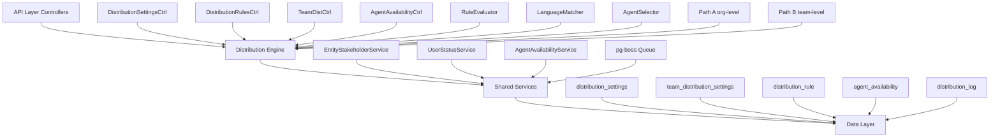

The Distribution Module automates lead assignment within organizations. When a new lead is created, the system evaluates org-defined rules to automatically assign the lead to the most appropriate agent — based on lead attributes, agent availability, language compatibility, and capacity.

## Design Principles

The module follows these core design principles:

<CardGroup cols={2}>
  <Card title="Async Distribution" icon="clock">
    `createLead()` emits `LEAD_CREATED`; a pg-boss worker handles distribution — lead creation is never blocked
  </Card>
  <Card title="Stakeholder System Reuse" icon="recycle">
    Distribution creates `EntityStakeholder` records via `EntityStakeholderService`, not a new paradigm
  </Card>
  <Card title="First-Match-Wins Rules" icon="trophy">
    Rules are evaluated top-to-bottom by priority; the first matching rule wins
  </Card>
  <Card title="Idempotency" icon="shield-check">
    Distribution engine checks for existing stakeholders or pending offers before running
  </Card>
</CardGroup>

### Distribution Paths

The engine supports two execution paths:

<Tabs>
  <Tab title="Path A - Org-level">
    **Org-level distribution** (`runDistribution`): triggered when a lead enters the org with no team context. Evaluates org-scoped rules, applies the org default method, and can bridge to Path B if a rule or default method routes to a team that has `distributionEnabled = true`.
  </Tab>
  <Tab title="Path B - Team-level">
    **Team-level distribution** (`runTeamDistribution`): triggered directly when:
    - A lead is created with a `teamId` in the event payload (team pool assignment)
    - Path A determines the lead belongs to an auto-distributing team
    - Idempotency check finds a single team-only stakeholder with auto-distribute enabled
  </Tab>
</Tabs>

## Architecture

### High-Level System Design



### Component Responsibilities

<AccordionGroup>
  <Accordion title="DistributionEngine">
    Orchestrator: receives a lead, evaluates rules, selects agent, creates assignment. Supports Path A (org) and Path B (team).
  </Accordion>
  <Accordion title="RuleEvaluator">
    Evaluates rule conditions against lead data; returns first matching rule
  </Accordion>
  <Accordion title="LanguageMatcher">
    Filters and ranks agents by language compatibility with the lead's person
  </Accordion>
  <Accordion title="AgentSelector">
    Applies the distribution method (round-robin, weighted, weighted-round-robin, direct) to the filtered agent pool
  </Accordion>
  <Accordion title="AgentAvailabilityService">
    Checks agent capacity, business hours, leave status. Two-phase capacity enforcement with advisory locks.
  </Accordion>
</AccordionGroup>

## Entity Specifications

### DistributionSettings (1 per org)

Org-level configuration for the distribution engine. Auto-created with defaults on first access via `getOrgSettingsRaw()`. Unique constraint on `organization_id`.

<Note>
When `distributionEnabled = false` (new-org default): Engine is off. `DistributionListener` and `LeadImportService` skip enqueue entirely — leads go to pool, no pg-boss jobs created.
</Note>

| Column | Type | Description |
|--------|------|-------------|
| `id` | uuid PK | Primary key |
| `organization_id` | uuid FK UNIQUE | RLS enforcement |
| `distribution_enabled` | bool | Master on/off switch (default: `false`) |
| `max_active_leads_per_agent` | int | Default: 50 |
| `max_new_leads_per_day` | int | Default: 15 |
| `capacity_enforcement_enabled` | bool | Default: `false` |
| `respect_business_hours` | bool | Default: `true` |
| `outside_hours_action` | enum | `QUEUE`, `POOL`, `DUTY_AGENT` |
| `duty_agent_id` | uuid FK nullable | Used when `outside_hours_action = DUTY_AGENT` |
| `default_method` | enum | `ROUND_ROBIN`, `POOL`, `SPECIFIC_TEAM` |
| `default_team_id` | uuid FK nullable | Used when `default_method = SPECIFIC_TEAM` |
| `default_language_matching_mode` | enum | `STRICT`, `PREFERRED` |

### TeamDistributionSettings (1 per org+team)

Per-team distribution configuration. One record per `(organization, team)` pair — unique index `uq_team_distribution_settings_org_team`.

<Warning>
Effective capacity resolution uses team settings with org fallback: if `team.capacityEnforcementEnabled` is false, no capacity checks are applied for this team's distributions.
</Warning>

| Column | Type | Description |
|--------|------|-------------|
| `id` | uuid PK | Primary key |
| `organization_id` | uuid FK | RLS enforcement |
| `team_id` | uuid FK | Required team reference |
| `distribution_enabled` | bool | Auto-distribute team pool leads (default: `false`) |
| `distribution_method` | enum | Default: `ROUND_ROBIN` |
| `agent_weights` | jsonb nullable | `{ [userId]: weight }` for WEIGHTED method |
| `language_matching_enabled` | bool | Default: `false` |
| `capacity_enforcement_enabled` | bool | Independent from org toggle (default: `false`) |
| `max_active_leads_per_agent` | int nullable | `null` = inherit from org |
| `max_new_leads_per_day` | int nullable | `null` = inherit from org |
| `last_assigned_index` | int | Round-robin cursor (default: 0) |

### DistributionRule

Rules are evaluated in ascending `priority` order (lower number = higher priority). First match wins.

<Tip>
All string-based condition fields use **case-insensitive matching**. The `area` field requires data from `LeadPropertyInterest.preferredAreas[]`.
</Tip>

| Column | Type | Description |
|--------|------|-------------|
| `id` | uuid PK | Primary key |
| `organization_id` | uuid FK | RLS enforcement |
| `name` | varchar | Rule display name |
| `priority` | int | Lower = higher priority |
| `is_active` | bool | Default: true |
| `scope` | enum | `ORGANIZATION`, `TEAM` |
| `team_id` | uuid FK nullable | For team-scoped rules |
| `condition_groups` | jsonb | `[{conditions:[{field,operator,value}]}]` |
| `method` | enum | `ROUND_ROBIN`, `WEIGHTED`, `WEIGHTED_ROUND_ROBIN`, `DIRECT` |
| `recipients` | jsonb | `{agentIds?, teamId?, poolId?, weights?}` |
| `language_matching_enabled` | bool | Default: true |
| `last_assigned_index` | int | Round-robin cursor |

#### Supported Rule Conditions

<AccordionGroup>
  <Accordion title="Lead Source Conditions">
    - **Field**: `leadSource`
    - **Operators**: `eq`, `in`
    - **Example**: `'WEBSITE'`, `['WEBSITE', 'REFERRAL']`
  </Accordion>
  <Accordion title="Temperature Conditions">
    - **Field**: `temperature`
    - **Operators**: `eq`, `in`
    - **Example**: `'HOT'`
  </Accordion>
  <Accordion title="Language Conditions">
    - **Field**: `language`
    - **Operators**: `eq`
    - **Example**: `'ar'` (matched against `person.preferredLanguage`)
  </Accordion>
  <Accordion title="Budget Conditions">
    - **Field**: `budget`
    - **Operators**: `gte`, `lte`, `between`
    - **Example**: `500000`
  </Accordion>
  <Accordion title="Tag Conditions">
    - **Field**: `tags`
    - **Operators**: `contains`
    - **Example**: `['vip']`
  </Accordion>
  <Accordion title="Area Conditions">
    - **Field**: `area`
    - **Operators**: `eq`, `in`, `contains`
    - **Example**: `'Dubai Marina'`, `['JBR', 'Downtown Dubai']`
  </Accordion>
</AccordionGroup>

## Distribution Engine Logic

### Engine Flow

<Steps>
  <Step title="Event Reception">
    `DistributionListener` receives `LEAD_CREATED` event and enqueues pg-boss job if distribution is enabled
  </Step>
  <Step title="Job Processing">
    `DistributionJobHandler` processes the job with retry logic and idempotency checks
  </Step>
  <Step title="Path Selection">
    Engine determines Path A (org-level) vs Path B (team-level) based on lead context
  </Step>
  <Step title="Rule Evaluation">
    `RuleEvaluator` processes rules by priority until first match is found
  </Step>
  <Step title="Agent Selection">
    `AgentSelector` applies distribution method to filtered candidate pool
  </Step>
  <Step title="Assignment Creation">
    Creates `EntityStakeholder` record and logs distribution activity
  </Step>
</Steps>

### Distribution Methods

<Tabs>
  <Tab title="Round Robin">
    **ROUND_ROBIN**: Cycles through available agents sequentially using `last_assigned_index` cursor
    
    ```typescript
    const nextIndex = (currentIndex + 1) % eligibleAgents.length;
    const selectedAgent = eligibleAgents[nextIndex];
    ```
  </Tab>
  <Tab title="Weighted">
    **WEIGHTED**: Selects agents based on configured weights using random distribution
    
    ```typescript
    const totalWeight = Object.values(weights).reduce((sum, w) => sum + w, 0);
    const randomValue = Math.random() * totalWeight;
    // Select agent based on cumulative weight ranges
    ```
  </Tab>
  <Tab title="Weighted Round Robin">
    **WEIGHTED_ROUND_ROBIN**: Combines round-robin fairness with weight preferences
    
    ```typescript
    // Maintains separate cursors for each weight tier
    // Ensures all agents get leads while respecting weights
    ```
  </Tab>
  <Tab title="Direct Assignment">
    **DIRECT**: Assigns to specific agent(s) listed in rule recipients
    
    ```typescript
    const targetAgents = rule.recipients.agentIds;
    // Apply capacity and availability filters
    ```
  </Tab>
</Tabs>

## pg-boss Job Configuration

The distribution system uses pg-boss for reliable async processing:

```typescript
// Job registration
await this.pgBoss.createQueue('distribution', {
  retryLimit: 3,
  retryDelay: 30,
  retryBackoff: true,
  expireInHours: 24
});

// Job payload
interface DistributionJob {
  leadId: string;
  organizationId: string;
  teamId?: string; // Present for Path B
  triggeredBy: 'LEAD_CREATED' | 'MANUAL' | 'IMPORT';
  metadata?: Record<string, any>;
}
```

<Note>
Jobs are idempotent - the engine checks for existing assignments before processing and skips if lead is already distributed.
</Note>

## API Endpoints

### Distribution Settings

<CodeGroup>
```typescript GET /api/distribution/settings
// Get org distribution settings
GET /api/distribution/settings
Authorization: Bearer {token}

Response: {
  distributionEnabled: boolean;
  maxActiveLeadsPerAgent: number;
  maxNewLeadsPerDay: number;
  defaultMethod: DistributionMethod;
  // ... other settings
}
```

```typescript PUT /api/distribution/settings
// Update org distribution settings  
PUT /api/distribution/settings
Authorization: Bearer {token}
Content-Type: application/json

{
  "distributionEnabled": true,
  "maxActiveLeadsPerAgent": 75,
  "defaultMethod": "ROUND_ROBIN"
}
```
</CodeGroup>

### Distribution Rules

<CodeGroup>
```typescript GET /api/distribution/rules
// List distribution rules
GET /api/distribution/rules?scope=ORGANIZATION&teamId={uuid}
Authorization: Bearer {token}

Response: {
  rules: DistributionRule[];
  total: number;
}
```

```typescript POST /api/distribution/rules
// Create distribution rule
POST /api/distribution/rules
Authorization: Bearer {token}
Content-Type: application/json

{
  "name": "VIP Leads to Senior Agents",
  "priority": 1,
  "scope": "ORGANIZATION", 
  "conditionGroups": [{
    "conditions": [{
      "field": "tags",
      "operator": "contains", 
      "value": ["vip"]
    }]
  }],
  "method": "WEIGHTED",
  "recipients": {
    "agentIds": ["agent-1", "agent-2"],
    "weights": {"agent-1": 3, "agent-2": 2}
  }
}
```
</CodeGroup>

### Team Distribution

<CodeGroup>
```typescript GET /api/distribution/teams/{teamId}/settings
// Get team distribution settings
GET /api/distribution/teams/{teamId}/settings
Authorization: Bearer {token}

Response: {
  distributionEnabled: boolean;
  distributionMethod: DistributionMethod;
  agentWeights?: Record<string, number>;
  // ... other team settings
}
```

```typescript POST /api/distribution/teams/{teamId}/distribute
// Manually trigger team distribution
POST /api/distribution/teams/{teamId}/distribute
Authorization: Bearer {token}
Content-Type: application/json

{
  "leadId": "lead-uuid"
}
```
</CodeGroup>

## Security & Permissions

### Role-Based Access Control

| Role | Distribution Settings | Rules Management | Manual Distribution | Analytics |
|------|---------------------|------------------|-------------------|-----------|
| **Admin** | Full access | Full access | Yes | Full access |
| **Manager** | Read/Update | Team rules only | Team leads only | Team metrics |
| **Agent** | Read only | No access | Own leads only | Own metrics |

### Row-Level Security

All distribution entities enforce RLS through `organization_id`:

```sql
-- Example RLS policy for distribution_settings
CREATE POLICY distribution_settings_org_isolation ON distribution_settings
  USING (organization_id = current_setting('rls.organization_id')::uuid);

-- Example RLS policy for distribution_rules  
CREATE POLICY distribution_rules_org_isolation ON distribution_rules
  USING (organization_id = current_setting('rls.organization_id')::uuid);
```

<Warning>
All API endpoints validate that users can only access distribution data within their organization context.
</Warning>

## Observability & Audit

### Distribution Logging

Every distribution attempt is logged in the `distribution_log` table:

```typescript
interface DistributionLog {
  id: string;
  organizationId: string;
  leadId: string;
  teamId?: string; // Present for Path B distributions
  ruleId?: string; // Rule that matched (if any)
  assignedAgentId?: string;
  distributionMethod: DistributionMethod;
  outcome: 'SUCCESS' | 'NO_AGENTS_AVAILABLE' | 'CAPACITY_EXCEEDED' | 'ERROR';
  errorMessage?: string;
  processingTimeMs: number;
  candidateCount: number;
  businessHoursActive: boolean;
  createdAt: Date;
}
```

### Analytics & Metrics

<CardGroup cols={2}>
  <Card title="Distribution Rate" icon="chart-line">
    Percentage of leads successfully auto-assigned vs. sent to pool
  </Card>
  <Card title="Agent Load Balance" icon="scale-balanced">
    Distribution of active leads across agents to identify imbalances
  </Card>
  <Card title="Rule Effectiveness" icon="target">
    Hit rate and assignment success rate for each distribution rule
  </Card>
  <Card title="Capacity Utilization" icon="gauge">
    Agent capacity usage and overflow incidents
  </Card>
</Tabs>

### Performance Metrics

<Tabs>
  <Tab title="Processing Time">
    - **P50**: < 100ms for typical distribution
    - **P95**: < 500ms for complex rule evaluation  
    - **P99**: < 1000ms for capacity-constrained scenarios
  </Tab>
  <Tab title="Success Rate">
    - **Target**: > 95% successful auto-assignment
    - **Fallback**: < 5% leads sent to pool due to no available agents
    - **Error Rate**: < 1% processing failures
  </Tab>
  <Tab title="Throughput">
    - **Peak Load**: 1000+ concurrent distributions  
    - **Queue Depth**: < 10 pending jobs under normal load
    - **Retry Rate**: < 2% of jobs require retry
  </Tab>
</Tabs>

## Edge Case Handling

### Capacity Management

<Steps>
  <Step title="Soft Capacity Check">
    Initial filter removes agents exceeding daily/active lead limits
  </Step>
  <Step title="Advisory Lock Acquisition">
    Atomic capacity verification with PostgreSQL advisory locks
  </Step>
  <Step title="Final Capacity Validation">
    Double-check capacity before creating assignment to prevent race conditions
  </Step>
  <Step title="Fallback on Overflow">
    If all agents are at capacity, lead goes to pool with capacity_exceeded outcome
  </Step>
</Steps>

### Business Hours Handling

When `respectBusinessHours = true` and outside business hours:

<Tabs>
  <Tab title="QUEUE Action">
    Lead is held in distribution queue and processed when business hours resume
  </Tab>
  <Tab title="POOL Action">  
    Lead is immediately sent to the unassigned pool
  </Tab>
  <Tab title="DUTY_AGENT Action">
    Lead is assigned to the configured duty agent (if available and under capacity)
  </Tab>
</Tabs>

### Language Matching Edge Cases

<AccordionGroup>
  <Accordion title="No Language Preference">
    If `person.preferredLanguage` is null/undefined, all agents are considered compatible
  </Accordion>
  <Accordion title="Strict Mode - No Matches">
    If no agents speak the required language, lead goes to pool
  </Accordion>
  <Accordion title="Preferred Mode - No Matches">
    Falls back to any available agent, ignoring language preference
  </Accordion>
  <Accordion title="Partial Language Data">
    Engine gracefully handles missing or malformed language data in agent profiles
  </Accordion>
</AccordionGroup>

## Performance & Scaling

### Database Optimization

```sql
-- Critical indexes for distribution performance
CREATE INDEX CONCURRENTLY idx_distribution_rules_org_priority 
  ON distribution_rules(organization_id, priority) 
  WHERE is_active = true AND is_deleted = false;

CREATE INDEX CONCURRENTLY idx_agent_availability_org_user
  ON agent_availability(organization_id, user_id);

CREATE INDEX CONCURRENTLY idx_distribution_log_lead_outcome
  ON distribution_log(lead_id, outcome, created_at);
```

### Caching Strategy

<Tabs>
  <Tab title="Settings Cache">
    Organization and team distribution settings cached for 5 minutes with Redis
    
    ```typescript  
    @Cacheable('dist:settings:{orgId}', { ttl: 300 })
    async getOrgSettings(orgId: string): Promise<DistributionSettings>
    ```
  </Tab>
  <Tab title="Rules Cache">
    Active distribution rules cached per organization with cache invalidation on updates
    
    ```typescript
    @Cacheable('dist:rules:{orgId}:{scope}', { ttl: 600 })  
    async getActiveRules(orgId: string, scope: RuleScope): Promise<DistributionRule[]>
    ```
  </Tab>
  <Tab title="Agent Availability">
    Agent capacity and availability cached for 1 minute due to frequent updates
    
    ```typescript
    @Cacheable('dist:availability:{orgId}', { ttl: 60 })
    async getAvailableAgents(orgId: string): Promise<User[]>
    ```
  </Tab>
</Tabs>

### Scaling Considerations

<Check>
**Horizontal Scaling**: pg-boss workers can be distributed across multiple app instances for higher throughput
</Check>

<Check>  
**Database Partitioning**: `distribution_log` table can be partitioned by `created_at` for better query performance on large datasets
</Check>

<Check>
**Queue Monitoring**: CloudWatch metrics track queue depth, processing time, and error rates for auto-scaling triggers
</Check>

## Module Structure

```
src/modules/crm/distribution/
├── controllers/
│   ├── distribution-settings.controller.ts
│   ├── distribution-rules.controller.ts  
│   ├── team-distribution.controller.ts
│   ├── agent-availability.controller.ts
│   └── distribution-analytics.controller.ts
├── services/
│   ├── distribution-engine.service.ts
│   ├── distribution-settings.service.ts
│   ├── distribution-rules.service.ts
│   ├── agent-availability.service.ts
│   └── distribution-analytics.service.ts
├── engines/
│   ├── rule-evaluator.engine.ts
│   ├── language-matcher.engine.ts
│   └── agent-selector.engine.ts
├── listeners/
│   └── distribution.listener.ts
├── jobs/
│   └── distribution-job.handler.ts
├── entities/
│   ├── distribution-settings.entity.ts
│   ├── team-distribution-settings.entity.ts
│   ├── distribution-rule.entity.ts
│   ├── agent-availability.entity.ts
│   └── distribution-log.entity.ts
├── dtos/
│   ├── distribution-settings.dto.ts
│   ├── distribution-rule.dto.ts
│   └── manual-distribution.dto.ts
└── types/
    ├── distribution-method.enum.ts
    ├── rule-condition.interface.ts
    └── distribution-outcome.enum.ts
```

## Integration Points

### Lead Management Integration

<Steps>
  <Step title="Lead Creation">
    `LeadService.createLead()` emits `LEAD_CREATED` event with lead and organization context
  </Step>
  <Step title="Event Processing">
    `DistributionListener` receives event and conditionally enqueues distribution job
  </Step>
  <Step title="Stakeholder Creation">
    Successful distribution creates `EntityStakeholder` record via shared service
  </Step>
  <Step title="Activity Logging">
    Assignment activity is logged to lead timeline via `ActivityLogService`
  </Step>
</Steps>

### Team Management Integration

The distribution system integrates tightly with team management:

- **Team Settings**: Each team can have independent distribution configuration
- **Agent Pool**: Team membership determines eligible agents for team-scoped distributions  
- **Permissions**: Team managers can configure rules and settings for their teams only

### User Management Integration

<CardGroup cols={2}>
  <Card title="Agent Status" icon="circle-check">
    Only ONLINE agents are eligible for distribution (via `UserStatusService`)
  </Card>
  <Card title="Agent Languages" icon="language">
    Agent language skills stored in user profile, used for language matching
  </Card>
  <Card title="Agent Capacity" icon="gauge-high">
    Agent availability and capacity tracked separately from user status
  </Card>
  <Card title="Business Hours" icon="clock">
    Organization business hours settings control when distribution is active
  </Card>
</CardGroup>

## Environment Configuration

### Required Environment Variables

```bash
# pg-boss Configuration
PGBOSS_SCHEMA=pgboss
PGBOSS_MAX_CONNECTIONS=10

# Distribution Settings  
DISTRIBUTION_DEFAULT_CAPACITY_ACTIVE=50
DISTRIBUTION_DEFAULT_CAPACITY_DAILY=15
DISTRIBUTION_PROCESSING_TIMEOUT_MS=30000

# Redis Cache (for settings/rules cache)
REDIS_URL=redis://localhost:6379
CACHE_TTL_DISTRIBUTION_SETTINGS=300
CACHE_TTL_DISTRIBUTION_RULES=600
```

### Feature Flags

```typescript
// Feature toggles for gradual rollout
interface DistributionFeatures {
  enableWeightedRoundRobin: boolean;      // Default: false
  enableLanguageMatching: boolean;        // Default: true  
  enableCapacityEnforcement: boolean;     // Default: false
  enableBusinessHoursGating: boolean;     // Default: true
  enableDistributionAnalytics: boolean;   // Default: true
}
```

<Note>
Feature flags are controlled via organization settings and can be toggled per-org for gradual feature rollout.
</Note>