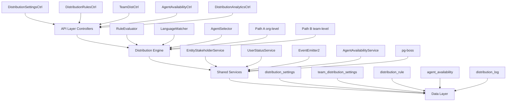

# Distribution Module Specification

<Info>
**Status:** Active — fully implemented  
**Module Path:** `src/modules/crm/distribution/`
</Info>

## Overview

The Distribution Module automates lead assignment within organizations. When a new lead is created, the system evaluates org-defined rules to automatically assign the lead to the most appropriate agent — based on lead attributes, agent availability, language compatibility, and capacity.

### Design Principles

<CardGroup cols={2}>
  <Card title="Async Distribution" icon="clock">
    `createLead()` emits `LEAD_CREATED`; a pg-boss worker handles distribution — lead creation is never blocked
  </Card>
  <Card title="Stakeholder System Reuse" icon="users">
    Distribution creates `EntityStakeholder` records via `EntityStakeholderService`, not a new paradigm
  </Card>
  <Card title="First-Match-Wins Rules" icon="trophy">
    Rules are evaluated top-to-bottom by priority; the first matching rule wins
  </Card>
  <Card title="Idempotency" icon="shield">
    Distribution engine checks for existing stakeholders or pending offers before running
  </Card>
</CardGroup>

<Note>
**No Retroactive Distribution:** Existing leads are unaffected when rules are created; only new leads trigger distribution
</Note>

### Distribution Paths

The engine supports two execution paths:

<Tabs>
  <Tab title="Path A — Org-Level">
    **Trigger:** Lead enters org with no team context  
    **Process:** Evaluates org-scoped rules, applies org default method  
    **Bridge:** Can route to Path B if rule/default method routes to a team with `distributionEnabled = true`
  </Tab>
  <Tab title="Path B — Team-Level">
    **Triggers:**
    - Lead created with `teamId` in event payload
    - Path A determines lead belongs to auto-distributing team
    - Idempotency check finds single team-only stakeholder with auto-distribute enabled
    
    **Process:** Evaluates team-scoped rules, uses team settings with org fallback
  </Tab>
</Tabs>

## Architecture

### High-Level Diagram



### Component Responsibilities

| Component | Responsibility |
|-----------|----------------|
| **DistributionEngine** | Orchestrator: receives a lead, evaluates rules, selects agent, creates assignment |
| **RuleEvaluator** | Evaluates rule conditions against lead data; returns first matching rule |
| **LanguageMatcher** | Filters and ranks agents by language compatibility |
| **AgentSelector** | Applies distribution method (round-robin, weighted, etc.) to agent pool |
| **AgentAvailabilityService** | Checks agent capacity, business hours, leave status |
| **UserStatusService** | Pre-filters candidate agents to only ONLINE status |

## Entity Specifications

### DistributionSettings (1 per org)

Org-level configuration for the distribution engine. Auto-created with defaults on first access.

<AccordionGroup>
  <Accordion title="Schema Definition">
    | Column | Type | Notes |
    |--------|------|-------|
    | id | uuid PK | |
    | organization_id | uuid FK UNIQUE | RLS |
    | distribution_enabled | bool | default `false`. Master on/off switch |
    | max_active_leads_per_agent | int | default 50 |
    | max_new_leads_per_day | int | default 15 |
    | capacity_enforcement_enabled | bool | default `false` |
    | respect_business_hours | bool | default `true` |
    | outside_hours_action | enum | `QUEUE`, `POOL`, `DUTY_AGENT` |
    | duty_agent_id | uuid FK nullable | used when outside_hours_action = DUTY_AGENT |
    | default_method | enum | `ROUND_ROBIN`, `POOL`, `SPECIFIC_TEAM` |
    | default_team_id | uuid FK nullable | used when default_method = SPECIFIC_TEAM |
    | default_language_matching_mode | enum | `STRICT`, `PREFERRED` |
    | default_balancing_factors | jsonb nullable | Optional balancing configuration |
    | pool_alert_enabled | bool | Whether to send pool-overload alerts |
    | pool_alert_threshold | int | Lead count that triggers alert |
    | pool_alert_window_minutes | int | Rolling window for counting leads |
    | updated_by | uuid FK nullable | |
    | created_at, updated_at | timestamp | |
  </Accordion>
</AccordionGroup>

<Warning>
**Master Toggle Behavior:**
- `distributionEnabled = false` (default): Engine off, leads go to pool
- `distributionEnabled = true`: Engine active, auto-upgrades `defaultMethod` from `POOL` to `ROUND_ROBIN`
</Warning>

### TeamDistributionSettings (1 per org+team)

Per-team distribution configuration with unique index `uq_team_distribution_settings_org_team`.

<AccordionGroup>
  <Accordion title="Schema Definition">
    | Column | Type | Notes |
    |--------|------|-------|
    | id | uuid PK | |
    | organization_id | uuid FK | RLS |
    | team_id | uuid FK | required, not nullable |
    | distribution_enabled | bool | default `false` |
    | distribution_method | enum | default `ROUND_ROBIN` |
    | agent_weights | jsonb nullable | `{ [userId]: weight }` |
    | language_matching_enabled | bool | default `false` |
    | language_matching_mode | enum nullable | Language mode override |
    | capacity_enforcement_enabled | bool | default `false` |
    | max_active_leads_per_agent | int nullable | `null` = inherit from org |
    | max_new_leads_per_day | int nullable | `null` = inherit from org |
    | respect_business_hours | bool | default `false` |
    | last_assigned_index | int | default 0, round-robin cursor |
    | default_balancing_factors | jsonb nullable | |
    | updated_by | uuid FK nullable | |
    | created_at, updated_at | timestamp | |
  </Accordion>
</AccordionGroup>

### DistributionRule

Rules evaluated in ascending `priority` order (lower number = higher priority). First match wins.

<AccordionGroup>
  <Accordion title="Schema Definition">
    | Column | Type | Notes |
    |--------|------|-------|
    | id | uuid PK | |
    | organization_id | uuid FK | RLS |
    | name | varchar | |
    | priority | int | lower = higher priority |
    | is_active | bool | default true |
    | scope | enum | `ORGANIZATION`, `TEAM` |
    | team_id | uuid FK nullable | for team-scoped rules |
    | condition_groups | jsonb | AND-within-OR groups |
    | method | enum | `ROUND_ROBIN`, `WEIGHTED`, `WEIGHTED_ROUND_ROBIN`, `DIRECT` |
    | recipients | jsonb | `{agentIds?, teamId?, poolId?, weights?}` |
    | language_matching_enabled | bool | default true |
    | language_matching_mode | enum | `STRICT`, `PREFERRED` |
    | balancing_factors | jsonb nullable | |
    | last_assigned_index | int | round-robin cursor |
    | created_by | uuid FK | |
    | created_at, updated_at | timestamp | |
    | is_deleted | bool | soft delete |
  </Accordion>
</AccordionGroup>

### Rule Conditions — Supported Fields

<Tabs>
  <Tab title="Lead Source">
    | Field | Operator(s) | Example |
    |-------|-------------|---------|
    | `leadSource` | `eq`, `in` | `'WEBSITE'`, `['WEBSITE', 'REFERRAL']` |
    | `sourceChannel` | `eq`, `in` | `'WHATSAPP'` |
  </Tab>
  <Tab title="Lead Properties">
    | Field | Operator(s) | Example |
    |-------|-------------|---------|
    | `temperature` | `eq`, `in` | `'HOT'` |
    | `budget` | `gte`, `lte`, `between` | `500000` |
    | `intent` | `eq` | `'BUY'` |
    | `tags` | `contains` | `['vip']` |
  </Tab>
  <Tab title="Location & Language">
    | Field | Operator(s) | Example |
    |-------|-------------|---------|
    | `language` | `eq` | `'ar'` (from person.preferredLanguage) |
    | `area` | `eq`, `in`, `contains` | `'Dubai Marina'`, `['JBR', 'Downtown Dubai']` |
  </Tab>
</Tabs>

<Note>
All string-based condition fields use **case-insensitive matching**. The `area` field requires data from `LeadPropertyInterest.preferredAreas[]`.
</Note>

## Type Definitions

### Core Distribution Types

<CodeGroup>

```typescript Distribution Method Enum
export enum DistributionMethod {
  ROUND_ROBIN = 'ROUND_ROBIN',
  WEIGHTED = 'WEIGHTED',
  WEIGHTED_ROUND_ROBIN = 'WEIGHTED_ROUND_ROBIN',
  DIRECT = 'DIRECT',
  POOL = 'POOL'
}
```

```typescript Outside Hours Action
export enum OutsideHoursAction {
  QUEUE = 'QUEUE',
  POOL = 'POOL',
  DUTY_AGENT = 'DUTY_AGENT'
}
```

```typescript Language Matching Mode
export enum LanguageMatchingMode {
  STRICT = 'STRICT',
  PREFERRED = 'PREFERRED'
}
```

</CodeGroup>

### Event Payloads

<CodeGroup>

```typescript Lead Created Event
interface LeadCreatedEvent {
  leadId: string;
  organizationId: string;
  teamId?: string; // Optional team context
  createdBy?: string;
  source: 'API' | 'IMPORT' | 'WEBHOOK';
  metadata?: Record<string, any>;
}
```

```typescript Distribution Job Payload
interface DistributionJobData {
  leadId: string;
  organizationId: string;
  teamId?: string;
  retryCount?: number;
  originalEventSource?: string;
}
```

</CodeGroup>

## Distribution Engine

### Path A — Organization-Level Distribution

<Steps>
  <Step title="Initial Checks">
    - Verify org distribution is enabled
    - Check for existing assignments (idempotency)
    - Load lead with related data
  </Step>
  
  <Step title="Rule Evaluation">
    - Evaluate org-scoped rules by priority
    - Apply first matching rule or use default method
  </Step>
  
  <Step title="Agent Selection">
    - Filter agents by availability and capacity
    - Apply language matching if enabled
    - Execute distribution method
  </Step>
  
  <Step title="Assignment">
    - Create EntityStakeholder record
    - Log distribution event
    - Bridge to Path B if routing to auto-distributing team
  </Step>
</Steps>

### Path B — Team-Level Distribution

<Steps>
  <Step title="Team Context Setup">
    - Load team distribution settings
    - Verify team distribution is enabled
    - Get team members and availability
  </Step>
  
  <Step title="Rule Evaluation">
    - Evaluate team-scoped rules first
    - Fall back to team default method if no rule matches
  </Step>
  
  <Step title="Capacity Resolution">
    - Use team capacity settings if enabled
    - Fall back to org settings for inheritance
  </Step>
  
  <Step title="Assignment">
    - Create assignment within team context
    - Log with team_id reference
  </Step>
</Steps>

### Agent Selection Methods

<Tabs>
  <Tab title="Round Robin">
    Cycles through available agents sequentially using `last_assigned_index` cursor.
    
    ```typescript
    // Pseudo-code
    const nextIndex = (currentIndex + 1) % availableAgents.length;
    const selectedAgent = availableAgents[nextIndex];
    ```
  </Tab>
  
  <Tab title="Weighted">
    Selects agents based on configured weights with probability distribution.
    
    ```typescript
    // Pseudo-code
    const totalWeight = agents.reduce((sum, agent) => sum + agent.weight, 0);
    const random = Math.random() * totalWeight;
    // Select based on cumulative weight ranges
    ```
  </Tab>
  
  <Tab title="Weighted Round Robin">
    Combines round-robin fairness with weight-based probability.
    
    ```typescript
    // Maintains separate cursors per agent based on weights
    // Ensures all agents get assignments over time
    ```
  </Tab>
  
  <Tab title="Direct Assignment">
    Assigns to specific agent(s) defined in rule recipients.
    
    ```typescript
    const targetAgents = rule.recipients.agentIds;
    // Validate availability and assign
    ```
  </Tab>
</Tabs>

## pg-boss Job Configuration

### Queue Configuration

<CodeGroup>

```typescript Job Definition
const DISTRIBUTION_JOB_NAME = 'lead-distribution';

const jobOptions = {
  retryLimit: 3,
  retryDelay: 30, // seconds
  retryBackoff: true,
  expireInHours: 24,
  singletonKey: 'leadId', // Prevent duplicate jobs
  priority: 1 // High priority for lead distribution
};
```

```typescript Retry Strategy
interface RetryConfig {
  attempt1: { delay: 30 }; // 30 seconds
  attempt2: { delay: 90 }; // 1.5 minutes (exponential)
  attempt3: { delay: 270 }; // 4.5 minutes (exponential)
  // After 3 failures, job moves to failed state
}
```

</CodeGroup>

### Error Handling

<Warning>
**Failed Job Handling:**
- After 3 retry attempts, jobs enter failed state
- Failed jobs are logged with error details
- Leads remain in pool for manual assignment
- Alerts sent to system administrators
</Warning>

## API Endpoints

### Distribution Settings

<AccordionGroup>
  <Accordion title="GET /api/distribution/settings">
    **Description:** Get organization distribution settings
    
    **Response:**
    ```json
    {
      "id": "uuid",
      "distributionEnabled": true,
      "maxActiveLeadsPerAgent": 50,
      "defaultMethod": "ROUND_ROBIN",
      "respectBusinessHours": true,
      // ... other settings
    }
    ```
  </Accordion>
  
  <Accordion title="PUT /api/distribution/settings">
    **Description:** Update organization distribution settings
    
    **Body:**
    ```json
    {
      "distributionEnabled": true,
      "maxActiveLeadsPerAgent": 75,
      "defaultMethod": "WEIGHTED",
      "respectBusinessHours": false
    }
    ```
  </Accordion>
</AccordionGroup>

### Distribution Rules

<AccordionGroup>
  <Accordion title="GET /api/distribution/rules">
    **Description:** List distribution rules for organization
    
    **Query Parameters:**
    - `scope` (optional): `ORGANIZATION` | `TEAM`
    - `teamId` (optional): Filter by team
    - `active` (optional): Filter by active status
    
    **Response:**
    ```json
    {
      "rules": [
        {
          "id": "uuid",
          "name": "VIP Leads",
          "priority": 1,
          "scope": "ORGANIZATION",
          "method": "DIRECT",
          "conditionGroups": [...],
          "recipients": {...}
        }
      ]
    }
    ```
  </Accordion>
  
  <Accordion title="POST /api/distribution/rules">
    **Description:** Create new distribution rule
    
    **Body:**
    ```json
    {
      "name": "Hot Leads - Arabic Speakers",
      "priority": 5,
      "scope": "ORGANIZATION",
      "conditionGroups": [
        {
          "conditions": [
            { "field": "temperature", "operator": "eq", "value": "HOT" },
            { "field": "language", "operator": "eq", "value": "ar" }
          ]
        }
      ],
      "method": "WEIGHTED",
      "recipients": {
        "agentIds": ["agent1-uuid", "agent2-uuid"],
        "weights": { "agent1-uuid": 3, "agent2-uuid": 2 }
      }
    }
    ```
  </Accordion>
</AccordionGroup>

### Team Distribution

<AccordionGroup>
  <Accordion title="GET /api/teams/{teamId}/distribution">
    **Description:** Get team distribution settings
  </Accordion>
  
  <Accordion title="PUT /api/teams/{teamId}/distribution">
    **Description:** Update team distribution settings
    
    **Body:**
    ```json
    {
      "distributionEnabled": true,
      "distributionMethod": "ROUND_ROBIN",
      "capacityEnforcementEnabled": false,
      "languageMatchingEnabled": true
    }
    ```
  </Accordion>
</AccordionGroup>

### Agent Availability

<AccordionGroup>
  <Accordion title="GET /api/agents/availability">
    **Description:** Get agent availability status
    
    **Response:**
    ```json
    {
      "agents": [
        {
          "userId": "uuid",
          "status": "ONLINE",
          "activeLeadsCount": 12,
          "dailyLeadsCount": 3,
          "isWithinBusinessHours": true,
          "isOnLeave": false
        }
      ]
    }
    ```
  </Accordion>
  
  <Accordion title="PUT /api/agents/{agentId}/availability">
    **Description:** Update agent availability settings
    
    **Body:**
    ```json
    {
      "isAvailable": true,
      "maxActiveLeads": 40,
      "maxDailyLeads": 12
    }
    ```
  </Accordion>
</AccordionGroup>

## Security & Permissions

### Role-Based Access Control

| Role | Permissions |
|------|------------|
| **Super Admin** | Full access to all distribution settings and rules |
| **Admin** | Manage org distribution settings, create/edit rules |
| **Manager** | View distribution settings, manage team distribution |
| **Agent** | View own availability, update personal settings |

### Row-Level Security (RLS)

<CodeGroup>

```sql Distribution Settings RLS
-- Users can only access their organization's settings
CREATE POLICY distribution_settings_org_access ON distribution_settings
  FOR ALL USING (organization_id = get_current_organization_id());
```

```sql Distribution Rules RLS  
-- Users can only access rules for their organization
CREATE POLICY distribution_rules_org_access ON distribution_rule
  FOR ALL USING (organization_id = get_current_organization_id());
```

```sql Team Distribution RLS
-- Users can only access team settings for their organization
CREATE POLICY team_distribution_org_access ON team_distribution_settings
  FOR ALL USING (organization_id = get_current_organization_id());
```

</CodeGroup>

### API Security

<Tabs>
  <Tab title="Authentication">
    - All endpoints require valid JWT token
    - Token must include organization context
    - Rate limiting applied per organization
  </Tab>
  
  <Tab title="Authorization">
    - Permission checks based on user role
    - Team-scoped operations validate team membership
    - Distribution rule changes require admin privileges
  </Tab>
  
  <Tab title="Input Validation">
    - All inputs validated against schema
    - SQL injection prevention via parameterized queries
    - XSS protection on text fields
  </Tab>
</Tabs>

## Observability & Audit

### Distribution Logging

Every distribution attempt is logged in `distribution_log` table:

<CodeGroup>

```typescript Distribution Log Schema
interface DistributionLog {
  id: string;
  organizationId: string;
  leadId: string;
  teamId?: string; // Set for Path B distributions
  ruleId?: string; // Which rule triggered (if any)
  method: DistributionMethod;
  assignedAgentId?: string;
  outcome: 'SUCCESS' | 'NO_AGENTS_AVAILABLE' | 'CAPACITY_EXCEEDED' | 'ERROR';
  errorMessage?: string;
  processingTimeMs: number;
  metadata: {
    path: 'A' | 'B';
    candidateAgents: number;
    filteredAgents: number;
    businessHoursActive: boolean;
  };
  createdAt: Date;
}
```

</CodeGroup>

### Metrics & Analytics

<CardGroup cols={2}>
  <Card title="Distribution Success Rate" icon="chart-line">
    Percentage of leads successfully assigned vs. pooled
  </Card>
  <Card title="Agent Utilization" icon="users">
    Active leads per agent, daily assignment counts
  </Card>
  <Card title="Rule Performance" icon="gear">
    Which rules are most/least effective
  </Card>
  <Card title="Response Times" icon="clock">
    Distribution processing latency metrics
  </Card>
</CardGroup>

### Alerting

<Warning>
**Critical Alerts:**
- Distribution engine failures (3+ consecutive failures)
- Pool overflow (exceeds threshold for configured window)
- Agent capacity warnings (approaching limits)
- Business hours misconfigurations
</Warning>

## Analytics & Metrics

### Distribution Analytics Endpoint

<AccordionGroup>
  <Accordion title="GET /api/distribution/analytics">
    **Query Parameters:**
    - `startDate`, `endDate`: Date range filter
    - `teamId` (optional): Team-specific analytics
    - `granularity`: `hour` | `day` | `week` | `month`
    
    **Response:**
    ```json
    {
      "summary": {
        "totalDistributions": 1250,
        "successRate": 0.92,
        "avgProcessingTimeMs": 145,
        "pooledLeads": 100
      },
      "byMethod": {
        "ROUND_ROBIN": { "count": 800, "successRate": 0.95 },
        "WEIGHTED": { "count": 300, "successRate": 0.88 },
        "DIRECT": { "count": 150, "successRate": 0.97 }
      },
      "agentUtilization": [
        {
          "agentId": "uuid",
          "assignedLeads": 45,
          "utilization": 0.90
        }
      ]
    }
    ```
  </Accordion>
</AccordionGroup>

## Edge Case Handling

### Business Hours Scenarios

<Steps>
  <Step title="Outside Business Hours">
    When `respectBusinessHours = true` and current time is outside org business hours:
    - `QUEUE`: Hold lead for next business day
    - `POOL`: Send to unassigned pool immediately  
    - `DUTY_AGENT`: Assign to designated duty agent
  </Step>
  
  <Step title="No Available Agents">
    When all agents are at capacity or offline:
    - Lead goes to pool with outcome `NO_AGENTS_AVAILABLE`
    - Pool overflow alerts triggered if threshold exceeded
  </Step>
  
  <Step title="Rule Conflicts">
    Multiple rules with same priority:
    - Order by creation date (first created wins)
    - Log warning about priority conflict
  </Step>
</Steps>

### Error Recovery

<Tabs>
  <Tab title="Distribution Failures">
    - Automatic retry with exponential backoff
    - After max retries, lead goes to pool
    - Error details logged for troubleshooting
  </Tab>
  
  <Tab title="Data Consistency">
    - Idempotency checks prevent duplicate assignments
    - Database transactions ensure atomicity
    - Compensation logic for partial failures
  </Tab>
  
  <Tab title="Service Dependencies">
    - Graceful degradation when services unavailable
    - Fallback to basic round-robin if complex logic fails
    - Circuit breakers for external service calls
  </Tab>
</Tabs>

## Performance & Scaling

### Optimization Strategies

<CardGroup cols={2}>
  <Card title="Database Optimization" icon="database">
    - Indexes on frequently queried columns
    - Connection pooling for high throughput
    - Query optimization for rule evaluation
  </Card>
  <Card title="Caching Strategy" icon="memory">
    - Redis cache for distribution settings
    - Agent availability cached with TTL
    - Rule evaluation results cached per lead type
  </Card>
  <Card title="Async Processing" icon="arrows">
    - pg-boss queue for reliable job processing
    - Batch processing for multiple leads
    - Parallel evaluation for independent rules
  </Card>
  <Card title="Monitoring" icon="chart-bar">
    - Real-time metrics on distribution performance
    - Queue length and processing time alerts
    - Capacity utilization dashboards
  </Card>
</CardGroup>

### Scalability Considerations

<Note>
**High-Volume Organizations:**
- Partition distribution logs by date
- Implement rule caching with invalidation
- Consider sharding by organization for very large deployments
- Use read replicas for analytics queries
</Note>

## Module Structure

### File Organization

```
src/modules/crm/distribution/
├── controllers/
│   ├── distribution-settings.controller.ts
│   ├── distribution-rules.controller.ts
│   ├── team-distribution.controller.ts
│   ├── agent-availability.controller.ts
│   └── distribution-analytics.controller.ts
├── services/
│   ├── distribution-engine.service.ts
│   ├── distribution-settings.service.ts
│   ├── distribution-rules.service.ts
│   ├── agent-availability.service.ts
│   ├── rule-evaluator.service.ts
│   ├── language-matcher.service.ts
│   └── agent-selector.service.ts
├── entities/
│   ├── distribution-settings.entity.ts
│   ├── team-distribution-settings.entity.ts
│   ├── distribution-rule.entity.ts
│   ├── agent-availability.entity.ts
│   └── distribution-log.entity.ts
├── dto/
│   ├── distribution-settings.dto.ts
│   ├── distribution-rule.dto.ts
│   └── analytics.dto.ts
├── listeners/
│   └── distribution.listener.ts
├── jobs/
│   └── distribution-job.handler.ts
├── types/
│   ├── distribution.types.ts
│   └── rule-condition.types.ts
└── distribution.module.ts
```

## Integration Points

### External Dependencies

<Tabs>
  <Tab title="CRM Core">
    - `EntityStakeholderService` for assignment creation
    - `UserService` for agent data and status
    - `TeamService` for team membership
    - `OrganizationService` for business hours
  </Tab>
  
  <Tab title="Event System">
    - Listens for `LEAD_CREATED` events
    - Emits `LEAD_ASSIGNED` events
    - Integration with notification system
  </Tab>
  
  <Tab title="Queue System">
    - pg-boss for reliable job processing
    - Redis for caching and session data
    - Database for persistent storage
  </Tab>
</Tabs>

### API Integrations

<Info>
**Webhook Support:** Distribution events can trigger external webhooks for CRM integrations, reporting systems, or third-party automation tools.
</Info>

## Environment Configuration

### Required Environment Variables

<CodeGroup>

```bash Production Configuration
# Distribution Engine
DISTRIBUTION_ENABLED=true
DISTRIBUTION_MAX_RETRIES=3
DISTRIBUTION_RETRY_DELAY=30

# Queue Configuration  
PGBOSS_CONNECTION_STRING=postgresql://...
PGBOSS_MAX_CONNECTIONS=20

# Caching
REDIS_URL=redis://...
DISTRIBUTION_CACHE_TTL=300

# Business Hours
DEFAULT_TIMEZONE=Asia/Dubai
BUSINESS_HOURS_ENABLED=true
```

```bash Development Configuration
# Distribution Engine
DISTRIBUTION_ENABLED=true
DISTRIBUTION_DEBUG=true
DISTRIBUTION_LOG_LEVEL=debug

# Local Development
DATABASE_URL=postgresql://localhost:5432/crm_dev
REDIS_URL=redis://localhost:6379
```

</CodeGroup>

### Feature Flags

| Flag | Description | Default |
|------|-------------|---------|
| `DISTRIBUTION_V2_ENABLED` | Enable new distribution engine | `false` |
| `ADVANCED_RULE_CONDITIONS` | Enable complex rule conditions | `true` |
| `DISTRIBUTION_ANALYTICS` | Enable analytics endpoints | `true` |
| `POOL_OVERFLOW_ALERTS` | Enable pool overflow alerting | `true` |

<Tip>
Use feature flags to gradually roll out distribution features and quickly disable problematic functionality if needed.
</Tip>