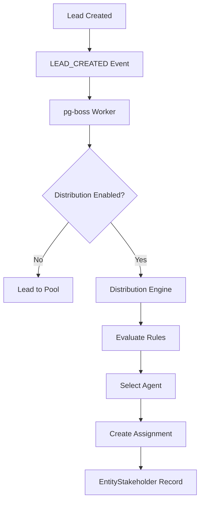

The Distribution Module automates lead assignment within organizations through a rule-based engine that evaluates lead attributes, agent availability, and capacity constraints to route leads to the most appropriate agents or teams.

## Overview

<Note>
The distribution system operates asynchronously - lead creation is never blocked by distribution processing. When a lead is created, it emits a `LEAD_CREATED` event that triggers background distribution via pg-boss workers.
</Note>

### Key Features

- **Rule-based routing** with priority-based evaluation (first match wins)
- **Dual distribution paths** for organization-level and team-level assignment
- **Agent capacity management** with configurable limits and business hours
- **Language compatibility matching** between leads and agents
- **Multiple distribution methods** (round-robin, weighted, direct assignment)
- **Real-time availability tracking** with online status integration

### Distribution Paths

The engine supports two execution paths:

**Path A - Organization-level distribution**: Triggered when a lead enters with no team context. Evaluates org-scoped rules and can bridge to team-level distribution.

**Path B - Team-level distribution**: Triggered when leads are assigned to teams with auto-distribution enabled or routed from Path A.

## Architecture

### Core Components

<CardGroup cols={2}>
<Card title="Distribution Engine" icon="gear">
Main orchestrator that processes leads and executes assignment logic
</Card>
<Card title="Rule Evaluator" icon="list-check">
Evaluates distribution rules against lead attributes
</Card>
<Card title="Agent Selector" icon="users">
Applies distribution methods to filtered agent pools
</Card>
<Card title="Availability Service" icon="clock">
Manages agent capacity and business hours enforcement
</Card>
</CardGroup>

### System Flow



## Configuration

### Organization Settings

Each organization has a `DistributionSettings` record that controls global distribution behavior:

<Steps>
<Step title="Enable Distribution">
Set `distribution_enabled` to `true` to activate the distribution engine
</Step>
<Step title="Configure Capacity">
Set agent limits via `max_active_leads_per_agent` and `max_new_leads_per_day`
</Step>
<Step title="Set Default Method">
Choose from `ROUND_ROBIN`, `POOL`, or `SPECIFIC_TEAM`
</Step>
<Step title="Configure Business Hours">
Enable `respect_business_hours` and set `outside_hours_action`
</Step>
</Steps>

#### Key Settings

| Setting | Description | Default |
|---------|-------------|---------|
| `distribution_enabled` | Master on/off switch | `false` |
| `max_active_leads_per_agent` | Active lead limit per agent | 50 |
| `max_new_leads_per_day` | Daily new lead limit | 15 |
| `capacity_enforcement_enabled` | Enable capacity checking | `false` |
| `respect_business_hours` | Honor business hours | `true` |
| `default_method` | Fallback distribution method | `ROUND_ROBIN` |

### Team Settings

Teams can override organization settings with `TeamDistributionSettings`:

<Accordion title="Team Configuration Options">
```json
{
  "distribution_enabled": true,
  "distribution_method": "WEIGHTED",
  "agent_weights": {
    "user-123": 0.6,
    "user-456": 0.4
  },
  "language_matching_enabled": true,
  "capacity_enforcement_enabled": false,
  "max_active_leads_per_agent": null,
  "respect_business_hours": false
}
```
</Accordion>

## Distribution Rules

Rules are evaluated in ascending priority order (lower number = higher priority) with first-match-wins logic.

### Rule Structure

<CodeGroup>
```json Rule Example
{
  "id": "rule-123",
  "name": "VIP Arabic Speakers",
  "priority": 1,
  "scope": "ORGANIZATION",
  "condition_groups": [
    {
      "conditions": [
        {
          "field": "tags",
          "operator": "contains",
          "value": ["vip"]
        },
        {
          "field": "language",
          "operator": "eq",
          "value": "ar"
        }
      ]
    }
  ],
  "method": "WEIGHTED",
  "recipients": {
    "agentIds": ["agent-1", "agent-2"],
    "weights": {
      "agent-1": 0.7,
      "agent-2": 0.3
    }
  },
  "language_matching_enabled": true,
  "language_matching_mode": "STRICT"
}
```

```json Team Rule
{
  "scope": "TEAM",
  "team_id": "team-456",
  "condition_groups": [
    {
      "conditions": [
        {
          "field": "budget",
          "operator": "gte",
          "value": 1000000
        }
      ]
    }
  ],
  "method": "DIRECT",
  "recipients": {
    "agentIds": ["senior-agent-1"]
  }
}
```
</CodeGroup>

### Supported Conditions

| Field | Operators | Description |
|-------|-----------|-------------|
| `leadSource` | `eq`, `in` | Lead source matching |
| `temperature` | `eq`, `in` | Lead temperature (HOT, WARM, COLD) |
| `language` | `eq` | Person's preferred language |
| `budget` | `gte`, `lte`, `between` | Budget range filtering |
| `tags` | `contains` | Tag-based routing |
| `sourceChannel` | `eq`, `in` | Communication channel |
| `intent` | `eq` | Lead intent (BUY, RENT, etc.) |
| `area` | `eq`, `in`, `contains` | Preferred area matching |

<Warning>
All string-based conditions use case-insensitive matching. The `area` field requires lead property interests to be pre-loaded.
</Warning>

## Distribution Methods

### Round Robin
Distributes leads sequentially across available agents.

```typescript
// Maintains last_assigned_index cursor
const nextAgent = eligibleAgents[
  (lastAssignedIndex + 1) % eligibleAgents.length
];
```

### Weighted Distribution
Assigns leads based on configured agent weights.

<Tabs>
<Tab title="Configuration">
```json
{
  "method": "WEIGHTED",
  "recipients": {
    "agentIds": ["agent-1", "agent-2", "agent-3"],
    "weights": {
      "agent-1": 0.5,
      "agent-2": 0.3,
      "agent-3": 0.2
    }
  }
}
```
</Tab>
<Tab title="Selection Logic">
```typescript
// Weighted random selection
const totalWeight = Object.values(weights).reduce((a, b) => a + b, 0);
const random = Math.random() * totalWeight;
let cumulative = 0;

for (const [agentId, weight] of Object.entries(weights)) {
  cumulative += weight;
  if (random <= cumulative) {
    return agentId;
  }
}
```
</Tab>
</Tabs>

### Weighted Round Robin
Combines round-robin with weight-based frequency adjustment.

### Direct Assignment
Assigns leads directly to specified agents or teams.

## Agent Availability

The system checks multiple factors when determining agent eligibility:

<Steps>
<Step title="Online Status Check">
Only agents with `ONLINE` status are considered
</Step>
<Step title="Capacity Verification">
Checks active leads and daily limits against configured thresholds
</Step>
<Step title="Business Hours Gating">
Respects organization business hours if enabled
</Step>
<Step title="Language Compatibility">
Matches agent languages with lead requirements
</Step>
</Steps>

### Capacity Management

<Info>
Capacity enforcement uses two-phase checking with advisory locks to prevent race conditions during high-volume lead processing.
</Info>

#### Capacity Calculation

```typescript
interface CapacityCheck {
  activeLeadsCount: number;
  newLeadsToday: number;
  maxActiveLeads: number;
  maxNewLeadsPerDay: number;
  withinCapacity: boolean;
}
```

### Business Hours Integration

Business hours are configured at the organization level in `Organization.settings.businessHours`:

```json
{
  "enabled": true,
  "timezone": "Asia/Dubai",
  "schedule": {
    "monday": [{"start": "09:00", "end": "18:00"}],
    "tuesday": [{"start": "09:00", "end": "18:00"}],
    // ...
  }
}
```

Outside business hours, the system can:
- **Queue leads** for next business day
- **Route to pool** for manual assignment  
- **Assign to duty agent** if configured

## API Endpoints

### Distribution Settings

<CodeGroup>
```http GET Organization Settings
GET /api/crm/distribution/settings
Authorization: Bearer {token}
```

```http UPDATE Settings
PUT /api/crm/distribution/settings
Content-Type: application/json

{
  "distribution_enabled": true,
  "max_active_leads_per_agent": 75,
  "default_method": "ROUND_ROBIN",
  "respect_business_hours": true
}
```
</CodeGroup>

### Distribution Rules

<CodeGroup>
```http LIST Rules
GET /api/crm/distribution/rules?scope=ORGANIZATION
```

```http CREATE Rule
POST /api/crm/distribution/rules
Content-Type: application/json

{
  "name": "High Value Leads",
  "priority": 1,
  "scope": "ORGANIZATION",
  "condition_groups": [...],
  "method": "WEIGHTED",
  "recipients": {...}
}
```

```http UPDATE Rule Priority
PUT /api/crm/distribution/rules/{ruleId}/priority
Content-Type: application/json

{
  "priority": 5
}
```
</CodeGroup>

### Team Distribution

<CodeGroup>
```http GET Team Settings
GET /api/crm/distribution/teams/{teamId}/settings
```

```http UPDATE Team Settings
PUT /api/crm/distribution/teams/{teamId}/settings
Content-Type: application/json

{
  "distribution_enabled": true,
  "distribution_method": "WEIGHTED",
  "agent_weights": {
    "user-123": 0.6,
    "user-456": 0.4
  }
}
```
</CodeGroup>

### Agent Availability

<CodeGroup>
```http GET Availability
GET /api/crm/distribution/agents/availability
```

```http UPDATE Availability
PUT /api/crm/distribution/agents/{agentId}/availability
Content-Type: application/json

{
  "is_available": true,
  "max_concurrent_leads": 25,
  "preferred_languages": ["en", "ar"]
}
```
</CodeGroup>

## Analytics & Monitoring

### Distribution Metrics

The system tracks comprehensive metrics for distribution performance:

<AccordionGroup>
<Accordion title="Assignment Metrics">
- Total assignments by method
- Success/failure rates
- Average assignment time
- Rule match frequency
</Accordion>

<Accordion title="Agent Metrics">
- Lead distribution per agent
- Capacity utilization
- Availability patterns
- Language match rates
</Accordion>

<Accordion title="System Health">
- Queue processing times
- Error rates by failure reason
- Business hours impact
- Pool overflow events
</Accordion>
</AccordionGroup>

### Distribution Logs

All distribution activities are logged in the `DistributionLog` table:

```typescript
interface DistributionLog {
  id: string;
  leadId: string;
  organizationId: string;
  teamId?: string;
  triggeredBy: 'LEAD_CREATED' | 'MANUAL' | 'RULE_CHANGE';
  distributionPath: 'ORG_LEVEL' | 'TEAM_LEVEL';
  matchedRuleId?: string;
  selectedMethod: DistributionMethod;
  selectedAgentId?: string;
  assignmentResult: 'SUCCESS' | 'NO_AGENTS' | 'CAPACITY_EXCEEDED' | 'ERROR';
  executionTimeMs: number;
  errorDetails?: any;
  createdAt: Date;
}
```

## Security & Permissions

### Row-Level Security

<Warning>
All distribution entities include `organization_id` for RLS enforcement. Users can only access distribution data for their own organization.
</Warning>

### Required Permissions

| Operation | Permission |
|-----------|------------|
| View settings | `crm:distribution:read` |
| Update settings | `crm:distribution:write` |
| Manage rules | `crm:distribution:rules:write` |
| View analytics | `crm:distribution:analytics:read` |
| Manual distribution | `crm:distribution:assign` |

## Error Handling

### Common Failure Scenarios

<Tabs>
<Tab title="No Available Agents">
```json
{
  "result": "NO_AGENTS",
  "reason": "All eligible agents at capacity or offline",
  "fallbackAction": "ROUTE_TO_POOL"
}
```
</Tab>

<Tab title="Rule Evaluation Error">
```json
{
  "result": "ERROR",
  "reason": "Invalid condition in rule priority 3",
  "errorDetails": {
    "ruleId": "rule-456",
    "field": "budget",
    "issue": "Missing property interest data"
  }
}
```
</Tab>

<Tab title="Capacity Exceeded">
```json
{
  "result": "CAPACITY_EXCEEDED", 
  "reason": "Agent daily limit reached",
  "attemptedAgents": ["agent-1", "agent-2"],
  "fallbackAction": "CHECK_NEXT_RULE"
}
```
</Tab>
</Tabs>

### Retry Logic

<Info>
pg-boss handles job retries with exponential backoff. Failed distribution jobs are retried up to 3 times before being marked as permanently failed.
</Info>

## Performance Considerations

### Optimization Strategies

<Check>Database indexes on frequently queried fields (`organization_id`, `team_id`, `priority`)</Check>
<Check>Connection pooling for high-volume lead processing</Check>  
<Check>Advisory locks prevent race conditions during capacity checks</Check>
<Check>Async processing ensures lead creation is never blocked</Check>

### Scaling Recommendations

- Monitor pg-boss queue depth during peak hours
- Consider horizontal scaling for distribution workers
- Implement caching for frequently accessed rules and settings
- Use database partitioning for large distribution log tables

## Integration Points

The Distribution Module integrates with several other system components:

| Component | Integration Purpose |
|-----------|-------------------|
| **Lead Management** | Receives `LEAD_CREATED` events to trigger distribution |
| **Entity Stakeholder** | Creates assignment records via `EntityStakeholderService` |
| **User Management** | Checks agent online status and permissions |
| **Team Management** | Resolves team membership and settings |
| **Organization** | Accesses business hours and org-level configuration |
| **Notification System** | Sends alerts for pool overflow and assignment failures |