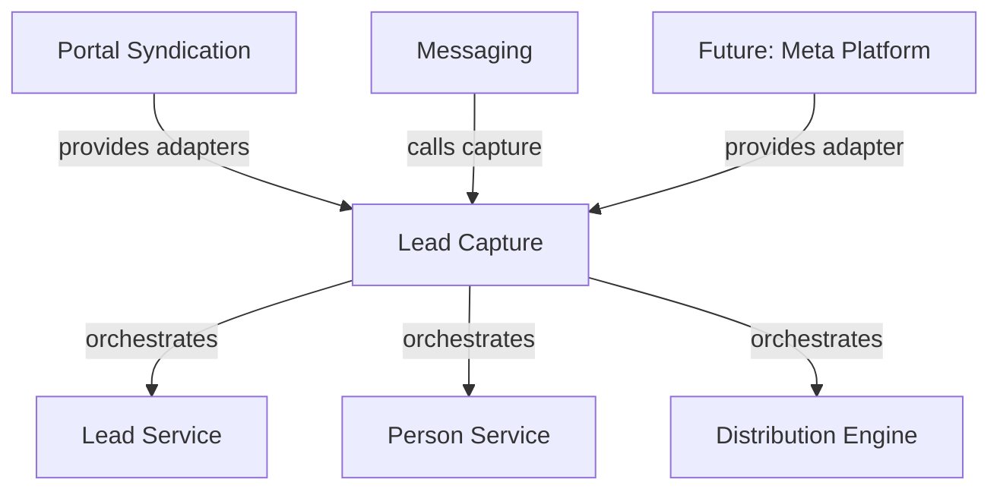

## Overview

The Lead Capture module provides a universal, source-agnostic pipeline that transforms any **captured** lead from Property Finder, Bayut/dubizzle, Meta Ads, website forms, and other sources into a CRM `Lead` with consistent source fields, person reuse, deduplication, and assignment.

<Note>
**Core principle: reuse, don't rebuild.** This layer sits above existing CRM primitives and orchestrates them. It does NOT reimplement lead creation, person matching, dedup, stakeholders, or distribution.
</Note>

**Module location:** `src/modules/crm/lead-capture/`

**Implementation Status:** ✅ **BUILT** - The module ships with `LeadCaptureService`, contract interfaces, source registry, settings, ledger, and async queue infrastructure.

## Architecture

### Module Structure

```
crm/lead-capture/
├── lead-capture.service.ts              # LeadCaptureService.capture()
├── lead-capture-source.interface.ts     # Adapter contract
├── captured-lead-input.ts               # Input/output types
├── lead-capture-settings.entity.ts      # Org-level defaults
├── captured-lead.entity.ts              # Idempotency ledger
├── queue/lead-ingestion.worker.ts       # pg-boss worker
└── enums/
    └── capture-assignment-strategy.enum.ts
```

### Dependency Direction

<Warning>
**Lead-capture depends only on intra-CRM services.** Source modules (portal-syndication, messaging) depend on lead-capture, never the reverse.
</Warning>



## Reused Components

Lead Capture orchestrates existing CRM primitives rather than rebuilding them:

<AccordionGroup>
  <Accordion title="Lead Creation">
    **Component:** `LeadService.createLeadInTransaction()`
    
    **Location:** `crm/lead/lead.service.ts`
    
    Creates composable leads with optional stakeholders and distribution control
  </Accordion>

  <Accordion title="Lead Deduplication">
    **Component:** `LeadService.findDuplicateLeadMatchInTransaction()`
    
    **Location:** `crm/lead/lead.service.ts`
    
    Identifies duplicate leads based on person and reference ID
  </Accordion>

  <Accordion title="Person Resolution">
    **Component:** `PersonService.findOrCreatePersonFullInTransaction()`
    
    **Location:** `crm/person/person.service.ts`
    
    Reuses existing persons by email, phone, or channel identity
  </Accordion>

  <Accordion title="Assignment">
    **Component:** `EntityStakeholderService` + `DistributionEngineService`
    
    **Location:** `crm/entity-stakeholder/`, `crm/distribution/`
    
    Handles direct assignment and rule-based distribution
  </Accordion>

  <Accordion title="System Actor">
    **Component:** `resolveSystemActorId()`
    
    **Location:** `shared/org-member.utils.ts`
    
    Returns the per-org System service user for automated captures
  </Accordion>
</AccordionGroup>

## Canonical Contract

### CapturedLeadInput

The universal input contract that all source adapters must produce:

```typescript
interface CapturedLeadInput {
  // Organization context
  orgId: string;
  
  // Source attribution
  source: LeadSource;                  // Bayut | PropertyFinder | Dubizzle | Website | Instagram
  sourceDetail?: string;               // Campaign / form / "WhatsApp message"
  inboundChannel?: InboundChannel;     // call | whatsapp | email | sms
  referenceId?: string;                // Listing / campaign / form id
  externalLeadId?: string;             // Source's own lead id (idempotency key)
  
  // Person identity (match-priority order)
  identity: {
    firstName?: string;
    lastName?: string;
    email?: string;
    phone?: string;
    channel?: { 
      type: ChannelType; 
      identifier: string 
    };  // WhatsApp / Instagram / Messenger
  };
  
  // Lead context
  intent?: LeadIntent;
  propertyRef?: { 
    listingId?: string; 
    refUnitId?: number 
  };
  assignmentHint?: CaptureAssignmentConfig;
  capturedAt?: Date;
  rawPayload: unknown;                 // Stored verbatim for audit/replay
}
```

### CaptureResult

```typescript
interface CaptureResult {
  leadId: string;
  personId: string;
  outcome: 'created' | 'attached' | 'skipped';
  assignment: 'agent' | 'team_pool' | 'org_pool' | 'queued' | 'none';
}
```

<Info>
**Outcome meanings:**
- `created` - New lead created
- `attached` - Re-inquiry on existing open lead
- `skipped` - Idempotency guard hit or system actor unavailable
</Info>

### LeadCaptureSource (Adapter Interface)

```typescript
interface LeadCaptureSource {
  readonly source: LeadSource;
  toCapturedInput(
    raw: unknown, 
    ctx: { orgId: string }
  ): CapturedLeadInput | CapturedLeadInput[];
}
```

## Capture Pipeline

The `LeadCaptureService.capture(input)` method executes the complete ingestion pipeline:

<Steps>
  <Step title="Tenant Context">
    Runs inside `tenantContext.executeInOrg(input.orgId)` with the **system actor** as `createdBy`
    
    <Note>
    The system actor is now always available - it's the per-org System service user (`isSystemServiceUser = true`), seeded at org provisioning and backfilled for existing orgs. Memberless orgs no longer skip capture.
    </Note>
  </Step>

  <Step title="Idempotency Guard">
    Check the `captured_lead` ledger by `(orgId, source, externalLeadId)`
    
    If found → return prior `CaptureResult` (no-op)
    
    This makes webhook retries and poll overlaps safe
  </Step>

  <Step title="Source Field Normalization">
    Derive `leadSource`, `sourceDetail`, `referenceId`, and any `sourceChannel`/`sourceConversation`
    
    See [Source Field Policy](#source-field-policy) for mapping rules
  </Step>

  <Step title="Identity Resolution">
    Resolve or create the `Person` using:
    - Email matching
    - Phone matching  
    - Channel identity matching (WhatsApp/Instagram/Messenger)
    
    Uses `PersonService.findOrCreatePersonFullInTransaction()`
  </Step>

  <Step title="Deduplication">
    Check if this is a re-inquiry on an open lead:
    - Match by person + reference ID
    - If match found → attach activity
    - If no match → create new lead
  </Step>

  <Step title="Assignment Resolution">
    Resolve assignment directive:
    - Listing agent (via property reference)
    - Team pool (from settings)
    - Org pool (fallback)
    - Distribution rules (queued)
    
    See [Assignment Strategy](#assignment-strategy)
  </Step>

  <Step title="Lead Creation & Ledger">
    - Create lead via `createLeadInTransaction()` OR attach re-inquiry activity
    - Write `captured_lead` ledger row with status, leadId, personId, rawPayload
    - Return `CaptureResult`
  </Step>
</Steps>

<Warning>
Failures inside a job bubble to the worker so pg-boss retries. The ledger guard makes retries idempotent.
</Warning>

## Source Field Policy

The following table defines how source fields are mapped and stored:

| Field | Rule | Notes |
|-------|------|-------|
| `Lead.leadSource` | `input.source` | Source of THIS inquiry (portal/origin) |
| `Lead.sourceDetail` | `input.sourceDetail` | Human-readable: campaign name, "WhatsApp message", entity/agent target |
| `Lead.inboundChannel` | `input.inboundChannel` | **NEW:** Structured delivery channel (`call \| whatsapp \| email \| sms`). First-touch only, indexed. Distinct from `leadSource`. |
| `Lead.referenceId` | `input.referenceId` | Listing/campaign/form ID. Attribution + dedup key. Not unique. |
| `Lead.sourceChannel` | Resolved `PersonChannel` | Set when lead arrived through persistent messaging identity (WhatsApp/IG/Messenger). Person's channel *identity*. |
| `Lead.sourceConversation` | FK to `Conversation` | Set when captured from messaging conversation |
| `Person.originalSource` | First-touch only | Set on FIRST creation only, never overwritten |

### InboundChannel Vocabulary

```typescript
enum InboundChannel {
  EMAIL = 'email',
  WHATSAPP = 'whatsapp',
  CALL = 'call',
  SMS = 'sms'
}
```

<Info>
**Key distinction:**
- `sourceChannel` = Person's channel **identity** (the messaging account)
- `inboundChannel` = **How this inquiry arrived** (the delivery method)

A lead can have `sourceChannel` = WhatsApp number AND `inboundChannel` = call if they called from their WhatsApp-registered number.
</Info>

### Portal Mapping

<Tabs>
  <Tab title="Property Finder">
    `payload.channel` maps 1:1:
    - `email` → `email`
    - `whatsapp` → `whatsapp`
    - `call` → `call`
  </Tab>
  
  <Tab title="Bayut/dubizzle">
    `lead.channel` maps:
    - `email` → `email`
    - `phone` → resolve to `whatsapp` or `call` (adapter logic)
    - `sms` → `sms`
  </Tab>
</Tabs>

### Re-inquiry Channel Tracking

<Check>
Re-inquiries on different channels are recorded per-inquiry on the `captured_lead` ledger (`captured_lead.inboundChannel`), NOT by overwriting the lead's `inboundChannel`. This preserves first-touch attribution while maintaining a complete inquiry history.
</Check>

## Assignment Strategy

### Resolution Order

<Steps>
  <Step title="Listing Agent (Highest Priority)">
    When `propertyRef.listingId` is present:
    
    1. Resolve listing agent via `LISTING_AGENT_RESOLVER` seam
    2. Portal-syndication registers `PortalListingAgentResolver` at bootstrap
    3. Checks listing ownership and publisher role
    4. Falls back to `agentEmailHint` → in-org user lookup
  </Step>

  <Step title="Assignment Hint">
    If adapter provides `assignmentHint`:
    
    ```typescript
    interface CaptureAssignmentConfig {
      strategy: 'direct' | 'team_pool' | 'org_pool' | 'distribution';
      agentId?: string;
      teamId?: string;
    }
    ```
  </Step>

  <Step title="Organization Settings">
    Fall back to `LeadCaptureSettings.defaultAssignmentStrategy`:
    - `LISTING_AGENT` - Resolve from property reference
    - `TEAM_POOL` - Assign to team pool
    - `ORG_POOL` - Assign to org pool
    - `DISTRIBUTION` - Queue for rule-based distribution
  </Step>

  <Step title="Ultimate Fallback">
    `ORG_POOL` if no other strategy applies
  </Step>
</Steps>

### Agent Email Hint

```typescript
// In CapturedLeadInput
agentEmailHint?: string;  // Agent-targeted email from portal
```

<Tip>
The `agentEmailHint` field carries agent-targeted emails from portals. It's resolved to an in-org user via `UserOrgRole` for the `LISTING_PUBLISHER` fallback when the primary listing agent can't be determined.
</Tip>

## Async Transport

### Queue Architecture

```typescript
// Queue name
const LEAD_INGESTION_QUEUE = 'lead-ingestion';

// Job payload
interface LeadIngestionJob {
  input: CapturedLeadInput;
  source: LeadSource;
  attempt?: number;
}
```

### Worker Configuration

The `LeadIngestionWorker` processes queued captures:

<CardGroup cols={2}>
  <Card title="Retry Strategy" icon="rotate">
    - Max retries: 3
    - Exponential backoff
    - Idempotency via ledger
  </Card>
  
  <Card title="Error Handling" icon="triangle-exclamation">
    - Failures bubble to pg-boss
    - Dead letter queue after max retries
    - Preserve raw payload for replay
  </Card>
</CardGroup>

```typescript
@Processor(LEAD_INGESTION_QUEUE)
export class LeadIngestionWorker {
  async process(job: Job<LeadIngestionJob>): Promise<CaptureResult> {
    const { input } = job.data;
    return this.leadCaptureService.capture(input);
  }
}
```

## Source Adapters

### Adapter Registration

Adapters self-register via `LeadCaptureSourceRegistry` in `onModuleInit`:

```typescript
@Injectable()
export class BayutLeadCaptureAdapter implements LeadCaptureSource {
  readonly source = LeadSource.BAYUT;
  
  constructor(private registry: LeadCaptureSourceRegistry) {}
  
  onModuleInit() {
    this.registry.register(this);
  }
  
  toCapturedInput(raw: BayutLead, ctx: { orgId: string }): CapturedLeadInput {
    // Transform Bayut payload to canonical input
  }
}
```

### Built-in Adapters

<Tabs>
  <Tab title="Property Finder">
    **Location:** `portal-syndication/adapters/pf-lead-capture.adapter.ts`
    
    **Source:** `PropertyFinder`
    
    **Payload:** `WHPayloadLead` webhook envelope
    - `payload.channel` → `inboundChannel`
    - `payload.entityType` → context
    - `payload.sender.contacts[]` → identity
    
    Includes flattened legacy fallback for older webhook formats
  </Tab>
  
  <Tab title="Bayut/dubizzle">
    **Location:** `portal-syndication/adapters/bayut-lead-capture.adapter.ts`
    
    **Source:** `Bayut` (splits dubizzle per-lead)
    
    **Features:**
    - Channel resolution (phone → whatsapp/call)
    - Brand detection (Bayut vs dubizzle)
    - Message content extraction
  </Tab>
  
  <Tab title="Future: Meta Ads">
    **Status:** Reserved fields in contract
    
    **Required fields:**
    - `externalLeadId` - Meta's lead ID
    - `assignmentHint` - Campaign-based routing
    
    <Info>
    Contract already reserves necessary fields - no refactor needed when implementing
    </Info>
  </Tab>
</Tabs>

## Captured Lead Ledger

### Purpose

The `captured_lead` entity provides:

1. **Idempotency** - Prevent duplicate processing of retries
2. **Audit trail** - Complete inquiry history with raw payloads
3. **Channel tracking** - Per-inquiry `inboundChannel` for re-inquiries
4. **Attribution** - Link captures to resulting leads

### Schema

```typescript
@Entity('captured_lead')
export class CapturedLead {
  @PrimaryGeneratedColumn('uuid')
  id: string;
  
  @Column()
  orgId: string;
  
  @Column('text')
  source: LeadSource;
  
  @Column({ nullable: true })
  externalLeadId?: string;  // Idempotency key
  
  @Column({ nullable: true })
  leadId?: string;
  
  @Column({ nullable: true })
  personId?: string;
  
  @Column('text')
  status: 'created' | 'attached' | 'skipped';
  
  @Column({ type: 'text', nullable: true })
  inboundChannel?: InboundChannel;  // Per-inquiry channel
  
  @Column('jsonb')
  rawPayload: unknown;
  
  @CreateDateColumn()
  capturedAt: Date;
}
```

<Warning>
The ledger is **RLS-protected** - queries are automatically scoped to the current tenant context
</Warning>

### Read Query - Listing Leads

The ledger powers the portal-syndication listing detail "Leads" tab:

```typescript
async findCapturedLeadsForListing(
  listingId: string, 
  orgId: string
): Promise<ListingCapturedLead[]> {
  // Filters:
  // - referenceId = listingId
  // - source IN (PropertyFinder, Bayut, Dubizzle)
  // - leadId != null (only created/attached)
  // - Newest first
}
```

**Result type:**

```typescript
interface ListingCapturedLead {
  capturedLeadId: string;
  leadId?: string;
  personId?: string;
  source: LeadSource;
  inboundChannel?: InboundChannel;  // Shows how inquiry arrived
  fullName: string;
  email?: string;
  phone?: string;
  outcome: 'created' | 'attached' | 'skipped';
  capturedAt?: Date;
}
```

<Tip>
The listing "Leads" tab shows both `source` (portal brand logo) and `inboundChannel` (delivery method icon) for each inquiry, giving complete visibility into lead origins.
</Tip>

## Organization Settings

### LeadCaptureSettings Entity

Per-org configuration for default capture behavior:

```typescript
@Entity('lead_capture_settings')
export class LeadCaptureSettings {
  @PrimaryGeneratedColumn('uuid')
  id: string;
  
  @Column()
  orgId: string;
  
  @Column('text')
  defaultAssignmentStrategy: CaptureAssignmentStrategy;
  
  @Column({ nullable: true })
  defaultTeamId?: string;
  
  @Column({ default: true })
  autoCapture: boolean;  // Master switch
  
  @UpdateDateColumn()
  updatedAt: Date;
}
```

### Assignment Strategies

```typescript
enum CaptureAssignmentStrategy {
  LISTING_AGENT = 'listing_agent',    // Resolve from property reference
  TEAM_POOL = 'team_pool',            // Assign to specific team
  ORG_POOL = 'org_pool',              // Assign to org pool
  DISTRIBUTION = 'distribution'        // Queue for rule-based distribution
}
```

## Migration History

<AccordionGroup>
  <Accordion title="Migration20260531130000_LeadCaptureFoundation">
    **Creates:**
    - `lead_capture_settings` table
    - `captured_lead` ledger table
    - Indexes on `(orgId, source, externalLeadId)` for idempotency
    - Indexes on `referenceId` for listing queries
    
    **Seeds:**
    - Default settings for existing orgs
  </Accordion>
  
  <Accordion title="Migration20260605200000_AddInboundChannel">
    **Adds:**
    - `Lead.inboundChannel` column (text, nullable, indexed)
    - `captured_lead.inboundChannel` column (text, nullable)
    
    **Purpose:**
    Structured delivery channel tracking for analytics and routing
  </Accordion>
</AccordionGroup>

## Usage Examples

### Direct Capture (Synchronous)

```typescript
// In a webhook handler
const input: CapturedLeadInput = {
  orgId: '...',
  source: LeadSource.PROPERTY_FINDER,
  sourceDetail: 'Property listing inquiry',
  inboundChannel: InboundChannel.WHATSAPP,
  referenceId: listing.id,
  externalLeadId: webhook.leadId,
  identity: {
    firstName: webhook.sender.name,
    email: webhook.sender.email,
    phone: webhook.sender.phone
  },
  intent: LeadIntent.BUY,
  propertyRef: { listingId: listing.id },
  capturedAt: new Date(webhook.timestamp),
  rawPayload: webhook
};

const result = await leadCaptureService.capture(input);
console.log(`Lead ${result.outcome}: ${result.leadId}`);
```

### Async Capture (Queued)

```typescript
// Queue a capture job
await this.queueService.add(LEAD_INGESTION_QUEUE, {
  input: capturedLeadInput,
  source: LeadSource.BAYUT
});
```

### Adapter Implementation

```typescript
@Injectable()
export class CustomLeadCaptureAdapter implements LeadCaptureSource {
  readonly source = LeadSource.WEBSITE;
  
  constructor(private registry: LeadCaptureSourceRegistry) {}
  
  onModuleInit() {
    this.registry.register(this);
  }
  
  toCapturedInput(
    raw: WebsiteFormSubmission, 
    ctx: { orgId: string }
  ): CapturedLeadInput {
    return {
      orgId: ctx.orgId,
      source: this.source,
      sourceDetail: `Contact form: ${raw.formName}`,
      inboundChannel: InboundChannel.EMAIL,
      referenceId: raw.formId,
      externalLeadId: raw.submissionId,
      identity: {
        firstName: raw.firstName,
        lastName: raw.lastName,
        email: raw.email,
        phone: raw.phone
      },
      intent: this.mapIntent(raw.interestedIn),
      capturedAt: raw.submittedAt,
      rawPayload: raw
    };
  }
  
  private mapIntent(interest: string): LeadIntent {
    // Custom mapping logic
  }
}
```

## Related Documentation

<CardGroup cols={2}>
  <Card title="CRM Module" icon="address-book" href="/backend/crm/crm-module-specification">
    Core CRM entities and services
  </Card>
  
  <Card title="Distribution Engine" icon="sitemap" href="/backend/crm/distribution-module-specification">
    Rule-based lead assignment
  </Card>
  
  <Card title="Portal Syndication" icon="globe" href="/backend/real-estate/portal-syndication-specification">
    Property Finder and Bayut integration
  </Card>
  
  <Card title="Stakeholder System" icon="users" href="/backend/crm/stakeholder-system">
    Entity stakeholder management
  </Card>
</CardGroup>

## Best Practices

<AccordionGroup>
  <Accordion title="Idempotency">
    Always provide `externalLeadId` when available. This makes webhook retries and overlapping polls completely safe. The ledger guard prevents duplicate lead creation.
  </Accordion>
  
  <Accordion title="Raw Payload Preservation">
    Always store the complete `rawPayload`. This enables:
    - Audit trails for compliance
    - Replay for debugging
    - Future field extraction without re-ingestion
  </Accordion>
  
  <Accordion title="Channel vs Source">
    Keep `inboundChannel` (delivery method) distinct from `leadSource` (origin platform):
    - A Property Finder lead can arrive via email, WhatsApp, or call
    - Track both for complete attribution and routing
  </Accordion>
  
  <Accordion title="Assignment Hints">
    When adapters have context about intended assignment (campaign targeting, agent emails), use `assignmentHint` to preserve that intent while still respecting org settings.
  </Accordion>
  
  <Accordion title="Error Handling">
    Let errors bubble to the worker for retry. The idempotency guard makes retries safe. Only catch errors that truly require different handling (e.g., permanent validation failures).
  </Accordion>
</AccordionGroup>

## Monitoring & Observability

<Tabs>
  <Tab title="Key Metrics">
    - **Capture rate:** `captured_lead` rows per hour by source
    - **Outcome distribution:** created vs attached vs skipped ratio
    - **Assignment distribution:** agent vs pool vs queued ratio
    - **Processing latency:** webhook → lead creation time
    - **Retry rate:** pg-boss retry attempts per source
  </Tab>
  
  <Tab title="Alerts">
    - Capture failures > 5% in 5 minutes
    - Queue depth > 100 items for > 10 minutes  
    - Missing system actor (should never happen post-backfill)
    - Idempotency key collisions (indicates duplicate external IDs)
  </Tab>
  
  <Tab title="Debugging">
    Query the ledger for troubleshooting:
    
    ```sql
    -- Recent captures by source
    SELECT source, status, COUNT(*) 
    FROM captured_lead 
    WHERE org_id = '...' 
      AND captured_at > NOW() - INTERVAL '1 hour'
    GROUP BY source, status;
    
    -- Failed captures with payload
    SELECT id, source, raw_payload 
    FROM captured_lead 
    WHERE org_id = '...' 
      AND status = 'skipped' 
      AND lead_id IS NULL;
    ```
  </Tab>
</Tabs>