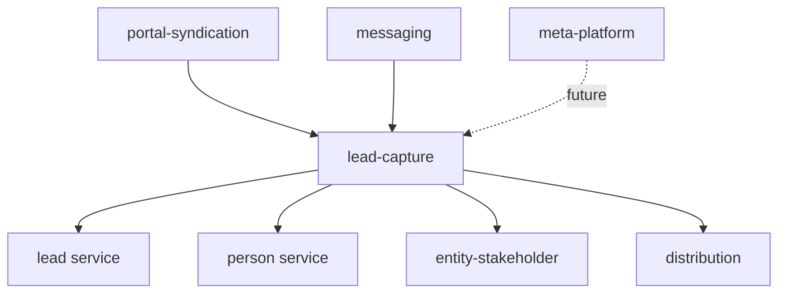

## Overview

The Lead Capture System provides a universal, source-agnostic pipeline that transforms any captured lead—from Property Finder, Bayut/dubizzle, Meta Ads, website forms, or messaging channels—into a CRM `Lead` with consistent source fields, person reuse, deduplication, and assignment.

<Info>
**Core Principle**: Reuse, don't rebuild. This layer sits above existing CRM primitives and orchestrates them rather than reimplementing lead creation, person matching, deduplication, stakeholders, or distribution logic.
</Info>

### Module Location

```
src/modules/crm/lead-capture/
├── lead-capture.service.ts              # LeadCaptureService.capture()
├── lead-capture-source.interface.ts     # Adapter contract
├── captured-lead-input.ts               # Input/Result types
├── lead-capture-settings.entity.ts      # Org-level defaults
├── captured-lead.entity.ts              # Idempotency ledger
├── queue/
│   └── lead-ingestion.worker.ts        # pg-boss worker
└── enums/
    └── capture-assignment-strategy.enum.ts
```

### Implementation Status

<Check>
**Built and deployed**. The module ships with `LeadCaptureService`, source adapter registry, settings, ledger, and the `lead-ingestion` pg-boss queue with worker. Portal adapters (`BayutLeadCaptureAdapter`, `PfLeadCaptureAdapter`) are live in the portal-syndication module.
</Check>

---

## Scope & Dependencies

### In Scope

- Canonical captured-lead contract
- Source-adapter pattern
- Orchestration of source-field mapping + identity resolution + deduplication + assignment
- Async transport (queue + worker)

### Out of Scope

<Warning>
Meta Ads and website-form ingestion are **not** designed in this specification. The contract reserves fields (`externalLeadId`, `assignmentHint`) for future integration without refactoring.
</Warning>

### Dependency Architecture

The lead-capture module depends only on intra-CRM services. Source modules depend on lead-capture, never the reverse:



---

## Reused Components

The Lead Capture System orchestrates existing CRM primitives rather than rebuilding them:

<AccordionGroup>
<Accordion title="Lead Creation">
`LeadService.createLeadInTransaction(em, data, createdById, orgId, options)`

Location: `crm/lead/lead.service.ts`

Options: `{ stakeholders?, skipDistribution?, systemInitiated? }`
</Accordion>

<Accordion title="Lead Deduplication">
`LeadService.findDuplicateLeadMatchInTransaction`

Location: `crm/lead/lead.service.ts`
</Accordion>

<Accordion title="Person Reuse">
- `PersonService.findOrCreatePersonFullInTransaction`
- `PersonService.findByEmailInTransaction`
- `PersonService.findByPhoneInTransaction`

Location: `crm/person/person.service.ts`
</Accordion>

<Accordion title="Channel Identity">
`PersonChannel` (channelType + channelIdentifier) + messaging matchers

Location: `crm/person/channel/`, `messaging/services/contact-matcher.service.ts`
</Accordion>

<Accordion title="Assignment">
- `EntityStakeholderService` (direct assignment)
- `DistributionEngineService` (rules/pool) via `LeadCreatedEvent` → `DistributionListener`

Location: `crm/entity-stakeholder/`, `crm/distribution/`
</Accordion>

<Accordion title="System Actor">
`resolveSystemActorId` - Returns the per-org System service user

Location: `shared/org-member.utils.ts`
</Accordion>
</AccordionGroup>

---

## Canonical Contract

### CapturedLeadInput

The universal input contract that all source adapters must produce:

```typescript
interface CapturedLeadInput {
  orgId: string;
  source: LeadSource;                  // Bayut | PropertyFinder | Dubizzle | Website | Instagram
  sourceDetail?: string;               // Campaign / form / "WhatsApp message"
  inboundChannel?: InboundChannel;     // call | whatsapp | email | sms
  referenceId?: string;                // Listing / campaign / form id
  externalLeadId?: string;             // Source's own lead id (idempotency key)

  identity: {                          // Person reuse (priority order)
    firstName?: string;
    lastName?: string;
    email?: string;
    phone?: string;
    channel?: { 
      type: ChannelType; 
      identifier: string 
    };
  };

  intent?: LeadIntent;
  propertyRef?: { 
    listingId?: string; 
    refUnitId?: number 
  };
  assignmentHint?: CaptureAssignmentConfig;
  capturedAt?: Date;
  rawPayload: unknown;                 // Stored for audit/replay
}
```

### CaptureResult

The outcome of the capture pipeline:

```typescript
interface CaptureResult {
  leadId: string;
  personId: string;
  outcome: 'created' | 'attached' | 'skipped';
  assignment: 'agent' | 'team_pool' | 'org_pool' | 'queued' | 'none';
}
```

<Note>
`outcome: 'attached'` indicates a re-inquiry on an existing open lead rather than creating a duplicate.
</Note>

### LeadCaptureSource Interface

Source adapters implement this interface to convert raw payloads:

```typescript
interface LeadCaptureSource {
  readonly source: LeadSource;
  toCapturedInput(
    raw: unknown, 
    ctx: { orgId: string }
  ): CapturedLeadInput | CapturedLeadInput[];
}
```

---

## Capture Pipeline

The `LeadCaptureService.capture(input)` method orchestrates the complete ingestion flow.

<Steps>

<Step title="Tenant & Actor Context">
Executes within `tenantContext.executeInOrg(input.orgId)` using the system actor as `createdBy`.

<Info>
The system actor is the per-org System service user (`isSystemServiceUser = true`), seeded at org provisioning and backfilled for existing orgs. Memberless orgs no longer skip capture—their leads are attributed to the System user.
</Info>
</Step>

<Step title="Idempotency Guard">
Queries the `captured_lead` ledger by `(orgId, source, externalLeadId)`.

If a record exists, returns the prior `CaptureResult` without processing. This makes webhook retries and poll overlaps safe.
</Step>

<Step title="Source Field Normalization">
Derives standardized fields:
- `leadSource` from `input.source`
- `sourceDetail` from `input.sourceDetail`
- `referenceId` from `input.referenceId`
- `sourceChannel` and `sourceConversation` (if applicable)
</Step>

<Step title="Identity Resolution">
Resolves or creates the `Person` entity using the identity matching cascade (see [Identity Resolution](#identity-resolution--person-reuse)).
</Step>

<Step title="Deduplication">
Decides whether to create a new lead or attach to an existing open lead (see [Deduplication Strategy](#deduplication-strategy)).
</Step>

<Step title="Assignment">
Resolves and executes the assignment directive (see [Assignment Resolution](#assignment-resolution)).
</Step>

<Step title="Lead Creation & Ledger">
Either creates a new lead via `createLeadInTransaction` or attaches a re-inquiry activity.

Writes the `captured_lead` ledger row with:
- `status`
- `leadId`
- `personId`
- `rawPayload`
- `inboundChannel`

Returns the final `CaptureResult`.
</Step>

</Steps>

<Warning>
Pipeline failures inside a queue job bubble to the worker, triggering pg-boss retries. The idempotency ledger guard ensures retries are safe.
</Warning>

---

## Source Field Policy

The system enforces consistent source field semantics across all lead sources:

<AccordionGroup>

<Accordion title="Lead.leadSource">
Set to `input.source` — the source/origin of THIS inquiry (the portal or platform).

**Examples**: `PropertyFinder`, `Bayut`, `Dubizzle`, `Website`, `Instagram`
</Accordion>

<Accordion title="Lead.sourceDetail">
Set to `input.sourceDetail` — human-readable context.

**Examples**: Campaign name, "WhatsApp message", entity/agent/agency target

<Note>Not the structured channel—use `inboundChannel` for that.</Note>
</Accordion>

<Accordion title="Lead.inboundChannel">
Set to `input.inboundChannel` — the **structured delivery channel** of the inquiry.

**Values**: `call | whatsapp | email | sms`

**Distinct from `leadSource`**: This is HOW the inquiry arrived, not WHERE it came from.

**First-touch only**: Set on initial lead creation, never overwritten. Re-inquiries on different channels are recorded on the `captured_lead` ledger only.

**Indexed and queryable** for channel routing, analytics, and filtering (e.g., "all WhatsApp leads").
</Accordion>

<Accordion title="Lead.referenceId">
Set to `input.referenceId` — listing/campaign/form ID for attribution.

Part of the deduplication key. Not guaranteed unique.
</Accordion>

<Accordion title="Lead.sourceChannel">
The resolved `PersonChannel` when the lead arrived through a persistent messaging identity (WhatsApp/Instagram/Messenger).

**Distinct from `inboundChannel`**:
- `sourceChannel` = Person's channel *identity*
- `inboundChannel` = *How this inquiry arrived*
</Accordion>

<Accordion title="Lead.sourceConversation">
Set when captured from a messaging conversation. Links to the originating `Conversation` entity.
</Accordion>

<Accordion title="Person.originalSource">
Set on FIRST person creation only (first-touch attribution).

**Never overwritten** on subsequent inquiries from other sources.
</Accordion>

</AccordionGroup>

---

## InboundChannel Vocabulary

<CodeGroup>

```typescript InboundChannel Enum
// src/modules/shared/inbound-channel.enum.ts
export enum InboundChannel {
  EMAIL = 'email',
  WHATSAPP = 'whatsapp',
  CALL = 'call',
  SMS = 'sms'
}
```

```sql Database Storage
-- Stored as plain text (no CHECK constraint)
-- Mirrors Lead.intent pattern
ALTER TABLE leads ADD COLUMN inbound_channel text;
CREATE INDEX idx_leads_inbound_channel ON leads(inbound_channel) 
  WHERE inbound_channel IS NOT NULL;
```

</CodeGroup>

### Portal Mapping

<Tabs>
<Tab title="Property Finder">
**Webhook field**: `payload.channel`

**Values**: `email | whatsapp | call`

**Mapping**: 1:1 direct mapping

```typescript
// Property Finder adapter
inboundChannel: payload.channel as InboundChannel
```
</Tab>

<Tab title="Bayut/dubizzle">
**Webhook field**: `lead_source` or `contact_method`

**Values**: Variable per portal

**Mapping**: Adapter normalizes to standard vocabulary

```typescript
// Bayut adapter logic
const channelMap = {
  'email': InboundChannel.EMAIL,
  'phone': InboundChannel.CALL,
  'whatsapp': InboundChannel.WHATSAPP
};
inboundChannel: channelMap[raw.contact_method] || InboundChannel.EMAIL
```
</Tab>
</Tabs>

<Info>
The `inboundChannel` on the lead is immutable after first capture. Subsequent inquiries via different channels are recorded only in the `captured_lead` ledger's per-inquiry `inboundChannel` field.
</Info>

---

## Identity Resolution & Person Reuse

The system uses a priority-ordered matching cascade to find or create the `Person`:

<Steps>

<Step title="Channel Identity Match">
If `identity.channel` is provided (WhatsApp/Instagram/Messenger):

```typescript
PersonChannel.findOne({ 
  channelType: identity.channel.type,
  channelIdentifier: identity.channel.identifier 
})
```

**Highest priority** — persistent messaging identities are most reliable.
</Step>

<Step title="Email Match">
If `identity.email` is provided:

```typescript
PersonService.findByEmailInTransaction(email, orgId, em)
```

Exact match, case-insensitive.
</Step>

<Step title="Phone Match">
If `identity.phone` is provided:

```typescript
PersonService.findByPhoneInTransaction(phone, orgId, em)
```

Normalized phone number match.
</Step>

<Step title="Create New Person">
If no match found:

```typescript
PersonService.findOrCreatePersonFullInTransaction(em, {
  firstName: identity.firstName,
  lastName: identity.lastName,
  email: identity.email,
  phone: identity.phone,
  originalSource: input.source  // First-touch attribution
}, orgId, systemActorId)
```

Sets `Person.originalSource` to track first-touch attribution.
</Step>

</Steps>

<Note>
The matching cascade stops at the first successful match. A person with an email match won't proceed to phone matching even if a phone is also provided.
</Note>

---

## Deduplication Strategy

After resolving the person, the system determines whether to create a new lead or attach to an existing one:

### Deduplication Logic

```typescript
LeadService.findDuplicateLeadMatchInTransaction(em, {
  personId,
  orgId,
  referenceId: input.referenceId,
  openOnly: true  // Only match leads not in Won/Lost/Archived status
})
```

### Match Criteria

<CardGroup cols={2}>

<Card title="Create New Lead" icon="plus">
**No matching open lead found**

Creates a fresh lead with full assignment processing
</Card>

<Card title="Attach to Existing" icon="link">
**Open lead found for same person + reference**

Adds a re-inquiry activity instead of creating duplicate

Result: `outcome: 'attached'`
</Card>

</CardGroup>

<Warning>
Re-inquiries on the SAME lead via different channels (e.g., first email, then WhatsApp) will attach to the existing lead. The original `Lead.inboundChannel` remains unchanged; the new channel is recorded only on the `captured_lead.inboundChannel` ledger field.
</Warning>

### Status-Based Filtering

Deduplication only considers leads in active statuses:

- ✅ Open, Working, Qualified, Nurture
- ❌ Won, Lost, Archived

<Tip>
A person who previously had a Won lead for listing A can generate a NEW lead if they inquire about listing A again. This supports repeat customer scenarios.
</Tip>

---

## Assignment Resolution

The system resolves lead assignment through a multi-level fallback chain:

<Steps>

<Step title="Adapter Hint">
If `input.assignmentHint` is provided by the source adapter:

```typescript
interface CaptureAssignmentConfig {
  strategy: 'DIRECT_AGENT' | 'LISTING_AGENT' | 'TEAM_POOL' | 'ORG_POOL';
  userId?: string;      // For DIRECT_AGENT
  teamId?: string;      // For TEAM_POOL
}
```

**Use case**: Portal-specific targeting (e.g., Bayut agent-targeted leads)
</Step>

<Step title="Listing Agent Resolution">
If `input.propertyRef.listingId` is provided:

The system resolves the listing agent via the registered `LISTING_AGENT_RESOLVER`:

```typescript
// Registered at bootstrap by portal-syndication module
LeadCaptureService.registerListingAgentResolver(
  PortalListingAgentResolver
)
```

**Resolution priority**:
1. `LISTING_PUBLISHER` stakeholder
2. `agentEmailHint` from `input` (matched to in-org `UserOrgRole`)
3. Listing owner

**Result**: `CaptureAssignmentConfig` with `strategy: 'DIRECT_AGENT'` and resolved `userId`
</Step>

<Step title="Organization Default">
Falls back to `LeadCaptureSettings` for the organization:

```typescript
@Entity('lead_capture_settings')
class LeadCaptureSettings {
  @Column()
  orgId: string;
  
  @Column()
  defaultAssignmentStrategy: CaptureAssignmentStrategy;
  
  @Column({ nullable: true })
  defaultTeamId?: string;
}
```

**Common strategies**: `TEAM_POOL` or `ORG_POOL`
</Step>

<Step title="Assignment Execution">
Executes the resolved strategy:

<Tabs>
<Tab title="DIRECT_AGENT">
```typescript
EntityStakeholderService.addStakeholder({
  entityType: 'Lead',
  entityId: lead.id,
  userId: resolvedUserId,
  role: 'OWNER'
})
```

Assigns directly, skips distribution
</Tab>

<Tab title="TEAM_POOL / ORG_POOL">
```typescript
LeadService.createLeadInTransaction(em, data, systemActorId, orgId, {
  skipDistribution: false  // Triggers distribution engine
})
```

Lets `DistributionEngineService` handle via rules/round-robin
</Tab>
</Tabs>

</Step>

</Steps>

<Info>
The resolution chain short-circuits at the first successful match. For example, a valid adapter hint bypasses listing agent resolution and org defaults entirely.
</Info>

---

## Source Adapter Pattern

Source adapters transform raw payloads into the canonical `CapturedLeadInput` contract.

### Adapter Implementation

<CodeGroup>

```typescript Adapter Interface
interface LeadCaptureSource {
  readonly source: LeadSource;
  
  toCapturedInput(
    raw: unknown, 
    ctx: { orgId: string }
  ): CapturedLeadInput | CapturedLeadInput[];
}
```

```typescript Example: Property Finder Adapter
@Injectable()
export class PfLeadCaptureAdapter implements LeadCaptureSource {
  readonly source = LeadSource.PropertyFinder;

  constructor(
    private readonly listingService: ListingService
  ) {}

  async toCapturedInput(
    raw: unknown, 
    ctx: { orgId: string }
  ): Promise<CapturedLeadInput> {
    const payload = raw as WHPayloadLead;
    
    // Resolve listing from portal reference
    const listing = await this.listingService
      .findByPortalReference(
        payload.listing.id, 
        'propertyfinder',
        ctx.orgId
      );

    return {
      orgId: ctx.orgId,
      source: LeadSource.PropertyFinder,
      sourceDetail: payload.entityType, // 'agent' | 'agency'
      inboundChannel: payload.channel as InboundChannel,
      referenceId: listing?.id,
      externalLeadId: `pf-${payload.id}`,
      
      identity: {
        firstName: payload.sender.name?.split(' ')[0],
        lastName: payload.sender.name?.split(' ').slice(1).join(' '),
        email: payload.sender.contacts
          .find(c => c.type === 'email')?.value,
        phone: payload.sender.contacts
          .find(c => c.type === 'phone')?.value,
      },
      
      intent: 'buy', // or derive from payload
      propertyRef: { listingId: listing?.id },
      capturedAt: new Date(payload.created_at),
      rawPayload: payload
    };
  }
}
```

```typescript Example: Bayut Adapter
@Injectable()
export class BayutLeadCaptureAdapter implements LeadCaptureSource {
  readonly source = LeadSource.Bayut;

  async toCapturedInput(
    raw: unknown,
    ctx: { orgId: string }
  ): Promise<CapturedLeadInput> {
    const lead = raw as BayutLead;
    
    // Determine actual source (Bayut vs dubizzle)
    const actualSource = lead.source_site === 'dubizzle' 
      ? LeadSource.Dubizzle 
      : LeadSource.Bayut;

    return {
      orgId: ctx.orgId,
      source: actualSource,
      sourceDetail: lead.lead_source || 'portal',
      inboundChannel: this.mapContactMethod(lead.contact_method),
      referenceId: await this.resolveListingId(lead, ctx.orgId),
      externalLeadId: `bayut-${lead.id}`,
      
      identity: {
        firstName: lead.name?.split(' ')[0],
        lastName: lead.name?.split(' ').slice(1).join(' '),
        email: lead.email,
        phone: lead.phone,
      },
      
      propertyRef: { 
        listingId: await this.resolveListingId(lead, ctx.orgId)
      },
      capturedAt: new Date(lead.created_at),
      rawPayload: lead
    };
  }

  private mapContactMethod(method: string): InboundChannel {
    const map = {
      'email': InboundChannel.EMAIL,
      'phone': InboundChannel.CALL,
      'whatsapp': InboundChannel.WHATSAPP
    };
    return map[method] || InboundChannel.EMAIL;
  }
}
```

</CodeGroup>

### Adapter Registration

Adapters self-register in their module's `onModuleInit`:

```typescript
@Module({
  providers: [PfLeadCaptureAdapter]
})
export class PortalSyndicationModule implements OnModuleInit {
  constructor(
    private readonly pfAdapter: PfLeadCaptureAdapter,
    private readonly bayutAdapter: BayutLeadCaptureAdapter,
    private readonly registry: LeadCaptureSourceRegistry
  ) {}

  onModuleInit() {
    this.registry.register(this.pfAdapter);
    this.registry.register(this.bayutAdapter);
  }
}
```

<Check>
The registry pattern maintains clean dependency boundaries—lead-capture never imports source modules.
</Check>

---

## Async Transport

Lead ingestion is processed asynchronously via pg-boss queue to handle webhook spikes and enable retries.

### Queue Architecture

```typescript
// Queue name
const LEAD_INGESTION_QUEUE = 'lead-ingestion';

// Job payload
interface LeadIngestionJob {
  orgId: string;
  source: LeadSource;
  rawPayload: unknown;
  receivedAt: Date;
}
```

### Worker Implementation

<CodeGroup>

```typescript Worker Handler
@Injectable()
export class LeadIngestionWorker {
  constructor(
    private readonly captureService: LeadCaptureService,
    private readonly registry: LeadCaptureSourceRegistry
  ) {}

  @OnWorkerEvent('lead-ingestion')
  async handleLeadIngestion(job: Job<LeadIngestionJob>) {
    const { orgId, source, rawPayload } = job.data;
    
    // Get registered adapter for source
    const adapter = this.registry.get(source);
    if (!adapter) {
      throw new Error(`No adapter registered for source: ${source}`);
    }

    // Transform to canonical input
    const input = await adapter.toCapturedInput(rawPayload, { orgId });

    // Process through capture pipeline
    const result = await this.captureService.capture(input);

    return result;
  }
}
```

```typescript Enqueue from Webhook
@Controller('webhooks/propertyfinder')
export class PropertyFinderWebhookController {
  constructor(
    private readonly queueService: QueueService
  ) {}

  @Post('leads')
  async handleLeadWebhook(@Body() payload: WHPayloadLead) {
    const orgId = await this.resolveOrgFromWebhook(payload);

    await this.queueService.send('lead-ingestion', {
      orgId,
      source: LeadSource.PropertyFinder,
      rawPayload: payload,
      receivedAt: new Date()
    });

    return { status: 'queued' };
  }
}
```

</CodeGroup>

### Retry & Error Handling

<Tabs>
<Tab title="Configuration">
```typescript
// pg-boss queue config
{
  retryLimit: 3,
  retryDelay: 60,        // 60 seconds
  retryBackoff: true,
  expireInHours: 24
}
```
</Tab>

<Tab title="Error Scenarios">
| Error | Behavior |
|-------|----------|
| Adapter not found | Fails immediately, dead-letter after retries |
| Transient DB error | Retries with exponential backoff |
| Invalid payload | Logs error, marks job failed (no retry) |
| Duplicate `externalLeadId` | Returns cached result (idempotent) |
</Tab>
</Tabs>

<Warning>
Jobs that exhaust all retries move to the `lead-ingestion_dead_letter` queue for manual investigation. Monitor this queue for systemic issues.
</Warning>

---

## Idempotency Ledger

The `captured_lead` table serves as both an idempotency guard and audit trail.

### Schema

```sql
CREATE TABLE captured_lead (
  id uuid PRIMARY KEY DEFAULT gen_random_uuid(),
  org_id uuid NOT NULL REFERENCES organizations(id),
  
  -- Idempotency key
  source text NOT NULL,
  external_lead_id text,
  
  -- Result
  status text NOT NULL,  -- 'created' | 'attached' | 'skipped'
  lead_id uuid REFERENCES leads(id),
  person_id uuid REFERENCES persons(id),
  
  -- Source fields
  reference_id text,     -- Listing/campaign/form id
  inbound_channel text,  -- Per-inquiry channel (call/whatsapp/email/sms)
  
  -- Audit
  raw_payload jsonb NOT NULL,
  captured_at timestamptz,
  created_at timestamptz DEFAULT now(),
  
  -- RLS
  CONSTRAINT captured_lead_org_id_fk FOREIGN KEY (org_id) 
    REFERENCES organizations(id)
);

-- Unique constraint for idempotency
CREATE UNIQUE INDEX idx_captured_lead_dedup 
  ON captured_lead(org_id, source, external_lead_id) 
  WHERE external_lead_id IS NOT NULL;

-- Listing attribution queries
CREATE INDEX idx_captured_lead_reference 
  ON captured_lead(org_id, reference_id, source) 
  WHERE lead_id IS NOT NULL;
```

### Usage

<CodeGroup>

```typescript Idempotency Check
async findPriorCapture(
  orgId: string,
  source: LeadSource,
  externalLeadId: string
): Promise<CapturedLead | null> {
  return this.capturedLeadRepo.findOne({
    where: { orgId, source, externalLeadId }
  });
}
```

```typescript Ledger Write
async recordCapture(
  input: CapturedLeadInput,
  result: CaptureResult
): Promise<void> {
  await this.capturedLeadRepo.save({
    orgId: input.orgId,
    source: input.source,
    externalLeadId: input.externalLeadId,
    status: result.outcome,
    leadId: result.leadId,
    personId: result.personId,
    referenceId: input.referenceId,
    inboundChannel: input.inboundChannel,
    rawPayload: input.rawPayload,
    capturedAt: input.capturedAt || new Date()
  });
}
```

</CodeGroup>

<Info>
The ledger's `inboundChannel` field records the channel of EACH inquiry (mutable), while `Lead.inboundChannel` preserves the FIRST-TOUCH channel only (immutable). This enables per-inquiry channel tracking for analytics while maintaining stable first-touch attribution.
</Info>

---

## Listing Leads Query

A read-only projection powers the portal-syndication listing detail "Leads" tab.

### Method Signature

```typescript
findCapturedLeadsForListing(
  listingId: string, 
  orgId: string
): Promise<ListingCapturedLead[]>
```

### Implementation

<Steps>

<Step title="Query Ledger">
```typescript
const captured = await this.capturedLeadRepo.find({
  where: {
    orgId,
    referenceId: listingId,
    source: In([
      LeadSource.PropertyFinder,
      LeadSource.Bayut,
      LeadSource.Dubizzle
    ]),
    leadId: Not(IsNull())  // Only created/attached
  },
  order: { capturedAt: 'DESC' }
});
```
</Step>

<Step title="Load Persons">
```typescript
const personIds = captured.map(c => c.personId);
const persons = await this.personService.findByIds(personIds, orgId);
const personMap = new Map(persons.map(p => [p.id, p]));
```
</Step>

<Step title="Map to DTO">
```typescript
return captured.map(c => ({
  capturedLeadId: c.id,
  leadId: c.leadId,
  personId: c.personId,
  source: c.source,
  inboundChannel: c.inboundChannel,  // How inquiry arrived
  fullName: personMap.get(c.personId)?.fullName,
  email: personMap.get(c.personId)?.email,
  phone: personMap.get(c.personId)?.phone,
  outcome: c.status,
  capturedAt: c.capturedAt
}));
```
</Step>

</Steps>

### Response Format

```typescript
interface ListingCapturedLead {
  capturedLeadId: string;
  leadId?: string;
  personId?: string;
  source: LeadSource;           // Portal brand (logo)
  inboundChannel?: InboundChannel;  // Delivery method (icon)
  fullName?: string;
  email?: string;
  phone?: string;
  outcome: 'created' | 'attached' | 'skipped';
  capturedAt?: Date;
}
```

<Tip>
The `inboundChannel` field allows the UI to display how each inquiry was received (e.g., WhatsApp icon for WhatsApp leads) alongside the portal brand logo from `source`.
</Tip>

---

## Migration History

<AccordionGroup>

<Accordion title="Migration20260531130000_LeadCaptureFoundation">
**Creates**:
- `lead_capture_settings` table (org defaults)
- `captured_lead` ledger table
- Indexes for idempotency and RLS
- `lead-ingestion` pg-boss queue registration

**RLS Policies**:
- Both tables enforce org-scoped access
- System actor bypass for worker context
</Accordion>

<Accordion title="Migration20260605200000_AddInboundChannel">
**Adds**:
- `leads.inbound_channel` column (text, nullable)
- `captured_lead.inbound_channel` column (text, nullable)
- Index: `idx_leads_inbound_channel` (partial, where not null)

**Backfill**:
- Existing portal leads: Derives from `sourceDetail` where parseable
- Messaging leads: Uses channel type from `sourceChannel`
- Others: Remains null (unknown)
</Accordion>

</AccordionGroup>

---

## Related Documentation

<CardGroup cols={2}>

<Card title="CRM Module" icon="users" href="/backend/crm/crm-module-specification">
Core lead, person, and entity models
</Card>

<Card title="Distribution Engine" icon="share-nodes" href="/backend/crm/distribution-module-specification">
Lead assignment rules and pooling
</Card>

<Card title="Stakeholder System" icon="user-tag" href="/backend/crm/stakeholder-system">
Entity ownership and role management
</Card>

<Card title="Portal Syndication" icon="globe" href="/backend/real-estate/portal-syndication-specification">
Outbound listing publishing and portal adapters
</Card>

<Card title="Bayut/dubizzle API" icon="building" href="/backend/real-estate/bayut-dubizzle-pull-api">
Bayut/dubizzle webhook payloads and polling
</Card>

<Card title="Field Mapping Matrix" icon="table" href="/backend/real-estate/portal-field-mapping-matrix">
Cross-portal field harmonization
</Card>

</CardGroup>

---

## API Reference

### LeadCaptureService

<Tabs>
<Tab title="capture()">
```typescript
async capture(input: CapturedLeadInput): Promise<CaptureResult>
```

**Main entry point** — orchestrates the complete ingestion pipeline.

**Returns**: `CaptureResult` with outcome and assignment details

**Throws**: 
- `BadRequestException` — Invalid input
- `InternalServerErrorException` — Pipeline failure (triggers retry)
</Tab>

<Tab title="registerListingAgentResolver()">
```typescript
registerListingAgentResolver(
  resolver: ListingAgentResolver
): void
```

**Seam for portal-syndication** — registers the listing→agent resolution logic without creating a circular dependency.

Called once at bootstrap by portal-syndication module.
</Tab>

<Tab title="findCapturedLeadsForListing()">
```typescript
async findCapturedLeadsForListing(
  listingId: string,
  orgId: string
): Promise<ListingCapturedLead[]>
```

**Read projection** — returns all captured leads for a listing, ordered by most recent.

Used by portal-syndication listing detail "Leads" tab.
</Tab>
</Tabs>

### LeadCaptureSourceRegistry

<Tabs>
<Tab title="register()">
```typescript
register(adapter: LeadCaptureSource): void
```

Registers a source adapter. Called by source modules in `onModuleInit`.

**Throws**: Error if source already registered (prevents conflicts)
</Tab>

<Tab title="get()">
```typescript
get(source: LeadSource): LeadCaptureSource | undefined
```

Retrieves the registered adapter for a source.

**Returns**: `undefined` if no adapter registered
</Tab>
</Tabs>

---

## Testing Strategies

<AccordionGroup>

<Accordion title="Unit Tests">
**LeadCaptureService**:
- Mock all CRM services (lead, person, stakeholder, distribution)
- Test each pipeline stage in isolation
- Verify idempotency guard short-circuits
- Assert source field mapping correctness

**Adapters**:
- Test payload transformation for all portal scenarios
- Verify `inboundChannel` mapping logic
- Assert correct handling of missing/malformed fields
</Accordion>

<Accordion title="Integration Tests">
**End-to-end capture**:
- Seed test org with settings
- Submit via queue, assert worker processing
- Verify lead + person creation in DB
- Check ledger write and idempotency

**Deduplication**:
- Create lead, submit re-inquiry, assert `outcome: 'attached'`
- Verify activity creation, no duplicate lead

**Assignment**:
- Test each strategy (agent, team pool, org pool)
- Verify stakeholder vs distribution execution
</Accordion>

<Accordion title="Webhook Integration Tests">
**Portal webhooks**:
- Use real webhook payloads (sanitized)
- Mock external API calls (listing resolution)
- Assert queue job enqueued
- Verify worker processes and captures correctly

**Error scenarios**:
- Invalid payload → job fails, no retry
- Transient error → retries with backoff
- Duplicate webhook → idempotent (same result)
</Accordion>

</AccordionGroup>

<Tip>
Use the `captured_lead` ledger for debugging—it preserves the raw payload and capture metadata for every ingestion attempt.
</Tip>