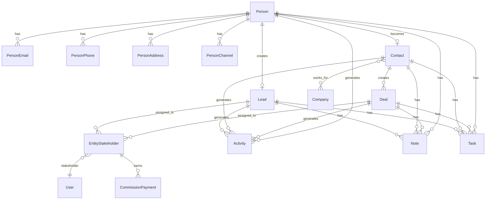

## Architecture overview

### Design principles

1. **Person + Contact Model**:
   - `Person` is the hidden identity layer (single source of truth for personal details)
   - `Contact` is the business relationship layer (qualified customers)
   - `Lead` is the sales opportunity layer (unqualified inquiries)
   - `Deal` links to `Contact`, not `Person` directly

2. **Unified Stakeholder Model**: Single table for assignment and commission across leads/deals

3. **Polymorphic Patterns**: Notes, tags, and activities use entity_type/entity_id patterns

4. **Channel Separation**: Activity table indexes timeline; channel tables store full data

5. **Modular Design**: CRM core is independent; Real Estate, Marketing, Channels are optional modules

6. **Company via Contact**: Companies associate with `Contact` via `ContactCompanyRole` (not Person)

### Module boundaries

```
┌─────────────────────────────────────────────────────────────────┐
│                         CRM CORE                                │
│  Person, Lead, Contact, Company, Deal, DealContact             │
│  person_email, person_phone, person_address, person_channel    │
│  person_not_duplicate, contact_company_role                    │
│  entity_stakeholder, entity_transfer, commission_payment       │
│  activity, note, task, tag                                     │
└─────────────────────────────────────────────────────────────────┘
        │                    │                    │
        ▼                    ▼                    ▼
┌──────────────┐    ┌──────────────┐    ┌──────────────┐
│ REAL ESTATE  │    │  MARKETING   │    │   CHANNELS   │
│ development  │    │  campaign    │    │  whatsapp    │
│ unit         │    │  campaign_   │    │  instagram   │
│ site_visit   │    │  lead        │    │  (linked via │
│ lead_property│    │              │    │  person_     │
│ _interest    │    │              │    │  channel)    │
│ unit_owner-  │    │              │    │              │
│ ship→Person  │    │              │    │              │
└──────────────┘    └──────────────┘    └──────────────┘
```

### Real Estate → CRM integration

Real Estate entities link to **Person** (not Contact) for identity:

| Real Estate Entity       | Links To    | Rationale                                   |
| ------------------------ | ----------- | ------------------------------------------- |
| `unit_ownership`         | `person_id` | Ownership is about identity, not CRM status |
| `unit_transaction`       | `person_id` | Transaction party is an individual          |
| `site_visit`             | `person_id` | Who visited the property                    |
| `lead_property_interest` | `lead_id`   | Links to Lead for sales context             |
| `deal_property_interest` | `deal_id`   | Links to Deal for transaction context       |

**Deal Property Interest Workflow**:

```
// Deal created FROM Lead:
// Copy primary LeadPropertyInterest → DealPropertyInterest (1:1)
deal.propertyInterest.originatingInterest = leadPropertyInterest

// Deal created directly (walk-in):
// Create DealPropertyInterest with no originating interest
deal.propertyInterest.originatingInterest = null
```

**Access Pattern for Contact**:

```
// Contact page showing ownership
contact.person.unitOwnerships  // All ownerships
contact.person.unitOwnerships.filter(o => o.isActive)  // Current
```

---

## Person entity specification

**Purpose**: Single source of truth for human identity and preferences.

```
Person
├── Identity: first_name, last_name, avatar_url, title
├── Demographics: date_of_birth
├── Social: website, linkedin_url, twitter_url
├── Preferences: preferred_contact_method, timezone
├── Languages: languages (unified array with code and proficiency per entry)
├── Communication Flags: do_not_call, do_not_email
├── Source Tracking: original_source
├── Merge Tracking: merged_into_id, merged_at, merged_by
├── Computed: full_name (getter: first_name + last_name)
└── Related Tables:
    ├── person_email (multiple emails, one primary)
    ├── person_phone (multiple phones, one primary)
    ├── person_address (multiple addresses, one primary)
    ├── person_channel (WhatsApp, Instagram, etc. identities)
    └── person_not_duplicate (deduplication override pairs)
```

<Note>
  **Key Rules**: Every Lead, Contact must link to a Person. Person preferences apply across all contexts (leads, deals, contacts). The `original_source` is set once when person first enters system. Languages array uses unified `UserLanguageEntry` format with code and proficiency per entry.
</Note>

### Related contact information tables

These related tables follow similar patterns for storing multiple contact details per person:

<Tabs>
<Tab title="PersonEmail">
```
person_email
├── person_id → Person
├── email
├── is_primary (boolean)
├── is_verified
├── verification_token
├── bounce_status
├── created_at, updated_at
└── organization_id
```

Each person can have multiple email addresses for different purposes (personal, work, etc.). The system maintains one primary email per person for default communication. Email verification ensures deliverability and bounce tracking maintains list health. The primary email is used for automated communications unless overridden.
</Tab>
<Tab title="PersonPhone">
```
person_phone
├── person_id → Person
├── phone_number
├── phone_type (mobile, home, work, fax)
├── is_primary (boolean)
├── is_verified
├── country_code
├── created_at, updated_at
└── organization_id
```

Phone numbers are stored with full international formatting and country codes for global compatibility. Different phone types allow contacts to provide multiple numbers for various purposes. The primary phone is used for SMS campaigns and voice calls. Verification processes ensure number accuracy and prevent fraud.
</Tab>
<Tab title="PersonAddress">
```
person_address
├── person_id → Person
├── address_line_1, address_line_2
├── city, state, postal_code, country
├── address_type (home, work, billing, shipping)
├── is_primary (boolean)
├── coordinates (latitude, longitude)
├── created_at, updated_at
└── organization_id
```

Each person can have multiple addresses for different purposes. The system maintains one primary address per person for default communication and billing purposes. Coordinates are stored for location-based queries and mapping functionality. Address validation and geocoding services ensure data accuracy.
</Tab>
<Tab title="PersonChannel">
```
person_channel
├── person_id → Person
├── channel_type (whatsapp, instagram, facebook, telegram, sms, webchat)
├── channel_identifier (phone number, username, PSID, etc.)
├── display_name, avatar_url
├── channel_identity_id → WhatsAppUser.id, InstagramUser.id, etc.
├── status (active, inactive, blocked, unsubscribed)
├── is_primary
├── Opt-in: marketing_opt_in, transactional_opt_in
├── Engagement: first_contact_at, last_message_at, message_count
└── Verification: is_verified, verified_at
```

Stores a person's communication channel identities (WhatsApp, Instagram, etc.). Channel belongs to Person, not Lead (Person-centric architecture). Lead can reference `source_channel_id` for attribution (which channel it came through). The `channel_identity_id` links to detailed channel entities (WhatsAppUser, InstagramUser). One Person can have multiple channels of same type (e.g., multiple WhatsApp numbers).
</Tab>
</Tabs>

### PersonNotDuplicate (Deduplication overrides)

**Purpose**: Records pairs of persons that have been manually confirmed as NOT duplicates. Prevents the deduplication system from repeatedly flagging the same pair.

```
person_not_duplicate
├── person1_id → Person
├── person2_id → Person
├── marked_by → User (who made the decision)
├── marked_at (when the decision was made)
├── organization_id → Organization
├── Unique constraint: (person1, person2, organization)
```

<Note>
  **Key Rules**: The relationship is symmetric — if (A, B) is marked as not-duplicate, the system treats (B, A) equivalently. Each organization maintains its own override decisions. Used by `PersonNotDuplicateService` to exclude pairs from duplicate detection.
</Note>

### Person merge system

**Purpose**: Consolidates duplicate persons into a single primary record, reassigning all related data.

**API endpoint**: `POST /persons/:primaryPersonId/merge`

<Steps>
<Step title="Validation">
Verify primary person exists and is not deleted. Verify all secondary persons exist and are not deleted. All persons must be in the same organization.
</Step>
<Step title="Field selection">
Accept `fieldSelections: Record<string, string>` (e.g., `{ "firstName": "primary", "lastName": "person-B-id" }`). For each field, pick the value from the specified source person. Fields not listed default to primary person's values.
</Step>
<Step title="Contact info merge (opt-in per type)">
- `mergeAllEmails: boolean` — reassign all secondary emails to primary (isPrimary reset to false)
- `mergeAllPhones: boolean` — reassign all secondary phones to primary (isPrimary reset to false)
- `mergeAllAddresses: boolean` — reassign all secondary addresses to primary (isPrimary reset to false)
</Step>
<Step title="Channel merge (always)">
All `person_channel` from secondary persons are reassigned to primary person (isPrimary reset to false). This is not optional since channels represent unique identities.
</Step>
<Step title="Lead and ownership reassignment">
All leads pointing to secondary persons are bulk-reassigned to primary person via nativeUpdate. All InventoryUnitOwnership records are similarly reassigned.
</Step>
<Step title="Mark secondaries">
Each secondary person is marked with `mergedIntoId`, `mergedAt`, `mergedBy`, and soft-deleted (`isDeleted = true`).
</Step>
</Steps>

<Warning>
  Merge is **irreversible** — secondary persons are soft-deleted. Contact entities are NOT directly reassigned; since Contact has a OneToOne to Person, the primary person retains its contact if one exists.
</Warning>

## Person creation and deduplication

When a lead is created, the system resolves or creates a Person:

```typescript
async function findOrCreatePerson(data: CreateLeadDto) {
  // 1. Check by email
  const existingByEmail = await personEmailRepo.findOne({
    email: data.email,
    organization: data.organizationId,
  });
  if (existingByEmail) return existingByEmail.person;

  // 2. Check by phone
  const existingByPhone = await personPhoneRepo.findOne({
    phone_number: data.phone,
    organization: data.organizationId,
  });
  if (existingByPhone) return existingByPhone.person;

  // 3. Create new person + contact info
  const person = await personRepo.create({ ... });
  await personEmailRepo.create({ person, email: data.email, is_primary: true });
  await personPhoneRepo.create({ person, phone_number: data.phone, is_primary: true });

  return person;
}
```

<Info>
  If `personId` is provided directly in the lead creation request, the system uses that existing person instead of searching.
</Info>

### Person deduplication rules

<AccordionGroup>
<Accordion title="Matching hierarchy">
1. Exact email match takes precedence
2. Phone number match (normalized format)
3. Name + organization combination
4. Manual overrides via PersonNotDuplicate table
</Accordion>
</AccordionGroup>

## Assignment and commission system

The CRM module uses a unified stakeholder model for assignment and commission tracking across leads and deals.

### Entity stakeholder

**Purpose**: Unified assignment and commission table for leads/deals.

```
entity_stakeholder
├── entity_type (lead, deal)
├── entity_id (lead.id or deal.id)
├── stakeholder_type (agent, team_lead, split_agent, broker)
├── stakeholder_id → User
├── role_percentage (0-100, commission split)
├── assigned_at, assigned_by
├── transferred_from_id → EntityStakeholder (for tracking transfers)
└── is_active (boolean)
```

<Note>
  Stakeholders can have overlapping assignments (e.g., agent + team lead on same entity). Role percentages are for commission calculation and should sum to 100% per entity.
</Note>

### Commission payment

**Purpose**: Tracks commission payments to stakeholders.

```
commission_payment
├── stakeholder_id → EntityStakeholder
├── amount, currency
├── payment_date, due_date
├── status (pending, paid, cancelled)
├── reference_number
├── notes
└── paid_by → User
```

## Transfer system

The transfer system manages reassignment of leads and deals between users while maintaining full audit trails.

### Entity transfer

**Purpose**: Records all entity transfers with reasons and approval workflows.

```
entity_transfer
├── entity_type (lead, deal)
├── entity_id
├── from_user_id → User
├── to_user_id → User
├── transfer_reason (workload, specialization, coverage, etc.)
├── requested_by → User
├── approved_by → User (nullable)
├── status (pending, approved, rejected, completed)
├── requested_at, approved_at, completed_at
└── notes
```

<Steps>
<Step title="Transfer request">
User or manager initiates transfer request with reason and target assignee.
</Step>
<Step title="Approval workflow">
Depending on organization rules, transfers may require manager approval.
</Step>
<Step title="Stakeholder reassignment">
Upon approval, system creates new EntityStakeholder record and deactivates old one.
</Step>
<Step title="Transfer completion">
EntityStakeholder.transferred_from_id links to previous stakeholder for audit trail.
</Step>
</Steps>

## Activity and communication system

### Activity

**Purpose**: Central timeline for all interactions across entities. Acts as an index pointing to detailed records in channel-specific tables.

```
activity
├── entity_type (lead, deal, contact, person)
├── entity_id
├── activity_type (call, email, meeting, note, sms, whatsapp, etc.)
├── activity_date
├── subject, description
├── created_by → User
├── external_activity_id (points to WhatsAppMessage.id, Email.id, etc.)
└── metadata (JSON for activity-specific data)
```

<Info>
  The activity table serves as a unified timeline index. Detailed activity data lives in specialized tables (WhatsAppMessage, EmailMessage, PhoneCall, etc.) and is referenced via external_activity_id.
</Info>

### Activity patterns

<Tabs>
<Tab title="Manual activities">
Created directly by users (notes, tasks, manual calls). These have full content in the activity record itself.
</Tab>
<Tab title="Channel activities">
Auto-created from channel integrations (WhatsApp, email, SMS). Reference external records via external_activity_id.
</Tab>
<Tab title="System activities">
Auto-generated by system events (stage changes, assignments). Include relevant metadata in JSON format.
</Tab>
</Tabs>

## Notes system

### Note

**Purpose**: Polymorphic notes that can attach to any entity (person, lead, contact, deal).

```
note
├── entity_type (person, lead, contact, deal)
├── entity_id
├── content (rich text/markdown)
├── note_type (general, followup, important, private)
├── is_private (boolean)
├── created_by → User
├── created_at, updated_at
├── tagged_users[] → User (for mentions/notifications)
└── organization_id
```

<Note>
  Private notes are only visible to the creator and organization admins. Tagged users receive notifications when mentioned in notes.
</Note>

### Task

**Purpose**: Action items and follow-ups linked to entities.

```
task
├── entity_type (person, lead, contact, deal)
├── entity_id
├── title, description
├── assigned_to → User
├── created_by → User
├── due_date
├── priority (low, medium, high, urgent)
├── status (open, in_progress, completed, cancelled)
├── completed_at, completed_by
└── organization_id
```

## Stage history and analytics

### Lead stage history

**Purpose**: Tracks lead progression through sales stages for analytics and conversion measurement.

```
lead_stage_history
├── lead_id → Lead
├── stage (new, contacted, qualified, proposal, negotiation, closed_won, closed_lost)
├── entered_at
├── exited_at (nullable)
├── duration_minutes (calculated)
├── changed_by → User
└── notes
```

### Deal stage history

**Purpose**: Similar tracking for deal progression through sales pipeline.

```
deal_stage_history
├── deal_id → Deal
├── stage (discovery, proposal, negotiation, contract, closed_won, closed_lost)
├── entered_at
├── exited_at (nullable)
├── duration_minutes (calculated)
├── changed_by → User
└── notes
```

<Info>
  Stage history enables funnel analytics, conversion rate calculations, and sales velocity measurements. Duration tracking helps identify bottlenecks in the sales process.
</Info>

## Query patterns

### Performance optimization queries

<AccordionGroup>
<Accordion title="Lead assignment queries">
```sql
-- Get all leads assigned to a user
SELECT l.* FROM lead l
JOIN entity_stakeholder es ON (es.entity_type = 'lead' AND es.entity_id = l.id)
WHERE es.stakeholder_id = :userId AND es.is_active = true;

-- Get leads requiring follow-up
SELECT l.* FROM lead l
LEFT JOIN activity a ON (a.entity_type = 'lead' AND a.entity_id = l.id)
WHERE l.next_follow_up_date <= NOW()
ORDER BY l.next_follow_up_date ASC;
```
</Accordion>

<Accordion title="Person deduplication queries">
```sql
-- Find potential duplicate persons by email
SELECT p1.id, p2.id FROM person p1
JOIN person_email pe1 ON pe1.person_id = p1.id
JOIN person_email pe2 ON pe2.person_id = p2.id
WHERE pe1.email = pe2.email AND p1.id < p2.id
AND NOT EXISTS (
  SELECT 1 FROM person_not_duplicate pnd
  WHERE (pnd.person1_id = p1.id AND pnd.person2_id = p2.id)
     OR (pnd.person1_id = p2.id AND pnd.person2_id = p1.id)
);
```
</Accordion>

<Accordion title="Activity timeline queries">
```sql
-- Get unified activity timeline for an entity
SELECT 
  activity_type, activity_date, subject, description,
  u.first_name || ' ' || u.last_name as created_by_name
FROM activity a
JOIN user u ON u.id = a.created_by
WHERE a.entity_type = :entityType AND a.entity_id = :entityId
ORDER BY a.activity_date DESC;
```
</Accordion>
</AccordionGroup>

## Business rules

### Data integrity rules

<AccordionGroup>
<Accordion title="Person contact info rules">
- Each person must have at least one email or phone number
- Only one primary email/phone/address per person per organization
- Email format validation with domain checking
- Phone number normalization to E.164 format
</Accordion>

<Accordion title="Assignment rules">
- Every lead/deal must have at least one active stakeholder
- Commission percentages must sum to 100% per entity
- Transfers require active stakeholder status on source assignment
- Self-assignment transfers do not require approval
</Accordion>

<Accordion title="Stage progression rules">
- Stage changes must follow defined progression (no backwards movement without reason)
- Closed stages (won/lost) are terminal and require manager override to reopen
- Stage duration tracking starts when entity enters stage
- System automatically creates stage history entries on changes
</Accordion>
</AccordionGroup>

### Validation rules

<AccordionGroup>
<Accordion title="Email validation">
```typescript
// Email format validation with domain checking
const emailRegex = /^[^\s@]+@[^\s@]+\.[^\s@]+$/;
const isValidEmail = emailRegex.test(email) && !isDisposableEmail(email);

// Bounce status checking before sending
if (personEmail.bounce_status === 'hard_bounce') {
  throw new Error('Cannot send to hard bounced email');
}
```
</Accordion>

<Accordion title="Phone validation">
```typescript
// International phone number validation
import { parsePhoneNumber } from 'libphonenumber-js';

function validatePhone(phone: string, countryCode?: string) {
  const phoneNumber = parsePhoneNumber(phone, countryCode);
  return phoneNumber?.isValid() ?? false;
}
```
</Accordion>
</AccordionGroup>

## Entity relationship diagram



## Events and integration

### Domain events

The CRM module publishes domain events for external systems and internal automation:

```typescript
// Person events
PersonCreated {
  personId: string;
  organizationId: string;
  source: string;
  createdAt: Date;
}

PersonMerged {
  primaryPersonId: string;
  mergedPersonIds: string[];
  mergedBy: string;
  mergedAt: Date;
}

// Lead events
LeadCreated {
  leadId: string;
  personId: string;
  source: string;
  assignedTo: string[];
}

LeadStageChanged {
  leadId: string;
  fromStage: string;
  toStage: string;
  changedBy: string;
}

// Deal events
DealCreated {
  dealId: string;
  contactId: string;
  value: number;
  currency: string;
}

DealClosed {
  dealId: string;
  outcome: 'won' | 'lost';
  value: number;
  closedBy: string;
}
```

### External integrations

<CardGroup cols={2}>
  <Card title="Marketing automation" icon="envelope">
    Sync person data and communication preferences to marketing platforms for automated campaigns.
  </Card>
  <Card title="Communication channels" icon="comments">
    Bi-directional sync with WhatsApp, Instagram, Email, and SMS platforms for unified messaging.
  </Card>
  <Card title="Analytics and reporting" icon="chart-line">
    Stream events to analytics platforms for sales performance, conversion tracking, and forecasting.
  </Card>
  <Card title="Real estate systems" icon="home">
    Integration with property management, inventory, and transaction systems via Person entity.
  </Card>
</CardGroup>

## Data consistency guarantees

### Transaction boundaries

<AccordionGroup>
<Accordion title="Person merge transactions">
The entire merge operation (field updates, contact info reassignment, entity reassignment, soft deletion) occurs within a single database transaction to ensure consistency.
</Accordion>

<Accordion title="Lead creation transactions">
Person resolution/creation and lead creation with initial stakeholder assignment happen atomically to prevent orphaned records.
</Accordion>

<Accordion title="Stage change transactions">
Stage updates, stage history creation, and related activity logging occur within the same transaction boundary.
</Accordion>
</AccordionGroup>

### Eventual consistency patterns

<Info>
  External integrations (marketing automation, communication channels) use eventual consistency via event publishing. Core CRM operations maintain strong consistency within transaction boundaries.
</Info>

## Related CRM entities

The Person entity serves as the foundation for other CRM entities:

<CardGroup cols={2}>
  <Card title="Lead" icon="bullseye" href="/backend/crm/lead">
    Sales opportunities linked to persons in the system.
  </Card>
  <Card title="Contact" icon="address-book" href="/backend/crm/contact">
    Business relationships created when leads convert.
  </Card>
  <Card title="Deal" icon="handshake" href="/backend/crm/deal">
    Transaction records linked to qualified contacts.
  </Card>
  <Card title="Company" icon="building" href="/backend/crm/company">
    Business entities associated with contacts.
  </Card>
</CardGroup>