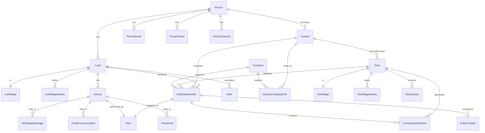

This document contains the complete specification for the CRM module, including entity relationships, implementation logic, query patterns, and business rules.

<Note>
**Vocabulary note (2026-05-23):** This doc uses "stakeholder" because it describes the engineering subsystem (entity name, table, services). The **user-facing and AI-facing** terms are "Assignment" (the concept) and "Assignee" (the assigned user or team). See `Docs/STAKEHOLDER_SYSTEM.md` → "Vocabulary" for the full policy and which surfaces switched (modal copy, notification copy, audit timeline labels, AI tool descriptions, AI tool boundary JSON keys).
</Note>

<Info>
**Unified inbound lead capture:** Leads arriving from external sources (Property Finder, Bayut/dubizzle, and future Meta/website) are ingested through the source-agnostic `crm/lead-capture` module — `LeadCaptureService.capture()` reuses `PersonService`, `LeadService.createLeadInTransaction`/`findDuplicateLeadMatchInTransaction`, `EntityStakeholderService`, and the `DistributionEngine`. The lead-capture module owns the `CapturedLeadInput` contract, `LeadCaptureSourceRegistry` for adapter registration, org-default `LeadCaptureSettings`, the `CapturedLead` idempotency ledger, and the source-agnostic `lead-ingestion` pg-boss queue + `LeadIngestionWorker`. Full design: `Docs/LEAD_CAPTURE_SPECIFICATION.md`.
</Info>

## Architecture overview

### Design principles

1. **Person + Contact Model**:
   - `Person` is the hidden identity layer (single source of truth for personal details)
   - `Contact` is the business relationship layer (qualified customers)
   - `Lead` is the sales opportunity layer (unqualified inquiries)
   - `Deal` links to `Contact`, not `Person` directly
2. **Unified Stakeholder Model**: Single table for assignment and commission across leads/deals
3. **Polymorphic Patterns**: Notes, tags, and activities use entity_type/entity_id patterns
4. **Channel Separation**: Activity table indexes timeline; channel tables store full data
5. **Modular Design**: CRM core is independent; Real Estate, Marketing, Channels are optional modules
6. **Company via Contact**: Companies associate with `Contact` via `ContactCompanyRole` (not Person)
7. **Organization Membership Display**: CRM DTOs batch-resolve organization membership status for user references, showing removed org members with `isActiveOrgMember: false` badges while preserving historical assignment data

### Module boundaries

```
┌─────────────────────────────────────────────────────────────────┐
│                         CRM CORE                                │
│  Person, Lead, Contact, Company, Deal, DealContact             │
│  person_email, person_phone, person_address, person_channel    │
│  person_not_duplicate, contact_company_role                    │
│  entity_stakeholder, entity_transfer, commission_payment       │
│  activity, note, task, event, tag                              │
└─────────────────────────────────────────────────────────────────┘
        │                    │                    │
        ▼                    ▼                    ▼
┌──────────────┐    ┌──────────────┐    ┌──────────────┐
│ REAL ESTATE  │    │ LEAD CAPTURE │    │   CHANNELS   │
│ development  │    │ captured_lead│    │  whatsapp    │
│ unit         │    │ ingestion    │    │  instagram   │
│ site_visit   │    │ settings     │    │  (linked via │
│ lead_property│    │              │    │  person_     │
│ _interest    │    │              │    │  channel)    │
│ unit_owner-  │    │              │    │              │
│ ship→Person  │    │              │    │              │
└──────────────┘    └──────────────┘    └──────────────┘
```

### AI module integration

The CRM module integrates with the fully implemented and operational AI module (`AiModule`) for comprehensive automated conversations, lead processing, and workflow-assisted follow-up. CRM owns the business entities and lifecycle rules; the AI module owns agent configuration, runtime execution, queueing, LLM integration, security controls, and activity logging.

The AI module provides:

- **AI Agent Templates**: 10 pre-configured agent types (Receptionist, Sales Qualification, Listing Inquiry, Off-Plan Inquiry, Appointment Booking, After-Hours, FAQ & Support, Campaign Lead Capture, Spam Handler, Human Handoff) seeded via AiAgentTemplateSeeder
- **Knowledge Base Integration**: FAQ, SNIPPET, DOCUMENT, PAGE types with chunking, embedding, and RAG capabilities through KnowledgeBaseService
- **Credit Management**: AI-credit affordability/gating via the subscription module's unified-wallet `CreditMeteringService` (shared org pool with per-user ceilings)
- **Queue-based Execution**: Reliable agent processing via AiAgentExecuteWorker with retry logic and error handling
- **Tool Registry**: Extensible system through AiAgentToolRegistryService and AiAgentActionService
- **OpenAI Integration**: Project provisioning and encrypted key management through OpenAiProjectProvisioner and OpenAiEncryptionService
- **Activity Logging**: Comprehensive audit trail via AiActivityLogService with filtering and analytics
- **Workflow Integration**: Bidirectional integration - AI agents can trigger workflows through the `trigger_workflow` action AND workflows can activate AI agents via AI_AGENT steps
- **Media Processing**: Audio/image processing via AiAgentMediaProcessorService
- **Optimization**: Instruction optimization via AiAgentOptimizeService with protected token preservation
- **Security**: SSRF protection via assertNotSsrf utility and AES-GCM encryption utilities
- **Conversation automation**: AI agents can respond to messaging conversations, use CRM context, and hand off to users or teams when configured actions require human follow-up

## Core entities

<Tabs>
<Tab title="Person + Lead + Contact">
The three-layer person model separates identity, qualification, and business relationships:

```typescript
Person (Identity Layer)
├── id (UUID, PK)
├── firstName, lastName, email, phone
├── dateOfBirth, nationality, gender
├── preferredLanguage
└── contactChannels (person_email, person_phone, person_channel)

Lead (Sales Opportunity Layer) 
├── id (UUID, PK)
├── personId → Person (FK)
├── title, description, value
├── source, medium, campaign
├── stage → lead_stage (FK)
├── convertedAt, disqualifiedAt
└── assignments → entity_stakeholder

Contact (Business Relationship Layer)
├── id (UUID, PK) 
├── personId → Person (FK)
├── customerSince, customerType
├── totalLifetimeValue
├── isArchived, archivedAt
└── deals → Deal (via dealContacts)
```
</Tab>
<Tab title="Deal + Company">
```typescript
Deal (Revenue Opportunity)
├── id (UUID, PK)
├── title, description, value
├── probability, expectedCloseDate
├── stage → deal_stage (FK)
├── isClosed, isWon, closedAt
├── commissionRate, totalCommission
└── contacts → Contact (via deal_contact)

Company (Business Entity)
├── id (UUID, PK)
├── name, industry, size
├── website, description
├── isArchived, archivedAt
└── contacts → Contact (via contact_company_role)

DealContact (Many-to-Many)
├── dealId → Deal (FK)
├── contactId → Contact (FK)
├── role (primary, decision_maker, influencer)
└── isPrimary (boolean)
```
</Tab>
<Tab title="Stakeholder system">
```typescript
EntityStakeholder (Unified Assignment)
├── id (UUID, PK)
├── entityType (lead, deal, contact, company)
├── entityId (UUID, polymorphic FK)
├── userId → User (FK)
├── role (assigned, owner, observer)
├── commissionSplitPercent (for deals)
├── assignedAt, assignedBy
└── isActive (boolean)

CommissionPayment (Financial Tracking)
├── id (UUID, PK)
├── dealId → Deal (FK)
├── stakeholderId → entity_stakeholder (FK)
├── amount, currency
├── status (pending, approved, paid, cancelled)
├── dueDate, paidAt
└── paymentMethod, transactionId
```
</Tab>
</Tabs>

## Assignment & commission system

### Unified stakeholder model

The `entity_stakeholder` table handles assignments and commissions across all CRM entities:

<Steps>
<Step title="Entity assignment">
Users can be assigned to leads, deals, contacts, or companies with different roles (assigned, owner, observer).
</Step>
<Step title="Commission tracking">
For deals, stakeholders have `commissionSplitPercent` values that determine their share of the total deal commission.
</Step>
<Step title="Activity correlation">
Activities automatically link to entity stakeholders for timeline and performance tracking.
</Step>
</Steps>

### Commission calculation

<Tabs>
<Tab title="Deal closure commission">
When a deal moves to "Closed Won" stage:

```typescript
// Commission calculation on deal closure
totalCommission = dealValue × (commissionRate / 100)

// Individual payments created for each stakeholder
stakeholders.forEach(stakeholder => {
  payment = {
    dealId: deal.id,
    stakeholderId: stakeholder.id,
    amount: totalCommission × (stakeholder.commissionSplitPercent / 100),
    status: 'PENDING',
    dueDate: deal.closedAt + 30 days
  }
})
```
</Tab>
<Tab title="Commission split validation">
```typescript
// Business rules for commission splits
- Sum of all commissionSplitPercent must equal 100%
- Only active stakeholders receive commission payments
- Stakeholder roles must include at least one 'assigned' or 'owner'
- Commission splits can be modified before deal closure
```
</Tab>
</Tabs>

## Transfer system

<Tabs>
<Tab title="Entity transfer tracking">
```typescript
EntityTransfer (Assignment History)
├── id (UUID, PK)
├── entityType (lead, deal, contact, company)
├── entityId (UUID, polymorphic FK)
├── fromUserId → User (FK, nullable for new assignments)
├── toUserId → User (FK)
├── transferReason (reassignment, load_balancing, specialty)
├── notes (transfer context)
├── transferredAt, transferredBy
└── organizationId → Organization (FK)
```
</Tab>
<Tab title="Transfer business rules">
<Steps>
<Step title="Active stakeholder requirement">
Target user must be an active organization member with CRM access permissions.
</Step>
<Step title="Commission preservation">
For deals with existing commission splits, transfers preserve the original stakeholder's commission percentage unless explicitly modified.
</Step>
<Step title="Activity continuity">
All historical activities remain linked to original users; new activities link to the new assignee.
</Step>
<Step title="Notification cascade">
Transfers trigger notifications to both the previous and new assignee, plus any observers on the entity.
</Step>
</Steps>
</Tab>
</Tabs>

## Activity & communication system

<Tabs>
<Tab title="Activity index table">
```typescript
Activity (Timeline Index)
├── id (UUID, PK)
├── entityType (lead, deal, contact, company)
├── entityId (UUID, polymorphic FK)  
├── activityType (call, email, meeting, note, task)
├── channelType (whatsapp, instagram, phone, email)
├── channelId (UUID, FK to specific channel table)
├── userId → User (FK, who performed the activity)
├── title, summary
├── occurredAt (when the activity happened)
├── duration (for calls/meetings)
├── isInbound, isOutbound
└── organizationId → Organization (FK)
```
</Tab>
<Tab title="Channel-specific tables">
<Steps>
<Step title="WhatsApp messages">
`whatsapp_message` stores full conversation data, media attachments, and delivery status.
</Step>
<Step title="Instagram interactions">
`instagram_interaction` tracks DMs, story mentions, post comments, and lead generation forms.
</Step>
<Step title="Email communications">
`email_communication` stores email content, attachments, threading, and delivery tracking.
</Step>
<Step title="Phone calls">
`phone_call` records call duration, recording links, transcription, and call outcome.
</Step>
</Steps>

<Note>
The activity table provides fast timeline queries while channel tables store complete interaction data with media and metadata.
</Note>
</Tab>
</Tabs>

## Notes system

<Tabs>
<Tab title="Polymorphic notes">
```typescript
Note (Entity Annotations)
├── id (UUID, PK)
├── entityType (lead, deal, contact, company, person)
├── entityId (UUID, polymorphic FK)
├── content (rich text)
├── noteType (general, follow_up, internal, customer_facing)
├── isPrivate (boolean)
├── isPinned (boolean)
├── createdBy → User (FK)
├── createdAt, updatedAt
├── editedBy → User (FK, for edit tracking)
├── editedAt (timestamp of last edit)
└── organizationId → Organization (FK)
```
</Tab>
<Tab title="Note access control">
<Steps>
<Step title="Private notes">
`isPrivate = true` notes are only visible to the creator and organization admins.
</Step>
<Step title="Entity permissions">
Users can only read/write notes on entities they have access to (assigned stakeholder or organization admin).
</Step>
<Step title="Edit tracking">
All note edits are tracked with `editedBy` and `editedAt` fields for audit purposes.
</Step>
<Step title="Pinned notes">
`isPinned = true` notes appear at the top of entity timelines for important information.
</Step>
</Steps>
</Tab>
</Tabs>

## Stage history & analytics

The CRM stage system tracks leads and deals through configurable pipelines, maintaining comprehensive history for analytics and business insights. Both leads and deals use a two-tier architecture with global system stages and organization-specific customizations.

### Two-tier stage architecture

Both lead and deal stages use a global-plus-override architecture:

1. **Global stages** (`organization = NULL`) — System-defined stages shared across all organizations, seeded on startup
2. **Organization-specific stages** (`organization = org_id`) — Custom stages created by the org, or overrides of global stages

**Lookup priority:** Organization-specific → Global. When resolving a stage by `systemType`, the service checks org-specific first, then falls back to global.

### Public ID system

All stages receive stable public identifiers using the shared CRM public ID allocator:

- Lead stages: `LSTG-{ORG_PREFIX}-{SEQUENCE}` (e.g., `LSTG-ADNS-001`)
- Deal stages: `DSTG-{ORG_PREFIX}-{SEQUENCE}` (e.g., `DSTG-ADNS-001`)
- Global system stages use deterministic IDs: `LSTG-NEW`, `LSTG-DISQUALIFIED`, `DSTG-CLOSED-WON`, etc.

<Note>
System stages have predictable public IDs based on their `systemType`, while custom stages use the organization-scoped sequence format.
</Note>

### Lead stage system

Lead stages use a `systemType` enum to define programmatic behavior. There are 5 system stages:

| systemType     | Default name | Public ID           | Behavior                                                 |
| -------------- | ------------ | ------------------- | -------------------------------------------------------- |
| `new`          | New          | `LSTG-NEW`          | Default stage when lead is created                       |
| `contacted`    | Contacted    | `LSTG-CONTACTED`    | Auto-transition when first activity is logged           |
| `qualified`    | Qualified    | `LSTG-QUALIFIED`    | Lead has been qualified                                  |
| `converted`    | Converted    | `LSTG-CONVERTED`    | Triggers conversion (sets `lead.convertedAt`)           |
| `disqualified` | Disqualified | `LSTG-DISQUALIFIED` | Triggers disqualification (sets `lead.disqualifiedAt`)  |

### Deal stage system

Deal stages also use a `systemType` enum. There are 5 system stages:

| systemType    | Default name | Public ID           | Behavior                                                      |
| ------------- | ------------ | ------------------- | ------------------------------------------------------------- |
| `new`         | New          | `DSTG-NEW`          | Default stage when deal is created                            |
| `proposal`    | Proposal     | `DSTG-PROPOSAL`     | Proposal sent                                                 |
| `negotiation` | Negotiation  | `DSTG-NEGOTIATION`  | In active negotiation                                         |
| `closed_won`  | Closed Won   | `DSTG-CLOSED-WON`   | Triggers deal closure (`deal.isWon = true`, `deal.closedAt`) |
| `closed_lost` | Closed Lost  | `DSTG-CLOSED-LOST`  | Triggers deal closure (`deal.isWon = false`, `deal.closedAt`) |

### History tracking approach

History records track **completed stages only**. The current stage lives on the entity itself.

- `Lead.stage` / `Deal.stage` — current stage
- `Lead.stageEnteredAt` / `Deal.stageEnteredAt` — when the entity entered the current stage
- `lead_stage_history` / `deal_stage_history` — records of stages the entity has **left**

<Warning>
No history record is created when entering a stage. History is created only when **leaving** a stage. The current stage is never in history until you leave it.
</Warning>

### History table structures

<Tabs>
<Tab title="lead_stage_history">
```sql
lead_stage_history (completed stages only)
├── id (Primary Key)
├── lead_id → Lead (Foreign Key, Indexed)
├── stage_id → lead_stage (Foreign Key, the stage that was completed)
├── entered_at (Timestamp, when lead entered this stage)
├── duration_seconds (Integer, calculated: created_at - entered_at)
├── next_stage_id → lead_stage (Optional FK, the stage moved to)
├── notes (Text, stage change reason/notes)
├── changed_by_id → User (Foreign Key, who initiated the change)
├── organization_id → Organization (Foreign Key, for data isolation)
├── created_at (Timestamp, also serves as "exited_at")
├── updated_at (Timestamp)
└── Indexes:
    ├── UNIQUE(lead_id, stage_id, entered_at) -- Prevent duplicate history
    ├── INDEX(organization_id, created_at) -- Analytics queries
    ├── INDEX(stage_id, created_at) -- Stage performance reports
    └── INDEX(changed_by_id) -- User activity tracking
```
</Tab>
<Tab title="deal_stage_history">
```sql
deal_stage_history (completed stages only)
├── id (Primary Key)
├── deal_id → Deal (Foreign Key, Indexed)
├── stage_id → deal_stage (Foreign Key, the stage that was completed)
├── entered_at (Timestamp, when deal entered this stage)
├── duration_seconds (Integer, calculated: created_at - entered_at)
├── next_stage_id → deal_stage (Optional FK, the stage moved to)
├── notes (Text, stage change reason/notes)
├── changed_by_id → User (Foreign Key, who initiated the change)
├── organization_id → Organization (Foreign Key, for data isolation)
├── created_at (Timestamp, also serves as "exited_at")
├── updated_at (Timestamp)
└── Indexes:
    ├── UNIQUE(deal_id, stage_id, entered_at) -- Prevent duplicate history
    ├── INDEX(organization_id, created_at) -- Analytics queries
    ├── INDEX(stage_id, created_at) -- Stage performance reports
    └── INDEX(changed_by_id) -- User activity tracking
```
</Tab>
</Tabs>

### Analytics queries

<Tabs>
<Tab title="Stage conversion funnel">
```sql
-- Lead conversion funnel with stage metrics
SELECT 
  ls.name as stage_name,
  ls.system_type,
  COUNT(DISTINCT l.id) as total_leads,
  COUNT(DISTINCT CASE WHEN l.converted_at IS NOT NULL THEN l.id END) as converted_count,
  ROUND(AVG(lsh.duration_seconds) / 86400.0, 2) as avg_days_in_stage,
  COUNT(DISTINCT lsh.id) as total_transitions
FROM lead l
JOIN lead_stage ls ON l.stage_id = ls.id
LEFT JOIN lead_stage_history lsh ON l.id = lsh.lead_id AND lsh.stage_id = ls.id
WHERE l.organization_id = :org_id
  AND l.created_at >= NOW() - INTERVAL '90 days'
GROUP BY ls.id, ls.name, ls.system_type, ls.order
ORDER BY ls.order;
```
</Tab>
<Tab title="Deal velocity metrics">
```sql
-- Deal progression velocity and win rates
SELECT 
  ds.name as stage_name,
  ds.system_type,
  COUNT(DISTINCT d.id) as total_deals,
  COUNT(DISTINCT CASE WHEN d.is_won THEN d.id END) as won_deals,
  SUM(CASE WHEN d.is_won THEN d.value ELSE 0 END) as total_won_value,
  ROUND(AVG(dsh.duration_seconds) / 86400.0, 2) as avg_days_in_stage,
  ROUND(
    COUNT(DISTINCT CASE WHEN d.is_won THEN d.id END)::numeric / 
    NULLIF(COUNT(DISTINCT d.id), 0) * 100, 
    2
  ) as win_rate_percent
FROM deal d
JOIN deal_stage ds ON d.stage_id = ds.id
LEFT JOIN deal_stage_history dsh ON d.id = dsh.deal_id AND dsh.stage_id = ds.id
WHERE d.organization_id = :org_id
  AND d.created_at >= NOW() - INTERVAL '90 days'
GROUP BY ds.id, ds.name, ds.system_type, ds.order
ORDER BY ds.order;
```
</Tab>
<Tab title="User performance by stage">
```sql
-- Stage transition performance by user
SELECT 
  u.first_name || ' ' || u.last_name as user_name,
  ls.name as stage_name,
  COUNT(DISTINCT lsh.lead_id) as leads_moved,
  ROUND(AVG(lsh.duration_seconds) / 86400.0, 2) as avg_days_in_stage,
  COUNT(DISTINCT CASE 
    WHEN l.converted_at IS NOT NULL THEN lsh.lead_id 
  END) as converted_count
FROM lead_stage_history lsh
JOIN lead l ON lsh.lead_id = l.id
JOIN lead_stage ls ON lsh.stage_id = ls.id
JOIN users u ON lsh.changed_by_id = u.id
WHERE lsh.organization_id = :org_id
  AND lsh.created_at >= NOW() - INTERVAL '30 days'
GROUP BY u.id, u.first_name, u.last_name, ls.id, ls.name
ORDER BY leads_moved DESC;
```
</Tab>
</Tabs>

## Query patterns

The CRM system is optimized for common access patterns:

<Tabs>
<Tab title="Entity list queries">
```sql
-- High-frequency operational queries with stakeholder joins
SELECT 
  l.id, l.public_id, l.title, l.value,
  ls.name as stage_name, ls.color,
  p.first_name || ' ' || p.last_name as person_name,
  u.first_name || ' ' || u.last_name as assigned_to
FROM lead l
JOIN lead_stage ls ON l.stage_id = ls.id
JOIN person p ON l.person_id = p.id
LEFT JOIN entity_stakeholder es ON l.id = es.entity_id 
  AND es.entity_type = 'lead' AND es.role = 'assigned'
LEFT JOIN users u ON es.user_id = u.id
WHERE l.organization_id = :org_id AND l.archived_at IS NULL
ORDER BY l.created_at DESC;
```
</Tab>
<Tab title="Pipeline analytics">
```sql
-- Stage conversion funnel with time-in-stage metrics
SELECT 
  ls.name, ls.system_type,
  COUNT(DISTINCT l.id) as total_leads,
  COUNT(DISTINCT CASE WHEN l.converted_at IS NOT NULL THEN l.id END) as converted,
  AVG(EXTRACT(EPOCH FROM (COALESCE(l.converted_at, NOW()) - l.created_at)) / 86400.0) as avg_days_to_convert,
  COUNT(DISTINCT lsh.id) as stage_transitions
FROM lead l
JOIN lead_stage ls ON l.stage_id = ls.id
LEFT JOIN lead_stage_history lsh ON l.id = lsh.lead_id AND lsh.stage_id = ls.id
WHERE l.organization_id = :org_id
  AND l.created_at >= NOW() - INTERVAL '90 days'
GROUP BY ls.id, ls.name, ls.system_type
ORDER BY ls.order;
```
</Tab>
<Tab title="Activity timeline">
```sql
-- Unified activity timeline across all channels
SELECT 
  a.id, a.activity_type, a.channel_type, 
  a.title, a.summary, a.occurred_at,
  u.first_name || ' ' || u.last_name as performed_by,
  CASE a.channel_type
    WHEN 'whatsapp' THEN wm.message_preview
    WHEN 'email' THEN ec.subject
    WHEN 'call' THEN pc.call_duration::text || ' min'
    ELSE a.summary
  END as channel_data
FROM activity a
LEFT JOIN users u ON a.user_id = u.id
LEFT JOIN whatsapp_message wm ON a.channel_type = 'whatsapp' AND a.channel_id = wm.id
LEFT JOIN email_communication ec ON a.channel_type = 'email' AND a.channel_id = ec.id
LEFT JOIN phone_call pc ON a.channel_type = 'call' AND a.channel_id = pc.id
WHERE a.entity_type = :entity_type AND a.entity_id = :entity_id
ORDER BY a.occurred_at DESC
LIMIT 50;
```
</Tab>
</Tabs>

## Business rules

<AccordionGroup>
<Accordion title="Lead lifecycle rules">
- Leads can only be converted once (idempotent `convertedAt` setting)
- Converting a lead auto-creates or unarchives a Contact for the same Person
- Disqualified leads cannot be converted (business rule validation)
- Auto-transition from New → Contacted on first activity logging
- Lead source/medium/campaign are immutable after creation
</Accordion>

<Accordion title="Deal closure rules">
- Deals require at least one assigned stakeholder before closure
- Commission splits must sum to 100% across all stakeholders
- Closed Won deals generate commission payments automatically
- Deal reopening cancels pending commission payments (blocks if any are PAID)
- Deal value changes recalculate commission amounts in PENDING status
</Accordion>

<Accordion title="Assignment constraints">
- Users must be active organization members to receive assignments
- Each entity requires at least one stakeholder with 'assigned' or 'owner' role
- Observers can view but not modify assigned entities
- Commission stakeholders must have role 'assigned' or 'owner' (not 'observer')
- Assignment transfers preserve historical activity linkage to original users
</Accordion>

<Accordion title="Data archival policies">
- Archived entities are hidden from standard lists but remain accessible via direct links
- Archiving a Contact doesn't affect related Deals (independent lifecycle)
- Archiving a Company affects visibility but preserves Contact relationships
- Archived stakeholder assignments remain in history for audit compliance
- Unarchiving restores full entity visibility and workflow integration
</Accordion>
</AccordionGroup>

## Entity relationship diagram



## Events & integration

<Tabs>
<Tab title="CRM events">
```typescript
// Core entity events
interface CrmEntityEvent {
  eventType: 'lead.created' | 'lead.converted' | 'deal.closed' | 'contact.created'
  entityId: string
  entityPublicId: string
  organizationId: string
  timestamp: Date
  triggeredBy: string
  metadata: Record<string, any>
}

// Stage transition events  
interface StageTransitionEvent {
  eventType: 'stage.changed'
  entityType: 'lead' | 'deal'
  entityId: string
  previousStage: string
  newStage: string
  duration: number
  autoTransition: boolean
  organizationId: string
}
```
</Tab>
<Tab title="Webhook integration">
External systems can subscribe to CRM events via webhook endpoints:

<Steps>
<Step title="Event filtering">
Configure webhooks to receive specific event types (lead conversion, deal closure, stage changes)
</Step>
<Step title="Retry mechanism">
Failed webhook deliveries are retried with exponential backoff up to 5 attempts
</Step>
<Step title="Security">
Webhook payloads are signed with HMAC-SHA256 using organization-specific secrets
</Step>
<Step title="Rate limiting">
Webhook deliveries respect rate limits to prevent overwhelming external systems
</Step>
</Steps>
</Tab>
<Tab title="Real-time updates">
```typescript
// WebSocket events for real-time UI updates
interface RealtimeUpdate {
  channel: string // 'crm:leads' | 'crm:deals' | 'crm:activities'
  eventType: 'created' | 'updated' | 'deleted' | 'assigned'
  entityId: string
  changes: Partial<EntityData>
  timestamp: Date
  organizationId: string
}
```
</Tab>
</Tabs>

## Data consistency guarantees

### Transaction boundaries

<AccordionGroup>
<Accordion title="Stage transition transactions">
All stage transition operations use ACID transactions ensuring:
- Stage history record creation with calculated duration
- Entity field updates (convertedAt, closedAt, stageEnteredAt)
- Commission payment generation (for closed won deals)
- Activity log entry creation
- Event publication to message queue
- Cache invalidation across application instances

**Rollback scenarios:** If any step fails, the entire transaction is rolled back and the entity remains in its previous stage until manual intervention.
</Accordion>

<Accordion title="Commission calculation transactions">
Commission payment creation uses distributed transactions across:
- Deal closure validation and field updates
- Stakeholder role and split percentage validation
- Individual commission payment record creation
- Audit trail and approval workflow initialization
- External payment system notification (where applicable)

**Consistency guarantee:** Commission totals always match deal value × commission rate, with proper stakeholder split allocation.
</Accordion>

<Accordion title="Lead conversion transactions">
Lead to Contact conversion ensures atomicity:
- Person entity validation and deduplication
- Contact creation or unarchival
- Lead convertedAt timestamp update
- Entity stakeholder migration (lead → contact)
- Activity timeline preservation
- Cross-entity reference integrity

**Failure handling:** Conversion failures leave the lead in its current stage with detailed error logging for manual resolution.
</Accordion>
</AccordionGroup>

### Concurrent access handling

<AccordionGroup>
<Accordion title="Optimistic locking">
Stage changes use entity versioning to prevent conflicting updates:
- Version field updated on every entity modification
- Stage change operations validate current version before proceeding
- Concurrent modifications result in clear error messages requiring refresh
- Client applications handle version conflicts with user-friendly retry mechanisms
</Accordion>

<Accordion title="Stage configuration locking">
Administrative stage configuration changes use exclusive locks:
- Stage reordering operations lock the entire stage configuration
- Custom stage creation/deletion prevents concurrent pipeline modifications
- System stage override operations are serialized per organization
- Configuration changes trigger organization-wide cache invalidation
</Accordion>
</AccordionGroup>

---

<CardGroup cols={2}>
  <Card title="Lead" icon="bullseye" href="/backend/crm/lead">
    Lead entity and pipeline behavior.
  </Card>
  <Card title="Deal" icon="handshake" href="/backend/crm/deal">
    Deal entity, closure, and commission generation.
  </Card>
  <Card title="Entity views" icon="columns-3" href="/backend/entity-views">
    Kanban and list view APIs with stage grouping.
  </Card>
  <Card title="Enums" icon="list" href="/backend/crm/enums">
    Stage system type enum values.
  </Card>
</CardGroup>