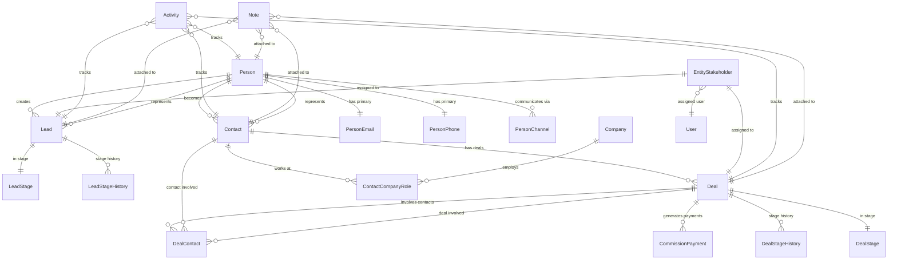

This document contains the complete specification for the CRM module, including entity relationships, implementation logic, query patterns, and business rules.

## Architecture overview

### Design principles

The CRM module uses a **Person + Contact Model** where:
- `Person` is the hidden identity layer (single source of truth for personal details)
- `Contact` is the business relationship layer (qualified customers)
- `Lead` is the sales opportunity layer (unqualified inquiries)  
- `Deal` links to `Contact`, not `Person` directly

Key architectural principles:

1. **Unified Stakeholder Model**: Single table for assignment and commission across leads/deals
2. **Polymorphic Patterns**: Notes, tags, and activities use entity_type/entity_id patterns
3. **Channel Separation**: Activity table indexes timeline; channel tables store full data
4. **Modular Design**: CRM core is independent; Real Estate, Marketing, Channels are optional modules
5. **Company via Contact**: Companies associate with `Contact` via `ContactCompanyRole` (not Person)

<Info>
The stage system is deeply integrated with the broader CRM architecture through entity relationships, assignment systems, activity correlation, and commission calculations.
</Info>

### Module boundaries

```
┌─────────────────────────────────────────────────────────────────┐
│                         CRM CORE                                │
│  Person, Lead, Contact, Company, Deal, DealContact             │
│  person_email, person_phone, person_address, person_channel    │
│  person_not_duplicate, contact_company_role                    │
│  entity_stakeholder, entity_transfer, commission_payment       │
│  activity, note, task, tag                                     │
└─────────────────────────────────────────────────────────────────┘
        │                    │                    │
        ▼                    ▼                    ▼
┌──────────────┐    ┌──────────────┐    ┌──────────────┐
│ REAL ESTATE  │    │  MARKETING   │    │   CHANNELS   │
│ development  │    │  campaign    │    │  whatsapp    │
│ unit         │    │  campaign_   │    │  instagram   │
│ site_visit   │    │  lead        │    │  (linked via │
│ lead_property│    │              │    │  person_     │
│ _interest    │    │              │    │  channel)    │
│ unit_owner-  │    │              │    │              │
│ ship→Person  │    │              │    │              │
└──────────────┘    └──────────────┘    └──────────────┘
```

### Real Estate integration

Real Estate entities link to **Person** (not Contact) for identity:

| Real Estate Entity       | Links To    | Rationale                                   |
| ------------------------ | ----------- | ------------------------------------------- |
| `unit_ownership`         | `person_id` | Ownership is about identity, not CRM status |
| `unit_transaction`       | `person_id` | Transaction party is an individual          |
| `site_visit`             | `person_id` | Who visited the property                    |
| `lead_property_interest` | `lead_id`   | Links to Lead for sales context             |
| `deal_property_interest` | `deal_id`   | Links to Deal for transaction context       |

**Deal Property Interest Workflow**:

```
// Deal created FROM Lead:
// Copy primary LeadPropertyInterest → DealPropertyInterest (1:1)
deal.propertyInterest.originatingInterest = leadPropertyInterest

// Deal created directly (walk-in):
// Create DealPropertyInterest with no originating interest
deal.propertyInterest.originatingInterest = null
```

---

## Core entities

### Person (Central identity)

**Purpose**: Single source of truth for human identity and preferences.

```
Person
├── Identity: first_name, last_name, avatar_url, title
├── Demographics: date_of_birth
├── Social: website, linkedin_url, twitter_url
├── Preferences: preferred_contact_method, timezone
├── Languages: languages (unified array with code and proficiency per entry)
├── Communication Flags: do_not_call, do_not_email
├── Source Tracking: original_source
├── Merge Tracking: merged_into_id, merged_at, merged_by
├── Computed: full_name (getter: first_name + last_name)
└── Related Tables:
    ├── person_email (multiple emails, one primary)
    ├── person_phone (multiple phones, one primary)
    ├── person_address (multiple addresses, one primary)
    ├── person_channel (WhatsApp, Instagram, etc. identities)
    └── person_not_duplicate (deduplication override pairs)
```

**Key Rules**:
- Every Lead, Contact must link to a Person
- Person preferences apply across all contexts (leads, deals, contacts)
- `original_source` is set once when person first enters system
- Languages array uses unified `UserLanguageEntry` format with code and proficiency per entry

### PersonChannel (Communication channels)

**Purpose**: Stores a person's communication channel identities (WhatsApp, Instagram, etc.).

```
person_channel
├── person_id → Person
├── channel_type (whatsapp, instagram, facebook, telegram, sms, webchat)
├── channel_identifier (phone number, username, PSID, etc.)
├── display_name, avatar_url
├── channel_identity_id → WhatsAppUser.id, InstagramUser.id, etc.
├── status (active, inactive, blocked, unsubscribed)
├── is_primary
├── Opt-in: marketing_opt_in, transactional_opt_in
├── Engagement: first_contact_at, last_message_at, message_count
└── Verification: is_verified, verified_at
```

**Key Rules**:
- Similar pattern to `person_email`, `person_phone`, `person_address`
- Channel belongs to Person, not Lead (Person-centric architecture)
- Lead can reference `source_channel_id` for attribution (which channel it came through)
- `channel_identity_id` links to detailed channel entities (WhatsAppUser, InstagramUser)
- One Person can have multiple channels of same type (e.g., multiple WhatsApp numbers)

### PersonNotDuplicate (Deduplication overrides)

**Purpose**: Records pairs of persons that have been manually confirmed as NOT duplicates. Prevents the deduplication system from repeatedly flagging the same pair.

```
person_not_duplicate
├── person1_id → Person
├── person2_id → Person
├── marked_by → User (who made the decision)
├── marked_at (when the decision was made)
├── organization_id → Organization
├── Unique constraint: (person1, person2, organization)
```

**Key Rules**:
- Symmetric: if (A, B) is marked as not-duplicate, the system treats (B, A) equivalently
- Organization-scoped: each org maintains its own override decisions
- Used by `PersonNotDuplicateService` to exclude pairs from duplicate detection

### Person merge system

**Purpose**: Consolidates duplicate persons into a single primary record, reassigning all related data.

**API Endpoint**: `POST /persons/:primaryPersonId/merge`

<Steps>
<Step title="Validation">
- Verify primary person exists and is not deleted
- Verify all secondary persons exist and are not deleted  
- All persons must be in the same organization
</Step>
<Step title="Field selection">
- Accept fieldSelections: Record<string, string>
- For each field, pick the value from the specified source person
- Fields not listed default to primary person's values
</Step>
<Step title="Contact info merge">
- mergeAllEmails: boolean — reassign all secondary emails to primary (isPrimary reset to false)
- mergeAllPhones: boolean — reassign all secondary phones to primary (isPrimary reset to false)  
- mergeAllAddresses: boolean — reassign all secondary addresses to primary (isPrimary reset to false)
</Step>
<Step title="Related entity reassignment">
- Reassign all Leads, Contacts, Activities, Notes to primary person
- Update entity_stakeholder records where person is stakeholder
- Transfer property interests, site visits, transactions
- Create audit trail in entity_transfer table
</Step>
<Step title="Mark secondary persons as merged">
- Set merged_into_id = primaryPersonId
- Set merged_at = NOW(), merged_by = currentUser
- Secondary persons become read-only and hidden from searches
</Step>
</Steps>

### Lead entity

**Purpose**: Sales opportunity layer for unqualified inquiries.

```
Lead
├── Identity: person_id → Person (required link)
├── Source: source, source_channel_id → PersonChannel
├── Pipeline: stage_id → LeadStage, stage_entered_at
├── Qualification: budget, timeline, decision_maker
├── Status: converted_at, disqualified_at, disqualification_reason
├── Assignment: assigned_to → User (primary owner)
├── Lead-specific: lead_score, lead_source_details
└── Meta: created_at, updated_at, archived_at
```

### Contact entity

**Purpose**: Business relationship layer for qualified customers.

```
Contact
├── Identity: person_id → Person (required link)
├── Business: customer_since, customer_type ('lead_conversion', 'direct', 'referral')
├── Classification: segment, priority, status
├── Financial: lifetime_value, payment_terms
├── Assignment: assigned_to → User (account manager)
└── Meta: created_at, updated_at, archived_at, archived_by
```

### Company entity

**Purpose**: Business organizations that contacts can be associated with.

```
Company
├── Identity: name, legal_name, logo_url
├── Details: description, industry, company_size
├── Contact Info: website, phone, email
├── Address: billing_address, shipping_address
├── Social: linkedin_url, twitter_url
├── Financial: annual_revenue, payment_terms
├── Assignment: assigned_to → User
├── Status: is_active, customer_since
└── Meta: created_at, updated_at, archived_at
```

### Deal entity

**Purpose**: Specific business transactions/opportunities.

```
Deal
├── Identity: contact_id → Contact (not Person directly)
├── Financial: value, currency, commission_rate, total_commission
├── Pipeline: stage_id → DealStage, stage_entered_at
├── Closure: is_closed, is_won, closed_at, closed_by
├── Timeline: expected_close_date, actual_close_date
├── Assignment: assigned_to → User (deal owner)
└── Meta: created_at, updated_at
```

### DealContact entity

**Purpose**: Associates multiple contacts with a single deal for complex B2B scenarios.

```
DealContact
├── deal_id → Deal
├── contact_id → Contact
├── role (primary_decision_maker, influencer, user, budget_holder)
├── influence_level (high, medium, low)
├── is_primary (boolean - primary contact for the deal)
├── added_at, added_by
└── organization_id
```

---

## Assignment & commission system

### Entity stakeholder relationships

```sql
entity_stakeholder (unified assignment table)
├── entity_type ('lead' | 'deal')
├── entity_id → Lead.id | Deal.id
├── user_id → User (assigned team member)
├── role (primary, secondary, observer, etc.)
├── commission_split (percentage for deals)
├── assigned_at, assigned_by
└── organization_id
```

**Integration points:**
- Lead conversion preserves stakeholder assignments to new Contact
- Deal closure triggers commission payment creation for all stakeholders
- Stage change notifications respect stakeholder roles and preferences

### Commission payment system

When a deal reaches `closed_won` stage, the system automatically:

<Steps>
<Step title="Calculate total commission">
```sql
deal.totalCommission = deal.value × (deal.commissionRate / 100)
```
</Step>
<Step title="Create payment records">
For each stakeholder assigned to the deal via `entity_stakeholder`:
```sql
CREATE commission_payment:
├── deal_id → Deal
├── user_id → stakeholder.user_id
├── amount → totalCommission × (stakeholder.commission_split / 100)
├── status → 'PENDING'
├── due_date → deal.closedAt + organization.commission_payment_terms
```
</Step>
<Step title="Payment lifecycle">
Commission payments progress: `PENDING` → `APPROVED` → `PAID` (or `CANCELLED`)
</Step>
</Steps>

---

## Transfer system

The CRM includes a comprehensive transfer system for reassigning entities between users or teams:

<Tabs>
<Tab title="Transfer table structure">
```sql
entity_transfer
├── entity_type ('lead' | 'deal' | 'contact')
├── entity_id → entity being transferred
├── from_user_id → User (previous owner)
├── to_user_id → User (new owner)
├── transfer_reason
├── notes
├── transferred_at, transferred_by
├── include_activities (boolean)
├── include_notes (boolean)
└── organization_id
```
</Tab>
<Tab title="Transfer validation">
- Source and target users must be active in the organization
- User must have permission to transfer the specific entity type
- Cannot transfer to self
- Cannot transfer archived entities
- Validates target user's role permissions for entity type
</Tab>
<Tab title="Transfer execution">
1. Create `entity_transfer` audit record
2. Update primary stakeholder assignment
3. Optionally transfer activities (reassign `created_by`)
4. Optionally transfer notes (reassign `created_by`) 
5. Update entity `updated_at` timestamp
6. Send notification to new owner
</Tab>
</Tabs>

<Info>
**Transfer workflow**: When leads or deals are transferred, the system creates audit records in `entity_transfer` table, updates stakeholder assignments, and can optionally transfer all related activities and notes.
</Info>

---

## Activity & communication system

### Activity tracking

```sql
activity (timeline index table)
├── entity_type ('lead' | 'deal' | 'contact' | 'person')
├── entity_id → entity being tracked
├── type (call, email, meeting, note, task, whatsapp, etc.)
├── direction (inbound, outbound, internal)
├── status (completed, scheduled, cancelled)
├── subject, summary
├── scheduled_at, completed_at
├── created_by_id → User
├── channel_specific_id → detailed record in channel table
└── organization_id
```

**Channel separation pattern:**
- `activity` table indexes timeline and provides unified querying
- Channel-specific tables (whatsapp_message, email_message) store full data
- `channel_specific_id` links activity to detailed record

### Auto-stage progression

The activity system triggers automatic stage transitions:

<Note>
When the first activity is logged for a lead in `NEW` stage, the system automatically moves it to `CONTACTED` stage and updates `lead.stageEnteredAt`.
</Note>

### Communication preferences

Person-level preferences control communication across all contexts:

```sql
-- From Person entity
├── preferred_contact_method (email, phone, whatsapp, etc.)
├── do_not_call (boolean)
├── do_not_email (boolean)
├── timezone
└── languages (unified array with code and proficiency per entry)
```

---

## Notes system

### Polymorphic notes

```sql
note
├── entity_type ('lead' | 'deal' | 'contact' | 'person')
├── entity_id → entity the note belongs to
├── content (rich text)
├── note_type (general, follow_up, internal, stage_change)
├── is_pinned (boolean)
├── created_by_id → User
├── visibility (private, team, organization)
└── organization_id
```

### Stage change notes

When stage transitions include a `stageChangeReason`, the system:
1. Stores the reason as `notes` in the stage history record
2. Creates a `note` record with `note_type = 'stage_change'`
3. For lead disqualification, also stores in `lead.disqualificationNotes`

---

## Stage history & analytics

### Design principle

History records track **completed stages only**. The current stage lives on the entity itself.

- `Lead.stage` / `Deal.stage` — current stage
- `Lead.stageEnteredAt` / `Deal.stageEnteredAt` — when the entity entered the current stage
- `lead_stage_history` / `deal_stage_history` — records of stages the entity has **left**

<Warning>
No history record is created when entering a stage. History is created only when **leaving** a stage. The current stage is never in history until you leave it.
</Warning>

### History tables

<Tabs>
<Tab title="lead_stage_history">
```sql
lead_stage_history (completed stages only)
├── lead_id → Lead
├── stage_id → lead_stage (the stage that was completed)
├── entered_at (when lead entered this stage)
├── duration_seconds (calculated: created_at - entered_at)
├── next_stage_id → lead_stage (optional, the stage moved to)
├── notes
├── changed_by_id
├── created_at (also serves as "exited_at")
```
</Tab>
<Tab title="deal_stage_history">
```sql
deal_stage_history (completed stages only)
├── deal_id → Deal
├── stage_id → deal_stage (the stage that was completed)
├── entered_at (when deal entered this stage)
├── duration_seconds (calculated: created_at - entered_at)
├── next_stage_id → deal_stage (optional, the stage moved to)
├── notes
├── changed_by_id
├── created_at (also serves as "exited_at")
```
</Tab>
</Tabs>

### Analytics queries

The stage history system enables detailed pipeline analytics and performance reporting:

<Tabs>
<Tab title="Average time per stage">
```sql
-- Average time in each stage (lead pipeline)
SELECT
  ls.name as stage_name,
  AVG(lsh.duration_seconds) as avg_seconds,
  COUNT(*) as transitions
FROM lead_stage_history lsh
JOIN lead_stage ls ON lsh.stage_id = ls.id
WHERE lsh.organization_id = :org_id
GROUP BY ls.id, ls.name
ORDER BY ls.order;
```
</Tab>
<Tab title="Conversion rates">
```sql
-- Conversion rate by stage
SELECT
  ls.name,
  COUNT(CASE WHEN l.converted_at IS NOT NULL THEN 1 END) as converted,
  COUNT(*) as total,
  COUNT(CASE WHEN l.converted_at IS NOT NULL THEN 1 END)::float / COUNT(*) as rate
FROM lead l
JOIN lead_stage ls ON l.stage_id = ls.id
WHERE l.organization_id = :org_id
GROUP BY ls.id, ls.name;
```
</Tab>
<Tab title="Stage flow analysis">
```sql
-- Stage transition patterns
SELECT
  current_stage.name as from_stage,
  next_stage.name as to_stage,
  COUNT(*) as transition_count,
  AVG(lsh.duration_seconds) as avg_duration
FROM lead_stage_history lsh
JOIN lead_stage current_stage ON lsh.stage_id = current_stage.id
LEFT JOIN lead_stage next_stage ON lsh.next_stage_id = next_stage.id
WHERE lsh.organization_id = :org_id
GROUP BY current_stage.name, next_stage.name
ORDER BY transition_count DESC;
```
</Tab>
<Tab title="Pipeline velocity">
```sql
-- Overall pipeline velocity (lead creation to conversion)
SELECT
  AVG(
    EXTRACT(EPOCH FROM (l.converted_at - l.created_at))
  ) / 86400 as avg_days_to_convert,
  COUNT(*) as total_conversions
FROM lead l
WHERE l.organization_id = :org_id
  AND l.converted_at IS NOT NULL
  AND l.created_at >= NOW() - INTERVAL '90 days';
```
</Tab>
</Tabs>

---

## Query patterns

The CRM system is optimized for common access patterns:

<Tabs>
<Tab title="Current pipeline state">
```sql
-- High-frequency operational queries (no history joins)
SELECT l.*, ls.name as stage_name, ls.color
FROM lead l
JOIN lead_stage ls ON l.stage_id = ls.id
WHERE l.organization_id = :org_id AND l.archived_at IS NULL;
```
</Tab>
<Tab title="Full stage timeline">
```sql
-- Analytical queries including history + current
SELECT timeline.* FROM (
  SELECT lsh.stage_id, lsh.entered_at, lsh.duration_seconds, ls.name
  FROM lead_stage_history lsh
  JOIN lead_stage ls ON lsh.stage_id = ls.id
  WHERE lsh.lead_id = :lead_id
  UNION ALL
  SELECT l.stage_id, l.stage_entered_at, NULL, ls.name
  FROM lead l
  JOIN lead_stage ls ON l.stage_id = ls.id
  WHERE l.id = :lead_id
) timeline
ORDER BY timeline.entered_at;
```
</Tab>
<Tab title="Entity relationships">
```sql
-- Person → Contact → Deals (relationship traversal)
SELECT d.*, c.customer_since, p.full_name
FROM deal d
JOIN contact c ON d.contact_id = c.id
JOIN person p ON c.person_id = p.id
WHERE p.id = :person_id AND d.organization_id = :org_id;
```
</Tab>
</Tabs>

---

## Business rules

### Stage validation

<AccordionGroup>
<Accordion title="Conversion constraints">
- A lead cannot move to Converted if it has already been converted to a Contact
- Moving to Converted stage requires `lead.person` to be in a valid state
- Auto-Contact creation respects organization settings and permissions
- Converted leads cannot be moved backward to active stages without clearing conversion data
</Accordion>

<Accordion title="Terminal stage validation">
- Deal closure requires all required fields to be populated (deal value, assigned stakeholders)
- Commission calculations must complete successfully before marking as Closed Won
- Terminal stage transitions trigger validation of all deal contacts and property interests
- Reopening validation checks commission payment status before allowing stage change
</Accordion>

<Accordion title="System stage enforcement">
- Custom stages cannot be inserted between system stages that have order dependencies
- Organizations cannot delete system stages even with overrides
- Stage reordering operations validate the entire pipeline before applying changes
- Bulk operations respect individual stage transition rules
</Accordion>
</AccordionGroup>

### Data integrity rules

- Every Lead and Contact must link to a Person
- Person merge operations maintain referential integrity across all related entities
- Stage history maintains temporal consistency (no gaps or overlaps in timelines)
- Commission payments are immutable once marked as PAID
- Entity transfers create complete audit trails

---

## Lead stage system

Lead stages use a `systemType` enum to define programmatic behavior. There are 5 system stages:

| systemType     | Default name | Behavior                                               |
| -------------- | ------------ | ------------------------------------------------------ |
| `new`          | New          | Default stage when lead is created                     |
| `contacted`    | Contacted    | Auto-transition when first activity is logged          |
| `qualified`    | Qualified    | Lead has been qualified                                |
| `converted`    | Converted    | Triggers conversion (sets `lead.convertedAt`)          |
| `disqualified` | Disqualified | Triggers disqualification (sets `lead.disqualifiedAt`) |

<Info>
System stages have `systemType` set; custom stages have `systemType = null`. The display name can be customized per organization, but `systemType` determines behavior. `isSystem`, `isConverted`, `isDisqualified`, and `isTerminal` are computed properties derived from `systemType`.
</Info>

```typescript
// Computed properties on LeadStage entity
get isSystem(): boolean { return this.systemType != null; }
get isConverted(): boolean { return this.systemType === SystemLeadStageType.CONVERTED; }
get isDisqualified(): boolean { return this.systemType === SystemLeadStageType.DISQUALIFIED; }
get isTerminal(): boolean { return this.isConverted || this.isDisqualified; }
get isNew(): boolean { return this.systemType === SystemLeadStageType.NEW; }
get isContacted(): boolean { return this.systemType === SystemLeadStageType.CONTACTED; }
```

### Lead terminal stage behaviors

<Tabs>
<Tab title="Conversion">
When a lead moves to the **Converted** stage (`isConverted = true`) and `convertedAt` is not already set:

1. Check if a Contact already exists for `lead.person` in this organization
2. If the Contact exists but is **archived**, auto-unarchive it (clear `isArchived`, `archivedAt`, `archivedBy`)
3. If no Contact exists, create one with `customerSince = NOW()` and `customerType = 'lead_conversion'`
4. Set `lead.convertedAt = NOW()`

<Note>
The idempotency check prevents duplicate contacts when a lead is moved to Converted multiple times or when the person already has a contact from a different lead. If the existing Contact is archived, the system auto-unarchives it rather than blocking conversion.
</Note>
</Tab>
<Tab title="Disqualification">
When a lead moves to the **Disqualified** stage (`isDisqualified = true`) and `disqualifiedAt` is not already set:

- Set `lead.disqualifiedAt = NOW()`
- If `stageChangeReason` is provided, store it in `lead.disqualificationNotes`

Setting `disqualificationReason` directly on the update DTO (without a stage change) also triggers `disqualifiedAt = NOW()` if it was previously null.

</Tab>
<Tab title="Auto-requalify">
When a lead moves **out of** a disqualified stage to any non-disqualified stage, and `disqualifiedAt` is set:

- Clear `lead.disqualifiedAt`
- Clear `lead.disqualificationReason`
- Clear `lead.disqualificationNotes`

This ensures that returning a lead to the pipeline automatically clears all disqualification data. No manual reset is needed.

</Tab>
</Tabs>

---

## Deal stage system

Deal stages also use a `systemType` enum. There are 5 system stages:

| systemType    | Default name | Behavior                                                      |
| ------------- | ------------ | ------------------------------------------------------------- |
| `new`         | New          | Default stage when deal is created                            |
| `proposal`    | Proposal     | Proposal sent                                                 |
| `negotiation` | Negotiation  | In active negotiation                                         |
| `closed_won`  | Closed Won   | Triggers deal closure (`deal.isWon = true`, `deal.closedAt`)  |
| `closed_lost` | Closed Lost  | Triggers deal closure (`deal.isWon = false`, `deal.closedAt`) |

```typescript
// Computed properties on DealStage entity
get isSystem(): boolean { return this.systemType != null; }
get isClosedWon(): boolean { return this.systemType === SystemDealStageType.CLOSED_WON; }
get isClosedLost(): boolean { return this.systemType === SystemDealStageType.CLOSED_LOST; }
get isTerminal(): boolean { return this.isClosedWon || this.isClosedLost; }
```

### Deal terminal stage behaviors

<Tabs>
<Tab title="Closing">
When a deal moves to a **terminal stage** (`isTerminal = true`):

1. Set `deal.isClosed = true`, `deal.isWon = newStage.isClosedWon`
2. Set `deal.closedAt = NOW()`, `deal.closedBy = currentUser`
3. If `isClosedWon`: calculate `deal.totalCommission = deal.value × (deal.commissionRate / 100)` and create `commission_payment` records for each deal stakeholder via the `entity_stakeholder` table

<Info>
The commission system creates individual payment records for each stakeholder assigned to the deal, with amounts calculated based on their configured commission split percentages.
</Info>

</Tab>
<Tab title="Reopening">
When a deal moves from a **terminal** stage back to a **non-terminal** stage:

1. Cancel all non-PAID commission payments (`PENDING` or `APPROVED` → `CANCELLED`)
2. If any payments are already `PAID`, throw an error — the deal cannot be reopened
3. Clear all closure fields: `isClosed = false`, `isWon = false`, `closedAt`, `closedBy`, `totalCommission`

<Warning>
Reopening a deal fully reverses the closure. If any commission payments have already been marked as PAID, the reopen is blocked because the financial transaction cannot be reversed from within the CRM.
</Warning>
</Tab>
</Tabs>

---

## Two-tier architecture

Both lead and deal stages use a global-plus-override architecture:

1. **Global stages** (`organization = NULL`) — System-defined stages shared across all organizations, seeded on startup.
2. **Organization-specific stages** (`organization = org_id`) — Custom stages created by the org, or overrides of global stages (e.g., changing the color of "New").

**Lookup priority:** Organization-specific → Global. When resolving a stage by `systemType`, the service checks org-specific first, then falls back to global.

<Tabs>
<Tab title="Update rules">
| Stage type | Name | Color | Order |
| --- | --- | --- | --- |
| Global (`org = NULL`) | Cannot modify directly | Cannot modify directly | Cannot modify directly |
| System override (org stage with `systemType`) | Cannot change | Can change | Cannot change |
| Custom stage (no `systemType`) | Can change | Can change | Via reorder API |

<Note>
Updating a global stage auto-creates an org-specific override instead of modifying the global record (lead stages). Deal stages throw an error suggesting the user create an override.
</Note>
</Tab>
<Tab title="Deletion rules">
- **Global system stages** — Cannot be deleted
- **Organization system overrides** — Cannot be deleted
- **Custom stages with active leads/deals** — Cannot be deleted until entities are moved to another stage
- **Custom stages with no active entities** — Can be deleted
</Tab>
</Tabs>

---

## Entity relationship diagram



---

## Events & integration

### Stage change events

The system emits events when entities change stages to enable integration with external systems:

<Tabs>
<Tab title="Lead stage events">
```typescript
// Event types for lead stage changes
LeadStageChanged {
  leadId: string;
  previousStageId: string;
  newStageId: string;
  previousStageType?: SystemLeadStageType;
  newStageType?: SystemLeadStageType;
  changedBy: string;
  changedAt: Date;
  reason?: string;
  isConverted: boolean;
  isDisqualified: boolean;
}
```
</Tab>
<Tab title="Deal stage events">
```typescript
// Event types for deal stage changes
DealStageChanged {
  dealId: string;
  previousStageId: string;
  newStageId: string;
  previousStageType?: SystemDealStageType;
  newStageType?: SystemDealStageType;
  changedBy: string;
  changedAt: Date;
  reason?: string;
  isClosed: boolean;
  isWon?: boolean;
  commissionTotal?: number;
}
```
</Tab>
<Tab title="Commission events">
```typescript
// Event types for commission processing
CommissionPaymentCreated {
  dealId: string;
  userId: string;
  amount: number;
  commissionSplit: number;
  status: 'PENDING';
  dueDate: Date;
}
```
</Tab>
</Tabs>

### Integration patterns

The CRM module integrates with other systems through:
- **Event-driven notifications** for stage changes, assignments, and commission calculations
- **Webhook endpoints** for external lead sources and deal updates
- **Data synchronization** for unified customer profiles across channels
- **Analytics exports** for reporting and business intelligence systems

---

## Data consistency guarantees

### Transaction boundaries

<AccordionGroup>
<Accordion title="Stage transitions">
All stage transition operations are wrapped in database transactions to ensure:
- Stage history record creation
- Entity field updates (convertedAt, closedAt, etc.)
- Commission payment generation (for deals)
- Notification dispatch
- Activity logging
</Accordion>

<Accordion title="Person merges">
Person merge operations use distributed transactions to ensure:
- Field value consolidation
- Contact info reassignment
- Related entity updates (leads, contacts, activities)
- Audit trail creation
- Referential integrity across all modules
</Accordion>

<Accordion title="Entity transfers">
Transfer operations maintain consistency through:
- Stakeholder assignment updates
- Activity and note ownership changes
- Permission validation
- Audit record creation
- Notification delivery
</Accordion>
</AccordionGroup>

### Rollback scenarios

The system handles failures gracefully:

<Warning>
If commission payment creation fails during deal closure, the entire transaction is rolled back and the deal remains in its previous stage until the issue is resolved.
</Warning>

<Note>
Person merge operations can be partially rolled back if referential integrity violations are detected, with detailed error reporting to identify the conflicting entities.
</Note>

---

<CardGroup cols={2}>
  <Card title="Lead" icon="bullseye" href="/backend/crm/lead">
    Lead entity and pipeline behavior.
  </Card>
  <Card title="Deal" icon="handshake" href="/backend/crm/deal">
    Deal entity, closure, and commission generation.
  </Card>
  <Card title="Entity views" icon="columns-3" href="/backend/entity-views">
    Kanban and list view APIs with stage grouping.
  </Card>
  <Card title="Enums" icon="list" href="/backend/crm/enums">
    Stage system type enum values.
  </Card>
</CardGroup>