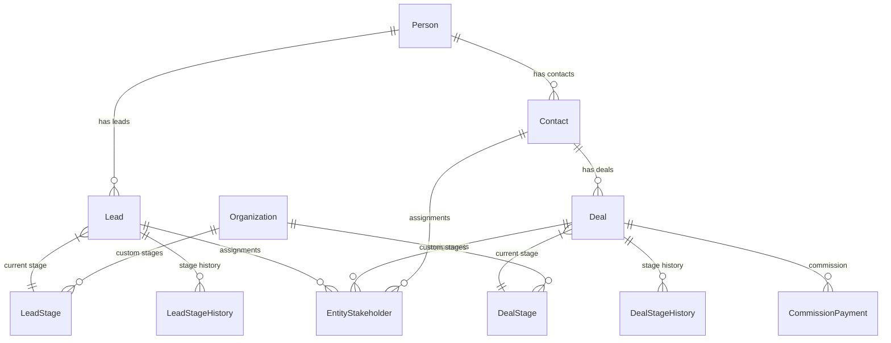

## Overview

The CRM stage system tracks leads and deals through configurable pipelines, maintaining comprehensive history for analytics and business insights. Both leads and deals use a two-tier architecture with global system stages and organization-specific customizations.

<Info>
The stage system is deeply integrated with the broader CRM architecture through entity relationships, assignment systems, activity correlation, and commission calculations.
</Info>

## Architecture overview

### Design principles

1. **Person + Contact Model**:
   - `Person` is the hidden identity layer (single source of truth for personal details)
   - `Contact` is the business relationship layer (qualified customers)
   - `Lead` is the sales opportunity layer (unqualified inquiries)
   - `Deal` links to `Contact`, not `Person` directly

2. **Unified Stakeholder Model**: Single table for assignment and commission across leads/deals

3. **Polymorphic Patterns**: Notes, tags, and activities use entity_type/entity_id patterns

4. **Channel Separation**: Activity table indexes timeline; channel tables store full data

5. **Modular Design**: CRM core is independent; Real Estate, Marketing, Channels are optional modules

6. **Company via Contact**: Companies associate with `Contact` via `ContactCompanyRole` (not Person)

7. **Organization Membership Display**: CRM DTOs batch-resolve organization membership status for user references, showing removed org members with `isActiveOrgMember: false` badges while preserving historical assignment data

<Note>
**Vocabulary note:** This doc uses "stakeholder" because it describes the engineering subsystem (entity name, table, services). The **user-facing and AI-facing** terms are "Assignment" (the concept) and "Assignee" (the assigned user or team). See `Docs/STAKEHOLDER_SYSTEM.md` → "Vocabulary" for the full policy.
</Note>

### Module boundaries

```
┌─────────────────────────────────────────────────────────────────┐
│                         CRM CORE                                │
│  Person, Lead, Contact, Company, Deal, DealContact             │
│  person_email, person_phone, person_address, person_channel    │
│  person_not_duplicate, contact_company_role                    │
│  entity_stakeholder, entity_transfer, commission_payment       │
│  activity, note, task, event, tag                              │
└─────────────────────────────────────────────────────────────────┘
        │                    │                    │
        ▼                    ▼                    ▼
┌──────────────┐    ┌──────────────┐    ┌──────────────┐
│ REAL ESTATE  │    │ LEAD CAPTURE │    │   CHANNELS   │
│ development  │    │ captured_lead│    │  whatsapp    │
│ unit         │    │ ingestion    │    │  instagram   │
│ site_visit   │    │ settings     │    │  (linked via │
│ lead_property│    │              │    │  person_     │
│ _interest    │    │              │    │  channel)    │
│ unit_owner-  │    │              │    │              │
│ ship→Person  │    │              │    │              │
└──────────────┘    └──────────────┘    └──────────────┘
```

### AI module integration

The CRM module integrates with the fully implemented and operational AI module (`AiModule`) for comprehensive automated conversations, lead processing, and workflow-assisted follow-up. CRM owns the business entities and lifecycle rules; the AI module owns agent configuration, runtime execution, queueing, LLM integration, security controls, and activity logging.

The AI module provides:

- **AI Agent Templates**: 10 pre-configured agent types (Receptionist, Sales Qualification, Listing Inquiry, Off-Plan Inquiry, Appointment Booking, After-Hours, FAQ & Support, Campaign Lead Capture, Spam Handler, Human Handoff) seeded via AiAgentTemplateSeeder
- **Knowledge Base Integration**: FAQ, SNIPPET, DOCUMENT, PAGE types with chunking, embedding, and RAG capabilities through KnowledgeBaseService
- **Credit Management**: Usage tracking with organizational and personal budgets via AiCreditUsageService
- **Queue-based Execution**: Reliable agent processing via AiAgentExecuteWorker with retry logic and error handling
- **Tool Registry**: Extensible system through AiAgentToolRegistryService and AiAgentActionService
- **OpenAI Integration**: Project provisioning and encrypted key management through OpenAiProjectProvisioner and OpenAiEncryptionService
- **Activity Logging**: Comprehensive audit trail via AiActivityLogService with filtering and analytics
- **Workflow Integration**: Bidirectional integration - AI agents can trigger workflows through the `trigger_workflow` action AND workflows can activate AI agents via AI_AGENT steps
- **Media Processing**: Audio/image processing via AiAgentMediaProcessorService
- **Optimization**: Instruction optimization via AiAgentOptimizeService with protected token preservation
- **Security**: SSRF protection via assertNotSsrf utility and AES-GCM encryption utilities
- **Conversation automation**: AI agents can respond to messaging conversations, use CRM context, and hand off to users or teams when configured actions require human follow-up

<Info>
**Unified inbound lead capture:** Leads arriving from external sources (Property Finder, Bayut/dubizzle, and future Meta/website) are ingested through the source-agnostic `crm/lead-capture` module — `LeadCaptureService.capture()` reuses `PersonService`, `LeadService.createLeadInTransaction`/`findDuplicateLeadMatchInTransaction`, `EntityStakeholderService`, and the `DistributionEngine`. The lead-capture module owns the `CapturedLeadInput` contract, `LeadCaptureSourceRegistry` for adapter registration, org-default `LeadCaptureSettings`, the `CapturedLead` idempotency ledger, and the source-agnostic `lead-ingestion` pg-boss queue + `LeadIngestionWorker`. Full design: `Docs/LEAD_CAPTURE_SPECIFICATION.md`.
</Info>

### History-only approach

History records track **completed stages only**. The current stage lives on the entity itself.

- `Lead.stage` / `Deal.stage` — current stage
- `Lead.stageEnteredAt` / `Deal.stageEnteredAt` — when the entity entered the current stage
- `lead_stage_history` / `deal_stage_history` — records of stages the entity has **left**

<Warning>
No history record is created when entering a stage. History is created only when **leaving** a stage. The current stage is never in history until you leave it.
</Warning>

### Two-tier architecture

Both lead and deal stages use a global-plus-override architecture:

1. **Global stages** (`organization = NULL`) — System-defined stages shared across all organizations, seeded on startup
2. **Organization-specific stages** (`organization = org_id`) — Custom stages created by the org, or overrides of global stages

**Lookup priority:** Organization-specific → Global. When resolving a stage by `systemType`, the service checks org-specific first, then falls back to global.

### Public ID system

All stages receive stable public identifiers using the shared CRM public ID allocator:

- Lead stages: `LSTG-{ORG_PREFIX}-{SEQUENCE}` (e.g., `LSTG-ADNS-001`)
- Deal stages: `DSTG-{ORG_PREFIX}-{SEQUENCE}` (e.g., `DSTG-ADNS-001`)
- Global system stages use deterministic IDs: `LSTG-NEW`, `LSTG-DISQUALIFIED`, `DSTG-CLOSED-WON`, etc.

<Note>
System stages have predictable public IDs based on their `systemType`, while custom stages use the organization-scoped sequence format.
</Note>

---

## Core entities

### Person + Contact model

<Tabs>
<Tab title="Person (identity layer)">
`Person` is the single source of truth for personal details:
- Email addresses via `person_email` (multiple, with primary flag)
- Phone numbers via `person_phone` (multiple, with primary flag)  
- Addresses via `person_address` (multiple, with type classification)
- Channel accounts via `person_channel` (WhatsApp, Instagram, etc.)
- Deduplication markers via `person_not_duplicate` (manual overrides)
</Tab>
<Tab title="Contact (business layer)">
`Contact` represents qualified business relationships:
- Links to `Person` for identity data
- Organization-specific qualification status
- Customer lifecycle tracking (`customerSince`, `customerType`)
- Business relationship metadata and preferences
- Company associations via `contact_company_role`
</Tab>
<Tab title="Lead (opportunity layer)">
`Lead` tracks unqualified inquiries and sales opportunities:
- Links to `Person` for identity data
- Stage progression through lead pipeline
- Source tracking and attribution
- Value estimation and qualification notes
- Conversion tracking to `Contact` status
</Tab>
</Tabs>

### Unified stakeholder model

The `entity_stakeholder` table provides consistent assignment and commission tracking across all CRM entities:

```sql
entity_stakeholder
├── id (Primary Key)
├── entity_type ('lead', 'deal', 'contact')
├── entity_id (Polymorphic FK to Lead, Deal, or Contact)
├── user_id → User (Assigned user)
├── role ('assigned', 'observer', 'collaborator', 'manager')
├── commission_split_percentage (For deals, must total 100%)
├── assigned_at, assigned_by_id
├── organization_id (For data isolation)
└── Indexes on (entity_type, entity_id, role)
```

---

## Lead stage system

Lead stages use a `systemType` enum to define programmatic behavior. There are 5 system stages:

| systemType     | Default name | Public ID           | Behavior                                                 |
| -------------- | ------------ | ------------------- | -------------------------------------------------------- |
| `new`          | New          | `LSTG-NEW`          | Default stage when lead is created                       |
| `contacted`    | Contacted    | `LSTG-CONTACTED`    | Auto-transition when first activity is logged           |
| `qualified`    | Qualified    | `LSTG-QUALIFIED`    | Lead has been qualified                                  |
| `converted`    | Converted    | `LSTG-CONVERTED`    | Triggers conversion (sets `lead.convertedAt`)           |
| `disqualified` | Disqualified | `LSTG-DISQUALIFIED` | Triggers disqualification (sets `lead.disqualifiedAt`)  |

<Info>
System stages have `systemType` set; custom stages have `systemType = null`. The display name can be customized per organization, but `systemType` determines behavior. `isSystem`, `isConverted`, `isDisqualified`, and `isTerminal` are computed properties derived from `systemType`.
</Info>

```typescript
// Computed properties on LeadStage entity
get isSystem(): boolean { return this.systemType != null; }
get isConverted(): boolean { return this.systemType === SystemLeadStageType.CONVERTED; }
get isDisqualified(): boolean { return this.systemType === SystemLeadStageType.DISQUALIFIED; }
get isTerminal(): boolean { return this.isConverted || this.isDisqualified; }
get isNew(): boolean { return this.systemType === SystemLeadStageType.NEW; }
get isContacted(): boolean { return this.systemType === SystemLeadStageType.CONTACTED; }
```

### Lead terminal stage behaviors

<Tabs>
<Tab title="Conversion">
When a lead moves to the **Converted** stage (`isConverted = true`) and `convertedAt` is not already set:

1. Check if a Contact already exists for `lead.person` in this organization
2. If the Contact exists but is **archived**, auto-unarchive it (clear `isArchived`, `archivedAt`, `archivedBy`)
3. If no Contact exists, create one with `customerSince = NOW()` and `customerType = 'lead_conversion'`
4. Set `lead.convertedAt = NOW()`

<Note>
The idempotency check prevents duplicate contacts when a lead is moved to Converted multiple times or when the person already has a contact from a different lead. If the existing Contact is archived, the system auto-unarchives it rather than blocking conversion.
</Note>
</Tab>
<Tab title="Disqualification">
When a lead moves to the **Disqualified** stage (`isDisqualified = true`) and `disqualifiedAt` is not already set:

- Set `lead.disqualifiedAt = NOW()`
- If `stageChangeReason` is provided, store it in `lead.disqualificationNotes`

Setting `disqualificationReason` directly on the update DTO (without a stage change) also triggers `disqualifiedAt = NOW()` if it was previously null.

</Tab>
<Tab title="Auto-requalify">
When a lead moves **out of** a disqualified stage to any non-disqualified stage, and `disqualifiedAt` is set:

- Clear `lead.disqualifiedAt`
- Clear `lead.disqualificationReason`
- Clear `lead.disqualificationNotes`

This ensures that returning a lead to the pipeline automatically clears all disqualification data. No manual reset is needed.

</Tab>
</Tabs>

---

## Deal stage system

Deal stages also use a `systemType` enum. There are 5 system stages:

| systemType    | Default name | Public ID           | Behavior                                                      |
| ------------- | ------------ | ------------------- | ------------------------------------------------------------- |
| `new`         | New          | `DSTG-NEW`          | Default stage when deal is created                            |
| `proposal`    | Proposal     | `DSTG-PROPOSAL`     | Proposal sent                                                 |
| `negotiation` | Negotiation  | `DSTG-NEGOTIATION`  | In active negotiation                                         |
| `closed_won`  | Closed Won   | `DSTG-CLOSED-WON`   | Triggers deal closure (`deal.isWon = true`, `deal.closedAt`) |
| `closed_lost` | Closed Lost  | `DSTG-CLOSED-LOST`  | Triggers deal closure (`deal.isWon = false`, `deal.closedAt`) |

```typescript
// Computed properties on DealStage entity
get isSystem(): boolean { return this.systemType != null; }
get isClosedWon(): boolean { return this.systemType === SystemDealStageType.CLOSED_WON; }
get isClosedLost(): boolean { return this.systemType === SystemDealStageType.CLOSED_LOST; }
get isTerminal(): boolean { return this.isClosedWon || this.isClosedLost; }
get isNew(): boolean { return this.systemType === SystemDealStageType.NEW; }
get isProposal(): boolean { return this.systemType === SystemDealStageType.PROPOSAL; }
get isNegotiation(): boolean { return this.systemType === SystemDealStageType.NEGOTIATION; }
```

### Deal terminal stage behaviors

<Tabs>
<Tab title="Closing">
When a deal moves to a **terminal stage** (`isTerminal = true`):

1. Set `deal.isClosed = true`, `deal.isWon = newStage.isClosedWon`
2. Set `deal.closedAt = NOW()`, `deal.closedBy = currentUser`
3. If `isClosedWon`: calculate `deal.totalCommission = deal.value × (deal.commissionRate / 100)` and create `commission_payment` records for each deal stakeholder via the `entity_stakeholder` table

<Info>
The commission system creates individual payment records for each stakeholder assigned to the deal, with amounts calculated based on their configured commission split percentages.
</Info>

</Tab>
<Tab title="Reopening">
When a deal moves from a **terminal** stage back to a **non-terminal** stage:

1. Cancel all non-PAID commission payments (`PENDING` or `APPROVED` → `CANCELLED`)
2. If any payments are already `PAID`, throw an error — the deal cannot be reopened
3. Clear all closure fields: `isClosed = false`, `isWon = false`, `closedAt`, `closedBy`, `totalCommission`

<Warning>
Reopening a deal fully reverses the closure. If any commission payments have already been marked as PAID, the reopen is blocked because the financial transaction cannot be reversed from within the CRM.
</Warning>
</Tab>
</Tabs>

---

## Assignment & commission system

### Entity stakeholder assignments

The unified `entity_stakeholder` table manages assignments and commissions across all CRM entities:

<Tabs>
<Tab title="Assignment roles">
| Role | Description | Lead behavior | Deal behavior |
|------|-------------|---------------|---------------|
| `assigned` | Primary responsible user | Default assignee for activities | Primary deal owner |
| `observer` | View-only access | Receives notifications | Gets deal updates |
| `collaborator` | Can modify and add activities | Full lead access | Can update deal |
| `manager` | Supervisory access | Team oversight | Approval authority |
</Tab>
<Tab title="Commission splits">
For deals, stakeholders with role `assigned` or `collaborator` can have commission splits:
- `commission_split_percentage` field (0-100)
- Must total exactly 100% across all stakeholders on a deal
- Commission payments generated on deal closure based on splits
- Validation prevents deal closure if splits don't total 100%
</Tab>
<Tab title="Assignment inheritance">
When leads convert to contacts and deals:
- Lead stakeholder assignments transfer to new contact
- Deal creation inherits contact stakeholder assignments  
- Commission splits default to equal distribution among assigned users
- Manual override available during deal creation
</Tab>
</Tabs>

---

## Transfer system

The `entity_transfer` table tracks assignment changes and bulk operations:

```sql
entity_transfer
├── id (Primary Key)
├── entity_type ('lead', 'deal', 'contact')
├── entity_id (Polymorphic FK)
├── from_user_id → User (Previous assignee)
├── to_user_id → User (New assignee)
├── transfer_type ('individual', 'bulk', 'automatic')
├── reason (Text explanation)
├── initiated_by_id → User (Who triggered the transfer)
├── organization_id
├── created_at
└── Indexes on (entity_type, entity_id), (from_user_id), (to_user_id)
```

---

## Activity & communication system

### Activity correlation

The activity system integrates deeply with stage progression:

<Tabs>
<Tab title="Auto-stage transitions">
Certain activities automatically trigger stage transitions:
- First activity on NEW lead → CONTACTED stage
- Outbound call/email → Updates last contact timestamp
- Meeting completion → Can trigger qualification workflows
- Site visit (real estate) → May advance to qualified stage
</Tab>
<Tab title="Stage-specific activities">
Different stages enable different activity types:
- NEW: Primarily inbound activities and initial outreach
- CONTACTED: Full activity suite available
- QUALIFIED: Focus on proposal and negotiation activities
- CONVERTED: Handoff activities and onboarding tasks
</Tab>
<Tab title="Activity analytics">
Stage progression analytics correlate with activity patterns:
- Activity volume vs. conversion rate analysis
- Most effective activity types per stage
- Time between activities and stage advancement
- User performance metrics by activity and stage combination
</Tab>
</Tabs>

### Communication channels

CRM integrates with multiple communication channels via the `person_channel` system:

```sql
person_channel
├── id (Primary Key)
├── person_id → Person (FK)
├── channel_type ('whatsapp', 'instagram', 'email', 'phone')
├── channel_identifier (Platform-specific ID)
├── display_name (Human-readable label)
├── is_primary (Boolean, one per channel_type)
├── is_verified (Boolean)
├── metadata (JSON, platform-specific data)
├── organization_id
└── Indexes on (person_id, channel_type), (channel_identifier)
```

---

## Notes system

### Polymorphic notes structure

The notes system supports all CRM entities with type-specific behaviors:

```sql
note
├── id (Primary Key)
├── entity_type ('person', 'lead', 'contact', 'deal', 'company')
├── entity_id (Polymorphic FK)
├── note_type ('general', 'stage_change', 'call_summary', 'meeting_notes')
├── title (Optional, for structured notes)
├── content (Rich text content)
├── is_pinned (Boolean, for important notes)
├── visibility ('private', 'team', 'organization')
├── created_by_id → User
├── organization_id
├── created_at, updated_at
└── Indexes on (entity_type, entity_id), (note_type), (created_by_id)
```

### Stage change notes

When stage transitions include a `stageChangeReason`, the system:
1. Stores the reason as `notes` in the stage history record
2. Creates a `note` record with `note_type = 'stage_change'`
3. For lead disqualification, also stores in `lead.disqualificationNotes`

---

## Stage history & analytics

### History table structures

<Tabs>
<Tab title="lead_stage_history">
```sql
lead_stage_history (completed stages only)
├── id (Primary Key)
├── lead_id → Lead (Foreign Key, Indexed)
├── stage_id → lead_stage (Foreign Key, the stage that was completed)
├── entered_at (Timestamp, when lead entered this stage)
├── duration_seconds (Integer, calculated: created_at - entered_at)
├── next_stage_id → lead_stage (Optional FK, the stage moved to)
├── notes (Text, stage change reason/notes)
├── changed_by_id → User (Foreign Key, who initiated the change)
├── organization_id → Organization (Foreign Key, for data isolation)
├── created_at (Timestamp, also serves as "exited_at")
├── updated_at (Timestamp)
└── Indexes:
    ├── UNIQUE(lead_id, stage_id, entered_at) -- Prevent duplicate history
    ├── INDEX(organization_id, created_at) -- Analytics queries
    ├── INDEX(stage_id, created_at) -- Stage performance reports
    └── INDEX(changed_by_id) -- User activity tracking
```
</Tab>
<Tab title="deal_stage_history">
```sql
deal_stage_history (completed stages only)
├── id (Primary Key)
├── deal_id → Deal (Foreign Key, Indexed)
├── stage_id → deal_stage (Foreign Key, the stage that was completed)
├── entered_at (Timestamp, when deal entered this stage)
├── duration_seconds (Integer, calculated: created_at - entered_at)
├── next_stage_id → deal_stage (Optional FK, the stage moved to)
├── notes (Text, stage change reason/notes)
├── changed_by_id → User (Foreign Key, who initiated the change)
├── organization_id → Organization (Foreign Key, for data isolation)
├── created_at (Timestamp, also serves as "exited_at")
├── updated_at (Timestamp)
└── Indexes:
    ├── UNIQUE(deal_id, stage_id, entered_at) -- Prevent duplicate history
    ├── INDEX(organization_id, created_at) -- Analytics queries
    ├── INDEX(stage_id, created_at) -- Stage performance reports
    └── INDEX(changed_by_id) -- User activity tracking
```
</Tab>
</Tabs>

### Stage entities structure

<Tabs>
<Tab title="LeadStage entity">
```typescript
LeadStage
├── id (Primary Key)
├── publicId (Org-scoped coded ID: LSTG-{ORG_PREFIX}-{SEQ} or LSTG-{SYSTEM_TYPE})
├── name (Display name, customizable per org)
├── color (Hex color code for UI display)
├── order (Integer, determines pipeline sequence)
├── systemType (SystemLeadStageType enum, null for custom stages)
├── organization_id (Foreign Key, NULL for global stages)
├── isActive (Boolean, for soft deletion)
├── created_at, updated_at, deleted_at
└── Computed Properties:
    ├── isSystem (derived from systemType)
    ├── isConverted, isDisqualified, isTerminal
    └── isNew, isContacted
```
</Tab>
<Tab title="DealStage entity">
```typescript
DealStage
├── id (Primary Key)
├── publicId (Org-scoped coded ID: DSTG-{ORG_PREFIX}-{SEQ} or DSTG-{SYSTEM_TYPE})
├── name (Display name, customizable per org)
├── color (Hex color code for UI display)
├── order (Integer, determines pipeline sequence)
├── systemType (SystemDealStageType enum, null for custom stages)
├── organization_id (Foreign Key, NULL for global stages)
├── isActive (Boolean, for soft deletion)
├── created_at, updated_at, deleted_at
└── Computed Properties:
    ├── isSystem (derived from systemType)
    ├── isClosedWon, isClosedLost, isTerminal
    └── isNew, isProposal, isNegotiation
```
</Tab>
</Tabs>

### Pipeline velocity metrics

<Tabs>
<Tab title="Average time per stage">
```sql
-- Average time in each stage (lead pipeline)
SELECT
  ls.name as stage_name,
  ls.system_type,
  AVG(lsh.duration_seconds) as avg_seconds,
  AVG(lsh.duration_seconds) / 86400.0 as avg_days,
  PERCENTILE_CONT(0.5) WITHIN GROUP (ORDER BY lsh.duration_seconds) as median_seconds,
  COUNT(*) as total_transitions,
  COUNT(DISTINCT lsh.lead_id) as unique_leads
FROM lead_stage_history lsh
JOIN lead_stage ls ON lsh.stage_id = ls.id
WHERE lsh.organization_id = :org_id
  AND lsh.created_at >= NOW() - INTERVAL '90 days'
GROUP BY ls.id, ls.name, ls.system_type
ORDER BY ls.order;
```
</Tab>
<Tab title="Conversion rates">
```sql
-- Conversion rate by stage with funnel analysis
SELECT
  ls.name as stage_name,
  ls.system_type,
  COUNT(*) as leads_reached,
  COUNT(CASE WHEN l.converted_at IS NOT NULL THEN 1 END) as converted,
  COUNT(CASE WHEN l.disqualified_at IS NOT NULL THEN 1 END) as disqualified,
  COUNT(CASE WHEN l.converted_at IS NOT NULL THEN 1 END)::float / NULLIF(COUNT(*), 0) as conversion_rate,
  COUNT(CASE WHEN l.disqualified_at IS NOT NULL THEN 1 END)::float / NULLIF(COUNT(*), 0) as disqualification_rate
FROM lead l
JOIN lead_stage ls ON l.stage_id = ls.id
WHERE l.organization_id = :org_id
  AND l.created_at >= NOW() - INTERVAL '90 days'
GROUP BY ls.id, ls.name, ls.system_type
ORDER BY ls.order;
```
</Tab>
<Tab title="Pipeline velocity">
```sql
-- Overall pipeline velocity and bottleneck identification
WITH pipeline_metrics AS (
  SELECT
    l.id as lead_id,
    l.created_at as lead_created,
    l.converted_at,
    l.disqualified_at,
    EXTRACT(EPOCH FROM (COALESCE(l.converted_at, l.disqualified_at, NOW()) - l.created_at)) / 86400.0 as total_pipeline_days,
    COUNT(lsh.id) as stages_completed
  FROM lead l
  LEFT JOIN lead_stage_history lsh ON l.id = lsh.lead_id
  WHERE l.organization_id = :org_id
    AND l.created_at >= NOW() - INTERVAL '90 days'
  GROUP BY l.id, l.created_at, l.converted_at, l.disqualified_at
)
SELECT
  AVG(total_pipeline_days) as avg_pipeline_days,
  PERCENTILE_CONT(0.5) WITHIN GROUP (ORDER BY total_pipeline_days) as median_pipeline_days,
  PERCENTILE_CONT(0.9) WITHIN GROUP (ORDER BY total_pipeline_days) as p90_pipeline_days,
  AVG(stages_completed) as avg_stages_per_lead,
  COUNT(*) as total_leads,
  COUNT(CASE WHEN converted_at IS NOT NULL THEN 1 END) as converted_count,
  COUNT(CASE WHEN disqualified_at IS NOT NULL THEN 1 END) as disqualified_count
FROM pipeline_metrics;
```
</Tab>
</Tabs>

---

## Query patterns

The CRM system is optimized for common access patterns:

<Tabs>
<Tab title="Current pipeline state">
```sql
-- High-frequency operational queries (no history joins)
-- Optimized for dashboard and list views
SELECT 
  l.id,
  l.public_id,
  l.title,
  l.value,
  l.stage_entered_at,
  ls.name as stage_name,
  ls.color as stage_color,
  ls.system_type,
  p.first_name || ' ' || p.last_name as person_name,
  EXTRACT(EPOCH FROM (NOW() - l.stage_entered_at)) / 86400.0 as days_in_stage
FROM lead l
JOIN lead_stage ls ON l.stage_id = ls.id
JOIN person p ON l.person_id = p.id
WHERE l.organization_id = :org_id 
  AND l.archived_at IS NULL
ORDER BY l.stage_entered_at DESC;
```
</Tab>
<Tab title="Full stage timeline">
```sql
-- Analytical queries including history + current stage
-- Used for lead detail pages and timeline views
SELECT timeline.* FROM (
  -- Historical stages (completed)
  SELECT 
    lsh.stage_id,
    ls.name as stage_name,
    ls.public_id as stage_public_id,
    ls.system_type,
    lsh.entered_at,
    lsh.created_at as exited_at,
    lsh.duration_seconds,
    lsh.notes,
    u.first_name || ' ' || u.last_name as changed_by_name,
    'completed' as status
  FROM lead_stage_history lsh
  JOIN lead_stage ls ON lsh.stage_id = ls.id
  LEFT JOIN users u ON lsh.changed_by_id = u.id
  WHERE lsh.lead_id = :lead_id
  
  UNION ALL
  
  -- Current stage (active)
  SELECT 
    l.stage_id,
    ls.name as stage_name,
    ls.public_id as stage_public_id,
    ls.system_type,
    l.stage_entered_at as entered_at,
    NULL as exited_at,
    EXTRACT(EPOCH FROM (NOW() - l.stage_entered_at))::integer as duration_seconds,
    NULL as notes,
    NULL as changed_by_name,
    'current' as status
  FROM lead l
  JOIN lead_stage ls ON l.stage_id = ls.id
  WHERE l.id = :lead_id
) timeline
ORDER BY timeline.entered_at ASC;
```
</Tab>
<Tab title="Stage assignment queries">
```sql
-- Leads/deals by stage with stakeholder information
-- Used for assignment and workload management
SELECT 
  ls.public_id as stage_public_id,
  ls.name as stage_name,
  COUNT(*) as total_leads,
  COUNT(DISTINCT es.user_id) as assigned_users,
  string_agg(DISTINCT u.first_name || ' ' || u.last_name, ', ') as assigned_to
FROM lead l
JOIN lead_stage ls ON l.stage_id = ls.id
LEFT JOIN entity_stakeholder es ON l.id = es.entity_id AND es.entity_type = 'lead'
LEFT JOIN users u ON es.user_id = u.id
WHERE l.organization_id = :org_id
  AND l.archived_at IS NULL
  AND (es.role = 'assigned' OR es.role IS NULL)
GROUP BY ls.id, ls.public_id, ls.name, ls.order
ORDER BY ls.order;
```
</Tab>
</Tabs>

---

## Business rules

### Stage transition constraints

<AccordionGroup>
<Accordion title="Lead conversion rules">
- A lead cannot move to Converted if it has already been converted to a Contact (idempotency protection)
- Moving to Converted stage requires `lead.person` to be in a valid state with complete contact information
- Auto-Contact creation respects organization settings and user permissions
- Converted leads cannot be moved backward to active stages without clearing conversion data
- If a Contact exists but is archived, conversion automatically unarchives it rather than failing
- Conversion creates audit trail in both stage history and contact creation activity logs
</Accordion>

<Accordion title="Deal closure rules">
- Deal closure requires all mandatory fields to be populated (deal value, assigned stakeholders, property interests for real estate deals)
- Commission calculations must complete successfully before marking as Closed Won
- Terminal stage transitions trigger validation of all deal contacts and property interests
- Reopening validation checks commission payment status before allowing stage change
- Deal value must be positive for Closed Won outcomes
- All stakeholders must have valid commission split percentages totaling 100%
</Accordion>

<Accordion title="Auto-transition triggers">
- New → Contacted: Triggered by first activity (call, email, meeting) logged against the lead
- Activity-based transitions cannot be manually bypassed but can be disabled per organization
- Auto-transitions respect stage change permissions and user roles
- Failed auto-transitions are logged but do not block the triggering activity
- Auto-transitions can be customized to skip certain activity types (e.g., automated emails)
</Accordion>
</AccordionGroup>

---

## Entity relationship diagram



---

## Events & integration

### Stage change events

The system emits comprehensive events when entities change stages to enable integration with external systems:

<Tabs>
<Tab title="Lead stage events">
```typescript
interface LeadStageChanged {
  leadId: string;
  leadPublicId: string;
  leadTitle: string;
  personId: string;
  previousStageId: string;
  newStageId: string;
  previousStageType?: SystemLeadStageType;
  newStageType?: SystemLeadStageType;
  changedBy: string;
  changedAt: Date;
  reason?: string;
  duration?: number; // seconds in previous stage
  isConverted: boolean;
  isDisqualified: boolean;
  organizationId: string;
  metadata?: {
    autoTransition?: boolean;
    triggerActivity?: string;
    conversionDetails?: ContactCreationDetails;
  };
}
```
</Tab>
<Tab title="Deal stage events">
```typescript
interface DealStageChanged {
  dealId: string;
  dealPublicId: string;
  dealTitle: string;
  dealValue: number;
  contactId: string;
  previousStageId: string;
  newStageId: string;
  previousStageType?: SystemDealStageType;
  newStageType?: SystemDealStageType;
  changedBy: string;
  changedAt: Date;
  reason?: string;
  duration?: number; // seconds in previous stage
  isClosed: boolean;
  isWon?: boolean;
  commissionTotal?: number;
  organizationId: string;
  metadata?: {
    stakeholderCount: number;
    propertyInterests?: string[];
    reopenedFromClosed?: boolean;
  };
}
```
</Tab>
</Tabs>

---

## Data consistency guarantees

### Transaction boundaries

<AccordionGroup>
<Accordion title="Stage transition transactions">
All stage transition operations use ACID transactions ensuring:
- Stage history record creation with calculated duration
- Entity field updates (convertedAt, closedAt, stageEnteredAt)
- Commission payment generation (for closed won deals)
- Activity log entry creation
- Event publication to message queue
- Cache invalidation across application instances

**Rollback scenarios:** If any step fails, the entire transaction is rolled back and the entity remains in its previous stage until manual intervention.
</Accordion>

<Accordion title="Commission calculation transactions">
Commission payment creation uses distributed transactions across:
- Deal closure validation and field updates
- Stakeholder role and split percentage validation
- Individual commission payment record creation
- Audit trail and approval workflow initialization
- External payment system notification (where applicable)

**Consistency guarantee:** Commission totals always match deal value × commission rate, with proper stakeholder split allocation.
</Accordion>
</AccordionGroup>

### Concurrent access handling

<AccordionGroup>
<Accordion title="Optimistic locking">
Stage changes use entity versioning to prevent conflicting updates:
- Version field updated on every entity modification
- Stage change operations validate current version before proceeding
- Concurrent modifications result in clear error messages requiring refresh
- Client applications handle version conflicts with user-friendly retry mechanisms
</Accordion>

<Accordion title="Stage configuration locking">
Administrative stage configuration changes use exclusive locks:
- Stage reordering operations lock the entire stage configuration
- Custom stage creation/deletion prevents concurrent pipeline modifications
- System stage override operations are serialized per organization
- Configuration changes trigger organization-wide cache invalidation
</Accordion>
</AccordionGroup>

---

<CardGroup cols={2}>
  <Card title="Lead" icon="bullseye" href="/backend/crm/lead">
    Lead entity and pipeline behavior.
  </Card>
  <Card title="Deal" icon="handshake" href="/backend/crm/deal">
    Deal entity, closure, and commission generation.
  </Card>
  <Card title="Entity views" icon="columns-3" href="/backend/entity-views">
    Kanban and list view APIs with stage grouping.
  </Card>
  <Card title="Enums" icon="list" href="/backend/crm/enums">
    Stage system type enum values.
  </Card>
</CardGroup>