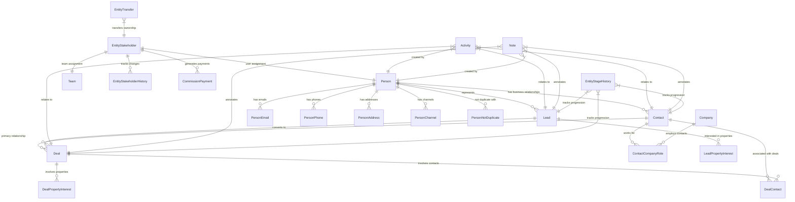

The CRM module provides comprehensive customer relationship management capabilities with a Person + Contact architecture, unified stakeholder model, and robust transfer system. This module integrates with Real Estate, Marketing, and Channel modules to deliver complete sales pipeline management.

## Architecture overview

The CRM module follows strict design principles and modular boundaries to ensure scalable, maintainable customer relationship management:

<Tabs>
<Tab title="Design principles">
**Person + Contact Model:**
- `Person` is the hidden identity layer (single source of truth for personal details)
- `Contact` is the business relationship layer (qualified customers)
- `Lead` is the sales opportunity layer (unqualified inquiries)
- `Deal` links to `Contact`, not `Person` directly

**Core architectural patterns:**
- Unified Stakeholder Model: Single table for assignment and commission across leads/deals
- Polymorphic Patterns: Notes, tags, and activities use entity_type/entity_id patterns
- Channel Separation: Activity table indexes timeline; channel tables store full data
- Company via Contact: Companies associate with `Contact` via `ContactCompanyRole` (not Person)
</Tab>

<Tab title="Module boundaries">
```
┌─────────────────────────────────────────────────────────────────┐
│                         CRM CORE                                │
│  Person, Lead, Contact, Company, Deal, DealContact             │
│  person_email, person_phone, person_address, person_channel    │
│  person_not_duplicate, contact_company_role                    │
│  entity_stakeholder, entity_transfer, commission_payment       │
│  activity, note, task, tag                                     │
└─────────────────────────────────────────────────────────────────┘
        │                    │                    │
        ▼                    ▼                    ▼
┌──────────────┐    ┌──────────────┐    ┌──────────────┐
│ REAL ESTATE  │    │  MARKETING   │    │   CHANNELS   │
│ development  │    │  campaign    │    │  whatsapp    │
│ unit         │    │  campaign_   │    │  instagram   │
│ site_visit   │    │  lead        │    │  (linked via │
│ lead_property│    │              │    │  person_     │
│ _interest    │    │              │    │  channel)    │
│ unit_owner-  │    │              │    │              │
│ ship→Person  │    │              │    │              │
└──────────────┘    └──────────────┘    └──────────────┘
```
</Tab>

<Tab title="Real estate integration">
**Entity linkage patterns:**

| Real Estate Entity       | Links To    | Rationale                                   |
| ------------------------ | ----------- | ------------------------------------------- |
| `unit_ownership`         | `person_id` | Ownership is about identity, not CRM status |
| `unit_transaction`       | `person_id` | Transaction party is an individual          |
| `site_visit`             | `person_id` | Who visited the property                    |
| `lead_property_interest` | `lead_id`   | Links to Lead for sales context             |
| `deal_property_interest` | `deal_id`   | Links to Deal for transaction context       |

**Deal Property Interest Workflow:**
```
// Deal created FROM Lead:
// Copy primary LeadPropertyInterest → DealPropertyInterest (1:1)
deal.propertyInterest.originatingInterest = leadPropertyInterest

// Deal created directly (walk-in):
// Create DealPropertyInterest with no originating interest
deal.propertyInterest.originatingInterest = null
```
</Tab>
</Tabs>

## Core entities

The CRM module centers around the Person entity as the single source of truth for human identity, with specialized relationship layers for business contexts:

### Person (Central Identity)

**Purpose**: Single source of truth for human identity and preferences across all business contexts.

<AccordionGroup>
<Accordion title="Person entity structure">
```
Person
├── Identity: first_name, last_name, avatar_url, title
├── Demographics: date_of_birth
├── Social: website, linkedin_url, twitter_url
├── Preferences: preferred_contact_method, timezone
├── Languages: languages (unified array with code and proficiency per entry)
├── Communication Flags: do_not_call, do_not_email
├── Source Tracking: original_source
├── Merge Tracking: merged_into_id, merged_at, merged_by
├── Computed: full_name (getter: first_name + last_name)
└── Related Tables:
    ├── person_email (multiple emails, one primary)
    ├── person_phone (multiple phones, one primary)
    ├── person_address (multiple addresses, one primary)
    ├── person_channel (WhatsApp, Instagram, etc. identities)
    └── person_not_duplicate (deduplication override pairs)
```

**Key Rules:**
- Every Lead, Contact must link to a Person
- Person preferences apply across all contexts (leads, deals, contacts)
- `original_source` is set once when person first enters system
- Languages array uses unified `UserLanguageEntry` format with code and proficiency per entry
</Accordion>

<Accordion title="PersonChannel (Communication Channels)">
**Purpose**: Stores a person's communication channel identities (WhatsApp, Instagram, etc.).

```
person_channel
├── person_id → Person
├── channel_type (whatsapp, instagram, facebook, telegram, sms, webchat)
├── channel_identifier (phone number, username, PSID, etc.)
├── display_name, avatar_url
├── channel_identity_id → WhatsAppUser.id, InstagramUser.id, etc.
├── status (active, inactive, blocked, unsubscribed)
├── is_primary
├── Opt-in: marketing_opt_in, transactional_opt_in
├── Engagement: first_contact_at, last_message_at, message_count
└── Verification: is_verified, verified_at
```

**Key Rules:**
- Similar pattern to `person_email`, `person_phone`, `person_address`
- Channel belongs to Person, not Lead (Person-centric architecture)
- Lead can reference `source_channel_id` for attribution (which channel it came through)
- `channel_identity_id` links to detailed channel entities (WhatsAppUser, InstagramUser)
- One Person can have multiple channels of same type (e.g., multiple WhatsApp numbers)
</Accordion>

<Accordion title="PersonNotDuplicate (Deduplication Overrides)">
**Purpose**: Records pairs of persons that have been manually confirmed as NOT duplicates. Prevents the deduplication system from repeatedly flagging the same pair.

```
person_not_duplicate
├── person1_id → Person
├── person2_id → Person
├── marked_by → User (who made the decision)
├── marked_at (when the decision was made)
├── organization_id → Organization
├── Unique constraint: (person1, person2, organization)
```

**Key Rules:**
- Symmetric: if (A, B) is marked as not-duplicate, the system treats (B, A) equivalently
- Organization-scoped: each org maintains its own override decisions
- Used by `PersonNotDuplicateService` to exclude pairs from duplicate detection
</Accordion>

<Accordion title="Person merge system">
**Purpose**: Consolidates duplicate persons into a single primary record, reassigning all related data.

**API Endpoint**: `POST /persons/:primaryPersonId/merge`

**Merge Workflow:**
<Steps>
<Step title="Validation">
- Verify primary person exists and is not deleted
- Verify all secondary persons exist and are not deleted
- All persons must be in the same organization
</Step>

<Step title="Field selection">
- Accept fieldSelections: Record<string, string>
  e.g., { "firstName": "primary", "lastName": "person-B-id" }
- For each field, pick the value from the specified source person
- Fields not listed default to primary person's values
</Step>

<Step title="Contact info merge">
- mergeAllEmails: boolean — reassign all secondary emails
- mergeAllPhones: boolean — reassign all secondary phones
- mergeAllAddresses: boolean — reassign all secondary addresses
- mergeAllChannels: boolean — reassign all secondary channels
</Step>

<Step title="Data reassignment">
- All leads, contacts, deals pointing to secondary persons → primary person
- All real estate relationships (unit_ownership, site_visit) → primary person
- Activity, notes, tasks → primary person
- Commission payments and stakeholder records → primary person
</Step>
</Steps>
</Accordion>
</AccordionGroup>

### Contact and Lead entities

<Tabs>
<Tab title="Contact (Business relationship layer)">
**Purpose**: Represents qualified business relationships with proper contact management.

```
Contact
├── person_id → Person (required)
├── Business Context: title, department, company_role
├── Relationship: relationship_type, contact_source
├── Status: status, lifecycle_stage
├── Assignment: assigned_to_user_id, assigned_to_team_id
├── Qualification: qualification_status, qualification_notes
├── Communication: last_contacted_at, next_followup_at
├── Metadata: custom_fields (JSONB)
└── Related: ContactCompanyRole (company associations)
```

**Key Rules:**
- Every Contact must link to a Person
- Company relationships managed via ContactCompanyRole
- Contacts can be promoted from Leads or created directly
- Assignment follows unified stakeholder model
</Tab>

<Tab title="Lead (Sales opportunity layer)">
**Purpose**: Manages unqualified inquiries and sales opportunities in the pipeline.

```
Lead
├── person_id → Person (required)
├── Sales Context: title, description, source, campaign
├── Status: status, stage, temperature
├── Assignment: assigned_to_user_id, assigned_to_team_id
├── Qualification: qualification_status, qualification_notes
├── Source Attribution: source_channel_id, source_campaign_id
├── Conversion: converted_to_contact_id, converted_to_deal_id
├── Timeline: created_at, last_activity_at, next_followup_at
└── Related: LeadPropertyInterest (real estate context)
```

**Key Rules:**
- Leads can be converted to Contacts and/or Deals
- Source attribution maintains marketing channel tracking
- Property interests link to real estate module
- Assignment and commission managed via entity_stakeholder
</Tab>

<Tab title="Deal (Transaction management)">
**Purpose**: Manages active sales transactions and deal progression.

```
Deal
├── contact_id → Contact (primary relationship)
├── Transaction: title, description, value, currency
├── Pipeline: stage, probability, expected_close_date
├── Assignment: assigned_to_user_id, assigned_to_team_id
├── Source: source_lead_id, source_campaign_id
├── Status: status, won_at, lost_at, lost_reason
├── Financial: commission_total, payment_terms
└── Related: 
    ├── DealContact (additional contacts)
    ├── DealPropertyInterest (property context)
    └── Entity_Stakeholder (commission split)
```

**Key Rules:**
- Primary relationship to Contact (not Person directly)
- Can have multiple associated contacts via DealContact
- Stakeholder commission automatically copied from source Lead
- Property interests maintain connection to originating lead interests
</Tab>
</Tabs>

### Company entity

<Accordion title="Company and ContactCompanyRole">
**Company structure:**
```
Company
├── Identity: name, legal_name, website, industry
├── Details: description, employee_count, annual_revenue
├── Location: headquarters_address, registration_country
├── Social: linkedin_url, twitter_url
├── Status: status, company_type
└── Related: ContactCompanyRole (contact associations)
```

**ContactCompanyRole (Association table):**
```
ContactCompanyRole
├── contact_id → Contact
├── company_id → Company
├── role (employee, customer, vendor, partner, etc.)
├── title, department
├── is_primary (one primary company per contact)
├── start_date, end_date
├── status (active, inactive)
```

**Key Rules:**
- Companies associate with Contacts, not Persons directly
- Multiple contacts can be associated with one company in different roles
- Contact can have multiple company associations (current and historical)
- Primary company designation for main business relationship
</Accordion>

## Assignment & commission system

The unified stakeholder model manages assignment and commission across all CRM entities with comprehensive tracking and payment integration:

<Tabs>
<Tab title="Entity stakeholder structure">
```
entity_stakeholder
├── Entity Reference:
│   ├── entity_type (lead | contact | deal)
│   └── entity_id
├── Stakeholder:
│   ├── user_id (nullable), team_id (nullable)
│   └── role (owner, collaborator, specialist, etc.)
├── Commission:
│   ├── commission_percentage (0.00-100.00)
│   ├── is_primary (boolean, one per entity)
│   └── commission_caps, commission_minimums
├── Assignment:
│   ├── assigned_at, assigned_by_id
│   └── assignment_reason
├── Status: status, effective_from, effective_until
└── Metadata: custom_attributes (JSONB)
```

**Key Rules:**
- Either user_id OR team_id must be set (not both, not neither)
- Total commission across all stakeholders cannot exceed 100%
- Only one stakeholder can have is_primary = true per entity
- History tracked in entity_stakeholder_history
</Tab>

<Tab title="Commission payment integration">
```
commission_payment
├── stakeholder_id → entity_stakeholder
├── Financial: amount, currency, exchange_rate
├── Payment: payment_date, payment_method, payment_reference
├── Source: source_entity_type, source_entity_id
├── Status: status (pending, paid, cancelled)
├── Schedule: payment_schedule, installment_number
├── Reconciliation: reconciled_at, reconciled_by
└── Integration: external_payment_id, external_system
```

**Payment Rules:**
- Payments calculated based on stakeholder commission percentages
- Multi-currency support with exchange rate tracking
- Installment payments supported for large deals
- Integration with external payment systems
- Automatic calculation updates when stakeholder percentages change
</Tab>

<Tab title="Team commission distribution">
**Team Member Commission:**
```
team_member_commission
├── team_stakeholder_id → entity_stakeholder (where team_id is set)
├── user_id → User (team member)
├── commission_percentage (percentage of team's total commission)
├── role_in_team (lead, support, specialist)
├── effective_from, effective_until
├── allocation_method (equal_split, performance_based, manual)
```

**Distribution Rules:**
- Team commission automatically distributed among active team members
- Distribution percentages can be equal or performance-based
- Changes to team membership update distribution calculations
- Historical distributions preserved for audit and payment purposes
</Tab>
</Tabs>

<Warning>
Commission percentages across all stakeholders (individual + team) for a single entity cannot exceed 100%. The system enforces this constraint at the database level and validates during stakeholder assignment operations.
</Warning>

## Transfer system

The transfer system manages formal transfers of leads and deals between agents or teams, with an approval workflow and commission splitting that integrates with the broader stakeholder system:

<Tabs>
<Tab title="Entity transfer schema">
```
entity_transfer
├── Entity reference:
│   ├── entity_type (lead | deal)
│   └── entity_id
├── Transfer parties:
│   ├── from_user_id (nullable), from_team_id (nullable)
│   └── to_user_id (nullable), to_team_id (nullable)
├── Commission handling:
│   ├── from_commission_total (snapshot of sender's commission at request time)
│   └── from_keeps_percentage (e.g., 30%)
├── Workflow tracking:
│   ├── status (pending, approved, rejected, cancelled)
│   ├── reason, reject_reason
│   ├── requested_by_id, requested_at
│   ├── approved_by, approved_at, rejected_by, rejected_at
├── Audit fields:
│   ├── created_at, updated_at
│   └── organization_id
└── Database constraints:
    ├── Unique partial index: (entity_type, entity_id) WHERE status = 'pending'
    ├── Check: Either from_user_id OR from_team_id (not both)
    ├── Check: Either to_user_id OR to_team_id (not both)
    ├── Check: from_keeps_percentage BETWEEN 0 AND 100
    └── Check: from_commission_total >= 0
```

<Info>
The unique partial index ensures only one pending transfer can exist per entity at a time. This prevents conflicting transfer requests and maintains system integrity while allowing multiple historical transfers per entity.
</Info>
</Tab>

<Tab title="Transfer approval workflow">
<Steps>
<Step title="Transfer request submission">
Agent A requests transfer of Lead #1 to Agent B. System creates `entity_transfer` record with:
- `from_commission_total`: snapshot of transferor's current commission percentage
- `from_keeps_percentage`: percentage the transferor will retain (0-100%)
- `status`: set to 'pending'

<Warning>
System validates transfer eligibility:
- Cannot transfer to self
- Must have valid from/to targets (user or team, not both)
- Transferor must be current stakeholder with sufficient commission
- Entity must be in transferable status (active lead/deal)
- All parties must be in same organization
</Warning>
</Step>

<Step title="Approval execution">
On approval, system performs atomic operations:
- **Transferor stakeholder**: commission reduced to `from_keeps_percentage`, `is_primary` set to false
- **Recipient stakeholder**: created/updated with remaining commission, `is_primary` set to true
- **History tracking**: `entity_stakeholder_history` records created for both parties
- **Transfer status**: updated to 'approved'
- **Commission payments**: updated to reflect new ownership structure
</Step>

<Step title="Auto-cancel protection">
Transfers automatically cancelled when:
- Transferor removed from stakeholder list
- Commission reduced below `from_commission_total`
- Entity converted, closed, or deleted
- User/team deactivated
</Step>
</Steps>
</Tab>

<Tab title="Commission split calculation">
**Base calculation:**
```
to_commission = from_commission_total × (100% - from_keeps_percentage) / 100%
```

**Examples:**
- 100% commission, 30% retention: 30% kept, 70% transferred
- 60% commission, 20% retention: 48% kept, 12% transferred
- 50% commission, 0% retention: 0% kept, 50% transferred (primary status only)

**Snapshot protection:** `from_commission_total` captures exact commission at request time, protecting against:
- Concurrent stakeholder modifications
- Other commission adjustments during pending period
- System changes that could invalidate transfer terms
- Race conditions between multiple operations
</Tab>
</Tabs>

## Activity & communication system

The activity system provides unified tracking of all interactions and communications across CRM entities with polymorphic design:

<AccordionGroup>
<Accordion title="Activity entity structure">
```
activity
├── Entity Reference: entity_type, entity_id (polymorphic)
├── Activity Type: activity_type, activity_subtype
├── Content: subject, description, activity_data (JSONB)
├── Participants: created_by, participants (user IDs array)
├── Channel: channel_type, channel_identifier, channel_message_id
├── Timeline: activity_date, duration, all_day
├── Status: status, visibility, is_billable
├── Integration: external_id, external_system, sync_status
└── Metadata: custom_fields, tags
```

**Activity Types:**
- **call**: Phone calls with duration and outcome
- **email**: Email communications (inbound/outbound)
- **meeting**: In-person or virtual meetings
- **note**: Internal notes and observations
- **task**: Action items and follow-ups
- **message**: Channel messages (WhatsApp, Instagram, etc.)
- **event**: External events and milestones
</Accordion>

<Accordion title="Channel-specific activity data">
**WhatsApp Message Activity:**
```json
{
  "channel_type": "whatsapp",
  "channel_identifier": "+1234567890",
  "channel_message_id": "wamid.ABC123",
  "activity_data": {
    "message_type": "text",
    "direction": "inbound",
    "content": "Message content",
    "media_url": "https://example.com/media.jpg",
    "delivery_status": "delivered",
    "read_status": "read"
  }
}
```

**Email Activity:**
```json
{
  "channel_type": "email",
  "channel_identifier": "user@example.com",
  "activity_data": {
    "direction": "outbound",
    "thread_id": "email_thread_123",
    "cc": ["cc@example.com"],
    "bcc": ["bcc@example.com"],
    "attachments": [{"name": "document.pdf", "size": 1024}],
    "delivery_status": "delivered",
    "open_tracking": true,
    "click_tracking": ["link1", "link2"]
  }
}
```
</Accordion>

<Accordion title="Activity query patterns">
**Entity timeline query:**
```sql
SELECT a.*, u.full_name as created_by_name,
       -- Channel details
       CASE a.channel_type
         WHEN 'whatsapp' THEN w.display_name
         WHEN 'email' THEN pe.email
         WHEN 'phone' THEN pp.phone_number
       END as channel_display_name
       
FROM activity a
LEFT JOIN users u ON a.created_by = u.id
LEFT JOIN person_channel pc ON a.channel_identifier = pc.channel_identifier 
  AND a.channel_type = pc.channel_type
LEFT JOIN whatsapp_user w ON pc.channel_identity_id = w.id 
  AND a.channel_type = 'whatsapp'
LEFT JOIN person_email pe ON a.channel_identifier = pe.email
LEFT JOIN person_phone pp ON a.channel_identifier = pp.phone_number

WHERE a.entity_type = ? AND a.entity_id = ?
  AND a.organization_id = ?
ORDER BY a.activity_date DESC, a.created_at DESC;
```

**Performance optimization:** Uses composite index on `(entity_type, entity_id, organization_id, activity_date)` for efficient timeline queries.
</Accordion>
</AccordionGroup>

## Notes system

The polymorphic notes system provides flexible annotation capabilities across all CRM entities:

<Tabs>
<Tab title="Note entity structure">
```
note
├── Entity Reference: entity_type, entity_id (polymorphic)
├── Content: title, content (rich text), note_type
├── Authorship: created_by, edited_by, last_edited_at
├── Visibility: visibility (private, team, public), shared_with_users
├── Organization: is_pinned, is_archived
├── Metadata: custom_fields, color, priority
└── Integration: external_id, external_system
```

**Note Types:**
- **general**: Standard notes and observations
- **meeting_notes**: Meeting minutes and action items
- **follow_up**: Follow-up reminders and tasks
- **qualification**: Lead/contact qualification notes
- **objection**: Sales objections and responses
- **feedback**: Customer feedback and satisfaction notes
</Tab>

<Tab title="Rich text and formatting">
**Content structure:**
```json
{
  "content": {
    "type": "doc",
    "content": [
      {
        "type": "paragraph",
        "content": [
          {
            "type": "text",
            "text": "Customer expressed interest in ",
            "marks": []
          },
          {
            "type": "text",
            "text": "premium unit",
            "marks": [{"type": "bold"}]
          },
          {
            "type": "text",
            "text": " on 15th floor."
          }
        ]
      }
    ]
  },
  "mentions": [
    {
      "type": "user",
      "id": "user_123",
      "name": "John Smith",
      "position": 12
    }
  ],
  "attachments": [
    {
      "type": "file",
      "name": "floor_plan.pdf",
      "url": "https://storage.example.com/documents/floor_plan.pdf",
      "size": 2048576
    }
  ]
}
```
</Tab>

<Tab title="Note sharing and permissions">
**Visibility Rules:**
- **private**: Only visible to note creator
- **team**: Visible to all team members assigned to the entity
- **public**: Visible to all organization members with entity access
- **shared**: Visible to specific users listed in `shared_with_users`

**Permission Enforcement:**
```javascript
const canViewNote = async (note, userId, organizationId) => {
  // Creator can always view
  if (note.created_by === userId) return true;
  
  // Check entity access first
  const hasEntityAccess = await checkEntityAccess(note.entity_type, note.entity_id, userId);
  if (!hasEntityAccess) return false;
  
  // Apply note visibility rules
  switch (note.visibility) {
    case 'private':
      return false;
    case 'team':
      return await isEntityTeamMember(note.entity_type, note.entity_id, userId);
    case 'public':
      return true;
    case 'shared':
      return note.shared_with_users.includes(userId);
    default:
      return false;
  }
};
```
</Tab>
</Tabs>

## Stage history & analytics

Comprehensive tracking of entity progression through sales stages with analytics capabilities:

<AccordionGroup>
<Accordion title="Entity stage history">
```
entity_stage_history
├── Entity Reference: entity_type, entity_id
├── Stage Transition: from_stage, to_stage, stage_type
├── Timing: entered_at, exited_at, duration_seconds
├── Attribution: changed_by, change_reason, change_method
├── Context: stakeholder_at_change, commission_at_change
├── Performance: conversion_probability, stage_score
└── Metadata: custom_attributes, external_trigger_id
```

**Stage Types:**
- **lead_status**: Lead qualification stages (new, qualified, nurturing, dead)
- **lead_temperature**: Interest level (cold, warm, hot)
- **deal_stage**: Sales pipeline stages (proposal, negotiation, closing, won, lost)
- **contact_lifecycle**: Contact maturity (prospect, customer, advocate, inactive)
</Accordion>

<Accordion title="Analytics queries">
**Stage duration analysis:**
```sql
SELECT 
  to_stage,
  AVG(duration_seconds) / 86400 as avg_days_in_stage,
  PERCENTILE_CONT(0.5) WITHIN GROUP (ORDER BY duration_seconds) / 86400 as median_days,
  COUNT(*) as transitions,
  COUNT(*) FILTER (WHERE exited_at IS NOT NULL) as completed_transitions
  
FROM entity_stage_history 
WHERE entity_type = 'deal' 
  AND stage_type = 'deal_stage'
  AND entered_at >= NOW() - INTERVAL '6 months'
  AND organization_id = ?
GROUP BY to_stage
ORDER BY avg_days_in_stage DESC;
```

**Conversion funnel analysis:**
```sql
WITH stage_funnel AS (
  SELECT 
    to_stage,
    COUNT(DISTINCT entity_id) as entities_entered,
    COUNT(DISTINCT CASE 
      WHEN exited_at IS NOT NULL 
      THEN entity_id 
    END) as entities_progressed
  FROM entity_stage_history 
  WHERE entity_type = 'deal' 
    AND stage_type = 'deal_stage'
    AND entered_at >= NOW() - INTERVAL '3 months'
    AND organization_id = ?
  GROUP BY to_stage
)
SELECT 
  sf.*,
  ROUND(100.0 * entities_progressed / entities_entered, 2) as progression_rate,
  LAG(entities_entered) OVER (ORDER BY to_stage) as previous_stage_count,
  ROUND(100.0 * entities_entered / LAG(entities_entered) OVER (ORDER BY to_stage), 2) as conversion_rate
FROM stage_funnel sf
ORDER BY to_stage;
```
</Accordion>

<Accordion title="Performance analytics">
**Stakeholder performance by stage:**
```sql
SELECT 
  u.full_name,
  esh.to_stage,
  COUNT(DISTINCT esh.entity_id) as deals_in_stage,
  AVG(esh.duration_seconds) / 86400 as avg_days_in_stage,
  COUNT(*) FILTER (
    WHERE esh.exited_at IS NOT NULL 
    AND EXISTS (
      SELECT 1 FROM entity_stage_history esh2 
      WHERE esh2.entity_id = esh.entity_id 
      AND esh2.to_stage = 'won'
    )
  ) as won_deals,
  SUM(d.value) FILTER (
    WHERE d.status = 'won'
  ) as total_won_value

FROM entity_stage_history esh
JOIN entity_stakeholder es ON esh.entity_type = es.entity_type 
  AND esh.entity_id = es.entity_id
  AND es.is_primary = true
JOIN users u ON es.user_id = u.id
LEFT JOIN deals d ON esh.entity_type = 'deal' AND esh.entity_id = d.id

WHERE esh.entity_type = 'deal'
  AND esh.stage_type = 'deal_stage'  
  AND esh.entered_at >= NOW() - INTERVAL '6 months'
  AND esh.organization_id = ?
GROUP BY u.id, u.full_name, esh.to_stage
ORDER BY u.full_name, esh.to_stage;
```
</Accordion>
</AccordionGroup>

## Query patterns

Optimized query patterns for common CRM operations with performance considerations:

<AccordionGroup>
<Accordion title="Entity stakeholder queries">
**Primary stakeholder lookup:**
```sql
-- Get primary stakeholder for multiple entities efficiently
SELECT 
  es.entity_type,
  es.entity_id,
  COALESCE(u.full_name, t.name) as primary_stakeholder_name,
  es.commission_percentage,
  es.assigned_at
  
FROM entity_stakeholder es
LEFT JOIN users u ON es.user_id = u.id
LEFT JOIN teams t ON es.team_id = t.id

WHERE es.is_primary = true
  AND (es.entity_type, es.entity_id) IN (
    ('lead', 123), ('deal', 456), ('contact', 789)
  )
  AND es.organization_id = ?;
```

**Commission breakdown by entity:**
```sql
SELECT 
  es.entity_type,
  es.entity_id,
  COALESCE(u.full_name, t.name) as stakeholder_name,
  es.role,
  es.commission_percentage,
  es.is_primary,
  CASE 
    WHEN es.entity_type = 'deal' THEN d.value * (es.commission_percentage / 100)
    ELSE 0 
  END as estimated_commission_value
  
FROM entity_stakeholder es
LEFT JOIN users u ON es.user_id = u.id
LEFT JOIN teams t ON es.team_id = t.id
LEFT JOIN deals d ON es.entity_type = 'deal' AND es.entity_id = d.id

WHERE es.entity_type = ? 
  AND es.entity_id = ?
  AND es.status = 'active'
  AND es.organization_id = ?
ORDER BY es.is_primary DESC, es.commission_percentage DESC;
```
</Accordion>

<Accordion title="Cross-entity relationship queries">
**Person→Contact→Deal relationship traverse:**
```sql
-- Get all deals for a person across their contact relationships
SELECT 
  p.full_name as person_name,
  c.title as contact_title,
  d.title as deal_title,
  d.value as deal_value,
  d.stage as deal_stage,
  es.commission_percentage,
  es.is_primary
  
FROM persons p
JOIN contacts c ON p.id = c.person_id
JOIN deals d ON c.id = d.contact_id
LEFT JOIN entity_stakeholder es ON d.id = es.entity_id 
  AND es.entity_type = 'deal'
  AND es.is_primary = true
LEFT JOIN users u ON es.user_id = u.id

WHERE p.id = ?
  AND p.organization_id = ?
  AND d.status NOT IN ('won', 'lost', 'cancelled')
ORDER BY d.expected_close_date ASC;
```

**Property interest tracking:**
```sql
-- Track property interest from lead through deal
SELECT 
  p.full_name as person_name,
  l.title as lead_title,
  lpi.property_id as interested_property,
  d.title as deal_title,
  dpi.property_id as deal_property,
  CASE 
    WHEN lpi.property_id = dpi.property_id THEN 'Same Property'
    ELSE 'Different Property'
  END as property_match
  
FROM persons p
JOIN leads l ON p.id = l.person_id
LEFT JOIN lead_property_interest lpi ON l.id = lpi.lead_id
LEFT JOIN deals d ON l.converted_to_deal_id = d.id
LEFT JOIN deal_property_interest dpi ON d.id = dpi.deal_id

WHERE l.converted_to_deal_id IS NOT NULL
  AND l.organization_id = ?
ORDER BY l.converted_at DESC;
```
</Accordion>

<Accordion title="Performance analytics queries">
**Pipeline velocity analysis:**
```sql
WITH stage_durations AS (
  SELECT 
    entity_id,
    to_stage,
    entered_at,
    exited_at,
    duration_seconds / 86400.0 as days_in_stage,
    LAG(to_stage) OVER (PARTITION BY entity_id ORDER BY entered_at) as previous_stage
  FROM entity_stage_history 
  WHERE entity_type = 'deal'
    AND stage_type = 'deal_stage'
    AND entered_at >= NOW() - INTERVAL '1 year'
    AND organization_id = ?
),
deal_outcomes AS (
  SELECT entity_id, 'won' as outcome
  FROM stage_durations 
  WHERE to_stage = 'won'
  
  UNION ALL
  
  SELECT entity_id, 'lost' as outcome
  FROM stage_durations 
  WHERE to_stage = 'lost'
)
SELECT 
  sd.to_stage,
  COUNT(*) as deals_entered_stage,
  AVG(sd.days_in_stage) as avg_days_in_stage,
  COUNT(do.entity_id) as deals_with_outcome,
  COUNT(CASE WHEN do.outcome = 'won' THEN 1 END) as won_deals,
  ROUND(
    100.0 * COUNT(CASE WHEN do.outcome = 'won' THEN 1 END) / COUNT(do.entity_id), 
    2
  ) as win_rate
  
FROM stage_durations sd
LEFT JOIN deal_outcomes do ON sd.entity_id = do.entity_id

GROUP BY sd.to_stage
ORDER BY sd.to_stage;
```
</Accordion>
</AccordionGroup>

## Business rules

Comprehensive business rules governing CRM operations, data integrity, and workflow enforcement:

<AccordionGroup>
<Accordion title="Entity relationship rules">
**Person-Contact-Deal hierarchy:**
- Every Contact and Lead must link to a Person (cannot be orphaned)
- Deal primary relationship is to Contact, but can have multiple associated Contacts via DealContact
- Person merge operations cascade to all related Contacts, Leads, and Deals
- Company associations work through ContactCompanyRole, not direct Person→Company links

**Conversion and progression rules:**
- Lead→Contact conversion creates Contact with same Person relationship
- Lead→Deal conversion can create intermediate Contact or link to existing Contact
- Deal creation from Lead auto-copies all stakeholder arrangements including commission splits
- Property interests maintain attribution chain from Lead→Deal through originating_interest linkage
</Accordion>

<Accordion title="Stakeholder and commission rules">
**Assignment constraints:**
- Only one primary stakeholder per entity at any time
- Total commission across all stakeholders cannot exceed 100%
- Either user_id OR team_id must be set (mutually exclusive)
- Stakeholders must belong to same organization as entity
- Team commission auto-distributes to team members according to allocation rules

**Commission payment rules:**
- Payments calculated only after deal closure (status = 'won')
- Historical stakeholder changes don't affect past payments
- Commission caps and minimums applied per stakeholder arrangement
- Multi-currency deals use exchange rate at payment time
- Payment reconciliation required before stakeholder changes on closed deals
</Accordion>

<Accordion title="Transfer system rules">
**Transfer eligibility:**
- Only active leads/deals can be transferred (not archived, deleted, or closed)
- Transferor must be current stakeholder with commission ≥ from_commission_total
- Cannot transfer to self (same user or team)
- All parties must belong to same organization

**Auto-cancellation triggers:**
- Transferor removed from stakeholder list cancels pending transfers
- Commission reduction below from_commission_total cancels pending transfers
- Entity lifecycle changes (conversion, closure) cancel pending transfers
- User/team deactivation cascades to cancel all related pending transfers
</Accordion>

<Accordion title="Data consistency rules">
**Merge and deduplication:**
- Person merge requires all persons in same organization
- Merge operations are atomic (complete success or complete rollback)
- PersonNotDuplicate entries prevent repeated flagging of confirmed non-duplicates
- Merge audit trail maintains complete history of consolidation decisions

**Activity and communication:**
- Activities must link to valid entities (person, contact, lead, deal)
- Channel activities require valid channel identifier and type
- Activity visibility inherits from entity access permissions
- Cross-entity activities (mentions, references) validate entity relationships
</Accordion>
</AccordionGroup>

## Entity relationship diagram



## Events & integration

Comprehensive event system supporting real-time integrations and external system synchronization:

<AccordionGroup>
<Accordion title="Core CRM events">
**Entity lifecycle events:**
```javascript
// Person events
eventBus.emit('person.created', { personId, organizationId, createdBy });
eventBus.emit('person.merged', { primaryPersonId, mergedPersonIds, fieldSelections });
eventBus.emit('person.deduplication_override', { person1Id, person2Id, markedBy });

// Lead events  
eventBus.emit('lead.created', { leadId, personId, sourceChannel, assignedTo });
eventBus.emit('lead.qualified', { leadId, qualificationLevel, qualifiedBy });
eventBus.emit('lead.converted', { leadId, contactId, dealId, convertedBy });

// Deal events
eventBus.emit('deal.created', { dealId, contactId, value, sourceLeadId });
eventBus.emit('deal.stage_changed', { dealId, fromStage, toStage, changedBy });
eventBus.emit('deal.won', { dealId, value, wonAt, commission_total });
eventBus.emit('deal.lost', { dealId, lostReason, lostAt });
```
</Accordion>

<Accordion title="Stakeholder and commission events">
**Assignment events:**
```javascript
// Stakeholder changes
eventBus.emit('stakeholder.assigned', { 
  entityType, entityId, stakeholderId, commission, isPrimary 
});
eventBus.emit('stakeholder.commission_changed', { 
  stakeholderId, oldCommission, newCommission, reason 
});
eventBus.emit('stakeholder.removed', { stakeholderId, removedBy, reason });

// Transfer events
eventBus.emit('transfer.requested', {
  transferId, entityType, entityId, fromParty, toParty, commissionSplit
});
eventBus.emit('transfer.approved', { 
  transferId, approvedBy, newStakeholderArrangement 
});
eventBus.emit('transfer.cancelled', { transferId, reason, cancelledBy });

// Commission events
eventBus.emit('commission.payment_calculated', { 
  paymentId, stakeholderId, amount, dueDate 
});
eventBus.emit('commission.payment_completed', { 
  paymentId, amount, paidAt, paymentMethod 
});
```
</Accordion>

<Accordion title="External system integrations">
**CRM platform sync:**
```javascript
// Salesforce integration
const salesforceSync = {
  async syncContact(contactId, action) {
    const contact = await Contact.findById(contactId, { include: ['person'] });
    
    switch (action) {
      case 'created':
        await salesforce.createContact({
          FirstName: contact.person.firstName,
          LastName: contact.person.lastName,
          Email: contact.person.primaryEmail,
          Custom_CRM_ID__c: contact.id
        });
        break;
        
      case 'stakeholder_changed':
        await salesforce.updateContactOwner({
          contactId: contact.external_salesforce_id,
          newOwner: await mapUserToSalesforce(contact.primaryStakeholder.userId)
        });
        break;
    }
  }
};

// HubSpot integration
const hubspotSync = {
  async syncDeal(dealId, action) {
    const deal = await Deal.findById(dealId, { 
      include: ['contact', 'contact.person', 'stakeholders'] 
    });
    
    const hubspotDeal = {
      dealname: deal.title,
      amount: deal.value,
      dealstage: mapStageToHubspot(deal.stage),
      hubspot_owner_id: await mapUserToHubspot(deal.primaryStakeholder.userId)
    };
    
    if (action === 'created') {
      await hubspot.deals.create(hubspotDeal);
    } else {
      await hubspot.deals.update(deal.external_hubspot_id, hubspotDeal);
    }
  }
};
```
</Accordion>

<Accordion title="Real estate module coordination">
**Property interest sync:**
```javascript
// Maintain property interest consistency
eventBus.on('lead.converted', async (event) => {
  const { leadId, dealId } = event;
  
  // Copy lead property interests to deal
  const leadPropertyInterests = await LeadPropertyInterest.findAll({
    where: { lead_id: leadId }
  });
  
  for (const interest of leadPropertyInterests) {
    await DealPropertyInterest.create({
      deal_id: dealId,
      property_id: interest.property_id,
      interest_level: interest.interest_level,
      budget_range: interest.budget_range,
      originating_lead_interest_id: interest.id
    });
  }
});

// Site visit attribution
eventBus.on('site_visit.completed', async (event) => {
  const { siteVisitId, personId, propertyId } = event;
  
  // Find active leads/deals for this person
  const activeLeads = await Lead.findAll({
    where: { person_id: personId, status: ['new', 'qualified', 'nurturing'] }
  });
  
  const activeDeals = await Deal.findAll({
    include: [{
      model: Contact,
      where: { person_id: personId }
    }],
    where: { status: ['proposal', 'negotiation', 'closing'] }
  });
  
  // Create activities linking site visit to active opportunities
  for (const lead of activeLeads) {
    await Activity.create({
      entity_type: 'lead',
      entity_id: lead.id,
      activity_type: 'site_visit',
      subject: `Site visit completed for ${propertyId}`,
      activity_data: { site_visit_id: siteVisitId, property_id: propertyId }
    });
  }
});
```
</Accordion>
</AccordionGroup>

## Data consistency guarantees

Multi-layered consistency enforcement ensuring data integrity across all CRM operations:

<AccordionGroup>
<Accordion title="ACID transaction guarantees">
**Database-level consistency:**
- All stakeholder updates, commission splits, and payment adjustments execute within single database transactions
- Atomicity ensures complete success or complete rollback with no partial states
- Isolation prevents concurrent operations from creating inconsistent intermediate states
- Durability guarantees approved transfers survive system failures

**Critical transaction examples:**
```sql
BEGIN;
  -- Transfer approval transaction
  UPDATE entity_stakeholder 
  SET commission_percentage = ?, is_primary = false
  WHERE entity_type = ? AND entity_id = ? AND user_id = ?;
  
  INSERT INTO entity_stakeholder (entity_type, entity_id, user_id, commission_percentage, is_primary)
  VALUES (?, ?, ?, ?, true)
  ON CONFLICT (entity_type, entity_id, user_id) 
  DO UPDATE SET commission_percentage = commission_percentage + EXCLUDED.commission_percentage;
  
  UPDATE entity_transfer SET status = 'approved', approved_by = ?, approved_at = NOW()
  WHERE id = ?;
  
  INSERT INTO entity_stakeholder_history (...) VALUES (...);
COMMIT;
```
</Accordion>

<Accordion title="Application-level validation">
**Business rule enforcement:**
```javascript
const validateStakeholderConsistency = async (entityType, entityId) => {
  // Verify total commission doesn't exceed 100%
  const totalCommission = await EntityStakeholder.sum('commission_percentage', {
    where: { entity_type: entityType, entity_id: entityId, status: 'active' }
  });
  
  if (totalCommission > 100) {
    throw new ValidationError('Total stakeholder commission exceeds 100%');
  }
  
  // Verify exactly one primary stakeholder
  const primaryCount = await EntityStakeholder.count({
    where: { 
      entity_type: entityType, 
      entity_id: entityId, 
      is_primary: true,
      status: 'active'
    }
  });
  
  if (primaryCount !== 1) {
    throw new ValidationError('Must have exactly one primary stakeholder');
  }
  
  // Validate commission payment obligations
  await validateCommissionPayments(entityType, entityId);
};
```
</Accordion>

<Accordion title="Cross-system consistency">
**Integration consistency checks:**
```javascript
const ensureIntegrationConsistency = async (entityType, entityId) => {
  // Verify external system sync status
  const entity = await getEntity(entityType, entityId);
  const integrations = await getActiveIntegrations(entity.organization_id);
  
  for (const integration of integrations) {
    const syncStatus = await integration.checkSyncStatus(entityType, entityId);
    
    if (syncStatus.status === 'out_of_sync') {
      // Queue re-sync operation
      await queueSyncOperation(integration, entityType, entityId, {
        priority: 'high',
        reason: 'consistency_check_failed',
        lastSyncAt: syncStatus.lastSyncAt,
        retryCount: syncStatus.retryCount
      });
    }
  }
  
  // Verify commission payment system consistency
  const commissionCheck = await CommissionPaymentService.validateConsistency(
    entityType, entityId
  );
  
  if (!commissionCheck.isValid) {
    throw new ConsistencyError(`Commission payment inconsistency: ${commissionCheck.errors.join(', ')}`);
  }
};
```
</Accordion>

<Accordion title="Audit and recovery mechanisms">
**Consistency monitoring:**
```javascript
// Periodic consistency checks
const runConsistencyChecks = async () => {
  const checks = [
    // Orphaned stakeholders
    await db.query(`
      SELECT es.id, es.entity_type, es.entity_id 
      FROM entity_stakeholder es
      LEFT JOIN leads l ON es.entity_type = 'lead' AND es.entity_id = l.id
      LEFT JOIN contacts c ON es.entity_type = 'contact' AND es.entity_id = c.id  
      LEFT JOIN deals d ON es.entity_type = 'deal' AND es.entity_id = d.id
      WHERE l.id IS NULL AND c.id IS NULL AND d.id IS NULL
    `),
    
    // Commission total validation
    await db.query(`
      SELECT entity_type, entity_id, SUM(commission_percentage) as total
      FROM entity_stakeholder 
      WHERE status = 'active'
      GROUP BY entity_type, entity_id
      HAVING SUM(commission_percentage) > 100
    `),
    
    // Primary stakeholder validation  
    await db.query(`
      SELECT entity_type, entity_id, COUNT(*) as primary_count
      FROM entity_stakeholder
      WHERE is_primary = true AND status = 'active'
      GROUP BY entity_type, entity_id
      HAVING COUNT(*) != 1
    `)
  ];
  
  // Report and queue repairs for any inconsistencies
  for (const [checkName, results] of Object.entries(checks)) {
    if (results.length > 0) {
      await reportConsistencyIssue(checkName, results);
      await queueDataRepair(checkName, results);
    }
  }
};
```
</Accordion>
</AccordionGroup>

<CardGroup cols={2}>
  <Card
    title="Person API reference"
    icon="user"
    href="/backend/person-api"
  >
    Complete Person entity operations including merge functionality.
  </Card>
  <Card
    title="Stakeholder API reference"
    icon="users"
    href="/backend/stakeholder-api"
  >
    Stakeholder management and commission tracking endpoints.
  </Card>
  <Card
    title="Transfer API reference"
    icon="arrows-rotate"  
    href="/backend/transfer-api"
  >
    Transfer operations and approval workflow endpoints.
  </Card>
  <Card
    title="Activity API reference"
    icon="clock"
    href="/backend/activity-api"
  >
    Activity tracking and communication history endpoints.
  </Card>
</CardGroup>