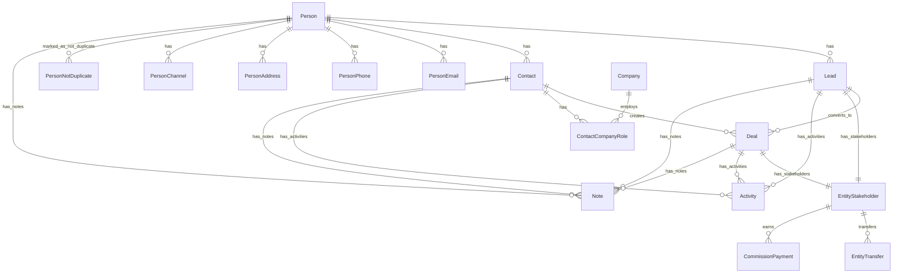
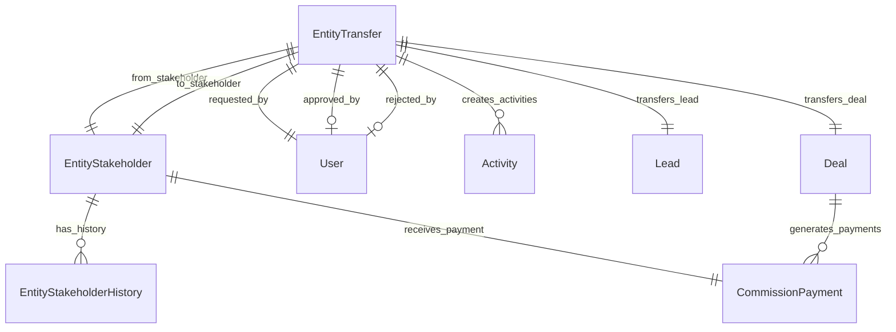

The CRM transfer system manages formal transfers of leads and deals between agents or teams, with comprehensive approval workflows, commission splitting, and integration with the broader stakeholder management system.

## Architecture overview

The CRM module follows a person-centric architecture with sophisticated transfer capabilities:

<Tabs>
<Tab title="Core design principles">
**Person + Contact model:**
- `Person` is the hidden identity layer (single source of truth for personal details)
- `Contact` is the business relationship layer (qualified customers)  
- `Lead` is the sales opportunity layer (unqualified inquiries)
- `Deal` links to `Contact`, not `Person` directly

**Unified stakeholder model:**
- Single table for assignment and commission across leads/deals
- Polymorphic patterns for notes, tags, and activities using entity_type/entity_id
- Channel separation with activity table indexing timeline
- Modular design with CRM core independent of Real Estate, Marketing, and Channels

**Transfer system integration:**
- Formal ownership transfer with sophisticated commission splitting
- Integrated approval workflow with configurable authorization
- Atomic operations ensuring data consistency during transfers
- Comprehensive audit trail for compliance reporting
</Tab>

<Tab title="Module boundaries">
```
┌─────────────────────────────────────────────────────────────────┐
│                         CRM CORE                                │
│  Person, Lead, Contact, Company, Deal, DealContact             │
│  person_email, person_phone, person_address, person_channel    │
│  person_not_duplicate, contact_company_role                    │
│  entity_stakeholder, entity_transfer, commission_payment       │
│  activity, note, task, tag                                     │
└─────────────────────────────────────────────────────────────────┘
        │                    │                    │
        ▼                    ▼                    ▼
┌──────────────┐    ┌──────────────┐    ┌──────────────┐
│ REAL ESTATE  │    │  MARKETING   │    │   CHANNELS   │
│ development  │    │  campaign    │    │  whatsapp    │
│ unit         │    │  campaign_   │    │  instagram   │
│ site_visit   │    │  lead        │    │  (linked via │
│ lead_property│    │              │    │  person_     │
│ _interest    │    │              │    │  channel)    │
│ unit_owner-  │    │              │    │              │
│ ship→Person  │    │              │    │              │
└──────────────┘    └──────────────┘    └──────────────┘
```

**Real estate → CRM integration:**

| Real Estate Entity       | Links To    | Rationale                                   |
| ------------------------ | ----------- | ------------------------------------------- |
| `unit_ownership`         | `person_id` | Ownership is about identity, not CRM status |
| `unit_transaction`       | `person_id` | Transaction party is an individual          |
| `site_visit`             | `person_id` | Who visited the property                    |
| `lead_property_interest` | `lead_id`   | Links to Lead for sales context             |
| `deal_property_interest` | `deal_id`   | Links to Deal for transaction context       |
</Tab>

<Tab title="Transfer system overview">
**Entity transfers:**
- Formal ownership transfer of leads and deals between users or teams
- Integrated approval workflow with configurable authorization
- Commission splitting with percentage-based retention for transferor
- Atomic operations ensuring data consistency during transfers

**Polymorphic design:**
- Uses `entity_type` and `entity_id` pattern for flexible entity reference
- Supports both `lead` and `deal` transfers with unified logic
- Extensible architecture for future entity types

**Key principles:**
- Snapshot-based commission calculation prevents race conditions
- Auto-cancellation protection for invalid states
- History tracking for audit compliance
- Integration with broader stakeholder management system
</Tab>
</Tabs>

## Core entities

### Person (central identity)

**Purpose**: Single source of truth for human identity and preferences.

<AccordionGroup>
<Accordion title="Person entity structure">
```
Person
├── Identity: first_name, last_name, avatar_url, title
├── Demographics: date_of_birth, nationality
├── Links: links jsonb [{ type, url }] where type is website/facebook/instagram/linkedIn/twitter/tiktok
├── Preferences: timezone
├── Languages: languages (unified array with code and proficiency per entry)
├── Communication Flags: do_not_call, do_not_email
├── Source Tracking: original_source
├── Merge Tracking: merged_into_id, merged_at, merged_by
├── Computed: full_name (getter: first_name + last_name)
└── Related Tables:
    ├── person_email (multiple emails, one primary)
    ├── person_phone (multiple phones, one primary)
    ├── person_address (multiple addresses, one primary)
    ├── person_channel (WhatsApp, Instagram, etc. identities)
    └── person_not_duplicate (deduplication override pairs)
```

**Key rules:**
- Every Lead, Contact must link to a Person
- Person preferences apply across all contexts (leads, deals, contacts)
- `nationality` is stored on Person so leads and contacts share the same identity profile value
- `original_source` is set once when person first enters system
- Languages array uses unified `UserLanguageEntry` format with code and proficiency per entry
- `links` stores web and social profile links as JSONB entries with `type` and `url`
- `person_address` rows use `is_primary` for the primary address and `address_type` for classification
</Accordion>

<Accordion title="PersonChannel (communication channels)">
**Purpose**: Stores a person's communication channel identities (WhatsApp, Instagram, etc.).

```
person_channel
├── person_id → Person
├── channel_type (whatsapp, instagram, facebook, telegram, sms, webchat)
├── channel_identifier (phone number, username, PSID, etc.)
├── display_name, avatar_url
├── channel_identity_id → WhatsAppUser.id, InstagramUser.id, etc.
├── status (active, inactive, blocked, unsubscribed)
├── is_primary
├── Opt-in: marketing_opt_in, transactional_opt_in
├── Engagement: first_contact_at, last_message_at, message_count
└── Verification: is_verified, verified_at
```

**Key rules:**
- Similar pattern to `person_email`, `person_phone`, `person_address`
- Channel belongs to Person, not Lead (Person-centric architecture)
- Lead can reference `source_channel_id` for attribution (which channel it came through)
- `channel_identity_id` links to detailed channel entities (WhatsAppUser, InstagramUser)
- One Person can have multiple channels of same type (e.g., multiple WhatsApp numbers)
- Lead list, kanban, and detail DTOs populate `person.channels` for messaging actions
</Accordion>

<Accordion title="Person merge and deduplication">
**PersonNotDuplicate**: Records pairs of persons that have been manually confirmed as NOT duplicates.

```
person_not_duplicate
├── person1_id → Person
├── person2_id → Person
├── marked_by → User (who made the decision)
├── marked_at (when the decision was made)
├── organization_id → Organization
├── Unique constraint: (person1, person2, organization)
```

**Person merge system:**
- Consolidates duplicate persons into a single primary record
- Reassigns all related data during merge operations
- Maintains audit trail for compliance
- Symmetric handling: if (A, B) is marked as not-duplicate, system treats (B, A) equivalently
- Organization-scoped: each org maintains its own override decisions
- Used by `PersonNotDuplicateService` to exclude pairs from duplicate detection
</Accordion>
</AccordionGroup>

### Lead entity

**Purpose**: Sales opportunities (unqualified inquiries).

<AccordionGroup>
<Accordion title="Lead structure">
```
Lead
├── person_id → Person (required)
├── Business Context: title, description, stage
├── Source Attribution: source, source_details, source_channel_id
├── Assignment: assigned_to_id, assigned_at, assigned_by_id
├── Qualification: qualification_notes, qualified_at
├── Value: estimated_value, currency
├── Timeline: expected_close_date, last_contact_date, next_follow_up
├── Status Tracking: status, status_changed_at, status_changed_by
├── Integration: external_id, external_source
└── Organization: organization_id
```

**Key relationships:**
- Links to `Person` for identity (not Contact)
- Can convert to `Contact` + `Deal` through qualified process
- Stakeholders managed via `entity_stakeholder` table
- Property interests via `lead_property_interest` for real estate context
</Accordion>
</AccordionGroup>

### Contact entity

**Purpose**: Business relationships (qualified customers).

<AccordionGroup>
<Accordion title="Contact structure">
```
Contact
├── person_id → Person (required)
├── Business Relationship: contact_type, relationship_stage
├── Company Associations: via contact_company_role table
├── Qualification: qualification_score, qualification_date
├── Communication Preferences: preferred_contact_method, contact_frequency
├── Business Context: industry, company_size, decision_authority
├── Value Tracking: lifetime_value, total_deals_value
├── Engagement: last_engagement_date, engagement_score
└── Organization: organization_id
```

**Key features:**
- Represents qualified business relationship
- Can have multiple company associations
- Deals link to Contact (not Person directly)
- Maintains engagement and value metrics
</Accordion>
</AccordionGroup>

### Company entity

**Purpose**: Business organizations and corporate entities.

<AccordionGroup>
<Accordion title="Company structure">
```
Company
├── Identity: name, legal_name, company_type
├── Business Details: industry, company_size, annual_revenue
├── Contact Information: website, phone, email
├── Address: registered_address, business_address
├── Legal: tax_id, registration_number, legal_status
├── Relationships: parent_company_id, subsidiaries
├── Metadata: description, notes, logo_url
└── Organization: organization_id
```

**Company-Contact relationship via `contact_company_role`:**
```
contact_company_role
├── contact_id → Contact
├── company_id → Company
├── role (employee, decision_maker, influencer, vendor, client)
├── title, department, start_date, end_date
├── is_primary_contact (boolean)
├── contact_authority (low, medium, high)
└── status (active, inactive)
```
</Accordion>
</AccordionGroup>

### Deal entity

**Purpose**: Sales transactions and revenue opportunities.

<AccordionGroup>
<Accordion title="Deal structure">
```
Deal
├── contact_id → Contact (required, not Person directly)
├── Business Details: title, description, deal_type
├── Financial: value, currency, commission_structure
├── Timeline: expected_close_date, actual_close_date
├── Stage Management: stage, stage_changed_at, stage_changed_by
├── Assignment: assigned_to_id, assigned_at, assigned_by_id
├── Status: status (open, won, lost, cancelled)
├── Source Attribution: source, originating_lead_id
├── External Integration: external_id, external_source
├── Probabilities: win_probability, stage_probability
└── Organization: organization_id
```

**Deal workflow:**
- Created FROM Lead: Links to Contact + copies property interests
- Created directly: Walk-in deals with no originating lead
- Property interests managed via `deal_property_interest`
- Commission payments calculated on deal closure

**Deal Property Interest Workflow**:
```
// Deal created FROM Lead:
// Copy primary LeadPropertyInterest → DealPropertyInterest (1:1)
deal.propertyInterest.originatingInterest = leadPropertyInterest

// Deal created directly (walk-in):
// Create DealPropertyInterest with no originating interest
deal.propertyInterest.originatingInterest = null
```
</Accordion>
</AccordionGroup>

## Assignment and commission system

### Entity stakeholder model

<AccordionGroup>
<Accordion title="EntityStakeholder structure">
**Purpose**: Unified stakeholder and commission management across leads/deals.

```
entity_stakeholder
├── Entity Reference:
│   ├── entity_type (lead | deal)
│   └── entity_id
├── Stakeholder Identity:
│   ├── user_id (nullable)
│   └── team_id (nullable) [Future: team-based assignments]
├── Commission & Role:
│   ├── commission_percentage (0-100)
│   ├── role (owner, collaborator, observer)
│   ├── is_primary (boolean - main responsible party)
│   └── commission_basis (percentage, fixed_amount, hybrid)
├── Assignment Tracking:
│   ├── assigned_at, assigned_by_id
│   ├── status (active, inactive, transferred)
│   └── assignment_notes
├── Payment Details:
│   ├── payment_schedule (immediate, monthly, quarterly, deal_close)
│   ├── payment_terms
│   └── payment_account_id
└── Audit: organization_id, created_at, updated_at
```

**Key constraints:**
- Either user_id OR team_id (not both)
- commission_percentage between 0 and 100
- Only one primary stakeholder per entity (enforced by unique partial index)
- Total commission across stakeholders ≤ 100%
</Accordion>

<Accordion title="Commission calculation">
**Commission rules:**
- Primary stakeholder manages entity (appears in assignment fields)
- Multiple stakeholders can share commission up to 100% total
- Commission calculated on deal closure value
- Payment schedules configured per stakeholder
- Currency conversion handled for international deals

```javascript
const calculateCommissionPayments = async (dealId) => {
  const deal = await Deal.findById(dealId);
  const stakeholders = await EntityStakeholder.findAll({
    where: { entity_type: 'deal', entity_id: dealId, status: 'active' }
  });
  
  const payments = stakeholders.map(stakeholder => ({
    stakeholder_id: stakeholder.id,
    amount: deal.value * (stakeholder.commission_percentage / 100),
    currency: deal.currency,
    payment_schedule: stakeholder.payment_schedule,
    source_entity_type: 'deal',
    source_entity_id: dealId
  }));
  
  return payments;
};
```
</Accordion>

<Accordion title="Stakeholder history tracking">
**Purpose**: Audit trail for all stakeholder changes including transfers.

```
entity_stakeholder_history
├── stakeholder_id → EntityStakeholder
├── action (created, updated, transferred_in, transferred_out, removed)
├── old_values, new_values (JSONB - what changed)
├── changed_by → User (who made the change)
├── changed_at (timestamp)
├── change_reason (text description)
└── organization_id
```

**Tracked changes:**
- Commission percentage modifications
- Primary stakeholder designation changes
- Assignment transfers (including transfer system integration)
- Role changes and status updates
- Payment schedule modifications
</Accordion>
</AccordionGroup>

## Transfer system implementation

### Entity transfer schema

The `entity_transfer` table manages transfer requests with comprehensive tracking and validation:

<AccordionGroup>
<Accordion title="Transfer entity structure">
```sql
entity_transfer
├── Entity reference:
│   ├── entity_type (lead | deal)
│   └── entity_id
├── Transfer parties:
│   ├── from_user_id (nullable), from_team_id (nullable)
│   └── to_user_id (nullable), to_team_id (nullable)
├── Commission handling:
│   ├── from_commission_total (snapshot of sender's commission at request time)
│   └── from_keeps_percentage (e.g., 30%)
├── Workflow tracking:
│   ├── status (pending, approved, rejected, cancelled)
│   ├── reason, reject_reason
│   ├── requested_by_id, requested_at
│   ├── approved_by, approved_at, rejected_by, rejected_at
│   ├── cancelled_at, cancel_reason, cancelled_by_system
├── Audit fields:
│   ├── created_at, updated_at
│   └── organization_id
└── Database constraints:
    ├── Unique partial index: (entity_type, entity_id) WHERE status = 'pending'
    ├── Check: Either from_user_id OR from_team_id (not both)
    ├── Check: Either to_user_id OR to_team_id (not both)
    ├── Check: from_keeps_percentage BETWEEN 0 AND 100
    └── Check: from_commission_total >= 0
```

**Polymorphic entity pattern:**
- `entity_type` + `entity_id` references any transferable entity
- Unified transfer logic works across leads and deals
- Future entity types (contacts, projects) can use same system
- Foreign key relationships maintained through application logic
</Accordion>

<Accordion title="Transfer workflow">
<Steps>
<Step title="Transfer request">
Agent A requests transfer of Lead #1 to Agent B with 30% commission retention. System validates eligibility and creates pending transfer with commission snapshot.
</Step>

<Step title="Approval process">
Authorized approver reviews request with full context and commission impact. Business rules determine required approval level based on entity value and transfer type.
</Step>

<Step title="Atomic execution">
System performs stakeholder updates, commission redistribution, and history tracking in single transaction. Primary stakeholder status transfers based on retention percentage.
</Step>

<Step title="Integration updates">
Commission payments recalculated for closed deals, activity records created, and all parties notified of completed transfer with updated ownership structure.
</Step>
</Steps>
</Accordion>

<Accordion title="Commission split mechanics">
**Calculation formula:**
```
to_commission = from_commission_total × (100% - from_keeps_percentage) / 100%
```

**Transfer scenarios:**
- 100% commission, 30% retention → 30% kept, 70% transferred
- 60% commission, 20% retention → 48% kept, 12% transferred  
- 50% commission, 0% retention → 0% kept, 50% transferred (primary status only)

**Primary stakeholder rules:**
- 0% retention → Primary status transfers to recipient
- >0% retention → Primary status remains with transferor (unless recipient has higher commission)
- Commission amounts rounded to 2 decimal places for consistency
- Total stakeholder commission cannot exceed 100%
</Accordion>
</AccordionGroup>

### Transfer execution workflow

<Tabs>
<Tab title="Pre-execution validation">
<Warning>
**Transfer eligibility validation:**
- Cannot transfer to self (same user or team)
- Must have valid from/to targets (user or team, not both)
- Transferor must be current stakeholder with sufficient commission
- Entity must be in transferable status (active lead/deal)
- All parties must be in same organization
- No existing pending transfers for the entity
- Entity type must support transfers (leads and deals only)
</Warning>

```javascript
const validateTransferEligibility = async (transferRequest) => {
  const { entityType, entityId, fromUserId, toUserId, fromKeepsPercentage } = transferRequest;
  
  // Check self-transfer
  if (fromUserId === toUserId) {
    throw new ValidationError('Cannot transfer to yourself');
  }
  
  // Validate entity type
  if (!['lead', 'deal'].includes(entityType)) {
    throw new ValidationError('Only leads and deals can be transferred');
  }
  
  // Check existing pending transfers
  const existingPending = await EntityTransfer.findOne({
    where: { 
      entity_type: entityType, 
      entity_id: entityId, 
      status: 'pending' 
    }
  });
  
  if (existingPending) {
    throw new ValidationError('Entity already has a pending transfer');
  }
  
  // Validate stakeholder status and commission
  const fromStakeholder = await EntityStakeholder.findOne({
    where: { 
      entity_type: entityType, 
      entity_id: entityId, 
      user_id: fromUserId,
      status: 'active'
    }
  });
  
  if (!fromStakeholder || fromStakeholder.commission_percentage === 0) {
    throw new ValidationError('Transferor must have commission stake in entity');
  }
  
  return true;
};
```
</Tab>

<Tab title="Atomic execution">
**Transfer approval transaction:**

```sql
BEGIN;
  -- 1. Update transferor stakeholder
  UPDATE entity_stakeholder 
  SET 
    commission_percentage = :from_commission_total * :from_keeps_percentage / 100,
    is_primary = CASE WHEN :from_keeps_percentage = 0 THEN false ELSE is_primary END,
    updated_at = NOW()
  WHERE entity_type = :entity_type 
    AND entity_id = :entity_id 
    AND user_id = :from_user_id;
    
  -- 2. Create or update recipient stakeholder
  INSERT INTO entity_stakeholder (
    entity_type, entity_id, user_id, commission_percentage, 
    is_primary, role, status, assigned_at, assigned_by_id, organization_id
  ) VALUES (
    :entity_type, :entity_id, :to_user_id,
    :from_commission_total * (100 - :from_keeps_percentage) / 100,
    CASE WHEN :from_keeps_percentage = 0 THEN true ELSE false END,
    'owner', 'active', NOW(), :approved_by_id, :organization_id
  )
  ON CONFLICT (entity_type, entity_id, user_id) 
  DO UPDATE SET 
    commission_percentage = commission_percentage + EXCLUDED.commission_percentage,
    is_primary = CASE 
      WHEN EXCLUDED.commission_percentage > entity_stakeholder.commission_percentage 
      THEN EXCLUDED.is_primary 
      ELSE entity_stakeholder.is_primary 
    END;
    
  -- 3. Update transfer status
  UPDATE entity_transfer 
  SET 
    status = 'approved',
    approved_by = :approved_by_id,
    approved_at = NOW(),
    updated_at = NOW()
  WHERE id = :transfer_id;
  
COMMIT;
```

<Info>
The atomic transaction ensures either complete success or complete rollback. No partial states are possible, maintaining data integrity even during system failures.
</Info>
</Tab>

<Tab title="Post-execution integration">
**System integration updates:**

```javascript
const executePostTransferIntegration = async (transfer) => {
  // 1. Update commission payments for closed deals
  if (transfer.entity_type === 'deal') {
    await CommissionPaymentService.recalculateForEntity('deal', transfer.entity_id, {
      reason: `Transfer approved: ${transfer.id}`,
      recalculated_by: transfer.approved_by
    });
  }
  
  // 2. Create activity record
  await Activity.create({
    entity_type: transfer.entity_type,
    entity_id: transfer.entity_id,
    activity_type: 'transfer',
    activity_subtype: 'approved',
    subject: `Ownership transferred`,
    description: `Transfer approved. Commission split: ${transfer.from_keeps_percentage}% retained, ${100 - transfer.from_keeps_percentage}% transferred.`,
    created_by: transfer.approved_by,
    activity_data: {
      transfer_id: transfer.id,
      commission_split: {
        from_keeps: transfer.from_keeps_percentage,
        to_receives: 100 - transfer.from_keeps_percentage,
        total_amount: transfer.from_commission_total
      }
    }
  });
  
  // 3. Update entity assignment if primary stakeholder changed
  if (transfer.from_keeps_percentage === 0) {
    const entity = await getEntity(transfer.entity_type, transfer.entity_id);
    await entity.update({
      assigned_to_id: transfer.to_user_id,
      assigned_at: new Date(),
      assigned_by_id: transfer.approved_by
    });
  }
  
  // 4. Send notifications
  await notifyTransferCompletion(transfer);
};
```
</Tab>
</Tabs>

## Activity and communication system

<Tabs>
<Tab title="Activity system overview">
**Purpose**: Unified timeline tracking across all CRM entities.

```
Activity
├── Entity Reference:
│   ├── entity_type (lead, deal, contact)
│   └── entity_id
├── Activity Classification:
│   ├── activity_type (call, email, meeting, note, transfer, stage_change)
│   ├── activity_subtype (inbound, outbound, approved, rejected)
│   └── subject, description
├── Execution Details:
│   ├── occurred_at (actual time, defaults to created_at)
│   ├── duration_minutes
│   ├── created_by → User
│   └── activity_data (JSONB - type-specific data)
├── Channel Integration:
│   ├── channel_type (whatsapp, instagram, phone, email)
│   ├── channel_message_id (links to channel-specific tables)
│   └── external_id (integration with external systems)
└── Organization: organization_id
```

**Channel separation pattern:**
- Activity table indexes timeline for unified view
- Channel tables store full message data and metadata
- Links maintained through `channel_message_id`
- Enables efficient querying while preserving detailed channel context
</Tab>

<Tab title="Notes system">
**Purpose**: Persistent notes with tagging and entity associations.

```
Note
├── Entity Reference:
│   ├── entity_type (person, lead, contact, deal)
│   └── entity_id
├── Content:
│   ├── content (text)
│   ├── note_type (general, internal, follow_up, warning)
│   └── is_private (visible only to creator)
├── Metadata:
│   ├── created_by → User
│   ├── created_at, updated_at
│   └── pinned (important notes appear at top)
└── Organization: organization_id
```

**Note features:**
- Rich text content with formatting support
- Private notes for sensitive information
- Pinned notes for critical information visibility
- Full-text search across note content
- Integration with activity timeline
</Tab>

<Tab title="Task management">
**Purpose**: Action items and follow-ups with deadline tracking.

```
Task
├── Entity Reference:
│   ├── entity_type (lead, deal, contact)
│   └── entity_id
├── Task Details:
│   ├── title, description
│   ├── task_type (follow_up, document_review, site_visit, closing)
│   ├── priority (low, medium, high, urgent)
│   └── status (pending, in_progress, completed, cancelled)
├── Assignment:
│   ├── assigned_to → User
│   ├── assigned_by → User
│   └── assigned_at
├── Timeline:
│   ├── due_date, due_time
│   ├── completed_at, completed_by
│   └── reminder_settings (JSONB)
└── Organization: organization_id
```

**Task workflow:**
- Automatic task creation from templates based on entity stage changes
- Reminder notifications via email, SMS, or in-app
- Task dependencies for complex workflows
- Performance tracking and completion analytics
</Tab>
</Tabs>

## Notes system

<AccordionGroup>
<Accordion title="Note entity structure">
**Purpose**: Persistent notes with tagging and entity associations.

```
Note
├── Entity Reference:
│   ├── entity_type (person, lead, contact, deal)
│   └── entity_id
├── Content:
│   ├── content (text)
│   ├── note_type (general, internal, follow_up, warning)
│   └── is_private (visible only to creator)
├── Metadata:
│   ├── created_by → User
│   ├── created_at, updated_at
│   └── pinned (important notes appear at top)
└── Organization: organization_id
```

**Note features:**
- Rich text content with formatting support
- Private notes for sensitive information
- Pinned notes for critical information visibility
- Full-text search across note content
- Integration with activity timeline
</Accordion>

<Accordion title="Tag system">
**Purpose**: Flexible tagging system for categorizing entities.

```
Tag
├── name, color, description
├── tag_type (lead_tag, deal_tag, contact_tag, general)
├── created_by → User
├── is_public (visible to all users)
└── organization_id

EntityTag (junction table)
├── entity_type, entity_id
├── tag_id → Tag
├── tagged_by → User
├── tagged_at
└── organization_id
```

**Tag capabilities:**
- Color-coded visual organization
- Type-specific tags for different entity types
- Public and private tag visibility
- Bulk tagging operations
- Tag-based filtering and search
</Accordion>
</AccordionGroup>

## Stage history and analytics

<AccordionGroup>
<Accordion title="Stage tracking system">
**Purpose**: Historical tracking of entity stage progressions for analytics and reporting.

```
StageHistory
├── Entity Reference:
│   ├── entity_type (lead, deal)
│   └── entity_id
├── Stage Transition:
│   ├── from_stage, to_stage
│   ├── changed_at, changed_by → User
│   ├── duration_in_previous_stage (calculated)
│   └── stage_change_reason
├── Context:
│   ├── probability_change (for deals)
│   ├── value_change (if deal value updated)
│   └── notes
└── Organization: organization_id
```

**Analytics capabilities:**
- Average time spent in each stage
- Conversion rates between stages
- Bottleneck identification in sales pipeline
- Individual and team performance metrics
- Predictive analytics based on stage progression patterns
</Accordion>

<Accordion title="Pipeline analytics">
**Deal pipeline analysis:**

```javascript
const getPipelineAnalytics = async (organizationId, dateRange) => {
  const analytics = await db.query(`
    SELECT 
      d.stage,
      COUNT(*) as deal_count,
      SUM(d.value) as total_value,
      AVG(d.value) as avg_deal_value,
      AVG(d.win_probability) as avg_win_probability,
      COUNT(CASE WHEN d.status = 'won' THEN 1 END) as won_deals,
      COUNT(CASE WHEN d.status = 'lost' THEN 1 END) as lost_deals
    FROM deals d 
    WHERE d.organization_id = :organizationId
      AND d.created_at BETWEEN :dateFrom AND :dateTo
    GROUP BY d.stage
    ORDER BY d.stage
  `, { organizationId, dateFrom: dateRange.from, dateTo: dateRange.to });
  
  return analytics;
};

// Conversion funnel analysis
const getConversionFunnel = async (organizationId) => {
  return await db.query(`
    SELECT 
      sh.from_stage,
      sh.to_stage,
      COUNT(*) as transition_count,
      AVG(sh.duration_in_previous_stage) as avg_duration_hours
    FROM stage_history sh
    JOIN deals d ON sh.entity_type = 'deal' AND sh.entity_id = d.id
    WHERE d.organization_id = :organizationId
    GROUP BY sh.from_stage, sh.to_stage
    ORDER BY sh.from_stage, sh.to_stage
  `, { organizationId });
};
```
</Accordion>

<Accordion title="Performance metrics">
**User and team performance tracking:**

```javascript
// Individual performance metrics
const getUserPerformance = async (userId, period) => {
  const performance = await db.query(`
    SELECT 
      -- Deal metrics
      COUNT(CASE WHEN es.entity_type = 'deal' THEN 1 END) as total_deals,
      COUNT(CASE WHEN es.entity_type = 'deal' AND d.status = 'won' THEN 1 END) as won_deals,
      SUM(CASE WHEN es.entity_type = 'deal' AND d.status = 'won' 
               THEN d.value * (es.commission_percentage / 100) END) as commission_earned,
      
      -- Lead metrics  
      COUNT(CASE WHEN es.entity_type = 'lead' THEN 1 END) as total_leads,
      COUNT(CASE WHEN es.entity_type = 'lead' AND l.status = 'converted' THEN 1 END) as converted_leads,
      
      -- Activity metrics
      COUNT(a.id) as total_activities,
      COUNT(CASE WHEN a.activity_type = 'call' THEN 1 END) as calls_made,
      COUNT(CASE WHEN a.activity_type = 'meeting' THEN 1 END) as meetings_held
      
    FROM entity_stakeholder es
    LEFT JOIN deals d ON es.entity_type = 'deal' AND es.entity_id = d.id
    LEFT JOIN leads l ON es.entity_type = 'lead' AND es.entity_id = l.id  
    LEFT JOIN activity a ON (a.entity_type = es.entity_type AND a.entity_id = es.entity_id AND a.created_by = es.user_id)
    WHERE es.user_id = :userId 
      AND es.status = 'active'
      AND es.assigned_at >= :periodStart
    GROUP BY es.user_id
  `, { userId, periodStart: period.start });
  
  return performance;
};
```
</Accordion>
</AccordionGroup>

## Query patterns

<AccordionGroup>
<Accordion title="Entity relationship queries">
**Lead to Contact conversion tracking:**

```sql
-- Find all leads that converted to contacts/deals
SELECT 
  l.id as lead_id,
  l.title as lead_title,
  c.id as contact_id,
  d.id as deal_id,
  d.value as deal_value,
  l.created_at as lead_created,
  c.created_at as contact_created,
  d.created_at as deal_created,
  EXTRACT(EPOCH FROM (c.created_at - l.created_at))/86400 as lead_to_contact_days
FROM leads l
JOIN contacts c ON l.person_id = c.person_id
LEFT JOIN deals d ON d.originating_lead_id = l.id
WHERE l.status = 'converted'
  AND l.organization_id = :organizationId
ORDER BY l.created_at DESC;
```

**Person relationship mapping:**

```sql
-- Get complete person relationship view
SELECT 
  p.id,
  p.first_name,
  p.last_name,
  COUNT(DISTINCT l.id) as lead_count,
  COUNT(DISTINCT c.id) as contact_count, 
  COUNT(DISTINCT d.id) as deal_count,
  SUM(d.value) as total_deal_value,
  MAX(d.created_at) as latest_deal_date
FROM person p
LEFT JOIN leads l ON p.id = l.person_id
LEFT JOIN contacts c ON p.id = c.person_id  
LEFT JOIN deals d ON c.id = d.contact_id
WHERE p.organization_id = :organizationId
GROUP BY p.id, p.first_name, p.last_name
ORDER BY total_deal_value DESC NULLS LAST;
```
</Accordion>

<Accordion title="Stakeholder and commission queries">
**Multi-stakeholder commission calculations:**

```sql
-- Commission distribution across deals
SELECT 
  d.id as deal_id,
  d.title,
  d.value,
  d.status,
  es.user_id,
  u.first_name || ' ' || u.last_name as stakeholder_name,
  es.commission_percentage,
  es.is_primary,
  CASE WHEN d.status = 'won' 
       THEN d.value * (es.commission_percentage / 100) 
       ELSE 0 END as commission_amount
FROM deals d
JOIN entity_stakeholder es ON es.entity_type = 'deal' AND es.entity_id = d.id
JOIN users u ON es.user_id = u.id
WHERE d.organization_id = :organizationId
  AND es.status = 'active'
ORDER BY d.value DESC, es.commission_percentage DESC;
```

**Transfer impact analysis:**

```sql
-- Analyze transfer patterns and success rates
SELECT 
  et.entity_type,
  DATE_TRUNC('month', et.created_at) as month,
  COUNT(*) as total_transfers,
  COUNT(CASE WHEN et.status = 'approved' THEN 1 END) as approved,
  AVG(et.from_keeps_percentage) as avg_retention_rate,
  AVG(CASE WHEN et.status = 'approved' 
           THEN EXTRACT(EPOCH FROM (et.approved_at - et.requested_at))/3600 END) as avg_approval_hours
FROM entity_transfer et
WHERE et.organization_id = :organizationId
  AND et.created_at >= CURRENT_DATE - INTERVAL '12 months'
GROUP BY et.entity_type, DATE_TRUNC('month', et.created_at)
ORDER BY month DESC, et.entity_type;
```
</Accordion>
</AccordionGroup>

## Business rules

<AccordionGroup>
<Accordion title="Commission validation rules">
**Business rule enforcement:**

```javascript
const validateCommissionRules = async (entityType, entityId, stakeholderUpdates) => {
  // Rule 1: Total commission cannot exceed 100%
  const currentStakeholders = await EntityStakeholder.findAll({
    where: { entity_type: entityType, entity_id: entityId, status: 'active' }
  });
  
  const totalCommission = stakeholderUpdates.reduce((sum, update) => 
    sum + update.commission_percentage, 0
  );
  
  if (totalCommission > 100) {
    throw new BusinessRuleError('Total commission cannot exceed 100%');
  }
  
  // Rule 2: Only one primary stakeholder allowed
  const primaryCount = stakeholderUpdates.filter(s => s.is_primary).length;
  if (primaryCount > 1) {
    throw new BusinessRuleError('Only one primary stakeholder allowed per entity');
  }
  
  // Rule 3: Primary stakeholder must have commission > 0%
  const primaryStakeholder = stakeholderUpdates.find(s => s.is_primary);
  if (primaryStakeholder && primaryStakeholder.commission_percentage === 0) {
    throw new BusinessRuleError('Primary stakeholder must have commission percentage > 0%');
  }
  
  return true;
};
```
</Accordion>

<Accordion title="Entity status transition rules">
**Status transition validation:**

```javascript
const validateStatusTransition = async (entityType, entityId, fromStatus, toStatus) => {
  const validTransitions = {
    lead: {
      'new': ['contacted', 'qualified', 'lost'],
      'contacted': ['qualified', 'follow_up', 'lost'],
      'qualified': ['converted', 'lost'],
      'follow_up': ['contacted', 'qualified', 'lost'],
      'converted': [], // Terminal state
      'lost': [] // Terminal state
    },
    deal: {
      'open': ['negotiation', 'proposal', 'won', 'lost', 'cancelled'],
      'negotiation': ['proposal', 'open', 'won', 'lost', 'cancelled'],
      'proposal': ['negotiation', 'won', 'lost', 'cancelled'],
      'won': [], // Terminal state
      'lost': [], // Terminal state  
      'cancelled': [] // Terminal state
    }
  };
  
  const allowedTransitions = validTransitions[entityType]?.[fromStatus] || [];
  
  if (!allowedTransitions.includes(toStatus)) {
    throw new BusinessRuleError(
      `Invalid status transition for ${entityType}: ${fromStatus} → ${toStatus}`
    );
  }
  
  return true;
};
```
</Accordion>

<Accordion title="Transfer business rules">
**Transfer eligibility and approval rules:**

```javascript
const getRequiredApprovalLevel = (entityType, entityValue, commissionTransferred) => {
  // High-value transfers require senior approval
  if (entityType === 'deal' && entityValue > 500000) {
    return 'senior_manager';
  }
  
  // Large commission transfers require manager approval
  if (commissionTransferred > 10000) {
    return 'manager';
  }
  
  // Cross-team transfers require team lead approval
  return 'team_lead';
};

const validateTransferApprovalAuthority = async (approverId, requiredLevel) => {
  const approver = await User.findById(approverId, {
    include: [{ model: Role, include: [Permission] }]
  });
  
  const approvalLevels = {
    'team_lead': 1,
    'manager': 2,
    'senior_manager': 3
  };
  
  const approverLevel = approver.roles.reduce((maxLevel, role) => {
    if (role.permissions.some(p => p.name.startsWith('transfer.approve'))) {
      const roleLevel = approvalLevels[role.name] || 0;
      return Math.max(maxLevel, roleLevel);
    }
    return maxLevel;
  }, 0);
  
  const requiredLevelValue = approvalLevels[requiredLevel];
  
  if (approverLevel < requiredLevelValue) {
    throw new AuthorizationError(`Insufficient approval authority for ${requiredLevel} transfer`);
  }
  
  return true;
};
```
</Accordion>
</AccordionGroup>

## Entity relationship diagram

<AccordionGroup>
<Accordion title="Core CRM relationships">

</Accordion>

<Accordion title="Transfer system relationships">

</Accordion>
</AccordionGroup>

## Events and integration

<AccordionGroup>
<Accordion title="Event-driven architecture">
**Purpose**: Loose coupling between CRM components through event system.

```javascript
// Core CRM events
const CRM_EVENTS = {
  // Entity lifecycle
  'lead.created': { entity: 'lead', action: 'created' },
  'lead.converted': { entity: 'lead', action: 'converted', relations: ['contact', 'deal'] },
  'deal.won': { entity: 'deal', action: 'won', triggers: ['commission_payment'] },
  'deal.lost': { entity: 'deal', action: 'lost', cleanup: ['pending_tasks', 'transfers'] },
  
  // Stakeholder changes
  'stakeholder.assigned': { entity: 'stakeholder', action: 'assigned' },
  'stakeholder.commission_changed': { entity: 'stakeholder', action: 'commission_changed' },
  'stakeholder.transferred': { entity: 'stakeholder', action: 'transferred' },
  
  // Transfer workflow
  'transfer.requested': { entity: 'transfer', action: 'requested' },
  'transfer.approved': { entity: 'transfer', action: 'approved', triggers: ['stakeholder_update', 'commission_recalc'] },
  'transfer.cancelled': { entity: 'transfer', action: 'cancelled', cleanup: true },
  
  // Communication events
  'activity.created': { entity: 'activity', action: 'created' },
  'note.created': { entity: 'note', action: 'created' },
  'task.completed': { entity: 'task', action: 'completed' }
};
```
</Accordion>

<Accordion title="Real estate integration">
**Integration with Real Estate module:**

```javascript
// Property interest synchronization
eventBus.on('deal.created', async (event) => {
  const { dealId, originatingLeadId } = event;
  
  if (originatingLeadId) {
    // Copy property interests from lead to deal
    const leadInterests = await LeadPropertyInterest.findAll({
      where: { lead_id: originatingLeadId, status: 'active' }
    });
    
    for (const interest of leadInterests) {
      await DealPropertyInterest.create({
        deal_id: dealId,
        development_id: interest.development_id,
        unit_id: interest.unit_id,
        interest_type: interest.interest_type,
        budget_min: interest.budget_min,
        budget_max: interest.budget_max,
        originating_interest_id: interest.id,
        status: 'active'
      });
    }
  }
});
```
</Accordion>

<Accordion title="Marketing campaign integration">
**Campaign attribution and lead scoring:**

```javascript
// Marketing campaign lead attribution
eventBus.on('lead.created', async (event) => {
  const { leadId, source, sourceDetails, personId } = event;
  
  // Check for campaign attribution
  if (source === 'campaign' && sourceDetails?.campaign_id) {
    await CampaignLead.create({
      campaign_id: sourceDetails.campaign_id,
      lead_id: leadId,
      person_id: personId,
      attribution_type: 'direct',
      attributed_at: new Date()
    });
  }
  
  // Calculate lead score based on person data and campaign context
  const leadScore = await calculateLeadScore(leadId, {
    person_data: await Person.findById(personId),
    source_context: sourceDetails,
    campaign_context: sourceDetails?.campaign_id ? 
      await Campaign.findById(sourceDetails.campaign_id) : null
  });
  
  await Lead.update(
    { lead_score: leadScore },
    { where: { id: leadId } }
  );
});
```
</Accordion>
</AccordionGroup>

## Data consistency guarantees

<AccordionGroup>
<Accordion title="Transaction isolation patterns">
**Concurrent operation safety:**

```javascript
// Transfer approval with isolation level
const approveTransfer = async (transferId, approverId) => {
  return await db.transaction(
    async (t) => {
      const transfer = await EntityTransfer.findById(transferId, {
        lock: t.LOCK.UPDATE, // Row-level lock
        transaction: t
      });
      
      if (transfer.status !== 'pending') {
        throw new ConcurrencyError('Transfer no longer in pending state');
      }
      
      // Validate current stakeholder state hasn't changed
      const currentStakeholder = await EntityStakeholder.findOne({
        where: {
          entity_type: transfer.entity_type,
          entity_id: transfer.entity_id,
          user_id: transfer.from_user_id,
          status: 'active'
        },
        lock: t.LOCK.UPDATE,
        transaction: t
      });
      
      if (!currentStakeholder || 
          currentStakeholder.commission_percentage < transfer.from_commission_total) {
        throw new BusinessRuleError('Stakeholder commission changed during transfer');
      }
      
      // Execute transfer atomically
      await executeStakeholderUpdates(transfer, t);
      await updateTransferStatus(transfer, approverId, t);
      
      return transfer;
    },
    {
      isolationLevel: Transaction.ISOLATION_LEVELS.READ_COMMITTED,
      retry: { max: 3, backoff: 'exponential' }
    }
  );
};
```
</Accordion>

<Accordion title="Data integrity constraints">
**Database-level integrity enforcement:**

```sql
-- Commission total constraint trigger
CREATE OR REPLACE FUNCTION validate_total_commission()
RETURNS TRIGGER AS $$
DECLARE
  total_commission DECIMAL;
BEGIN
  -- Calculate total commission for entity after this operation
  SELECT COALESCE(SUM(commission_percentage), 0)
  INTO total_commission
  FROM entity_stakeholder
  WHERE entity_type = NEW.entity_type
    AND entity_id = NEW.entity_id
    AND status = 'active'
    AND id != COALESCE(OLD.id, -1); -- Exclude old record for updates
    
  -- Add the new/updated record's commission
  total_commission := total_commission + NEW.commission_percentage;
  
  IF total_commission > 100 THEN
    RAISE EXCEPTION 'Total commission cannot exceed 100%%. Current total would be: %%', total_commission;
  END IF;
  
  RETURN NEW;
END;
$$ LANGUAGE plpgsql;

-- Apply trigger to stakeholder table
CREATE TRIGGER validate_commission_total
  BEFORE INSERT OR UPDATE ON entity_stakeholder
  FOR EACH ROW EXECUTE FUNCTION validate_total_commission();

-- Primary stakeholder uniqueness constraint
CREATE UNIQUE INDEX CONCURRENTLY idx_entity_stakeholder_primary
ON entity_stakeholder (entity_type, entity_id)
WHERE is_primary = true AND status = 'active';
```
</Accordion>
</AccordionGroup>

## Transfer query patterns

Optimized query patterns for transfer operations, analytics, and reporting:

<AccordionGroup>
<Accordion title="Entity transfer history">
**Complete transfer history for an entity:**

```sql
-- Get all transfers for a specific entity with participant details
SELECT 
  et.*,
  from_user.first_name || ' ' || from_user.last_name AS from_user_name,
  to_user.first_name || ' ' || to_user.last_name AS to_user_name,
  approver.first_name || ' ' || approver.last_name AS approver_name,
  requester.first_name || ' ' || requester.last_name AS requester_name
FROM entity_transfer et
LEFT JOIN users from_user ON et.from_user_id = from_user.id
LEFT JOIN users to_user ON et.to_user_id = to_user.id  
LEFT JOIN users approver ON et.approved_by = approver.id
LEFT JOIN users requester ON et.requested_by_id = requester.id
WHERE et.entity_type = 'deal' AND et.entity_id = 123
ORDER BY et.created_at DESC;

-- Transfer analytics for entity
SELECT 
  COUNT(*) as total_transfers,
  COUNT(CASE WHEN status = 'approved' THEN 1 END) as approved_count,
  COUNT(CASE WHEN status = 'cancelled' THEN 1 END) as cancelled_count,
  AVG(CASE 
    WHEN status = 'approved' 
    THEN EXTRACT(EPOCH FROM (approved_at - requested_at))/3600 
  END) as avg_approval_time_hours,
  SUM(CASE 
    WHEN status = 'approved' 
    THEN from_commission_total * (100 - from_keeps_percentage) / 100 
  END) as total_commission_transferred
FROM entity_transfer 
WHERE entity_type = 'deal' AND entity_id = 123;
```
</Accordion>

<Accordion title="Organizational transfer metrics">
**Organization-wide transfer analytics and trends:**

```sql
-- Transfer volume and approval rates by month
SELECT 
  DATE_TRUNC('month', et.created_at) as month,
  et.entity_type,
  COUNT(*) as total_requests,
  COUNT(CASE WHEN status = 'approved' THEN 1 END) as approved,
  COUNT(CASE WHEN status = 'rejected' THEN 1 END) as rejected,
  COUNT(CASE WHEN status = 'cancelled' THEN 1 END) as cancelled,
  ROUND(
    COUNT(CASE WHEN status = 'approved' THEN 1 END) * 100.0 / COUNT(*), 2
  ) as approval_rate_percent
FROM entity_transfer et
WHERE et.organization_id = :organizationId
  AND et.created_at >= CURRENT_DATE - INTERVAL '12 months'
GROUP BY DATE_TRUNC('month', et.created_at), et.entity_type
ORDER BY month DESC, et.entity_type;

-- High-value transfer monitoring
SELECT 
  et.*,
  CASE et.entity_type 
    WHEN 'deal' THEN d.value 
    ELSE 0 
  END as entity_value,
  et.from_commission_total * (100 - et.from_keeps_percentage) / 100 as commission_transferred,
  (CASE et.entity_type WHEN 'deal' THEN d.value ELSE 0 END) * 
  (et.from_commission_total * (100 - et.from_keeps_percentage) / 100) / 100 as dollar_value_transferred
FROM entity_transfer et
LEFT JOIN deals d ON et.entity_type = 'deal' AND et.entity_id = d.id
WHERE et.status = 'approved'
  AND et.organization_id = :organizationId
  AND (
    (et.entity_type = 'deal' AND d.value > 100000) OR
    (et.from_commission_total * (100 - et.from_keeps_percentage) / 100 > 50)
  )
ORDER BY dollar_value_transferred DESC;
```
</Accordion>
</AccordionGroup>

<CardGroup cols={2}>
  <Card
    title="Stakeholder API reference"
    icon="users"
    href="/backend/stakeholder-api"
  >
    Complete stakeholder management and commission tracking endpoints.
  </Card>
  <Card
    title="Entity management"
    icon="diagram-project"
    href="/backend/entity-management"
  >
    Core entity operations including leads, contacts, and deals.
  </Card>
  <Card
    title="Commission system"
    icon="money-bill-transfer"
    href="/backend/commission-system"
  >
    Commission calculation and payment processing system.
  </Card>
  <Card
    title="Activity system"
    icon="clock"
    href="/backend/activity-system"
  >
    Unified activity tracking and communication management.
  </Card>
</CardGroup>