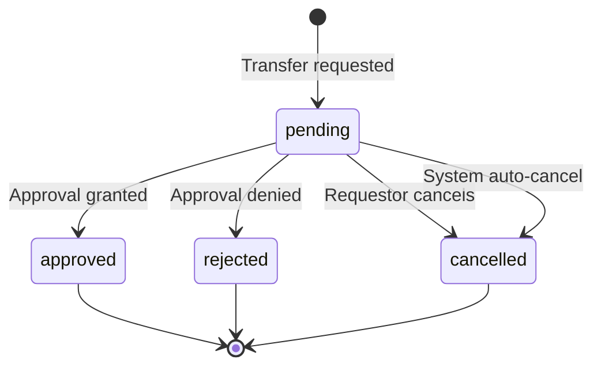

The CRM transfer system manages formal transfers of leads and deals between agents or teams, with comprehensive approval workflows, commission splitting, and integration with the broader stakeholder management system.

## Architecture overview

The CRM module follows a person-centric architecture with sophisticated transfer capabilities:

<Tabs>
<Tab title="Core design principles">
**Person + Contact model:**
- `Person` is the hidden identity layer (single source of truth for personal details)
- `Contact` is the business relationship layer (qualified customers)  
- `Lead` is the sales opportunity layer (unqualified inquiries)
- `Deal` links to `Contact`, not `Person` directly

**Unified stakeholder model:**
- Single table for assignment and commission across leads/deals
- Polymorphic patterns for notes, tags, and activities using entity_type/entity_id
- Channel separation with activity table indexing timeline
- Modular design with CRM core independent of Real Estate, Marketing, and Channels

**Transfer system integration:**
- Formal ownership transfer with sophisticated commission splitting
- Integrated approval workflow with configurable authorization
- Atomic operations ensuring data consistency during transfers
- Comprehensive audit trail for compliance reporting
</Tab>

<Tab title="Module boundaries">
```
┌─────────────────────────────────────────────────────────────────┐
│                         CRM CORE                                │
│  Person, Lead, Contact, Company, Deal, DealContact             │
│  person_email, person_phone, person_address, person_channel    │
│  person_not_duplicate, contact_company_role                    │
│  entity_stakeholder, entity_transfer, commission_payment       │
│  activity, note, task, event, tag                              │
└─────────────────────────────────────────────────────────────────┘
        │                    │                    │
        ▼                    ▼                    ▼
┌──────────────┐    ┌──────────────┐    ┌──────────────┐
│ REAL ESTATE  │    │  MARKETING   │    │   CHANNELS   │
│ development  │    │  campaign    │    │  whatsapp    │
│ unit         │    │  campaign_   │    │  instagram   │
│ site_visit   │    │  lead        │    │  (linked via │
│ lead_property│    │              │    │  person_     │
│ _interest    │    │              │    │  channel)    │
│ unit_owner-  │    │              │    │              │
│ ship→Contact │    │              │    │              │
└──────────────┘    └──────────────┘    └──────────────┘
```

**Real estate → CRM integration:**

| Real Estate Entity       | Links To     | Rationale                                           |
| ------------------------ | ------------ | --------------------------------------------------- |
| `unit_ownership`         | `contact_id` | Ownership is represented by the org's owner Contact |
| `unit_transaction`       | `person_id`  | Transaction party is an individual                  |
| `site_visit`             | `person_id`  | Who visited the property                            |
| `lead_property_interest` | `lead_id`    | Links to Lead for sales context                     |
| `deal_property_interest` | `deal_id`    | Links to Deal for transaction context               |
</Tab>

<Tab title="Transfer system overview">
**Entity transfers:**
- Formal ownership transfer of leads and deals between users or teams
- Integrated approval workflow with configurable authorization
- Commission splitting with percentage-based retention for transferor
- Atomic operations ensuring data consistency during transfers

**Polymorphic design:**
- Uses `entity_type` and `entity_id` pattern for flexible entity reference
- Supports both `lead` and `deal` transfers with unified logic
- Extensible architecture for future entity types

**Key principles:**
- Snapshot-based commission calculation prevents race conditions
- Auto-cancellation protection for invalid states
- History tracking for audit compliance
- Integration with broader stakeholder management system
</Tab>
</Tabs>

## CRM public IDs

All core CRM business records expose a stored `publicId` for user-facing references. The format is:

```
{ENTITY_CODE}-{ORG_PREFIX}-{SEQUENCE}
```

<Note>
Examples: `LEAD-ADNS-001`, `PERS-ADNS-001`, `CONT-ADNS-001`, `COMP-ADNS-001`, `DEAL-ADNS-001`, `COMM-ADNS-001`, `USER-ADNS-001`, `TEAM-ADNS-001`, `LSTG-ADNS-001`, `DSTG-ADNS-001`.
</Note>

<AccordionGroup>
<Accordion title="Public ID format and structure">
- Entity codes make IDs globally unique within an organization across CRM record types
- `ORG_PREFIX` is generated once from the organization's normalized alphanumeric name. Names of 4 characters or fewer use the whole normalized name (`WIK`); longer names use the first 2 and last 2 characters (`Adidas Operations` → `ADNS`, `Adidas` → `ADAS`)
- `SEQUENCE` is scoped by organization and entity type, padded to at least 3 digits, and not capped (`LEAD-ADNS-1000` is valid)
- IDs are allocated by `CrmPublicIdService` from `crm_public_id_counter` in the same transaction as entity creation
- Existing IDs do not change when the organization is renamed

**Entity codes:** Lead=`LEAD`, Person=`PERS`, Contact=`CONT`, Company=`COMP`, Deal=`DEAL`, CommissionPayment=`COMM`, organization user membership=`USER`, Team=`TEAM`, LeadStage=`LSTG`, DealStage=`DSTG`.
</Accordion>

<Accordion title="Special ID handling">
**Organization user memberships:**
- Also receive stable fallback avatar colors from the user sequence (`organization_users.avatar_bg_color` + `avatar_text_color`)
- The hue uses a golden-angle spread across a finite HSL palette
- Colors are display metadata and may repeat in very large organizations, while `public_id` remains the unique user-facing membership identifier

**Global system stages:**
- Exception to the org-sequence format: they have deterministic IDs based on `systemType`
- Examples: `LSTG-NEW`, `LSTG-DISQUALIFIED`, `DSTG-CLOSED-WON`
- Org-specific custom/override stages use the normal org-scoped sequence (`LSTG-ADNS-001`, `DSTG-ADNS-001`)
</Accordion>
</AccordionGroup>

## Transfer system implementation

The transfer system enables formal ownership transfers of leads and deals with sophisticated commission splitting and approval workflows.

### Entity transfer schema

The `entity_transfer` table manages transfer requests with comprehensive tracking and validation:

<AccordionGroup>
<Accordion title="Transfer entity structure">
```sql
entity_transfer
├── Entity reference:
│   ├── entity_type (lead | deal)
│   └── entity_id
├── Transfer parties:
│   ├── from_user_id (nullable), from_team_id (nullable)
│   └── to_user_id (nullable), to_team_id (nullable)
├── Commission handling:
│   ├── from_commission_total (snapshot of sender's commission at request time)
│   └── from_keeps_percentage (e.g., 30%)
├── Workflow tracking:
│   ├── status (pending, approved, rejected, cancelled)
│   ├── reason, reject_reason
│   ├── requested_by_id, requested_at
│   ├── approved_by, approved_at, rejected_by, rejected_at
│   ├── cancelled_at, cancel_reason, cancelled_by_system
├── Audit fields:
│   ├── created_at, updated_at
│   └── organization_id
└── Database constraints:
    ├── Unique partial index: (entity_type, entity_id) WHERE status = 'pending'
    ├── Check: Either from_user_id OR from_team_id (not both)
    ├── Check: Either to_user_id OR to_team_id (not both)
    ├── Check: from_keeps_percentage BETWEEN 0 AND 100
    └── Check: from_commission_total >= 0
```

**Polymorphic entity pattern:**
- `entity_type` + `entity_id` references any transferable entity
- Unified transfer logic works across leads and deals
- Future entity types (contacts, projects) can use same system
- Foreign key relationships maintained through application logic
</Accordion>

<Accordion title="Transfer workflow states">
**Status transitions:**



**Auto-cancellation triggers:**
- Entity deleted or archived
- Transferor loses stakeholder status
- Commission percentage changes significantly
- Entity status becomes non-transferable
</Accordion>

<Accordion title="Commission split mechanics">
**Calculation formula:**
```
to_commission = from_commission_total × (100% - from_keeps_percentage) / 100%
```

**Transfer scenarios:**
- 100% commission, 30% retention → 30% kept, 70% transferred
- 60% commission, 20% retention → 48% kept, 12% transferred  
- 50% commission, 0% retention → 0% kept, 50% transferred (primary status only)

**Primary stakeholder rules:**
- 0% retention → Primary status transfers to recipient
- >0% retention → Primary status remains with transferor (unless recipient has higher commission)
- Commission amounts rounded to 2 decimal places for consistency
- Total stakeholder commission cannot exceed 100%
</Accordion>
</AccordionGroup>

### Transfer execution workflow

<Tabs>
<Tab title="Pre-execution validation">
<Warning>
**Transfer eligibility validation:**
- Cannot transfer to self (same user or team)
- Must have valid from/to targets (user or team, not both)
- Transferor must be current stakeholder with sufficient commission
- Entity must be in transferable status (active lead/deal)
- All parties must be in same organization
- No existing pending transfers for the entity
- Entity type must support transfers (leads and deals only)
</Warning>

```javascript
const validateTransferEligibility = async (transferRequest) => {
  const { entityType, entityId, fromUserId, toUserId, fromKeepsPercentage } = transferRequest;
  
  // Check self-transfer
  if (fromUserId === toUserId) {
    throw new ValidationError('Cannot transfer to yourself');
  }
  
  // Validate entity type
  if (!['lead', 'deal'].includes(entityType)) {
    throw new ValidationError('Only leads and deals can be transferred');
  }
  
  // Check existing pending transfers
  const existingPending = await EntityTransfer.findOne({
    where: { 
      entity_type: entityType, 
      entity_id: entityId, 
      status: 'pending' 
    }
  });
  
  if (existingPending) {
    throw new ValidationError('Entity already has a pending transfer');
  }
  
  // Validate stakeholder status and commission
  const fromStakeholder = await EntityStakeholder.findOne({
    where: { 
      entity_type: entityType, 
      entity_id: entityId, 
      user_id: fromUserId,
      status: 'active'
    }
  });
  
  if (!fromStakeholder || fromStakeholder.commission_percentage === 0) {
    throw new ValidationError('Transferor must have commission stake in entity');
  }
  
  return true;
};
```
</Tab>

<Tab title="Atomic execution">
**Transfer approval transaction:**

```sql
BEGIN;
  -- 1. Update transferor stakeholder
  UPDATE entity_stakeholder 
  SET 
    commission_percentage = :from_commission_total * :from_keeps_percentage / 100,
    is_primary = CASE WHEN :from_keeps_percentage = 0 THEN false ELSE is_primary END,
    updated_at = NOW()
  WHERE entity_type = :entity_type 
    AND entity_id = :entity_id 
    AND user_id = :from_user_id;
    
  -- 2. Create or update recipient stakeholder
  INSERT INTO entity_stakeholder (
    entity_type, entity_id, user_id, commission_percentage, 
    is_primary, role, status, assigned_at, assigned_by_id, organization_id
  ) VALUES (
    :entity_type, :entity_id, :to_user_id,
    :from_commission_total * (100 - :from_keeps_percentage) / 100,
    CASE WHEN :from_keeps_percentage = 0 THEN true ELSE false END,
    'owner', 'active', NOW(), :approved_by_id, :organization_id
  )
  ON CONFLICT (entity_type, entity_id, user_id) 
  DO UPDATE SET 
    commission_percentage = commission_percentage + EXCLUDED.commission_percentage,
    is_primary = CASE 
      WHEN EXCLUDED.commission_percentage > entity_stakeholder.commission_percentage 
      THEN EXCLUDED.is_primary 
      ELSE entity_stakeholder.is_primary 
    END;
    
  -- 3. Update transfer status
  UPDATE entity_transfer 
  SET 
    status = 'approved',
    approved_by = :approved_by_id,
    approved_at = NOW(),
    updated_at = NOW()
  WHERE id = :transfer_id;
  
COMMIT;
```

<Info>
The atomic transaction ensures either complete success or complete rollback. No partial states are possible, maintaining data integrity even during system failures.
</Info>
</Tab>

<Tab title="Post-execution integration">
**System integration updates:**

```javascript
const executePostTransferIntegration = async (transfer) => {
  // 1. Update commission payments for closed deals
  if (transfer.entity_type === 'deal') {
    await CommissionPaymentService.recalculateForEntity('deal', transfer.entity_id, {
      reason: `Transfer approved: ${transfer.id}`,
      recalculated_by: transfer.approved_by
    });
  }
  
  // 2. Create activity record
  await Activity.create({
    entity_type: transfer.entity_type,
    entity_id: transfer.entity_id,
    activity_type: 'transfer',
    activity_subtype: 'approved',
    subject: `Ownership transferred`,
    description: `Transfer approved. Commission split: ${transfer.from_keeps_percentage}% retained, ${100 - transfer.from_keeps_percentage}% transferred.`,
    created_by: transfer.approved_by,
    activity_data: {
      transfer_id: transfer.id,
      commission_split: {
        from_keeps: transfer.from_keeps_percentage,
        to_receives: 100 - transfer.from_keeps_percentage,
        total_amount: transfer.from_commission_total
      }
    }
  });
  
  // 3. Update entity assignment if primary stakeholder changed
  if (transfer.from_keeps_percentage === 0) {
    const entity = await getEntity(transfer.entity_type, transfer.entity_id);
    await entity.update({
      assigned_to_id: transfer.to_user_id,
      assigned_at: new Date(),
      assigned_by_id: transfer.approved_by
    });
  }
  
  // 4. Send notifications
  await notifyTransferCompletion(transfer);
};
```
</Tab>
</Tabs>

### Transfer approval system

<AccordionGroup>
<Accordion title="Approval authority levels">
**Authorization hierarchy:**

```javascript
const getRequiredApprovalLevel = (entityType, entityValue, commissionTransferred) => {
  // High-value transfers require senior approval
  if (entityType === 'deal' && entityValue > 500000) {
    return 'senior_manager';
  }
  
  // Large commission transfers require manager approval
  if (commissionTransferred > 10000) {
    return 'manager';
  }
  
  // Cross-team transfers require team lead approval
  return 'team_lead';
};

const validateTransferApprovalAuthority = async (approverId, requiredLevel) => {
  const approver = await User.findById(approverId, {
    include: [{ model: Role, include: [Permission] }]
  });
  
  const approvalLevels = {
    'team_lead': 1,
    'manager': 2,
    'senior_manager': 3
  };
  
  const approverLevel = approver.roles.reduce((maxLevel, role) => {
    if (role.permissions.some(p => p.name.startsWith('transfer.approve'))) {
      const roleLevel = approvalLevels[role.name] || 0;
      return Math.max(maxLevel, roleLevel);
    }
    return maxLevel;
  }, 0);
  
  const requiredLevelValue = approvalLevels[requiredLevel];
  
  if (approverLevel < requiredLevelValue) {
    throw new AuthorizationError(`Insufficient approval authority for ${requiredLevel} transfer`);
  }
  
  return true;
};
```
</Accordion>

<Accordion title="Business rules and constraints">
**Transfer validation rules:**

```javascript
const validateTransferBusinessRules = async (entityType, entityId, transferRequest) => {
  // Rule 1: Entity must be in transferable state
  const entity = await getEntity(entityType, entityId);
  const nonTransferableStates = {
    lead: ['archived', 'converted', 'deleted'],
    deal: ['won', 'lost', 'cancelled', 'closed']
  };
  
  if (nonTransferableStates[entityType].includes(entity.status)) {
    throw new BusinessRuleError(`Cannot transfer ${entityType} in ${entity.status} state`);
  }
  
  // Rule 2: Maximum transfer frequency (prevents abuse)
  const recentTransfers = await EntityTransfer.count({
    where: {
      entity_type: entityType,
      entity_id: entityId,
      status: 'approved',
      approved_at: { [Op.gte]: new Date(Date.now() - 30 * 24 * 60 * 60 * 1000) }
    }
  });
  
  if (recentTransfers >= 3) {
    throw new BusinessRuleError('Maximum transfer frequency exceeded (3 per month)');
  }
  
  // Rule 3: Commission retention limits
  if (transferRequest.from_keeps_percentage > 75) {
    throw new BusinessRuleError('Maximum commission retention is 75%');
  }
  
  return true;
};
```
</Accordion>
</AccordionGroup>

## Stakeholder management integration

<AccordionGroup>
<Accordion title="Entity stakeholder model">
**Purpose**: Unified stakeholder and commission management across leads/deals.

```
entity_stakeholder
├── Entity Reference:
│   ├── entity_type (lead | deal)
│   └── entity_id
├── Stakeholder Identity:
│   ├── user_id (nullable)
│   └── team_id (nullable) [Future: team-based assignments]
├── Commission & Role:
│   ├── commission_percentage (0-100)
│   ├── role (owner, collaborator, observer)
│   ├── is_primary (boolean - main responsible party)
│   └── commission_basis (percentage, fixed_amount, hybrid)
├── Assignment Tracking:
│   ├── assigned_at, assigned_by_id
│   ├── status (active, inactive, transferred)
│   └── assignment_notes
├── Payment Details:
│   ├── payment_schedule (immediate, monthly, quarterly, deal_close)
│   ├── payment_terms
│   └── payment_account_id
└── Audit: organization_id, created_at, updated_at
```

**Transfer-stakeholder integration:**
- Transfers modify existing stakeholder records atomically
- Commission redistribution maintains total ≤ 100% constraint
- Primary stakeholder designation transfers based on commission amounts
- History tracking preserves audit trail for compliance
</Accordion>

<Accordion title="Stakeholder history tracking">
**Purpose**: Audit trail for all stakeholder changes including transfers.

```
entity_stakeholder_history
├── stakeholder_id → EntityStakeholder
├── action (created, updated, transferred_in, transferred_out, removed)
├── old_values, new_values (JSONB - what changed)
├── changed_by → User (who made the change)
├── changed_at (timestamp)
├── change_reason (text description)
└── organization_id
```

**Transfer-specific history events:**
- `transferred_out`: Records commission reduction for transferor
- `transferred_in`: Records commission increase for recipient
- `primary_transferred`: Records primary stakeholder status changes
- Full before/after state captured in JSONB for detailed auditing
</Accordion>
</AccordionGroup>

## Commission payment integration

<AccordionGroup>
<Accordion title="Commission recalculation">
**Automatic payment updates:**

```javascript
const recalculateCommissionPayments = async (dealId, transferId) => {
  const deal = await Deal.findById(dealId);
  
  if (deal.status !== 'won') {
    return; // Only calculate for won deals
  }
  
  // Get current stakeholders after transfer
  const stakeholders = await EntityStakeholder.findAll({
    where: { 
      entity_type: 'deal', 
      entity_id: dealId, 
      status: 'active' 
    }
  });
  
  // Cancel existing pending payments
  await CommissionPayment.update(
    { status: 'cancelled', cancelled_reason: `Transfer ${transferId} - recalculation` },
    { where: { source_entity_type: 'deal', source_entity_id: dealId, status: 'pending' } }
  );
  
  // Create new payments based on updated stakeholder percentages
  const newPayments = stakeholders.map(stakeholder => ({
    stakeholder_id: stakeholder.id,
    amount: deal.value * (stakeholder.commission_percentage / 100),
    currency: deal.currency,
    payment_schedule: stakeholder.payment_schedule || 'deal_close',
    source_entity_type: 'deal',
    source_entity_id: dealId,
    status: 'pending',
    calculation_note: `Recalculated after transfer ${transferId}`
  }));
  
  await CommissionPayment.bulkCreate(newPayments);
  
  return newPayments;
};
```
</Accordion>

<Accordion title="Payment schedule handling">
**Schedule preservation during transfers:**

- Existing payment schedules honored for retained commission
- New stakeholders inherit default schedule or custom settings
- Payment timing remains consistent across transfer operations
- Prorated payments for mid-cycle transfers when applicable

```javascript
const handleMidCycleTransfer = async (transfer, existingPayments) => {
  const currentDate = new Date();
  const dealCloseDate = await getDealCloseDate(transfer.entity_id);
  
  if (transfer.entity_type === 'deal' && existingPayments.length > 0) {
    // Calculate prorated amounts for in-progress payment cycles
    const daysSinceClose = Math.floor((currentDate - dealCloseDate) / (1000 * 60 * 60 * 24));
    const proratingRequired = daysSinceClose > 0 && daysSinceClose < 90; // 90-day payment cycle
    
    if (proratingRequired) {
      await createProratedPaymentAdjustments(transfer, existingPayments, daysSinceClose);
    }
  }
};
```
</Accordion>
</AccordionGroup>

## Transfer analytics and reporting

<AccordionGroup>
<Accordion title="Entity transfer history queries">
**Complete transfer history for an entity:**

```sql
-- Get all transfers for a specific entity with participant details
SELECT 
  et.*,
  from_user.first_name || ' ' || from_user.last_name AS from_user_name,
  to_user.first_name || ' ' || to_user.last_name AS to_user_name,
  approver.first_name || ' ' || approver.last_name AS approver_name,
  requester.first_name || ' ' || requester.last_name AS requester_name
FROM entity_transfer et
LEFT JOIN users from_user ON et.from_user_id = from_user.id
LEFT JOIN users to_user ON et.to_user_id = to_user.id  
LEFT JOIN users approver ON et.approved_by = approver.id
LEFT JOIN users requester ON et.requested_by_id = requester.id
WHERE et.entity_type = 'deal' AND et.entity_id = 123
ORDER BY et.created_at DESC;

-- Transfer analytics for entity
SELECT 
  COUNT(*) as total_transfers,
  COUNT(CASE WHEN status = 'approved' THEN 1 END) as approved_count,
  COUNT(CASE WHEN status = 'cancelled' THEN 1 END) as cancelled_count,
  AVG(CASE 
    WHEN status = 'approved' 
    THEN EXTRACT(EPOCH FROM (approved_at - requested_at))/3600 
  END) as avg_approval_time_hours,
  SUM(CASE 
    WHEN status = 'approved' 
    THEN from_commission_total * (100 - from_keeps_percentage) / 100 
  END) as total_commission_transferred
FROM entity_transfer 
WHERE entity_type = 'deal' AND entity_id = 123;
```
</Accordion>

<Accordion title="Organizational transfer metrics">
**Organization-wide transfer analytics and trends:**

```sql
-- Transfer volume and approval rates by month
SELECT 
  DATE_TRUNC('month', et.created_at) as month,
  et.entity_type,
  COUNT(*) as total_requests,
  COUNT(CASE WHEN status = 'approved' THEN 1 END) as approved,
  COUNT(CASE WHEN status = 'rejected' THEN 1 END) as rejected,
  COUNT(CASE WHEN status = 'cancelled' THEN 1 END) as cancelled,
  ROUND(
    COUNT(CASE WHEN status = 'approved' THEN 1 END) * 100.0 / COUNT(*), 2
  ) as approval_rate_percent
FROM entity_transfer et
WHERE et.organization_id = :organizationId
  AND et.created_at >= CURRENT_DATE - INTERVAL '12 months'
GROUP BY DATE_TRUNC('month', et.created_at), et.entity_type
ORDER BY month DESC, et.entity_type;

-- High-value transfer monitoring
SELECT 
  et.*,
  CASE et.entity_type 
    WHEN 'deal' THEN d.value 
    ELSE 0 
  END as entity_value,
  et.from_commission_total * (100 - et.from_keeps_percentage) / 100 as commission_transferred,
  (CASE et.entity_type WHEN 'deal' THEN d.value ELSE 0 END) * 
  (et.from_commission_total * (100 - et.from_keeps_percentage) / 100) / 100 as dollar_value_transferred
FROM entity_transfer et
LEFT JOIN deals d ON et.entity_type = 'deal' AND et.entity_id = d.id
WHERE et.status = 'approved'
  AND et.organization_id = :organizationId
  AND (
    (et.entity_type = 'deal' AND d.value > 100000) OR
    (et.from_commission_total * (100 - et.from_keeps_percentage) / 100 > 50)
  )
ORDER BY dollar_value_transferred DESC;
```
</Accordion>

<Accordion title="Transfer performance analytics">
**User and team transfer patterns:**

```sql
-- User transfer activity (giving vs receiving)
SELECT 
  u.id as user_id,
  u.first_name || ' ' || u.last_name as user_name,
  
  -- Outgoing transfers
  COUNT(CASE WHEN et.from_user_id = u.id THEN 1 END) as transfers_given,
  SUM(CASE WHEN et.from_user_id = u.id AND et.status = 'approved'
           THEN et.from_commission_total * (100 - et.from_keeps_percentage) / 100 END) as commission_given,
  
  -- Incoming transfers  
  COUNT(CASE WHEN et.to_user_id = u.id THEN 1 END) as transfers_received,
  SUM(CASE WHEN et.to_user_id = u.id AND et.status = 'approved'
           THEN et.from_commission_total * (100 - et.from_keeps_percentage) / 100 END) as commission_received,
           
  -- Net commission flow
  (COALESCE(SUM(CASE WHEN et.to_user_id = u.id AND et.status = 'approved'
                     THEN et.from_commission_total * (100 - et.from_keeps_percentage) / 100 END), 0) -
   COALESCE(SUM(CASE WHEN et.from_user_id = u.id AND et.status = 'approved'
                     THEN et.from_commission_total * (100 - et.from_keeps_percentage) / 100 END), 0)) as net_commission_flow
                     
FROM users u
LEFT JOIN entity_transfer et ON (et.from_user_id = u.id OR et.to_user_id = u.id)
WHERE u.organization_id = :organizationId
  AND et.created_at >= CURRENT_DATE - INTERVAL '6 months'
GROUP BY u.id, u.first_name, u.last_name
HAVING COUNT(et.id) > 0
ORDER BY transfers_given + transfers_received DESC;
```
</Accordion>
</AccordionGroup>

## Data consistency and reliability

<AccordionGroup>
<Accordion title="Transaction isolation patterns">
**Concurrent operation safety:**

```javascript
// Transfer approval with isolation level
const approveTransfer = async (transferId, approverId) => {
  return await db.transaction(
    async (t) => {
      const transfer = await EntityTransfer.findById(transferId, {
        lock: t.LOCK.UPDATE, // Row-level lock
        transaction: t
      });
      
      if (transfer.status !== 'pending') {
        throw new ConcurrencyError('Transfer no longer in pending state');
      }
      
      // Validate current stakeholder state hasn't changed
      const currentStakeholder = await EntityStakeholder.findOne({
        where: {
          entity_type: transfer.entity_type,
          entity_id: transfer.entity_id,
          user_id: transfer.from_user_id,
          status: 'active'
        },
        lock: t.LOCK.UPDATE,
        transaction: t
      });
      
      if (!currentStakeholder || 
          currentStakeholder.commission_percentage < transfer.from_commission_total) {
        throw new BusinessRuleError('Stakeholder commission changed during transfer');
      }
      
      // Execute transfer atomically
      await executeStakeholderUpdates(transfer, t);
      await updateTransferStatus(transfer, approverId, t);
      
      return transfer;
    },
    {
      isolationLevel: Transaction.ISOLATION_LEVELS.READ_COMMITTED,
      retry: { max: 3, backoff: 'exponential' }
    }
  );
};
```
</Accordion>

<Accordion title="Data integrity constraints">
**Database-level integrity enforcement:**

```sql
-- Commission total constraint trigger
CREATE OR REPLACE FUNCTION validate_total_commission()
RETURNS TRIGGER AS $$
DECLARE
  total_commission DECIMAL;
BEGIN
  -- Calculate total commission for entity after this operation
  SELECT COALESCE(SUM(commission_percentage), 0)
  INTO total_commission
  FROM entity_stakeholder
  WHERE entity_type = NEW.entity_type
    AND entity_id = NEW.entity_id
    AND status = 'active'
    AND id != COALESCE(OLD.id, -1); -- Exclude old record for updates
    
  -- Add the new/updated record's commission
  total_commission := total_commission + NEW.commission_percentage;
  
  IF total_commission > 100 THEN
    RAISE EXCEPTION 'Total commission cannot exceed 100%%. Current total would be: %%', total_commission;
  END IF;
  
  RETURN NEW;
END;
$$ LANGUAGE plpgsql;

-- Apply trigger to stakeholder table
CREATE TRIGGER validate_commission_total
  BEFORE INSERT OR UPDATE ON entity_stakeholder
  FOR EACH ROW EXECUTE FUNCTION validate_total_commission();

-- Primary stakeholder uniqueness constraint
CREATE UNIQUE INDEX CONCURRENTLY idx_entity_stakeholder_primary
ON entity_stakeholder (entity_type, entity_id)
WHERE is_primary = true AND status = 'active';
```
</Accordion>

<Accordion title="Recovery and rollback procedures">
**Transfer reversal capabilities:**

```javascript
const reverseTransfer = async (transferId, reversalReason, reversedBy) => {
  return await db.transaction(async (t) => {
    const transfer = await EntityTransfer.findById(transferId, { transaction: t });
    
    if (transfer.status !== 'approved') {
      throw new BusinessRuleError('Can only reverse approved transfers');
    }
    
    // Check reversal eligibility (time limits, entity status, etc.)
    const daysSinceApproval = (new Date() - transfer.approved_at) / (1000 * 60 * 60 * 24);
    if (daysSinceApproval > 30) {
      throw new BusinessRuleError('Cannot reverse transfers older than 30 days');
    }
    
    // Reverse stakeholder changes
    await reverseStakeholderChanges(transfer, t);
    
    // Create reversal record
    await EntityTransferReversal.create({
      original_transfer_id: transferId,
      reversal_reason: reversalReason,
      reversed_by: reversedBy,
      reversed_at: new Date()
    }, { transaction: t });
    
    // Update transfer status
    await transfer.update({
      status: 'reversed',
      reversed_at: new Date(),
      reversed_by: reversedBy,
      reversal_reason: reversalReason
    }, { transaction: t });
    
    return transfer;
  });
};
```
</Accordion>
</AccordionGroup>

<CardGroup cols={2}>
  <Card
    title="Stakeholder API reference"
    icon="users"
    href="/backend/stakeholder-api"
  >
    Complete stakeholder management and commission tracking endpoints.
  </Card>
  <Card
    title="Entity management"
    icon="diagram-project"
    href="/backend/entity-management"
  >
    Core entity operations including leads, contacts, and deals.
  </Card>
  <Card
    title="Commission system"
    icon="money-bill-transfer"
    href="/backend/commission-system"
  >
    Commission calculation and payment processing system.
  </Card>
  <Card
    title="Activity system"
    icon="clock"
    href="/backend/activity-system"
  >
    Unified activity tracking and communication management.
  </Card>
</CardGroup>