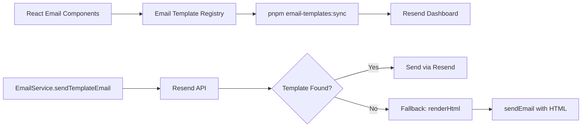

## Overview

PropWise transactional emails are authored as **React Email components** and uploaded to **Resend** as managed templates. At send-time the backend calls Resend by template alias with variable values. If a template is accidentally deleted or hasn't been synced yet, the email falls back to in-app rendering (same React component, rendered server-side) so no email is ever silently dropped.

<Note>
The system is **not database-backed**: there is no active `email_template` table in the runtime schema. The source of truth is `src/emails/email-template.registry.tsx` plus the corresponding templates in Resend.
</Note>

---

## Architecture

The email system follows a clear pipeline from React components through the registry to Resend:



<Info>
Non-engineers can edit email content directly in the Resend dashboard. The React components serve as the initial template source and fallback renderer.
</Info>

### Key files

<AccordionGroup>
  <Accordion title="Core System Files">
    | File | Role |
    | --- | --- |
    | `src/emails/email-template.types.ts` | `EmailTemplateDescriptor<V>` interface |
    | `src/emails/email-template.registry.tsx` | Single source of truth — all templates with stable aliases |
    | `src/services/email.service.ts` | `sendEmail()` + `sendTemplateEmail()` + `dispatch()` |
    | `src/modules/notification/channels/email.channel.ts` | `EmailChannel` — routes notification types to templates, builds action buttons HTML |
  </Accordion>

  <Accordion title="Shared Components & Styles">
    | File | Role |
    | --- | --- |
    | `src/emails/components/email-layout.tsx` | Shared wrapper (`variant`: `app` \| `developer`) |
    | `src/emails/components/email-logo-mark.tsx` | Logo tile linked to `https://propwise.com` (public HTTPS PNG; matches CRM / developer portal auth UI) |
    | `src/emails/components/propwise-brand-text.tsx` | `PropwiseBrand` — renders "Propwise" in the layout variant accent color (`#2A54CF` app, `#316337` developer) |
    | `src/emails/email-assets.constants.ts` | `R2_PUBLIC_BASE_URL` + `/email-templates/*.png` logo URL resolution (R2-only; no frontend fallback) |
    | `src/emails/email-brand-tokens.ts` | Light-mode hex tokens for inline email CSS |
    | `src/emails/email-content-styles.ts` | Shared heading/body/CTA styles per variant |
  </Accordion>

  <Accordion title="Template & Testing Files">
    | File | Role |
    | --- | --- |
    | `src/emails/templates/*.tsx` | Individual email components |
    | `src/emails/email-template.registry.spec.ts` | CI contract test — enforces variable coverage |
    | `src/modules/notification/utils/entity-route.util.ts` | `resolveEntityUrl()` — maps entity type + payload to absolute deep links |
    | `scripts/sync-email-templates.ts` | Upload logos to R2 + upload templates to Resend (create-only by default; `--force` upserts; `--prod` targets prod CDN) |
  </Accordion>
</AccordionGroup>

<Warning>
`src/modules/notification/utils/entity-route.util.ts` **must be kept in sync with the frontend counterpart** (`notification-utils.ts`) to ensure deep links resolve correctly.
</Warning>

---

## Registered Templates

### Auth & Invitation Templates

These templates handle user authentication flows and organization invitations:

| Key | Alias | Subject | Variables |
| --- | --- | --- | --- |
| `VERIFY_EMAIL` | `propwise-verify-email` | Verify Your Email | `CODE` |
| `RESET_PASSWORD` | `propwise-reset-password` | Reset Your Password | `RESET_LINK` |
| `ORG_INVITE` | `propwise-org-invite` | Join an Organization on Propwise | `INVITER_NAME`, `ORG_NAME`, `ROLE`, `INVITE_URL`, `EXPIRES_AT` |
| `ORG_INVITE_EXISTING` | `propwise-org-invite-existing` | Join Another Organization on Propwise | `INVITEE_NAME`, `INVITER_NAME`, `ORG_NAME`, `ROLE`, `INVITE_URL`, `EXPIRES_AT` |
| `DEV_VERIFY_EMAIL` | `propwise-dev-verify-email` | Verify Your Email – PropWise Developer Portal | `CODE`, `EXPIRY_MINUTES` |
| `DEV_CONFIRM_EMAIL` | `propwise-dev-confirm-email` | Confirm Your New Email – PropWise Developer Portal | `CODE`, `EXPIRY_MINUTES` |
| `DEV_RESET_PASSWORD` | `propwise-dev-reset-password` | Reset Your Password – PropWise Developer Portal | `RESET_LINK`, `EXPIRY_MINUTES` |

### Notification Templates

Notification templates power the event-driven email system:

| Key | Alias | When used | Variables |
| --- | --- | --- | --- |
| `NOTIFICATION` | `propwise-notification` | All notification types **not** covered by a bespoke template below | `PREVIEW`, `TITLE`, `MESSAGE`, `ACTIONS_HTML` |
| `DEAL_WON` | `propwise-deal-won` | `deal_won` | `PREVIEW`, `TITLE`, `MESSAGE`, `DEAL_NAME`, `DEAL_VALUE`, `DEAL_LINK` |
| `TRANSFER_REQUEST` | `propwise-transfer-request` | `transfer_requested`, `transfer_approved`, `transfer_rejected`, `transfer_cancelled`, `transfer_accepted_team_member` | `PREVIEW`, `TITLE`, `MESSAGE`, `ENTITY_TYPE_LABEL`, `ENTITY_NAME`, `ENTITY_LINK`, `REQUESTER_NAME` |
| `COMMISSION_PAYMENT` | `propwise-commission-payment` | All `commission_payment_*` and `commission_feedback_*` types | `PREVIEW`, `TITLE`, `MESSAGE`, `PAYMENT_STATUS_LABEL`, `PAYMENT_STATUS_BG`, `PAYMENT_STATUS_COLOR`, `PAYMENT_AMOUNT`, `DEAL_NAME`, `PAYMENT_LINK` |
| `EVENT_INVITE` | `propwise-event-invite` | `event_invited`, `event_invitee_rsvp_changed`, `event_reminder` | `PREVIEW`, `TITLE`, `MESSAGE`, `EVENT_NAME`, `EVENT_DATE`, `EVENT_TIME`, `EVENT_LOCATION`, `INVITER_NAME`, `EVENT_LINK` |

<Tip>
The `NOTIFICATION` template serves as a catch-all for any notification type that doesn't have a specialized template, ensuring no notification is ever dropped.
</Tip>

---

## Bespoke Template Payload Contracts

Each bespoke sender (`sendDealWonEmail`, `sendTransferEmail`, `sendCommissionPaymentEmail`, `sendEventInviteEmail`) reads specific keys from the stored notification `payload`.

<Note>
**The keys below are what listeners must emit; the email channel maps them to template variables.**
</Note>

### Deal Won Template

| Template Variable | Payload Key(s) Read (left-to-right preference) | Notes |
| --- | --- | --- |
| `DEAL_NAME` | `dealTitle` → `dealName` | Listeners emit `dealTitle` |
| `DEAL_LINK` | `entityId` → `dealId` | Listeners emit `entityId` |
| `DEAL_VALUE` | `dealValue` | Not emitted by any listener yet — renders empty until `DealWonEvent.metadata` is extended with a deal amount field |

### Transfer Request Template

| Template Variable | Payload Key(s) Read (left-to-right preference) | Notes |
| --- | --- | --- |
| `ENTITY_NAME` | `entityTitle` → `entityName` | All transfer listeners emit `entityTitle` |
| `REQUESTER_NAME` | `requestedByName` → `approverName` → `rejecterName` → `cancelledByName` → `userName` | Coalesced across all five transfer sub-types |

### Commission Payment Template

| Template Variable | Payload Key(s) Read (left-to-right preference) | Notes |
| --- | --- | --- |
| `PAYMENT_STATUS_LABEL/BG/COLOR` | `newStatus` → type-derived fallback | Status-change listeners emit `newStatus`; `COMMISSION_PAYMENT_CREATED` has no status field, so `'CREATED'` is derived from `event.type` via `COMMISSION_STATUS_FROM_TYPE` |
| `PAYMENT_AMOUNT` | `amount` (number) → `paymentAmount` (string) | Listeners emit `amount` as a number; channel converts to string |

### Event Invite Template

| Template Variable | Payload Key(s) Read | Notes |
| --- | --- | --- |
| `EVENT_NAME` | `eventName` → `eventTitle` | Standard event field mapping |
| `EVENT_DATE` | `eventDate` → `startDate` | Formatted for display |
| `EVENT_TIME` | `eventTime` → `startTime` | Formatted for display |
| `EVENT_LOCATION` | `eventLocation` → `location` | Optional field |
| `INVITER_NAME` | `inviterName` → `invitedByName` | Person who created the invitation |

---

## Syncing Templates to Resend

<Steps>
  <Step title="Install dependencies">
    Ensure you have the latest dependencies installed:
    
    ```bash
    pnpm install
    ```
  </Step>

  <Step title="Run the sync script">
    Upload logos to R2 and templates to Resend:
    
    <Tabs>
      <Tab title="Development">
        ```bash
        pnpm email-templates:sync
        ```
        
        Creates new templates in Resend (skips existing ones).
      </Tab>
      
      <Tab title="Force Update">
        ```bash
        pnpm email-templates:sync --force
        ```
        
        Upserts all templates, overwriting existing ones in Resend.
      </Tab>
      
      <Tab title="Production">
        ```bash
        pnpm email-templates:sync --prod
        ```
        
        Targets the production CDN for asset URLs.
      </Tab>
    </Tabs>
  </Step>

  <Step title="Verify in Resend">
    Log into the [Resend dashboard](https://resend.com) and confirm templates appear with the correct aliases and preview content.
  </Step>
</Steps>

<Warning>
By default, the sync script creates new templates only. Use `--force` carefully in production to avoid overwriting manual edits made in the Resend dashboard.
</Warning>

---

## Fallback Rendering

If a template is not found in Resend (deleted or not yet synced), the system automatically falls back to server-side rendering:

```typescript
// Simplified flow in EmailService
async sendTemplateEmail(alias: string, variables: Record<string, any>) {
  try {
    // Try Resend first
    await resend.emails.send({
      to: recipient,
      from: sender,
      template: alias,
      variables
    });
  } catch (error) {
    if (isTemplateNotFoundError(error)) {
      // Fallback: render the same React component server-side
      const descriptor = REGISTRY[alias];
      const html = descriptor.renderHtml(variables);
      await this.sendEmail({
        to: recipient,
        subject: descriptor.subject,
        html
      });
    } else {
      throw error;
    }
  }
}
```

<Check>
This fallback mechanism ensures **no email is ever silently dropped** due to template synchronization issues.
</Check>

---

## Contract Testing

The registry includes a comprehensive spec file that enforces variable coverage:

```typescript
// src/emails/email-template.registry.spec.ts
describe('Email Template Registry', () => {
  it('should have all required variables defined', () => {
    // Validates that every template declares its variables
  });
  
  it('should render without errors for all templates', () => {
    // Smoke test: render each template with mock data
  });
});
```

<Info>
These tests run in CI to catch breaking changes before they reach production.
</Info>

---

## Best Practices

<CardGroup cols={2}>
  <Card title="Use Stable Aliases" icon="link">
    Never change a template alias once deployed. Create a new template with a new alias if significant changes are needed.
  </Card>
  
  <Card title="Test Fallback Rendering" icon="rotate">
    Periodically test that templates render correctly via the fallback path by temporarily "breaking" the Resend alias.
  </Card>
  
  <Card title="Document Variables" icon="brackets-curly">
    All template variables must be documented in the registry and this page. Update both when adding new variables.
  </Card>
  
  <Card title="Sync Before Deploy" icon="cloud-arrow-up">
    Always run `pnpm email-templates:sync` before deploying code that references new templates or variables.
  </Card>
</CardGroup>

---

## Common Issues

<AccordionGroup>
  <Accordion title="Template not found in Resend">
    **Cause:** Template hasn't been synced yet or was manually deleted.
    
    **Solution:** Run `pnpm email-templates:sync` or `pnpm email-templates:sync --force` to recreate.
    
    **Expected behavior:** Email falls back to server-side rendering automatically.
  </Accordion>

  <Accordion title="Variables not populating">
    **Cause:** Variable names in Resend don't match registry descriptor.
    
    **Solution:** Check the template alias matches between registry and Resend. Re-sync with `--force` if needed.
    
    **Debug:** Check logs for the exact variables being passed vs. what the template expects.
  </Accordion>

  <Accordion title="Logo images not loading">
    **Cause:** R2 assets not uploaded or incorrect base URL.
    
    **Solution:** Verify `R2_PUBLIC_BASE_URL` environment variable. Re-run sync script with `--prod` for production.
    
    **Note:** Email logo assets are R2-only; there is no frontend fallback.
  </Accordion>

  <Accordion title="Deep links resolve to 404">
    **Cause:** `entity-route.util.ts` out of sync with frontend routing.
    
    **Solution:** Review and synchronize both backend `resolveEntityUrl()` and frontend `notification-utils.ts`.
    
    **Prevention:** Add integration tests that verify deep link resolution for each entity type.
  </Accordion>
</AccordionGroup>

---

## Related Resources

<CardGroup cols={2}>
  <Card title="Notification System" icon="bell" href="/backend/notifications/overview">
    Learn how notifications trigger emails via the email channel
  </Card>
  
  <Card title="Event System" icon="calendar" href="/backend/events/overview">
    Understand the event-driven architecture that powers notifications
  </Card>
  
  <Card title="Resend Documentation" icon="arrow-up-right-from-square" href="https://resend.com/docs">
    Official Resend API reference and guides
  </Card>
  
  <Card title="React Email" icon="arrow-up-right-from-square" href="https://react.email">
    Framework for building email templates with React
  </Card>
</CardGroup>