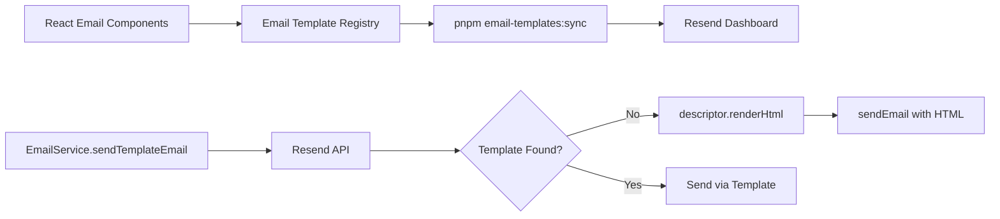

## Overview

PropWise transactional emails are authored as **React Email components** and uploaded to **Resend** as managed templates. At send-time the backend calls Resend by template alias with variable values. If a template is accidentally deleted or hasn't been synced yet, the email falls back to in-app rendering (same React component, rendered server-side) so no email is ever silently dropped.

<Note>
The system is **not database-backed**: there is no active `email_template` table in the runtime schema. The source of truth is `src/emails/email-template.registry.tsx` plus the corresponding templates in Resend.
</Note>

## Architecture

The email template system follows a React-to-Resend pipeline with automatic fallback:



<Tabs>
  <Tab title="Development Flow">
    1. Author React Email components in `src/emails/templates/`
    2. Register templates in `email-template.registry.tsx`
    3. Run `pnpm email-templates:sync` to upload to Resend
    4. Non-engineers can edit content in Resend dashboard
  </Tab>
  <Tab title="Runtime Flow">
    1. `EmailService.sendTemplateEmail()` calls Resend API by alias
    2. If template not found, falls back to server-side rendering
    3. No emails are ever silently dropped
  </Tab>
</Tabs>

## Key Files

<AccordionGroup>
  <Accordion title="Core System Files">
    | File | Role |
    |------|------|
    | `src/emails/email-template.types.ts` | `EmailTemplateDescriptor<V>` interface |
    | `src/emails/email-template.registry.tsx` | Single source of truth — all templates with stable aliases |
    | `src/services/email.service.ts` | `sendEmail()` + `sendTemplateEmail()` + `dispatch()` |
    | `scripts/sync-email-templates.ts` | Upload logos to R2 + upload templates to Resend |
  </Accordion>
  
  <Accordion title="Component Library">
    | File | Role |
    |------|------|
    | `src/emails/components/email-layout.tsx` | Shared wrapper (`variant`: `app` \| `developer`) |
    | `src/emails/components/email-logo-mark.tsx` | Logo tile linked to `https://propwise.com` |
    | `src/emails/components/propwise-brand-text.tsx` | `PropwiseBrand` — renders "Propwise" in variant accent color |
    | `src/emails/templates/*.tsx` | Individual email components |
  </Accordion>
  
  <Accordion title="Configuration & Assets">
    | File | Role |
    |------|------|
    | `src/emails/email-assets.constants.ts` | `R2_PUBLIC_BASE_URL` + logo URL resolution |
    | `src/emails/email-brand-tokens.ts` | Light-mode hex tokens for inline email CSS |
    | `src/emails/email-content-styles.ts` | Shared heading/body/CTA styles per variant |
  </Accordion>
  
  <Accordion title="Notification Integration">
    | File | Role |
    |------|------|
    | `src/modules/notification/channels/email.channel.ts` | Routes notification types to templates, builds action buttons HTML |
    | `src/modules/notification/utils/entity-route.util.ts` | Maps entity type + payload to absolute deep links |
    | `src/emails/email-template.registry.spec.ts` | CI contract test — enforces variable coverage |
  </Accordion>
</AccordionGroup>

## Template Registry

### Auth & Invitation Templates

<CardGroup cols={2}>
  <Card title="User Authentication" icon="user-check">
    Templates for email verification and password reset flows
  </Card>
  <Card title="Organization Invites" icon="user-plus">
    Templates for inviting users to join organizations
  </Card>
  <Card title="Developer Portal" icon="code">
    Dedicated templates for developer portal authentication
  </Card>
</CardGroup>

| Key | Alias | Subject | Variables |
|-----|-------|---------|-----------|
| `VERIFY_EMAIL` | `propwise-verify-email` | Verify Your Email | `CODE` |
| `RESET_PASSWORD` | `propwise-reset-password` | Reset Your Password | `RESET_LINK` |
| `ORG_INVITE` | `propwise-org-invite` | Join an Organization on Propwise | `INVITER_NAME`, `ORG_NAME`, `ROLE`, `INVITE_URL`, `EXPIRES_AT` |
| `ORG_INVITE_EXISTING` | `propwise-org-invite-existing` | Join Another Organization on Propwise | `INVITEE_NAME`, `INVITER_NAME`, `ORG_NAME`, `ROLE`, `INVITE_URL`, `EXPIRES_AT` |
| `DEV_VERIFY_EMAIL` | `propwise-dev-verify-email` | Verify Your Email – PropWise Developer Portal | `CODE`, `EXPIRY_MINUTES` |
| `DEV_CONFIRM_EMAIL` | `propwise-dev-confirm-email` | Confirm Your New Email – PropWise Developer Portal | `CODE`, `EXPIRY_MINUTES` |
| `DEV_RESET_PASSWORD` | `propwise-dev-reset-password` | Reset Your Password – PropWise Developer Portal | `RESET_LINK`, `EXPIRY_MINUTES` |

### Notification Templates

<Info>
The `NOTIFICATION` template serves as a fallback for all notification types not covered by the specialized templates below.
</Info>

| Key | Alias | When used | Variables |
|-----|-------|-----------|-----------|
| `NOTIFICATION` | `propwise-notification` | All notification types **not** covered by a bespoke template below | `PREVIEW`, `TITLE`, `MESSAGE`, `ACTIONS_HTML` |
| `DEAL_WON` | `propwise-deal-won` | `deal_won` | `PREVIEW`, `TITLE`, `MESSAGE`, `DEAL_NAME`, `DEAL_VALUE`, `DEAL_LINK` |
| `TRANSFER_REQUEST` | `propwise-transfer-request` | `transfer_requested`, `transfer_approved`, `transfer_rejected`, `transfer_cancelled`, `transfer_accepted_team_member` | `PREVIEW`, `TITLE`, `MESSAGE`, `ENTITY_TYPE_LABEL`, `ENTITY_NAME`, `ENTITY_LINK`, `REQUESTER_NAME` |
| `COMMISSION_PAYMENT` | `propwise-commission-payment` | All `commission_payment_*` and `commission_feedback_*` types | `PREVIEW`, `TITLE`, `MESSAGE`, `PAYMENT_STATUS_LABEL`, `PAYMENT_STATUS_BG`, `PAYMENT_STATUS_COLOR`, `PAYMENT_AMOUNT`, `DEAL_NAME`, `PAYMENT_LINK` |
| `EVENT_INVITE` | `propwise-event-invite` | `event_invited`, `event_invitee_rsvp_changed`, `event_reminder` | `PREVIEW`, `TITLE`, `MESSAGE`, `EVENT_NAME`, `EVENT_DATE`, `EVENT_TIME`, `EVENT_LOCATION`, `INVITER_NAME`, `EVENT_LINK` |

## Payload Key Contract

<Warning>
Each bespoke sender reads specific keys from the stored notification `payload`. The keys below are what listeners must emit; the email channel maps them to template variables.
</Warning>

<Tabs>
  <Tab title="Deal Won">
    | Template Variable | Payload Key(s) | Notes |
    |-------------------|----------------|-------|
    | `DEAL_NAME` | `dealTitle` → `dealName` | Listeners emit `dealTitle` |
    | `DEAL_LINK` | `entityId` → `dealId` | Listeners emit `entityId` |
    | `DEAL_VALUE` | `dealValue` | Not emitted by any listener yet — renders empty until `DealWonEvent.metadata` is extended |
  </Tab>
  
  <Tab title="Transfer Request">
    | Template Variable | Payload Key(s) | Notes |
    |-------------------|----------------|-------|
    | `ENTITY_NAME` | `entityTitle` → `entityName` | All transfer listeners emit `entityTitle` |
    | `REQUESTER_NAME` | `requestedByName` → `approverName` → `rejecterName` → `cancelledByName` → `userName` | Coalesced across all five transfer sub-types |
  </Tab>
  
  <Tab title="Commission Payment">
    | Template Variable | Payload Key(s) | Notes |
    |-------------------|----------------|-------|
    | `PAYMENT_STATUS_LABEL/BG/COLOR` | `newStatus` → type-derived fallback | Status-change listeners emit `newStatus`; `COMMISSION_PAYMENT_CREATED` derives from `event.type` |
    | `PAYMENT_AMOUNT` | `amount` (number) → `paymentAmount` (string) | Listeners emit `amount` as number; channel converts to string |
  </Tab>
  
  <Tab title="Event Invite">
    | Template Variable | Payload Key(s) | Notes |
    |-------------------|----------------|-------|
    | `EVENT_NAME` | Event name from payload | |
    | `EVENT_DATE` | Event date from payload | |
    | `EVENT_TIME` | Event time from payload | |
    | `EVENT_LOCATION` | Event location from payload | |
    | `INVITER_NAME` | Inviter name from payload | |
  </Tab>
</Tabs>

## Deployment Commands

<Steps>
  <Step title="Sync templates to development">
    ```bash
    pnpm email-templates:sync
    ```
    Uploads logos to R2 and templates to Resend (create-only by default)
  </Step>
  
  <Step title="Force update existing templates">
    ```bash
    pnpm email-templates:sync --force
    ```
    Upserts templates, overwriting existing ones in Resend
  </Step>
  
  <Step title="Deploy to production">
    ```bash
    pnpm email-templates:sync --prod
    ```
    Targets production CDN and Resend environment
  </Step>
</Steps>

<Tip>
The sync script handles both logo uploads to R2 and template registration in Resend. Run it whenever you modify email templates or need to ensure consistency between environments.
</Tip>