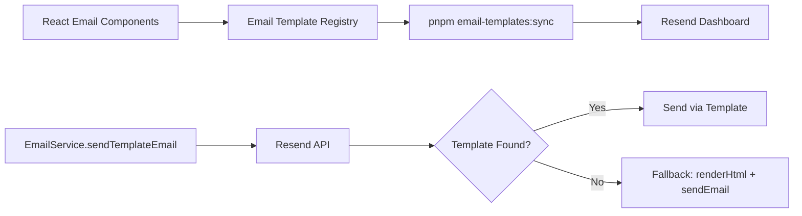

<Info>
PropWise transactional emails use React Email components uploaded to Resend as managed templates, with automatic fallback to server-side rendering when templates are unavailable.
</Info>

## Overview

The PropWise email template system combines **React Email components** with **Resend** for reliable transactional email delivery. Templates are authored as React components and synced to Resend as managed templates. At send-time, the backend calls Resend by template alias with variable values.

<Note>
The system includes automatic fallback rendering - if a template is deleted or hasn't been synced yet, emails fall back to in-app rendering using the same React component rendered server-side, ensuring no email is ever silently dropped.
</Note>

The system is **not database-backed**: there is no active `email_template` table in the runtime schema. The source of truth is `src/emails/email-template.registry.tsx` plus the corresponding templates in Resend.

## Architecture



<Steps>
<Step title="Template Development">
Create React Email components in `src/emails/templates/` and register them in the template registry
</Step>

<Step title="Template Sync">
Run `pnpm email-templates:sync` to upload templates to Resend dashboard
</Step>

<Step title="Content Management">
Non-engineers can edit template content directly in the Resend dashboard
</Step>

<Step title="Email Sending">
Backend calls `EmailService.sendTemplateEmail()` which attempts Resend API first, then falls back to server-side rendering if needed
</Step>
</Steps>

## Key Files

<AccordionGroup>
<Accordion title="Core System Files">

| File | Role |
|------|------|
| `src/emails/email-template.types.ts` | `EmailTemplateDescriptor<V>` interface |
| `src/emails/email-template.registry.tsx` | Single source of truth — all templates with stable aliases |
| `src/services/email.service.ts` | `sendEmail()` + `sendTemplateEmail()` + `dispatch()` |
| `scripts/sync-email-templates.ts` | Upload logos to R2 + upload templates to Resend |

</Accordion>

<Accordion title="UI Components">

| File | Role |
|------|------|
| `src/emails/components/email-layout.tsx` | Shared wrapper (`variant`: `app` \| `developer`) |
| `src/emails/components/email-logo-mark.tsx` | Logo tile linked to `https://propwise.com` |
| `src/emails/components/propwise-brand-text.tsx` | `PropwiseBrand` — renders "Propwise" in layout variant accent color |

</Accordion>

<Accordion title="Styling & Assets">

| File | Role |
|------|------|
| `src/emails/email-assets.constants.ts` | `R2_PUBLIC_BASE_URL` + `/email-templates/*.png` logo URL resolution |
| `src/emails/email-brand-tokens.ts` | Light-mode hex tokens for inline email CSS |
| `src/emails/email-content-styles.ts` | Shared heading/body/CTA styles per variant |

</Accordion>

<Accordion title="Notification Integration">

| File | Role |
|------|------|
| `src/modules/notification/channels/email.channel.ts` | `EmailChannel` — routes notification types to templates |
| `src/modules/notification/utils/entity-route.util.ts` | `resolveEntityUrl()` — maps entity type + payload to absolute deep links |

</Accordion>
</AccordionGroup>

## Registered Templates

### Auth & Invitation Templates

<CardGroup cols={2}>
<Card title="Email Verification" icon="envelope-circle-check">
Templates for email verification and password reset flows
</Card>
<Card title="Organization Invites" icon="user-plus">
Templates for inviting users to join organizations
</Card>
</CardGroup>

| Key | Alias | Subject | Variables |
|-----|-------|---------|-----------|
| `VERIFY_EMAIL` | `propwise-verify-email` | Verify Your Email | `CODE` |
| `RESET_PASSWORD` | `propwise-reset-password` | Reset Your Password | `RESET_LINK` |
| `ORG_INVITE` | `propwise-org-invite` | Join an Organization on Propwise | `INVITER_NAME`, `ORG_NAME`, `ROLE`, `INVITE_URL`, `EXPIRES_AT` |
| `ORG_INVITE_EXISTING` | `propwise-org-invite-existing` | Join Another Organization on Propwise | `INVITEE_NAME`, `INVITER_NAME`, `ORG_NAME`, `ROLE`, `INVITE_URL`, `EXPIRES_AT` |

### Developer Portal Templates

| Key | Alias | Subject | Variables |
|-----|-------|---------|-----------|
| `DEV_VERIFY_EMAIL` | `propwise-dev-verify-email` | Verify Your Email – PropWise Developer Portal | `CODE`, `EXPIRY_MINUTES` |
| `DEV_CONFIRM_EMAIL` | `propwise-dev-confirm-email` | Confirm Your New Email – PropWise Developer Portal | `CODE`, `EXPIRY_MINUTES` |
| `DEV_RESET_PASSWORD` | `propwise-dev-reset-password` | Reset Your Password – PropWise Developer Portal | `RESET_LINK`, `EXPIRY_MINUTES` |

### Notification Templates

<Tabs>
<Tab title="General Notifications">

| Key | Alias | When Used | Variables |
|-----|-------|-----------|-----------|
| `NOTIFICATION` | `propwise-notification` | All notification types **not** covered by bespoke templates | `PREVIEW`, `TITLE`, `MESSAGE`, `ACTIONS_HTML` |

</Tab>

<Tab title="Bespoke Templates">

| Key | Alias | When Used | Variables |
|-----|-------|-----------|-----------|
| `DEAL_WON` | `propwise-deal-won` | `deal_won` | `PREVIEW`, `TITLE`, `MESSAGE`, `DEAL_NAME`, `DEAL_VALUE`, `DEAL_LINK` |
| `TRANSFER_REQUEST` | `propwise-transfer-request` | Transfer lifecycle events | `PREVIEW`, `TITLE`, `MESSAGE`, `ENTITY_TYPE_LABEL`, `ENTITY_NAME`, `ENTITY_LINK`, `REQUESTER_NAME` |
| `COMMISSION_PAYMENT` | `propwise-commission-payment` | Commission payment events | `PREVIEW`, `TITLE`, `MESSAGE`, `PAYMENT_STATUS_LABEL`, `PAYMENT_STATUS_BG`, `PAYMENT_STATUS_COLOR`, `PAYMENT_AMOUNT`, `DEAL_NAME`, `PAYMENT_LINK` |
| `EVENT_INVITE` | `propwise-event-invite` | Event invitation lifecycle | `PREVIEW`, `TITLE`, `MESSAGE`, `EVENT_NAME`, `EVENT_DATE`, `EVENT_TIME`, `EVENT_LOCATION`, `INVITER_NAME`, `EVENT_LINK` |

</Tab>
</Tabs>

## Payload Key Contract

<Warning>
Each bespoke template sender reads specific keys from the stored notification `payload`. The keys below are what listeners must emit; the email channel maps them to template variables.
</Warning>

### Deal Won Template

| Template Variable | Payload Key(s) | Notes |
|-------------------|----------------|-------|
| `DEAL_NAME` | `dealTitle` → `dealName` | Listeners emit `dealTitle` |
| `DEAL_LINK` | `entityId` → `dealId` | Listeners emit `entityId` |
| `DEAL_VALUE` | `dealValue` | Not emitted by any listener yet — renders empty until `DealWonEvent.metadata` is extended |

### Transfer Request Template

| Template Variable | Payload Key(s) | Notes |
|-------------------|----------------|-------|
| `ENTITY_NAME` | `entityTitle` → `entityName` | All transfer listeners emit `entityTitle` |
| `REQUESTER_NAME` | `requestedByName` → `approverName` → `rejecterName` → `cancelledByName` → `userName` | Coalesced across all five transfer sub-types |

### Commission Payment Template

| Template Variable | Payload Key(s) | Notes |
|-------------------|----------------|-------|
| `PAYMENT_STATUS_LABEL/BG/COLOR` | `newStatus` → type-derived fallback | Status-change listeners emit `newStatus`; `COMMISSION_PAYMENT_CREATED` derives `'CREATED'` from `event.type` |
| `PAYMENT_AMOUNT` | `amount` (number) → `paymentAmount` (string) | Listeners emit `amount` as number; channel converts to string |

### Event Invite Template

| Template Variable | Payload Key(s) | Notes |
|-------------------|----------------|-------|
| `EVENT_NAME` | `eventName` | Event title from payload |
| `EVENT_DATE` | `eventDate` | Formatted event date |
| `EVENT_TIME` | `eventTime` | Event start time |
| `EVENT_LOCATION` | `eventLocation` | Event venue or location details |
| `INVITER_NAME` | `inviterName` | Name of user who created the invite |

## Template Sync Script

<CodeGroup>
```bash Development
# Sync templates to development environment
pnpm email-templates:sync
```

```bash Production
# Sync templates to production (targets prod CDN)
pnpm email-templates:sync --prod
```

```bash Force Update
# Force update existing templates (upsert mode)
pnpm email-templates:sync --force
```
</CodeGroup>

<Note>
The sync script uploads logos to R2 and templates to Resend. By default, it only creates new templates to avoid overwriting manual changes in the Resend dashboard. Use `--force` to upsert existing templates.
</Note>

## Testing

The system includes a CI contract test at `src/emails/email-template.registry.spec.ts` that enforces variable coverage across all registered templates.

<Check>
All template variables must be tested and covered by the contract test to ensure they render correctly.
</Check>