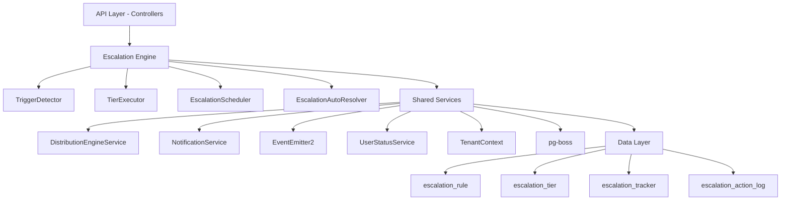

The Escalation Module automates responses when assigned leads go stale. A scheduled engine detects trigger conditions (no first contact, went cold) and executes tiered escalation actions — notifications, temperature changes, tag additions, and redistribution to new agents.

## Design principles

<CardGroup cols={2}>
  <Card title="pg-boss scheduling" icon="clock">
    Escalation scheduler uses pg-boss recurring job for reliability
  </Card>
  <Card title="Tiered actions" icon="layer-group">
    Rules have ordered tiers with configurable delays; actions execute in sequence
  </Card>
  <Card title="Auto-resolution" icon="circle-check">
    Events (activity, stage change, reassignment) automatically resolve active trackers
  </Card>
  <Card title="Idempotency" icon="shield">
    Partial unique index + `ON CONFLICT DO NOTHING` prevents duplicate trackers
  </Card>
  <Card title="Distribution delegation" icon="share-nodes">
    Reassignment uses the distribution engine (`REDISTRIBUTE` action), not a separate paradigm
  </Card>
  <Card title="RLS compliance" icon="lock">
    All entities carry `organization_id` for row-level security
  </Card>
</CardGroup>

## High-level architecture



## Component responsibilities

<AccordionGroup>
  <Accordion title="EscalationScheduler">
    pg-boss recurring job that runs every 60 seconds to detect new triggers and process due escalations
  </Accordion>
  
  <Accordion title="TriggerDetector">
    Scans leads for unmet conditions (no first contact, went cold); creates tracker records
  </Accordion>
  
  <Accordion title="TierExecutor">
    Executes escalation tier actions (notify, redistribute, change temp, add tag)
  </Accordion>
  
  <Accordion title="EscalationAutoResolver">
    Listens to domain events and resolves active trackers when conditions change
  </Accordion>
  
  <Accordion title="EscalationRuleService">
    CRUD for escalation rules; handles tracker cancellation on deactivation/deletion
  </Accordion>
</AccordionGroup>

## Entity specifications

### EscalationRule

Defines when and how a lead should be escalated. Evaluated by `TriggerDetector`.

| Column | Type | Notes |
|--------|------|-------|
| `id` | uuid PK | |
| `organization_id` | uuid FK | RLS |
| `name` | varchar | Human-readable rule name |
| `is_active` | bool | default true |
| `priority` | int | Evaluation order |
| `trigger_type` | enum | `NO_FIRST_CONTACT`, `WENT_COLD` |
| `trigger_config` | jsonb | `{thresholdMinutes?, thresholdValue?, thresholdUnit?}` |
| `conditions` | jsonb | `EscalationCondition[]` — AND-joined applicability filters |
| `respect_business_hours` | bool | default true |
| `created_by` | uuid FK | |
| `created_at, updated_at` | timestamp | |
| `is_deleted` | bool | soft delete |

<Info>
**EscalationCondition** shape includes fields for temperature, leadSource, language, and sourceChannel with eq/in operators.
</Info>

#### SQL field mapping

Used by `TriggerDetector.buildApplicabilityExtraWhere`:

| Field | SQL Column | Table | Notes |
|-------|-----------|-------|-------|
| `temperature` | `l.temperature` | lead | |
| `leadSource` | `l.lead_source` | lead | |
| `sourceChannel` | `l.source_channel` | lead | |
| `language` | `p.language` | person | Adds `LEFT JOIN person p ON p.id = l.person_id` |

### EscalationTier

Each tier represents a delayed action set. Tiers execute in `tier_order` sequence.

| Column | Type | Notes |
|--------|------|-------|
| `id` | uuid PK | |
| `escalation_rule_id` | uuid FK | |
| `organization_id` | uuid FK | RLS |
| `tier_order` | int | 1, 2, 3... (max 10) |
| `delay_minutes` | int | Tier 1: always 0; subsequent tiers: minutes after previous |
| `actions` | jsonb | `TierAction[]` array |

#### Tier action types

<Tabs>
  <Tab title="Notifications">
    | Action | Parameters | Resolution |
    |--------|------------|------------|
    | `NOTIFY_AGENT` | `message?: string` | Current stakeholder (assigned agent) |
    | `NOTIFY_ADMIN` | `message?: string` | All org users with `system.admin` permission |
    | `NOTIFY_TEAM_LEAD` | `message?: string` | Team members with `team.admin` permission |
  </Tab>
  
  <Tab title="Lead Changes">
    | Action | Parameters | Resolution |
    |--------|------------|------------|
    | `REDISTRIBUTE` | _(no params)_ | Uses distribution engine, must be last tier |
    | `CHANGE_TEMPERATURE` | `temperature: 'hot' \| 'warm' \| 'cold'` | Direct entity update |
    | `ADD_TAG` | `tagIds: string[]` | Appends to existing tags, deduplicates |
  </Tab>
</Tabs>

<Warning>
`REDISTRIBUTE` action must be in the **last tier** only. The API rejects rules where REDISTRIBUTE appears in intermediate tiers.
</Warning>

#### Action configuration examples

<CodeGroup>
```json Notifications
{
  "type": "NOTIFY_AGENT",
  "message": "Lead needs attention"
}
```

```json Temperature Change
{
  "type": "CHANGE_TEMPERATURE",
  "temperature": "hot"
}
```

```json Tag Addition
{
  "type": "ADD_TAG",
  "tagIds": ["tag-uuid-1", "tag-uuid-2"]
}
```

```json Redistribution
{
  "type": "REDISTRIBUTE"
}
```
</CodeGroup>

### EscalationTracker

Tracks the escalation state of a specific lead against a specific rule.

| Column | Type | Notes |
|--------|------|-------|
| `id` | uuid PK | |
| `lead_id` | uuid FK | |
| `escalation_rule_id` | uuid FK | |
| `organization_id` | uuid FK | RLS |
| `current_tier` | int | 0 = triggered but not escalated; increments with each tier |
| `trigger_fired_at` | timestamp | When trigger condition was first detected |
| `next_escalation_at` | timestamp | Indexed for scheduler query; null after completion |
| `status` | enum | `ACTIVE`, `RESOLVED`, `CANCELLED` |
| `resolved_at` | timestamp nullable | |
| `resolved_by` | enum nullable | See resolution types below |
| `history` | jsonb | `TrackerHistoryEntry[]` — append-only summary |
| `created_at` | timestamp | |

#### Key indexes

| Index | Columns | Type | Purpose |
|-------|---------|------|---------|
| `uq_escalation_tracker_lead_rule` | `(lead_id, escalation_rule_id) WHERE status = 'ACTIVE'` | Partial unique | Prevents duplicate ACTIVE trackers |
| `idx_escalation_tracker_next_at` | `(next_escalation_at, status)` | Composite | Primary scheduler query |
| `idx_escalation_tracker_lead` | `(lead_id, status)` | Composite | Auto-resolver lookups |
| `idx_escalation_tracker_org_status` | `(organization_id, status)` | Composite | Per-org active counts |

#### Idempotency guarantee

<Note>
The partial unique index provides database-level protection. `TriggerDetector` uses `INSERT ... ON CONFLICT ... DO NOTHING` to prevent duplicate trackers:

```sql
INSERT INTO escalation_tracker
  (id, lead_id, escalation_rule_id, organization_id, trigger_fired_at,
   next_escalation_at, status, history, current_tier, created_at)
VALUES (gen_random_uuid(), $1, $2, $3, $4, $5, 'ACTIVE', '[]', 0, NOW())
ON CONFLICT (lead_id, escalation_rule_id) WHERE status = 'ACTIVE' DO NOTHING;
```
</Note>

<Warning>
`TriggerDetector` must **never** use `em.persistAndFlush()` for tracker creation — always use raw `execute()` with `ON CONFLICT DO NOTHING`.
</Warning>

### EscalationActionLog

Normalized table recording every escalation tier action execution for analytics.

| Column | Type | Notes |
|--------|------|-------|
| `id` | uuid PK | |
| `tracker_id` | uuid FK | References `escalation_tracker` |
| `organization_id` | uuid FK | RLS |
| `tier_order` | int | Which tier triggered this action |
| `action_type` | varchar | e.g., `NOTIFY_AGENT`, `REDISTRIBUTE` |
| `action_params` | jsonb nullable | Serialized parameters |
| `result` | enum | `SUCCESS`, `FAILED`, `SKIPPED` |
| `executed_at` | timestamp | |

#### Analytics indexes

- `(organization_id, action_type)` — Analytics by action type
- `(organization_id, executed_at)` — Time-range queries
- `(tracker_id)` — Lookup all actions for a tracker

## Type definitions

<CodeGroup>
```typescript Trigger Types
enum TriggerType {
  NO_FIRST_CONTACT = 'NO_FIRST_CONTACT',
  WENT_COLD = 'WENT_COLD',
}
```

```typescript Action Types
enum EscalationActionType {
  NOTIFY_AGENT = 'NOTIFY_AGENT',
  NOTIFY_ADMIN = 'NOTIFY_ADMIN',
  NOTIFY_TEAM_LEAD = 'NOTIFY_TEAM_LEAD',
  REDISTRIBUTE = 'REDISTRIBUTE',
  CHANGE_TEMPERATURE = 'CHANGE_TEMPERATURE',
  ADD_TAG = 'ADD_TAG',
}
```

```typescript Status Types
enum EscalationStatus {
  ACTIVE = 'ACTIVE',
  RESOLVED = 'RESOLVED',
  CANCELLED = 'CANCELLED',
}
```

```typescript Resolution Types
enum ResolvedBy {
  MANUAL = 'MANUAL',
  AUTO_ACTIVITY = 'AUTO_ACTIVITY',
  AUTO_STAGE_CHANGE = 'AUTO_STAGE_CHANGE',
  AUTO_REASSIGNMENT = 'AUTO_REASSIGNMENT',
  AUTO_ARCHIVED = 'AUTO_ARCHIVED',
  AUTO_DELETED = 'AUTO_DELETED',
  AUTO_ORPHANED = 'AUTO_ORPHANED',
  REDISTRIBUTED = 'REDISTRIBUTED',
}
```
</CodeGroup>

### Resolution types explained

| Value | Description |
|-------|-------------|
| `MANUAL` | User explicitly resolved via UI/API |
| `AUTO_ACTIVITY` | New activity added to lead |
| `AUTO_STAGE_CHANGE` | Lead moved to different stage |
| `AUTO_REASSIGNMENT` | Lead assigned to different agent |
| `AUTO_ARCHIVED` | Lead was archived |
| `AUTO_DELETED` | Lead was deleted |
| `AUTO_ORPHANED` | Lead stakeholders removed |
| `REDISTRIBUTED` | Successfully redistributed via engine |

## Module structure

The escalation module follows this directory structure:

```
src/modules/crm/escalation/
├── controllers/
│   ├── escalation-rule.controller.ts
│   └── escalation-analytics.controller.ts
├── services/
│   ├── escalation-rule.service.ts
│   ├── escalation-scheduler.service.ts
│   ├── trigger-detector.service.ts
│   ├── tier-executor.service.ts
│   └── escalation-auto-resolver.service.ts
├── entities/
│   ├── escalation-rule.entity.ts
│   ├── escalation-tier.entity.ts
│   ├── escalation-tracker.entity.ts
│   └── escalation-action-log.entity.ts
├── dto/
└── types/
```

<Tip>
The escalation module integrates with the distribution engine for reassignment, notification service for alerts, and event system for auto-resolution.
</Tip>