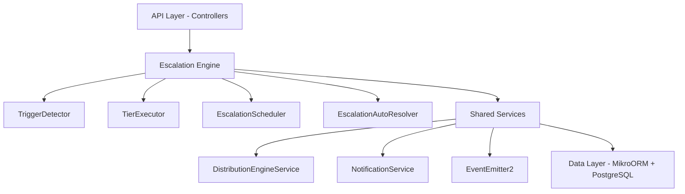

# Complete Module Specification

<Info>
**Status:** Active — fully implemented  
**Module Path:** `src/modules/crm/escalation/`
</Info>

## Overview

The Escalation Module automates responses when assigned leads go stale. A scheduled engine detects trigger conditions (no first contact, went cold) and executes tiered escalation actions — notifications, temperature changes, tag additions, and redistribution to new agents.

### Design Principles

| Principle | Decision |
|-----------|----------|
| pg-boss scheduling | Escalation scheduler uses pg-boss recurring job for reliability |
| Tiered actions | Rules have ordered tiers with configurable delays; actions execute in sequence |
| Auto-resolution | Events (activity, stage change, reassignment) automatically resolve active trackers |
| Idempotency | Partial unique index + `ON CONFLICT DO NOTHING` prevents duplicate trackers |
| Distribution delegation | Reassignment uses the distribution engine (`REDISTRIBUTE` action), not a separate paradigm |
| RLS compliance | All entities carry `organization_id` for row-level security |

## Architecture

### High-Level Diagram



### Component Responsibilities

<AccordionGroup>
<Accordion title="EscalationScheduler">
pg-boss recurring job that runs every 60 seconds to detect new triggers and process due escalations
</Accordion>

<Accordion title="TriggerDetector">
Scans leads for unmet conditions (no first contact, went cold); creates tracker records
</Accordion>

<Accordion title="TierExecutor">
Executes escalation tier actions (notify, redistribute, change temp, add tag)
</Accordion>

<Accordion title="EscalationAutoResolver">
Listens to domain events and resolves active trackers when conditions change
</Accordion>

<Accordion title="EscalationRuleService">
CRUD for escalation rules; handles tracker cancellation on deactivation/deletion
</Accordion>
</AccordionGroup>

## Entity Specifications

### EscalationRule

Defines when and how a lead should be escalated. Evaluated by `TriggerDetector`.

| Column | Type | Notes |
|--------|------|-------|
| id | uuid PK | |
| organization_id | uuid FK | RLS |
| name | varchar | Human-readable rule name |
| is_active | bool | default true |
| priority | int | Evaluation order |
| trigger_type | enum | `NO_FIRST_CONTACT`, `WENT_COLD` |
| trigger_config | jsonb | `{thresholdMinutes?, thresholdValue?, thresholdUnit?}` |
| conditions | jsonb | `EscalationCondition[]` — AND-joined applicability filters; `[]` = all leads |
| respect_business_hours | bool | default true. References org business hours schedule. |
| created_by | uuid FK | |
| created_at, updated_at | timestamp | |
| is_deleted | bool | soft delete |

<Note>
**EscalationCondition shape:**
```typescript
interface EscalationCondition {
  field: 'temperature' | 'leadSource' | 'language' | 'sourceChannel';
  operator: 'eq' | 'in';
  value: string | string[];
}
```
</Note>

#### SQL Field Mapping

Used by `TriggerDetector.buildApplicabilityExtraWhere`:

| Field | SQL Column | Table | Notes |
|-------|-----------|-------|-------|
| `temperature` | `l.temperature` | lead | |
| `leadSource` | `l.lead_source` | lead | |
| `sourceChannel` | `l.source_channel` | lead | |
| `language` | `p.language` | person | Adds `LEFT JOIN person p ON p.id = l.person_id` |

### EscalationTier

Each tier in an escalation rule represents a delayed action set. Tiers execute in `tier_order` sequence.

| Column | Type | Notes |
|--------|------|-------|
| id | uuid PK | |
| escalation_rule_id | uuid FK | |
| organization_id | uuid FK | RLS |
| tier_order | int | 1, 2, 3... (max 10) |
| delay_minutes | int | Tier 1: always 0; subsequent tiers: minutes after previous tier |
| actions | jsonb | `TierAction[]` |

#### Tier Action Types

<Tabs>
<Tab title="Notification Actions">
| Action Type | Parameters | Resolution |
|-------------|------------|------------|
| `NOTIFY_AGENT` | `message?: string` | Resolved from lead's current stakeholder |
| `NOTIFY_ADMIN` | `message?: string` | Self-resolving — queries all org users with `system.admin` permission |
| `NOTIFY_TEAM_LEAD` | `message?: string` | Self-resolving — queries team members with `team.admin` permission |
</Tab>

<Tab title="Lead Actions">
| Action Type | Parameters | Resolution |
|-------------|------------|------------|
| `REDISTRIBUTE` | _(no params)_ | Distribution engine delegation — must be in last tier |
| `CHANGE_TEMPERATURE` | `temperature: 'hot' \| 'warm' \| 'cold'` | Direct entity update |
| `ADD_TAG` | `tagIds: string[]` | Direct entity update with deduplication |
</Tab>
</Tabs>

<CodeGroup>
```typescript Notification Examples
{ "type": "NOTIFY_AGENT", "message": "Lead needs attention" }
{ "type": "NOTIFY_ADMIN", "message": "Escalation alert" }
{ "type": "NOTIFY_TEAM_LEAD" }
```

```typescript Lead Action Examples
{ "type": "REDISTRIBUTE" }
{ "type": "CHANGE_TEMPERATURE", "temperature": "hot" }
{ "type": "ADD_TAG", "tagIds": ["tag-uuid-1", "tag-uuid-2"] }
```
</CodeGroup>

### EscalationTracker

Tracks the escalation state of a specific lead against a specific rule.

| Column | Type | Notes |
|--------|------|-------|
| id | uuid PK | |
| lead_id | uuid FK | |
| escalation_rule_id | uuid FK | |
| organization_id | uuid FK | RLS |
| current_tier | int | 0 = triggered but not escalated; increments with each tier |
| trigger_fired_at | timestamp | when trigger condition was first detected |
| next_escalation_at | timestamp | indexed for scheduler query; null after completion |
| status | enum | `ACTIVE`, `RESOLVED`, `CANCELLED` |
| resolved_at | timestamp nullable | |
| resolved_by | enum nullable | Resolution reason |
| history | jsonb | `TrackerHistoryEntry[]` — append-only summary |
| created_at | timestamp | |

#### Key Indexes

| Index | Columns | Type | Purpose |
|-------|---------|------|---------|
| `uq_escalation_tracker_lead_rule` | `(lead_id, escalation_rule_id) WHERE status = 'ACTIVE'` | Partial unique | Prevents duplicate ACTIVE trackers |
| `idx_escalation_tracker_next_at` | `(next_escalation_at, status)` | Composite | Primary scheduler query |
| `idx_escalation_tracker_lead` | `(lead_id, status)` | Composite | Auto-resolver lookups |
| `idx_escalation_tracker_org_status` | `(organization_id, status)` | Composite | Per-org active counts |

<Warning>
**Idempotency Requirement**

The partial unique index provides database-level protection. `TriggerDetector` must use `INSERT ... ON CONFLICT ... DO NOTHING` to prevent `UniqueViolationError` from aborting the scheduler:

```sql
INSERT INTO escalation_tracker
  (id, lead_id, escalation_rule_id, organization_id, trigger_fired_at,
   next_escalation_at, status, history, current_tier, created_at)
VALUES (gen_random_uuid(), $1, $2, $3, $4, $5, 'ACTIVE', '[]', 0, NOW())
ON CONFLICT (lead_id, escalation_rule_id) WHERE status = 'ACTIVE' DO NOTHING;
```

Never use `em.persistAndFlush()` for tracker creation — always use raw `execute()` with `ON CONFLICT DO NOTHING`.
</Warning>

### EscalationActionLog

Normalized table recording every escalation tier action execution for analytics.

| Column | Type | Notes |
|--------|------|-------|
| id | uuid PK | |
| tracker_id | uuid FK | references `escalation_tracker` |
| organization_id | uuid FK | RLS |
| tier_order | int | which tier triggered this action |
| action_type | varchar | e.g., `NOTIFY_AGENT`, `REDISTRIBUTE` |
| action_params | jsonb nullable | serialized parameters |
| result | enum | `SUCCESS`, `FAILED`, `SKIPPED` |
| executed_at | timestamp | |

## Type Definitions

```typescript
enum TriggerType {
  NO_FIRST_CONTACT = 'NO_FIRST_CONTACT',
  WENT_COLD = 'WENT_COLD',
}

enum EscalationActionType {
  NOTIFY_AGENT = 'NOTIFY_AGENT',
  NOTIFY_ADMIN = 'NOTIFY_ADMIN',
  NOTIFY_TEAM_LEAD = 'NOTIFY_TEAM_LEAD',
  REDISTRIBUTE = 'REDISTRIBUTE',
  CHANGE_TEMPERATURE = 'CHANGE_TEMPERATURE',
  ADD_TAG = 'ADD_TAG',
}

enum EscalationStatus {
  ACTIVE = 'ACTIVE',
  RESOLVED = 'RESOLVED',
  CANCELLED = 'CANCELLED',
}

enum ResolvedBy {
  MANUAL = 'MANUAL',
  AUTO_ACTIVITY = 'AUTO_ACTIVITY',
  AUTO_STAGE_CHANGE = 'AUTO_STAGE_CHANGE',
  AUTO_REASSIGNMENT = 'AUTO_REASSIGNMENT',
  AUTO_ARCHIVED = 'AUTO_ARCHIVED',
  AUTO_DELETED = 'AUTO_DELETED',
  AUTO_ORPHANED = 'AUTO_ORPHANED',
  REDISTRIBUTED = 'REDISTRIBUTED',
}

enum ActionResult {
  SUCCESS = 'SUCCESS',
  FAILED = 'FAILED',
  SKIPPED = 'SKIPPED',
}
```

### ResolvedBy Values

| Value | Description |
|-------|-------------|
| `MANUAL` | User explicitly resolved via UI/API |
| `AUTO_ACTIVITY` | New activity added to lead |
| `AUTO_STAGE_CHANGE` | Lead moved to different stage |
| `AUTO_REASSIGNMENT` | Lead reassigned to different user/team |
| `AUTO_ARCHIVED` | Lead was archived |
| `AUTO_DELETED` | Lead was deleted |
| `AUTO_ORPHANED` | Lead lost all stakeholders |
| `REDISTRIBUTED` | Redistribution action completed successfully |

## Escalation Engine

The engine consists of four main components working together to detect triggers and execute escalations.

### EscalationScheduler

<Steps>
<Step title="Job Registration">
Registers a recurring pg-boss job named `escalation-engine` that runs every 60 seconds
</Step>

<Step title="Trigger Detection">
Calls `TriggerDetector.detectAndCreateTrackers()` to scan for new escalation triggers
</Step>

<Step title="Escalation Processing">
Calls `TierExecutor.processEscalations()` to execute due escalation tiers
</Step>

<Step title="Error Handling">
Logs errors but continues processing to maintain system stability
</Step>
</Steps>

### TriggerDetector

Responsible for scanning leads and creating escalation trackers when trigger conditions are met.

#### NO_FIRST_CONTACT Detection

```sql
SELECT l.id, l.organization_id
FROM lead l
WHERE l.assigned_at IS NOT NULL
  AND l.archived_at IS NULL
  AND l.deleted_at IS NULL
  AND l.assigned_at <= (NOW() - INTERVAL '{thresholdMinutes} minutes')
  AND NOT EXISTS (
    SELECT 1 FROM activity a 
    WHERE a.lead_id = l.id 
      AND a.created_at >= l.assigned_at
  )
  AND NOT EXISTS (
    SELECT 1 FROM escalation_tracker et 
    WHERE et.lead_id = l.id 
      AND et.escalation_rule_id = $1 
      AND et.status = 'ACTIVE'
  )
```

#### WENT_COLD Detection

```sql
SELECT l.id, l.organization_id
FROM lead l
WHERE l.assigned_at IS NOT NULL
  AND l.archived_at IS NULL
  AND l.deleted_at IS NULL
  AND l.temperature != 'cold'
  AND l.last_activity_at <= (NOW() - INTERVAL '{thresholdMinutes} minutes')
  AND NOT EXISTS (
    SELECT 1 FROM escalation_tracker et 
    WHERE et.lead_id = l.id 
      AND et.escalation_rule_id = $1 
      AND et.status = 'ACTIVE'
  )
```

<Note>
Both queries include exclusion of leads that already have active escalation trackers for the specific rule, preventing duplicates at the query level.
</Note>

### TierExecutor

Handles the execution of escalation tier actions for due escalations.

<Steps>
<Step title="Query Due Escalations">
```sql
SELECT et.* FROM escalation_tracker et
WHERE et.next_escalation_at <= NOW()
  AND et.status = 'ACTIVE'
ORDER BY et.next_escalation_at ASC
```
</Step>

<Step title="Load Tier Configuration">
Fetches the escalation rule and current tier details for each tracker
</Step>

<Step title="Execute Actions">
Processes each action in the tier sequentially, logging results to `escalation_action_log`
</Step>

<Step title="Update Tracker">
Advances `current_tier`, updates `next_escalation_at`, and appends to history
</Step>
</Steps>

#### Action Execution Details

<Tabs>
<Tab title="NOTIFY_AGENT">
1. Resolves lead's assigned agent
2. Creates notification via `NotificationService`
3. Result: `SUCCESS` if notification created, `SKIPPED` if no agent assigned
</Tab>

<Tab title="NOTIFY_ADMIN">
1. Queries users with `system.admin` permission in organization
2. Creates notification for each admin user
3. Result: `SUCCESS` if notifications created, `SKIPPED` if no admins found
</Tab>

<Tab title="NOTIFY_TEAM_LEAD">
1. Identifies lead's assigned team
2. Queries team members with `team.admin` permission
3. Creates notification for each team leader
4. Result: `SUCCESS` if notifications created, `SKIPPED` if no team or leaders
</Tab>

<Tab title="REDISTRIBUTE">
1. Removes current stakeholders from lead
2. Calls `DistributionEngineService.redistribute()`
3. If outcome is `ASSIGNED`, resolves tracker with `REDISTRIBUTED`
4. Result: `SUCCESS` if redistributed, `FAILED` if distribution failed
</Tab>

<Tab title="CHANGE_TEMPERATURE">
1. Updates `lead.temperature` directly (bypasses validation guards)
2. Result: `SUCCESS` always (direct database update)
</Tab>

<Tab title="ADD_TAG">
1. Appends `tagIds` to `lead.tagIds` array with deduplication
2. Result: `SUCCESS` always (direct database update)
</Tab>
</Tabs>

### EscalationAutoResolver

Event-driven component that automatically resolves escalation trackers when conditions change.

#### Listened Events

| Event | Trigger | Resolution Reason |
|-------|---------|-------------------|
| `lead.activity.created` | New activity added | `AUTO_ACTIVITY` |
| `lead.stage.changed` | Stage transition | `AUTO_STAGE_CHANGE` |
| `lead.stakeholder.assigned` | New assignment | `AUTO_REASSIGNMENT` |
| `lead.stakeholder.removed` | Assignment removed | `AUTO_REASSIGNMENT` |
| `lead.archived` | Lead archived | `AUTO_ARCHIVED` |
| `lead.deleted` | Lead deleted | `AUTO_DELETED` |
| `lead.stakeholder.orphaned` | All stakeholders removed | `AUTO_ORPHANED` |

<Warning>
The auto-resolver operates on ALL active escalation trackers for a lead, regardless of which specific rule triggered the event. This ensures comprehensive cleanup when lead conditions change.
</Warning>

## API Endpoints

### Escalation Rules Management

<CodeGroup>
```typescript GET /api/escalation/rules
// List escalation rules with filtering and pagination
interface ListRulesQuery {
  page?: number;
  limit?: number;
  isActive?: boolean;
  triggerType?: TriggerType;
}

Response: PaginatedResponse<EscalationRuleResponse>
```

```typescript POST /api/escalation/rules
// Create new escalation rule
interface CreateRuleRequest {
  name: string;
  triggerType: TriggerType;
  triggerConfig: TriggerConfig;
  conditions: EscalationCondition[];
  respectBusinessHours: boolean;
  priority: number;
  tiers: CreateTierRequest[];
}

Response: EscalationRuleResponse
```

```typescript PUT /api/escalation/rules/:id
// Update escalation rule (cancels active trackers if deactivated)
interface UpdateRuleRequest {
  name?: string;
  isActive?: boolean;
  priority?: number;
  triggerConfig?: TriggerConfig;
  conditions?: EscalationCondition[];
  respectBusinessHours?: boolean;
  tiers?: UpdateTierRequest[];
}

Response: EscalationRuleResponse
```

```typescript DELETE /api/escalation/rules/:id
// Soft delete rule and cancel all active trackers
Response: { success: boolean }
```
</CodeGroup>

### Escalation Analytics

<CodeGroup>
```typescript GET /api/escalation/analytics/overview
// High-level escalation metrics
interface AnalyticsQuery {
  startDate?: string;
  endDate?: string;
  ruleIds?: string[];
}

Response: EscalationOverview
```

```typescript GET /api/escalation/analytics/performance
// Rule performance metrics
Response: RulePerformanceMetrics[]
```

```typescript GET /api/escalation/trackers
// List escalation trackers with filtering
interface ListTrackersQuery {
  status?: EscalationStatus;
  ruleId?: string;
  leadId?: string;
  resolvedBy?: ResolvedBy;
}

Response: PaginatedResponse<EscalationTrackerResponse>
```
</CodeGroup>

### Manual Tracker Management

<CodeGroup>
```typescript POST /api/escalation/trackers/:id/resolve
// Manually resolve an escalation tracker
interface ResolveTrackerRequest {
  reason?: string;
}

Response: EscalationTrackerResponse
```

```typescript POST /api/escalation/trackers/:id/cancel
// Cancel an escalation tracker
interface CancelTrackerRequest {
  reason?: string;
}

Response: EscalationTrackerResponse
```
</CodeGroup>

## Security & Permissions

### Required Permissions

| Operation | Permission | Scope |
|-----------|------------|--------|
| View escalation rules | `escalation.read` | Organization |
| Create/update rules | `escalation.write` | Organization |
| Delete rules | `escalation.delete` | Organization |
| View analytics | `escalation.analytics` | Organization |
| Resolve trackers | `escalation.manage` | Organization |

### Row-Level Security

All escalation entities include `organization_id` for RLS enforcement:

```sql
-- escalation_rule RLS policy
CREATE POLICY escalation_rule_org_isolation ON escalation_rule
  USING (organization_id = current_setting('app.current_organization_id')::uuid);

-- escalation_tracker RLS policy  
CREATE POLICY escalation_tracker_org_isolation ON escalation_tracker
  USING (organization_id = current_setting('app.current_organization_id')::uuid);

-- escalation_action_log RLS policy
CREATE POLICY escalation_action_log_org_isolation ON escalation_action_log
  USING (organization_id = current_setting('app.current_organization_id')::uuid);
```

### Input Validation

<Tabs>
<Tab title="Rule Validation">
- Name: 1-100 characters, non-empty
- Priority: 1-1000 integer range
- Trigger config: valid JSON matching trigger type schema
- Conditions: valid field/operator/value combinations
- Tiers: 1-10 tiers, valid action configurations
</Tab>

<Tab title="Tier Validation">
- Tier order: sequential from 1, no gaps
- Delay minutes: >= 0, tier 1 must be 0
- Actions: valid action type and parameter combinations
- REDISTRIBUTE: must be in final tier only
</Tab>

<Tab title="Security Checks">
- User has required permissions for operation
- All referenced entities (tags, users) exist in organization
- Lead access validation for manual tracker operations
</Tab>
</Tabs>

## Analytics & Metrics

### Core Metrics

<AccordionGroup>
<Accordion title="Escalation Overview">
```typescript
interface EscalationOverview {
  activeTrackers: number;
  totalEscalations: number;
  avgResolutionTime: number; // minutes
  escalationsByTrigger: Record<TriggerType, number>;
  escalationsByStatus: Record<EscalationStatus, number>;
  topPerformingRules: RulePerformance[];
}
```
</Accordion>

<Accordion title="Rule Performance">
```typescript
interface RulePerformance {
  ruleId: string;
  ruleName: string;
  triggeredCount: number;
  resolvedCount: number;
  avgResolutionTime: number;
  resolutionBreakdown: Record<ResolvedBy, number>;
  actionSuccessRates: Record<EscalationActionType, number>;
}
```
</Accordion>

<Accordion title="Tracker Metrics">
```typescript
interface TrackerMetrics {
  trackerId: string;
  leadId: string;
  ruleId: string;
  triggerFiredAt: string;
  currentTier: number;
  status: EscalationStatus;
  resolvedBy?: ResolvedBy;
  resolutionTime?: number; // minutes
  actionsExecuted: ActionExecutionSummary[];
}
```
</Accordion>
</AccordionGroup>

### Analytics Queries

Performance-optimized queries using proper indexes:

<CodeGroup>
```sql Active Trackers by Organization
SELECT 
  COUNT(*) as active_count,
  AVG(EXTRACT(EPOCH FROM (NOW() - trigger_fired_at))/60) as avg_age_minutes
FROM escalation_tracker 
WHERE organization_id = $1 
  AND status = 'ACTIVE';
```

```sql Escalation Success Rate by Rule
SELECT 
  er.id,
  er.name,
  COUNT(et.*) as total_escalations,
  COUNT(CASE WHEN et.resolved_by = 'REDISTRIBUTED' THEN 1 END) as successful_redistributions,
  AVG(EXTRACT(EPOCH FROM (et.resolved_at - et.trigger_fired_at))/60) as avg_resolution_minutes
FROM escalation_rule er
LEFT JOIN escalation_tracker et ON et.escalation_rule_id = er.id
WHERE er.organization_id = $1
  AND er.is_deleted = false
GROUP BY er.id, er.name;
```

```sql Action Execution Statistics
SELECT 
  action_type,
  COUNT(*) as total_executions,
  COUNT(CASE WHEN result = 'SUCCESS' THEN 1 END) as successful_executions,
  COUNT(CASE WHEN result = 'FAILED' THEN 1 END) as failed_executions,
  COUNT(CASE WHEN result = 'SKIPPED' THEN 1 END) as skipped_executions
FROM escalation_action_log 
WHERE organization_id = $1
  AND executed_at >= $2
  AND executed_at <= $3
GROUP BY action_type;
```
</CodeGroup>

## Edge Case Handling

### Business Hours Respect

When `respectBusinessHours` is enabled:

<Steps>
<Step title="Threshold Calculation">
Only business hours count toward trigger thresholds (e.g., 48 business hours vs 48 clock hours)
</Step>

<Step title="Execution Timing">
Escalations only execute during business hours; due escalations queue until next business period
</Step>

<Step title="Time Zone Handling">
Business hours calculated in organization's configured time zone
</Step>
</Steps>

### Concurrent Modification

<Warning>
**Scheduler Race Conditions**

Multiple scheduler instances could theoretically run simultaneously. Protection mechanisms:

1. **pg-boss job locking**: Prevents multiple job executions
2. **Database constraints**: Partial unique index prevents duplicate trackers
3. **Idempotent operations**: `ON CONFLICT DO NOTHING` for tracker creation
4. **Optimistic locking**: Entity versioning prevents conflicting updates
</Warning>

### Data Consistency

<Tabs>
<Tab title="Orphaned Trackers">
If a lead is deleted outside the normal flow:
- Auto-resolver listens for `lead.deleted` events
- Resolves all active trackers with `AUTO_DELETED`
- Orphaned trackers cleaned up by background job
</Tab>

<Tab title="Rule Deletion">
When a rule is deleted:
- All active trackers are cancelled immediately
- Historical data preserved for analytics
- No new trackers created for deleted rules
</Tab>

<Tab title="Invalid Stakeholders">
If referenced users/teams are deleted:
- NOTIFY actions skip gracefully (`SKIPPED` result)
- System continues processing other actions
- Action log preserves execution attempt details
</Tab>
</Tabs>

### Performance Degradation

<Note>
**Large Dataset Handling**

For organizations with many leads/rules:

1. **Pagination**: Analytics queries use cursor-based pagination
2. **Indexing**: All query patterns have supporting indexes
3. **Batch Processing**: Scheduler processes trackers in batches of 100
4. **Query Optimization**: Uses EXISTS subqueries instead of JOINs where possible
</Note>

## Performance & Scaling

### Query Optimization

Critical performance considerations for the escalation engine:

<AccordionGroup>
<Accordion title="Scheduler Query Performance">
```sql
-- Optimized scheduler query using composite index
SELECT et.* 
FROM escalation_tracker et 
WHERE et.next_escalation_at <= NOW() 
  AND et.status = 'ACTIVE'
ORDER BY et.next_escalation_at ASC 
LIMIT 100;

-- Uses: idx_escalation_tracker_next_at (next_escalation_at, status)
```
</Accordion>

<Accordion title="Trigger Detection Optimization">
```sql
-- NO_FIRST_CONTACT with optimized NOT EXISTS
SELECT l.id, l.organization_id
FROM lead l
WHERE l.assigned_at <= (NOW() - INTERVAL '60 minutes')
  AND l.archived_at IS NULL
  AND l.deleted_at IS NULL
  AND NOT EXISTS (
    SELECT 1 FROM activity a 
    WHERE a.lead_id = l.id 
      AND a.created_at >= l.assigned_at
    LIMIT 1  -- Early termination optimization
  );
```
</Accordion>

<Accordion title="Analytics Query Optimization">
```sql
-- Time-range analytics with proper indexing
SELECT action_type, COUNT(*), AVG(EXTRACT(EPOCH FROM executed_at))
FROM escalation_action_log
WHERE organization_id = $1
  AND executed_at >= $2 
  AND executed_at <= $3
GROUP BY action_type;

-- Uses: idx_escalation_action_log_org_time (organization_id, executed_at)
```
</Accordion>
</AccordionGroup>

### Memory and CPU Considerations

<Tabs>
<Tab title="Batch Processing">
- Scheduler processes maximum 100 trackers per run
- Large organizations with 1000+ active trackers spread processing across multiple cycles
- Memory usage remains constant regardless of dataset size
</Tab>

<Tab title="Query Result Caching">
- Rule configurations cached for 5 minutes to reduce database load
- Business hours calculations cached per organization per day
- User permission lookups cached for notification resolution
</Tab>

<Tab title="Connection Pooling">
- Dedicated database connection pool for scheduler jobs
- Separate pools for API requests to prevent blocking
- Connection limits tuned based on concurrent escalation volume
</Tab>
</Tabs>

### Scaling Thresholds

| Metric | Threshold | Action |
|--------|-----------|--------|
| Active trackers per org | > 1,000 | Enable tracker archiving, increase batch size |
| Scheduler execution time | > 30 seconds | Optimize queries, add indexes, partition tables |
| Notification volume | > 10,000/hour | Implement notification rate limiting |
| Database CPU | > 80% | Add read replicas for analytics queries |

## RLS Policies

Row-level security ensures complete data isolation between organizations:

<CodeGroup>
```sql escalation_rule
CREATE POLICY escalation_rule_org_isolation ON escalation_rule
  USING (organization_id = current_setting('app.current_organization_id')::uuid);

CREATE POLICY escalation_rule_insert ON escalation_rule
  FOR INSERT
  WITH CHECK (organization_id = current_setting('app.current_organization_id')::uuid);
```

```sql escalation_tier  
CREATE POLICY escalation_tier_org_isolation ON escalation_tier
  USING (organization_id = current_setting('app.current_organization_id')::uuid);

CREATE POLICY escalation_tier_insert ON escalation_tier
  FOR INSERT  
  WITH CHECK (organization_id = current_setting('app.current_organization_id')::uuid);
```

```sql escalation_tracker
CREATE POLICY escalation_tracker_org_isolation ON escalation_tracker
  USING (organization_id = current_setting('app.current_organization_id')::uuid);

CREATE POLICY escalation_tracker_insert ON escalation_tracker
  FOR INSERT
  WITH CHECK (organization_id = current_setting('app.current_organization_id')::uuid);
```

```sql escalation_action_log
CREATE POLICY escalation_action_log_org_isolation ON escalation_action_log
  USING (organization_id = current_setting('app.current_organization_id')::uuid);

CREATE POLICY escalation_action_log_insert ON escalation_action_log
  FOR INSERT
  WITH CHECK (organization_id = current_setting('app.current_organization_id')::uuid);
```
</CodeGroup>

## Module Structure

```
src/modules/crm/escalation/
├── controllers/
│   ├── escalation-rule.controller.ts
│   └── escalation-analytics.controller.ts
├── services/
│   ├── escalation-rule.service.ts
│   ├── escalation-scheduler.service.ts
│   ├── trigger-detector.service.ts
│   ├── tier-executor.service.ts
│   └── escalation-auto-resolver.service.ts
├── entities/
│   ├── escalation-rule.entity.ts
│   ├── escalation-tier.entity.ts
│   ├── escalation-tracker.entity.ts
│   └── escalation-action-log.entity.ts
├── dto/
│   ├── create-escalation-rule.dto.ts
│   ├── update-escalation-rule.dto.ts
│   └── escalation-analytics.dto.ts
├── types/
│   ├── escalation.types.ts
│   └── escalation-analytics.types.ts
└── escalation.module.ts
```

## Integration Points

### External Dependencies

<CardGroup cols={2}>
<Card title="Distribution Engine" icon="route">
REDISTRIBUTE action delegates to `DistributionEngineService.redistribute()`
</Card>

<Card title="Notification Service" icon="bell">
All NOTIFY actions create notifications via `NotificationService.create()`
</Card>

<Card title="Lead Management" icon="user">
Direct entity updates for temperature changes and tag additions
</Card>

<Card title="User & Team Services" icon="users">
Permission resolution for admin and team lead notifications
</Card>
</CardGroup>

### Event System Integration

The module both listens to and emits domain events:

<Tabs>
<Tab title="Consumed Events">
- `lead.activity.created` → Auto-resolve trackers
- `lead.stage.changed` → Auto-resolve trackers  
- `lead.stakeholder.*` → Auto-resolve trackers
- `lead.archived` → Auto-resolve trackers
- `lead.deleted` → Auto-resolve trackers
</Tab>

<Tab title="Emitted Events">
- `escalation.tracker.created` → New escalation started
- `escalation.tracker.resolved` → Escalation completed
- `escalation.tier.executed` → Tier actions completed
- `escalation.action.executed` → Individual action completed
</Tab>
</Tabs>

<Note>
Event emission enables other modules to react to escalation state changes, such as updating lead scores, triggering additional workflows, or generating audit logs.
</Note>