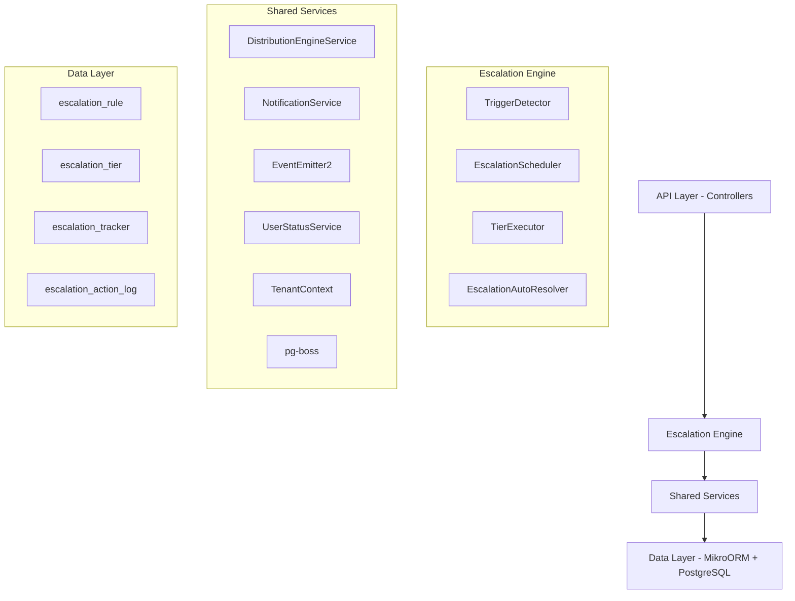

# Complete Module Specification

**Status:** Active — fully implemented  
**Module Path:** `src/modules/crm/escalation/`

## Overview

The Escalation Module automates responses when assigned leads go stale. A scheduled engine detects trigger conditions (no first contact, went cold) and executes tiered escalation actions — notifications, temperature changes, tag additions, and redistribution to new agents.

### Design Principles

<Info>
The Escalation Module follows these core architectural principles:

- **pg-boss scheduling**: Escalation scheduler uses pg-boss recurring job for reliability
- **Tiered actions**: Rules have ordered tiers with configurable delays; actions execute in sequence  
- **Auto-resolution**: Events (activity, stage change, reassignment) automatically resolve active trackers
- **Idempotency**: Partial unique index + `ON CONFLICT DO NOTHING` prevents duplicate trackers
- **Distribution delegation**: Reassignment uses the distribution engine (`REDISTRIBUTE` action), not a separate paradigm
- **RLS compliance**: All entities carry `organization_id` for row-level security
</Info>

## Architecture

### High-Level System Diagram



### Component Responsibilities

| Component | Responsibility |
|-----------|----------------|
| **EscalationScheduler** | pg-boss recurring job that runs every 60 seconds to detect new triggers and process due escalations |
| **TriggerDetector** | Scans leads for unmet conditions (no first contact, went cold); creates tracker records |
| **TierExecutor** | Executes escalation tier actions (notify, redistribute, change temp, add tag) |
| **EscalationAutoResolver** | Listens to domain events and resolves active trackers when conditions change |
| **EscalationRuleService** | CRUD for escalation rules; handles tracker cancellation on deactivation/deletion |

## Entity Specifications

### EscalationRule

Defines when and how a lead should be escalated. Evaluated by `TriggerDetector`.

<AccordionGroup>
  <Accordion title="Schema Definition">
    | Column | Type | Notes |
    |--------|------|-------|
    | id | uuid PK | |
    | organization_id | uuid FK | RLS |
    | name | varchar | Human-readable rule name |
    | is_active | bool | default true |
    | priority | int | Evaluation order |
    | trigger_type | enum | `NO_FIRST_CONTACT`, `WENT_COLD` |
    | trigger_config | jsonb | `{thresholdMinutes?, thresholdValue?, thresholdUnit?}` |
    | conditions | jsonb | `EscalationCondition[]` — AND-joined applicability filters; `[]` = all leads |
    | respect_business_hours | bool | default true. References org business hours schedule. |
    | created_by | uuid FK | |
    | created_at, updated_at | timestamp | |
    | is_deleted | bool | soft delete |
  </Accordion>

  <Accordion title="EscalationCondition Structure">
    ```typescript
    interface EscalationCondition {
      field: 'temperature' | 'leadSource' | 'language' | 'sourceChannel';
      operator: 'eq' | 'in';
      value: string | string[];
    }
    ```

    **SQL field mapping (used by `TriggerDetector.buildApplicabilityExtraWhere`):**

    | Field | SQL Column | Table | Notes |
    |-------|-----------|-------|-------|
    | `temperature` | `l.temperature` | lead | |
    | `leadSource` | `l.lead_source` | lead | |
    | `sourceChannel` | `l.source_channel` | lead | |
    | `language` | `p.language` | person | Adds `LEFT JOIN person p ON p.id = l.person_id` |
  </Accordion>
</AccordionGroup>

### EscalationTier

Each tier in an escalation rule represents a delayed action set. Tiers execute in `tier_order` sequence.

<AccordionGroup>
  <Accordion title="Schema Definition">
    | Column | Type | Notes |
    |--------|------|-------|
    | id | uuid PK | |
    | escalation_rule_id | uuid FK | |
    | organization_id | uuid FK | RLS |
    | tier_order | int | 1, 2, 3... (max 10) |
    | delay_minutes | int | Tier 1: always 0. Subsequent tiers: minutes after previous tier |
    | actions | jsonb | `TierAction[]` — see Tier Actions below |
  </Accordion>

  <Accordion title="Tier Action Types">
    | Action Type | Parameters | Resolution |
    |-------------|------------|------------|
    | `NOTIFY_AGENT` | `message?: string` | Resolved from lead's current stakeholder (assigned agent) |
    | `NOTIFY_ADMIN` | `message?: string` | **Self-resolving** — queries all org users with the `system.admin` permission key |
    | `NOTIFY_TEAM_LEAD` | `message?: string` | **Self-resolving** — queries team members with `team.admin` permission in lead's team |
    | `REDISTRIBUTE` | _(no params)_ | **Distribution engine delegation** — calls `DistributionEngineService.redistribute()` |
    | `CHANGE_TEMPERATURE` | `temperature: 'hot' \| 'warm' \| 'cold'` | **Direct entity update** — sets `lead.temperature` directly |
    | `ADD_TAG` | `tagIds: string[]` | **Direct entity update** — appends to `lead.tagIds` array |

    <Warning>
    The `REDISTRIBUTE` action must be in the **last tier only**. The API rejects rules where REDISTRIBUTE appears in intermediate tiers.
    </Warning>
  </Accordion>

  <Accordion title="Action Configuration Examples">
    ```typescript
    { "type": "NOTIFY_AGENT", "message": "Lead needs attention" }
    { "type": "NOTIFY_ADMIN", "message": "Escalation alert" }
    { "type": "NOTIFY_TEAM_LEAD" }
    { "type": "REDISTRIBUTE" }
    { "type": "CHANGE_TEMPERATURE", "temperature": "hot" }
    { "type": "ADD_TAG", "tagIds": ["tag-uuid-1", "tag-uuid-2"] }
    ```
  </Accordion>
</AccordionGroup>

### EscalationTracker

Tracks the escalation state of a specific lead against a specific rule.

<AccordionGroup>
  <Accordion title="Schema Definition">
    | Column | Type | Notes |
    |--------|------|-------|
    | id | uuid PK | |
    | lead_id | uuid FK | |
    | escalation_rule_id | uuid FK | |
    | organization_id | uuid FK | RLS |
    | current_tier | int | 0 = triggered but not escalated; increments with each tier |
    | trigger_fired_at | timestamp | when trigger condition was first detected |
    | next_escalation_at | timestamp | indexed for scheduler query; null after completion |
    | status | enum | `ACTIVE`, `RESOLVED`, `CANCELLED` |
    | resolved_at | timestamp nullable | |
    | resolved_by | enum nullable | See ResolvedBy values below |
    | history | jsonb | `TrackerHistoryEntry[]` — append-only summary |
    | created_at | timestamp | |
  </Accordion>

  <Accordion title="Key Indexes">
    | Index | Columns | Type | Notes |
    |-------|---------|------|-------|
    | `uq_escalation_tracker_lead_rule` | `(lead_id, escalation_rule_id) WHERE status = 'ACTIVE'` | Partial unique | Prevents duplicate ACTIVE trackers |
    | `idx_escalation_tracker_next_at` | `(next_escalation_at, status)` | Composite | Primary scheduler query |
    | `idx_escalation_tracker_lead` | `(lead_id, status)` | Composite | Auto-resolver lookups |
    | `idx_escalation_tracker_org_status` | `(organization_id, status)` | Composite | Per-org active counts |
  </Accordion>

  <Accordion title="Idempotency Implementation">
    <Note>
    The partial unique index provides database-level protection. `TriggerDetector` uses `INSERT ... ON CONFLICT ... DO NOTHING` to prevent duplicate tracker creation:
    </Note>

    ```sql
    INSERT INTO escalation_tracker
      (id, lead_id, escalation_rule_id, organization_id, trigger_fired_at,
       next_escalation_at, status, history, current_tier, created_at)
    VALUES (gen_random_uuid(), $1, $2, $3, $4, $5, 'ACTIVE', '[]', 0, NOW())
    ON CONFLICT (lead_id, escalation_rule_id) WHERE status = 'ACTIVE' DO NOTHING;
    ```

    <Warning>
    `TriggerDetector` must **never** use `em.persistAndFlush()` for tracker creation — always use raw `execute()` with `ON CONFLICT DO NOTHING`.
    </Warning>
  </Accordion>
</AccordionGroup>

### EscalationActionLog

Normalized table recording every escalation tier action execution. Used for analytics queries.

| Column | Type | Notes |
|--------|------|-------|
| id | uuid PK | |
| tracker_id | uuid FK | references `escalation_tracker` |
| organization_id | uuid FK | RLS |
| tier_order | int | which tier triggered this action |
| action_type | varchar | e.g., `NOTIFY_AGENT`, `REDISTRIBUTE` |
| action_params | jsonb nullable | serialized parameters |
| result | enum | `SUCCESS`, `FAILED`, `SKIPPED` |
| executed_at | timestamp | |

**Key Indexes:**
- `(organization_id, action_type)` — analytics by action type
- `(organization_id, executed_at)` — time-range queries  
- `(tracker_id)` — lookup all actions for a tracker

## Type Definitions

```typescript
enum TriggerType {
  NO_FIRST_CONTACT = 'NO_FIRST_CONTACT',
  WENT_COLD = 'WENT_COLD',
}

enum EscalationActionType {
  NOTIFY_AGENT = 'NOTIFY_AGENT',
  NOTIFY_ADMIN = 'NOTIFY_ADMIN',
  NOTIFY_TEAM_LEAD = 'NOTIFY_TEAM_LEAD',
  REDISTRIBUTE = 'REDISTRIBUTE',
  CHANGE_TEMPERATURE = 'CHANGE_TEMPERATURE',
  ADD_TAG = 'ADD_TAG',
}

enum EscalationStatus {
  ACTIVE = 'ACTIVE',
  RESOLVED = 'RESOLVED',
  CANCELLED = 'CANCELLED',
}

enum ResolvedBy {
  MANUAL = 'MANUAL',
  AUTO_ACTIVITY = 'AUTO_ACTIVITY',
  AUTO_STAGE_CHANGE = 'AUTO_STAGE_CHANGE',
  AUTO_REASSIGNMENT = 'AUTO_REASSIGNMENT',
  AUTO_ARCHIVED = 'AUTO_ARCHIVED',
  AUTO_DELETED = 'AUTO_DELETED',
  AUTO_ORPHANED = 'AUTO_ORPHANED',
  REDISTRIBUTED = 'REDISTRIBUTED',
}

enum ActionResult {
  SUCCESS = 'SUCCESS',
  FAILED = 'FAILED',
  SKIPPED = 'SKIPPED',
}
```

### ResolvedBy Values

| Value | Description |
|-------|-------------|
| `MANUAL` | User explicitly resolved via UI/API |
| `AUTO_ACTIVITY` | New activity added to lead |
| `AUTO_STAGE_CHANGE` | Lead moved to different stage |
| `AUTO_REASSIGNMENT` | Lead reassigned to different agent |
| `AUTO_ARCHIVED` | Lead was archived |
| `AUTO_DELETED` | Lead was soft deleted |
| `AUTO_ORPHANED` | Lead stakeholders removed |
| `REDISTRIBUTED` | Redistribution action completed successfully |

## Escalation Engine

The escalation engine consists of several coordinated components that detect triggers, execute actions, and manage escalation lifecycles.

### EscalationScheduler

<Steps>
  <Step title="Job Registration">
    Registers a recurring pg-boss job that runs every 60 seconds:
    ```typescript
    await this.pgBoss.schedule(
      'escalation-processor',
      '*/1 * * * *', // every minute
      {},
      { tz: 'UTC' }
    );
    ```
  </Step>

  <Step title="Trigger Detection">
    Scans for new escalation triggers using `TriggerDetector.detectAndCreateTrackers()`
  </Step>

  <Step title="Due Processing">
    Processes escalations due for execution using `TierExecutor.processDueEscalations()`
  </Step>

  <Step title="Error Handling">
    Implements retry logic and error logging for failed escalations
  </Step>
</Steps>

### TriggerDetector

Responsible for scanning leads and creating escalation trackers when trigger conditions are met.

<Tabs>
  <Tab title="NO_FIRST_CONTACT Detection">
    ```sql
    SELECT DISTINCT l.id, l.organization_id
    FROM lead l
    LEFT JOIN activity a ON a.lead_id = l.id 
      AND a.created_at > l.assigned_at
      AND a.organization_id = l.organization_id
    WHERE l.assigned_at IS NOT NULL
      AND l.assigned_at <= $thresholdTime
      AND a.id IS NULL
      AND l.stage != 'archived'
      AND l.is_deleted = false
      AND l.organization_id = $orgId
    ```
  </Tab>

  <Tab title="WENT_COLD Detection">
    ```sql
    SELECT DISTINCT l.id, l.organization_id
    FROM lead l
    WHERE l.temperature = 'cold'
      AND l.updated_at <= $thresholdTime
      AND l.stage != 'archived'
      AND l.is_deleted = false
      AND l.organization_id = $orgId
    ```
  </Tab>

  <Tab title="Condition Filtering">
    Additional WHERE clauses are built for escalation rule conditions:
    ```typescript
    private buildApplicabilityExtraWhere(
      conditions: EscalationCondition[]
    ): { whereClause: string; bindings: any[]; joinClauses: string[] }
    ```
  </Tab>
</Tabs>

### TierExecutor

Processes escalations that are due for execution and runs the configured tier actions.

<CodeGroup>
```typescript Core Execution Flow
async processDueEscalations(orgId: string): Promise<void> {
  const dueTrackers = await this.findDueTrackers(orgId);
  
  for (const tracker of dueTrackers) {
    const rule = await this.findRuleWithTiers(tracker.escalation_rule_id);
    const currentTier = rule.tiers.find(t => t.tier_order === tracker.current_tier + 1);
    
    if (currentTier) {
      await this.executeTier(tracker, currentTier, rule);
    }
  }
}
```

```typescript Action Execution
private async executeAction(
  action: TierAction,
  tracker: EscalationTracker,
  tier: EscalationTier
): Promise<ActionResult> {
  switch (action.type) {
    case EscalationActionType.NOTIFY_AGENT:
      return await this.executeNotifyAgent(tracker, action.message);
      
    case EscalationActionType.REDISTRIBUTE:
      return await this.executeRedistribute(tracker);
      
    case EscalationActionType.CHANGE_TEMPERATURE:
      return await this.executeChangeTemperature(tracker, action.temperature);
      
    // ... other action types
  }
}
```
</CodeGroup>

### EscalationAutoResolver

Listens to domain events and automatically resolves active escalation trackers when conditions change.

<Info>
The auto-resolver responds to these events:
- `activity.created` → resolves with `AUTO_ACTIVITY`
- `lead.stage_changed` → resolves with `AUTO_STAGE_CHANGE`  
- `lead.stakeholder_assigned` → resolves with `AUTO_REASSIGNMENT`
- `lead.archived` → resolves with `AUTO_ARCHIVED`
- `lead.deleted` → resolves with `AUTO_DELETED`
- `lead.stakeholder_removed` → resolves with `AUTO_ORPHANED`
</Info>

## API Endpoints

### Escalation Rules API

<AccordionGroup>
  <Accordion title="POST /escalation-rules">
    **Create Escalation Rule**

    ```typescript
    interface CreateEscalationRuleDto {
      name: string;
      triggerType: TriggerType;
      triggerConfig: {
        thresholdMinutes?: number;
        thresholdValue?: number; 
        thresholdUnit?: string;
      };
      conditions: EscalationCondition[];
      respectBusinessHours: boolean;
      tiers: CreateEscalationTierDto[];
    }
    ```

    **Validation Rules:**
    - Maximum 10 tiers per rule
    - Tier 1 must have `delay_minutes = 0`
    - `REDISTRIBUTE` action only allowed in final tier
    - All tier orders must be sequential (1, 2, 3...)
  </Accordion>

  <Accordion title="GET /escalation-rules">
    **List Escalation Rules**
    
    Query parameters:
    - `isActive?: boolean`
    - `triggerType?: TriggerType`
    - `page?: number`
    - `limit?: number`

    Returns paginated list with embedded tiers and action counts.
  </Accordion>

  <Accordion title="PUT /escalation-rules/:id">
    **Update Escalation Rule**

    <Warning>
    Updating an active rule with existing trackers will cancel all ACTIVE trackers for that rule and trigger re-evaluation.
    </Warning>
  </Accordion>

  <Accordion title="DELETE /escalation-rules/:id">
    **Soft Delete Rule**
    
    Sets `is_deleted = true` and cancels all active trackers.
  </Accordion>
</AccordionGroup>

### Escalation Analytics API

<AccordionGroup>
  <Accordion title="GET /escalation-analytics/summary">
    **Analytics Summary**

    ```typescript
    interface EscalationSummaryResponse {
      totalActiveTrackers: number;
      totalRules: number;
      activeRules: number;
      recentEscalations: {
        last24h: number;
        last7d: number;
        last30d: number;
      };
      actionBreakdown: {
        [actionType: string]: number;
      };
    }
    ```
  </Accordion>

  <Accordion title="GET /escalation-analytics/tracker-metrics">
    **Tracker Metrics**
    
    Query parameters:
    - `startDate?: string`
    - `endDate?: string`
    - `ruleId?: string`
    - `resolvedBy?: ResolvedBy`

    Returns time-series data and resolution statistics.
  </Accordion>
</AccordionGroup>

## Security & Permissions

### Permission Requirements

<CardGroup cols={2}>
  <Card title="Read Operations" icon="eye">
    - `escalation.rule.read`
    - `escalation.analytics.read`
  </Card>
  
  <Card title="Write Operations" icon="pencil">
    - `escalation.rule.create`
    - `escalation.rule.update` 
    - `escalation.rule.delete`
  </Card>
</CardGroup>

### Row Level Security (RLS)

All escalation entities implement RLS policies based on `organization_id`:

```sql
-- Example RLS policy for escalation_rule
CREATE POLICY escalation_rule_org_isolation ON escalation_rule
  FOR ALL TO authenticated
  USING (organization_id = current_setting('app.current_organization_id')::uuid);
```

<Note>
The escalation engine uses `TenantContext.executeInOrgContext()` to ensure all database queries operate within the correct organizational boundary.
</Note>

## Analytics & Metrics

### Key Performance Indicators

| Metric | Description | Query Source |
|--------|-------------|--------------|
| **Active Trackers** | Current count of ACTIVE escalation trackers | `escalation_tracker` WHERE `status = 'ACTIVE'` |
| **Resolution Rate** | Percentage of trackers resolved within 24h | Time-based analysis of `resolved_at` vs `trigger_fired_at` |
| **Action Effectiveness** | Success rate by action type | `escalation_action_log` grouped by `action_type` and `result` |
| **Auto-Resolution Distribution** | Breakdown by `resolved_by` values | `escalation_tracker` WHERE `status = 'RESOLVED'` |

### Time-Series Analytics

<Steps>
  <Step title="Data Collection">
    `EscalationActionLog` captures all action executions with timestamps
  </Step>
  
  <Step title="Aggregation">
    Analytics service provides daily/weekly/monthly rollups
  </Step>
  
  <Step title="Visualization">
    Frontend dashboard displays trends and effectiveness metrics
  </Step>
</Steps>

## Edge Case Handling

### Lead State Changes

<AccordionGroup>
  <Accordion title="Lead Archived During Escalation">
    **Behavior**: Auto-resolver detects `lead.archived` event and resolves tracker with `resolvedBy = AUTO_ARCHIVED`
    
    **Implementation**: Event listener in `EscalationAutoResolver` handles immediate resolution
  </Accordion>

  <Accordion title="Lead Reassigned During Escalation">
    **Behavior**: Auto-resolver detects stakeholder change and resolves tracker with `resolvedBy = AUTO_REASSIGNMENT`
    
    **Note**: This covers both direct reassignment and redistribution outcomes
  </Accordion>

  <Accordion title="Rule Deactivated With Active Trackers">
    **Behavior**: `EscalationRuleService.deactivateRule()` cancels all ACTIVE trackers for that rule
    
    **Implementation**: Bulk update sets `status = 'CANCELLED'`
  </Accordion>
</AccordionGroup>

### Business Hours Handling

<Warning>
When `respect_business_hours = true`, escalation timing calculations must account for organization business hours schedules.
</Warning>

The scheduler checks business hours during:
- Initial trigger threshold calculations
- Tier delay timing
- Next escalation scheduling

### Notification Failures

<AccordionGroup>
  <Accordion title="No Recipients Found">
    **Scenario**: `NOTIFY_ADMIN` action when no admin users exist
    
    **Behavior**: Action logs as `SKIPPED`, escalation continues to next action
  </Accordion>

  <Accordion title="Notification Service Down">
    **Scenario**: External notification service unavailable
    
    **Behavior**: Action logs as `FAILED`, escalation continues but failure is tracked
  </Accordion>
</AccordionGroup>

### Redistribution Edge Cases

<AccordionGroup>
  <Accordion title="No Available Agents">
    **Scenario**: Distribution engine cannot find suitable assignee
    
    **Behavior**: 
    - Distribution logs outcome as `NO_AGENTS_AVAILABLE`
    - Escalation tracker remains ACTIVE 
    - Next scheduler run will retry the redistribution
  </Accordion>

  <Accordion title="Redistribution to Same Agent">
    **Scenario**: Distribution engine assigns back to original agent
    
    **Behavior**: 
    - Distribution succeeds normally
    - Escalation tracker resolves with `REDISTRIBUTED`
    - This is valid behavior (may indicate insufficient agent pool)
  </Accordion>
</AccordionGroup>

## Performance & Scaling

### Database Optimization

<Tabs>
  <Tab title="Query Optimization">
    **Scheduler Performance**: 
    - Primary query uses `(next_escalation_at, status)` index
    - Processes escalations in batches of 100
    - Uses `LIMIT` to prevent long-running transactions

    ```sql
    SELECT * FROM escalation_tracker 
    WHERE next_escalation_at <= NOW() 
      AND status = 'ACTIVE'
      AND organization_id = $1
    ORDER BY next_escalation_at ASC 
    LIMIT 100;
    ```
  </Tab>

  <Tab title="Trigger Detection">
    **Lead Scanning Optimization**:
    - Separate queries per trigger type (NO_FIRST_CONTACT vs WENT_COLD)
    - Uses lead table indexes on `(assigned_at, stage, is_deleted)`
    - Activity join optimized with `(lead_id, created_at)` index
  </Tab>

  <Tab title="Analytics Queries">
    **Action Log Analysis**:
    - Composite indexes on `(organization_id, executed_at)`
    - Time-range queries use date partitioning where possible
    - Aggregation queries leverage `action_type` index
  </Tab>
</Tabs>

### Memory Management

<Info>
**Batch Processing**: All escalation operations use batched queries to prevent memory exhaustion with large datasets.

**Entity Loading**: Services use `em.find()` with specific field selection rather than full entity hydration where possible.

**Event Handling**: Auto-resolver processes events asynchronously to prevent blocking the main request thread.
</Info>

### Monitoring & Alerting

<Steps>
  <Step title="Job Health Monitoring">
    pg-boss provides job execution metrics and failure tracking
  </Step>
  
  <Step title="Performance Metrics">
    - Scheduler execution time per organization
    - Average escalation processing time
    - Action success/failure rates
  </Step>
  
  <Step title="Business Metrics">
    - Escalation volume trends
    - Resolution time distributions
    - Rule effectiveness analysis
  </Step>
</Steps>

## Module Structure

```
src/modules/crm/escalation/
├── controllers/
│   ├── escalation-rule.controller.ts
│   └── escalation-analytics.controller.ts
├── entities/
│   ├── escalation-rule.entity.ts
│   ├── escalation-tier.entity.ts  
│   ├── escalation-tracker.entity.ts
│   └── escalation-action-log.entity.ts
├── services/
│   ├── escalation-rule.service.ts
│   ├── escalation-scheduler.service.ts
│   ├── trigger-detector.service.ts
│   ├── tier-executor.service.ts
│   ├── escalation-auto-resolver.service.ts
│   └── escalation-analytics.service.ts
├── dtos/
│   ├── create-escalation-rule.dto.ts
│   ├── update-escalation-rule.dto.ts
│   └── escalation-analytics.dto.ts
├── types/
│   ├── escalation.types.ts
│   └── escalation-action.types.ts
└── escalation.module.ts
```

## Integration Points

<CardGroup cols={2}>
  <Card title="Distribution Engine" icon="shuffle">
    **Purpose**: Handles lead redistribution via `REDISTRIBUTE` action
    
    **Interface**: `DistributionEngineService.redistribute(leadId, excludeAgentId?)`
  </Card>

  <Card title="Notification Service" icon="bell">
    **Purpose**: Sends escalation notifications to agents, admins, team leads
    
    **Interface**: `NotificationService.send(recipients, message, type)`
  </Card>

  <Card title="User Management" icon="users">
    **Purpose**: Resolves notification recipients based on roles and permissions
    
    **Interface**: Permission-based queries for admin and team lead resolution
  </Card>

  <Card title="Activity Tracking" icon="activity">
    **Purpose**: Auto-resolution triggers when new activities are created
    
    **Interface**: Event-driven via `activity.created` domain events
  </Card>
</CardGroup>

<Note>
All integrations respect organizational boundaries and use the same RLS policies as the escalation module for data isolation.
</Note>