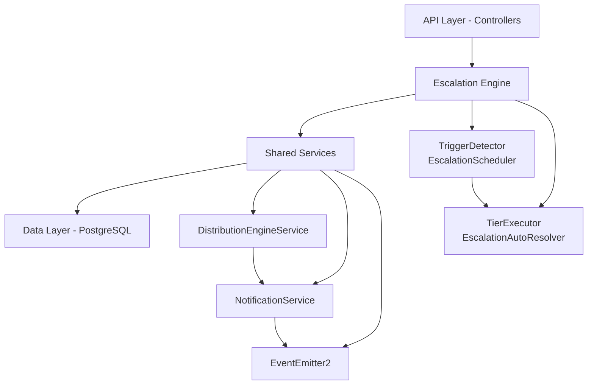

## Overview

The Escalation Module automates responses when assigned leads go stale. A scheduled engine detects trigger conditions (no first contact, went cold) and executes tiered escalation actions — notifications, temperature changes, tag additions, and redistribution to new agents.

<Info>
This module is **fully implemented** and active at path `src/modules/crm/escalation/`
</Info>

### Design Principles

| Principle | Decision |
|-----------|----------|
| **pg-boss scheduling** | Escalation scheduler uses pg-boss recurring job for reliability |
| **Tiered actions** | Rules have ordered tiers with configurable delays; actions execute in sequence |
| **Auto-resolution** | Events (activity, stage change, reassignment) automatically resolve active trackers |
| **Idempotency** | Partial unique index + `ON CONFLICT DO NOTHING` prevents duplicate trackers |
| **Distribution delegation** | Reassignment uses the distribution engine (`REDISTRIBUTE` action), not a separate paradigm |
| **RLS compliance** | All entities carry `organization_id` for row-level security |

## Architecture

### High-Level System Design



### Component Responsibilities

<AccordionGroup>
<Accordion title="EscalationScheduler">
pg-boss recurring job that runs every 60 seconds to detect new triggers and process due escalations
</Accordion>

<Accordion title="TriggerDetector">
Scans leads for unmet conditions (no first contact, went cold); creates tracker records
</Accordion>

<Accordion title="TierExecutor">
Executes escalation tier actions (notify, redistribute, change temp, add tag)
</Accordion>

<Accordion title="EscalationAutoResolver">
Listens to domain events and resolves active trackers when conditions change
</Accordion>

<Accordion title="EscalationRuleService">
CRUD for escalation rules; handles tracker cancellation on deactivation/deletion
</Accordion>
</AccordionGroup>

## Entity Specifications

### EscalationRule

Defines when and how a lead should be escalated. Evaluated by `TriggerDetector`.

| Column | Type | Notes |
|--------|------|-------|
| `id` | uuid PK | Primary key |
| `organization_id` | uuid FK | RLS compliance |
| `name` | varchar | Human-readable rule name |
| `is_active` | bool | Default true |
| `priority` | int | Evaluation order |
| `trigger_type` | enum | `NO_FIRST_CONTACT`, `WENT_COLD` |
| `trigger_config` | jsonb | `{thresholdMinutes?, thresholdValue?, thresholdUnit?}` |
| `conditions` | jsonb | `EscalationCondition[]` — AND-joined filters |
| `respect_business_hours` | bool | Default true, references org business hours |
| `created_by` | uuid FK | User who created the rule |
| `created_at, updated_at` | timestamp | Audit fields |
| `is_deleted` | bool | Soft delete flag |

<Note>
**EscalationCondition shape:**
```typescript
interface EscalationCondition {
  field: 'temperature' | 'leadSource' | 'language' | 'sourceChannel';
  operator: 'eq' | 'in';
  value: string | string[];
}
```
</Note>

#### SQL Field Mapping

Used by `TriggerDetector.buildApplicabilityExtraWhere`:

| Field | SQL Column | Table | Notes |
|-------|------------|-------|-------|
| `temperature` | `l.temperature` | lead | |
| `leadSource` | `l.lead_source` | lead | |
| `sourceChannel` | `l.source_channel` | lead | |
| `language` | `p.language` | person | Requires JOIN |

### EscalationTier

Each tier represents a delayed action set that executes in `tier_order` sequence.

| Column | Type | Notes |
|--------|------|-------|
| `id` | uuid PK | Primary key |
| `escalation_rule_id` | uuid FK | Parent rule reference |
| `organization_id` | uuid FK | RLS compliance |
| `tier_order` | int | 1, 2, 3... (max 10) |
| `delay_minutes` | int | Tier 1: always 0; others: minutes after previous tier |
| `actions` | jsonb | `TierAction[]` array |

<Warning>
**Tier 1 timing:** The first tier (lowest `tier_order`) always has `delay_minutes = 0` — the threshold is the sole timing control.
</Warning>

### Tier Action Types

<Tabs>
<Tab title="Notification Actions">

| Action Type | Parameters | Resolution |
|-------------|------------|------------|
| `NOTIFY_AGENT` | `message?: string` | Resolved from lead's current stakeholder |
| `NOTIFY_ADMIN` | `message?: string` | Self-resolving — queries org users with `system.admin` permission |
| `NOTIFY_TEAM_LEAD` | `message?: string` | Self-resolving — queries team members with `team.admin` permission |

</Tab>

<Tab title="State Change Actions">

| Action Type | Parameters | Effect |
|-------------|------------|---------|
| `REDISTRIBUTE` | _(no params)_ | Removes current stakeholders, calls distribution engine |
| `CHANGE_TEMPERATURE` | `temperature: string` | Updates lead temperature |
| `ADD_TAG` | `tagName: string` | Adds tag to lead |

</Tab>
</Tabs>

### EscalationTracker

Tracks active escalation processes for individual leads.

| Column | Type | Notes |
|--------|------|-------|
| `id` | uuid PK | Primary key |
| `organization_id` | uuid FK | RLS compliance |
| `lead_id` | uuid FK | Target lead |
| `escalation_rule_id` | uuid FK | Applied rule |
| `current_tier` | int | Current tier being processed |
| `next_tier_due_at` | timestamp | When next tier should execute |
| `status` | enum | `ACTIVE`, `RESOLVED`, `CANCELLED` |
| `resolved_by` | enum | Resolution reason |
| `resolved_at` | timestamp | Resolution timestamp |
| `created_at` | timestamp | Tracker creation time |

<Check>
**Idempotency:** Partial unique index on `(lead_id, escalation_rule_id)` WHERE `status = 'ACTIVE'` prevents duplicates.
</Check>

## Escalation Engine

### Trigger Detection

<Steps>
<Step title="Schedule Execution">
pg-boss recurring job runs every 60 seconds
</Step>

<Step title="Rule Evaluation">
For each active escalation rule, scan leads matching conditions
</Step>

<Step title="Threshold Checking">
Check if leads meet trigger thresholds (time-based conditions)
</Step>

<Step title="Tracker Creation">
Create `EscalationTracker` records for qualifying leads
</Step>
</Steps>

#### Trigger Types

<CodeGroup>
```typescript NO_FIRST_CONTACT
// Detects leads with no activities after assignment
interface NoFirstContactTrigger {
  type: 'NO_FIRST_CONTACT';
  config: {
    thresholdMinutes: number;
  };
}
```

```typescript WENT_COLD
// Detects leads with no recent activities
interface WentColdTrigger {
  type: 'WENT_COLD';
  config: {
    thresholdValue: number;
    thresholdUnit: 'MINUTES' | 'HOURS' | 'DAYS';
  };
}
```
</CodeGroup>

### Tier Execution

When a tier becomes due, the `TierExecutor` processes all actions in the tier:

<Tabs>
<Tab title="Notification Flow">
1. **User Resolution:** Determine target users based on action type
2. **Message Generation:** Use custom message or default template
3. **Delivery:** Send via `NotificationService`
4. **Logging:** Record action in `escalation_action_log`
</Tab>

<Tab title="State Change Flow">
1. **Validation:** Ensure lead still exists and is valid
2. **Action Execution:** Apply temperature change, add tags, etc.
3. **Event Emission:** Trigger domain events for downstream processing
4. **Logging:** Record action execution
</Tab>

<Tab title="Redistribution Flow">
1. **Stakeholder Removal:** Clear current lead assignments
2. **Distribution Call:** Invoke `DistributionEngineService.redistribute()`
3. **Outcome Handling:** If assigned, resolve tracker as `REDISTRIBUTED`
4. **Logging:** Record distribution attempt and result
</Tab>
</Tabs>

### Auto-Resolution

The `EscalationAutoResolver` listens for domain events and automatically resolves trackers:

| Event Type | Resolution Trigger | Resolved By |
|------------|-------------------|-------------|
| Lead activity created | Any new activity | `ACTIVITY_CREATED` |
| Lead stage changed | Stage advancement | `STAGE_CHANGED` |
| Lead reassigned | New stakeholder assignment | `REASSIGNED` |
| Lead closed/converted | Final stage reached | `LEAD_CLOSED` |

## API Endpoints

### Escalation Rules Management

<CodeGroup>
```typescript GET /escalation/rules
// List escalation rules with filtering and pagination
interface ListRulesQuery {
  isActive?: boolean;
  triggerType?: 'NO_FIRST_CONTACT' | 'WENT_COLD';
  page?: number;
  limit?: number;
}
```

```typescript POST /escalation/rules
// Create new escalation rule
interface CreateRuleBody {
  name: string;
  triggerType: 'NO_FIRST_CONTACT' | 'WENT_COLD';
  triggerConfig: TriggerConfig;
  conditions: EscalationCondition[];
  respectBusinessHours?: boolean;
  tiers: CreateTierDto[];
}
```

```typescript PUT /escalation/rules/:id
// Update existing rule (deactivates active trackers)
interface UpdateRuleBody extends Partial<CreateRuleBody> {}
```

```typescript DELETE /escalation/rules/:id
// Soft delete rule and cancel active trackers
```
</CodeGroup>

### Analytics & Monitoring

<CodeGroup>
```typescript GET /escalation/analytics/summary
// Get escalation performance metrics
interface AnalyticsSummary {
  totalRules: number;
  activeTrackers: number;
  resolvedToday: number;
  avgResolutionTime: number;
}
```

```typescript GET /escalation/analytics/rule-performance
// Performance metrics per rule
interface RulePerformance {
  ruleId: string;
  ruleName: string;
  triggeredCount: number;
  resolvedCount: number;
  avgTiersExecuted: number;
  resolutionBreakdown: Record<string, number>;
}
```

```typescript GET /escalation/trackers
// List active/recent escalation trackers
interface ListTrackersQuery {
  status?: 'ACTIVE' | 'RESOLVED' | 'CANCELLED';
  leadId?: string;
  ruleId?: string;
  dateRange?: [string, string];
}
```
</CodeGroup>

## Security & Permissions

### Permission Requirements

| Action | Required Permission | Notes |
|--------|-------------------|-------|
| View escalation rules | `escalation.view` | Read-only access |
| Create/edit rules | `escalation.manage` | Full CRUD operations |
| View analytics | `escalation.analytics` | Performance metrics |
| Cancel trackers | `escalation.manage` | Emergency stops |

### Row-Level Security

<Note>
All escalation entities include `organization_id` for RLS enforcement. Users can only access escalations within their organization context.
</Note>

```sql
-- Example RLS policy
CREATE POLICY escalation_rule_org_policy ON escalation_rule
  FOR ALL TO authenticated
  USING (organization_id = get_current_org_id());
```

## Analytics & Metrics

### Key Performance Indicators

<CardGroup cols={2}>
<Card title="Rule Effectiveness" icon="chart-line">
- Trigger rate per rule
- Resolution success rate
- Average tiers executed
- Time to resolution
</Card>

<Card title="System Health" icon="heartbeat">
- Active tracker count
- Processing latency
- Error rates
- Queue depth
</Card>

<Card title="Lead Impact" icon="user-clock">
- Leads escalated per day
- Resolution method distribution
- Re-escalation rates
- Agent response times
</Card>

<Card title="Business Value" icon="dollar-sign">
- Prevented lead loss
- Agent productivity
- Response time improvements
- Conversion rate impact
</Card>
</CardGroup>

### Reporting Queries

<CodeGroup>
```sql Daily Summary
SELECT 
  DATE(created_at) as date,
  COUNT(*) as trackers_created,
  COUNT(*) FILTER (WHERE status = 'RESOLVED') as resolved_count,
  AVG(EXTRACT(EPOCH FROM (resolved_at - created_at))/60) as avg_resolution_minutes
FROM escalation_tracker 
WHERE created_at >= CURRENT_DATE - INTERVAL '30 days'
GROUP BY DATE(created_at)
ORDER BY date DESC;
```

```sql Rule Performance
SELECT 
  er.name,
  COUNT(et.*) as total_triggers,
  COUNT(*) FILTER (WHERE et.status = 'RESOLVED') as resolved,
  COUNT(*) FILTER (WHERE et.resolved_by = 'REDISTRIBUTED') as redistributed,
  AVG(et.current_tier) as avg_tiers_reached
FROM escalation_rule er
LEFT JOIN escalation_tracker et ON et.escalation_rule_id = er.id
WHERE er.is_active = true
GROUP BY er.id, er.name;
```
</CodeGroup>

## Edge Case Handling

### Race Conditions

<Warning>
**Concurrent Processing:** The scheduler uses database-level locking to prevent multiple instances from processing the same trackers simultaneously.
</Warning>

<Tabs>
<Tab title="Tracker Creation">
```sql
-- Atomic tracker creation with conflict resolution
INSERT INTO escalation_tracker (lead_id, escalation_rule_id, ...)
VALUES (?, ?, ...)
ON CONFLICT (lead_id, escalation_rule_id) 
WHERE status = 'ACTIVE'
DO NOTHING;
```
</Tab>

<Tab title="Resolution Racing">
- Auto-resolver events are idempotent
- Multiple resolution attempts are handled gracefully
- Last resolution reason wins
</Tab>
</Tabs>

### Error Recovery

| Scenario | Handling | Recovery |
|----------|----------|----------|
| Notification failure | Log error, continue processing | Retry on next cycle |
| Distribution failure | Log error, don't resolve tracker | Manual intervention |
| Database deadlock | Transaction rollback | Automatic retry |
| Rule deletion during processing | Skip processing, log warning | Graceful degradation |

### Business Hours Handling

<Info>
When `respectBusinessHours = true`, escalations pause outside business hours and resume when business hours start again.
</Info>

```typescript
// Business hours calculation example
if (rule.respectBusinessHours && !isWithinBusinessHours(now, orgBusinessHours)) {
  // Defer execution to next business hour
  nextDueAt = getNextBusinessHour(orgBusinessHours);
}
```

## Performance & Scaling

### Optimization Strategies

<Steps>
<Step title="Database Indexing">
Strategic indexes on `lead_id`, `organization_id`, and timestamp columns for efficient querying
</Step>

<Step title="Batch Processing">
Process multiple trackers in batches to reduce database roundtrips
</Step>

<Step title="Conditional Execution">
Skip processing for inactive rules or already-resolved trackers
</Step>

<Step title="Connection Pooling">
Efficient database connection management for high-throughput scenarios
</Step>
</Steps>

### Scaling Considerations

| Metric | Threshold | Action |
|--------|-----------|--------|
| Active trackers | > 10,000 | Consider horizontal partitioning |
| Processing latency | > 5 minutes | Increase scheduler frequency |
| Error rate | > 5% | Alert and investigate |
| Queue depth | > 1,000 | Scale worker instances |

## Integration Points

### Distribution Engine Integration

The escalation module delegates lead redistribution to the existing distribution engine:

```typescript
// Redistribution flow
await this.distributionEngineService.redistribute({
  leadId: tracker.lead_id,
  excludeAgents: [currentAgentId],
  reason: 'ESCALATION_REDISTRIBUTION',
  organizationId: tracker.organization_id
});
```

### Notification System Integration

All escalation notifications flow through the centralized notification service:

```typescript
// Notification dispatch
await this.notificationService.send({
  recipientId: agentId,
  type: 'ESCALATION_ALERT',
  title: 'Lead Escalation',
  message: customMessage || defaultTemplate,
  metadata: { leadId, ruleId, tierNumber }
});
```

### Event System Integration

<Tip>
The module both emits and listens to domain events for loose coupling with other CRM modules.
</Tip>

**Emitted Events:**
- `escalation.tracker.created`
- `escalation.tier.executed`
- `escalation.tracker.resolved`

**Consumed Events:**
- `lead.activity.created`
- `lead.stage.changed`
- `lead.reassigned`
- `lead.closed`