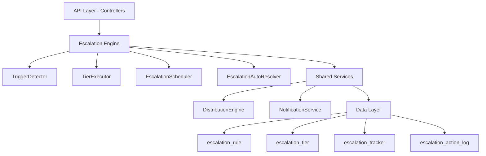

## Overview

The Escalation Module automates responses when assigned leads go stale. A scheduled engine detects trigger conditions (no first contact, went cold) and executes tiered escalation actions — notifications, temperature changes, tag additions, and redistribution to new agents.

<Info>
The escalation module is fully implemented and active at module path: `src/modules/crm/escalation/`
</Info>

### Design Principles

The escalation system follows these core architectural decisions:

<CardGroup cols={2}>
  <Card title="pg-boss Scheduling" icon="clock">
    Escalation scheduler uses pg-boss recurring job for reliability
  </Card>
  <Card title="Tiered Actions" icon="layer-group">
    Rules have ordered tiers with configurable delays; actions execute in sequence
  </Card>
  <Card title="Auto-resolution" icon="check-circle">
    Events (activity, stage change, reassignment) automatically resolve active trackers
  </Card>
  <Card title="Idempotency" icon="shield-halved">
    Partial unique index + `ON CONFLICT DO NOTHING` prevents duplicate trackers
  </Card>
</CardGroup>

## Architecture

### High-Level System Diagram



### Component Responsibilities

<AccordionGroup>
  <Accordion title="EscalationScheduler">
    pg-boss recurring job that runs every 60 seconds to detect new triggers and process due escalations
  </Accordion>
  <Accordion title="TriggerDetector">
    Scans leads for unmet conditions (no first contact, went cold); creates tracker records
  </Accordion>
  <Accordion title="TierExecutor">
    Executes escalation tier actions (notify, redistribute, change temp, add tag)
  </Accordion>
  <Accordion title="EscalationAutoResolver">
    Listens to domain events and resolves active trackers when conditions change
  </Accordion>
  <Accordion title="EscalationRuleService">
    CRUD for escalation rules; handles tracker cancellation on deactivation/deletion
  </Accordion>
</AccordionGroup>

## Entity Specifications

### EscalationRule

Defines when and how a lead should be escalated. Evaluated by `TriggerDetector`.

| Column | Type | Notes |
|--------|------|-------|
| `id` | uuid PK | Primary key |
| `organization_id` | uuid FK | RLS compliance |
| `name` | varchar | Human-readable rule name |
| `is_active` | bool | default true |
| `priority` | int | Evaluation order |
| `trigger_type` | enum | `NO_FIRST_CONTACT`, `WENT_COLD` |
| `trigger_config` | jsonb | Configuration object |
| `conditions` | jsonb | AND-joined applicability filters |
| `respect_business_hours` | bool | default true |
| `created_by` | uuid FK | User who created the rule |
| `created_at, updated_at` | timestamp | Audit fields |
| `is_deleted` | bool | Soft delete flag |

<Note>
The `conditions` field contains an array of `EscalationCondition` objects that are AND-joined. An empty array `[]` means the rule applies to all leads.
</Note>

#### EscalationCondition Structure

```typescript
interface EscalationCondition {
  field: 'temperature' | 'leadSource' | 'language' | 'sourceChannel';
  operator: 'eq' | 'in';
  value: string | string[];
}
```

#### SQL Field Mapping

| Field | SQL Column | Table | Notes |
|-------|-----------|-------|-------|
| `temperature` | `l.temperature` | lead | Direct mapping |
| `leadSource` | `l.lead_source` | lead | Direct mapping |
| `sourceChannel` | `l.source_channel` | lead | Direct mapping |
| `language` | `p.language` | person | Requires JOIN with person table |

### EscalationTier

Each tier represents a delayed action set that executes in `tier_order` sequence.

| Column | Type | Notes |
|--------|------|-------|
| `id` | uuid PK | Primary key |
| `escalation_rule_id` | uuid FK | Parent rule reference |
| `organization_id` | uuid FK | RLS compliance |
| `tier_order` | int | 1, 2, 3... (max 10) |
| `delay_minutes` | int | Delay after previous tier |
| `actions` | jsonb | Array of `TierAction` objects |

<Warning>
Tier 1 (lowest `tier_order`) must always have `delay_minutes = 0`. The threshold is controlled by the rule's trigger configuration, not the tier delay.
</Warning>

#### Tier Action Types

<Tabs>
  <Tab title="Notification Actions">
    **NOTIFY_AGENT**
    - Parameters: `message?: string`
    - Target: Lead's current assigned agent

    **NOTIFY_ADMIN**
    - Parameters: `message?: string`
    - Target: All org users with `system.admin` permission
    - Self-resolving: Skipped if no admin users found

    **NOTIFY_TEAM_LEAD**
    - Parameters: `message?: string`
    - Target: All team members with `team.admin` permission
    - Self-resolving: Skipped if no team or team leaders
  </Tab>
  <Tab title="Redistribution Actions">
    **REDISTRIBUTE**
    - Parameters: None
    - Behavior: Removes current stakeholders and calls distribution engine
    - Constraint: Must be in the last tier only
    - Auto-resolves tracker on successful assignment
  </Tab>
  <Tab title="Data Actions">
    **CHANGE_TEMPERATURE**
    - Parameters: `temperature: 'hot' | 'warm' | 'cold'`
    - Behavior: Direct entity update bypassing validation guards

    **ADD_TAG**
    - Parameters: `tagIds: string[]`
    - Behavior: Appends to `lead.tagIds` with deduplication
  </Tab>
</Tabs>

### EscalationTracker

Tracks the escalation state of a specific lead against a specific rule.

| Column | Type | Notes |
|--------|------|-------|
| `id` | uuid PK | Primary key |
| `lead_id` | uuid FK | Target lead |
| `escalation_rule_id` | uuid FK | Applied rule |
| `organization_id` | uuid FK | RLS compliance |
| `current_tier` | int | 0 = triggered, increments with each tier |
| `trigger_fired_at` | timestamp | Initial trigger detection |
| `next_escalation_at` | timestamp | Scheduled next action time |
| `status` | enum | `ACTIVE`, `RESOLVED`, `CANCELLED` |
| `resolved_at` | timestamp nullable | Resolution timestamp |
| `resolved_by` | enum nullable | Resolution reason |
| `history` | jsonb | Append-only tracker history |
| `created_at` | timestamp | Creation timestamp |

#### Key Indexes

<CodeGroup>
```sql Idempotency Index
CREATE UNIQUE INDEX uq_escalation_tracker_lead_rule 
ON escalation_tracker (lead_id, escalation_rule_id) 
WHERE status = 'ACTIVE';
```

```sql Scheduler Index
CREATE INDEX idx_escalation_tracker_next_at 
ON escalation_tracker (next_escalation_at, status);
```

```sql Auto-resolver Index
CREATE INDEX idx_escalation_tracker_lead 
ON escalation_tracker (lead_id, status);
```
</CodeGroup>

<Tip>
The partial unique index ensures only one ACTIVE tracker exists per lead+rule combination, enabling idempotent tracker creation with `ON CONFLICT DO NOTHING`.
</Tip>

### EscalationActionLog

Normalized table recording every escalation tier action execution for analytics.

| Column | Type | Notes |
|--------|------|-------|
| `id` | uuid PK | Primary key |
| `tracker_id` | uuid FK | Parent tracker reference |
| `organization_id` | uuid FK | RLS compliance |
| `tier_order` | int | Tier that triggered this action |
| `action_type` | varchar | Action type identifier |
| `action_params` | jsonb nullable | Serialized parameters |
| `result` | enum | `SUCCESS`, `FAILED`, `SKIPPED` |
| `executed_at` | timestamp | Execution timestamp |

## Escalation Engine

### TriggerDetector

The `TriggerDetector` scans for leads that meet escalation rule trigger conditions.

<Steps>
  <Step title="Query Active Rules">
    Retrieves all active escalation rules ordered by priority
  </Step>
  <Step title="Build Lead Query">
    Constructs SQL query with trigger-specific conditions and applicability filters
  </Step>
  <Step title="Detect Eligible Leads">
    Executes query to find leads without active trackers for each rule
  </Step>
  <Step title="Create Trackers">
    Uses idempotent insert with `ON CONFLICT DO NOTHING` to create tracker records
  </Step>
</Steps>

#### Trigger Type Implementations

<Tabs>
  <Tab title="NO_FIRST_CONTACT">
    Detects leads assigned to agents but lacking initial contact activity.

    ```sql
    SELECT DISTINCT l.id, l.organization_id
    FROM lead l
    WHERE l.assigned_agent_id IS NOT NULL
      AND l.created_at <= NOW() - INTERVAL '{threshold} minutes'
      AND NOT EXISTS (
        SELECT 1 FROM activity a 
        WHERE a.lead_id = l.id 
          AND a.activity_type IN ('CALL_OUTBOUND', 'EMAIL_SENT', 'SMS_SENT')
      )
    ```
  </Tab>
  <Tab title="WENT_COLD">
    Detects leads that haven't had activity within the specified timeframe.

    ```sql
    SELECT DISTINCT l.id, l.organization_id
    FROM lead l
    WHERE l.assigned_agent_id IS NOT NULL
      AND (
        SELECT MAX(a.created_at) 
        FROM activity a 
        WHERE a.lead_id = l.id
      ) <= NOW() - INTERVAL '{threshold} minutes'
    ```
  </Tab>
</Tabs>

### TierExecutor

Processes due escalation trackers and executes their tier actions.

<Steps>
  <Step title="Query Due Trackers">
    Finds trackers where `next_escalation_at <= NOW()` and `status = 'ACTIVE'`
  </Step>
  <Step title="Load Tier Actions">
    Retrieves the current tier's action configuration
  </Step>
  <Step title="Execute Actions">
    Processes each action in the tier sequentially
  </Step>
  <Step title="Update Tracker">
    Increments `current_tier` and calculates `next_escalation_at` for the next tier
  </Step>
  <Step title="Log Results">
    Creates `EscalationActionLog` entries for each executed action
  </Step>
</Steps>

### EscalationAutoResolver

Listens to domain events and automatically resolves active trackers when conditions change.

<AccordionGroup>
  <Accordion title="Activity Events">
    Resolves trackers with `resolvedBy = AUTO_ACTIVITY` when new activities are added to leads
  </Accordion>
  <Accordion title="Stage Change Events">
    Resolves trackers with `resolvedBy = AUTO_STAGE_CHANGE` when leads move between pipeline stages
  </Accordion>
  <Accordion title="Reassignment Events">
    Resolves trackers with `resolvedBy = AUTO_REASSIGNMENT` when leads are assigned to different agents
  </Accordion>
  <Accordion title="Archive Events">
    Resolves trackers with `resolvedBy = AUTO_ARCHIVED` when leads are archived
  </Accordion>
</AccordionGroup>

## API Endpoints

### Escalation Rules Management

<CodeGroup>
```typescript GET /escalation-rules
// List escalation rules for organization
interface ListEscalationRulesResponse {
  rules: EscalationRuleWithTiers[];
  total: number;
}

interface EscalationRuleWithTiers {
  id: string;
  name: string;
  isActive: boolean;
  priority: number;
  triggerType: TriggerType;
  triggerConfig: Record<string, any>;
  conditions: EscalationCondition[];
  respectBusinessHours: boolean;
  tiers: EscalationTier[];
  createdAt: string;
  updatedAt: string;
}
```

```typescript POST /escalation-rules
// Create new escalation rule
interface CreateEscalationRuleRequest {
  name: string;
  triggerType: TriggerType;
  triggerConfig: Record<string, any>;
  conditions?: EscalationCondition[];
  respectBusinessHours?: boolean;
  tiers: CreateEscalationTierDto[];
}

interface CreateEscalationTierDto {
  tierOrder: number;
  delayMinutes: number;
  actions: TierAction[];
}
```

```typescript PUT /escalation-rules/:id
// Update existing escalation rule
interface UpdateEscalationRuleRequest {
  name?: string;
  isActive?: boolean;
  priority?: number;
  triggerConfig?: Record<string, any>;
  conditions?: EscalationCondition[];
  respectBusinessHours?: boolean;
  tiers?: UpdateEscalationTierDto[];
}
```

```typescript DELETE /escalation-rules/:id
// Soft delete escalation rule and cancel active trackers
// Returns: { success: boolean }
```
</CodeGroup>

### Escalation Analytics

<CodeGroup>
```typescript GET /escalation-analytics/summary
interface EscalationAnalyticsSummary {
  totalActiveTrackers: number;
  totalRulesActive: number;
  avgResolutionTimeMinutes: number;
  topTriggerTypes: Array<{
    triggerType: TriggerType;
    count: number;
  }>;
  recentActionCounts: Array<{
    actionType: EscalationActionType;
    count: number;
  }>;
}
```

```typescript GET /escalation-analytics/tracker-history
interface TrackerHistoryRequest {
  leadId?: string;
  ruleId?: string;
  status?: EscalationStatus;
  startDate?: string;
  endDate?: string;
  limit?: number;
  offset?: number;
}

interface TrackerHistoryResponse {
  trackers: EscalationTrackerWithDetails[];
  total: number;
}
```

```typescript GET /escalation-analytics/action-logs
interface ActionLogsRequest {
  trackerId?: string;
  actionType?: EscalationActionType;
  result?: ActionResult;
  startDate?: string;
  endDate?: string;
  limit?: number;
  offset?: number;
}

interface ActionLogsResponse {
  logs: EscalationActionLog[];
  total: number;
}
```
</CodeGroup>

### Manual Operations

<CodeGroup>
```typescript POST /escalation-trackers/:id/resolve
// Manually resolve an active tracker
interface ResolveTrackerRequest {
  reason?: string;
}
// Returns: { success: boolean, tracker: EscalationTracker }
```

```typescript POST /escalation-rules/:id/test-trigger
// Test rule trigger conditions against current leads
interface TestTriggerResponse {
  eligibleLeadIds: string[];
  totalEligible: number;
  sampleLeads: Array<{
    id: string;
    name: string;
    assignedAgent: string;
    createdAt: string;
  }>;
}
```
</CodeGroup>

## Security & Permissions

### Row-Level Security

All escalation entities include `organization_id` for RLS enforcement:

<CodeGroup>
```sql Escalation Rule Policy
CREATE POLICY escalation_rule_tenant_isolation ON escalation_rule
    USING (organization_id = current_tenant_id());
```

```sql Escalation Tracker Policy
CREATE POLICY escalation_tracker_tenant_isolation ON escalation_tracker
    USING (organization_id = current_tenant_id());
```

```sql Action Log Policy
CREATE POLICY escalation_action_log_tenant_isolation ON escalation_action_log
    USING (organization_id = current_tenant_id());
```
</CodeGroup>

### Permission Requirements

<AccordionGroup>
  <Accordion title="Rule Management">
    - **Create/Update/Delete Rules**: `escalation.manage` permission
    - **View Rules**: `escalation.view` or `escalation.manage` permissions
    - **Test Triggers**: `escalation.manage` permission
  </Accordion>
  <Accordion title="Tracker Operations">
    - **View Trackers**: `escalation.view` or `escalation.manage` permissions  
    - **Manual Resolution**: `escalation.manage` permission
    - **Analytics Access**: `escalation.analytics` permission
  </Accordion>
  <Accordion title="System Operations">
    - **Scheduler Access**: System-level operation (no user context)
    - **Auto-resolution**: System-level operation (no user context)
    - **Notification Recipients**: Resolved via user permissions at runtime
  </Accordion>
</AccordionGroup>

## Edge Case Handling

### Business Hours Compliance

When `respect_business_hours = true`, the escalation engine checks organizational business hours:

<Steps>
  <Step title="Load Business Hours">
    Retrieves organization's business hours configuration
  </Step>
  <Step title="Check Current Time">
    Determines if current time falls within business hours in organization timezone
  </Step>
  <Step title="Defer If Outside Hours">
    If outside business hours, defers escalation to next business hour start
  </Step>
  <Step title="Process If Within Hours">
    If within business hours, processes escalation immediately
  </Step>
</Steps>

### Orphaned Lead Handling

When leads lose all stakeholders (agent unassigned, team removed):

<Note>
The auto-resolver detects "orphaned" leads through stakeholder change events and resolves active trackers with `resolvedBy = AUTO_ORPHANED`.
</Note>

### Failed Action Handling

<AccordionGroup>
  <Accordion title="Notification Failures">
    - Logs action with `result = FAILED`
    - Continues processing remaining actions in tier
    - Tracker advances to next tier as scheduled
  </Accordion>
  <Accordion title="Redistribution Failures">
    - Logs action with `result = FAILED`  
    - Tracker remains in current tier
    - Retry on next scheduler cycle
  </Accordion>
  <Accordion title="Data Action Failures">
    - Logs action with `result = FAILED`
    - Continues processing (non-critical failures)
    - Manual investigation may be required
  </Accordion>
</AccordionGroup>

## Performance & Scaling

### Scheduler Optimization

<Tabs>
  <Tab title="Query Optimization">
    - Indexed queries for due tracker detection
    - Batch processing with configurable limits
    - Efficient trigger detection with CTEs
  </Tab>
  <Tab title="Concurrency Control">
    - pg-boss ensures single scheduler instance per organization
    - Optimistic locking for tracker updates
    - Graceful handling of concurrent modifications
  </Tab>
  <Tab title="Resource Management">
    - Configurable batch sizes for large datasets
    - Query timeouts to prevent long-running operations
    - Memory-efficient result streaming for analytics
  </Tab>
</Tabs>

### Database Considerations

<Warning>
For organizations with >10,000 active leads, consider partitioning the `escalation_tracker` table by `organization_id` to improve query performance.
</Warning>

Key performance metrics to monitor:
- Scheduler execution time (<30 seconds per cycle)
- Trigger detection query performance (<10 seconds)
- Active tracker count per organization
- Action log growth rate

## Integration Points

### Distribution Engine

<Steps>
  <Step title="Trigger Redistribution">
    `REDISTRIBUTE` action calls `DistributionEngineService.redistribute()`
  </Step>
  <Step title="Exclude Current Assignee">
    Distribution engine automatically excludes current lead stakeholders
  </Step>
  <Step title="Log Distribution">
    Creates `distribution_log` entry with `distributionMethod: 'REDISTRIBUTION'`
  </Step>
  <Step title="Resolve on Success">
    If outcome is `ASSIGNED`, scheduler resolves tracker with `resolvedBy = REDISTRIBUTED`
  </Step>
</Steps>

### Notification System

<Tabs>
  <Tab title="Agent Notifications">
    ```typescript
    await this.notificationService.create({
      recipientId: lead.assignedAgentId,
      type: 'ESCALATION_ALERT',
      title: 'Lead Escalation',
      message: action.message || 'Lead requires attention',
      data: { leadId: tracker.leadId, ruleId: tracker.escalationRuleId }
    });
    ```
  </Tab>
  <Tab title="Admin Notifications">
    ```typescript
    const adminUsers = await this.getOrgUsersWithPermission('system.admin');
    for (const admin of adminUsers) {
      await this.notificationService.create({
        recipientId: admin.id,
        type: 'ESCALATION_ADMIN_ALERT',
        // ... notification details
      });
    }
    ```
  </Tab>
  <Tab title="Team Lead Notifications">
    ```typescript
    const teamLeads = await this.getTeamLeadsForLead(leadId);
    for (const lead of teamLeads) {
      await this.notificationService.create({
        recipientId: lead.id,
        type: 'ESCALATION_TEAM_ALERT',
        // ... notification details
      });
    }
    ```
  </Tab>
</Tabs>

### Event System

The escalation module integrates with the domain event system for auto-resolution:

<CodeGroup>
```typescript Activity Events
@OnEvent('activity.created')
async handleActivityCreated(event: ActivityCreatedEvent) {
  await this.escalationAutoResolver.resolveByActivity(
    event.leadId, 
    ResolvedBy.AUTO_ACTIVITY
  );
}
```

```typescript Stage Change Events  
@OnEvent('lead.stage.changed')
async handleStageChanged(event: LeadStageChangedEvent) {
  await this.escalationAutoResolver.resolveByLead(
    event.leadId,
    ResolvedBy.AUTO_STAGE_CHANGE
  );
}
```

```typescript Reassignment Events
@OnEvent('lead.stakeholder.changed')  
async handleStakeholderChanged(event: StakeholderChangedEvent) {
  await this.escalationAutoResolver.resolveByLead(
    event.leadId,
    ResolvedBy.AUTO_REASSIGNMENT
  );
}
```
</CodeGroup>

<Check>
The escalation module is fully implemented with comprehensive test coverage and production monitoring. All components follow the established patterns and integrate seamlessly with the existing CRM architecture.
</Check>