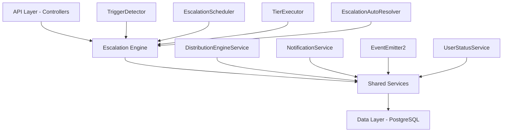

The Escalation Module automates responses when assigned leads go stale. A scheduled engine detects trigger conditions (no first contact, went cold) and executes tiered escalation actions — notifications, temperature changes, tag additions, and redistribution to new agents.

<Note>
**Status:** Active — fully implemented  
**Module Path:** `src/modules/crm/escalation/`
</Note>

## Overview

### Design principles

The escalation module follows these key design principles:

<CardGroup cols={2}>
  <Card title="pg-boss scheduling" icon="clock">
    Escalation scheduler uses pg-boss recurring job for reliability
  </Card>
  <Card title="Tiered actions" icon="layer-group">
    Rules have ordered tiers with configurable delays; actions execute in sequence
  </Card>
  <Card title="Auto-resolution" icon="check-circle">
    Events (activity, stage change, reassignment) automatically resolve active trackers
  </Card>
  <Card title="Idempotency" icon="shield-check">
    Partial unique index + `ON CONFLICT DO NOTHING` prevents duplicate trackers
  </Card>
  <Card title="Distribution delegation" icon="route">
    Reassignment uses the distribution engine (`REDISTRIBUTE` action), not a separate paradigm
  </Card>
  <Card title="RLS compliance" icon="lock">
    All entities carry `organization_id` for row-level security
  </Card>
</CardGroup>

## Architecture

### High-level diagram



### Component responsibilities

| Component | Responsibility |
|-----------|---------------|
| **EscalationScheduler** | pg-boss recurring job that runs every 60 seconds to detect new triggers and process due escalations |
| **TriggerDetector** | Scans leads for unmet conditions (no first contact, went cold); creates tracker records |
| **TierExecutor** | Executes escalation tier actions (notify, redistribute, change temp, add tag) |
| **EscalationAutoResolver** | Listens to domain events and resolves active trackers when conditions change |
| **EscalationRuleService** | CRUD for escalation rules; handles tracker cancellation on deactivation/deletion |

## Entity Specifications

### EscalationRule

Defines when and how a lead should be escalated. Evaluated by `TriggerDetector`.

| Column | Type | Notes |
|--------|------|-------|
| id | uuid PK | |
| organization_id | uuid FK | RLS |
| name | varchar | Human-readable rule name |
| is_active | bool | default true |
| priority | int | Evaluation order |
| trigger_type | enum | `NO_FIRST_CONTACT`, `WENT_COLD` |
| trigger_config | jsonb | `{thresholdMinutes?, thresholdValue?, thresholdUnit?}` |
| conditions | jsonb | `EscalationCondition[]` — AND-joined applicability filters; `[]` = all leads |
| respect_business_hours | bool | default true. References org business hours schedule. |
| created_by | uuid FK | |
| created_at, updated_at | timestamp | |
| is_deleted | bool | soft delete |

<Info>
**EscalationCondition shape:**
```typescript
interface EscalationCondition {
  field: 'temperature' | 'leadSource' | 'language' | 'sourceChannel';
  operator: 'eq' | 'in';
  value: string | string[];
}
```
</Info>

#### SQL field mapping

Used by `TriggerDetector.buildApplicabilityExtraWhere`:

| Field | SQL Column | Table | Notes |
|-------|------------|--------|-------|
| `temperature` | `l.temperature` | lead | |
| `leadSource` | `l.lead_source` | lead | |
| `sourceChannel` | `l.source_channel` | lead | |
| `language` | `p.language` | person | Adds `LEFT JOIN person p ON p.id = l.person_id` |

### EscalationTier

Each tier in an escalation rule represents a delayed action set. Tiers execute in `tier_order` sequence.

| Column | Type | Notes |
|--------|------|-------|
| id | uuid PK | |
| escalation_rule_id | uuid FK | |
| organization_id | uuid FK | RLS |
| tier_order | int | 1, 2, 3... (max 10) |
| delay_minutes | int | Tier 1 (lowest tier_order): always 0 — threshold is the sole timing control. Subsequent tiers: minutes after the previous tier completed. |
| actions | jsonb | `TierAction[]` — see Tier Actions below |

#### Tier action types

<Tabs>
  <Tab title="Notification Actions">
    | Action Type | Parameters | Resolution |
    |-------------|------------|------------|
    | `NOTIFY_AGENT` | `message?: string` | Resolved from lead's current stakeholder (assigned agent) |
    | `NOTIFY_ADMIN` | `message?: string` | **Self-resolving** — queries all org users with the `system.admin` permission key via `UserOrgRole → RolePermission → Permission`. Skipped if no admin users found. |
    | `NOTIFY_TEAM_LEAD` | `message?: string` | **Self-resolving** — queries all team members with the `team.admin` permission key in the lead's assigned team. Skipped if the lead has no team stakeholder or no team leaders exist. Notifies ALL team leaders. |
  </Tab>
  
  <Tab title="Lead Management Actions">
    | Action Type | Parameters | Resolution |
    |-------------|------------|------------|
    | `REDISTRIBUTE` | _(no params)_ | **Distribution engine delegation** — removes current stakeholders, calls `DistributionEngineService.redistribute()` which re-runs the full pipeline excluding the current assignee. |
    | `CHANGE_TEMPERATURE` | `temperature: string` | Updates lead temperature directly |
    | `ADD_TAG` | `tagName: string` | Adds specified tag to the lead |
  </Tab>
</Tabs>

### EscalationTracker

Tracks active escalations for specific leads under specific rules.

| Column | Type | Notes |
|--------|------|-------|
| id | uuid PK | |
| organization_id | uuid FK | RLS |
| escalation_rule_id | uuid FK | |
| lead_id | uuid FK | |
| trigger_detected_at | timestamp | When the trigger condition was first detected |
| current_tier_order | int | 1-based; tracks progress through tiers |
| next_execution_at | timestamp | When the next tier should execute |
| status | enum | `ACTIVE`, `RESOLVED` |
| resolved_at | timestamp | |
| resolved_by | enum | `ACTIVITY`, `STAGE_CHANGE`, `REASSIGNMENT`, `REDISTRIBUTED`, `RULE_DISABLED`, `RULE_DELETED` |
| created_at, updated_at | timestamp | |

<Warning>
**Unique constraint:** `(escalation_rule_id, lead_id)` WHERE `status = 'ACTIVE'` — prevents multiple active trackers for the same rule/lead combination.
</Warning>

### EscalationActionLog

Audit trail for executed escalation actions.

| Column | Type | Notes |
|--------|------|-------|
| id | uuid PK | |
| organization_id | uuid FK | RLS |
| escalation_tracker_id | uuid FK | |
| tier_order | int | Which tier this action belonged to |
| action_type | varchar | `NOTIFY_AGENT`, `REDISTRIBUTE`, etc. |
| action_data | jsonb | Parameters + resolved recipients/outcome |
| executed_at | timestamp | |
| success | bool | Whether the action executed successfully |
| error_message | text | If `success = false` |

## Type Definitions

### Core enums and interfaces

<CodeGroup>
```typescript Core Enums
enum TriggerType {
  NO_FIRST_CONTACT = 'NO_FIRST_CONTACT',
  WENT_COLD = 'WENT_COLD'
}

enum TrackerStatus {
  ACTIVE = 'ACTIVE',
  RESOLVED = 'RESOLVED'
}

enum TrackerResolutionReason {
  ACTIVITY = 'ACTIVITY',
  STAGE_CHANGE = 'STAGE_CHANGE', 
  REASSIGNMENT = 'REASSIGNMENT',
  REDISTRIBUTED = 'REDISTRIBUTED',
  RULE_DISABLED = 'RULE_DISABLED',
  RULE_DELETED = 'RULE_DELETED'
}
```

```typescript Action Types
enum TierActionType {
  NOTIFY_AGENT = 'NOTIFY_AGENT',
  NOTIFY_ADMIN = 'NOTIFY_ADMIN', 
  NOTIFY_TEAM_LEAD = 'NOTIFY_TEAM_LEAD',
  REDISTRIBUTE = 'REDISTRIBUTE',
  CHANGE_TEMPERATURE = 'CHANGE_TEMPERATURE',
  ADD_TAG = 'ADD_TAG'
}

interface TierAction {
  type: TierActionType;
  params?: {
    message?: string;
    temperature?: string;
    tagName?: string;
  };
}
```

```typescript Trigger Configuration
interface TriggerConfig {
  // NO_FIRST_CONTACT
  thresholdMinutes?: number;
  
  // WENT_COLD  
  thresholdValue?: number;
  thresholdUnit?: 'hours' | 'days';
}
```
</CodeGroup>

## Escalation Engine

### EscalationScheduler

The main orchestrator that runs every 60 seconds via pg-boss recurring job.

<Steps>
  <Step title="Detect new triggers">
    Calls `TriggerDetector.detectAndCreateTrackers()` to scan for leads meeting escalation conditions
  </Step>
  
  <Step title="Process due escalations">
    Calls `TierExecutor.processDueEscalations()` to execute tiers whose `next_execution_at` has passed
  </Step>
</Steps>

### TriggerDetector

Scans leads for unmet escalation conditions and creates tracker records.

#### Detection logic

<Tabs>
  <Tab title="NO_FIRST_CONTACT">
    ```sql
    SELECT l.id 
    FROM lead l
    LEFT JOIN lead_activity la ON la.lead_id = l.id 
      AND la.activity_type = 'OUTBOUND_CALL'
    WHERE l.status = 'ASSIGNED'
      AND l.assigned_at <= NOW() - INTERVAL '{thresholdMinutes} minutes'
      AND la.id IS NULL
      AND NOT EXISTS (
        SELECT 1 FROM escalation_tracker et 
        WHERE et.lead_id = l.id 
          AND et.escalation_rule_id = $ruleId 
          AND et.status = 'ACTIVE'
      )
    ```
  </Tab>
  
  <Tab title="WENT_COLD">
    ```sql
    SELECT l.id
    FROM lead l  
    WHERE l.status = 'ASSIGNED'
      AND l.temperature = 'COLD'
      AND l.temperature_changed_at <= NOW() - INTERVAL '{threshold} {unit}'
      AND NOT EXISTS (
        SELECT 1 FROM escalation_tracker et
        WHERE et.lead_id = l.id
          AND et.escalation_rule_id = $ruleId  
          AND et.status = 'ACTIVE'
      )
    ```
  </Tab>
</Tabs>

<Note>
The detector respects business hours when `respect_business_hours = true`, calculating effective trigger times using `BusinessHoursService.addBusinessMinutes()`.
</Note>

### TierExecutor

Executes escalation tier actions for trackers whose `next_execution_at` has passed.

#### Execution flow

<Steps>
  <Step title="Query due trackers">
    Find all `ACTIVE` trackers where `next_execution_at <= NOW()`
  </Step>
  
  <Step title="Execute tier actions">
    For each tracker, execute all actions in the current tier
  </Step>
  
  <Step title="Advance or complete">
    - If more tiers exist: advance to next tier and set `next_execution_at`
    - If final tier: resolve tracker with status `RESOLVED`
  </Step>
  
  <Step title="Log all actions">
    Create `EscalationActionLog` entries for audit trail
  </Step>
</Steps>

### EscalationAutoResolver

Event-driven component that resolves active trackers when conditions change.

#### Resolution triggers

| Event | Resolution Reason | Trigger |
|-------|------------------|---------|
| Lead activity created | `ACTIVITY` | Any new `LeadActivity` record |
| Lead stage changed | `STAGE_CHANGE` | Lead moves from `ASSIGNED` to any other status |
| Lead reassigned | `REASSIGNMENT` | Lead stakeholders change |
| Successful redistribution | `REDISTRIBUTED` | Distribution engine assigns lead to new agent |
| Rule deactivated | `RULE_DISABLED` | Rule `is_active` set to `false` |
| Rule deleted | `RULE_DELETED` | Rule soft deleted |

<CodeGroup>
```typescript Event Listeners
@OnEvent('lead.activity.created')
async handleLeadActivityCreated(payload: LeadActivityCreatedEvent) {
  await this.resolveActiveTrackersForLead(
    payload.leadId, 
    TrackerResolutionReason.ACTIVITY
  );
}

@OnEvent('lead.stage.changed') 
async handleLeadStageChanged(payload: LeadStageChangedEvent) {
  if (payload.previousStage === LeadStatus.ASSIGNED) {
    await this.resolveActiveTrackersForLead(
      payload.leadId,
      TrackerResolutionReason.STAGE_CHANGE  
    );
  }
}
```

```typescript Bulk Resolution
async resolveTrackersForRule(
  ruleId: string, 
  reason: TrackerResolutionReason
): Promise<void> {
  await this.escalationTrackerRepository.nativeUpdate(
    { 
      escalationRuleId: ruleId, 
      status: TrackerStatus.ACTIVE 
    },
    {
      status: TrackerStatus.RESOLVED,
      resolvedAt: new Date(),
      resolvedBy: reason
    }
  );
}
```
</CodeGroup>

## API Endpoints

### Escalation rules management

<Tabs>
  <Tab title="Rules CRUD">
    ```typescript
    // GET /api/v1/escalation/rules
    async getRules(@Query() query: GetEscalationRulesDto): Promise<{
      data: EscalationRuleResponseDto[];
      pagination: PaginationResponseDto;
    }>

    // POST /api/v1/escalation/rules  
    async createRule(@Body() dto: CreateEscalationRuleDto): Promise<EscalationRuleResponseDto>

    // PUT /api/v1/escalation/rules/:id
    async updateRule(
      @Param('id') id: string,
      @Body() dto: UpdateEscalationRuleDto
    ): Promise<EscalationRuleResponseDto>

    // DELETE /api/v1/escalation/rules/:id
    async deleteRule(@Param('id') id: string): Promise<{ success: boolean }>
    ```
  </Tab>
  
  <Tab title="Rule Testing">
    ```typescript
    // POST /api/v1/escalation/rules/test-applicability
    async testApplicability(@Body() dto: TestApplicabilityDto): Promise<{
      applicableLeadCount: number;
      sampleLeads: Array<{
        id: string;
        personName: string;
        assignedAgentName: string;
      }>;
    }>
    ```
  </Tab>
</Tabs>

### Analytics and tracking

<Tabs>
  <Tab title="Analytics">
    ```typescript
    // GET /api/v1/escalation/analytics/summary
    async getAnalyticsSummary(@Query() query: EscalationAnalyticsQueryDto): Promise<{
      totalEscalations: number;
      resolvedByActivity: number;
      resolvedByReassignment: number; 
      averageResolutionTimeHours: number;
      topTriggerTypes: Array<{ type: string; count: number }>;
    }>

    // GET /api/v1/escalation/analytics/trends  
    async getTrends(@Query() query: EscalationTrendsQueryDto): Promise<{
      data: Array<{
        date: string;
        totalTriggered: number;
        totalResolved: number;
        avgResolutionHours: number;
      }>;
    }>
    ```
  </Tab>
  
  <Tab title="Tracker Management">
    ```typescript
    // GET /api/v1/escalation/trackers
    async getTrackers(@Query() query: GetEscalationTrackersDto): Promise<{
      data: EscalationTrackerResponseDto[];
      pagination: PaginationResponseDto;
    }>

    // POST /api/v1/escalation/trackers/:id/resolve
    async resolveTracker(
      @Param('id') id: string,
      @Body() dto: ResolveTrackerDto  
    ): Promise<{ success: boolean }>
    ```
  </Tab>
</Tabs>

## Security & Permissions

### Permission requirements

| Operation | Required Permission | Notes |
|-----------|-------------------|-------|
| View rules | `escalation.view` | Can see escalation rules and trackers |
| Create/edit rules | `escalation.manage` | Can create, update, activate/deactivate rules |
| Delete rules | `escalation.manage` | Can soft delete rules (resolves active trackers) |
| View analytics | `escalation.analytics` | Can access escalation metrics and trends |
| Manual resolution | `escalation.manage` | Can manually resolve active trackers |

### Row-level security

All escalation entities include `organization_id` for RLS enforcement:

<CodeGroup>
```sql Escalation Rules
CREATE POLICY escalation_rules_tenant_isolation ON escalation_rule
  USING (organization_id = current_setting('app.current_organization_id')::uuid);
```

```sql Escalation Trackers  
CREATE POLICY escalation_trackers_tenant_isolation ON escalation_tracker
  USING (organization_id = current_setting('app.current_organization_id')::uuid);
```

```sql Action Logs
CREATE POLICY escalation_action_logs_tenant_isolation ON escalation_action_log  
  USING (organization_id = current_setting('app.current_organization_id')::uuid);
```
</CodeGroup>

## Analytics & Metrics

### Key performance indicators

<CardGroup cols={2}>
  <Card title="Escalation volume" icon="chart-line">
    Total escalations triggered and resolved over time periods
  </Card>
  <Card title="Resolution patterns" icon="pie-chart">
    Breakdown by resolution reason (activity, reassignment, etc.)
  </Card>
  <Card title="Response times" icon="clock">
    Average time from trigger to resolution
  </Card>
  <Card title="Rule effectiveness" icon="bullseye">
    Which rules trigger most frequently and resolve successfully
  </Card>
</CardGroup>

### Metrics calculation

<AccordionGroup>
  <Accordion title="Resolution time calculation">
    ```sql
    SELECT 
      AVG(EXTRACT(EPOCH FROM (resolved_at - trigger_detected_at))/3600) as avg_resolution_hours
    FROM escalation_tracker 
    WHERE status = 'RESOLVED' 
      AND resolved_at IS NOT NULL
      AND trigger_detected_at BETWEEN $startDate AND $endDate
    ```
  </Accordion>
  
  <Accordion title="Rule performance metrics">
    ```sql
    SELECT 
      er.name,
      COUNT(et.id) as total_triggered,
      COUNT(CASE WHEN et.status = 'RESOLVED' THEN 1 END) as total_resolved,
      AVG(CASE 
        WHEN et.resolved_at IS NOT NULL 
        THEN EXTRACT(EPOCH FROM (et.resolved_at - et.trigger_detected_at))/3600 
      END) as avg_resolution_hours
    FROM escalation_rule er
    LEFT JOIN escalation_tracker et ON et.escalation_rule_id = er.id
    WHERE er.organization_id = $orgId
    GROUP BY er.id, er.name
    ```
  </Accordion>
</AccordionGroup>

## Edge Case Handling

### Common edge cases and solutions

<Tabs>
  <Tab title="Concurrency Issues">
    **Problem:** Multiple scheduler runs creating duplicate trackers
    
    **Solution:** Partial unique index + `ON CONFLICT DO NOTHING`
    ```sql
    CREATE UNIQUE INDEX CONCURRENTLY escalation_tracker_active_unique
    ON escalation_tracker (escalation_rule_id, lead_id)  
    WHERE status = 'ACTIVE';
    ```
  </Tab>
  
  <Tab title="Business Hours">
    **Problem:** Escalations triggering outside business hours
    
    **Solution:** `BusinessHoursService.addBusinessMinutes()` calculates next valid execution time
    ```typescript
    const effectiveTime = rule.respectBusinessHours 
      ? await this.businessHoursService.addBusinessMinutes(
          lead.assignedAt, 
          rule.triggerConfig.thresholdMinutes
        )
      : addMinutes(lead.assignedAt, rule.triggerConfig.thresholdMinutes);
    ```
  </Tab>
  
  <Tab title="Action Failures">
    **Problem:** Individual tier actions failing (missing recipients, distribution errors)
    
    **Solution:** Continue execution, log failures in `EscalationActionLog`
    ```typescript
    for (const action of tier.actions) {
      try {
        await this.executeAction(action, tracker);
        await this.logAction(tracker, action, true);
      } catch (error) {
        await this.logAction(tracker, action, false, error.message);
        // Continue with remaining actions
      }
    }
    ```
  </Tab>
</Tabs>

## Performance & Scaling

### Optimization strategies

<Tips>
  <Tip>**Index optimization** - Key indexes on `next_execution_at`, `status`, and foreign keys for efficient queries</Tip>
  <Tip>**Batch processing** - Scheduler processes multiple trackers per run to reduce overhead</Tip>
  <Tip>**Query optimization** - Use JOINs instead of N+1 queries when loading related entities</Tip>
  <Tip>**Business hours caching** - Cache business hours calculations to avoid repeated computation</Tip>
</Tips>

### Database indexes

```sql
-- Critical for scheduler performance
CREATE INDEX escalation_tracker_next_execution_idx 
ON escalation_tracker (next_execution_at) 
WHERE status = 'ACTIVE';

-- For trigger detection  
CREATE INDEX lead_assigned_status_idx 
ON lead (status, assigned_at) 
WHERE status = 'ASSIGNED';

-- For analytics queries
CREATE INDEX escalation_tracker_dates_idx
ON escalation_tracker (trigger_detected_at, resolved_at);
```

## RLS Policies

### Complete policy definitions

<CodeGroup>
```sql Rules Table
-- escalation_rule policies
CREATE POLICY escalation_rules_tenant_isolation ON escalation_rule
  USING (organization_id = current_setting('app.current_organization_id')::uuid);

CREATE POLICY escalation_rules_read ON escalation_rule
  FOR SELECT USING (
    organization_id = current_setting('app.current_organization_id')::uuid
  );

CREATE POLICY escalation_rules_write ON escalation_rule  
  FOR ALL USING (
    organization_id = current_setting('app.current_organization_id')::uuid
  );
```

```sql Trackers Table
-- escalation_tracker policies  
CREATE POLICY escalation_trackers_tenant_isolation ON escalation_tracker
  USING (organization_id = current_setting('app.current_organization_id')::uuid);

CREATE POLICY escalation_trackers_read ON escalation_tracker
  FOR SELECT USING (
    organization_id = current_setting('app.current_organization_id')::uuid  
  );

CREATE POLICY escalation_trackers_write ON escalation_tracker
  FOR ALL USING (
    organization_id = current_setting('app.current_organization_id')::uuid
  );
```
</CodeGroup>

## Module Structure

### File organization

```
src/modules/crm/escalation/
├── controllers/
│   ├── escalation-rule.controller.ts
│   └── escalation-analytics.controller.ts
├── services/
│   ├── escalation-rule.service.ts  
│   ├── escalation-scheduler.service.ts
│   ├── trigger-detector.service.ts
│   ├── tier-executor.service.ts
│   └── escalation-auto-resolver.service.ts
├── entities/
│   ├── escalation-rule.entity.ts
│   ├── escalation-tier.entity.ts
│   ├── escalation-tracker.entity.ts
│   └── escalation-action-log.entity.ts
├── dtos/
│   ├── requests/
│   └── responses/
├── types/
│   └── escalation.types.ts
└── escalation.module.ts
```

## Integration Points

### External dependencies

<CardGroup cols={2}>
  <Card title="Distribution Engine" icon="route">
    Used by `REDISTRIBUTE` action to reassign leads
  </Card>
  <Card title="Notification Service" icon="bell">
    Sends escalation notifications to agents, admins, team leads
  </Card>
  <Card title="Business Hours Service" icon="clock">
    Calculates effective trigger times when respecting business hours
  </Card>
  <Card title="Event System" icon="broadcast-tower">
    Listens to lead events for auto-resolution of trackers
  </Card>
</CardGroup>

### Event emissions

The escalation module emits the following domain events:

```typescript
// When escalation is triggered
this.eventEmitter.emit('escalation.triggered', {
  trackerId: tracker.id,
  leadId: tracker.leadId, 
  ruleId: tracker.escalationRuleId,
  triggerType: rule.triggerType
});

// When escalation is resolved
this.eventEmitter.emit('escalation.resolved', {
  trackerId: tracker.id,
  leadId: tracker.leadId,
  resolvedBy: tracker.resolvedBy,
  durationMinutes: Math.floor(
    (tracker.resolvedAt.getTime() - tracker.triggerDetectedAt.getTime()) / 60000
  )
});
```

<Check>
The escalation module is fully implemented and actively monitoring lead engagement across organizations. All components are tested and optimized for production use.
</Check>