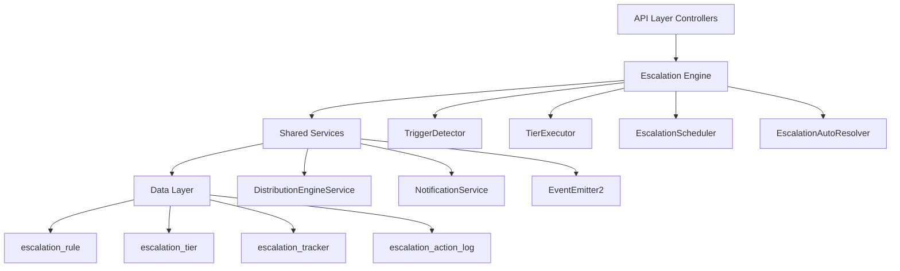

## Overview

The Escalation Module automates responses when assigned leads go stale. A scheduled engine detects trigger conditions (no first contact, went cold) and executes tiered escalation actions — notifications, temperature changes, tag additions, and redistribution to new agents.

<Info>
**Status:** Active — fully implemented  
**Module Path:** `src/modules/crm/escalation/`
</Info>

### Design principles

<CardGroup cols={2}>
  <Card title="pg-boss scheduling" icon="clock">
    Escalation scheduler uses pg-boss recurring job for reliability
  </Card>
  <Card title="Tiered actions" icon="layer-group">
    Rules have ordered tiers with configurable delays; actions execute in sequence
  </Card>
  <Card title="Auto-resolution" icon="wand-magic-sparkles">
    Events (activity, stage change, reassignment) automatically resolve active trackers
  </Card>
  <Card title="Idempotency" icon="shield-check">
    Partial unique index + `ON CONFLICT DO NOTHING` prevents duplicate trackers
  </Card>
</CardGroup>

## Architecture

### High-level diagram



### Component responsibilities

| Component | Responsibility |
|-----------|----------------|
| **EscalationScheduler** | pg-boss recurring job that runs every 60 seconds to detect new triggers and process due escalations |
| **TriggerDetector** | Scans leads for unmet conditions (no first contact, went cold); creates tracker records |
| **TierExecutor** | Executes escalation tier actions (notify, redistribute, change temp, add tag) |
| **EscalationAutoResolver** | Listens to domain events and resolves active trackers when conditions change |
| **EscalationRuleService** | CRUD for escalation rules; handles tracker cancellation on deactivation/deletion |

## Entity specifications

### EscalationRule

Defines when and how a lead should be escalated. Evaluated by `TriggerDetector`.

<Tabs>
  <Tab title="Schema">
    | Column | Type | Notes |
    |--------|------|-------|
    | id | uuid PK | |
    | organization_id | uuid FK | RLS |
    | name | varchar | Human-readable rule name |
    | is_active | bool | default true |
    | priority | int | Evaluation order |
    | trigger_type | enum | `NO_FIRST_CONTACT`, `WENT_COLD` |
    | trigger_config | jsonb | `{thresholdMinutes?, thresholdValue?, thresholdUnit?}` |
    | conditions | jsonb | `EscalationCondition[]` — AND-joined applicability filters |
    | respect_business_hours | bool | default true |
    | created_by | uuid FK | |
    | created_at, updated_at | timestamp | |
    | is_deleted | bool | soft delete |
  </Tab>
  
  <Tab title="Conditions">
    **EscalationCondition shape:**

    ```typescript
    interface EscalationCondition {
      field: 'temperature' | 'leadSource' | 'language' | 'sourceChannel';
      operator: 'eq' | 'in';
      value: string | string[];
    }
    ```

    **SQL field mapping:**

    | Field | SQL Column | Table | Notes |
    |-------|-----------|-------|-------|
    | `temperature` | `l.temperature` | lead | |
    | `leadSource` | `l.lead_source` | lead | |
    | `sourceChannel` | `l.source_channel` | lead | |
    | `language` | `p.language` | person | Adds `LEFT JOIN person p ON p.id = l.person_id` |
  </Tab>
</Tabs>

### EscalationTier

Each tier represents a delayed action set. Tiers execute in `tier_order` sequence.

<Note>
Tier 1 (lowest tier_order) always has `delay_minutes: 0` — the threshold is the sole timing control. Subsequent tiers specify minutes after the previous tier completed.
</Note>

| Column | Type | Notes |
|--------|------|-------|
| id | uuid PK | |
| escalation_rule_id | uuid FK | |
| organization_id | uuid FK | RLS |
| tier_order | int | 1, 2, 3... (max 10) |
| delay_minutes | int | Minutes after previous tier |
| actions | jsonb | `TierAction[]` |

#### Tier action types

<AccordionGroup>
  <Accordion title="Notification Actions">
    | Action Type | Parameters | Resolution |
    |-------------|------------|------------|
    | `NOTIFY_AGENT` | `message?: string` | Current lead assignee |
    | `NOTIFY_ADMIN` | `message?: string` | All org users with `system.admin` permission |
    | `NOTIFY_TEAM_LEAD` | `message?: string` | Team members with `team.admin` permission |
  </Accordion>
  
  <Accordion title="Lead Management Actions">
    | Action Type | Parameters | Description |
    |-------------|------------|-------------|
    | `REDISTRIBUTE` | _(no params)_ | Removes current stakeholders, calls distribution engine |
    | `CHANGE_TEMPERATURE` | `temperature: 'hot' \| 'warm' \| 'cold'` | Updates lead temperature directly |
    | `ADD_TAG` | `tagIds: string[]` | Appends tags to lead, deduplicating existing |
  </Accordion>
</AccordionGroup>

<Warning>
`REDISTRIBUTE` action must be in the **last tier only**. The API rejects rules where REDISTRIBUTE appears in an intermediate tier.
</Warning>

**Action configuration examples:**

```json
{ "type": "NOTIFY_AGENT", "message": "Lead needs attention" }
{ "type": "NOTIFY_ADMIN", "message": "Escalation alert" }
{ "type": "REDISTRIBUTE" }
{ "type": "CHANGE_TEMPERATURE", "temperature": "hot" }
{ "type": "ADD_TAG", "tagIds": ["tag-uuid-1", "tag-uuid-2"] }
```

### EscalationTracker

Tracks the escalation state of a specific lead against a specific rule.

| Column | Type | Notes |
|--------|------|-------|
| id | uuid PK | |
| lead_id | uuid FK | |
| escalation_rule_id | uuid FK | |
| organization_id | uuid FK | RLS |
| current_tier | int | 0 = triggered but not escalated; increments with each tier |
| trigger_fired_at | timestamp | When trigger condition first detected |
| next_escalation_at | timestamp | Indexed for scheduler query |
| status | enum | `ACTIVE`, `RESOLVED`, `CANCELLED` |
| resolved_at | timestamp nullable | |
| resolved_by | enum nullable | Resolution reason |
| history | jsonb | `TrackerHistoryEntry[]` append-only summary |
| created_at | timestamp | |

#### Key indexes

| Index | Columns | Type | Purpose |
|-------|---------|------|---------|
| `uq_escalation_tracker_lead_rule` | `(lead_id, escalation_rule_id) WHERE status = 'ACTIVE'` | Partial unique | Prevents duplicate ACTIVE trackers |
| `idx_escalation_tracker_next_at` | `(next_escalation_at, status)` | Composite | Primary scheduler query |
| `idx_escalation_tracker_lead` | `(lead_id, status)` | Composite | Auto-resolver lookups |

#### Idempotency guarantee

<Tip>
The partial unique index prevents duplicate active trackers. `TriggerDetector` uses `INSERT ... ON CONFLICT ... DO NOTHING` to handle race conditions gracefully.
</Tip>

```sql
INSERT INTO escalation_tracker
  (id, lead_id, escalation_rule_id, organization_id, trigger_fired_at,
   next_escalation_at, status, history, current_tier, created_at)
VALUES (gen_random_uuid(), $1, $2, $3, $4, $5, 'ACTIVE', '[]', 0, NOW())
ON CONFLICT (lead_id, escalation_rule_id) WHERE status = 'ACTIVE' DO NOTHING;
```

### EscalationActionLog

Normalized table recording every escalation tier action execution for analytics.

| Column | Type | Notes |
|--------|------|-------|
| id | uuid PK | |
| tracker_id | uuid FK | References `escalation_tracker` |
| organization_id | uuid FK | RLS |
| tier_order | int | Which tier triggered this action |
| action_type | varchar | e.g., `NOTIFY_AGENT`, `REDISTRIBUTE` |
| action_params | jsonb nullable | Serialized parameters |
| result | enum | `SUCCESS`, `FAILED`, `SKIPPED` |
| executed_at | timestamp | |

## Type definitions

```typescript
enum TriggerType {
  NO_FIRST_CONTACT = 'NO_FIRST_CONTACT',
  WENT_COLD = 'WENT_COLD',
}

enum EscalationActionType {
  NOTIFY_AGENT = 'NOTIFY_AGENT',
  NOTIFY_ADMIN = 'NOTIFY_ADMIN',
  NOTIFY_TEAM_LEAD = 'NOTIFY_TEAM_LEAD',
  REDISTRIBUTE = 'REDISTRIBUTE',
  CHANGE_TEMPERATURE = 'CHANGE_TEMPERATURE',
  ADD_TAG = 'ADD_TAG',
}

enum EscalationStatus {
  ACTIVE = 'ACTIVE',
  RESOLVED = 'RESOLVED',
  CANCELLED = 'CANCELLED',
}

enum ResolvedBy {
  MANUAL = 'MANUAL',
  AUTO_ACTIVITY = 'AUTO_ACTIVITY',
  AUTO_STAGE_CHANGE = 'AUTO_STAGE_CHANGE',
  AUTO_REASSIGNMENT = 'AUTO_REASSIGNMENT',
  AUTO_ARCHIVED = 'AUTO_ARCHIVED',
  AUTO_DELETED = 'AUTO_DELETED',
  AUTO_ORPHANED = 'AUTO_ORPHANED',
  REDISTRIBUTED = 'REDISTRIBUTED',
}

enum ActionResult {
  SUCCESS = 'SUCCESS',
  FAILED = 'FAILED',
  SKIPPED = 'SKIPPED',
}
```

### ResolvedBy values

| Value | Description |
|-------|-------------|
| `MANUAL` | User explicitly resolved via UI/API |
| `AUTO_ACTIVITY` | New activity added to lead |
| `AUTO_STAGE_CHANGE` | Lead moved to different stage |
| `AUTO_REASSIGNMENT` | Lead reassigned to different agent |
| `AUTO_ARCHIVED` | Lead archived |
| `AUTO_DELETED` | Lead deleted |
| `AUTO_ORPHANED` | Lead has no assigned stakeholder |
| `REDISTRIBUTED` | Successfully redistributed by escalation action |

## Escalation engine

### EscalationScheduler

<Steps>
  <Step title="Job registration">
    Registers a recurring pg-boss job named `escalation-processing` that runs every 60 seconds
  </Step>
  
  <Step title="Trigger detection">
    Calls `TriggerDetector.detectAndCreateTrackers()` to scan for new escalation conditions
  </Step>
  
  <Step title="Tier processing">
    Calls `TierExecutor.processDueEscalations()` to execute actions for trackers with `next_escalation_at <= NOW()`
  </Step>
</Steps>

### TriggerDetector

Scans leads for escalation trigger conditions and creates tracker records.

<CodeGroup>
```typescript Main Detection Logic
async detectAndCreateTrackers(organizationId: string): Promise<void> {
  const activeRules = await this.getActiveRules(organizationId);
  
  for (const rule of activeRules) {
    const applicableLeads = await this.findApplicableLeads(rule);
    
    for (const lead of applicableLeads) {
      await this.createTrackerIfNeeded(lead, rule);
    }
  }
}
```

```sql Lead Query Example
SELECT l.id, l.assigned_at, l.person_id, l.temperature
FROM lead l
LEFT JOIN person p ON p.id = l.person_id
WHERE l.organization_id = $1
  AND l.status != 'ARCHIVED'
  AND l.assigned_user_id IS NOT NULL
  AND l.stage_id != 'closed-won'
  AND l.stage_id != 'closed-lost'
  AND (additional_conditions_based_on_rule)
```
</CodeGroup>

#### Trigger condition logic

<Tabs>
  <Tab title="NO_FIRST_CONTACT">
    **Condition:** Lead has been assigned for X minutes but has no activities

    ```typescript
    const thresholdTime = new Date(Date.now() - rule.trigger_config.thresholdMinutes * 60 * 1000);
    
    // Query leads assigned before threshold with no activities
    WHERE l.assigned_at <= $thresholdTime
      AND NOT EXISTS (
        SELECT 1 FROM activity a 
        WHERE a.lead_id = l.id 
        AND a.created_at > l.assigned_at
      )
    ```
  </Tab>
  
  <Tab title="WENT_COLD">
    **Condition:** Lead temperature changed to 'cold' X time ago

    ```typescript
    const thresholdTime = new Date(Date.now() - rule.trigger_config.thresholdMinutes * 60 * 1000);
    
    // Query leads that went cold before threshold
    WHERE l.temperature = 'cold'
      AND l.temperature_updated_at <= $thresholdTime
    ```
  </Tab>
</Tabs>

### TierExecutor

Processes due escalations by executing tier actions and updating tracker state.

<Steps>
  <Step title="Query due trackers">
    Find all ACTIVE trackers with `next_escalation_at <= NOW()`
  </Step>
  
  <Step title="Execute tier actions">
    For each tracker, execute all actions in the current tier
  </Step>
  
  <Step title="Update tracker state">
    Increment `current_tier`, calculate `next_escalation_at`, log action results
  </Step>
  
  <Step title="Complete if final tier">
    If no more tiers exist, set status to RESOLVED
  </Step>
</Steps>

#### Action execution details

<AccordionGroup>
  <Accordion title="Notification Actions">
    **NOTIFY_AGENT:** Resolves current lead assignee and sends notification
    **NOTIFY_ADMIN:** Queries users with `system.admin` permission
    **NOTIFY_TEAM_LEAD:** Queries team members with `team.admin` permission in lead's team
    
    <Note>
    Self-resolving actions are skipped if no valid recipients are found (e.g., no admins, no team assigned).
    </Note>
  </Accordion>
  
  <Accordion title="Lead Management Actions">
    **REDISTRIBUTE:** 
    - Removes current stakeholders
    - Calls `DistributionEngineService.redistribute()`
    - If outcome is `ASSIGNED`, resolves tracker with `resolvedBy = REDISTRIBUTED`
    
    **CHANGE_TEMPERATURE:** Direct entity update bypassing validation guards
    
    **ADD_TAG:** Appends to `lead.tagIds` array, deduplicating existing entries
  </Accordion>
</AccordionGroup>

### EscalationAutoResolver

Event-driven component that automatically resolves active trackers when conditions change.

```typescript
@OnEvent('lead.activity.created')
async onLeadActivity(payload: { leadId: string; organizationId: string }) {
  await this.resolveTrackersForLead(
    payload.leadId, 
    payload.organizationId, 
    ResolvedBy.AUTO_ACTIVITY
  );
}

@OnEvent('lead.stage.changed')
async onStageChange(payload: { leadId: string; organizationId: string }) {
  await this.resolveTrackersForLead(
    payload.leadId, 
    payload.organizationId, 
    ResolvedBy.AUTO_STAGE_CHANGE
  );
}
```

#### Auto-resolution triggers

| Event | Trigger | ResolvedBy |
|-------|---------|------------|
| Lead activity created | Any new activity added | `AUTO_ACTIVITY` |
| Lead stage changed | Stage moved to different value | `AUTO_STAGE_CHANGE` |
| Lead reassigned | `assigned_user_id` changed | `AUTO_REASSIGNMENT` |
| Lead archived | Status changed to `ARCHIVED` | `AUTO_ARCHIVED` |
| Lead deleted | Entity soft/hard deleted | `AUTO_DELETED` |
| Lead orphaned | All stakeholders removed | `AUTO_ORPHANED` |

## API endpoints

### EscalationRule endpoints

<CodeGroup>
```typescript GET /escalation-rules
// List escalation rules with optional filtering
GET /api/escalation-rules?isActive=true&triggerType=NO_FIRST_CONTACT

Response: {
  data: EscalationRule[],
  meta: { total: number, page: number, limit: number }
}
```

```typescript POST /escalation-rules
// Create new escalation rule
POST /api/escalation-rules

Body: {
  name: string,
  triggerType: TriggerType,
  triggerConfig: object,
  conditions: EscalationCondition[],
  respectBusinessHours: boolean,
  tiers: CreateTierDto[]
}
```

```typescript PUT /escalation-rules/:id
// Update escalation rule
PUT /api/escalation-rules/uuid

Body: Partial<CreateEscalationRuleDto>
```

```typescript DELETE /escalation-rules/:id
// Soft delete rule and cancel active trackers
DELETE /api/escalation-rules/uuid
```
</CodeGroup>

### EscalationTracker endpoints

<CodeGroup>
```typescript GET /escalation-trackers
// List trackers with filtering
GET /api/escalation-trackers?status=ACTIVE&leadId=uuid

Response: {
  data: EscalationTracker[],
  meta: { total: number }
}
```

```typescript POST /escalation-trackers/:id/resolve
// Manually resolve tracker
POST /api/escalation-trackers/uuid/resolve

Body: { reason?: string }
```
</CodeGroup>

### Analytics endpoints

```typescript
GET /api/escalation-analytics/summary
// Get escalation metrics summary

Response: {
  activeTrackers: number,
  resolvedThisWeek: number,
  topTriggerTypes: Array<{ type: string, count: number }>,
  avgResolutionTime: number
}
```

## Security & permissions

### Required permissions

| Endpoint | Permission | Scope |
|----------|------------|-------|
| List rules | `crm.escalation.read` | Organization |
| Create rule | `crm.escalation.write` | Organization |
| Update rule | `crm.escalation.write` | Organization |
| Delete rule | `crm.escalation.write` | Organization |
| View trackers | `crm.escalation.read` | Organization |
| Resolve tracker | `crm.escalation.write` | Organization |
| View analytics | `crm.escalation.analytics` | Organization |

### Row-level security (RLS)

All escalation entities carry `organization_id` and are protected by RLS policies:

```sql
-- Example RLS policy
CREATE POLICY escalation_rule_tenant_isolation ON escalation_rule
  FOR ALL TO authenticated
  USING (organization_id = current_setting('app.current_organization_id')::uuid);
```

<Warning>
The scheduler runs with elevated permissions to bypass RLS during automated processing. Manual API operations respect RLS boundaries.
</Warning>

## Analytics & metrics

### Key metrics

<CardGroup cols={2}>
  <Card title="Active escalations" icon="exclamation-triangle">
    Number of ACTIVE trackers by organization
  </Card>
  <Card title="Resolution rate" icon="check-circle">
    Percentage of trackers resolved automatically vs manually
  </Card>
  <Card title="Average resolution time" icon="clock">
    Time from trigger to resolution across all trackers
  </Card>
  <Card title="Action effectiveness" icon="target">
    Success/failure rate by action type
  </Card>
</CardGroup>

### Analytics queries

<CodeGroup>
```sql Active Trackers by Rule
SELECT 
  er.name as rule_name,
  COUNT(*) as active_count
FROM escalation_tracker et
JOIN escalation_rule er ON er.id = et.escalation_rule_id
WHERE et.organization_id = $1 
  AND et.status = 'ACTIVE'
GROUP BY er.id, er.name
ORDER BY active_count DESC;
```

```sql Resolution Time Analysis
SELECT 
  AVG(EXTRACT(EPOCH FROM (resolved_at - trigger_fired_at)) / 3600) as avg_hours,
  resolved_by,
  COUNT(*) as count
FROM escalation_tracker
WHERE organization_id = $1 
  AND status = 'RESOLVED'
  AND created_at >= NOW() - INTERVAL '30 days'
GROUP BY resolved_by
ORDER BY avg_hours;
```

```sql Action Success Rate
SELECT 
  action_type,
  result,
  COUNT(*) as count,
  ROUND(COUNT(*) * 100.0 / SUM(COUNT(*)) OVER (PARTITION BY action_type), 2) as percentage
FROM escalation_action_log
WHERE organization_id = $1
  AND executed_at >= NOW() - INTERVAL '7 days'
GROUP BY action_type, result
ORDER BY action_type, result;
```
</CodeGroup>

## Edge case handling

### Business hours respect

<Steps>
  <Step title="Rule configuration">
    Rules with `respect_business_hours: true` only trigger during business hours
  </Step>
  
  <Step title="Schedule adjustment">
    If next escalation falls outside business hours, it's delayed to the next business hour
  </Step>
  
  <Step title="Organization timezone">
    Business hours are evaluated in the organization's configured timezone
  </Step>
</Steps>

### Concurrent execution protection

<Note>
pg-boss provides built-in job locking to prevent concurrent scheduler execution. Multiple worker instances can run safely.
</Note>

### Rule modification scenarios

| Scenario | Behavior |
|----------|----------|
| Rule deactivated | All ACTIVE trackers for the rule are cancelled |
| Rule deleted | All ACTIVE trackers for the rule are cancelled |
| Tier removed | Trackers past the removed tier continue with remaining tiers |
| Tier reordered | Active trackers continue with current tier numbering |

### Lead state changes

<Warning>
**Archived leads:** All active trackers are resolved with `AUTO_ARCHIVED`  
**Deleted leads:** All active trackers are resolved with `AUTO_DELETED`  
**Unassigned leads:** All active trackers are resolved with `AUTO_ORPHANED`
</Warning>

## Performance & scaling

### Database optimization

<Tabs>
  <Tab title="Indexes">
    Critical indexes for scheduler performance:
    - `(next_escalation_at, status)` on `escalation_tracker`
    - `(organization_id, is_active)` on `escalation_rule`
    - `(lead_id, status)` on `escalation_tracker` for auto-resolution
  </Tab>
  
  <Tab title="Query patterns">
    - Scheduler queries are limited by `next_escalation_at <= NOW()`
    - Trigger detection uses `assigned_at` and `temperature_updated_at` filters
    - Analytics queries include time range constraints
  </Tab>
  
  <Tab title="Batch processing">
    - Scheduler processes up to 1000 due trackers per run
    - Trigger detection processes rules sequentially to avoid lock contention
    - Action execution is parallelized within each tier
  </Tab>
</Tabs>

### Monitoring & alerting

<Check>
**Scheduler health:** Monitor pg-boss job completion rates and duration  
**Queue depth:** Alert if due escalations queue grows beyond threshold  
**Action failures:** Track failure rates for notification and redistribution actions  
**Database performance:** Monitor slow queries on escalation tables
</Check>

### Scaling considerations

<Tip>
**Horizontal scaling:** Multiple app instances can run the scheduler safely via pg-boss locking  
**Database scaling:** Read replicas can serve analytics queries  
**Archive strategy:** Old resolved trackers can be archived after 6-12 months
</Tip>

## Integration points

### Distribution engine

```typescript
interface DistributionIntegration {
  // Called by REDISTRIBUTE action
  redistribute(leadId: string, excludeUserIds: string[]): Promise<DistributionOutcome>;
  
  // Outcome determines tracker resolution
  outcome: 'ASSIGNED' | 'NO_AGENTS' | 'FAILED';
}
```

### Notification service

```typescript
interface NotificationIntegration {
  // Called by NOTIFY_* actions
  sendEscalationNotification(
    userIds: string[], 
    message: string, 
    leadContext: LeadContext
  ): Promise<void>;
}
```

### Event system

<CodeGroup>
```typescript Emitted Events
// Escalation lifecycle events
'escalation.tracker.created'
'escalation.tracker.resolved'
'escalation.tier.executed'
'escalation.action.completed'
```

```typescript Consumed Events
// Lead lifecycle events that trigger auto-resolution
'lead.activity.created'
'lead.stage.changed'
'lead.assigned'
'lead.archived'
'lead.deleted'
```
</CodeGroup>

## Module structure

```
src/modules/crm/escalation/
├── entities/
│   ├── escalation-rule.entity.ts
│   ├── escalation-tier.entity.ts
│   ├── escalation-tracker.entity.ts
│   └── escalation-action-log.entity.ts
├── services/
│   ├── escalation-rule.service.ts
│   ├── escalation-scheduler.service.ts
│   ├── trigger-detector.service.ts
│   ├── tier-executor.service.ts
│   └── escalation-auto-resolver.service.ts
├── controllers/
│   ├── escalation-rule.controller.ts
│   ├── escalation-tracker.controller.ts
│   └── escalation-analytics.controller.ts
├── dto/
│   ├── create-escalation-rule.dto.ts
│   ├── update-escalation-rule.dto.ts
│   └── escalation-analytics.dto.ts
└── escalation.module.ts
```

<Note>
This specification represents the complete, production-ready implementation of the escalation module with all edge cases, performance optimizations, and integration points fully defined.
</Note>