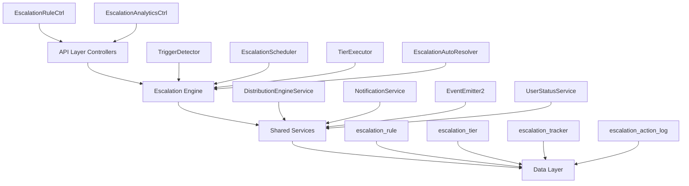

## Overview

The Escalation Module automates responses when assigned leads go stale. A scheduled engine detects trigger conditions (no first contact, went cold) and executes tiered escalation actions — notifications, temperature changes, tag additions, and redistribution to new agents.

<Info>
**Module Status:** Active — fully implemented  
**Module Path:** `src/modules/crm/escalation/`
</Info>

### Design Principles

<CardGroup cols={2}>
  <Card title="pg-boss Scheduling" icon="clock">
    Escalation scheduler uses pg-boss recurring job for reliability
  </Card>
  <Card title="Tiered Actions" icon="layer-group">
    Rules have ordered tiers with configurable delays; actions execute in sequence
  </Card>
  <Card title="Auto-resolution" icon="check-circle">
    Events (activity, stage change, reassignment) automatically resolve active trackers
  </Card>
  <Card title="Idempotency" icon="shield">
    Partial unique index + `ON CONFLICT DO NOTHING` prevents duplicate trackers
  </Card>
  <Card title="Distribution Delegation" icon="share-nodes">
    Reassignment uses the distribution engine (`REDISTRIBUTE` action)
  </Card>
  <Card title="RLS Compliance" icon="lock">
    All entities carry `organization_id` for row-level security
  </Card>
</CardGroup>

---

## Architecture

### High-Level Diagram



### Component Responsibilities

| Component | Responsibility |
|-----------|---------------|
| **EscalationScheduler** | pg-boss recurring job that runs every 60 seconds to detect new triggers and process due escalations |
| **TriggerDetector** | Scans leads for unmet conditions (no first contact, went cold); creates tracker records |
| **TierExecutor** | Executes escalation tier actions (notify, redistribute, change temp, add tag) |
| **EscalationAutoResolver** | Listens to domain events and resolves active trackers when conditions change |
| **EscalationRuleService** | CRUD for escalation rules; handles tracker cancellation on deactivation/deletion |

---

## Entity Specifications

### EscalationRule

Defines when and how a lead should be escalated. Evaluated by `TriggerDetector`.

<AccordionGroup>
  <Accordion title="Core Fields">
    | Column | Type | Notes |
    |--------|------|-------|
    | `id` | uuid PK | Primary key |
    | `organization_id` | uuid FK | RLS enforcement |
    | `name` | varchar | Human-readable rule name |
    | `is_active` | bool | default true |
    | `priority` | int | Evaluation order (lower = higher priority) |
    | `trigger_type` | enum | `NO_FIRST_CONTACT`, `WENT_COLD` |
    | `trigger_config` | jsonb | `{thresholdMinutes?, thresholdValue?, thresholdUnit?}` |
    | `condition_groups` | jsonb | `[{conditions:[{field,operator,value}]}]` — AND-within-OR groups; `[]` = all leads |
    | `respect_business_hours` | bool | default true. References org business hours schedule |
    | `created_by` | uuid FK | User who created the rule |
    | `created_at`, `updated_at` | timestamp | Audit timestamps |
    | `is_deleted` | bool | Soft delete flag |
  </Accordion>

  <Accordion title="Priority Rules">
    Rules are evaluated in ascending `priority` order (lower number = higher priority). Active rules must use unique priorities within the organization.

    **Frontend behavior:**
    - Create mode: defaults `priority` to one greater than the highest active escalation rule priority
    - Edit mode: preserves the existing rule priority
    - Disables submission when an active rule would reuse another active rule's priority
    - Blocks reactivation of paused rules with a conflicting priority

    **Backend enforcement:**
    - Source of truth for concurrent edits
    - Enforces invariant on create, priority update, and reactivation
    - Returns `400 Bad Request` if another active, non-deleted rule uses the requested priority
    - Inactive rules may keep duplicate priorities until activation
  </Accordion>

  <Accordion title="Duplicate Rule Prevention">
    Rule `name` is a display label only — duplicate names are allowed.

    The backend rejects create/update when another **non-deleted** rule in the same organization has an identical **behavior fingerprint**:
    - `triggerType`
    - Normalized `triggerConfig`
    - Canonical `conditionGroups`
    - Canonical tiers/actions (`tierOrder`, `delayMinutes`, action type + params)

    <Note>
    Comparison ignores group/condition ordering within JSONB and treats legacy `thresholdMinutes` as equivalent to `thresholdValue` + `thresholdUnit: MINUTES`.
    </Note>

    On conflict: `400 Bad Request` with message `An escalation rule with identical trigger, conditions, and actions already exists.`

    **Implementation:**
    - Fingerprint helpers: `src/modules/crm/escalation/escalation-rule-fingerprint.util.ts`
    - Shared condition canonicalization: `src/modules/crm/shared/rule-conditions/rule-fingerprint.util.ts`
  </Accordion>

  <Accordion title="Applicability Conditions">
    Escalation reuses the shared rule-condition module (`src/modules/crm/shared/rule-conditions/`).

    ```typescript
    interface ConditionGroup {
      conditions: RuleCondition[]; // AND within group
    }
    // A lead matches when ANY group fully passes.
    // Empty conditionGroups[] = all leads.
    ```

    **Stored shape:** `ConditionGroup[]` where conditions within a group are AND-joined and multiple groups are OR-joined.

    **Supported fields:** Same 8 fields, 6 operators, and value-shape validation as distribution rules.

    **API shape:**
    - `CreateEscalationRuleDto` / `UpdateEscalationRuleDto` accept optional `conditionGroups?: ConditionGroupDto[]`
    - `EscalationRuleDto` returns `conditionGroups: ConditionGroup[]`
    - Omitted or empty `conditionGroups` means the rule applies to all leads

    **Validation:** Uses shared `RuleConditionDto` / `ConditionGroupDto` classes from `src/modules/crm/shared/rule-conditions/`
  </Accordion>

  <Accordion title="SQL Field Mapping">
    Used by `LeadScanService.buildApplicabilityExtraWhere`:

    | Field | SQL Column/Expression | Table/Join | Operators | Notes |
    |-------|----------------------|------------|-----------|-------|
    | `temperature` | `l.temperature` | lead | eq, in | Case-insensitive |
    | `leadSource` | `l.lead_source` | lead | eq, in | Case-insensitive |
    | `intent` | `l.intent` | lead | eq | Case-insensitive |
    | `budget` | `l.budget` | lead | eq, gte, lte, between | Numeric; `between` accepts `{ min, max }` or `[min, max]` |
    | `tags` | `l.tag_ids` | lead | contains | `EXISTS` + `jsonb_array_elements_text` + `IN (?)` per label |
    | `sourceChannel` | `pc.channel_type` | person_channel | eq, in | `LEFT JOIN person_channel` |
    | `language` | `p.languages` | person | eq | `LEFT JOIN person`; matches JSONB `languages[].code` |
    | `area` | wished snapshot names | lead_property_interest | eq, in, contains | `EXISTS` subquery flattening snapshot tables |

    <Warning>
    Unknown `field` keys (corrupt/legacy JSONB only) are skipped with a warning. Groups whose conditions are all empty or skipped produce `AND FALSE` (no leads match).
    </Warning>
  </Accordion>
</AccordionGroup>

### EscalationTier

Each tier in an escalation rule represents a delayed action set. Tiers execute in `tier_order` sequence.

| Column | Type | Notes |
|--------|------|-------|
| `id` | uuid PK | Primary key |
| `escalation_rule_id` | uuid FK | References `escalation_rule(id)` |
| `tier_order` | int | Execution sequence (0-based) |
| `delay_minutes` | int | Delay from previous tier (tier 0: from trigger time) |
| `actions` | jsonb | Array of `EscalationAction` objects |
| `created_at`, `updated_at` | timestamp | Audit timestamps |

<Note>
**Action Types:**
- `NOTIFY`: Send notification to user/team
- `CHANGE_TEMPERATURE`: Update lead temperature
- `ADD_TAG`: Apply tag to lead
- `REDISTRIBUTE`: Trigger distribution engine for reassignment
</Note>

### EscalationTracker

Tracks the escalation state for a specific lead-rule pair.

<Tabs>
  <Tab title="Schema">
    | Column | Type | Notes |
    |--------|------|-------|
    | `id` | uuid PK | Primary key |
    | `organization_id` | uuid FK | RLS enforcement |
    | `lead_id` | uuid FK | References `lead(id)` |
    | `escalation_rule_id` | uuid FK | References `escalation_rule(id)` |
    | `assigned_user_id` | uuid FK | Agent at time of trigger |
    | `trigger_type` | enum | `NO_FIRST_CONTACT`, `WENT_COLD` |
    | `triggered_at` | timestamp | When trigger condition was detected |
    | `current_tier_index` | int | 0-based; next tier to execute |
    | `next_tier_due_at` | timestamp | When next tier should execute |
    | `status` | enum | `ACTIVE`, `RESOLVED`, `CANCELLED` |
    | `resolution_reason` | enum | `ACTIVITY_LOGGED`, `STAGE_CHANGED`, `REASSIGNED`, `RULE_DEACTIVATED`, `MANUAL` |
    | `resolved_at` | timestamp | When tracker was resolved/cancelled |
    | `created_at`, `updated_at` | timestamp | Audit timestamps |
  </Tab>

  <Tab title="Constraints">
    **Unique Index:**
    ```sql
    CREATE UNIQUE INDEX escalation_tracker_active_unique 
    ON escalation_tracker (lead_id, escalation_rule_id) 
    WHERE status = 'ACTIVE';
    ```

    <Info>
    This partial unique index ensures only one active tracker exists per lead-rule pair, enabling idempotent tracker creation with `ON CONFLICT DO NOTHING`.
    </Info>
  </Tab>

  <Tab title="State Transitions">
    ```mermaid
    stateDiagram-v2
        [*] --> ACTIVE: Trigger detected
        ACTIVE --> ACTIVE: Tier executed
        ACTIVE --> RESOLVED: Auto-resolution event
        ACTIVE --> CANCELLED: Rule deactivated/deleted
        RESOLVED --> [*]
        CANCELLED --> [*]
    ```

    **Resolution Reasons:**
    - `ACTIVITY_LOGGED`: New activity recorded on lead
    - `STAGE_CHANGED`: Lead stage updated
    - `REASSIGNED`: Lead assigned to different user
    - `RULE_DEACTIVATED`: Escalation rule deactivated/deleted
    - `MANUAL`: Manually cancelled via API
  </Tab>
</Tabs>

### EscalationActionLog

Audit trail for all executed escalation actions.

| Column | Type | Notes |
|--------|------|-------|
| `id` | uuid PK | Primary key |
| `organization_id` | uuid FK | RLS enforcement |
| `escalation_tracker_id` | uuid FK | References `escalation_tracker(id)` |
| `tier_order` | int | Which tier executed |
| `action_type` | enum | `NOTIFY`, `CHANGE_TEMPERATURE`, `ADD_TAG`, `REDISTRIBUTE` |
| `action_config` | jsonb | Action parameters |
| `result` | jsonb | Execution outcome/errors |
| `executed_at` | timestamp | When action was executed |

---

## Type Definitions

### Trigger Types

<CodeGroup>
```typescript NO_FIRST_CONTACT
/**
 * Triggers when assigned lead has no outbound activity
 * within threshold period after assignment.
 */
enum TriggerType {
  NO_FIRST_CONTACT = 'NO_FIRST_CONTACT'
}

interface NoFirstContactConfig {
  thresholdValue: number;
  thresholdUnit: 'MINUTES' | 'HOURS' | 'DAYS';
}
```

```typescript WENT_COLD
/**
 * Triggers when assigned lead has no activity
 * (inbound or outbound) within threshold period.
 */
enum TriggerType {
  WENT_COLD = 'WENT_COLD'
}

interface WentColdConfig {
  thresholdValue: number;
  thresholdUnit: 'MINUTES' | 'HOURS' | 'DAYS';
}
```
</CodeGroup>

<Note>
Legacy rules may use `thresholdMinutes` instead of `thresholdValue` + `thresholdUnit`. The system treats them as equivalent.
</Note>

### Action Types

<AccordionGroup>
  <Accordion title="NOTIFY">
    ```typescript
    interface NotifyAction {
      type: 'NOTIFY';
      recipientType: 'USER' | 'TEAM';
      recipientIds: string[];
      messageTemplate?: string;
    }
    ```

    Sends notification to specified users or teams. Uses `NotificationService` for delivery.
  </Accordion>

  <Accordion title="CHANGE_TEMPERATURE">
    ```typescript
    interface ChangeTemperatureAction {
      type: 'CHANGE_TEMPERATURE';
      newTemperature: 'HOT' | 'WARM' | 'COLD' | 'FROZEN';
    }
    ```

    Updates lead temperature field. Emits `lead.temperature.changed` event.
  </Accordion>

  <Accordion title="ADD_TAG">
    ```typescript
    interface AddTagAction {
      type: 'ADD_TAG';
      tagIds: string[];
    }
    ```

    Applies specified tags to lead. Idempotent - skips already-applied tags.
  </Accordion>

  <Accordion title="REDISTRIBUTE">
    ```typescript
    interface RedistributeAction {
      type: 'REDISTRIBUTE';
      distributionRuleId?: string; // Optional: specific rule to use
    }
    ```

    <Warning>
    Triggers the distribution engine to reassign the lead. If `distributionRuleId` is omitted, uses the highest-priority active distribution rule.
    </Warning>
  </Accordion>
</AccordionGroup>

### Status Enums

```typescript
enum TrackerStatus {
  ACTIVE = 'ACTIVE',       // Escalation in progress
  RESOLVED = 'RESOLVED',   // Auto-resolved by event
  CANCELLED = 'CANCELLED'  // Stopped by rule deactivation/manual action
}

enum ResolutionReason {
  ACTIVITY_LOGGED = 'ACTIVITY_LOGGED',
  STAGE_CHANGED = 'STAGE_CHANGED',
  REASSIGNED = 'REASSIGNED',
  RULE_DEACTIVATED = 'RULE_DEACTIVATED',
  MANUAL = 'MANUAL'
}
```

---

## Escalation Engine

### Trigger Detection

<Steps>
  <Step title="Scheduler Activation">
    The `EscalationScheduler` runs as a pg-boss recurring job every 60 seconds.
  </Step>

  <Step title="Rule Evaluation">
    For each active `EscalationRule` (ordered by `priority` ascending):
    - Load rule with tiers and conditions
    - Pass conditions to `LeadScanService`
    - Execute SQL scan to find matching leads
  </Step>

  <Step title="Trigger Condition Check">
    <Tabs>
      <Tab title="NO_FIRST_CONTACT">
        ```sql
        SELECT l.* FROM lead l
        WHERE l.assigned_user_id IS NOT NULL
          AND l.assigned_at < NOW() - INTERVAL '${threshold}'
          AND NOT EXISTS (
            SELECT 1 FROM activity a
            WHERE a.lead_id = l.id
              AND a.direction = 'OUTBOUND'
              AND a.created_at >= l.assigned_at
          )
          AND ... -- applicability conditions
        ```
      </Tab>

      <Tab title="WENT_COLD">
        ```sql
        SELECT l.* FROM lead l
        LEFT JOIN activity a ON a.lead_id = l.id AND a.is_deleted = false
        WHERE l.assigned_user_id IS NOT NULL
        GROUP BY l.id
        HAVING MAX(a.created_at) < NOW() - INTERVAL '${threshold}'
           OR MAX(a.created_at) IS NULL
          AND ... -- applicability conditions
        ```
      </Tab>
    </Tabs>

    <Info>
    When `respect_business_hours = true`, the threshold calculation adjusts for non-business hours using the organization's business hours schedule.
    </Info>
  </Step>

  <Step title="Tracker Creation">
    For each matching lead:
    ```typescript
    INSERT INTO escalation_tracker (
      lead_id, escalation_rule_id, assigned_user_id,
      trigger_type, triggered_at, current_tier_index,
      next_tier_due_at, status
    ) VALUES (...)
    ON CONFLICT (lead_id, escalation_rule_id) WHERE status = 'ACTIVE'
    DO NOTHING;
    ```

    <Check>
    The partial unique index ensures idempotency - duplicate triggers are silently ignored.
    </Check>
  </Step>
</Steps>

### Tier Execution

<Steps>
  <Step title="Due Tracker Identification">
    ```sql
    SELECT * FROM escalation_tracker
    WHERE status = 'ACTIVE'
      AND next_tier_due_at <= NOW()
    ORDER BY next_tier_due_at ASC
    LIMIT 100;
    ```
  </Step>

  <Step title="Tier Action Execution">
    For each tracker:
    1. Load current tier from `escalation_tier`
    2. Execute each action in `actions` array sequentially
    3. Log each action to `escalation_action_log`
    4. Handle action failures gracefully (log error, continue)
  </Step>

  <Step title="Tracker State Update">
    <Tabs>
      <Tab title="More Tiers Remaining">
        ```typescript
        tracker.current_tier_index++;
        tracker.next_tier_due_at = calculateNextTierDueAt(
          tracker.next_tier_due_at,
          nextTier.delay_minutes,
          rule.respect_business_hours
        );
        ```
      </Tab>

      <Tab title="Final Tier Complete">
        ```typescript
        tracker.status = 'RESOLVED';
        tracker.resolution_reason = null; // Naturally completed
        tracker.resolved_at = new Date();
        ```
      </Tab>
    </Tabs>
  </Step>
</Steps>

### Action Execution Details

<Tabs>
  <Tab title="NOTIFY">
    ```typescript
    await notificationService.send({
      organizationId: tracker.organization_id,
      recipientType: action.recipientType,
      recipientIds: action.recipientIds,
      type: 'ESCALATION_ALERT',
      payload: {
        leadId: tracker.lead_id,
        ruleId: tracker.escalation_rule_id,
        tierOrder: tracker.current_tier_index,
        messageTemplate: action.messageTemplate
      }
    });
    ```
  </Tab>

  <Tab title="CHANGE_TEMPERATURE">
    ```typescript
    await leadService.updateTemperature(
      tracker.lead_id,
      action.newTemperature,
      {
        source: 'ESCALATION',
        escalationTrackerId: tracker.id
      }
    );
    // Emits: lead.temperature.changed event
    ```
  </Tab>

  <Tab title="ADD_TAG">
    ```typescript
    await leadService.addTags(
      tracker.lead_id,
      action.tagIds,
      {
        source: 'ESCALATION',
        escalationTrackerId: tracker.id
      }
    );
    ```
  </Tab>

  <Tab title="REDISTRIBUTE">
    ```typescript
    await distributionEngineService.redistribute({
      leadId: tracker.lead_id,
      organizationId: tracker.organization_id,
      distributionRuleId: action.distributionRuleId,
      reason: 'ESCALATION',
      escalationTrackerId: tracker.id
    });
    // Distribution engine handles assignment logic
    ```

    <Warning>
    If no distribution rules match the lead, the redistribution fails gracefully and logs an error. The tracker continues to the next action.
    </Warning>
  </Tab>
</Tabs>

### Auto-Resolution

The `EscalationAutoResolver` listens to domain events and resolves active trackers when conditions change:

<CodeGroup>
```typescript Activity Logged
@OnEvent('activity.created')
async handleActivityCreated(event: ActivityCreatedEvent) {
  await this.resolveTrackersForLead(
    event.leadId,
    'ACTIVITY_LOGGED'
  );
}
```

```typescript Stage Changed
@OnEvent('lead.stage.changed')
async handleStageChanged(event: LeadStageChangedEvent) {
  await this.resolveTrackersForLead(
    event.leadId,
    'STAGE_CHANGED'
  );
}
```

```typescript Lead Reassigned
@OnEvent('lead.assigned')
async handleLeadAssigned(event: LeadAssignedEvent) {
  await this.resolveTrackersForLead(
    event.leadId,
    'REASSIGNED'
  );
}
```

```typescript Rule Deactivated
@OnEvent('escalation.rule.deactivated')
async handleRuleDeactivated(event: RuleDeactivatedEvent) {
  await this.cancelTrackersForRule(
    event.ruleId,
    'RULE_DEACTIVATED'
  );
}
```
</CodeGroup>

<Info>
**Resolution Logic:**
```typescript
UPDATE escalation_tracker
SET status = 'RESOLVED',
    resolution_reason = ?,
    resolved_at = NOW()
WHERE lead_id = ?
  AND status = 'ACTIVE';
```
</Info>

---

## API Endpoints

### Escalation Rules

<AccordionGroup>
  <Accordion title="POST /api/crm/escalation/rules">
    **Create Escalation Rule**

    ```typescript Request
    {
      "name": "No Contact Within 24h",
      "priority": 1,
      "triggerType": "NO_FIRST_CONTACT",
      "triggerConfig": {
        "thresholdValue": 24,
        "thresholdUnit": "HOURS"
      },
      "conditionGroups": [
        {
          "conditions": [
            {
              "field": "temperature",
              "operator": "eq",
              "value": "HOT"
            }
          ]
        }
      ],
      "respectBusinessHours": true,
      "tiers": [
        {
          "tierOrder": 0,
          "delayMinutes": 0,
          "actions": [
            {
              "type": "NOTIFY",
              "recipientType": "USER",
              "recipientIds": ["manager-uuid"]
            }
          ]
        },
        {
          "tierOrder": 1,
          "delayMinutes": 60,
          "actions": [
            {
              "type": "CHANGE_TEMPERATURE",
              "newTemperature": "WARM"
            },
            {
              "type": "REDISTRIBUTE"
            }
          ]
        }
      ]
    }
    ```

    ```typescript Response: 201 Created
    {
      "id": "uuid",
      "organizationId": "uuid",
      "name": "No Contact Within 24h",
      "isActive": true,
      "priority": 1,
      "triggerType": "NO_FIRST_CONTACT",
      "triggerConfig": { ... },
      "conditionGroups": [ ... ],
      "respectBusinessHours": true,
      "tiers": [ ... ],
      "createdBy": "uuid",
      "createdAt": "2024-01-01T00:00:00Z",
      "updatedAt": "2024-01-01T00:00:00Z"
    }
    ```

    <Warning>
    Returns `400 Bad Request` if:
    - Another active rule uses the same priority
    - An identical rule (same fingerprint) already exists
    - Condition validation fails
    </Warning>
  </Accordion>

  <Accordion title="GET /api/crm/escalation/rules">
    **List Escalation Rules**

    **Query Parameters:**
    - `isActive` (boolean): Filter by active status
    - `triggerType` (string): Filter by trigger type
    - `page` (number): Page number (default: 1)
    - `limit` (number): Items per page (default: 20)

    ```typescript Response: 200 OK
    {
      "data": [
        {
          "id": "uuid",
          "name": "No Contact Within 24h",
          "isActive": true,
          "priority": 1,
          "triggerType": "NO_FIRST_CONTACT",
          // ... full rule object
        }
      ],
      "meta": {
        "total": 15,
        "page": 1,
        "limit": 20,
        "totalPages": 1
      }
    }
    ```
  </Accordion>

  <Accordion title="GET /api/crm/escalation/rules/:id">
    **Get Escalation Rule**

    ```typescript Response: 200 OK
    {
      "id": "uuid",
      "organizationId": "uuid",
      "name": "No Contact Within 24h",
      "isActive": true,
      "priority": 1,
      "triggerType": "NO_FIRST_CONTACT",
      "triggerConfig": {
        "thresholdValue": 24,
        "thresholdUnit": "HOURS"
      },
      "conditionGroups": [ ... ],
      "respectBusinessHours": true,
      "tiers": [
        {
          "id": "uuid",
          "tierOrder": 0,
          "delayMinutes": 0,
          "actions": [ ... ]
        }
      ],
      "createdBy": "uuid",
      "createdAt": "2024-01-01T00:00:00Z",
      "updatedAt": "2024-01-01T00:00:00Z"
    }
    ```
  </Accordion>

  <Accordion title="PATCH /api/crm/escalation/rules/:id">
    **Update Escalation Rule**

    ```typescript Request
    {
      "name": "Updated Rule Name",
      "priority": 2,
      "triggerConfig": {
        "thresholdValue": 48,
        "thresholdUnit": "HOURS"
      },
      "tiers": [ ... ]
    }
    ```

    <Note>
    Updating a rule does not affect existing active trackers. Changes apply only to newly detected triggers.
    </Note>
  </Accordion>

  <Accordion title="PATCH /api/crm/escalation/rules/:id/toggle">
    **Activate/Deactivate Rule**

    ```typescript Request
    {
      "isActive": false
    }
    ```

    <Warning>
    Deactivating a rule cancels all active trackers with `resolution_reason = 'RULE_DEACTIVATED'`.
    </Warning>
  </Accordion>

  <Accordion title="DELETE /api/crm/escalation/rules/:id">
    **Delete Escalation Rule**

    Soft-deletes the rule and cancels all active trackers.

    ```typescript Response: 204 No Content
    ```
  </Accordion>
</AccordionGroup>

### Escalation Trackers

<AccordionGroup>
  <Accordion title="GET /api/crm/escalation/trackers">
    **List Escalation Trackers**

    **Query Parameters:**
    - `leadId` (uuid): Filter by lead
    - `ruleId` (uuid): Filter by rule
    - `status` (string): Filter by status (ACTIVE, RESOLVED, CANCELLED)
    - `assignedUserId` (uuid): Filter by assigned user
    - `page` (number): Page number
    - `limit` (number): Items per page

    ```typescript Response: 200 OK
    {
      "data": [
        {
          "id": "uuid",
          "leadId": "uuid",
          "escalationRuleId": "uuid",
          "assignedUserId": "uuid",
          "triggerType": "NO_FIRST_CONTACT",
          "triggeredAt": "2024-01-01T00:00:00Z",
          "currentTierIndex": 1,
          "nextTierDueAt": "2024-01-01T01:00:00Z",
          "status": "ACTIVE",
          "resolutionReason": null,
          "resolvedAt": null
        }
      ],
      "meta": { ... }
    }
    ```
  </Accordion>

  <Accordion title="GET /api/crm/escalation/trackers/:id">
    **Get Escalation Tracker**

    ```typescript Response: 200 OK
    {
      "id": "uuid",
      "leadId": "uuid",
      "escalationRuleId": "uuid",
      "assignedUserId": "uuid",
      "triggerType": "NO_FIRST_CONTACT",
      "triggeredAt": "2024-01-01T00:00:00Z",
      "currentTierIndex": 1,
      "nextTierDueAt": "2024-01-01T01:00:00Z",
      "status": "ACTIVE",
      "resolutionReason": null,
      "resolvedAt": null,
      "actionLogs": [
        {
          "id": "uuid",
          "tierOrder": 0,
          "actionType": "NOTIFY",
          "actionConfig": { ... },
          "result": { "success": true },
          "executedAt": "2024-01-01T00:00:00Z"
        }
      ]
    }
    ```
  </Accordion>

  <Accordion title="POST /api/crm/escalation/trackers/:id/cancel">
    **Cancel Escalation Tracker**

    Manually cancels an active tracker.

    ```typescript Response: 200 OK
    {
      "id": "uuid",
      "status": "CANCELLED",
      "resolutionReason": "MANUAL",
      "resolvedAt": "2024-01-01T12:00:00Z"
    }
    ```
  </Accordion>
</AccordionGroup>

### Analytics

<AccordionGroup>
  <Accordion title="GET /api/crm/escalation/analytics/summary">
    **Escalation Summary**

    **Query Parameters:**
    - `startDate` (ISO date): Start of date range
    - `endDate` (ISO date): End of date range
    - `ruleId` (uuid): Filter by specific rule

    ```typescript Response: 200 OK
    {
      "totalTriggered": 150,
      "activeTrackers": 42,
      "resolvedTrackers": 98,
      "cancelledTrackers": 10,
      "byResolutionReason": {
        "ACTIVITY_LOGGED": 65,
        "STAGE_CHANGED": 20,
        "REASSIGNED": 13
      },
      "byRule": [
        {
          "ruleId": "uuid",
          "ruleName": "No Contact Within 24h",
          "triggered": 75,
          "resolved": 60,
          "active": 15
        }
      ],
      "averageResolutionTime": "2h 30m"
    }
    ```
  </Accordion>

  <Accordion title="GET /api/crm/escalation/analytics/by-user">
    **User Escalation Metrics**

    ```typescript Response: 200 OK
    {
      "data": [
        {
          "userId": "uuid",
          "userName": "John Doe",
          "totalEscalations": 25,
          "activeEscalations": 5,
          "averageResolutionTime": "1h 45m",
          "escalationRate": 0.15 // Percentage of assigned leads
        }
      ]
    }
    ```
  </Accordion>

  <Accordion title="GET /api/crm/escalation/analytics/timeline">
    **Escalation Timeline**

    **Query Parameters:**
    - `startDate` (ISO date)
    - `endDate` (ISO date)
    - `granularity` (string): `hour`, `day`, `week`, `month`

    ```typescript Response: 200 OK
    {
      "data": [
        {
          "period": "2024-01-01",
          "triggered": 15,
          "resolved": 12,
          "cancelled": 2
        }
      ]
    }
    ```
  </Accordion>
</AccordionGroup>

---

## Security & Permissions

### Row-Level Security (RLS)

All escalation entities enforce RLS via `organization_id`:

```sql
-- escalation_rule
CREATE POLICY escalation_rule_org_isolation ON escalation_rule
  USING (organization_id = current_setting('app.current_organization_id')::uuid);

-- escalation_tracker
CREATE POLICY escalation_tracker_org_isolation ON escalation_tracker
  USING (organization_id = current_setting('app.current_organization_id')::uuid);

-- escalation_action_log
CREATE POLICY escalation_action_log_org_isolation ON escalation_action_log
  USING (organization_id = current_setting('app.current_organization_id')::uuid);
```

<Warning>
The `TenantContext` middleware sets `app.current_organization_id` for all authenticated requests. All queries automatically filter by organization.
</Warning>

### Permission Requirements

<Tabs>
  <Tab title="Escalation Rules">
    | Operation | Required Permission |
    |-----------|---------------------|
    | Create Rule | `escalation_rule:create` |
    | Update Rule | `escalation_rule:update` |
    | Delete Rule | `escalation_rule:delete` |
    | View Rules | `escalation_rule:read` |
    | Toggle Active Status | `escalation_rule:update` |
  </Tab>

  <Tab title="Escalation Trackers">
    | Operation | Required Permission |
    |-----------|---------------------|
    | View Trackers | `escalation_tracker:read` |
    | Cancel Tracker | `escalation_tracker:cancel` |
    | View Action Logs | `escalation_action_log:read` |
  </Tab>

  <Tab title="Analytics">
    | Operation | Required Permission |
    |-----------|---------------------|
    | View Analytics | `escalation_analytics:read` |
    | Export Reports | `escalation_analytics:export` |
  </Tab>
</Tabs>

<Note>
**Role Defaults:**
- **Admin:** All escalation permissions
- **Manager:** Read/create/update rules, view analytics
- **Agent:** Read-only access to own trackers
</Note>

---

## Analytics & Metrics

### Key Metrics

<CardGroup cols={2}>
  <Card title="Escalation Rate" icon="chart-line">
    Percentage of assigned leads that trigger escalation rules
    ```
    escalation_rate = triggered_count / total_assigned_leads
    ```
  </Card>

  <Card title="Resolution Time" icon="clock">
    Average time from trigger to resolution
    ```
    avg_resolution_time = AVG(resolved_at - triggered_at)
    WHERE status = 'RESOLVED'
    ```
  </Card>

  <Card title="Action Success Rate" icon="check">
    Percentage of actions that execute successfully
    ```
    success_rate = successful_actions / total_actions
    ```
  </Card>

  <Card title="Tier Completion" icon="layer-group">
    Distribution of trackers by final tier reached
    ```
    GROUP BY current_tier_index WHERE status != 'ACTIVE'
    ```
  </Card>
</CardGroup>

### Dashboard Queries

<AccordionGroup>
  <Accordion title="Active Escalations by Rule">
    ```sql
    SELECT 
      er.id,
      er.name,
      COUNT(et.id) as active_count,
      AVG(EXTRACT(EPOCH FROM (NOW() - et.triggered_at))/3600) as avg_hours_active
    FROM escalation_rule er
    LEFT JOIN escalation_tracker et ON et.escalation_rule_id = er.id
      AND et.status = 'ACTIVE'
    WHERE er.organization_id = ?
      AND er.is_active = true
      AND er.is_deleted = false
    GROUP BY er.id, er.name
    ORDER BY active_count DESC;
    ```
  </Accordion>

  <Accordion title="Resolution Breakdown">
    ```sql
    SELECT 
      resolution_reason,
      COUNT(*) as count,
      ROUND(AVG(EXTRACT(EPOCH FROM (resolved_at - triggered_at))/3600), 2) as avg_hours
    FROM escalation_tracker
    WHERE organization_id = ?
      AND status = 'RESOLVED'
      AND resolved_at >= ?
      AND resolved_at <= ?
    GROUP BY resolution_reason
    ORDER BY count DESC;
    ```
  </Accordion>

  <Accordion title="User Performance">
    ```sql
    SELECT 
      u.id,
      u.name,
      COUNT(et.id) as total_escalations,
      COUNT(et.id) FILTER (WHERE et.status = 'ACTIVE') as active_count,
      COUNT(et.id) FILTER (WHERE et.status = 'RESOLVED') as resolved_count,
      ROUND(AVG(
        EXTRACT(EPOCH FROM (et.resolved_at - et.triggered_at))/3600
      ) FILTER (WHERE et.status = 'RESOLVED'), 2) as avg_resolution_hours
    FROM "user" u
    LEFT JOIN escalation_tracker et ON et.assigned_user_id = u.id
      AND et.organization_id = ?
      AND et.triggered_at >= ?
      AND et.triggered_at <= ?
    WHERE u.organization_id = ?
    GROUP BY u.id, u.name
    ORDER BY total_escalations DESC;
    ```
  </Accordion>
</AccordionGroup>

---

## Edge Case Handling

<AccordionGroup>
  <Accordion title="Concurrent Rule Evaluation">
    **Problem:** Multiple rules match the same lead simultaneously.

    **Solution:** Rules are evaluated in `priority` order (ascending). The first matching rule creates a tracker; duplicate tracker attempts fail silently via `ON CONFLICT DO NOTHING`.

    <Check>
    Only one escalation can be active per lead-rule pair at any time.
    </Check>
  </Accordion>

  <Accordion title="Rule Changes Mid-Escalation">
    **Problem:** A rule is updated while trackers are active.

    **Solution:** Existing trackers continue with their original tier configuration. Changes apply only to newly detected triggers.

    <Info>
    Tiers are not stored as references — the tier configuration is effectively captured at tracker creation time.
    </Info>
  </Accordion>

  <Accordion title="Lead Reassignment During Escalation">
    **Problem:** Lead is reassigned to a different user while escalation is active.

    **Solution:** The `EscalationAutoResolver` resolves the tracker with `resolution_reason = 'REASSIGNED'`. The lead may re-trigger if the new agent also fails to contact.
  </Accordion>

  <Accordion title="Business Hours Boundary">
    **Problem:** Tracker becomes due at 6 PM, but business hours end at 5 PM.

    **Solution:** When `respect_business_hours = true`, the `calculateNextTierDueAt` function shifts the due time to the next business day's start.

    ```typescript
    if (respectBusinessHours && !isBusinessHour(dueAt, businessHours)) {
      dueAt = getNextBusinessHourStart(dueAt, businessHours);
    }
    ```
  </Accordion>

  <Accordion title="Action Execution Failure">
    **Problem:** A NOTIFY action fails due to notification service error.

    **Solution:** 
    - Error is logged to `escalation_action_log.result`
    - Execution continues to next action in tier
    - Tracker advances to next tier on schedule
    - Failed action does not block escalation progression

    <Warning>
    Critical failures (e.g., REDISTRIBUTE) are logged but do not retry automatically. Manual intervention may be required.
    </Warning>
  </Accordion>

  <Accordion title="Orphaned Trackers">
    **Problem:** Lead or rule is hard-deleted, leaving orphaned trackers.

    **Solution:** 
    - Foreign key constraints use `ON DELETE CASCADE`
    - Deleting a lead cascades to its trackers
    - Deleting a rule soft-deletes it and cancels trackers (via application logic)

    <Info>
    Hard deletes are rare — soft delete (`is_deleted = true`) is the standard pattern.
    </Info>
  </Accordion>

  <Accordion title="Duplicate Rule Creation">
    **Problem:** User attempts to create a rule with identical behavior to an existing rule.

    **Solution:** The backend computes a fingerprint (trigger type, config, conditions, tiers) and rejects duplicates with `400 Bad Request`.

    ```typescript
    const fingerprint = computeRuleFingerprint({
      triggerType: dto.triggerType,
      triggerConfig: normalizeTriggerConfig(dto.triggerConfig),
      conditionGroups: canonicalizeConditionGroups(dto.conditionGroups),
      tiers: canonicalizeTiers(dto.tiers)
    });

    const existingRule = await this.ruleRepo.findOne({
      organization_id: orgId,
      fingerprint,
      is_deleted: false
    });

    if (existingRule) {
      throw new ConflictException(
        'An escalation rule with identical trigger, conditions, and actions already exists.'
      );
    }
    ```
  </Accordion>

  <Accordion title="Priority Conflicts on Reactivation">
    **Problem:** User pauses a rule, another rule takes its priority, then user tries to reactivate.

    **Solution:** 
    - Backend rejects reactivation if priority is taken
    - Frontend blocks reactivation button with tooltip
    - User must change priority before reactivating

    <Note>
    Inactive rules may share priorities with other inactive rules — conflict only blocks activation.
    </Note>
  </Accordion>
</AccordionGroup>

---

## Performance & Scaling

### Scheduler Optimization

<Steps>
  <Step title="Batch Processing">
    The scheduler processes trackers in batches of 100 to avoid memory issues:
    ```typescript
    const BATCH_SIZE = 100;
    let offset = 0;
    while (true) {
      const batch = await this.trackerRepo.find({
        status: 'ACTIVE',
        next_tier_due_at: { $lte: new Date() }
      }, {
        limit: BATCH_SIZE,
        offset
      });
      if (batch.length === 0) break;
      await this.processBatch(batch);
      offset += BATCH_SIZE;
    }
    ```
  </Step>

  <Step title="Index Strategy">
    Critical indexes for scheduler performance:
    ```sql
    -- Trigger detection scan
    CREATE INDEX idx_lead_assigned_at 
    ON lead (organization_id, assigned_at, assigned_user_id)
    WHERE assigned_user_id IS NOT NULL AND is_deleted = false;

    -- Due tracker lookup
    CREATE INDEX idx_tracker_due_at 
    ON escalation_tracker (organization_id, next_tier_due_at)
    WHERE status = 'ACTIVE';

    -- Auto-resolution
    CREATE INDEX idx_tracker_lead_status 
    ON escalation_tracker (lead_id, status)
    WHERE status = 'ACTIVE';
    ```
  </Step>

  <Step title="Query Optimization">
    - Use `EXPLAIN ANALYZE` on trigger detection queries
    - Partition `escalation_action_log` by month if volume exceeds 1M rows
    - Consider materialized view for analytics queries
  </Step>
</Steps>

### Monitoring

<CardGroup cols={2}>
  <Card title="Scheduler Health" icon="heartbeat">
    - Job execution time (target: <10s)
    - Trigger detection count per run
    - Failed action rate
    - Tracker backlog size
  </Card>

  <Card title="Database Metrics" icon="database">
    - Query execution time
    - Index hit ratio
    - Row count growth
    - Lock contention on tracker table
  </Card>
</CardGroup>

<Warning>
**Alert Thresholds:**
- Scheduler run time >30s
- Active tracker count >1000
- Failed action rate >5%
- Trigger detection returning 0 results for 3+ consecutive runs
</Warning>

---

## RLS Policies

<AccordionGroup>
  <Accordion title="escalation_rule">
    ```sql
    -- Read: any user in organization
    CREATE POLICY escalation_rule_read ON escalation_rule
      FOR SELECT
      USING (
        organization_id = current_setting('app.current_organization_id')::uuid
      );

    -- Write: users with escalation_rule:create permission
    CREATE POLICY escalation_rule_write ON escalation_rule
      FOR INSERT
      WITH CHECK (
        organization_id = current_setting('app.current_organization_id')::uuid
        AND current_setting('app.current_user_id')::uuid IN (
          SELECT user_id FROM user_permission 
          WHERE permission = 'escalation_rule:create'
        )
      );

    -- Update: users with escalation_rule:update permission
    CREATE POLICY escalation_rule_update ON escalation_rule
      FOR UPDATE
      USING (
        organization_id = current_setting('app.current_organization_id')::uuid
        AND current_setting('app.current_user_id')::uuid IN (
          SELECT user_id FROM user_permission 
          WHERE permission = 'escalation_rule:update'
        )
      );
    ```
  </Accordion>

  <Accordion title="escalation_tracker">
    ```sql
    -- Read: any user in organization (agents see only their own)
    CREATE POLICY escalation_tracker_read ON escalation_tracker
      FOR SELECT
      USING (
        organization_id = current_setting('app.current_organization_id')::uuid
        AND (
          current_setting('app.current_user_role') IN ('admin', 'manager')
          OR assigned_user_id = current_setting('app.current_user_id')::uuid
        )
      );

    -- System writes (scheduler only)
    CREATE POLICY escalation_tracker_system_write ON escalation_tracker
      FOR ALL
      USING (
        organization_id = current_setting('app.current_organization_id')::uuid
        AND current_setting('app.is_system_context')::boolean = true
      );
    ```
  </Accordion>

  <Accordion title="escalation_action_log">
    ```sql
    -- Read: same as tracker visibility
    CREATE POLICY escalation_action_log_read ON escalation_action_log
      FOR SELECT
      USING (
        organization_id = current_setting('app.current_organization_id')::uuid
        AND (
          current_setting('app.current_user_role') IN ('admin', 'manager')
          OR escalation_tracker_id IN (
            SELECT id FROM escalation_tracker 
            WHERE assigned_user_id = current_setting('app.current_user_id')::uuid
          )
        )
      );

    -- System writes only
    CREATE POLICY escalation_action_log_system_write ON escalation_action_log
      FOR INSERT
      WITH CHECK (
        organization_id = current_setting('app.current_organization_id')::uuid
        AND current_setting('app.is_system_context')::boolean = true
      );
    ```
  </Accordion>
</AccordionGroup>

<Info>
The `app.is_system_context` session variable is set by the `EscalationScheduler` to bypass user-level permissions during automated processing.
</Info>

---

## Module Structure

```
src/modules/crm/escalation/
├── controllers/
│   ├── escalation-rule.controller.ts
│   ├── escalation-tracker.controller.ts
│   └── escalation-analytics.controller.ts
├── services/
│   ├── escalation-rule.service.ts
│   ├── escalation-scheduler.service.ts
│   ├── trigger-detector.service.ts
│   ├── tier-executor.service.ts
│   └── escalation-auto-resolver.service.ts
├── entities/
│   ├── escalation-rule.entity.ts
│   ├── escalation-tier.entity.ts
│   ├── escalation-tracker.entity.ts
│   └── escalation-action-log.entity.ts
├── dto/
│   ├── create-escalation-rule.dto.ts
│   ├── update-escalation-rule.dto.ts
│   ├── escalation-rule.dto.ts
│   ├── escalation-tracker.dto.ts
│   └── escalation-analytics.dto.ts
├── types/
│   ├── escalation.types.ts
│   ├── trigger-type.enum.ts
│   ├── action-type.enum.ts
│   └── tracker-status.enum.ts
├── utils/
│   ├── escalation-rule-fingerprint.util.ts
│   ├── business-hours-calculator.util.ts
│   └── condition-evaluator.util.ts
├── migrations/
│   └── Migration20260607120000_EscalationConditionsToGroups.ts
└── escalation.module.ts
```

---

## Integration Points

### Distribution Engine

<Tabs>
  <Tab title="REDISTRIBUTE Action">
    ```typescript
    // Called by TierExecutor when REDISTRIBUTE action executes
    await distributionEngineService.redistribute({
      leadId: tracker.lead_id,
      organizationId: tracker.organization_id,
      distributionRuleId: action.distributionRuleId, // optional
      reason: 'ESCALATION',
      metadata: {
        escalationTrackerId: tracker.id,
        originalAssignedUserId: tracker.assigned_user_id
      }
    });
    ```

    <Info>
    The distribution engine evaluates rules, selects a new agent, and updates the lead assignment. This triggers the `lead.assigned` event, which auto-resolves the escalation tracker.
    </Info>
  </Tab>

  <Tab title="Integration Flow">
    ```mermaid
    sequenceDiagram
        participant E as Escalation Engine
        participant D as Distribution Engine
        participant L as Lead Service
        participant AR as Auto Resolver

        E->>D: redistribute(leadId, reason: ESCALATION)
        D->>D: Evaluate distribution rules
        D->>L: updateAssignment(leadId, newUserId)
        L->>L: Update lead.assigned_user_id
        L->>AR: Emit lead.assigned event
        AR->>E: Resolve escalation tracker
    ```
  </Tab>
</Tabs>

### Notification Service

```typescript
// Called by TierExecutor for NOTIFY actions
await notificationService.send({
  organizationId: tracker.organization_id,
  recipientType: action.recipientType, // 'USER' | 'TEAM'
  recipientIds: action.recipientIds,
  type: 'ESCALATION_ALERT',
  title: `Lead Escalated: ${lead.name}`,
  body: action.messageTemplate || defaultTemplate,
  data: {
    leadId: tracker.lead_id,
    trackerId: tracker.id,
    ruleId: tracker.escalation_rule_id,
    tierOrder: tracker.current_tier_index
  },
  channels: ['IN_APP', 'EMAIL'], // configurable
  priority: 'HIGH'
});
```

<Note>
Notification templates support variables: `{leadName}`, `{agentName}`, `{ruleName}`, `{tierNumber}`, `{hoursOverdue}`
</Note>

### Event Emitter Integration

<CodeGroup>
```typescript Event Emission
// Lead service emits events
this.eventEmitter.emit('activity.created', {
  activityId: activity.id,
  leadId: activity.lead_id,
  direction: activity.direction,
  createdAt: activity.created_at
});

this.eventEmitter.emit('lead.stage.changed', {
  leadId: lead.id,
  oldStage: oldStage,
  newStage: lead.stage,
  changedBy: userId,
  changedAt: new Date()
});

this.eventEmitter.emit('lead.assigned', {
  leadId: lead.id,
  oldAssignedUserId: lead.assigned_user_id,
  newAssignedUserId: newUserId,
  reason: 'ESCALATION',
  assignedAt: new Date()
});
```

```typescript Event Listeners
// EscalationAutoResolver listens
@OnEvent('activity.created')
async handleActivityCreated(event: ActivityCreatedEvent) {
  await this.resolveTrackersForLead(
    event.leadId,
    'ACTIVITY_LOGGED'
  );
}

@OnEvent('lead.stage.changed')
async handleStageChanged(event: LeadStageChangedEvent) {
  await this.resolveTrackersForLead(
    event.leadId,
    'STAGE_CHANGED'
  );
}

@OnEvent('lead.assigned')
async handleLeadAssigned(event: LeadAssignedEvent) {
  if (event.reason !== 'ESCALATION') {
    // Only resolve if reassignment was NOT from escalation
    await this.resolveTrackersForLead(
      event.leadId,
      'REASSIGNED'
    );
  }
}
```
</CodeGroup>

### User Status Service

```typescript
// Used by TierExecutor to validate recipient availability
const isAvailable = await userStatusService.isUserAvailable(
  recipientId,
  {
    respectOnlineStatus: true,
    respectWorkingHours: true,
    respectDoNotDisturb: true
  }
);

if (!isAvailable) {
  // Fall back to alternative recipient or skip notification
  logger.warn(`User ${recipientId} unavailable, skipping notification`);
}
```

---

## Testing Considerations

<Tabs>
  <Tab title="Unit Tests">
    **Key Test Cases:**
    - Trigger detection logic for each trigger type
    - Business hours calculation
    - Tier execution sequence
    - Action execution handlers
    - Auto-resolution condition matching
    - Fingerprint computation and duplicate detection
  </Tab>

  <Tab title="Integration Tests">
    **Scenarios:**
    - End-to-end escalation flow (trigger → tier execution → resolution)
    - Rule priority ordering
    - Concurrent rule evaluation
    - Distribution engine integration
    - Notification delivery
    - Event-driven auto-resolution
  </Tab>

  <Tab title="Performance Tests">
    **Load Scenarios:**
    - 10,000 active trackers
    - 100 concurrent rule evaluations
    - Scheduler processing 1,000 due trackers
    - Analytics queries with 1M+ action logs
  </Tab>
</Tabs>

<Check>
**Test Data Setup:**
- Use factory pattern for creating test rules, tiers, and trackers
- Mock notification service to avoid external dependencies
- Use in-memory event emitter for isolated unit tests
- Test with realistic condition group combinations
</Check>

---

## Migration Notes

### From Legacy Flat Conditions

The `Migration20260607120000_EscalationConditionsToGroups` migration handles the transition:

<Steps>
  <Step title="Backup Existing Data">
    ```sql
    CREATE TABLE escalation_rule_backup AS 
    SELECT * FROM escalation_rule 
    WHERE conditions IS NOT NULL AND conditions::text != '[]';
    ```
  </Step>

  <Step title="Add New Column">
    ```sql
    ALTER TABLE escalation_rule 
    ADD COLUMN condition_groups JSONB;
    ```
  </Step>

  <Step title="Migrate Data">
    ```sql
    UPDATE escalation_rule
    SET condition_groups = 
      CASE 
        WHEN conditions IS NULL OR conditions::text = '[]' 
        THEN '[]'::jsonb
        ELSE jsonb_build_array(
          jsonb_build_object('conditions', conditions)
        )
      END;
    ```
  </Step>

  <Step title="Remove Old Column">
    ```sql
    ALTER TABLE escalation_rule 
    DROP COLUMN conditions;
    ```
  </Step>

  <Step title="Validate Migration">
    ```sql
    SELECT id, name, condition_groups 
    FROM escalation_rule 
    WHERE condition_groups IS NULL 
       OR jsonb_typeof(condition_groups) != 'array';
    -- Should return 0 rows
    ```
  </Step>
</Steps>

<Warning>
**Rollback Instructions:**
The `down()` migration flattens condition groups back to a single array. This is lossy if multiple groups exist (they'll be concatenated). Backup data before running `down()`.
</Warning>

---

## Future Enhancements

<CardGroup cols={2}>
  <Card title="Machine Learning" icon="brain">
    Predict optimal escalation timing based on historical resolution data
  </Card>

  <Card title="Dynamic Thresholds" icon="sliders">
    Adjust trigger thresholds based on lead characteristics (temperature, source, etc.)
  </Card>

  <Card title="A/B Testing" icon="flask">
    Run experiments with different escalation strategies
  </Card>

  <Card title="Webhook Actions" icon="webhook">
    Support custom webhook calls as escalation actions
  </Card>
</CardGroup>

<Info>
For feature requests or bug reports, see the escalation module GitHub project board or contact the CRM team.
</Info>