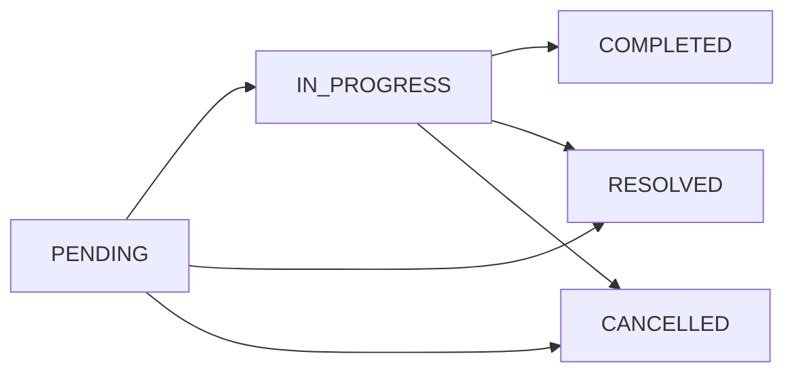

## Overview

The Escalation Module automates responses when assigned leads go stale. A scheduled engine detects trigger conditions (no first contact, went cold) and executes tiered escalation actions — notifications, temperature changes, tag additions, and redistribution to new agents.

<Note>
**Status:** Active — fully implemented  
**Module Path:** `src/modules/crm/escalation/`
</Note>

### Design Principles

<CardGroup cols={2}>
  <Card title="Scheduling" icon="clock">
    pg-boss recurring job ensures reliable escalation execution
  </Card>
  <Card title="Tiered Actions" icon="layer-group">
    Rules have ordered tiers with configurable delays executing in sequence
  </Card>
  <Card title="Auto-Resolution" icon="check-circle">
    Domain events automatically resolve active trackers when conditions change
  </Card>
  <Card title="Idempotency" icon="shield">
    Partial unique index + `ON CONFLICT DO NOTHING` prevents duplicate trackers
  </Card>
</CardGroup>

| Principle | Decision |
|-----------|----------|
| **pg-boss scheduling** | Escalation scheduler uses pg-boss recurring job for reliability |
| **Tiered actions** | Rules have ordered tiers with configurable delays; actions execute in sequence |
| **Auto-resolution** | Events (activity, stage change, reassignment) automatically resolve active trackers |
| **Idempotency** | Partial unique index + `ON CONFLICT DO NOTHING` prevents duplicate trackers |
| **Distribution delegation** | Reassignment uses the distribution engine (`REDISTRIBUTE` action), not a separate paradigm |
| **RLS compliance** | All entities carry `organization_id` for row-level security |

---

## Architecture

### High-Level Diagram

```
┌────────────────────────────────────────────────────────────────┐
│                  API Layer (Controllers)                        │
│  EscalationRuleCtrl  │  EscalationAnalyticsCtrl                │
└──────────────────────────────┬─────────────────────────────────┘
                               │
┌──────────────────────────────▼─────────────────────────────────┐
│  Escalation Engine                                              │
│  ┌─────────────────────┐  ┌─────────────────────────────────┐  │
│  │ TriggerDetector     │  │ TierExecutor                    │  │
│  │ EscalationScheduler │  │ EscalationAutoResolver          │  │
│  │  (pg-boss recurring)│  │  (event listener)               │  │
│  └─────────────────────┘  └─────────────────────────────────┘  │
└──────────────────────────────┬─────────────────────────────────┘
                               │
┌──────────────────────────────▼─────────────────────────────────┐
│                    Shared Services                               │
│  DistributionEngineService │ NotificationService │ EventEmitter2 │
│  UserStatusService │ TenantContext │ pg-boss                     │
└──────────────────────────────┬─────────────────────────────────┘
                               │
┌──────────────────────────────▼─────────────────────────────────┐
│                    Data Layer (MikroORM + PostgreSQL)            │
│  escalation_rule │ escalation_tier │ escalation_tracker          │
│  escalation_action_log                                           │
└────────────────────────────────────────────────────────────────┘
```

### Component Responsibilities

| Component | Responsibility |
|-----------|----------------|
| **EscalationScheduler** | pg-boss recurring job that runs every 60 seconds to detect new triggers and process due escalations |
| **TriggerDetector** | Scans leads for unmet conditions (no first contact, went cold); creates tracker records |
| **TierExecutor** | Executes escalation tier actions (notify, redistribute, change temp, add tag) |
| **EscalationAutoResolver** | Listens to domain events and resolves active trackers when conditions change |
| **EscalationRuleService** | CRUD for escalation rules; handles tracker cancellation on deactivation/deletion |

---

## Entity Specifications

### EscalationRule

Defines when and how a lead should be escalated. Evaluated by `TriggerDetector`.

<Tabs>
  <Tab title="Schema">
    | Column | Type | Notes |
    |--------|------|-------|
    | `id` | uuid PK | Primary key |
    | `organization_id` | uuid FK | RLS enforcement |
    | `name` | varchar | Human-readable rule name |
    | `is_active` | bool | default true |
    | `priority` | int | Evaluation order (lower = higher priority) |
    | `trigger_type` | enum | `NO_FIRST_CONTACT`, `WENT_COLD` |
    | `trigger_config` | jsonb | `{thresholdMinutes?, thresholdValue?, thresholdUnit?}` |
    | `condition_groups` | jsonb | `[{conditions:[{field,operator,value}]}]` — AND-within-OR groups; `[]` = all leads |
    | `respect_business_hours` | bool | default true. References org business hours schedule |
    | `created_by` | uuid FK | User who created the rule |
    | `created_at`, `updated_at` | timestamp | Audit timestamps |
    | `is_deleted` | bool | Soft delete flag |
  </Tab>
  <Tab title="Priority Rules">
    <Warning>
    Rules are evaluated in ascending `priority` order (lower number = higher priority). Active rules must use unique priorities within the organization.
    </Warning>

    - **Frontend behavior**: Defaults `priority` to one greater than the highest active escalation rule priority; edit mode preserves existing priority
    - **Validation**: Frontend disables submission when an active rule would reuse another active rule's priority
    - **Backend enforcement**: Rejects create/priority update/reactivation with `400 Bad Request` if another active, non-deleted rule already uses the requested priority
    - **Inactive rules**: May keep duplicate priorities until activation
  </Tab>
  <Tab title="Duplicate Prevention">
    <Info>
    Rule `name` is a display label only — duplicate names are allowed. The backend rejects create/update when another **non-deleted** rule has an identical **behavior fingerprint**.
    </Info>

    **Fingerprint components:**
    - `triggerType`
    - Normalized `triggerConfig`
    - Canonical `conditionGroups`
    - Canonical tiers/actions (`tierOrder`, `delayMinutes`, action type + params)

    Comparison ignores group/condition ordering within JSONB and treats legacy `thresholdMinutes` as equivalent to `thresholdValue` + `thresholdUnit: MINUTES`.

    **On conflict:** API returns `400 Bad Request` with message:
    ```
    An escalation rule with identical trigger, conditions, and actions already exists.
    ```

    **Implementation:** Fingerprint helpers in `src/modules/crm/escalation/escalation-rule-fingerprint.util.ts`
  </Tab>
</Tabs>

#### Applicability Conditions

<Note>
Escalation reuses the shared rule-condition module (`src/modules/crm/shared/rule-conditions/`). Stored shape matches distribution rules.
</Note>

```typescript
interface ConditionGroup {
  conditions: RuleCondition[]; // AND within group
}
// A lead matches when ANY group fully passes. 
// Empty conditionGroups[] = all leads.
```

**API shape:**
- `CreateEscalationRuleDto` / `UpdateEscalationRuleDto` accept optional `conditionGroups?: ConditionGroupDto[]`
- `EscalationRuleDto` returns `conditionGroups: ConditionGroup[]`
- Omitted or empty `conditionGroups` means the rule applies to all leads

**Migration:** `Migration20260607120000_EscalationConditionsToGroups` replaced the flat `conditions` JSONB column with `condition_groups`.

#### SQL Field Mapping

<AccordionGroup>
  <Accordion title="Supported Fields">
    | Field | SQL Column / Expression | Table / Join | Operators | Notes |
    |-------|------------------------|--------------|-----------|-------|
    | `temperature` | `l.temperature` | lead | eq, in | Case-insensitive |
    | `leadSource` | `l.lead_source` | lead | eq, in | Case-insensitive |
    | `intent` | `l.intent` | lead | eq | Case-insensitive |
    | `budget` | `l.budget` | lead | eq, gte, lte, between | Numeric; `between` accepts `{ min, max }` or `[min, max]` |
    | `tags` | `l.tag_ids` | lead | contains | `EXISTS` + `jsonb_array_elements_text` + `IN (?)` per label |
    | `sourceChannel` | `pc.channel_type` | person_channel | eq, in | `LEFT JOIN person_channel` |
    | `language` | `p.languages` | person | eq | `LEFT JOIN person`; matches JSONB `languages[].code` |
    | `area` | wished snapshot names | lead_property_interest | eq, in, contains | `EXISTS` subquery flattening area snapshots; case-insensitive |
  </Accordion>
  <Accordion title="Evaluation Logic">
    `TriggerDetector` passes `rule.conditionGroups ?? []` to `LeadScanService`. 

    `buildApplicabilityExtraWhere` evaluates AND-within-OR semantics in SQL:
    - Each group's conditions are AND'd
    - Groups are OR'd
    - Empty `conditionGroups[]` applies no extra filter (all leads)

    <Warning>
    Unknown `field` keys (corrupt/legacy JSONB only — HTTP DTO validation rejects them on write) are skipped with a warning. Groups whose conditions are all empty or skipped produce `AND FALSE` (no leads match).
    </Warning>
  </Accordion>
</AccordionGroup>

---

### EscalationTier

Each tier in an escalation rule represents a delayed action set. Tiers execute in `tier_order` sequence.

| Column | Type | Notes |
|--------|------|-------|
| `id` | uuid PK | Primary key |
| `escalation_rule_id` | uuid FK | Parent rule |
| `tier_order` | int | Execution sequence (0-indexed) |
| `delay_minutes` | int | Delay after trigger or previous tier |
| `created_at`, `updated_at` | timestamp | Audit timestamps |

**Relationships:**
- One rule → many tiers (cascade delete)
- Tiers are ordered by `tier_order` ascending

<Tip>
The first tier (`tier_order = 0`) executes `delay_minutes` after the trigger condition is met. Subsequent tiers execute relative to the previous tier's completion.
</Tip>

---

### EscalationAction

Actions attached to a tier define what happens when that tier executes.

| Column | Type | Notes |
|--------|------|-------|
| `id` | uuid PK | Primary key |
| `escalation_tier_id` | uuid FK | Parent tier |
| `action_type` | enum | `NOTIFY`, `REDISTRIBUTE`, `CHANGE_TEMPERATURE`, `ADD_TAG` |
| `action_params` | jsonb | Type-specific parameters |
| `created_at`, `updated_at` | timestamp | Audit timestamps |

#### Action Types and Parameters

<Tabs>
  <Tab title="NOTIFY">
    **Purpose:** Send notification to user(s)

    **Parameters:**
    ```json
    {
      "recipientUserIds": ["uuid1", "uuid2"],
      "recipientRoleIds": ["uuid3"],
      "message": "Lead {leadName} requires attention"
    }
    ```

    - `recipientUserIds`: Array of user UUIDs to notify
    - `recipientRoleIds`: Array of role UUIDs (all users with role are notified)
    - `message`: Notification text with interpolation support
  </Tab>
  <Tab title="REDISTRIBUTE">
    **Purpose:** Reassign lead using distribution engine

    **Parameters:**
    ```json
    {
      "distributionRuleId": "uuid"
    }
    ```

    - `distributionRuleId`: UUID of distribution rule to apply
    - Delegates to `DistributionEngineService.redistributeLead()`
  </Tab>
  <Tab title="CHANGE_TEMPERATURE">
    **Purpose:** Update lead temperature

    **Parameters:**
    ```json
    {
      "newTemperature": "COLD"
    }
    ```

    - `newTemperature`: One of `HOT`, `WARM`, `COLD`
  </Tab>
  <Tab title="ADD_TAG">
    **Purpose:** Add tag(s) to lead

    **Parameters:**
    ```json
    {
      "tagIds": ["uuid1", "uuid2"]
    }
    ```

    - `tagIds`: Array of tag UUIDs to apply
  </Tab>
</Tabs>

---

### EscalationTracker

Tracks the escalation lifecycle for a specific lead-rule pairing.

| Column | Type | Notes |
|--------|------|-------|
| `id` | uuid PK | Primary key |
| `organization_id` | uuid FK | RLS enforcement |
| `lead_id` | uuid FK | Subject lead |
| `escalation_rule_id` | uuid FK | Applied rule |
| `trigger_type` | enum | `NO_FIRST_CONTACT`, `WENT_COLD` |
| `status` | enum | `PENDING`, `IN_PROGRESS`, `COMPLETED`, `RESOLVED`, `CANCELLED` |
| `triggered_at` | timestamp | When condition was first met |
| `current_tier_index` | int | Next tier to execute (0-indexed) |
| `next_execution_at` | timestamp | When next tier should run |
| `resolved_at` | timestamp | When tracker was resolved |
| `resolution_reason` | enum | `LEAD_ACTIVITY`, `STAGE_CHANGE`, `REASSIGNMENT`, `MANUAL`, `RULE_CHANGED` |
| `created_at`, `updated_at` | timestamp | Audit timestamps |

<Info>
**Idempotency:** Partial unique index on `(lead_id, escalation_rule_id, status)` where `status IN ('PENDING', 'IN_PROGRESS')` ensures only one active tracker per lead-rule pair.
</Info>

#### Status Lifecycle



<Steps>
  <Step title="PENDING">
    Tracker created by `TriggerDetector`. Waiting for first tier execution.
  </Step>
  <Step title="IN_PROGRESS">
    At least one tier has executed. More tiers remain.
  </Step>
  <Step title="COMPLETED">
    All tiers executed successfully. No more actions.
  </Step>
  <Step title="RESOLVED">
    Auto-resolved by `EscalationAutoResolver` due to lead activity or state change.
  </Step>
  <Step title="CANCELLED">
    Manually cancelled or rule deactivated/deleted.
  </Step>
</Steps>

---

### EscalationActionLog

Audit log for executed escalation actions.

| Column | Type | Notes |
|--------|------|-------|
| `id` | uuid PK | Primary key |
| `organization_id` | uuid FK | RLS enforcement |
| `escalation_tracker_id` | uuid FK | Parent tracker |
| `escalation_tier_id` | uuid FK | Tier that executed |
| `action_type` | enum | Type of action executed |
| `action_params` | jsonb | Parameters used |
| `status` | enum | `SUCCESS`, `FAILED`, `SKIPPED` |
| `error_message` | text | Failure details (if `status = FAILED`) |
| `executed_at` | timestamp | Execution timestamp |
| `created_at` | timestamp | Audit timestamp |

<Tip>
Action logs enable detailed escalation auditing and debugging. Failed actions include `error_message` for troubleshooting.
</Tip>

---

## Type Definitions

### Enums

<CodeGroup>
```typescript TypeScript
export enum EscalationTriggerType {
  NO_FIRST_CONTACT = 'NO_FIRST_CONTACT',
  WENT_COLD = 'WENT_COLD',
}

export enum EscalationActionType {
  NOTIFY = 'NOTIFY',
  REDISTRIBUTE = 'REDISTRIBUTE',
  CHANGE_TEMPERATURE = 'CHANGE_TEMPERATURE',
  ADD_TAG = 'ADD_TAG',
}

export enum EscalationTrackerStatus {
  PENDING = 'PENDING',
  IN_PROGRESS = 'IN_PROGRESS',
  COMPLETED = 'COMPLETED',
  RESOLVED = 'RESOLVED',
  CANCELLED = 'CANCELLED',
}

export enum EscalationResolutionReason {
  LEAD_ACTIVITY = 'LEAD_ACTIVITY',
  STAGE_CHANGE = 'STAGE_CHANGE',
  REASSIGNMENT = 'REASSIGNMENT',
  MANUAL = 'MANUAL',
  RULE_CHANGED = 'RULE_CHANGED',
}

export enum EscalationActionStatus {
  SUCCESS = 'SUCCESS',
  FAILED = 'FAILED',
  SKIPPED = 'SKIPPED',
}

export enum TimeUnit {
  MINUTES = 'MINUTES',
  HOURS = 'HOURS',
  DAYS = 'DAYS',
}
```

```sql SQL
CREATE TYPE escalation_trigger_type AS ENUM (
  'NO_FIRST_CONTACT',
  'WENT_COLD'
);

CREATE TYPE escalation_action_type AS ENUM (
  'NOTIFY',
  'REDISTRIBUTE',
  'CHANGE_TEMPERATURE',
  'ADD_TAG'
);

CREATE TYPE escalation_tracker_status AS ENUM (
  'PENDING',
  'IN_PROGRESS',
  'COMPLETED',
  'RESOLVED',
  'CANCELLED'
);

CREATE TYPE escalation_resolution_reason AS ENUM (
  'LEAD_ACTIVITY',
  'STAGE_CHANGE',
  'REASSIGNMENT',
  'MANUAL',
  'RULE_CHANGED'
);

CREATE TYPE escalation_action_status AS ENUM (
  'SUCCESS',
  'FAILED',
  'SKIPPED'
);

CREATE TYPE time_unit AS ENUM (
  'MINUTES',
  'HOURS',
  'DAYS'
);
```
</CodeGroup>

### Trigger Configuration

<Tabs>
  <Tab title="NO_FIRST_CONTACT">
    Triggers when an assigned lead has no outbound activity within threshold.

    ```typescript
    interface NoFirstContactConfig {
      thresholdValue: number;
      thresholdUnit: TimeUnit;
      // Legacy: thresholdMinutes?: number (deprecated but still supported)
    }
    ```

    **Example:**
    ```json
    {
      "thresholdValue": 24,
      "thresholdUnit": "HOURS"
    }
    ```
  </Tab>
  <Tab title="WENT_COLD">
    Triggers when last activity was more than threshold ago.

    ```typescript
    interface WentColdConfig {
      thresholdValue: number;
      thresholdUnit: TimeUnit;
      // Legacy: thresholdMinutes?: number (deprecated but still supported)
    }
    ```

    **Example:**
    ```json
    {
      "thresholdValue": 7,
      "thresholdUnit": "DAYS"
    }
    ```
  </Tab>
</Tabs>

---

## Escalation Engine

### EscalationScheduler

<Info>
**Implementation:** `src/modules/crm/escalation/escalation-scheduler.service.ts`
</Info>

Registers a pg-boss recurring job that executes every 60 seconds.

<Steps>
  <Step title="Job Registration">
    ```typescript
    await this.jobQueue.schedule(
      'escalation-check',
      '0 * * * * *', // Every minute
      {},
      { tz: 'UTC' }
    );
    ```
  </Step>
  <Step title="Handler Invocation">
    Handler calls `TriggerDetector.detectAndCreateTrackers()` and `TierExecutor.processDueEscalations()`
  </Step>
  <Step title="Organization Isolation">
    Each run processes all organizations with active escalation rules
  </Step>
</Steps>

**Configuration:**
- **Frequency:** 60 seconds
- **Concurrency:** Single worker (prevents duplicate processing)
- **Retry:** pg-boss default (exponential backoff)

---

### TriggerDetector

<Info>
**Implementation:** `src/modules/crm/escalation/trigger-detector.service.ts`
</Info>

Scans leads for trigger conditions and creates tracker records.

#### Detection Algorithm

<Steps>
  <Step title="Load Active Rules">
    Query all active, non-deleted escalation rules ordered by priority (ascending)
  </Step>
  <Step title="For Each Rule">
    Call `LeadScanService` to find matching leads:
    ```typescript
    const leads = await this.leadScanService.scanLeadsForTrigger(
      organizationId,
      rule.triggerType,
      rule.triggerConfig,
      rule.conditionGroups,
      rule.respectBusinessHours
    );
    ```
  </Step>
  <Step title="Create Trackers">
    For each matched lead, attempt tracker creation:
    ```typescript
    await this.em.nativeInsert(EscalationTracker, {
      // ... fields
    }, { onConflict: 'DO NOTHING' });
    ```
    
    <Check>Idempotent due to partial unique index</Check>
  </Step>
  <Step title="Calculate next_execution_at">
    Set `next_execution_at = triggered_at + tier[0].delay_minutes`
  </Step>
</Steps>

#### Trigger Logic

<Tabs>
  <Tab title="NO_FIRST_CONTACT">
    **SQL conditions:**
    - Lead has `assigned_to` (not null)
    - Lead `assigned_at` ≥ `NOW() - threshold`
    - No outbound activities (`direction = 'OUTBOUND'`) by assigned user since `assigned_at`
    - Lead not in terminal stage (`is_terminal = false`)
    - No active tracker exists for this lead-rule pair

    **Business hours:** If `respect_business_hours = true`, threshold is adjusted to exclude non-business time
  </Tab>
  <Tab title="WENT_COLD">
    **SQL conditions:**
    - Lead has activities
    - Latest activity (`MAX(created_at)`) < `NOW() - threshold`
    - Lead not in terminal stage
    - No active tracker exists for this lead-rule pair

    **Business hours:** Same adjustment as NO_FIRST_CONTACT
  </Tab>
</Tabs>

<Warning>
Leads with existing `PENDING` or `IN_PROGRESS` trackers for the same rule are excluded via `NOT EXISTS` clause to prevent duplicate escalations.
</Warning>

---

### TierExecutor

<Info>
**Implementation:** `src/modules/crm/escalation/tier-executor.service.ts`
</Info>

Processes trackers whose `next_execution_at` has passed.

<Steps>
  <Step title="Load Due Trackers">
    ```sql
    SELECT * FROM escalation_tracker
    WHERE status IN ('PENDING', 'IN_PROGRESS')
      AND next_execution_at <= NOW()
    ORDER BY next_execution_at ASC
    FOR UPDATE SKIP LOCKED
    ```
    
    <Tip>`FOR UPDATE SKIP LOCKED` prevents concurrent execution</Tip>
  </Step>
  <Step title="For Each Tracker">
    1. Load tier at `current_tier_index`
    2. Load tier actions
    3. Execute each action in sequence
    4. Log action results to `escalation_action_log`
  </Step>
  <Step title="Update Tracker State">
    - If more tiers remain:
      - Set `status = IN_PROGRESS`
      - Increment `current_tier_index`
      - Set `next_execution_at = NOW() + next_tier.delay_minutes`
    - If last tier:
      - Set `status = COMPLETED`
      - Set `next_execution_at = null`
  </Step>
</Steps>

#### Action Execution

<AccordionGroup>
  <Accordion title="NOTIFY">
    ```typescript
    await this.notificationService.createNotification({
      organizationId,
      recipientUserIds,
      type: 'ESCALATION',
      title: 'Lead Escalation',
      message: interpolate(action.actionParams.message, lead),
      metadata: { leadId, trackerId },
    });
    ```
  </Accordion>
  <Accordion title="REDISTRIBUTE">
    ```typescript
    const distributionRuleId = action.actionParams.distributionRuleId;
    await this.distributionEngine.redistributeLead(
      leadId,
      distributionRuleId,
      { reason: 'ESCALATION', trackerId }
    );
    ```
    
    <Warning>
    If distribution rule is inactive or deleted, action fails with `FAILED` status and error message.
    </Warning>
  </Accordion>
  <Accordion title="CHANGE_TEMPERATURE">
    ```typescript
    await this.leadService.updateLeadTemperature(
      leadId,
      action.actionParams.newTemperature,
      { reason: 'ESCALATION', trackerId }
    );
    ```
  </Accordion>
  <Accordion title="ADD_TAG">
    ```typescript
    await this.leadService.addLeadTags(
      leadId,
      action.actionParams.tagIds,
      { reason: 'ESCALATION', trackerId }
    );
    ```
  </Accordion>
</AccordionGroup>

<Note>
All actions are executed within a transaction. If any action fails, the entire tier is rolled back and tracker remains at current tier for retry on next run.
</Note>

---

### EscalationAutoResolver

<Info>
**Implementation:** `src/modules/crm/escalation/escalation-auto-resolver.service.ts`
</Info>

Listens to domain events and resolves active trackers when conditions change.

#### Event Handlers

<CardGroup cols={2}>
  <Card title="lead.activity.created" icon="bolt">
    Resolves trackers with `LEAD_ACTIVITY` reason
  </Card>
  <Card title="lead.stage.changed" icon="arrow-right">
    Resolves trackers with `STAGE_CHANGE` reason
  </Card>
  <Card title="lead.assigned" icon="user-tag">
    Resolves trackers with `REASSIGNMENT` reason
  </Card>
  <Card title="lead.unassigned" icon="user-slash">
    Resolves trackers with `REASSIGNMENT` reason
  </Card>
</CardGroup>

**Resolution logic:**

```typescript
@OnEvent('lead.activity.created')
async handleLeadActivity(payload: { leadId: string; organizationId: string }) {
  await this.resolveActiveTrackers(
    payload.organizationId,
    payload.leadId,
    EscalationResolutionReason.LEAD_ACTIVITY
  );
}

private async resolveActiveTrackers(
  organizationId: string,
  leadId: string,
  reason: EscalationResolutionReason
) {
  await this.em.nativeUpdate(
    EscalationTracker,
    {
      organization_id: organizationId,
      lead_id: leadId,
      status: { $in: ['PENDING', 'IN_PROGRESS'] },
    },
    {
      status: EscalationTrackerStatus.RESOLVED,
      resolved_at: new Date(),
      resolution_reason: reason,
    }
  );
}
```

<Warning>
Resolution does NOT cancel in-flight tier executions. If a tier is currently executing when resolution occurs, it completes normally, but subsequent tiers are skipped.
</Warning>

---

### Business Hours Handling

<Info>
When `respect_business_hours = true`, threshold calculations exclude non-business time using the organization's business hours schedule.
</Info>

<Steps>
  <Step title="Load Schedule">
    Query `organization_settings.business_hours_schedule` (JSONB)
    ```json
    {
      "timezone": "Asia/Dubai",
      "schedule": {
        "monday": { "enabled": true, "start": "09:00", "end": "17:00" },
        "tuesday": { "enabled": true, "start": "09:00", "end": "17:00" },
        // ...
      }
    }
    ```
  </Step>
  <Step title="Calculate Business Time">
    Use `BusinessHoursCalculator.calculateBusinessMinutes()` to determine elapsed business time between two timestamps
  </Step>
  <Step title="Apply to Thresholds">
    - `NO_FIRST_CONTACT`: Check if business time since `assigned_at` exceeds threshold
    - `WENT_COLD`: Check if business time since last activity exceeds threshold
  </Step>
</Steps>

<Tip>
If `business_hours_schedule` is missing or invalid, the system falls back to 24/7 time calculation (all time is business time).
</Tip>

---

## API Endpoints

### Rule Management

<Tabs>
  <Tab title="List Rules">
    **GET** `/api/crm/escalation/rules`

    **Query Parameters:**
    - `organizationId` (required): UUID
    - `isActive` (optional): boolean filter
    - `page`, `limit`: Pagination

    **Response:**
    ```json
    {
      "data": [
        {
          "id": "uuid",
          "name": "No contact in 24h",
          "isActive": true,
          "priority": 1,
          "triggerType": "NO_FIRST_CONTACT",
          "triggerConfig": { "thresholdValue": 24, "thresholdUnit": "HOURS" },
          "conditionGroups": [],
          "respectBusinessHours": true,
          "tiers": [/* ... */],
          "createdAt": "2024-01-01T00:00:00Z"
        }
      ],
      "total": 10,
      "page": 1,
      "limit": 20
    }
    ```
  </Tab>
  <Tab title="Create Rule">
    **POST** `/api/crm/escalation/rules`

    **Body:**
    ```json
    {
      "name": "24h No Contact Escalation",
      "priority": 1,
      "triggerType": "NO_FIRST_CONTACT",
      "triggerConfig": {
        "thresholdValue": 24,
        "thresholdUnit": "HOURS"
      },
      "conditionGroups": [
        {
          "conditions": [
            { "field": "temperature", "operator": "eq", "value": "HOT" }
          ]
        }
      ],
      "respectBusinessHours": true,
      "tiers": [
        {
          "tierOrder": 0,
          "delayMinutes": 0,
          "actions": [
            {
              "actionType": "NOTIFY",
              "actionParams": {
                "recipientRoleIds": ["sales_manager_role_id"],
                "message": "Lead {leadName} has no first contact"
              }
            }
          ]
        }
      ]
    }
    ```

    **Response:** `201 Created` with rule object

    <Warning>
    Returns `400 Bad Request` if:
    - Another active rule uses the same priority
    - An identical rule fingerprint already exists
    - Invalid condition groups or trigger config
    </Warning>
  </Tab>
  <Tab title="Update Rule">
    **PATCH** `/api/crm/escalation/rules/:id`

    **Body:** Partial `CreateEscalationRuleDto`

    **Response:** `200 OK` with updated rule

    <Info>
    Updating a rule with active trackers:
    - Existing `PENDING` trackers are cancelled (`CANCELLED` status, reason `RULE_CHANGED`)
    - `IN_PROGRESS` trackers complete current tier, then are cancelled before next tier
    </Info>
  </Tab>
  <Tab title="Delete Rule">
    **DELETE** `/api/crm/escalation/rules/:id`

    **Response:** `204 No Content`

    <Note>
    Soft delete: Sets `is_deleted = true`. All active trackers are cancelled.
    </Note>
  </Tab>
</Tabs>

---

### Tracker Management

<Tabs>
  <Tab title="List Trackers">
    **GET** `/api/crm/escalation/trackers`

    **Query Parameters:**
    - `organizationId` (required)
    - `leadId` (optional): Filter by lead
    - `ruleId` (optional): Filter by rule
    - `status` (optional): Comma-separated statuses
    - `page`, `limit`: Pagination

    **Response:**
    ```json
    {
      "data": [
        {
          "id": "uuid",
          "leadId": "uuid",
          "escalationRuleId": "uuid",
          "triggerType": "NO_FIRST_CONTACT",
          "status": "IN_PROGRESS",
          "triggeredAt": "2024-01-01T10:00:00Z",
          "currentTierIndex": 1,
          "nextExecutionAt": "2024-01-01T12:00:00Z",
          "lead": { /* embedded lead data */ },
          "rule": { /* embedded rule data */ }
        }
      ],
      "total": 5,
      "page": 1,
      "limit": 20
    }
    ```
  </Tab>
  <Tab title="Get Tracker">
    **GET** `/api/crm/escalation/trackers/:id`

    **Response:** Full tracker object with embedded lead, rule, and action logs
  </Tab>
  <Tab title="Cancel Tracker">
    **POST** `/api/crm/escalation/trackers/:id/cancel`

    **Response:** `200 OK`

    Sets `status = CANCELLED`, `resolution_reason = MANUAL`, `resolved_at = NOW()`

    <Warning>
    Cannot cancel trackers in `COMPLETED` or `RESOLVED` status
    </Warning>
  </Tab>
</Tabs>

---

### Analytics

<Info>
**Prefix:** `/api/crm/escalation/analytics`
</Info>

<AccordionGroup>
  <Accordion title="Rule Performance">
    **GET** `/analytics/rules/:ruleId/performance`

    **Query:** `startDate`, `endDate`

    **Response:**
    ```json
    {
      "ruleId": "uuid",
      "period": { "start": "2024-01-01", "end": "2024-01-31" },
      "totalTriggered": 150,
      "completed": 120,
      "resolved": 25,
      "cancelled": 5,
      "avgTimeToResolution": 120, // minutes
      "actionBreakdown": {
        "NOTIFY": { "success": 145, "failed": 5 },
        "REDISTRIBUTE": { "success": 80, "failed": 0 }
      }
    }
    ```
  </Accordion>
  <Accordion title="Organization Summary">
    **GET** `/analytics/summary`

    **Query:** `organizationId`, `startDate`, `endDate`

    **Response:**
    ```json
    {
      "totalRules": 10,
      "activeRules": 8,
      "totalEscalations": 500,
      "byStatus": {
        "PENDING": 20,
        "IN_PROGRESS": 50,
        "COMPLETED": 380,
        "RESOLVED": 40,
        "CANCELLED": 10
      },
      "topRules": [
        { "ruleId": "uuid", "name": "24h No Contact", "triggerCount": 200 }
      ]
    }
    ```
  </Accordion>
  <Accordion title="Lead Escalation History">
    **GET** `/analytics/leads/:leadId/history`

    **Response:**
    ```json
    {
      "leadId": "uuid",
      "escalations": [
        {
          "trackerId": "uuid",
          "ruleName": "24h No Contact",
          "triggeredAt": "2024-01-01T10:00:00Z",
          "status": "COMPLETED",
          "tiersExecuted": 2,
          "actions": [
            { "type": "NOTIFY", "executedAt": "2024-01-01T10:00:00Z", "status": "SUCCESS" },
            { "type": "REDISTRIBUTE", "executedAt": "2024-01-01T12:00:00Z", "status": "SUCCESS" }
          ]
        }
      ]
    }
    ```
  </Accordion>
</AccordionGroup>

---

## Security & Permissions

### RLS Policies

All escalation tables enforce row-level security keyed on `organization_id`.

<CodeGroup>
```sql escalation_rule
CREATE POLICY escalation_rule_tenant_isolation ON escalation_rule
  USING (organization_id = current_setting('app.current_organization_id')::uuid);
```

```sql escalation_tier
CREATE POLICY escalation_tier_tenant_isolation ON escalation_tier
  USING (
    EXISTS (
      SELECT 1 FROM escalation_rule r
      WHERE r.id = escalation_tier.escalation_rule_id
        AND r.organization_id = current_setting('app.current_organization_id')::uuid
    )
  );
```

```sql escalation_tracker
CREATE POLICY escalation_tracker_tenant_isolation ON escalation_tracker
  USING (organization_id = current_setting('app.current_organization_id')::uuid);
```

```sql escalation_action_log
CREATE POLICY escalation_action_log_tenant_isolation ON escalation_action_log
  USING (organization_id = current_setting('app.current_organization_id')::uuid);
```
</CodeGroup>

<Warning>
All API requests MUST include `organizationId` in the request context. Requests without valid tenant context are rejected with `403 Forbidden`.
</Warning>

---

### Permission Requirements

| Operation | Required Permission | Notes |
|-----------|---------------------|-------|
| List rules | `escalation.rule.view` | Can view all rules in organization |
| Create rule | `escalation.rule.create` | |
| Update rule | `escalation.rule.update` | |
| Delete rule | `escalation.rule.delete` | Soft delete only |
| View trackers | `escalation.tracker.view` | Can view all trackers in organization |
| Cancel tracker | `escalation.tracker.cancel` | Manual cancellation |
| View analytics | `escalation.analytics.view` | Organization-wide metrics |

<Info>
Permissions are enforced via `@RequirePermissions()` decorator on controller endpoints. Permission checks occur after tenant context validation.
</Info>

---

## Analytics & Metrics

### Real-Time Metrics

Tracked in-memory (Redis) for dashboard display:

- **Active escalations:** Count of `PENDING` + `IN_PROGRESS` trackers
- **Escalations today:** Trackers triggered since midnight (org timezone)
- **Actions executed today:** Count from `escalation_action_log` where `executed_at >= today`
- **Success rate:** `(SUCCESS actions) / (total actions) * 100`

### Historical Metrics

Aggregated from database tables:

<Tabs>
  <Tab title="Rule Effectiveness">
    - **Trigger rate:** Trackers created per rule over time
    - **Completion rate:** `COMPLETED / (COMPLETED + RESOLVED + CANCELLED)`
    - **Avg time to completion:** `AVG(completed_at - triggered_at)` where `status = COMPLETED`
    - **Resolution rate:** Percentage resolved before completion
  </Tab>
  <Tab title="Action Performance">
    - **Action success rate:** Per action type, percentage `SUCCESS` vs `FAILED`
    - **Most common failures:** Top error messages from failed actions
    - **Redistribution outcomes:** For `REDISTRIBUTE` actions, track subsequent lead activity
  </Tab>
  <Tab title="Lead Impact">
    - **Escalated leads:** Distinct lead count with trackers in period
    - **Multi-escalation leads:** Leads with >1 tracker
    - **Post-escalation activity:** Activity count in 24h after escalation vs before
  </Tab>
</Tabs>

### Reporting Queries

<AccordionGroup>
  <Accordion title="Daily Escalation Summary">
    ```sql
    SELECT 
      DATE(triggered_at) as date,
      COUNT(*) as total_escalations,
      COUNT(*) FILTER (WHERE status = 'COMPLETED') as completed,
      COUNT(*) FILTER (WHERE status = 'RESOLVED') as resolved,
      AVG(EXTRACT(EPOCH FROM (resolved_at - triggered_at))/60) as avg_resolution_minutes
    FROM escalation_tracker
    WHERE organization_id = $1
      AND triggered_at >= $2 AND triggered_at < $3
    GROUP BY DATE(triggered_at)
    ORDER BY date DESC;
    ```
  </Accordion>
  <Accordion title="Rule Comparison">
    ```sql
    SELECT 
      r.name as rule_name,
      COUNT(t.id) as trigger_count,
      AVG(t.current_tier_index + 1) as avg_tiers_executed,
      COUNT(*) FILTER (WHERE t.status = 'COMPLETED') as completed_count
    FROM escalation_rule r
    LEFT JOIN escalation_tracker t ON t.escalation_rule_id = r.id
      AND t.triggered_at >= $2 AND t.triggered_at < $3
    WHERE r.organization_id = $1 AND r.is_deleted = false
    GROUP BY r.id, r.name
    ORDER BY trigger_count DESC;
    ```
  </Accordion>
</AccordionGroup>

---

## Edge Case Handling

### Concurrent Modifications

<Warning>
**Scenario:** Rule updated while trackers are active
</Warning>

**Handling:**
1. Rule update cancels all `PENDING` trackers with `RULE_CHANGED` reason
2. `IN_PROGRESS` trackers complete current tier, then check rule version
3. If rule changed, tracker is cancelled before next tier execution
4. New triggers use updated rule configuration immediately

---

### Missing Dependencies

<Tabs>
  <Tab title="Distribution Rule Deleted">
    **Scenario:** `REDISTRIBUTE` action references deleted distribution rule

    **Handling:**
    - Action fails with `FAILED` status
    - Error message: `Distribution rule {id} not found or inactive`
    - Tracker remains at current tier (retries on next run)
    - Alert sent to rule creator
  </Tab>
  <Tab title="User Deleted">
    **Scenario:** `NOTIFY` action targets deleted user

    **Handling:**
    - Notification skipped for deleted users
    - Action succeeds with partial delivery
    - Warning logged
  </Tab>
  <Tab title="Tag Deleted">
    **Scenario:** `ADD_TAG` action references deleted tag

    **Handling:**
    - Action fails with `FAILED` status
    - Error message: `Tag {id} not found`
    - Tracker remains at current tier
  </Tab>
</Tabs>

---

### Business Hours Edge Cases

<AccordionGroup>
  <Accordion title="Schedule Missing">
    **Handling:** Fall back to 24/7 time calculation. Log warning for admin.
  </Accordion>
  <Accordion title="Timezone Invalid">
    **Handling:** Default to organization's primary timezone. Log error.
  </Accordion>
  <Accordion title="Cross-Day Threshold">
    **Example:** Lead assigned Friday 5pm, threshold 8 business hours, closed weekends

    **Calculation:** 
    - Friday 5pm → 6pm = 1 hour
    - Weekend skipped
    - Monday 9am → 4pm = 7 hours
    - **Total:** 8 business hours elapsed Monday 4pm
  </Accordion>
  <Accordion title="All Days Disabled">
    **Handling:** Treat as 24/7 schedule. Log warning.
  </Accordion>
</AccordionGroup>

---

### Tracker Lifecycle Edge Cases

<Info>
**Scenario:** Lead reassigned mid-escalation
</Info>

**Handling:**
- Auto-resolver listens to `lead.assigned` event
- Active tracker resolved with `REASSIGNMENT` reason
- If new assignment meets trigger condition, new tracker created on next scan
- Old and new trackers are independent (different tracker IDs)

<Info>
**Scenario:** Rule deactivated with active trackers
</Info>

**Handling:**
- All trackers cancelled immediately (`CANCELLED` status, `RULE_CHANGED` reason)
- Scheduler skips deactivated rules on next run
- Reactivating rule does NOT resume old trackers; new triggers created on next scan

---

## Performance & Scaling

### Database Indexes

<CodeGroup>
```sql Tracker Query Optimization
CREATE INDEX idx_escalation_tracker_next_execution 
  ON escalation_tracker(organization_id, next_execution_at)
  WHERE status IN ('PENDING', 'IN_PROGRESS');

CREATE INDEX idx_escalation_tracker_lead_rule_status
  ON escalation_tracker(lead_id, escalation_rule_id, status)
  WHERE status IN ('PENDING', 'IN_PROGRESS');
```

```sql Action Log Query
CREATE INDEX idx_escalation_action_log_tracker
  ON escalation_action_log(escalation_tracker_id, executed_at DESC);

CREATE INDEX idx_escalation_action_log_org_date
  ON escalation_action_log(organization_id, DATE(executed_at));
```

```sql Rule Priority
CREATE UNIQUE INDEX idx_escalation_rule_active_priority
  ON escalation_rule(organization_id, priority)
  WHERE is_active = true AND is_deleted = false;
```
</CodeGroup>

---

### Query Optimization

<Tabs>
  <Tab title="Trigger Detection">
    **Challenge:** Full table scan for trigger conditions

    **Optimization:**
    - Pre-filter leads by `assigned_to IS NOT NULL` and `is_terminal = false`
    - Use CTE to exclude leads with existing trackers
    - Limit scans to last 30 days of assignments for `NO_FIRST_CONTACT`
    - Partition by organization for parallel processing

    **Query plan target:** <100ms per organization
  </Tab>
  <Tab title="Due Tracker Lookup">
    **Challenge:** Finding trackers ready for execution

    **Optimization:**
    - Composite index on `(organization_id, next_execution_at, status)`
    - `FOR UPDATE SKIP LOCKED` prevents lock contention
    - Process in batches of 100

    **Query plan target:** <50ms for typical workload
  </Tab>
  <Tab title="Analytics Aggregation">
    **Challenge:** Real-time dashboard queries

    **Optimization:**
    - Materialized view for daily summaries (refreshed hourly)
    - Redis cache for "active escalations" count (TTL 60s)
    - Pre-computed metrics stored in `escalation_metrics` table

    **Query plan target:** <200ms for complex dashboards
  </Tab>
</Tabs>

---

### Scaling Considerations

<CardGroup cols={2}>
  <Card title="Horizontal Scaling" icon="server">
    - pg-boss ensures single-worker job execution
    - API controllers are stateless (can scale horizontally)
    - Database connection pooling handles concurrent requests
  </Card>
  <Card title="Job Concurrency" icon="gauge">
    - Default: 1 worker per job type
    - High-volume orgs: Partition by organization_id buckets
    - pg-boss `teamSize` option for parallel sub-jobs
  </Card>
  <Card title="Database Load" icon="database">
    - Peak load during trigger detection (every 60s)
    - Read replicas for analytics queries
    - Separate connection pool for scheduled jobs
  </Card>
  <Card title="Action Rate Limiting" icon="clock">
    - Notification service has per-user rate limit (10/min)
    - Redistribution engine queues bulk reassignments
    - Failed actions exponentially backoff (1min → 5min → 15min)
  </Card>
</CardGroup>

---

## RLS Policies

### Policy Details

All escalation entities enforce tenant isolation via RLS policies that filter on `organization_id`.

<Tabs>
  <Tab title="Direct Policies">
    Tables with `organization_id` column use direct policy:

    ```sql
    CREATE POLICY {table}_tenant_isolation ON {table}
      USING (organization_id = current_setting('app.current_organization_id')::uuid);
    ```

    **Applied to:**
    - `escalation_rule`
    - `escalation_tracker`
    - `escalation_action_log`
  </Tab>
  <Tab title="Indirect Policies">
    Tables without `organization_id` use parent join:

    ```sql
    CREATE POLICY escalation_tier_tenant_isolation ON escalation_tier
      USING (
        EXISTS (
          SELECT 1 FROM escalation_rule r
          WHERE r.id = escalation_tier.escalation_rule_id
            AND r.organization_id = current_setting('app.current_organization_id')::uuid
        )
      );

    CREATE POLICY escalation_action_tenant_isolation ON escalation_action
      USING (
        EXISTS (
          SELECT 1 FROM escalation_tier t
          JOIN escalation_rule r ON r.id = t.escalation_rule_id
          WHERE t.id = escalation_action.escalation_tier_id
            AND r.organization_id = current_setting('app.current_organization_id')::uuid
        )
      );
    ```

    **Applied to:**
    - `escalation_tier` (via `escalation_rule`)
    - `escalation_action` (via `escalation_tier` → `escalation_rule`)
  </Tab>
</Tabs>

<Warning>
RLS policies are **ENFORCED** for all queries. Application code MUST set `app.current_organization_id` session variable before executing queries.
</Warning>

**Enforcement in code:**

```typescript
// TenantContext middleware sets session variable
await this.em.execute(
  `SET LOCAL app.current_organization_id = $1`,
  [organizationId]
);

// All subsequent queries in transaction respect RLS
const rules = await this.em.find(EscalationRule, { isActive: true });
// Implicitly filtered to current organization
```

---

## Module Structure

### Directory Layout

```
src/modules/crm/escalation/
├── escalation.module.ts              # Module definition
├── entities/
│   ├── escalation-rule.entity.ts
│   ├── escalation-tier.entity.ts
│   ├── escalation-action.entity.ts
│   ├── escalation-tracker.entity.ts
│   └── escalation-action-log.entity.ts
├── dtos/
│   ├── create-escalation-rule.dto.ts
│   ├── update-escalation-rule.dto.ts
│   ├── escalation-rule.dto.ts
│   ├── escalation-tier.dto.ts
│   ├── escalation-action.dto.ts
│   └── escalation-tracker.dto.ts
├── services/
│   ├── escalation-rule.service.ts
│   ├── escalation-scheduler.service.ts
│   ├── trigger-detector.service.ts
│   ├── tier-executor.service.ts
│   ├── escalation-auto-resolver.service.ts
│   └── escalation-analytics.service.ts
├── controllers/
│   ├── escalation-rule.controller.ts
│   └── escalation-analytics.controller.ts
├── util/
│   ├── escalation-rule-fingerprint.util.ts
│   └── business-hours-calculator.util.ts
└── tests/
    ├── escalation-rule.service.spec.ts
    ├── trigger-detector.spec.ts
    ├── tier-executor.spec.ts
    └── escalation-auto-resolver.spec.ts
```

---

## Integration Points

### Distribution Engine

<Info>
The `REDISTRIBUTE` action delegates to the distribution engine for lead reassignment.
</Info>

**Flow:**

<Steps>
  <Step title="Action Execution">
    `TierExecutor` calls `DistributionEngineService.redistributeLead()`
  </Step>
  <Step title="Distribution Rule Lookup">
    Distribution engine loads specified rule and evaluates lead eligibility
  </Step>
  <Step title="Agent Selection">
    Distribution logic selects new agent based on rule configuration (round-robin, load-balanced, etc.)
  </Step>
  <Step title="Lead Reassignment">
    Lead `assigned_to` updated; `lead.assigned` event emitted
  </Step>
  <Step title="Tracker Resolution">
    `EscalationAutoResolver` listens to `lead.assigned` and resolves active tracker
  </Step>
</Steps>

**Error handling:**
- If distribution rule is inactive/deleted: Action fails, tracker retries
- If no eligible agents: Action fails, error logged, alert sent to rule creator
- If redistribution succeeds: Action succeeds, logged with new agent ID

---

### Notification Service

<Info>
The `NOTIFY` action creates notifications for specified users/roles.
</Info>

**Integration:**

```typescript
await this.notificationService.createNotification({
  organizationId,
  recipientUserIds,
  recipientRoleIds,
  type: 'ESCALATION',
  category: 'LEAD_MANAGEMENT',
  title: 'Lead Escalation',
  message: interpolate(actionParams.message, lead),
  metadata: {
    leadId,
    trackerId,
    ruleId,
    tierIndex,
  },
  priority: 'HIGH',
  expiresAt: addHours(now, 24),
});
```

**Notification channels:**
- In-app notification (always)
- Email (if user preferences enable)
- Push notification (if mobile app installed)

**Rate limiting:**
- Per-user: Max 10 escalation notifications per minute
- Per-organization: Max 100 escalation notifications per minute
- Excess notifications queued with exponential backoff

---

### Event System

<Info>
Escalation module emits and listens to domain events via EventEmitter2.
</Info>

**Emitted events:**

| Event | Payload | Purpose |
|-------|---------|---------|
| `escalation.tracker.created` | `{ trackerId, leadId, ruleId }` | Analytics, webhooks |
| `escalation.tracker.resolved` | `{ trackerId, reason }` | Analytics, audit |
| `escalation.tier.executed` | `{ trackerId, tierIndex, actions }` | Real-time dashboards |
| `escalation.action.failed` | `{ trackerId, actionType, error }` | Alerting, debugging |

**Consumed events:**

| Event | Handler | Action |
|-------|---------|--------|
| `lead.activity.created` | `EscalationAutoResolver` | Resolve trackers with `LEAD_ACTIVITY` |
| `lead.stage.changed` | `EscalationAutoResolver` | Resolve trackers with `STAGE_CHANGE` |
| `lead.assigned` | `EscalationAutoResolver` | Resolve trackers with `REASSIGNMENT` |
| `lead.unassigned` | `EscalationAutoResolver` | Resolve trackers with `REASSIGNMENT` |

---

### User Status Service

<Info>
Used by `NOTIFY` action to check user availability before sending notifications.
</Info>

**Integration:**

```typescript
const recipientUsers = await this.userStatusService.getAvailableUsers(
  organizationId,
  recipientUserIds
);

// Filter out offline/unavailable users
const availableUserIds = recipientUsers
  .filter(u => u.status === 'ONLINE' || u.status === 'AWAY')
  .map(u => u.id);
```

**Status handling:**
- `ONLINE`: Notification sent immediately
- `AWAY`: Notification sent, marked as low-priority
- `OFFLINE`: Notification queued for next login
- `DND`: Notification suppressed, logged as `SKIPPED`

---

## Testing Strategy

### Unit Tests

<AccordionGroup>
  <Accordion title="Rule Validation">
    - Valid trigger configurations
    - Condition group validation
    - Tier order uniqueness
    - Action parameter validation
    - Priority conflict detection
    - Fingerprint collision detection
  </Accordion>
  <Accordion title="Trigger Detection">
    - NO_FIRST_CONTACT detection accuracy
    - WENT_COLD detection accuracy
    - Business hours calculation
    - Condition group evaluation
    - Duplicate tracker prevention
  </Accordion>
  <Accordion title="Tier Execution">
    - Action sequencing
    - State transitions
    - Error handling and retry
    - Transaction rollback on failure
    - Next execution calculation
  </Accordion>
  <Accordion title="Auto-Resolution">
    - Event listener registration
    - Tracker resolution logic
    - Resolution reason assignment
    - Concurrent resolution handling
  </Accordion>
</AccordionGroup>

---

### Integration Tests

<Steps>
  <Step title="End-to-End Escalation">
    1. Create rule with multiple tiers
    2. Create lead matching trigger condition
    3. Wait for scheduler run
    4. Verify tracker created with correct `next_execution_at`
    5. Advance time and trigger execution
    6. Verify actions executed and logged
    7. Verify tier progression
    8. Verify final `COMPLETED` status
  </Step>
  <Step title="Auto-Resolution Flow">
    1. Create active tracker (`IN_PROGRESS`)
    2. Emit `lead.activity.created` event
    3. Verify tracker resolved with `LEAD_ACTIVITY` reason
    4. Verify subsequent tiers not executed
  </Step>
  <Step title="Distribution Integration">
    1. Create rule with `REDISTRIBUTE` action
    2. Trigger escalation
    3. Verify distribution engine called
    4. Verify lead reassigned
    5. Verify tracker resolved after reassignment
  </Step>
</Steps>

---

### Performance Tests

<CardGroup cols={2}>
  <Card title="Trigger Detection" icon="stopwatch">
    **Scenario:** 10,000 leads, 20 active rules
    
    **Target:** <5s to detect all triggers
  </Card>
  <Card title="Tier Execution" icon="bolt">
    **Scenario:** 1,000 due trackers
    
    **Target:** <10s to execute all tiers
  </Card>
  <Card title="Concurrent Updates" icon="users">
    **Scenario:** 100 concurrent rule updates
    
    **Target:** No deadlocks, all updates succeed
  </Card>
  <Card title="Analytics Queries" icon="chart-line">
    **Scenario:** 1M action logs, 30-day summary
    
    **Target:** <500ms query time
  </Card>
</CardGroup>

---

## Migration Guide

### From Legacy System

<Warning>
If migrating from an older escalation implementation, follow this checklist:
</Warning>

<Steps>
  <Step title="Schema Migration">
    Run `Migration20260607120000_EscalationConditionsToGroups` to migrate flat conditions to grouped format
  </Step>
  <Step title="Data Backfill">
    - Convert `thresholdMinutes` to `thresholdValue` + `thresholdUnit`
    - Wrap flat condition arrays in single group: `{ conditions: [...] }`
    - Recalculate `next_execution_at` for active trackers
  </Step>
  <Step title="Code Updates">
    - Replace direct condition evaluation with `LeadScanService.buildApplicabilityExtraWhere`
    - Update DTOs to use `ConditionGroupDto` instead of flat arrays
    - Replace pg-cron with pg-boss job registration
  </Step>
  <Step title="Testing">
    - Verify existing rules trigger correctly
    - Test business hours calculation edge cases
    - Validate RLS policies on all tables
  </Step>
  <Step title="Deployment">
    - Enable pg-boss worker
    - Disable old cron-based scheduler
    - Monitor for duplicate trackers (should be zero)
  </Step>
</Steps>

---

## Troubleshooting

<AccordionGroup>
  <Accordion title="Escalations Not Triggering">
    **Possible causes:**
    - Rule is inactive (`is_active = false`)
    - Rule priority conflict (multiple active rules with same priority)
    - Condition groups exclude all leads
    - Business hours schedule missing or invalid
    - Scheduler not running (check pg-boss worker status)

    **Debug steps:**
    1. Check rule status: `SELECT * FROM escalation_rule WHERE id = ?`
    2. Manually run trigger detection: `TriggerDetector.detectAndCreateTrackers()`
    3. Check lead query results: Enable SQL logging
    4. Verify scheduler job: `SELECT * FROM pgboss.job WHERE name = 'escalation-check'`
  </Accordion>
  <Accordion title="Trackers Stuck in PENDING">
    **Possible causes:**
    - `next_execution_at` in future (wait for scheduled time)
    - Tiers have no actions (invalid rule)
    - Database lock contention (check `pg_locks`)

    **Debug steps:**
    1. Check `next_execution_at`: Should be ≤ NOW
    2. Verify tiers exist: `SELECT * FROM escalation_tier WHERE escalation_rule_id = ?`
    3. Manually execute tier: `TierExecutor.processDueEscalations()`
  </Accordion>
  <Accordion title="Actions Failing Repeatedly">
    **Possible causes:**
    - Referenced entities deleted (distribution rule, tags, users)
    - Notification service down
    - Distribution engine queue full
    - Invalid action parameters

    **Debug steps:**
    1. Check action logs: `SELECT * FROM escalation_action_log WHERE status = 'FAILED'`
    2. Read error messages for root cause
    3. Verify referenced entities exist
    4. Test action execution in isolation
  </Accordion>
  <Accordion title="Duplicate Trackers Created">
    **Should not occur** due to unique index, but if it does:

    **Root cause:** Race condition in trigger detection

    **Fix:**
    1. Enable `ON CONFLICT DO NOTHING` (should already be present)
    2. Verify partial unique index exists: `idx_escalation_tracker_unique_active`
    3. Check for manual tracker inserts bypassing service layer
    4. Review concurrent scheduler execution (should be single-worker)
  </Accordion>
</AccordionGroup>

---

## Best Practices

<CardGroup cols={2}>
  <Card title="Rule Design" icon="ruler">
    - Use specific condition groups to target correct leads
    - Start with low delay (15-30 min) for urgent escalations
    - Limit to 3-4 tiers per rule (avoid over-engineering)
    - Test rules in staging with synthetic leads first
  </Card>
  <Card title="Action Configuration" icon="sliders">
    - Notify managers before redistributing
    - Change temperature only after confirming inactivity
    - Use tags to track escalation history
    - Provide clear, actionable notification messages
  </Card>
  <Card title="Priority Management" icon="list-ol">
    - Lower priority numbers for urgent triggers
    - Reserve priority 0-10 for critical rules
    - Group related rules in priority bands (10s, 20s, etc.)
    - Document priority rationale in rule name/description
  </Card>
  <Card title="Monitoring" icon="chart-line">
    - Set up alerts for failed actions (>5% failure rate)
    - Track avg time to resolution (should be <2 hours)
    - Monitor tracker backlog (should be <100 pending)
    - Review rule performance monthly
  </Card>
</CardGroup>

---

## Appendix

### SQL Scripts

<AccordionGroup>
  <Accordion title="Cancel All Trackers for Lead">
    ```sql
    UPDATE escalation_tracker
    SET status = 'CANCELLED',
        resolved_at = NOW(),
        resolution_reason = 'MANUAL'
    WHERE lead_id = $1
      AND status IN ('