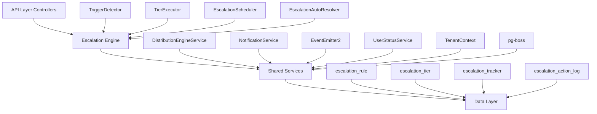

The Escalation Module automates responses when assigned leads go stale. A scheduled engine detects trigger conditions (no first contact, went cold) and executes tiered escalation actions — notifications, temperature changes, tag additions, and redistribution to new agents.

## Overview

<Note>
**Status:** Active — fully implemented  
**Module Path:** `src/modules/crm/escalation/`
</Note>

### Design Principles

| Principle | Decision |
|-----------|----------|
| pg-boss scheduling | Escalation scheduler uses pg-boss recurring job for reliability |
| Tiered actions | Rules have ordered tiers with configurable delays; actions execute in sequence |
| Auto-resolution | Events (activity, stage change, reassignment) automatically resolve active trackers |
| Idempotency | Partial unique index + `ON CONFLICT DO NOTHING` prevents duplicate trackers |
| Distribution delegation | Reassignment uses the distribution engine (`REDISTRIBUTE` action), not a separate paradigm |
| RLS compliance | All entities carry `organization_id` for row-level security |

## Architecture

### High-Level Diagram



### Component Responsibilities

<AccordionGroup>
  <Accordion title="EscalationScheduler">
    pg-boss recurring job that runs every 60 seconds to detect new triggers and process due escalations
  </Accordion>
  
  <Accordion title="TriggerDetector">
    Scans leads for unmet conditions (no first contact, went cold); creates tracker records
  </Accordion>
  
  <Accordion title="TierExecutor">
    Executes escalation tier actions (notify, redistribute, change temp, add tag)
  </Accordion>
  
  <Accordion title="EscalationAutoResolver">
    Listens to domain events and resolves active trackers when conditions change
  </Accordion>
  
  <Accordion title="EscalationRuleService">
    CRUD for escalation rules; handles tracker cancellation on deactivation/deletion
  </Accordion>
</AccordionGroup>

## Entity Specifications

### EscalationRule

Defines when and how a lead should be escalated. Evaluated by `TriggerDetector`.

| Column | Type | Notes |
|--------|------|-------|
| id | uuid PK | |
| organization_id | uuid FK | RLS |
| name | varchar | Human-readable rule name |
| is_active | bool | default true |
| priority | int | Evaluation order |
| trigger_type | enum | `NO_FIRST_CONTACT`, `WENT_COLD` |
| trigger_config | jsonb | `{thresholdMinutes?, thresholdValue?, thresholdUnit?}` |
| conditions | jsonb | `EscalationCondition[]` — AND-joined applicability filters; `[]` = all leads |
| respect_business_hours | bool | default true. References org business hours schedule. |
| created_by | uuid FK | |
| created_at, updated_at | timestamp | |
| is_deleted | bool | soft delete |

<Warning>
Rules are evaluated in ascending `priority` order (lower number = higher priority). Active rules must use unique priorities within the organization. The backend enforces this invariant on create, priority update, and reactivation.
</Warning>

#### EscalationCondition Shape

```typescript
interface EscalationCondition {
  field: 'temperature' | 'leadSource' | 'language' | 'sourceChannel';
  operator: 'eq' | 'in';
  value: string | string[];
}
```

#### SQL Field Mapping

| Field | SQL Column | Table | Notes |
|-------|------------|-------|-------|
| `temperature` | `l.temperature` | lead | |
| `leadSource` | `l.lead_source` | lead | |
| `sourceChannel` | `l.source_channel` | lead | |
| `language` | `p.languages` | person | Adds `LEFT JOIN person p ON p.id = l.person_id`; matches JSONB entries by `languages[].code` |

### EscalationTier

Each tier in an escalation rule represents a delayed action set. Tiers execute in `tier_order` sequence.

| Column | Type | Notes |
|--------|------|-------|
| id | uuid PK | |
| escalation_rule_id | uuid FK | |
| organization_id | uuid FK | RLS |
| tier_order | int | 1, 2, 3... (max 10) |
| delay_minutes | int | Tier 1: always 0 — threshold is the sole timing control. Subsequent tiers: minutes after the previous tier completed. |
| actions | jsonb | `TierAction[]` — see Tier Actions below |

#### Tier Action Types

<Tabs>
  <Tab title="NOTIFY_AGENT">
    **Parameters:** `message?: string`
    
    Resolved from lead's current stakeholder (assigned agent)
  </Tab>
  
  <Tab title="NOTIFY_ADMIN">
    **Parameters:** `message?: string`
    
    **Self-resolving** — queries all org users with the `system.admin` permission key via `UserOrgRole → RolePermission → Permission`. Skipped if no admin users found.
  </Tab>
  
  <Tab title="NOTIFY_USERS">
    **Parameters:** `user_ids: string[], message?: string`
    
    Sends notifications to specified user IDs. Validates users exist and belong to the organization.
  </Tab>
  
  <Tab title="CHANGE_TEMPERATURE">
    **Parameters:** `temperature: 'HOT' | 'WARM' | 'COLD'`
    
    Updates lead temperature and logs the change.
  </Tab>
  
  <Tab title="ADD_TAG">
    **Parameters:** `tag_name: string`
    
    Adds a tag to the lead. Creates the tag if it doesn't exist in the organization.
  </Tab>
  
  <Tab title="REDISTRIBUTE">
    **Parameters:** `distribution_config?: object`
    
    Uses the distribution engine to reassign the lead to a new agent. Configuration passed to distribution service.
  </Tab>
</Tabs>

### EscalationTracker

Tracks active escalation processes for leads. Created by `TriggerDetector`, updated by `TierExecutor`.

| Column | Type | Notes |
|--------|------|-------|
| id | uuid PK | |
| organization_id | uuid FK | RLS |
| escalation_rule_id | uuid FK | |
| lead_id | uuid FK | |
| status | enum | `ACTIVE`, `RESOLVED`, `CANCELLED` |
| current_tier_order | int | null initially, set when first tier executes |
| next_execution_at | timestamp | When next tier should execute |
| trigger_reason | text | Human-readable explanation |
| trigger_metadata | jsonb | Additional context |
| resolution_reason | text | Why tracker was resolved/cancelled |
| created_at, updated_at | timestamp | |
| resolved_at | timestamp | When status changed to RESOLVED/CANCELLED |

<Info>
A partial unique index prevents duplicate active trackers: `CREATE UNIQUE INDEX escalation_tracker_lead_active_idx ON escalation_tracker (organization_id, lead_id) WHERE status = 'ACTIVE';`
</Info>

### EscalationActionLog

Audit trail for executed escalation actions.

| Column | Type | Notes |
|--------|------|-------|
| id | uuid PK | |
| organization_id | uuid FK | RLS |
| escalation_tracker_id | uuid FK | |
| tier_order | int | Which tier was executed |
| action_type | enum | Type of action performed |
| action_config | jsonb | Action parameters |
| execution_status | enum | `SUCCESS`, `FAILED`, `SKIPPED` |
| error_message | text | If execution failed |
| metadata | jsonb | Additional execution context |
| executed_at | timestamp | |

## Type Definitions

### Core Enums

```typescript
enum TriggerType {
  NO_FIRST_CONTACT = 'NO_FIRST_CONTACT',
  WENT_COLD = 'WENT_COLD'
}

enum TrackerStatus {
  ACTIVE = 'ACTIVE',
  RESOLVED = 'RESOLVED',
  CANCELLED = 'CANCELLED'
}

enum ActionType {
  NOTIFY_AGENT = 'NOTIFY_AGENT',
  NOTIFY_ADMIN = 'NOTIFY_ADMIN',
  NOTIFY_USERS = 'NOTIFY_USERS',
  CHANGE_TEMPERATURE = 'CHANGE_TEMPERATURE',
  ADD_TAG = 'ADD_TAG',
  REDISTRIBUTE = 'REDISTRIBUTE'
}

enum ExecutionStatus {
  SUCCESS = 'SUCCESS',
  FAILED = 'FAILED',
  SKIPPED = 'SKIPPED'
}
```

### Configuration Types

```typescript
interface TriggerConfig {
  thresholdMinutes?: number;     // For NO_FIRST_CONTACT
  thresholdValue?: number;       // For WENT_COLD
  thresholdUnit?: 'hours' | 'days'; // For WENT_COLD
}

interface TierAction {
  type: ActionType;
  config: {
    message?: string;
    user_ids?: string[];
    temperature?: 'HOT' | 'WARM' | 'COLD';
    tag_name?: string;
    distribution_config?: object;
  };
}
```

## Escalation Engine

### Trigger Detection

The `TriggerDetector` runs every 60 seconds via pg-boss to identify leads that meet escalation criteria.

<Steps>
  <Step title="Query Active Rules">
    Fetch all active escalation rules for the organization, ordered by priority
  </Step>
  
  <Step title="Evaluate Lead Conditions">
    For each rule, build SQL query to find applicable leads:
    - Apply trigger-specific conditions (no first contact, went cold)
    - Apply rule conditions (temperature, source, etc.)
    - Exclude leads with active trackers
  </Step>
  
  <Step title="Create Trackers">
    For matching leads, create `EscalationTracker` records with status `ACTIVE`
  </Step>
  
  <Step title="Schedule Execution">
    Set `next_execution_at` based on business hours and tier 1 delay
  </Step>
</Steps>

### Tier Execution

The `TierExecutor` processes due escalations and executes tier actions.

<CodeGroup>
```sql SQL - Find Due Escalations
SELECT et.*, er.respect_business_hours, etier.actions
FROM escalation_tracker et
JOIN escalation_rule er ON er.id = et.escalation_rule_id
JOIN escalation_tier etier ON etier.escalation_rule_id = er.id
WHERE et.status = 'ACTIVE'
  AND et.next_execution_at <= NOW()
  AND etier.tier_order = COALESCE(et.current_tier_order, 0) + 1
  AND et.organization_id = $1;
```

```typescript TypeScript - Action Execution
async executeAction(action: TierAction, context: ExecutionContext): Promise<ExecutionResult> {
  switch (action.type) {
    case ActionType.NOTIFY_AGENT:
      return this.notificationService.notifyAgent(context.lead.assignedUserId, action.config.message);
    
    case ActionType.REDISTRIBUTE:
      return this.distributionService.redistributeLead(context.lead, action.config.distribution_config);
    
    case ActionType.CHANGE_TEMPERATURE:
      return this.leadService.updateTemperature(context.lead.id, action.config.temperature);
    
    // ... other actions
  }
}
```
</CodeGroup>

### Auto-Resolution

The `EscalationAutoResolver` listens to domain events and automatically resolves trackers when conditions change.

<Tabs>
  <Tab title="Activity Events">
    When a lead receives activity (call, email, meeting), resolve active `NO_FIRST_CONTACT` trackers
  </Tab>
  
  <Tab title="Temperature Changes">
    When lead temperature changes to `HOT` or `WARM`, resolve active `WENT_COLD` trackers
  </Tab>
  
  <Tab title="Reassignment">
    When lead is reassigned to a different agent, resolve all active trackers with reason "Lead reassigned"
  </Tab>
  
  <Tab title="Stage Changes">
    When lead moves to certain stages (qualified, closed), resolve all active trackers
  </Tab>
</Tabs>

## API Endpoints

### Escalation Rules

<AccordionGroup>
  <Accordion title="GET /escalation/rules">
    **Query Parameters:**
    - `page?: number` (default: 1)
    - `limit?: number` (default: 20)
    - `is_active?: boolean`
    - `trigger_type?: TriggerType`
    
    **Response:** Paginated list of escalation rules with tier counts
  </Accordion>
  
  <Accordion title="POST /escalation/rules">
    **Body:** `CreateEscalationRuleDto`
    
    **Validation:**
    - Unique priority among active rules
    - Valid trigger configuration
    - At least one tier with valid actions
    
    **Response:** Created rule with generated tiers
  </Accordion>
  
  <Accordion title="PUT /escalation/rules/:id">
    **Body:** `UpdateEscalationRuleDto`
    
    **Validation:**
    - Priority uniqueness (if changing priority)
    - Cannot modify trigger_type of active rule with trackers
    
    **Response:** Updated rule
  </Accordion>
  
  <Accordion title="DELETE /escalation/rules/:id">
    **Behavior:** Soft delete rule and cancel all active trackers
    
    **Response:** `204 No Content`
  </Accordion>
</AccordionGroup>

### Analytics

<AccordionGroup>
  <Accordion title="GET /escalation/analytics/overview">
    **Query Parameters:**
    - `start_date: string` (ISO date)
    - `end_date: string` (ISO date)
    - `rule_ids?: string[]`
    
    **Response:**
    ```typescript
    {
      totalEscalations: number;
      resolvedEscalations: number;
      activeEscalations: number;
      averageResolutionTimeHours: number;
      escalationsByRule: Array<{
        ruleId: string;
        ruleName: string;
        count: number;
      }>;
      actionEffectiveness: Array<{
        actionType: ActionType;
        executionCount: number;
        successRate: number;
      }>;
    }
    ```
  </Accordion>
  
  <Accordion title="GET /escalation/analytics/trends">
    **Query Parameters:**
    - `period: 'day' | 'week' | 'month'`
    - `start_date: string`
    - `end_date: string`
    
    **Response:** Time-series data for escalation trends
  </Accordion>
</AccordionGroup>

## Security & Permissions

### Required Permissions

| Operation | Permission Key |
|-----------|----------------|
| View escalation rules | `crm.escalation.read` |
| Create/edit rules | `crm.escalation.write` |
| Delete rules | `crm.escalation.delete` |
| View analytics | `crm.escalation.analytics` |
| Admin notifications | `system.admin` |

### Row-Level Security

All escalation entities include `organization_id` for RLS policies:

```sql
CREATE POLICY escalation_rule_tenant_isolation ON escalation_rule
  USING (organization_id = current_setting('app.current_organization_id')::uuid);

CREATE POLICY escalation_tracker_tenant_isolation ON escalation_tracker
  USING (organization_id = current_setting('app.current_organization_id')::uuid);
```

## Edge Case Handling

<Warning>
**Business Hours Transitions:** When business hours end during an active escalation, the next execution is delayed until business hours resume. The system accounts for timezone changes and holiday schedules.
</Warning>

<Info>
**Concurrent Modifications:** If a lead is modified while an escalation is being executed, the system uses optimistic locking to prevent race conditions. Failed executions are retried up to 3 times.
</Info>

### Common Edge Cases

<AccordionGroup>
  <Accordion title="Rule Deactivation">
    When a rule is deactivated, all active trackers for that rule are cancelled with reason "Rule deactivated"
  </Accordion>
  
  <Accordion title="Lead Deletion">
    Deleted leads automatically resolve their active trackers via cascade delete policies
  </Accordion>
  
  <Accordion title="User Deactivation">
    If a user referenced in NOTIFY_USERS actions is deactivated, the action is skipped with appropriate logging
  </Accordion>
  
  <Accordion title="Distribution Failure">
    If REDISTRIBUTE action fails (no available agents), the escalation continues to the next tier after logging the failure
  </Accordion>
</AccordionGroup>

## Performance & Scaling

### Database Optimization

<Steps>
  <Step title="Indexes">
    - `escalation_tracker_lead_active_idx` - Prevents duplicate active trackers
    - `escalation_tracker_next_execution_idx` - Optimizes due escalation queries
    - `escalation_rule_priority_idx` - Supports priority ordering
  </Step>
  
  <Step title="Query Optimization">
    Trigger detection uses efficient SQL with proper joins and WHERE clauses to minimize table scans
  </Step>
  
  <Step title="Batch Processing">
    Tier executor processes escalations in batches of 50 to balance throughput and memory usage
  </Step>
</Steps>

### Monitoring Metrics

| Metric | Description | Alert Threshold |
|--------|-------------|-----------------|
| `escalation_execution_duration` | Time to process batch of due escalations | > 30 seconds |
| `escalation_detection_duration` | Time to scan for new triggers | > 60 seconds |
| `escalation_action_failure_rate` | Percentage of failed action executions | > 5% |
| `active_tracker_count` | Number of active escalation trackers | > 10,000 |

## Integration Points

### External Dependencies

<CardGroup cols={2}>
  <Card title="Distribution Engine" href="/backend/distribution/specification">
    Used by REDISTRIBUTE actions to reassign leads to new agents
  </Card>
  
  <Card title="Notification Service" href="/backend/notifications/specification">
    Handles all escalation notifications (agent, admin, user alerts)
  </Card>
  
  <Card title="Business Hours Service" href="/backend/business-hours/specification">
    Respects organization business hours for escalation timing
  </Card>
  
  <Card title="Event System" href="/backend/events/specification">
    Listens to lead activity and status change events for auto-resolution
  </Card>
</CardGroup>

### Domain Events

The escalation module emits the following events:

```typescript
// Emitted when escalation tracker is created
interface EscalationTriggeredEvent {
  type: 'escalation.triggered';
  data: {
    trackerId: string;
    leadId: string;
    ruleId: string;
    triggerReason: string;
  };
}

// Emitted when tier actions are executed
interface EscalationTierExecutedEvent {
  type: 'escalation.tier_executed';
  data: {
    trackerId: string;
    tierOrder: number;
    actions: TierAction[];
    results: ExecutionResult[];
  };
}

// Emitted when escalation is resolved
interface EscalationResolvedEvent {
  type: 'escalation.resolved';
  data: {
    trackerId: string;
    leadId: string;
    resolutionReason: string;
    duration: number; // milliseconds
  };
}
```

<Tip>
These events can be consumed by analytics services, audit systems, or external integrations to track escalation effectiveness and lead engagement patterns.
</Tip>