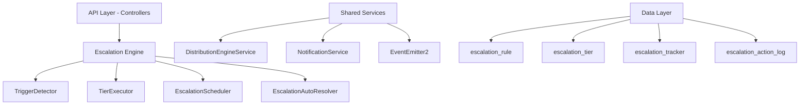

## Overview

The Escalation Module automates responses when assigned leads go stale. A scheduled engine detects trigger conditions (no first contact, went cold) and executes tiered escalation actions — notifications, temperature changes, tag additions, and redistribution to new agents.

<Info>
**Status:** Active — fully implemented  
**Module Path:** `src/modules/crm/escalation/`
</Info>

### Design Principles

| Principle | Decision |
|-----------|----------|
| pg-boss scheduling | Escalation scheduler uses pg-boss recurring job for reliability |
| Tiered actions | Rules have ordered tiers with configurable delays; actions execute in sequence |
| Auto-resolution | Events (activity, stage change, reassignment) automatically resolve active trackers |
| Idempotency | Partial unique index + `ON CONFLICT DO NOTHING` prevents duplicate trackers |
| Distribution delegation | Reassignment uses the distribution engine (`REDISTRIBUTE` action), not a separate paradigm |
| RLS compliance | All entities carry `organization_id` for row-level security |

## Architecture

### High-Level Diagram



### Component Responsibilities

<AccordionGroup>
<Accordion title="EscalationScheduler">
pg-boss recurring job that runs every 60 seconds to detect new triggers and process due escalations
</Accordion>

<Accordion title="TriggerDetector">
Scans leads for unmet conditions (no first contact, went cold); creates tracker records
</Accordion>

<Accordion title="TierExecutor">
Executes escalation tier actions (notify, redistribute, change temp, add tag)
</Accordion>

<Accordion title="EscalationAutoResolver">
Listens to domain events and resolves active trackers when conditions change
</Accordion>

<Accordion title="EscalationRuleService">
CRUD for escalation rules; handles tracker cancellation on deactivation/deletion
</Accordion>
</AccordionGroup>

## Entity Specifications

### EscalationRule

Defines when and how a lead should be escalated. Evaluated by `TriggerDetector`.

| Column | Type | Notes |
|--------|------|-------|
| id | uuid PK | |
| organization_id | uuid FK | RLS |
| name | varchar | Human-readable rule name |
| is_active | bool | default true |
| priority | int | Evaluation order |
| trigger_type | enum | `NO_FIRST_CONTACT`, `WENT_COLD` |
| trigger_config | jsonb | `{thresholdMinutes?, thresholdValue?, thresholdUnit?}` |
| condition_groups | jsonb | `[{conditions:[{field,operator,value}]}]` — AND-within-OR groups; `[]` = all leads |
| respect_business_hours | bool | default true. References org business hours schedule. |
| created_by | uuid FK | |
| created_at, updated_at | timestamp | |
| is_deleted | bool | soft delete |

<Note>
Rules are evaluated in ascending `priority` order (lower number = higher priority). Active rules must use unique priorities within the organization.
</Note>

#### Rule Priority Management

<Steps>
<Step title="Creating New Rules">
Frontend defaults `priority` to one greater than the highest active escalation rule priority from the loaded rule list
</Step>

<Step title="Edit Mode">
Preserves the existing rule priority
</Step>

<Step title="Validation">
Frontend create/edit sheet disables submission when an active rule would reuse another active rule's priority
</Step>

<Step title="Backend Enforcement">
The backend enforces the invariant on create, priority update, and reactivation
</Step>
</Steps>

<Warning>
If another active, non-deleted rule in the same organization already uses the requested priority, the write is rejected with `400 Bad Request`. Inactive rules may keep duplicate priorities until activation.
</Warning>

#### Duplicate Rule Prevention

<Info>
Rule `name` is a display label only — duplicate names are allowed. The backend rejects create/update when another **non-deleted** rule in the same organization has an identical **behavior fingerprint**.
</Info>

The behavior fingerprint includes:
- `triggerType`
- normalized `triggerConfig`
- canonical `conditionGroups`
- canonical tiers/actions (`tierOrder`, `delayMinutes`, action type + params)

#### Applicability Conditions

Escalation reuses the shared rule-condition module (`src/modules/crm/shared/rule-conditions/`).

```typescript
interface ConditionGroup {
  conditions: RuleCondition[]; // AND within group
}
// A lead matches when ANY group fully passes. 
// Empty conditionGroups[] = all leads.
```

<Tip>
A lead matches when ANY group fully passes. Empty `conditionGroups[]` means the rule applies to all leads.
</Tip>

### EscalationTier

Each tier in an escalation rule represents a delayed action set. Tiers execute in `tier_order` sequence.

| Column | Type | Notes |
|--------|------|-------|
| id | uuid PK | |
| organization_id | uuid FK | RLS |
| escalation_rule_id | uuid FK | |
| tier_order | int | 1-based execution order |
| delay_minutes | int | Minutes after trigger before this tier executes |
| created_at, updated_at | timestamp | |

### EscalationAction

Actions within a tier that execute simultaneously.

| Column | Type | Notes |
|--------|------|-------|
| id | uuid PK | |
| organization_id | uuid FK | RLS |
| escalation_tier_id | uuid FK | |
| action_type | enum | `NOTIFY_USER`, `REDISTRIBUTE`, `CHANGE_TEMPERATURE`, `ADD_TAG` |
| action_config | jsonb | Type-specific configuration |
| created_at, updated_at | timestamp | |

#### Action Types and Configurations

<Tabs>
<Tab title="NOTIFY_USER">
```json
{
  "userIds": ["uuid1", "uuid2"],
  "message": "Lead requires attention"
}
```
</Tab>

<Tab title="REDISTRIBUTE">
```json
{
  "distributionRuleId": "uuid",
  "skipCurrentAssignee": true
}
```
</Tab>

<Tab title="CHANGE_TEMPERATURE">
```json
{
  "temperature": "HOT"
}
```
</Tab>

<Tab title="ADD_TAG">
```json
{
  "tagLabels": ["escalated", "needs-attention"]
}
```
</Tab>
</Tabs>

### EscalationTracker

Tracks the escalation state of individual leads.

| Column | Type | Notes |
|--------|------|-------|
| id | uuid PK | |
| organization_id | uuid FK | RLS |
| lead_id | uuid FK | |
| escalation_rule_id | uuid FK | |
| trigger_type | enum | Snapshot from rule |
| status | enum | `ACTIVE`, `RESOLVED_AUTO`, `RESOLVED_MANUAL`, `CANCELLED` |
| triggered_at | timestamp | When escalation began |
| next_tier_due_at | timestamp | When next tier should execute |
| current_tier_order | int | Last executed tier (0 = none) |
| resolved_at | timestamp | When escalation ended |
| resolved_reason | varchar | Why escalation ended |
| created_at, updated_at | timestamp | |

<Check>
Partial unique index prevents duplicate active trackers: `(lead_id, escalation_rule_id) WHERE status = 'ACTIVE'`
</Check>

### EscalationActionLog

Audit trail of executed escalation actions.

| Column | Type | Notes |
|--------|------|-------|
| id | uuid PK | |
| organization_id | uuid FK | RLS |
| escalation_tracker_id | uuid FK | |
| escalation_tier_id | uuid FK | |
| escalation_action_id | uuid FK | |
| action_type | enum | Snapshot for historical queries |
| action_config | jsonb | Snapshot of configuration used |
| executed_at | timestamp | When action was performed |
| execution_status | enum | `SUCCESS`, `FAILED`, `SKIPPED` |
| error_message | text | If execution_status = 'FAILED' |
| created_at | timestamp | |

## Type Definitions

### Trigger Types

```typescript
enum EscalationTriggerType {
  NO_FIRST_CONTACT = 'NO_FIRST_CONTACT',
  WENT_COLD = 'WENT_COLD'
}
```

### Trigger Configurations

<CodeGroup>
```typescript NO_FIRST_CONTACT
interface NoFirstContactConfig {
  thresholdMinutes?: number; // Legacy support
  thresholdValue?: number;   // New format
  thresholdUnit?: 'MINUTES' | 'HOURS' | 'DAYS';
}
```

```typescript WENT_COLD
interface WentColdConfig {
  thresholdMinutes?: number; // Legacy support
  thresholdValue?: number;   // New format
  thresholdUnit?: 'MINUTES' | 'HOURS' | 'DAYS';
}
```
</CodeGroup>

### Status Types

```typescript
enum EscalationTrackerStatus {
  ACTIVE = 'ACTIVE',
  RESOLVED_AUTO = 'RESOLVED_AUTO',
  RESOLVED_MANUAL = 'RESOLVED_MANUAL',
  CANCELLED = 'CANCELLED'
}

enum EscalationActionStatus {
  SUCCESS = 'SUCCESS',
  FAILED = 'FAILED',
  SKIPPED = 'SKIPPED'
}
```

## Escalation Engine

### TriggerDetector

<Steps>
<Step title="Scan Active Rules">
Query all active, non-deleted escalation rules ordered by priority
</Step>

<Step title="Apply Rule Conditions">
For each rule, scan leads matching the condition groups using `LeadScanService`
</Step>

<Step title="Check Trigger Conditions">
Evaluate trigger-specific logic (no first contact, went cold) with business hours respect
</Step>

<Step title="Create Trackers">
Insert new `EscalationTracker` records using `ON CONFLICT DO NOTHING` for idempotency
</Step>
</Steps>

### TierExecutor

The tier executor processes due escalations and executes their actions.

<Steps>
<Step title="Find Due Trackers">
Query active trackers where `next_tier_due_at <= NOW()`
</Step>

<Step title="Load Tier Actions">
Get all actions for the next tier in the escalation sequence
</Step>

<Step title="Execute Actions">
Run all tier actions concurrently, logging results to `EscalationActionLog`
</Step>

<Step title="Update Tracker">
Advance `current_tier_order` and set `next_tier_due_at` for the following tier
</Step>

<Step title="Complete or Continue">
Mark tracker as resolved if no more tiers exist
</Step>
</Steps>

### EscalationAutoResolver

Listens to domain events and automatically resolves active trackers when conditions change.

#### Resolution Triggers

| Event | Reason | Logic |
|-------|--------|-------|
| Lead activity recorded | `ACTIVITY_RECORDED` | Any new activity resolves NO_FIRST_CONTACT trackers |
| Lead temperature changed | `TEMPERATURE_CHANGED` | Temperature increases resolve WENT_COLD trackers |
| Lead stage changed | `STAGE_CHANGED` | Stage progression resolves all active trackers |
| Lead reassigned | `LEAD_REASSIGNED` | Reassignment resolves all active trackers |

## API Endpoints

### Escalation Rules

<CodeGroup>
```http POST /escalation-rules
POST /api/v1/escalation-rules
Content-Type: application/json

{
  "name": "Hot Lead Follow-up",
  "triggerType": "NO_FIRST_CONTACT",
  "triggerConfig": {
    "thresholdValue": 2,
    "thresholdUnit": "HOURS"
  },
  "conditionGroups": [
    {
      "conditions": [
        {
          "field": "temperature",
          "operator": "eq",
          "value": "HOT"
        }
      ]
    }
  ],
  "respectBusinessHours": true,
  "tiers": [
    {
      "tierOrder": 1,
      "delayMinutes": 120,
      "actions": [
        {
          "actionType": "NOTIFY_USER",
          "actionConfig": {
            "userIds": ["user-uuid"],
            "message": "Hot lead needs first contact"
          }
        }
      ]
    }
  ]
}
```

```http GET /escalation-rules
GET /api/v1/escalation-rules?includeDeleted=false&page=1&limit=20

{
  "data": [
    {
      "id": "rule-uuid",
      "name": "Hot Lead Follow-up",
      "isActive": true,
      "priority": 1,
      "triggerType": "NO_FIRST_CONTACT",
      "triggerConfig": {
        "thresholdValue": 2,
        "thresholdUnit": "HOURS"
      },
      "conditionGroups": [...],
      "respectBusinessHours": true,
      "tiers": [...],
      "createdAt": "2024-01-01T00:00:00Z",
      "updatedAt": "2024-01-01T00:00:00Z"
    }
  ],
  "meta": {
    "total": 1,
    "page": 1,
    "limit": 20,
    "totalPages": 1
  }
}
```
</CodeGroup>

### Escalation Analytics

<CodeGroup>
```http GET /escalation-analytics/overview
GET /api/v1/escalation-analytics/overview?startDate=2024-01-01&endDate=2024-01-31

{
  "totalEscalations": 150,
  "resolvedEscalations": 120,
  "activeEscalations": 30,
  "averageResolutionTime": 240,
  "topTriggerTypes": [
    {
      "triggerType": "NO_FIRST_CONTACT",
      "count": 90
    },
    {
      "triggerType": "WENT_COLD",
      "count": 60
    }
  ]
}
```

```http GET /escalation-analytics/rule-performance
GET /api/v1/escalation-analytics/rule-performance?ruleId=rule-uuid

{
  "ruleId": "rule-uuid",
  "ruleName": "Hot Lead Follow-up",
  "totalTriggers": 50,
  "successfulResolutions": 40,
  "manualResolutions": 5,
  "stillActive": 5,
  "averageResolutionTime": 180,
  "tierExecutionStats": [
    {
      "tierOrder": 1,
      "executionCount": 50,
      "successRate": 0.9
    }
  ]
}
```
</CodeGroup>

### Escalation Trackers

<CodeGroup>
```http GET /escalation-trackers
GET /api/v1/escalation-trackers?leadId=lead-uuid&status=ACTIVE&page=1&limit=10

{
  "data": [
    {
      "id": "tracker-uuid",
      "leadId": "lead-uuid",
      "escalationRuleId": "rule-uuid",
      "triggerType": "NO_FIRST_CONTACT",
      "status": "ACTIVE",
      "triggeredAt": "2024-01-01T10:00:00Z",
      "nextTierDueAt": "2024-01-01T12:00:00Z",
      "currentTierOrder": 0,
      "rule": {
        "name": "Hot Lead Follow-up"
      },
      "lead": {
        "name": "John Doe",
        "email": "john@example.com"
      }
    }
  ],
  "meta": {
    "total": 1,
    "page": 1,
    "limit": 10,
    "totalPages": 1
  }
}
```

```http PATCH /escalation-trackers/:id/resolve
PATCH /api/v1/escalation-trackers/tracker-uuid/resolve
Content-Type: application/json

{
  "reason": "Manual intervention completed"
}
```
</CodeGroup>

## Security & Permissions

### Required Permissions

| Action | Permission | Resource |
|--------|------------|----------|
| Create escalation rule | `escalation:rule:create` | Organization |
| Read escalation rules | `escalation:rule:read` | Organization |
| Update escalation rule | `escalation:rule:update` | Specific rule |
| Delete escalation rule | `escalation:rule:delete` | Specific rule |
| View escalation analytics | `escalation:analytics:read` | Organization |
| Manage escalation trackers | `escalation:tracker:manage` | Organization |

### Row Level Security (RLS)

<Warning>
All escalation entities include `organization_id` for RLS enforcement. Users can only access escalation data within their organization.
</Warning>

### Business Hours Integration

<Info>
When `respectBusinessHours` is enabled, escalation timing calculations exclude non-business hours based on the organization's configured business hours schedule.
</Info>

## Analytics & Metrics

### Key Performance Indicators

<CardGroup cols={2}>
<Card title="Resolution Rate" icon="chart-line">
Percentage of escalations that are successfully resolved vs. those that require manual intervention
</Card>

<Card title="Average Resolution Time" icon="clock">
Mean time from escalation trigger to resolution across all escalation types
</Card>

<Card title="Trigger Distribution" icon="pie-chart">
Breakdown of escalations by trigger type (NO_FIRST_CONTACT vs WENT_COLD)
</Card>

<Card title="Rule Effectiveness" icon="target">
Success rate and performance metrics for individual escalation rules
</Card>
</CardGroup>

## Edge Case Handling

### Concurrent Modifications

<Steps>
<Step title="Duplicate Tracker Prevention">
Partial unique index on `(lead_id, escalation_rule_id)` with `WHERE status = 'ACTIVE'` prevents duplicate active trackers
</Step>

<Step title="Rule Priority Conflicts">
Backend validation prevents multiple active rules from sharing the same priority within an organization
</Step>

<Step title="Lead State Changes">
Auto-resolver listens to domain events and handles concurrent state changes gracefully
</Step>
</Steps>

### Business Hours Edge Cases

<Note>
When business hours change during an active escalation, the next tier due time is recalculated based on the updated schedule.
</Note>

### Failed Action Handling

| Action Type | Failure Behavior |
|-------------|------------------|
| NOTIFY_USER | Log error, continue with other actions |
| REDISTRIBUTE | Log error, skip reassignment, continue |
| CHANGE_TEMPERATURE | Log error, continue with other actions |
| ADD_TAG | Log error, continue with other actions |

## Performance & Scaling

### Optimization Strategies

<Tip>
The escalation scheduler is designed for high performance with indexed queries and batch processing capabilities.
</Tip>

- **Indexed Columns**: All foreign keys, status fields, and timestamp columns are indexed
- **Batch Processing**: pg-boss ensures only one scheduler instance runs at a time
- **Efficient Queries**: Lead scanning uses optimized queries with proper JOIN strategies
- **Async Actions**: Action execution uses concurrent processing where possible

### Monitoring

Key metrics to monitor:
- Scheduler execution time
- Action execution success rates
- Queue depth for pg-boss jobs
- Database query performance
- Memory usage during large lead scans

## RLS Policies

All escalation tables implement Row Level Security (RLS) policies:

```sql
-- Example RLS policy for escalation_rule
CREATE POLICY escalation_rule_org_policy ON escalation_rule
    FOR ALL 
    USING (organization_id = current_setting('app.current_organization_id')::uuid);

-- Similar policies exist for all escalation tables
-- escalation_tier, escalation_action, escalation_tracker, escalation_action_log
```

<Warning>
RLS policies are automatically enabled and enforced. All queries must include proper organization context.
</Warning>

## Module Structure

```
src/modules/crm/escalation/
├── controllers/
│   ├── escalation-rule.controller.ts
│   ├── escalation-analytics.controller.ts
│   └── escalation-tracker.controller.ts
├── services/
│   ├── escalation-rule.service.ts
│   ├── escalation-engine.service.ts
│   ├── escalation-scheduler.service.ts
│   ├── escalation-auto-resolver.service.ts
│   └── escalation-analytics.service.ts
├── entities/
│   ├── escalation-rule.entity.ts
│   ├── escalation-tier.entity.ts
│   ├── escalation-action.entity.ts
│   ├── escalation-tracker.entity.ts
│   └── escalation-action-log.entity.ts
├── dto/
│   ├── create-escalation-rule.dto.ts
│   ├── update-escalation-rule.dto.ts
│   ├── escalation-rule.dto.ts
│   └── escalation-analytics.dto.ts
├── types/
│   ├── escalation.types.ts
│   └── escalation-config.types.ts
└── utils/
    ├── escalation-rule-fingerprint.util.ts
    └── business-hours.util.ts
```

## Integration Points

### Distribution Engine

<Check>
The escalation module delegates lead redistribution to the existing distribution engine rather than implementing its own assignment logic.
</Check>

### Notification Service

All user notifications are handled through the centralized notification service, supporting multiple delivery channels (email, SMS, in-app).

### Event System

The escalation module integrates with the domain event system for:
- Lead activity tracking
- Temperature change detection  
- Stage progression monitoring
- Assignment change notifications

### Business Hours Service

Escalation timing calculations integrate with the organization's business hours configuration when `respectBusinessHours` is enabled.