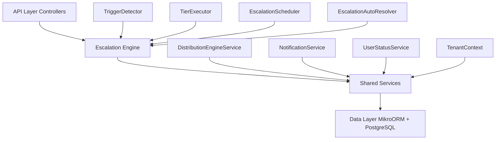

The Escalation Module automates responses when assigned leads go stale. A scheduled engine detects trigger conditions (no first contact, went cold) and executes tiered escalation actions — notifications, temperature changes, tag additions, and redistribution to new agents.

## Overview

<Note>
**Status:** Active — fully implemented  
**Module Path:** `src/modules/crm/escalation/`
</Note>

### Design Principles

<CardGroup cols={2}>
  <Card title="pg-boss scheduling" icon="clock">
    Escalation scheduler uses pg-boss recurring job for reliability
  </Card>
  <Card title="Tiered actions" icon="layer-group">
    Rules have ordered tiers with configurable delays; actions execute in sequence
  </Card>
  <Card title="Auto-resolution" icon="check-circle">
    Events (activity, stage change, reassignment) automatically resolve active trackers
  </Card>
  <Card title="Idempotency" icon="shield">
    Partial unique index + `ON CONFLICT DO NOTHING` prevents duplicate trackers
  </Card>
</CardGroup>

## Architecture

### High-Level Diagram



### Component Responsibilities

| Component | Responsibility |
|-----------|----------------|
| **EscalationScheduler** | pg-boss recurring job that runs every 60 seconds to detect new triggers and process due escalations |
| **TriggerDetector** | Scans leads for unmet conditions (no first contact, went cold); creates tracker records |
| **TierExecutor** | Executes escalation tier actions (notify, redistribute, change temp, add tag) |
| **EscalationAutoResolver** | Listens to domain events and resolves active trackers when conditions change |
| **EscalationRuleService** | CRUD for escalation rules; handles tracker cancellation on deactivation/deletion |

## Entity Specifications

### EscalationRule

Defines when and how a lead should be escalated. Evaluated by `TriggerDetector`.

<AccordionGroup>
<Accordion title="Database Schema">

| Column | Type | Notes |
|--------|------|-------|
| id | uuid PK | |
| organization_id | uuid FK | RLS |
| name | varchar | Human-readable rule name |
| is_active | bool | default true |
| priority | int | Evaluation order |
| trigger_type | enum | `NO_FIRST_CONTACT`, `WENT_COLD` |
| trigger_config | jsonb | `{thresholdMinutes?, thresholdValue?, thresholdUnit?}` |
| condition_groups | jsonb | `[{conditions:[{field,operator,value}]}]` — AND-within-OR groups; `[]` = all leads |
| respect_business_hours | bool | default true. References org business hours schedule. |
| created_by | uuid FK | |
| created_at, updated_at | timestamp | |
| is_deleted | bool | soft delete |

</Accordion>

<Accordion title="Rule Priority System">

Rules are evaluated in ascending `priority` order (lower number = higher priority). Active rules must use unique priorities within the organization.

<Warning>
The backend rejects create/update when another **non-deleted** rule in the same organization has an identical priority. The API returns `400 Bad Request` on conflict.
</Warning>

**Priority Assignment:**
- Frontend defaults `priority` to one greater than the highest active escalation rule priority
- Edit mode preserves existing rule priority
- Frontend disables submission when an active rule would reuse another active rule's priority
- Inactive rules may keep duplicate priorities until activation

</Accordion>

<Accordion title="Condition Groups Structure">

Escalation reuses the shared rule-condition module (`src/modules/crm/shared/rule-conditions/`). 

```typescript
interface ConditionGroup {
  conditions: RuleCondition[]; // AND within group
}
// A lead matches when ANY group fully passes. Empty conditionGroups[] = all leads.
```

**SQL Field Mapping:**

| Field | SQL Column/Expression | Table/Join | Operators | Notes |
|-------|----------------------|------------|-----------|-------|
| `temperature` | `l.temperature` | lead | eq, in | Case-insensitive |
| `leadSource` | `l.lead_source` | lead | eq, in | Case-insensitive |
| `intent` | `l.intent` | lead | eq | Case-insensitive |
| `budget` | `l.budget` | lead | eq, gte, lte, between | Numeric; `between` accepts `{min, max}` or `[min, max]` |
| `tags` | `l.tag_ids` | lead | contains | `EXISTS` + `jsonb_array_elements_text` + `IN (?)` per label |
| `sourceChannel` | `pc.channel_type` | person_channel | eq, in | `LEFT JOIN person_channel pc ON pc.id = l.source_channel_id` |
| `language` | `p.languages` | person | eq | `LEFT JOIN person p ON p.id = l.person_id` |
| `area` | wished snapshot names | lead_property_interest | eq, in, contains | `EXISTS` subquery flattening area snapshots |

</Accordion>
</AccordionGroup>

### EscalationTier

Each tier in an escalation rule represents a delayed action set. Tiers execute in `tier_order` sequence.

| Column | Type | Notes |
|--------|------|-------|
| id | uuid PK | |
| organization_id | uuid FK | RLS |
| escalation_rule_id | uuid FK | |
| tier_order | int | 1-based execution order |
| delay_minutes | int | Minutes after trigger or previous tier |
| created_at, updated_at | timestamp | |

### EscalationAction

Defines specific actions within each tier.

<Tabs>
<Tab title="Schema">

| Column | Type | Notes |
|--------|------|-------|
| id | uuid PK | |
| organization_id | uuid FK | RLS |
| escalation_tier_id | uuid FK | |
| action_type | enum | `NOTIFY`, `REDISTRIBUTE`, `CHANGE_TEMPERATURE`, `ADD_TAG` |
| action_params | jsonb | Type-specific configuration |
| created_at, updated_at | timestamp | |

</Tab>

<Tab title="Action Types">

**NOTIFY:** Send notification to user(s)
```json
{
  "userIds": ["uuid1", "uuid2"],
  "subject": "Lead escalation: {{leadName}}",
  "message": "Lead has been escalated due to {{triggerType}}"
}
```

**REDISTRIBUTE:** Reassign lead using distribution engine
```json
{
  "targetTeamIds": ["uuid1"],
  "excludeCurrentAssignee": true
}
```

**CHANGE_TEMPERATURE:** Update lead temperature
```json
{
  "temperature": "COLD"
}
```

**ADD_TAG:** Add tag to lead
```json
{
  "tagId": "uuid"
}
```

</Tab>
</Tabs>

### EscalationTracker

Tracks active escalations for individual leads.

| Column | Type | Notes |
|--------|------|-------|
| id | uuid PK | |
| organization_id | uuid FK | RLS |
| lead_id | uuid FK | |
| escalation_rule_id | uuid FK | |
| trigger_type | enum | `NO_FIRST_CONTACT`, `WENT_COLD` |
| status | enum | `ACTIVE`, `RESOLVED` |
| current_tier | int | Next tier to execute (1-based) |
| next_execution_at | timestamp | When next tier should run |
| triggered_at | timestamp | When escalation was triggered |
| resolved_at | timestamp | When escalation was resolved |
| resolution_reason | varchar | Why escalation was resolved |
| created_at, updated_at | timestamp | |

<Note>
Unique constraint on `(lead_id, escalation_rule_id)` where `status = 'ACTIVE'` prevents duplicate active trackers.
</Note>

## Escalation Engine

### Trigger Detection

<Steps>
<Step title="Schedule Execution">
The `EscalationScheduler` runs every 60 seconds via pg-boss recurring job.
</Step>

<Step title="Rule Evaluation">
For each active escalation rule, the `TriggerDetector` scans leads matching the rule's conditions.
</Step>

<Step title="Trigger Conditions">
- **NO_FIRST_CONTACT:** Lead assigned but no activities recorded within threshold
- **WENT_COLD:** Lead had activities but none within threshold period
</Step>

<Step title="Tracker Creation">
Creates `EscalationTracker` records for triggered leads using `ON CONFLICT DO NOTHING` for idempotency.
</Step>
</Steps>

### Tier Execution

<CodeGroup>
```typescript TierExecutor Logic
async executeDueTiers(organizationId: string) {
  const dueTrackers = await this.findDueTrackers(organizationId);
  
  for (const tracker of dueTrackers) {
    const tier = await this.getCurrentTier(tracker);
    if (!tier) continue;
    
    await this.executeActions(tier.actions);
    await this.advanceToNextTier(tracker, tier);
  }
}
```

```sql Due Trackers Query
SELECT et.*, er.name as rule_name 
FROM escalation_tracker et
JOIN escalation_rule er ON er.id = et.escalation_rule_id
WHERE et.organization_id = ?
  AND et.status = 'ACTIVE'
  AND et.next_execution_at <= NOW()
  AND er.is_active = true
  AND er.is_deleted = false
```
</CodeGroup>

### Auto-Resolution

The `EscalationAutoResolver` listens for domain events and automatically resolves active trackers when conditions change.

<AccordionGroup>
<Accordion title="Resolution Triggers">

- **Lead Activity Created:** Resolves `NO_FIRST_CONTACT` and `WENT_COLD` trackers
- **Lead Stage Changed:** Resolves trackers when lead moves to non-escalatable stage
- **Lead Reassigned:** Resolves trackers when assignee changes
- **Lead Temperature Changed:** May resolve temperature-based triggers
- **Rule Deactivated/Deleted:** Resolves all trackers for the rule

</Accordion>

<Accordion title="Resolution Logic">

```typescript
@OnEvent('lead.activity.created')
async handleLeadActivity(payload: LeadActivityCreatedEvent) {
  const { leadId, organizationId, activityType } = payload;
  
  if (this.isFirstContactActivity(activityType)) {
    await this.resolveTrackers(leadId, organizationId, 'NO_FIRST_CONTACT', 'First contact made');
  }
  
  await this.resolveTrackers(leadId, organizationId, 'WENT_COLD', 'New activity recorded');
}
```

</Accordion>
</AccordionGroup>

## API Endpoints

### Escalation Rules

<Tabs>
<Tab title="CRUD Operations">

**Create Rule**
```http
POST /api/escalation-rules
Content-Type: application/json

{
  "name": "High Priority Lead Follow-up",
  "triggerType": "NO_FIRST_CONTACT",
  "triggerConfig": {
    "thresholdValue": 2,
    "thresholdUnit": "HOURS"
  },
  "conditionGroups": [
    {
      "conditions": [
        {
          "field": "temperature",
          "operator": "eq",
          "value": "HOT"
        }
      ]
    }
  ],
  "tiers": [...]
}
```

**List Rules**
```http
GET /api/escalation-rules?page=1&limit=20&search=follow
```

**Update Rule**
```http
PUT /api/escalation-rules/:id
```

**Delete Rule**
```http
DELETE /api/escalation-rules/:id
```

</Tab>

<Tab title="Rule Management">

**Activate/Deactivate**
```http
PATCH /api/escalation-rules/:id/toggle-status
Content-Type: application/json

{
  "isActive": false
}
```

**Test Rule Conditions**
```http
POST /api/escalation-rules/test-conditions
Content-Type: application/json

{
  "conditionGroups": [...],
  "leadId": "uuid" // Optional: test against specific lead
}
```

</Tab>
</Tabs>

### Analytics

<CodeGroup>
```http GET /api/escalation-analytics/overview
GET /api/escalation-analytics/overview?period=7d&ruleId=uuid
```

```json Response Example
{
  "totalEscalations": 45,
  "activeEscalations": 12,
  "resolvedEscalations": 33,
  "averageResolutionTime": 180, // minutes
  "escalationsByRule": [
    {
      "ruleId": "uuid",
      "ruleName": "Hot Lead Follow-up",
      "count": 15,
      "successRate": 0.8
    }
  ],
  "escalationTrends": [
    {
      "date": "2024-01-15",
      "triggered": 8,
      "resolved": 6
    }
  ]
}
```
</CodeGroup>

## Security & Permissions

### Row Level Security (RLS)

All escalation entities include `organization_id` and are protected by RLS policies:

<CodeGroup>
```sql EscalationRule Policy
CREATE POLICY escalation_rule_tenant_isolation ON escalation_rule
  USING (organization_id = current_setting('app.current_organization_id')::uuid);
```

```sql EscalationTracker Policy
CREATE POLICY escalation_tracker_tenant_isolation ON escalation_tracker
  USING (organization_id = current_setting('app.current_organization_id')::uuid);
```
</CodeGroup>

### Permission Requirements

| Action | Required Permission | Notes |
|--------|-------------------|-------|
| Create/Edit Rules | `escalation:manage` | Full rule management |
| View Rules | `escalation:read` | Read-only access |
| View Analytics | `escalation:analytics` | Analytics dashboard |
| Manual Resolution | `escalation:resolve` | Force-resolve trackers |

<Warning>
Only users with `escalation:manage` permission can create, edit, or delete escalation rules. The system prevents privilege escalation by validating permissions on all write operations.
</Warning>

## Performance & Scaling

### Optimization Strategies

<CardGroup cols={2}>
  <Card title="Database Indexing" icon="database">
    Strategic indexes on trigger detection queries and tracker lookups
  </Card>
  <Card title="Batch Processing" icon="layer-group">
    Process multiple trackers in batches to reduce database round trips
  </Card>
  <Card title="Event Debouncing" icon="clock">
    Debounce resolution events to prevent excessive database updates
  </Card>
  <Card title="Query Optimization" icon="chart-line">
    Optimized SQL queries for large lead datasets
  </Card>
</CardGroup>

### Key Performance Indexes

```sql
-- Trigger detection optimization
CREATE INDEX idx_escalation_trigger_scan ON lead (
  organization_id, assigned_to_id, stage, created_at
) WHERE assigned_to_id IS NOT NULL AND stage NOT IN ('CLOSED_WON', 'CLOSED_LOST');

-- Due tracker lookup
CREATE INDEX idx_escalation_tracker_due ON escalation_tracker (
  organization_id, next_execution_at, status
) WHERE status = 'ACTIVE';

-- Resolution lookup
CREATE INDEX idx_escalation_tracker_resolution ON escalation_tracker (
  organization_id, lead_id, status
) WHERE status = 'ACTIVE';
```

### Scaling Considerations

<Tip>
For organizations with >10k leads, consider:
- Implementing lead segmentation in trigger detection
- Using database partitioning for tracker tables
- Adding read replicas for analytics queries
- Implementing caching for frequently accessed rules
</Tip>

## Edge Cases & Error Handling

### Business Hours Handling

<Steps>
<Step title="Rule Configuration">
Rules can be configured to `respect_business_hours` (default: true)
</Step>

<Step title="Delay Calculation">
When business hours are respected, delays are calculated in business time only
</Step>

<Step title="Execution Timing">
Actions are scheduled to execute during business hours, with delays rolled over to the next business period if necessary
</Step>
</Steps>

### Concurrent Modification Handling

<AccordionGroup>
<Accordion title="Rule Priority Conflicts">

When multiple users attempt to create rules with the same priority:
- First successful write wins
- Subsequent attempts receive `400 Bad Request`
- Frontend shows real-time priority conflict warnings

</Accordion>

<Accordion title="Lead State Changes">

Rapid lead state changes are handled gracefully:
- Resolution events are debounced (500ms)
- Multiple resolution attempts are idempotent
- Tracker state is validated before each action execution

</Accordion>
</AccordionGroup>

### Error Recovery

<Warning>
If an escalation action fails:
1. Error is logged with full context
2. Tracker remains active for retry
3. Failed actions don't block subsequent tiers
4. Manual intervention options are available via admin interface
</Warning>

## Integration Points

### Distribution Engine Integration

The escalation module delegates lead reassignment to the distribution engine:

```typescript
// REDISTRIBUTE action execution
await this.distributionEngineService.redistributeLead({
  leadId: tracker.leadId,
  targetTeamIds: action.actionParams.targetTeamIds,
  excludeCurrentAssignee: action.actionParams.excludeCurrentAssignee,
  reason: 'ESCALATION',
  escalationRuleId: tracker.escalationRuleId
});
```

### Notification System Integration

Escalation notifications use the centralized notification service:

```typescript
await this.notificationService.send({
  type: 'ESCALATION',
  userIds: action.actionParams.userIds,
  subject: this.templateService.render(action.actionParams.subject, context),
  message: this.templateService.render(action.actionParams.message, context),
  priority: 'HIGH'
});
```

### Event System Integration

<Check>
The escalation module is fully integrated with the domain event system, both emitting events for escalation state changes and consuming events for auto-resolution triggers.
</Check>

**Emitted Events:**
- `escalation.triggered`
- `escalation.tier.executed` 
- `escalation.resolved`

**Consumed Events:**
- `lead.activity.created`
- `lead.stage.changed`
- `lead.assignee.changed`
- `lead.temperature.changed`