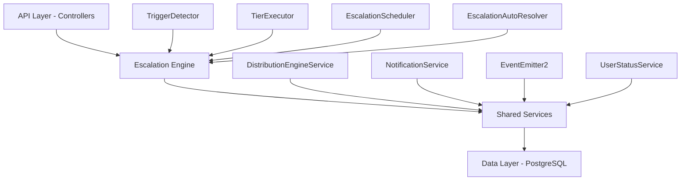

The Escalation Module automates responses when assigned leads go stale. A scheduled engine detects trigger conditions (no first contact, went cold) and executes tiered escalation actions — notifications, temperature changes, tag additions, and redistribution to new agents.

<Note>
**Status:** Active — fully implemented  
**Module Path:** `src/modules/crm/escalation/`
</Note>

## Design Principles

The escalation module follows key architectural decisions that ensure reliability and scalability:

| Principle | Decision |
|-----------|----------|
| pg-boss scheduling | Escalation scheduler uses pg-boss recurring job for reliability |
| Tiered actions | Rules have ordered tiers with configurable delays; actions execute in sequence |
| Auto-resolution | Events (activity, stage change, reassignment) automatically resolve active trackers |
| Idempotency | Partial unique index + `ON CONFLICT DO NOTHING` prevents duplicate trackers |
| Distribution delegation | Reassignment uses the distribution engine (`REDISTRIBUTE` action), not a separate paradigm |
| RLS compliance | All entities carry `organization_id` for row-level security |

## Architecture

### High-Level Diagram



### Component Responsibilities

<AccordionGroup>
<Accordion title="Core Engine Components">

| Component | Responsibility |
|-----------|----------------|
| **EscalationScheduler** | pg-boss recurring job that runs every 60 seconds to detect new triggers and process due escalations |
| **TriggerDetector** | Scans leads for unmet conditions (no first contact, went cold); creates tracker records |
| **TierExecutor** | Executes escalation tier actions (notify, redistribute, change temp, add tag) |
| **EscalationAutoResolver** | Listens to domain events and resolves active trackers when conditions change |
| **EscalationRuleService** | CRUD for escalation rules; handles tracker cancellation on deactivation/deletion |

</Accordion>
</AccordionGroup>

## Entity Specifications

### EscalationRule

Defines when and how a lead should be escalated. Evaluated by `TriggerDetector`.

<Tabs>
<Tab title="Schema">

| Column | Type | Notes |
|--------|------|-------|
| id | uuid PK | Primary identifier |
| organization_id | uuid FK | RLS compliance |
| name | varchar | Human-readable rule name |
| is_active | bool | default true |
| priority | int | Evaluation order |
| trigger_type | enum | `NO_FIRST_CONTACT`, `WENT_COLD` |
| trigger_config | jsonb | `{thresholdMinutes?, thresholdValue?, thresholdUnit?}` |
| conditions | jsonb | `EscalationCondition[]` — AND-joined applicability filters |
| respect_business_hours | bool | default true. References org business hours schedule |
| created_by | uuid FK | User who created the rule |
| created_at, updated_at | timestamp | Audit timestamps |
| is_deleted | bool | soft delete |

</Tab>
<Tab title="Priority Rules">

<Warning>
Rules are evaluated in ascending `priority` order (lower number = higher priority). Active rules must use unique priorities within the organization.
</Warning>

**Priority Assignment Rules:**
- **Create mode**: Frontend defaults `priority` to one greater than the highest active escalation rule priority
- **Edit mode**: Preserves the existing rule priority
- **Validation**: Frontend disables submission when an active rule would reuse another active rule's priority
- **Reactivation**: Rule cards block reactivation of paused rules with conflicting priority

The backend enforces the invariant on create, priority update, and reactivation. If another active, non-deleted rule in the same organization uses the requested priority, the write is rejected with `400 Bad Request`.

</Tab>
<Tab title="Conditions">

```typescript
interface EscalationCondition {
  field: 'temperature' | 'leadSource' | 'language' | 'sourceChannel';
  operator: 'eq' | 'in';
  value: string | string[];
}
```

**SQL Field Mapping:**

| Field | SQL Column | Table | Notes |
|-------|------------|-------|-------|
| `temperature` | `l.temperature` | lead | Direct column match |
| `leadSource` | `l.lead_source` | lead | Direct column match |
| `sourceChannel` | `l.source_channel` | lead | Direct column match |
| `language` | `p.languages` | person | Adds `LEFT JOIN person p ON p.id = l.person_id`; matches JSONB entries by `languages[].code` |

</Tab>
</Tabs>

### EscalationTier

Each tier in an escalation rule represents a delayed action set. Tiers execute in `tier_order` sequence.

<Info>
Tier 1 (lowest tier_order) always has `delay_minutes: 0` — the threshold is the sole timing control. Subsequent tiers specify minutes after the previous tier completed.
</Info>

| Column | Type | Notes |
|--------|------|-------|
| id | uuid PK | Primary identifier |
| escalation_rule_id | uuid FK | Parent rule reference |
| organization_id | uuid FK | RLS compliance |
| tier_order | int | 1, 2, 3... (max 10) |
| delay_minutes | int | Delay after previous tier |
| actions | jsonb | `TierAction[]` array |

### Tier Action Types

<CardGroup cols={2}>
<Card title="Notification Actions" icon="bell">
- `NOTIFY_AGENT`: Message to assigned agent
- `NOTIFY_ADMIN`: Message to org admins
- `NOTIFY_USER`: Message to specific user
</Card>
<Card title="Lead Actions" icon="arrow-right">
- `REDISTRIBUTE`: Reassign via distribution engine
- `CHANGE_TEMPERATURE`: Update lead temperature
- `ADD_TAG`: Apply additional tags
</Card>
</CardGroup>

## Escalation Engine

### Trigger Detection

<Steps>
<Step title="Scheduled Scanning">
The `EscalationScheduler` runs every 60 seconds via pg-boss recurring job to scan for escalation triggers.
</Step>
<Step title="Condition Evaluation">
`TriggerDetector` evaluates leads against active escalation rules based on trigger type and conditions.
</Step>
<Step title="Tracker Creation">
New escalation trackers are created for leads meeting trigger criteria, with idempotency protection.
</Step>
</Steps>

### Trigger Types

<Tabs>
<Tab title="NO_FIRST_CONTACT">
Detects leads where the assigned agent has never made contact within the threshold period.

**Configuration:**
```json
{
  "thresholdMinutes": 1440  // 24 hours
}
```

**Logic:**
- Lead has an assigned agent
- No activities of type "call", "email", or "meeting" by the assigned agent
- Time since assignment exceeds threshold
</Tab>
<Tab title="WENT_COLD">
Detects leads that have gone cold (no activity) for a specified period.

**Configuration:**
```json
{
  "thresholdValue": 7,
  "thresholdUnit": "days"
}
```

**Logic:**
- Lead temperature is not "cold"
- No activities (any type) within threshold period
- Lead has been assigned
</Tab>
</Tabs>

### Tier Execution

<CodeGroup>
```typescript Tier Executor Flow
async executeTier(tracker: EscalationTracker, tier: EscalationTier) {
  for (const action of tier.actions) {
    try {
      await this.executeAction(tracker, action);
      await this.logAction(tracker, tier, action, 'success');
    } catch (error) {
      await this.logAction(tracker, tier, action, 'failed', error.message);
    }
  }
  
  await this.markTierCompleted(tracker, tier);
}
```

```sql Action Logging
INSERT INTO escalation_action_log (
  id, escalation_tracker_id, organization_id,
  tier_order, action_type, action_config,
  status, error_message, executed_at
) VALUES (
  $1, $2, $3, $4, $5, $6, $7, $8, NOW()
);
```
</CodeGroup>

## API Endpoints

### Escalation Rules Management

<AccordionGroup>
<Accordion title="GET /escalation/rules">
**Purpose:** List escalation rules for organization

**Query Parameters:**
- `includeInactive?: boolean` - Include deactivated rules
- `page?: number` - Pagination page
- `limit?: number` - Items per page

**Response:**
```json
{
  "data": [
    {
      "id": "uuid",
      "name": "No Contact - High Priority",
      "isActive": true,
      "priority": 1,
      "triggerType": "NO_FIRST_CONTACT",
      "triggerConfig": {"thresholdMinutes": 240},
      "tiers": [...]
    }
  ],
  "pagination": {...}
}
```
</Accordion>

<Accordion title="POST /escalation/rules">
**Purpose:** Create new escalation rule

**Request Body:**
```json
{
  "name": "Rule Name",
  "triggerType": "NO_FIRST_CONTACT",
  "triggerConfig": {"thresholdMinutes": 480},
  "conditions": [],
  "respectBusinessHours": true,
  "tiers": [
    {
      "tierOrder": 1,
      "delayMinutes": 0,
      "actions": [
        {
          "type": "NOTIFY_AGENT",
          "config": {"message": "Lead needs attention"}
        }
      ]
    }
  ]
}
```
</Accordion>

<Accordion title="PUT /escalation/rules/:id">
**Purpose:** Update existing rule

<Warning>
Updating an active rule with pending escalations will cancel those escalations. Frontend shows confirmation dialog.
</Warning>
</Accordion>

<Accordion title="DELETE /escalation/rules/:id">
**Purpose:** Soft delete escalation rule

**Effect:** Sets `is_deleted = true` and cancels all active escalations for this rule.
</Accordion>
</AccordionGroup>

### Analytics & Metrics

<AccordionGroup>
<Accordion title="GET /escalation/analytics/overview">
**Purpose:** High-level escalation metrics

**Response:**
```json
{
  "activeEscalations": 23,
  "escalationsToday": 8,
  "escalationsThisWeek": 45,
  "escalationsThisMonth": 156,
  "avgResolutionTimeMinutes": 142,
  "topTriggerTypes": [
    {"triggerType": "NO_FIRST_CONTACT", "count": 89},
    {"triggerType": "WENT_COLD", "count": 67}
  ]
}
```
</Accordion>

<Accordion title="GET /escalation/analytics/trends">
**Purpose:** Time-series escalation data for charts

**Query Parameters:**
- `period: 'day' | 'week' | 'month'`
- `startDate?: string`
- `endDate?: string`
</Accordion>
</AccordionGroup>

## Security & Permissions

### Permission Keys

<Check>
All escalation operations require appropriate CRM permissions:
</Check>

| Action | Required Permission | Notes |
|--------|-------------------|-------|
| View rules | `crm.escalation.view` | Can see escalation rules and analytics |
| Create/Edit rules | `crm.escalation.manage` | Can modify escalation configuration |
| Delete rules | `crm.escalation.manage` | Can deactivate/delete rules |
| View analytics | `crm.escalation.view` | Access to escalation metrics |

### Row-Level Security (RLS)

All escalation entities implement organization-based RLS:

<CodeGroup>
```sql escalation_rule RLS
CREATE POLICY escalation_rule_org_isolation ON escalation_rule
  FOR ALL
  TO authenticated
  USING (organization_id = current_setting('tenant.organization_id')::uuid);
```

```sql escalation_tracker RLS  
CREATE POLICY escalation_tracker_org_isolation ON escalation_tracker
  FOR ALL
  TO authenticated  
  USING (organization_id = current_setting('tenant.organization_id')::uuid);
```
</CodeGroup>

## Auto-Resolution

The `EscalationAutoResolver` listens for domain events and automatically resolves escalation trackers when conditions change:

### Resolution Triggers

<Tabs>
<Tab title="Lead Activity">
**Event:** `lead.activity.created`

**Action:** Resolves escalations for leads with new activities, as activity indicates agent engagement.

```typescript
@OnEvent('lead.activity.created')
async handleLeadActivity(event: LeadActivityCreatedEvent) {
  await this.resolveEscalationsForLead(event.leadId, 'ACTIVITY_LOGGED');
}
```
</Tab>
<Tab title="Lead Reassignment">
**Event:** `lead.assigned`

**Action:** Resolves existing escalations since the lead now has a new responsible agent.
</Tab>
<Tab title="Stage Changes">
**Event:** `lead.stage.changed`

**Action:** Resolves escalations when lead progresses to new stages, indicating active management.
</Tab>
<Tab title="Temperature Changes">
**Event:** `lead.temperature.changed`

**Action:** Resolves "WENT_COLD" escalations when temperature changes from the trigger state.
</Tab>
</Tabs>

## Performance & Scaling

### Database Optimizations

<CodeGroup>
```sql Indexes
-- Trigger detection performance
CREATE INDEX idx_escalation_tracker_active_next_due 
ON escalation_tracker (organization_id, is_resolved, next_due_at)
WHERE is_resolved = false;

-- Lead scanning performance  
CREATE INDEX idx_lead_escalation_scan
ON lead (organization_id, assigned_to, created_at, temperature)
WHERE assigned_to IS NOT NULL;
```

```sql Partitioning Strategy
-- Action logs partitioned by month for archival
CREATE TABLE escalation_action_log_y2024m01 
PARTITION OF escalation_action_log
FOR VALUES FROM ('2024-01-01') TO ('2024-02-01');
```
</CodeGroup>

### Scaling Considerations

<Tip>
For large organizations with thousands of leads:
- Consider increasing scheduler frequency to 30 seconds
- Implement batch processing for trigger detection
- Add lead filters to reduce scan scope
- Monitor pg-boss job queue depth
</Tip>

## Integration Points

### Distribution Engine

<Info>
The escalation module delegates lead reassignment to the Distribution Engine via the `REDISTRIBUTE` action type, ensuring consistent assignment logic across the platform.
</Info>

### Notification System

Escalation notifications integrate with the platform's unified notification system, supporting:
- In-app notifications
- Email notifications  
- SMS notifications (if configured)
- Webhook notifications

### Business Hours

Rules with `respect_business_hours: true` integrate with the organization's business hours configuration to pause escalations outside working hours.

<Warning>
Business hours are evaluated at trigger time, not execution time. An escalation triggered during business hours will complete even if execution occurs after hours.
</Warning>