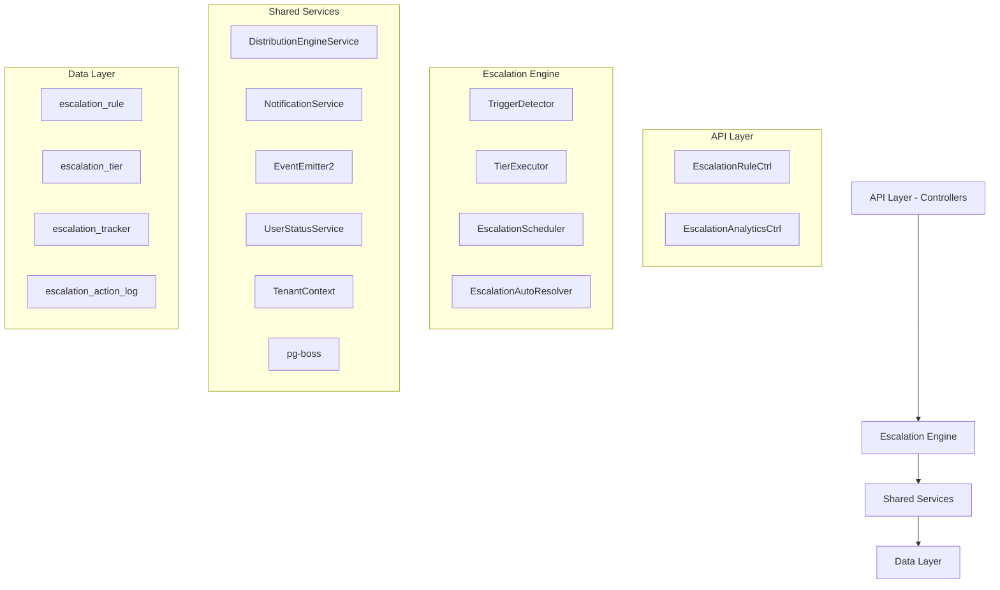

## Overview

The Escalation Module automates responses when assigned leads go stale. A scheduled engine detects trigger conditions (no first contact, went cold) and executes tiered escalation actions — notifications, temperature changes, tag additions, and redistribution to new agents.

<Info>
**Status:** Active — fully implemented  
**Module Path:** `src/modules/crm/escalation/`
</Info>

### Design Principles

The module follows these core design principles:

| Principle | Decision |
| --------- | -------- |
| pg-boss scheduling | Escalation scheduler uses pg-boss recurring job for reliability |
| Tiered actions | Rules have ordered tiers with configurable delays; actions execute in sequence |
| Auto-resolution | Events (activity, stage change, reassignment) automatically resolve active trackers |
| Idempotency | Partial unique index + `ON CONFLICT DO NOTHING` prevents duplicate trackers |
| Distribution delegation | Reassignment uses the distribution engine (`REDISTRIBUTE` action), not a separate paradigm |
| RLS compliance | All entities carry `organization_id` for row-level security |

## Architecture

### High-level diagram



### Component responsibilities

<CardGroup cols={2}>
<Card title="EscalationScheduler" icon="clock">
pg-boss recurring job that runs every 60 seconds to detect new triggers and process due escalations
</Card>

<Card title="TriggerDetector" icon="radar">
Scans leads for unmet conditions (no first contact, went cold); creates tracker records
</Card>

<Card title="TierExecutor" icon="play">
Executes escalation tier actions (notify, redistribute, change temp, add tag)
</Card>

<Card title="EscalationAutoResolver" icon="check">
Listens to domain events and resolves active trackers when conditions change
</Card>
</CardGroup>

## Entity Specifications

### EscalationRule

Defines when and how a lead should be escalated. Evaluated by `TriggerDetector`.

<CodeGroup>

```sql SQL Schema
CREATE TABLE escalation_rule (
    id uuid PRIMARY KEY DEFAULT gen_random_uuid(),
    organization_id uuid NOT NULL REFERENCES organization(id),
    name varchar NOT NULL,
    is_active boolean DEFAULT true,
    priority integer,
    trigger_type escalation_trigger_type NOT NULL,
    trigger_config jsonb,
    conditions jsonb DEFAULT '[]'::jsonb,
    respect_business_hours boolean DEFAULT true,
    created_by uuid REFERENCES "user"(id),
    created_at timestamp DEFAULT now(),
    updated_at timestamp DEFAULT now(),
    is_deleted boolean DEFAULT false
);
```

```typescript TypeScript Interface
interface EscalationRule {
  id: string;
  organizationId: string;
  name: string;
  isActive: boolean;
  priority: number;
  triggerType: 'NO_FIRST_CONTACT' | 'WENT_COLD';
  triggerConfig: {
    thresholdMinutes?: number;
    thresholdValue?: number;
    thresholdUnit?: string;
  };
  conditions: EscalationCondition[];
  respectBusinessHours: boolean;
  createdBy: string;
  createdAt: Date;
  updatedAt: Date;
  isDeleted: boolean;
}
```

</CodeGroup>

#### EscalationCondition structure

<Accordion title="Condition field mappings">

```typescript
interface EscalationCondition {
  field: 'temperature' | 'leadSource' | 'language' | 'sourceChannel';
  operator: 'eq' | 'in';
  value: string | string[];
}
```

**SQL field mapping (used by `TriggerDetector.buildApplicabilityExtraWhere`):**

| Field | SQL Column | Table | Notes |
| ----- | ---------- | ----- | ----- |
| `temperature` | `l.temperature` | lead | |
| `leadSource` | `l.lead_source` | lead | |
| `sourceChannel` | `l.source_channel` | lead | |
| `language` | `p.language` | person | Adds `LEFT JOIN person p ON p.id = l.person_id` |

</Accordion>

### EscalationTier

Each tier in an escalation rule represents a delayed action set. Tiers execute in `tier_order` sequence.

<CodeGroup>

```sql SQL Schema
CREATE TABLE escalation_tier (
    id uuid PRIMARY KEY DEFAULT gen_random_uuid(),
    escalation_rule_id uuid NOT NULL REFERENCES escalation_rule(id),
    organization_id uuid NOT NULL REFERENCES organization(id),
    tier_order integer NOT NULL,
    delay_minutes integer NOT NULL,
    actions jsonb NOT NULL DEFAULT '[]'::jsonb
);
```

```typescript TypeScript Interface
interface EscalationTier {
  id: string;
  escalationRuleId: string;
  organizationId: string;
  tierOrder: number; // 1, 2, 3... (max 10)
  delayMinutes: number;
  actions: TierAction[];
}
```

</CodeGroup>

<Note>
**Tier timing:** Tier 1 (lowest tier_order) always has `delay_minutes = 0` — threshold is the sole timing control. Subsequent tiers: minutes after the previous tier completed.
</Note>

## Type Definitions

### Tier action types

<AccordionGroup>

<Accordion title="NOTIFY_AGENT">
Sends notification to the lead's currently assigned agent.

```typescript
{
  type: 'NOTIFY_AGENT';
  parameters: {
    message?: string;
  };
}
```

**Resolution:** Uses lead's current stakeholder (assigned agent)
</Accordion>

<Accordion title="NOTIFY_ADMIN">
Sends notification to all organization administrators.

```typescript
{
  type: 'NOTIFY_ADMIN';
  parameters: {
    message?: string;
  };
}
```

**Resolution:** Self-resolving — queries all org users with the `system.admin` permission key via `UserOrgRole → RolePermission → Permission`. Skipped if no admin users found.
</Accordion>

<Accordion title="NOTIFY_TEAM_LEAD">
Sends notification to all team leaders of the lead's assigned team.

```typescript
{
  type: 'NOTIFY_TEAM_LEAD';
  parameters: {
    message?: string;
  };
}
```

**Resolution:** Self-resolving — queries all team members with the `team.admin` permission key in the lead's assigned team. Skipped if the lead has no team stakeholder or no team leaders exist.
</Accordion>

<Accordion title="REDISTRIBUTE">
Removes current stakeholders and redistributes the lead.

```typescript
{
  type: 'REDISTRIBUTE';
  parameters: {};
}
```

**Resolution:** Distribution engine delegation — removes current stakeholders, calls `DistributionEngineService.redistribute()` which re-runs the full pipeline excluding the current assignee.
</Accordion>

<Accordion title="CHANGE_TEMPERATURE">
Updates the lead's temperature.

```typescript
{
  type: 'CHANGE_TEMPERATURE';
  parameters: {
    temperature: 'HOT' | 'WARM' | 'COLD';
  };
}
```
</Accordion>

<Accordion title="ADD_TAG">
Adds a tag to the lead.

```typescript
{
  type: 'ADD_TAG';
  parameters: {
    tagName: string;
    tagColor?: string; // Default: '#6B7280'
  };
}
```
</Accordion>

</AccordionGroup>

## Escalation Engine

### Scheduler workflow

<Steps>

<Step title="Initialize pg-boss job">
The `EscalationScheduler` sets up a recurring job that runs every 60 seconds.
</Step>

<Step title="Detect triggers">
`TriggerDetector` scans leads for:
- **NO_FIRST_CONTACT:** No activity within threshold since assignment
- **WENT_COLD:** Lead went cold and stayed cold for threshold duration
</Step>

<Step title="Create trackers">
For each triggered lead, create an `EscalationTracker` record with the matched rule.
</Step>

<Step title="Execute tiers">
`TierExecutor` processes due tier executions based on timing and business hours.
</Step>

<Step title="Handle auto-resolution">
`EscalationAutoResolver` listens for domain events and resolves trackers when conditions change.
</Step>

</Steps>

### Business hours handling

<Warning>
When `respectBusinessHours = true`, tier execution timing adjusts based on organization business hours:
- If current time is outside business hours, execution delays until the next business period
- Only affects tier execution timing, not initial trigger detection
</Warning>

## API Endpoints

### Escalation rules management

<CodeGroup>

```javascript GET /escalation-rules
// List escalation rules
GET /api/v1/escalation-rules?page=1&limit=10&search=urgent

Response:
{
  "data": [
    {
      "id": "uuid",
      "name": "Urgent Lead Follow-up",
      "isActive": true,
      "triggerType": "NO_FIRST_CONTACT",
      "triggerConfig": { "thresholdMinutes": 60 },
      "conditions": [],
      "tiers": [...]
    }
  ],
  "pagination": { "page": 1, "limit": 10, "total": 25 }
}
```

```javascript POST /escalation-rules
// Create escalation rule
POST /api/v1/escalation-rules

Body:
{
  "name": "Hot Lead Escalation",
  "triggerType": "NO_FIRST_CONTACT",
  "triggerConfig": { "thresholdMinutes": 30 },
  "conditions": [
    { "field": "temperature", "operator": "eq", "value": "HOT" }
  ],
  "respectBusinessHours": true,
  "tiers": [
    {
      "tierOrder": 1,
      "delayMinutes": 0,
      "actions": [
        { "type": "NOTIFY_AGENT", "parameters": { "message": "Hot lead needs attention!" } }
      ]
    }
  ]
}
```

```javascript PUT /escalation-rules/:id
// Update escalation rule
PUT /api/v1/escalation-rules/uuid

Body: (same as POST)
```

```javascript DELETE /escalation-rules/:id
// Soft delete escalation rule
DELETE /api/v1/escalation-rules/uuid

// Cancels all active trackers for this rule
```

</CodeGroup>

### Analytics endpoints

<CodeGroup>

```javascript GET /escalation-analytics/summary
GET /api/v1/escalation-analytics/summary?period=30d

Response:
{
  "totalEscalations": 150,
  "resolvedEscalations": 120,
  "activeEscalations": 30,
  "avgResolutionTimeMinutes": 45,
  "escalationsByTrigger": {
    "NO_FIRST_CONTACT": 90,
    "WENT_COLD": 60
  }
}
```

```javascript GET /escalation-analytics/performance
GET /api/v1/escalation-analytics/performance?ruleId=uuid

Response:
{
  "ruleId": "uuid",
  "ruleName": "Hot Lead Escalation",
  "totalTriggers": 50,
  "successfulExecutions": 45,
  "failedExecutions": 2,
  "avgExecutionTimeMs": 250,
  "tierPerformance": [
    { "tierOrder": 1, "executions": 50, "failures": 0 },
    { "tierOrder": 2, "executions": 30, "failures": 1 }
  ]
}
```

</CodeGroup>

## Security & Permissions

### Required permissions

<Tabs>

<Tab title="Rule Management">
- `escalation.rule.create`
- `escalation.rule.read`
- `escalation.rule.update`
- `escalation.rule.delete`
</Tab>

<Tab title="Analytics Access">
- `escalation.analytics.read`
- `escalation.tracker.read`
</Tab>

<Tab title="System Admin">
- `system.admin` (for receiving admin notifications)
- `team.admin` (for receiving team lead notifications)
</Tab>

</Tabs>

### Row-level security (RLS)

All escalation entities include `organization_id` for RLS enforcement:

<CodeGroup>

```sql Escalation Rule Policy
CREATE POLICY escalation_rule_org_access ON escalation_rule
  FOR ALL TO authenticated
  USING (organization_id = current_setting('app.current_organization_id')::uuid);
```

```sql Escalation Tracker Policy
CREATE POLICY escalation_tracker_org_access ON escalation_tracker
  FOR ALL TO authenticated
  USING (organization_id = current_setting('app.current_organization_id')::uuid);
```

</CodeGroup>

## Analytics & Metrics

### Key performance indicators

<CardGroup cols={2}>

<Card title="Escalation Rate" icon="chart-line">
Percentage of leads that trigger escalation rules within a given period
</Card>

<Card title="Resolution Rate" icon="check-circle">
Percentage of escalations that are successfully resolved (not cancelled)
</Card>

<Card title="Time to Resolution" icon="clock">
Average time from escalation trigger to resolution
</Card>

<Card title="Action Success Rate" icon="target">
Percentage of escalation actions that execute successfully
</Card>

</CardGroup>

### Tracked events

The module tracks these events for analytics:

- **Escalation Triggered:** When a lead meets escalation criteria
- **Tier Executed:** When a tier's actions are processed
- **Action Completed:** When individual actions succeed/fail
- **Escalation Resolved:** When tracker is resolved (manual/auto)
- **Escalation Cancelled:** When rule is deactivated/deleted

## Edge Case Handling

### Common scenarios

<AccordionGroup>

<Accordion title="Business Hours Boundary">
**Scenario:** Tier is due for execution at 5:30 PM, but business hours end at 5:00 PM.

**Handling:** If `respectBusinessHours = true`, execution delays until next business day at start time. The `next_tier_due_at` is recalculated accordingly.
</Accordion>

<Accordion title="Multiple Rules Match">
**Scenario:** Lead matches multiple escalation rules simultaneously.

**Handling:** Rules are processed by `priority` (ascending). Only the first applicable rule creates a tracker due to the unique constraint on `(lead_id, escalation_rule_id)` where `resolved_at IS NULL`.
</Accordion>

<Accordion title="Redistribution Failure">
**Scenario:** `REDISTRIBUTE` action fails because no eligible agents are available.

**Handling:** Action logs the failure, but tracker continues. Next tier (if any) will still execute on schedule. Consider adding fallback notification actions.
</Accordion>

<Accordion title="Agent Deactivation">
**Scenario:** Lead's assigned agent becomes inactive between escalation trigger and execution.

**Handling:** `NOTIFY_AGENT` actions skip gracefully if target user is inactive. No error is raised, but execution is logged as "skipped."
</Accordion>

</AccordionGroup>

### Error recovery

<Warning>
**Failed Action Handling:** Individual action failures don't halt tier execution. Each action is attempted independently, and failures are logged to `escalation_action_log` with error details.
</Warning>

<Tip>
**Retry Logic:** Currently no automatic retry for failed actions. Consider implementing exponential backoff for transient failures in future iterations.
</Tip>

## Performance & Scaling

### Optimization strategies

<Steps>

<Step title="Database Indexing">
Key indexes for performance:
- `escalation_tracker (lead_id, resolved_at)` for active tracker lookups
- `escalation_rule (organization_id, is_active, priority)` for rule evaluation
- `escalation_tier (escalation_rule_id, tier_order)` for tier processing
</Step>

<Step title="Batch Processing">
The scheduler processes leads in configurable batches (default: 100) to prevent memory issues with large datasets.
</Step>

<Step title="Query Optimization">
`TriggerDetector` uses optimized queries with proper joins and WHERE clause pushdown to minimize database load.
</Step>

<Step title="Background Processing">
All escalation processing happens in background jobs (pg-boss) to avoid blocking user requests.
</Step>

</Steps>

### Scaling considerations

<Note>
**Horizontal Scaling:** Multiple application instances can safely run the escalation scheduler. pg-boss handles job distribution and prevents duplicate processing.
</Note>

<Check>
**Recommended limits:**
- Maximum 50 escalation rules per organization
- Maximum 10 tiers per rule  
- Maximum 1000 active escalation trackers per organization
</Check>

## Module Structure

### File organization

```
src/modules/crm/escalation/
├── controllers/
│   ├── escalation-rule.controller.ts
│   └── escalation-analytics.controller.ts
├── services/
│   ├── escalation-rule.service.ts
│   ├── escalation-scheduler.service.ts
│   ├── trigger-detector.service.ts
│   ├── tier-executor.service.ts
│   └── escalation-auto-resolver.service.ts
├── entities/
│   ├── escalation-rule.entity.ts
│   ├── escalation-tier.entity.ts
│   ├── escalation-tracker.entity.ts
│   └── escalation-action-log.entity.ts
├── types/
│   └── escalation.types.ts
└── escalation.module.ts
```

### Integration points

<CardGroup cols={2}>

<Card title="Distribution Engine" icon="share">
Used for `REDISTRIBUTE` actions to reassign leads to new agents
</Card>

<Card title="Notification Service" icon="bell">
Handles all notification delivery for escalation actions
</Card>

<Card title="Activity Tracking" icon="activity">
Monitors lead activities to determine escalation triggers and auto-resolution
</Card>

<Card title="Business Hours" icon="calendar">
Integrates with organization business hours for timing calculations
</Card>

</CardGroup>

---

<Info>
This specification covers the complete Escalation Module implementation. For implementation details, refer to the source code in `src/modules/crm/escalation/`.
</Info>