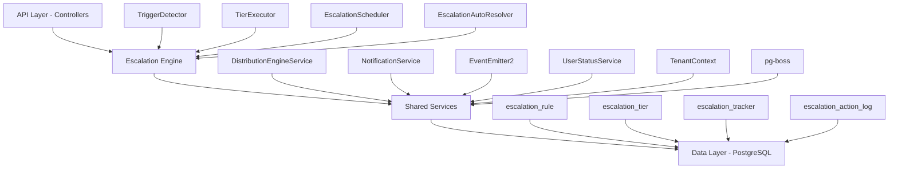

<Note>
**Status:** Active — fully implemented  
**Module Path:** `src/modules/crm/escalation/`
</Note>

## Overview

The Escalation Module automates responses when assigned leads go stale. A scheduled engine detects trigger conditions (no first contact, went cold) and executes tiered escalation actions — notifications, temperature changes, tag additions, and redistribution to new agents.

### Design Principles

| Principle | Decision |
|-----------|----------|
| pg-boss scheduling | Escalation scheduler uses pg-boss recurring job for reliability |
| Tiered actions | Rules have ordered tiers with configurable delays; actions execute in sequence |
| Auto-resolution | Events (activity, stage change, reassignment) automatically resolve active trackers |
| Idempotency | Partial unique index + `ON CONFLICT DO NOTHING` prevents duplicate trackers |
| Distribution delegation | Reassignment uses the distribution engine (`REDISTRIBUTE` action), not a separate paradigm |
| RLS compliance | All entities carry `organization_id` for row-level security |

## Architecture

### High-level diagram



### Component responsibilities

<AccordionGroup>
<Accordion title="EscalationScheduler">
pg-boss recurring job that runs every 60 seconds to detect new triggers and process due escalations
</Accordion>

<Accordion title="TriggerDetector">
Scans leads for unmet conditions (no first contact, went cold); creates tracker records
</Accordion>

<Accordion title="TierExecutor">
Executes escalation tier actions (notify, redistribute, change temp, add tag)
</Accordion>

<Accordion title="EscalationAutoResolver">
Listens to domain events and resolves active trackers when conditions change
</Accordion>

<Accordion title="EscalationRuleService">
CRUD for escalation rules; handles tracker cancellation on deactivation/deletion
</Accordion>
</AccordionGroup>

## Entity Specifications

### EscalationRule

Defines when and how a lead should be escalated. Evaluated by `TriggerDetector`.

| Column | Type | Notes |
|--------|------|-------|
| id | uuid PK | |
| organization_id | uuid FK | RLS |
| name | varchar | Human-readable rule name |
| is_active | bool | default true |
| priority | int | Evaluation order |
| trigger_type | enum | `NO_FIRST_CONTACT`, `WENT_COLD` |
| trigger_config | jsonb | `{thresholdMinutes?, thresholdValue?, thresholdUnit?}` |
| conditions | jsonb | `EscalationCondition[]` — AND-joined applicability filters; `[]` = all leads |
| respect_business_hours | bool | default true. References org business hours schedule. |
| created_by | uuid FK | |
| created_at, updated_at | timestamp | |
| is_deleted | bool | soft delete |

<Info>
**EscalationCondition shape:**
```typescript
interface EscalationCondition {
  field: 'temperature' | 'leadSource' | 'language' | 'sourceChannel';
  operator: 'eq' | 'in';
  value: string | string[];
}
```
</Info>

#### SQL field mapping

Used by `TriggerDetector.buildApplicabilityExtraWhere`:

| Field | SQL Column | Table | Notes |
|-------|------------|-------|-------|
| `temperature` | `l.temperature` | lead | |
| `leadSource` | `l.lead_source` | lead | |
| `sourceChannel` | `l.source_channel` | lead | |
| `language` | `p.languages` | person | Adds `LEFT JOIN person p ON p.id = l.person_id`; matches JSONB entries by `languages[].code` |

### EscalationTier

Each tier in an escalation rule represents a delayed action set. Tiers execute in `tier_order` sequence.

| Column | Type | Notes |
|--------|------|-------|
| id | uuid PK | |
| escalation_rule_id | uuid FK | |
| organization_id | uuid FK | RLS |
| tier_order | int | 1, 2, 3... (max 10) |
| delay_minutes | int | Tier 1 (lowest tier_order): always 0 — threshold is the sole timing control. Subsequent tiers: minutes after the previous tier completed. |
| actions | jsonb | `TierAction[]` — see Tier Actions below |

#### Tier action types

<Tabs>
<Tab title="NOTIFY_AGENT">
**Parameters:** `message?: string`

**Resolution:** From lead's current stakeholder (assigned agent)
</Tab>

<Tab title="NOTIFY_ADMIN">
**Parameters:** `message?: string`

**Resolution:** Self-resolving — queries all org users with the `system.admin` permission key via `UserOrgRole → RolePermission → Permission`. Skipped if no admin users found.
</Tab>

<Tab title="NOTIFY_TEAM_LEAD">
**Parameters:** `message?: string`

**Resolution:** Self-resolving — queries all team members with the `team.admin` permission key in the lead's assigned team. Skipped if the lead has no team stakeholder or no team leaders exist. Notifies ALL team leaders.
</Tab>

<Tab title="REDISTRIBUTE">
**Parameters:** _(no params)_

**Resolution:** Distribution engine delegation — removes current stakeholders, calls `DistributionEngineService.redistribute()` which re-runs the full pipeline excluding the current assignee. A `distribution_log` entry with `distributionMethod: 'REDISTRIBUTION'` is written.
</Tab>
</Tabs>

### EscalationTracker

Active escalation state for a lead + rule combination.

| Column | Type | Notes |
|--------|------|-------|
| id | uuid PK | |
| lead_id | uuid FK | |
| escalation_rule_id | uuid FK | |
| organization_id | uuid FK | RLS |
| status | enum | `ACTIVE`, `RESOLVED`, `CANCELLED` |
| current_tier | int | Current tier being processed (1-based) |
| triggered_at | timestamp | When escalation started |
| next_due_at | timestamp | When next tier should execute |
| resolved_at | timestamp | When tracker was resolved/cancelled |
| resolution_reason | varchar | `ACTIVITY_DETECTED`, `STAGE_CHANGED`, `REASSIGNED`, etc. |

<Warning>
**Unique constraint:** `(lead_id, escalation_rule_id, status)` where `status = 'ACTIVE'` ensures one active tracker per lead+rule.
</Warning>

### EscalationActionLog

Audit trail of executed escalation actions.

| Column | Type | Notes |
|--------|------|-------|
| id | uuid PK | |
| escalation_tracker_id | uuid FK | |
| organization_id | uuid FK | RLS |
| tier_order | int | Which tier this action belonged to |
| action_type | enum | `NOTIFY_AGENT`, `NOTIFY_ADMIN`, `REDISTRIBUTE`, etc. |
| action_config | jsonb | Original action configuration |
| status | enum | `SUCCESS`, `FAILED`, `SKIPPED` |
| error_message | text | If status = FAILED |
| metadata | jsonb | Action-specific results (notification IDs, etc.) |
| executed_at | timestamp | |

## Type Definitions

<CodeGroup>
```typescript Enums
enum EscalationTriggerType {
  NO_FIRST_CONTACT = 'NO_FIRST_CONTACT',
  WENT_COLD = 'WENT_COLD'
}

enum EscalationStatus {
  ACTIVE = 'ACTIVE',
  RESOLVED = 'RESOLVED', 
  CANCELLED = 'CANCELLED'
}

enum TierActionType {
  NOTIFY_AGENT = 'NOTIFY_AGENT',
  NOTIFY_ADMIN = 'NOTIFY_ADMIN',
  NOTIFY_TEAM_LEAD = 'NOTIFY_TEAM_LEAD',
  REDISTRIBUTE = 'REDISTRIBUTE',
  CHANGE_TEMPERATURE = 'CHANGE_TEMPERATURE',
  ADD_TAG = 'ADD_TAG'
}

enum ActionLogStatus {
  SUCCESS = 'SUCCESS',
  FAILED = 'FAILED',
  SKIPPED = 'SKIPPED'
}
```

```typescript Interfaces
interface TierAction {
  type: TierActionType;
  config?: {
    message?: string;
    temperature?: LeadTemperature;
    tagName?: string;
  };
}

interface EscalationCondition {
  field: 'temperature' | 'leadSource' | 'language' | 'sourceChannel';
  operator: 'eq' | 'in';
  value: string | string[];
}

interface TriggerConfig {
  thresholdMinutes?: number;
  thresholdValue?: number;
  thresholdUnit?: 'minutes' | 'hours' | 'days';
}
```
</CodeGroup>

## Escalation Engine

### EscalationScheduler

<Steps>
<Step title="Initialize pg-boss job">
Registers recurring job `escalation-processor` with 60-second interval
</Step>

<Step title="Process triggers">
- Calls `TriggerDetector.detectAndCreateTrackers()`
- Processes all organizations with active escalation rules
</Step>

<Step title="Execute due tiers">
- Calls `TierExecutor.processDueTiers()`
- Executes actions for trackers where `next_due_at <= now`
</Step>

<Step title="Handle errors">
Logs errors but continues processing other trackers
</Step>
</Steps>

### TriggerDetector

Scans for leads that meet escalation trigger conditions and creates tracker records.

<Tabs>
<Tab title="NO_FIRST_CONTACT">
**Query logic:**
- Lead has stakeholder (assigned)
- No activities with `type IN ('CALL', 'EMAIL', 'SMS', 'MEETING')`
- Assignment age >= threshold
- No active tracker for this rule

**Threshold calculation:**
```sql
l.stakeholder_assigned_at <= NOW() - INTERVAL '{thresholdMinutes} minutes'
```
</Tab>

<Tab title="WENT_COLD">
**Query logic:**
- Lead has stakeholder (assigned)  
- Has previous contact activities
- Most recent activity age >= threshold
- Temperature changed from warm/hot to cold
- No active tracker for this rule

**Threshold calculation:**
```sql
last_activity_at <= NOW() - INTERVAL '{thresholdMinutes} minutes'
```
</Tab>
</Tabs>

### TierExecutor

Executes actions for escalation trackers where `next_due_at <= NOW()`.

<Steps>
<Step title="Load due trackers">
Query trackers with `status = 'ACTIVE'` and `next_due_at <= NOW()`
</Step>

<Step title="Execute tier actions">
For each tracker, execute all actions in the current tier
</Step>

<Step title="Log action results">
Create `EscalationActionLog` entries for each action
</Step>

<Step title="Advance or complete">
- If more tiers exist: advance to next tier, set `next_due_at`
- If last tier: mark tracker as `RESOLVED`
</Step>
</Steps>

### EscalationAutoResolver

Event-driven component that automatically resolves active trackers when conditions change.

<Note>
**Monitored events:**
- `lead.activity.created` - Activity detected
- `lead.stage.changed` - Stage progression  
- `lead.stakeholder.assigned` - Lead reassigned
- `lead.stakeholder.unassigned` - Lead unassigned
</Note>

## API Endpoints

### Escalation Rules

<CodeGroup>
```http GET /api/escalation/rules
GET /api/escalation/rules

Query Parameters:
- page?: number
- limit?: number  
- search?: string
- isActive?: boolean
- triggerType?: EscalationTriggerType

Response:
{
  data: EscalationRule[],
  meta: { total, page, limit }
}
```

```http POST /api/escalation/rules
POST /api/escalation/rules

Body:
{
  name: string,
  triggerType: EscalationTriggerType,
  triggerConfig: TriggerConfig,
  conditions?: EscalationCondition[],
  respectBusinessHours?: boolean,
  tiers: {
    tierOrder: number,
    delayMinutes: number,
    actions: TierAction[]
  }[]
}
```

```http PUT /api/escalation/rules/:id
PUT /api/escalation/rules/:id

Body: (same as POST)

Note: Updates cancel active trackers for the rule
```

```http DELETE /api/escalation/rules/:id  
DELETE /api/escalation/rules/:id

Note: Soft delete, cancels active trackers
```
</CodeGroup>

### Escalation Analytics

<CodeGroup>
```http GET /api/escalation/analytics/overview
GET /api/escalation/analytics/overview

Query Parameters:
- startDate?: ISO string
- endDate?: ISO string
- ruleIds?: uuid[]

Response:
{
  totalTriggered: number,
  totalResolved: number,
  averageResolutionMinutes: number,
  ruleBreakdown: {
    ruleId: uuid,
    ruleName: string,
    triggered: number,
    resolved: number
  }[]
}
```

```http GET /api/escalation/analytics/action-effectiveness
GET /api/escalation/analytics/action-effectiveness

Response:
{
  byActionType: {
    actionType: TierActionType,
    totalExecuted: number,
    successRate: number,
    averageResolutionMinutes: number
  }[]
}
```
</CodeGroup>

### Active Trackers

<CodeGroup>
```http GET /api/escalation/trackers
GET /api/escalation/trackers

Query Parameters:
- leadId?: uuid
- ruleId?: uuid
- status?: EscalationStatus
- page?: number
- limit?: number

Response:
{
  data: EscalationTracker[],
  meta: { total, page, limit }
}
```

```http POST /api/escalation/trackers/:id/resolve
POST /api/escalation/trackers/:id/resolve

Body:
{
  reason: string
}

Response:
{
  success: boolean,
  tracker: EscalationTracker
}
```
</CodeGroup>

## Security & Permissions

### Required Permissions

| Operation | Permission Key | Notes |
|-----------|---------------|-------|
| View rules | `escalation.rule.read` | Can list and view escalation rules |
| Create rules | `escalation.rule.create` | Can create new escalation rules |
| Edit rules | `escalation.rule.update` | Can modify existing rules |
| Delete rules | `escalation.rule.delete` | Can soft-delete rules |
| View analytics | `escalation.analytics.read` | Can access escalation metrics |
| Manage trackers | `escalation.tracker.manage` | Can manually resolve trackers |

### Row Level Security (RLS)

All escalation entities include `organization_id` for RLS enforcement:

<CodeGroup>
```sql RLS Policies
-- Escalation rules
CREATE POLICY escalation_rule_tenant_isolation ON escalation_rule
USING (organization_id = current_setting('app.current_organization_id')::uuid);

-- Escalation tiers  
CREATE POLICY escalation_tier_tenant_isolation ON escalation_tier
USING (organization_id = current_setting('app.current_organization_id')::uuid);

-- Escalation trackers
CREATE POLICY escalation_tracker_tenant_isolation ON escalation_tracker  
USING (organization_id = current_setting('app.current_organization_id')::uuid);

-- Escalation action logs
CREATE POLICY escalation_action_log_tenant_isolation ON escalation_action_log
USING (organization_id = current_setting('app.current_organization_id')::uuid);
```
</CodeGroup>

## Analytics & Metrics

### Tracked Metrics

<CardGroup cols={2}>
<Card title="Trigger Metrics" icon="chart-line">
- Total escalations triggered
- Triggers by rule and time period
- Most common trigger conditions
</Card>

<Card title="Resolution Metrics" icon="check-circle">
- Resolution rates by rule
- Average resolution time
- Resolution reasons breakdown
</Card>

<Card title="Action Effectiveness" icon="target">
- Success rates by action type
- Most effective action combinations
- Failed action analysis
</Card>

<Card title="Performance Metrics" icon="gauge">
- Scheduler execution time
- Queue processing delays
- Error rates by component
</Card>
</CardGroup>

### Analytics Queries

<CodeGroup>
```sql Escalation Overview
SELECT 
  er.name as rule_name,
  COUNT(et.*) as total_triggered,
  COUNT(et.*) FILTER (WHERE et.status = 'RESOLVED') as total_resolved,
  AVG(EXTRACT(EPOCH FROM (et.resolved_at - et.triggered_at))/60) as avg_resolution_minutes
FROM escalation_tracker et
JOIN escalation_rule er ON er.id = et.escalation_rule_id  
WHERE et.triggered_at >= :startDate 
  AND et.triggered_at <= :endDate
  AND et.organization_id = :orgId
GROUP BY er.id, er.name;
```

```sql Action Effectiveness
SELECT 
  eal.action_type,
  COUNT(*) as total_executed,
  COUNT(*) FILTER (WHERE eal.status = 'SUCCESS') * 100.0 / COUNT(*) as success_rate,
  AVG(EXTRACT(EPOCH FROM (et.resolved_at - eal.executed_at))/60) as avg_resolution_minutes
FROM escalation_action_log eal
JOIN escalation_tracker et ON et.id = eal.escalation_tracker_id
WHERE eal.executed_at >= :startDate
  AND eal.executed_at <= :endDate  
  AND eal.organization_id = :orgId
  AND et.status = 'RESOLVED'
GROUP BY eal.action_type;
```
</CodeGroup>

## Edge Case Handling

### Business Hours Respect

<Warning>
When `respect_business_hours = true`, tier execution is delayed until the organization's next business day if due time falls outside business hours.
</Warning>

<Steps>
<Step title="Check business hours">
Query organization's business hours configuration
</Step>

<Step title="Calculate next business time">
If current time is outside business hours, calculate next valid business time
</Step>

<Step title="Adjust due time">
Set `next_due_at` to the next business time instead of immediate execution
</Step>
</Steps>

### Multiple Rule Conflicts

When multiple rules could trigger for the same lead:

<Tabs>
<Tab title="Priority Resolution">
Rules are evaluated in `priority` order (lower number = higher priority). Only the first matching rule creates a tracker.
</Tab>

<Tab title="Condition Evaluation">
All `conditions` must match for a rule to be considered applicable (AND logic).
</Tab>

<Tab title="Active Tracker Prevention">
The unique constraint on `(lead_id, escalation_rule_id, status='ACTIVE')` prevents duplicate trackers.
</Tab>
</Tabs>

### Failed Actions

<Info>
Failed actions are logged but don't stop tier progression. The tier advances to the next one according to schedule.
</Info>

Common failure scenarios:
- **Notification failures**: Invalid user, disabled notifications
- **Redistribution failures**: No available agents, distribution rules not met
- **Permission failures**: Insufficient permissions for action execution

## Performance & Scaling

### Optimization Strategies

<CardGroup cols={2}>
<Card title="Database Indexes" icon="database">
```sql
-- Trigger detection optimization
CREATE INDEX idx_escalation_trigger_detection 
ON lead (stakeholder_assigned_at, temperature, organization_id)
WHERE stakeholder_assigned_at IS NOT NULL;

-- Due tier processing
CREATE INDEX idx_escalation_due_processing
ON escalation_tracker (next_due_at, status, organization_id)
WHERE status = 'ACTIVE';
```
</Card>

<Card title="Batch Processing" icon="layer-group">
- Process trackers in batches of 100
- Parallel execution per organization
- Connection pooling for database access
- Async action execution
</Card>
</CardGroup>

### Performance Monitoring

<Steps>
<Step title="Scheduler Metrics">
Track execution time and frequency of the escalation scheduler job
</Step>

<Step title="Query Performance">
Monitor slow queries in trigger detection and tier processing
</Step>

<Step title="Action Latency">
Measure time between tier due time and actual execution
</Step>

<Step title="Error Rates">
Track failure rates for different action types and components
</Step>
</Steps>

## Module Structure

```
src/modules/crm/escalation/
├── entities/
│   ├── escalation-rule.entity.ts
│   ├── escalation-tier.entity.ts
│   ├── escalation-tracker.entity.ts
│   └── escalation-action-log.entity.ts
├── services/
│   ├── escalation-rule.service.ts
│   ├── escalation-engine.service.ts
│   ├── trigger-detector.service.ts
│   ├── tier-executor.service.ts
│   └── escalation-auto-resolver.service.ts
├── controllers/
│   ├── escalation-rule.controller.ts
│   └── escalation-analytics.controller.ts
├── dto/
│   ├── create-escalation-rule.dto.ts
│   ├── update-escalation-rule.dto.ts
│   └── escalation-analytics.dto.ts
└── escalation.module.ts
```

## Integration Points

### External Dependencies

<AccordionGroup>
<Accordion title="Distribution Engine">
**Purpose**: Lead redistribution via `REDISTRIBUTE` action  
**Interface**: `DistributionEngineService.redistribute(leadId, options)`  
**Dependency**: `src/modules/crm/distribution/`
</Accordion>

<Accordion title="Notification Service">
**Purpose**: Send escalation notifications to users  
**Interface**: `NotificationService.sendEscalationNotification(userIds, message)`  
**Dependency**: `src/modules/notifications/`
</Accordion>

<Accordion title="Business Hours Service">
**Purpose**: Respect organization business hours for tier execution  
**Interface**: `BusinessHoursService.getNextBusinessTime(orgId, timestamp)`  
**Dependency**: `src/modules/organizations/`
</Accordion>

<Accordion title="Activity Service">
**Purpose**: Query lead activities for trigger detection  
**Interface**: `ActivityService.getLeadActivities(leadId, types)`  
**Dependency**: `src/modules/crm/activities/`
</Accordion>
</AccordionGroup>

### Event Integration

<Tabs>
<Tab title="Published Events">
```typescript
// When tracker is created
eventEmitter.emit('escalation.tracker.created', {
  trackerId: uuid,
  leadId: uuid,
  ruleId: uuid,
  organizationId: uuid
});

// When tier is executed  
eventEmitter.emit('escalation.tier.executed', {
  trackerId: uuid,
  tierOrder: number,
  actions: TierAction[],
  results: ActionResult[]
});

// When tracker is resolved
eventEmitter.emit('escalation.tracker.resolved', {
  trackerId: uuid,
  reason: string,
  resolvedAt: Date
});
```
</Tab>

<Tab title="Consumed Events">
```typescript
// Auto-resolution triggers
@OnEvent('lead.activity.created')
@OnEvent('lead.stage.changed') 
@OnEvent('lead.stakeholder.assigned')
@OnEvent('lead.stakeholder.unassigned')
async handleLeadEvent(payload: LeadEventPayload) {
  await this.escalationAutoResolver.resolveTrackersForLead(payload.leadId);
}
```
</Tab>
</Tabs>

<Tip>
The escalation module is designed to be self-contained with clear interfaces to other system components. All external dependencies are injected via services, making the module easily testable and maintainable.
</Tip>