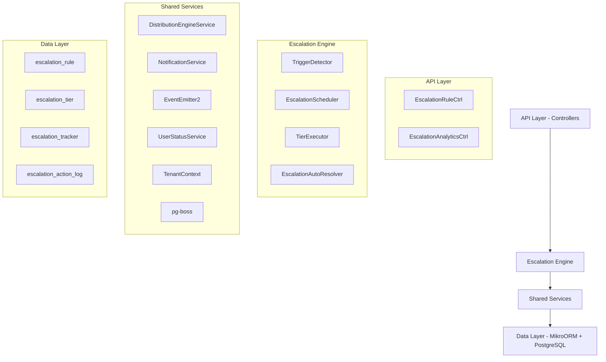

## Overview

The Escalation Module automates responses when assigned leads go stale. A scheduled engine detects trigger conditions (no first contact, went cold) and executes tiered escalation actions — notifications, temperature changes, tag additions, and redistribution to new agents.

### Design Principles

| Principle | Decision |
| --- | --- |
| pg-boss scheduling | Escalation scheduler uses pg-boss recurring job for reliability |
| Tiered actions | Rules have ordered tiers with configurable delays; actions execute in sequence |
| Auto-resolution | Events (activity, stage change, reassignment) automatically resolve active trackers |
| Idempotency | Partial unique index + `ON CONFLICT DO NOTHING` prevents duplicate trackers |
| Distribution delegation | Reassignment uses the distribution engine (`REDISTRIBUTE` action), not a separate paradigm |
| RLS compliance | All entities carry `organization_id` for row-level security |

<Note>
**Module Status:** Active — fully implemented  
**Module Path:** `src/modules/crm/escalation/`
</Note>

## Architecture

### High-Level Diagram



### Component Responsibilities

<AccordionGroup>
<Accordion title="EscalationScheduler">
pg-boss recurring job that runs every 60 seconds to detect new triggers and process due escalations
</Accordion>

<Accordion title="TriggerDetector">
Scans leads for unmet conditions (no first contact, went cold); creates tracker records
</Accordion>

<Accordion title="TierExecutor">
Executes escalation tier actions (notify, redistribute, change temp, add tag)
</Accordion>

<Accordion title="EscalationAutoResolver">
Listens to domain events and resolves active trackers when conditions change
</Accordion>

<Accordion title="EscalationRuleService">
CRUD for escalation rules; handles tracker cancellation on deactivation/deletion
</Accordion>
</AccordionGroup>

## Entity Specifications

### EscalationRule

Defines when and how a lead should be escalated. Evaluated by `TriggerDetector`.

| Column | Type | Notes |
| --- | --- | --- |
| id | uuid PK | |
| organization_id | uuid FK | RLS |
| name | varchar | Human-readable rule name |
| is_active | bool | default true |
| priority | int | Evaluation order |
| trigger_type | enum | `NO_FIRST_CONTACT`, `WENT_COLD` |
| trigger_config | jsonb | `{thresholdMinutes?, thresholdValue?, thresholdUnit?}` |
| conditions | jsonb | `EscalationCondition[]` — AND-joined applicability filters; `[]` = all leads |
| respect_business_hours | bool | default true. References org business hours schedule. |
| created_by | uuid FK | |
| created_at, updated_at | timestamp | |
| is_deleted | bool | soft delete |

<Info>
**EscalationCondition shape:**
```typescript
interface EscalationCondition {
  field: 'temperature' | 'leadSource' | 'language' | 'sourceChannel';
  operator: 'eq' | 'in';
  value: string | string[];
}
```
</Info>

#### SQL Field Mapping

Used by `TriggerDetector.buildApplicabilityExtraWhere`:

| Field | SQL Column | Table | Notes |
| --- | --- | --- | --- |
| `temperature` | `l.temperature` | lead | |
| `leadSource` | `l.lead_source` | lead | |
| `sourceChannel` | `l.source_channel` | lead | |
| `language` | `p.language` | person | Adds `LEFT JOIN person p ON p.id = l.person_id` |

### EscalationTier

Each tier in an escalation rule represents a delayed action set. Tiers execute in `tier_order` sequence.

| Column | Type | Notes |
| --- | --- | --- |
| id | uuid PK | |
| escalation_rule_id | uuid FK | |
| organization_id | uuid FK | RLS |
| tier_order | int | 1, 2, 3... (max 10) |
| delay_minutes | int | Tier 1: always 0. Subsequent tiers: minutes after previous tier completed. |
| actions | jsonb | `TierAction[]` |

<Warning>
**Tier 1 Delay:** The first tier (lowest tier_order) always has `delay_minutes = 0` — the threshold is the sole timing control. Subsequent tiers specify minutes after the previous tier completed.
</Warning>

#### Tier Action Types

<Tabs>
<Tab title="Notification Actions">
| Action Type | Parameters | Resolution |
| --- | --- | --- |
| `NOTIFY_AGENT` | `message?: string` | Resolved from lead's current stakeholder (assigned agent) |
| `NOTIFY_ADMIN` | `message?: string` | Self-resolving — queries all org users with `system.admin` permission |
| `NOTIFY_TEAM_LEAD` | `message?: string` | Self-resolving — queries team members with `team.admin` permission |
</Tab>

<Tab title="Lead Modification Actions">
| Action Type | Parameters | Resolution |
| --- | --- | --- |
| `REDISTRIBUTE` | _(no params)_ | Delegates to distribution engine; removes current stakeholders |
| `CHANGE_TEMPERATURE` | `temperature: LeadTemperature` | Updates lead temperature directly |
| `ADD_TAG` | `tagName: string` | Adds tag to lead if not already present |
</Tab>
</Tabs>

### EscalationTracker

Tracks the lifecycle of an escalation for a specific lead-rule pairing.

| Column | Type | Notes |
| --- | --- | --- |
| id | uuid PK | |
| organization_id | uuid FK | RLS |
| lead_id | uuid FK | |
| escalation_rule_id | uuid FK | |
| trigger_type | enum | Copy from rule for historical tracking |
| status | enum | `ACTIVE`, `COMPLETED`, `CANCELLED`, `RESOLVED` |
| current_tier_order | int | Next tier to execute (1-based) |
| next_execution_at | timestamp | When next tier should execute |
| triggered_at | timestamp | When escalation was first triggered |
| completed_at | timestamp | When all tiers completed |
| resolved_at | timestamp | When auto-resolved |
| resolved_by | enum | `ACTIVITY_DETECTED`, `STAGE_CHANGED`, `REASSIGNED`, `REDISTRIBUTED` |
| created_at, updated_at | timestamp | |

<Note>
**Unique Constraint:** `(lead_id, escalation_rule_id)` WHERE `status IN ('ACTIVE', 'COMPLETED')` prevents duplicate active trackers.
</Note>

### EscalationActionLog

Immutable audit trail of executed escalation actions.

| Column | Type | Notes |
| --- | --- | --- |
| id | uuid PK | |
| organization_id | uuid FK | RLS |
| escalation_tracker_id | uuid FK | |
| tier_order | int | Which tier executed this action |
| action_type | enum | Type of action executed |
| action_config | jsonb | Action parameters used |
| execution_result | jsonb | Success/failure details |
| executed_at | timestamp | When action was executed |

## Type Definitions

### Core Enums

<CodeGroup>
```typescript EscalationTriggerType
export enum EscalationTriggerType {
  NO_FIRST_CONTACT = 'NO_FIRST_CONTACT',
  WENT_COLD = 'WENT_COLD'
}
```

```typescript EscalationStatus
export enum EscalationStatus {
  ACTIVE = 'ACTIVE',
  COMPLETED = 'COMPLETED', 
  CANCELLED = 'CANCELLED',
  RESOLVED = 'RESOLVED'
}
```

```typescript EscalationResolvedBy
export enum EscalationResolvedBy {
  ACTIVITY_DETECTED = 'ACTIVITY_DETECTED',
  STAGE_CHANGED = 'STAGE_CHANGED', 
  REASSIGNED = 'REASSIGNED',
  REDISTRIBUTED = 'REDISTRIBUTED'
}
```

```typescript TierActionType
export enum TierActionType {
  NOTIFY_AGENT = 'NOTIFY_AGENT',
  NOTIFY_ADMIN = 'NOTIFY_ADMIN',
  NOTIFY_TEAM_LEAD = 'NOTIFY_TEAM_LEAD',
  REDISTRIBUTE = 'REDISTRIBUTE',
  CHANGE_TEMPERATURE = 'CHANGE_TEMPERATURE',
  ADD_TAG = 'ADD_TAG'
}
```
</CodeGroup>

## Escalation Engine

### EscalationScheduler

<Steps>
<Step title="Job Registration">
Registers a recurring pg-boss job named `escalation-processing` that runs every 60 seconds
</Step>

<Step title="Trigger Detection">
Calls `TriggerDetector.detectAndCreateTrackers()` to scan for new escalation triggers
</Step>

<Step title="Tier Execution">
Calls `TierExecutor.processDueEscalations()` to execute ready escalation tiers
</Step>

<Step title="Error Handling">
Uses exponential backoff for failed executions; logs errors but continues processing
</Step>
</Steps>

### TriggerDetector

Scans leads for conditions that should trigger escalations.

#### NO_FIRST_CONTACT Detection

```sql
-- Finds leads assigned to agents but with no completed activities
SELECT l.id, l.organization_id, l.assigned_at, r.id as rule_id, r.trigger_config
FROM lead l
INNER JOIN lead_stakeholder ls ON ls.lead_id = l.id 
  AND ls.stakeholder_type = 'ASSIGNED_AGENT'
  AND ls.is_active = true
INNER JOIN escalation_rule r ON r.organization_id = l.organization_id
  AND r.is_active = true 
  AND r.trigger_type = 'NO_FIRST_CONTACT'
LEFT JOIN escalation_tracker et ON et.lead_id = l.id 
  AND et.escalation_rule_id = r.id
  AND et.status IN ('ACTIVE', 'COMPLETED')
LEFT JOIN activity a ON a.lead_id = l.id 
  AND a.status = 'COMPLETED'
WHERE l.organization_id = $1
  AND l.stage != 'ARCHIVED'
  AND l.assigned_at <= (NOW() - INTERVAL '1 minute' * (r.trigger_config->>'thresholdMinutes')::int)
  AND et.id IS NULL  -- No existing tracker
  AND a.id IS NULL   -- No completed activities
```

<Tip>
The query excludes leads that already have active or completed escalation trackers to prevent duplicates.
</Tip>

#### WENT_COLD Detection

```sql
-- Finds leads with no recent activities based on threshold
SELECT l.id, l.organization_id, last_activity.completed_at, r.id as rule_id
FROM lead l
INNER JOIN escalation_rule r ON r.organization_id = l.organization_id
  AND r.is_active = true 
  AND r.trigger_type = 'WENT_COLD'
LEFT JOIN escalation_tracker et ON et.lead_id = l.id 
  AND et.escalation_rule_id = r.id
  AND et.status IN ('ACTIVE', 'COMPLETED')
LEFT JOIN LATERAL (
  SELECT completed_at
  FROM activity 
  WHERE lead_id = l.id AND status = 'COMPLETED'
  ORDER BY completed_at DESC 
  LIMIT 1
) last_activity ON true
WHERE l.organization_id = $1
  AND l.stage != 'ARCHIVED'
  AND et.id IS NULL
  AND last_activity.completed_at <= threshold_timestamp
```

### TierExecutor

Processes escalation trackers that have reached their execution time.

<Steps>
<Step title="Query Due Trackers">
Finds trackers where `next_execution_at <= NOW()` and `status = 'ACTIVE'`
</Step>

<Step title="Execute Tier Actions">
For each action in the tier, calls the appropriate action handler
</Step>

<Step title="Update Tracker Status">
- If more tiers exist: updates `current_tier_order` and `next_execution_at`
- If final tier: sets `status = 'COMPLETED'` and `completed_at`
</Step>

<Step title="Log Actions">
Creates `EscalationActionLog` entries for audit trail
</Step>
</Steps>

#### Action Execution

<Tabs>
<Tab title="NOTIFY_AGENT">
```typescript
async executeNotifyAgent(tracker: EscalationTracker, action: TierAction) {
  const assignedAgent = await this.getAssignedAgent(tracker.lead_id);
  if (!assignedAgent) {
    return { success: false, reason: 'No assigned agent' };
  }
  
  await this.notificationService.create({
    recipientId: assignedAgent.id,
    type: 'ESCALATION_ALERT',
    title: 'Lead Escalation Alert',
    message: action.message || 'A lead requires your attention',
    leadId: tracker.lead_id
  });
  
  return { success: true, recipientId: assignedAgent.id };
}
```
</Tab>

<Tab title="REDISTRIBUTE">
```typescript
async executeRedistribute(tracker: EscalationTracker) {
  // Remove current stakeholders
  await this.leadStakeholderService.removeAllStakeholders(tracker.lead_id);
  
  // Call distribution engine
  const result = await this.distributionEngine.redistribute(tracker.lead_id);
  
  if (result.outcome === 'ASSIGNED') {
    // Auto-resolve tracker since lead is now reassigned
    await this.resolveTracker(tracker.id, EscalationResolvedBy.REDISTRIBUTED);
  }
  
  return { success: true, distributionResult: result };
}
```
</Tab>

<Tab title="CHANGE_TEMPERATURE">
```typescript
async executeChangeTemperature(tracker: EscalationTracker, action: TierAction) {
  await this.leadService.updateTemperature(tracker.lead_id, action.temperature);
  return { success: true, newTemperature: action.temperature };
}
```
</Tab>
</Tabs>

### EscalationAutoResolver

Listens to domain events and automatically resolves active escalation trackers when conditions change.

#### Event Listeners

<AccordionGroup>
<Accordion title="Activity Completed">
```typescript
@OnEvent('lead.activity.completed')
async onActivityCompleted(event: ActivityCompletedEvent) {
  await this.resolveActiveTrackers(
    event.leadId, 
    EscalationResolvedBy.ACTIVITY_DETECTED
  );
}
```

Resolves escalations when any activity is completed on the lead.
</Accordion>

<Accordion title="Lead Stage Changed">
```typescript
@OnEvent('lead.stage.changed')
async onLeadStageChanged(event: LeadStageChangedEvent) {
  await this.resolveActiveTrackers(
    event.leadId, 
    EscalationResolvedBy.STAGE_CHANGED
  );
}
```

Resolves escalations when lead stage changes (typically indicates progression).
</Accordion>

<Accordion title="Lead Reassigned">
```typescript
@OnEvent('lead.stakeholder.assigned')
async onLeadReassigned(event: StakeholderAssignedEvent) {
  if (event.stakeholderType === 'ASSIGNED_AGENT') {
    await this.resolveActiveTrackers(
      event.leadId, 
      EscalationResolvedBy.REASSIGNED
    );
  }
}
```

Resolves escalations when lead is assigned to a new agent.
</Accordion>
</AccordionGroup>

## API Endpoints

### EscalationRule Management

<CodeGroup>
```typescript GET /escalation-rules
// List escalation rules with pagination
interface GetEscalationRulesQuery {
  page?: number;
  limit?: number;
  isActive?: boolean;
  triggerType?: EscalationTriggerType;
}

interface EscalationRuleListResponse {
  data: EscalationRule[];
  meta: PaginationMeta;
}
```

```typescript POST /escalation-rules
// Create new escalation rule
interface CreateEscalationRuleDto {
  name: string;
  triggerType: EscalationTriggerType;
  triggerConfig: EscalationTriggerConfig;
  conditions: EscalationCondition[];
  respectBusinessHours?: boolean;
  priority?: number;
  tiers: CreateEscalationTierDto[];
}
```

```typescript PUT /escalation-rules/:id
// Update escalation rule
interface UpdateEscalationRuleDto {
  name?: string;
  triggerConfig?: EscalationTriggerConfig;
  conditions?: EscalationCondition[];
  respectBusinessHours?: boolean;
  priority?: number;
  isActive?: boolean;
  tiers?: UpdateEscalationTierDto[];
}
```

```typescript DELETE /escalation-rules/:id
// Soft delete escalation rule
// Automatically cancels all active trackers for this rule
```
</CodeGroup>

### Analytics & Reporting

<CodeGroup>
```typescript GET /escalation-rules/:id/analytics
// Get escalation rule performance metrics
interface EscalationRuleAnalytics {
  totalTriggers: number;
  resolvedCount: number;
  completedCount: number;
  avgResolutionTimeMinutes: number;
  tierExecutionStats: TierExecutionStats[];
  resolutionBreakdown: Record<EscalationResolvedBy, number>;
}
```

```typescript GET /escalation-trackers
// List escalation trackers with filtering
interface GetEscalationTrackersQuery {
  status?: EscalationStatus;
  leadId?: string;
  ruleId?: string;
  triggeredAfter?: string;
  triggeredBefore?: string;
}
```

```typescript GET /escalation-action-logs
// Get escalation action history
interface GetEscalationActionLogsQuery {
  trackerId?: string;
  actionType?: TierActionType;
  executedAfter?: string;
  executedBefore?: string;
}
```
</CodeGroup>

## Security & Permissions

### Required Permissions

| Action | Permission Key | Notes |
| --- | --- | --- |
| View escalation rules | `escalation.view` | Read access to rules and analytics |
| Create/edit rules | `escalation.manage` | Full CRUD on escalation rules |
| View escalation logs | `escalation.audit` | Access to action logs and tracker history |

<Warning>
**Admin Override:** Users with `system.admin` permission can access all escalation functionality regardless of specific escalation permissions.
</Warning>

### Row Level Security

All escalation entities implement organization-level RLS:

```sql
-- Example RLS policy for escalation_rule
CREATE POLICY escalation_rule_org_isolation ON escalation_rule
  FOR ALL TO authenticated
  USING (organization_id = current_setting('app.current_org_id')::uuid);
```

<Note>
RLS policies are automatically applied through the `current_setting('app.current_org_id')` context set by the tenant middleware.
</Note>

## Analytics & Metrics

### Key Metrics

<CardGroup cols={2}>
<Card title="Trigger Rate" icon="chart-line">
Number of escalations triggered per time period, segmented by rule and trigger type
</Card>

<Card title="Resolution Rate" icon="check-circle">
Percentage of escalations that auto-resolve vs. complete all tiers
</Card>

<Card title="Response Time" icon="clock">
Average time from trigger to first action or resolution
</Card>

<Card title="Action Effectiveness" icon="target">
Success rate of each action type (notifications delivered, redistributions successful)
</Card>
</CardGroup>

### Analytics Queries

<Tabs>
<Tab title="Rule Performance">
```sql
-- Get escalation rule performance summary
SELECT 
  er.name,
  er.trigger_type,
  COUNT(et.id) as total_triggers,
  COUNT(CASE WHEN et.status = 'RESOLVED' THEN 1 END) as resolved_count,
  COUNT(CASE WHEN et.status = 'COMPLETED' THEN 1 END) as completed_count,
  AVG(EXTRACT(EPOCH FROM (COALESCE(et.resolved_at, et.completed_at) - et.triggered_at))/60) as avg_duration_minutes
FROM escalation_rule er
LEFT JOIN escalation_tracker et ON et.escalation_rule_id = er.id
WHERE er.organization_id = $1
  AND er.created_at >= $2
GROUP BY er.id, er.name, er.trigger_type
ORDER BY total_triggers DESC;
```
</Tab>

<Tab title="Action Effectiveness">
```sql
-- Get action execution statistics
SELECT 
  eal.action_type,
  eal.tier_order,
  COUNT(*) as execution_count,
  COUNT(CASE WHEN eal.execution_result->>'success' = 'true' THEN 1 END) as success_count,
  ROUND(
    COUNT(CASE WHEN eal.execution_result->>'success' = 'true' THEN 1 END) * 100.0 / COUNT(*), 
    2
  ) as success_rate_pct
FROM escalation_action_log eal
INNER JOIN escalation_tracker et ON et.id = eal.escalation_tracker_id
WHERE eal.organization_id = $1
  AND eal.executed_at >= $2
GROUP BY eal.action_type, eal.tier_order
ORDER BY eal.action_type, eal.tier_order;
```
</Tab>
</Tabs>

## Edge Case Handling

### Business Hours Compliance

<Steps>
<Step title="Threshold Calculation">
When `respect_business_hours = true`, threshold calculations exclude non-business hours from the elapsed time
</Step>

<Step title="Execution Scheduling">
Tier execution times are adjusted to fall within business hours; actions scheduled outside business hours are delayed to the next business day
</Step>

<Step title="Timezone Handling">
Business hours are evaluated in the organization's configured timezone
</Step>
</Steps>

### Concurrent Execution

<Warning>
**Race Condition Protection:** The unique partial index on `escalation_tracker(lead_id, escalation_rule_id)` with status filter prevents duplicate trackers even under high concurrency.
</Warning>

### Failed Actions

| Failure Type | Handling Strategy |
| --- | --- |
| Notification delivery failure | Log error, continue with remaining actions in tier |
| Distribution engine failure | Log error, do not resolve tracker (allows retry) |
| Database constraint violation | Log error, continue processing other trackers |
| Network timeout | Retry with exponential backoff (up to 3 attempts) |

### Data Consistency

<Tip>
**Soft Deletion:** Escalation rules use soft deletion (`is_deleted = true`) to maintain referential integrity with historical tracker records.
</Tip>

## Performance & Scaling

### Query Optimization

<AccordionGroup>
<Accordion title="Trigger Detection Indexes">
```sql
-- Optimizes NO_FIRST_CONTACT detection
CREATE INDEX idx_lead_assigned_at_org ON lead(organization_id, assigned_at) 
WHERE stage != 'ARCHIVED';

-- Optimizes WENT_COLD detection  
CREATE INDEX idx_activity_lead_completed ON activity(lead_id, completed_at DESC) 
WHERE status = 'COMPLETED';

-- Optimizes tracker lookup
CREATE INDEX idx_escalation_tracker_lead_rule ON escalation_tracker(lead_id, escalation_rule_id);
```
</Accordion>

<Accordion title="Execution Indexes">
```sql
-- Optimizes due tracker queries
CREATE INDEX idx_escalation_tracker_execution ON escalation_tracker(next_execution_at) 
WHERE status = 'ACTIVE';

-- Optimizes action log queries
CREATE INDEX idx_escalation_action_log_tracker ON escalation_action_log(escalation_tracker_id, executed_at);
```
</Accordion>
</AccordionGroup>

### Batch Processing

The scheduler processes escalations in batches to handle high-volume organizations:

```typescript
const BATCH_SIZE = 100;
const trackers = await this.findDueTrackers(organizationId, BATCH_SIZE);

for (const batch of chunk(trackers, 10)) {
  await Promise.all(batch.map(tracker => this.executeTier(tracker)));
}
```

### Memory Management

<Check>
**Streaming Queries:** Large result sets use streaming to prevent memory exhaustion in high-volume scenarios.
</Check>

## RLS Policies

<CodeGroup>
```sql escalation_rule
-- Escalation Rule RLS
CREATE POLICY escalation_rule_org_isolation ON escalation_rule
  FOR ALL TO authenticated
  USING (organization_id = current_setting('app.current_org_id')::uuid);

-- Additional policy for soft-deleted records
CREATE POLICY escalation_rule_soft_delete ON escalation_rule
  FOR SELECT TO authenticated  
  USING (is_deleted = false OR current_setting('app.include_deleted', true) = 'true');
```

```sql escalation_tracker
-- Escalation Tracker RLS
CREATE POLICY escalation_tracker_org_isolation ON escalation_tracker
  FOR ALL TO authenticated
  USING (organization_id = current_setting('app.current_org_id')::uuid);
```

```sql escalation_action_log
-- Action Log RLS (read-only)
CREATE POLICY escalation_action_log_org_isolation ON escalation_action_log
  FOR SELECT TO authenticated
  USING (organization_id = current_setting('app.current_org_id')::uuid);
```
</CodeGroup>

## Module Structure

```
src/modules/crm/escalation/
├── controllers/
│   ├── escalation-rule.controller.ts
│   └── escalation-analytics.controller.ts
├── services/
│   ├── escalation-rule.service.ts
│   ├── escalation-scheduler.service.ts
│   ├── trigger-detector.service.ts
│   ├── tier-executor.service.ts
│   └── escalation-auto-resolver.service.ts
├── entities/
│   ├── escalation-rule.entity.ts
│   ├── escalation-tier.entity.ts
│   ├── escalation-tracker.entity.ts
│   └── escalation-action-log.entity.ts
├── dto/
│   ├── create-escalation-rule.dto.ts
│   ├── update-escalation-rule.dto.ts
│   └── escalation-analytics.dto.ts
├── types/
│   ├── escalation-enums.ts
│   ├── escalation-config.interface.ts
│   └── tier-action.interface.ts
└── escalation.module.ts
```

## Integration Points

### External Dependencies

<CardGroup cols={2}>
<Card title="Distribution Engine" icon="shuffle">
Used by `REDISTRIBUTE` action to reassign leads to new agents
</Card>

<Card title="Notification Service" icon="bell">
Handles delivery of escalation alerts to agents, admins, and team leads
</Card>

<Card title="User Status Service" icon="users">
Determines agent availability for redistribution decisions
</Card>

<Card title="Business Hours Service" icon="calendar">
Provides business hours scheduling for threshold and execution timing
</Card>
</CardGroup>

### Event Integration

The module both emits and listens to domain events:

<Tabs>
<Tab title="Events Emitted">
- `escalation.tracker.created`
- `escalation.tracker.resolved`
- `escalation.tier.executed`
- `escalation.action.failed`
</Tab>

<Tab title="Events Consumed">
- `lead.activity.completed`
- `lead.stage.changed`
- `lead.stakeholder.assigned`
- `lead.stakeholder.removed`
</Tab>
</Tabs>

<Note>
This comprehensive specification covers all aspects of the escalation module implementation, from low-level entity design to high-level architectural patterns.
</Note>