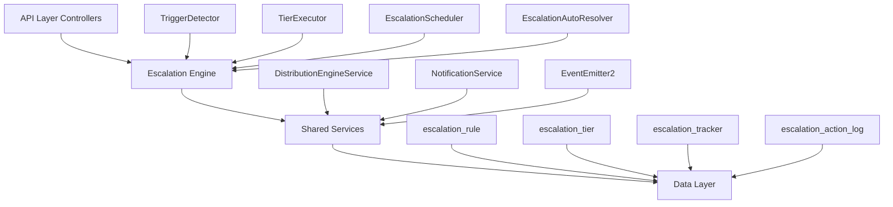

The Escalation Module automates responses when assigned leads go stale. A scheduled engine detects trigger conditions (no first contact, went cold) and executes tiered escalation actions — notifications, temperature changes, tag additions, and redistribution to new agents.

<Note>
**Status:** Active — fully implemented  
**Module Path:** `src/modules/crm/escalation/`
</Note>

## Overview

The Escalation Module provides automated lead management through a tiered escalation system that monitors lead activity and executes appropriate responses when leads become stale.

### Design principles

| Principle               | Decision                                                                                   |
| ----------------------- | ------------------------------------------------------------------------------------------ |
| pg-boss scheduling      | Escalation scheduler uses pg-boss recurring job for reliability                            |
| Tiered actions          | Rules have ordered tiers with configurable delays; actions execute in sequence             |
| Auto-resolution         | Events (activity, stage change, reassignment) automatically resolve active trackers        |
| Idempotency             | Partial unique index + `ON CONFLICT DO NOTHING` prevents duplicate trackers                |
| Distribution delegation | Reassignment uses the distribution engine (`REDISTRIBUTE` action), not a separate paradigm |
| RLS compliance          | All entities carry `organization_id` for row-level security                                |

## Architecture

### High-level diagram



### Component responsibilities

<CardGroup cols={2}>
  <Card title="EscalationScheduler" icon="clock">
    pg-boss recurring job that runs every 60 seconds to detect new triggers and process due escalations
  </Card>
  
  <Card title="TriggerDetector" icon="search">
    Scans leads for unmet conditions (no first contact, went cold); creates tracker records
  </Card>
  
  <Card title="TierExecutor" icon="play">
    Executes escalation tier actions (notify, redistribute, change temp, add tag)
  </Card>
  
  <Card title="EscalationAutoResolver" icon="check">
    Listens to domain events and resolves active trackers when conditions change
  </Card>
</CardGroup>

## Entity specifications

### EscalationRule

Defines when and how a lead should be escalated. Evaluated by `TriggerDetector`.

| Column                 | Type      | Notes                                                                        |
| ---------------------- | --------- | ---------------------------------------------------------------------------- |
| id                     | uuid PK   |                                                                              |
| organization_id        | uuid FK   | RLS                                                                          |
| name                   | varchar   | Human-readable rule name                                                     |
| is_active              | bool      | default true                                                                 |
| priority               | int       | Evaluation order                                                             |
| trigger_type           | enum      | `NO_FIRST_CONTACT`, `WENT_COLD`                                              |
| trigger_config         | jsonb     | `{thresholdMinutes?, thresholdValue?, thresholdUnit?}`                       |
| conditions             | jsonb     | `EscalationCondition[]` — AND-joined applicability filters; `[]` = all leads |
| respect_business_hours | bool      | default true. References org business hours schedule.                        |
| created_by             | uuid FK   |                                                                              |
| created_at, updated_at | timestamp |                                                                              |
| is_deleted             | bool      | soft delete                                                                  |

#### EscalationCondition interface

```typescript
interface EscalationCondition {
  field: 'temperature' | 'leadSource' | 'language' | 'sourceChannel';
  operator: 'eq' | 'in';
  value: string | string[];
}
```

#### SQL field mapping

Used by `TriggerDetector.buildApplicabilityExtraWhere`:

| Field           | SQL Column         | Table  | Notes                                           |
| --------------- | ------------------ | ------ | ----------------------------------------------- |
| `temperature`   | `l.temperature`    | lead   |                                                 |
| `leadSource`    | `l.lead_source`    | lead   |                                                 |
| `sourceChannel` | `l.source_channel` | lead   |                                                 |
| `language`      | `p.language`       | person | Adds `LEFT JOIN person p ON p.id = l.person_id` |

### EscalationTier

Each tier in an escalation rule represents a delayed action set. Tiers execute in `tier_order` sequence.

| Column             | Type    | Notes                                                                                                                                     |
| ------------------ | ------- | ----------------------------------------------------------------------------------------------------------------------------------------- |
| id                 | uuid PK |                                                                                                                                           |
| escalation_rule_id | uuid FK |                                                                                                                                           |
| organization_id    | uuid FK | RLS                                                                                                                                       |
| tier_order         | int     | 1, 2, 3... (max 10)                                                                                                                       |
| delay_minutes      | int     | Tier 1: always 0. Subsequent tiers: minutes after the previous tier completed. |
| actions            | jsonb   | `TierAction[]`                                                                                                   |

#### Tier action types

<AccordionGroup>
  <Accordion title="NOTIFY_AGENT">
    **Parameters:** `message?: string`
    
    Resolved from lead's current stakeholder (assigned agent)
  </Accordion>
  
  <Accordion title="NOTIFY_ADMIN">
    **Parameters:** `message?: string`
    
    Self-resolving — queries all org users with the `system.admin` permission key via `UserOrgRole → RolePermission → Permission`. Skipped if no admin users found.
  </Accordion>
  
  <Accordion title="NOTIFY_TEAM_LEAD">
    **Parameters:** `message?: string`
    
    Self-resolving — queries all team members with the `team.admin` permission key in the lead's assigned team. Skipped if the lead has no team stakeholder or no team leaders exist. Notifies ALL team leaders.
  </Accordion>
  
  <Accordion title="REDISTRIBUTE">
    **Parameters:** _(no params)_
    
    Distribution engine delegation — removes current stakeholders, calls `DistributionEngineService.redistribute()` which re-runs the full pipeline excluding the current assignee. A `distribution_log` entry with `distributionMethod: 'REDISTRIBUTION'` is written.
  </Accordion>
</AccordionGroup>

### EscalationTracker

Tracks active escalations for specific leads. Created when a rule triggers, resolved when conditions change.

<Warning>
Partial unique index prevents duplicate trackers: `(lead_id, escalation_rule_id) WHERE resolved_at IS NULL`
</Warning>

| Column             | Type      | Notes                                                    |
| ------------------ | --------- | -------------------------------------------------------- |
| id                 | uuid PK   |                                                          |
| organization_id    | uuid FK   | RLS                                                      |
| lead_id            | uuid FK   |                                                          |
| escalation_rule_id | uuid FK   |                                                          |
| triggered_at       | timestamp | When rule first triggered                                |
| current_tier       | int       | Next tier to execute (1-based)                          |
| next_tier_due_at   | timestamp | When current_tier should execute                         |
| resolved_at        | timestamp | null = active, non-null = resolved                      |
| resolved_by        | enum      | `ACTIVITY`, `STAGE_CHANGE`, `REASSIGNED`, `REDISTRIBUTED`, `RULE_DEACTIVATED` |

### EscalationActionLog

Immutable log of all executed escalation actions for audit trails.

| Column             | Type      | Notes                              |
| ------------------ | --------- | ---------------------------------- |
| id                 | uuid PK   |                                    |
| organization_id    | uuid FK   | RLS                                |
| escalation_tracker_id | uuid FK |                                  |
| tier_order         | int       | Which tier was executed            |
| action_type        | varchar   | `NOTIFY_AGENT`, `REDISTRIBUTE`, etc |
| action_params      | jsonb     | Parameters used for action         |
| executed_at        | timestamp |                                    |
| execution_result   | jsonb     | Success/failure details            |

## Type definitions

### Core enums

<CodeGroup>

```typescript TypeScript
enum EscalationTriggerType {
  NO_FIRST_CONTACT = 'NO_FIRST_CONTACT',
  WENT_COLD = 'WENT_COLD'
}

enum EscalationResolvedBy {
  ACTIVITY = 'ACTIVITY',
  STAGE_CHANGE = 'STAGE_CHANGE',
  REASSIGNED = 'REASSIGNED',
  REDISTRIBUTED = 'REDISTRIBUTED',
  RULE_DEACTIVATED = 'RULE_DEACTIVATED'
}

enum TierActionType {
  NOTIFY_AGENT = 'NOTIFY_AGENT',
  NOTIFY_ADMIN = 'NOTIFY_ADMIN',
  NOTIFY_TEAM_LEAD = 'NOTIFY_TEAM_LEAD',
  REDISTRIBUTE = 'REDISTRIBUTE',
  CHANGE_TEMPERATURE = 'CHANGE_TEMPERATURE',
  ADD_TAG = 'ADD_TAG'
}
```

</CodeGroup>

### Configuration interfaces

<CodeGroup>

```typescript Trigger Config
interface NoFirstContactConfig {
  thresholdMinutes: number;
}

interface WentColdConfig {
  thresholdValue: number;
  thresholdUnit: 'minutes' | 'hours' | 'days';
}

type TriggerConfig = NoFirstContactConfig | WentColdConfig;
```

```typescript Tier Actions
interface NotifyAction {
  type: 'NOTIFY_AGENT' | 'NOTIFY_ADMIN' | 'NOTIFY_TEAM_LEAD';
  message?: string;
}

interface RedistributeAction {
  type: 'REDISTRIBUTE';
}

interface ChangeTemperatureAction {
  type: 'CHANGE_TEMPERATURE';
  temperature: 'COLD' | 'WARM' | 'HOT';
}

interface AddTagAction {
  type: 'ADD_TAG';
  tagName: string;
}

type TierAction = NotifyAction | RedistributeAction | ChangeTemperatureAction | AddTagAction;
```

</CodeGroup>

## Escalation engine

### Scheduler workflow

<Steps>
  <Step title="Initialize">
    `EscalationScheduler.start()` registers a pg-boss recurring job running every 60 seconds
  </Step>
  
  <Step title="Detect triggers">
    `TriggerDetector.detectAndCreateTrackers()` scans for leads meeting escalation criteria
  </Step>
  
  <Step title="Process due escalations">
    `TierExecutor.processDueEscalations()` executes ready tier actions
  </Step>
  
  <Step title="Handle resolution">
    Event listeners automatically resolve trackers when conditions change
  </Step>
</Steps>

### Trigger detection logic

<Tabs>
  <Tab title="NO_FIRST_CONTACT">
    Finds leads where:
    - Lead has assigned stakeholder
    - No activities exist for the lead
    - Time since assignment > threshold
    - Lead stage allows escalation
    - Business hours respected (if enabled)
  </Tab>
  
  <Tab title="WENT_COLD">
    Finds leads where:
    - Lead has assigned stakeholder  
    - Last activity older than threshold
    - Lead stage allows escalation
    - Business hours respected (if enabled)
  </Tab>
</Tabs>

### Auto-resolution triggers

<Info>
The `EscalationAutoResolver` listens for domain events and automatically resolves active trackers:
</Info>

| Event Type | Resolved By | Condition |
| ---------- | ----------- | --------- |
| Lead activity created | `ACTIVITY` | Any new activity on tracked lead |
| Lead stage changed | `STAGE_CHANGE` | Stage moves to non-escalatable state |
| Lead reassigned | `REASSIGNED` | Stakeholder assignment changes |
| Successful redistribution | `REDISTRIBUTED` | Distribution engine assigns new agent |
| Rule deactivated | `RULE_DEACTIVATED` | Rule becomes inactive or deleted |

## API endpoints

### Rule management

<CodeGroup>

```http GET /api/escalation/rules
GET /api/escalation/rules
Authorization: Bearer {token}

Response: EscalationRule[]
```

```http POST /api/escalation/rules
POST /api/escalation/rules
Authorization: Bearer {token}
Content-Type: application/json

{
  "name": "No Contact Follow-up",
  "triggerType": "NO_FIRST_CONTACT",
  "triggerConfig": { "thresholdMinutes": 1440 },
  "conditions": [
    { "field": "temperature", "operator": "eq", "value": "HOT" }
  ],
  "tiers": [
    {
      "tierOrder": 1,
      "delayMinutes": 0,
      "actions": [
        { "type": "NOTIFY_AGENT", "message": "Lead needs attention" }
      ]
    }
  ]
}
```

```http PUT /api/escalation/rules/{id}
PUT /api/escalation/rules/{id}
Authorization: Bearer {token}
Content-Type: application/json

{
  "name": "Updated Rule Name",
  "isActive": false
}
```

```http DELETE /api/escalation/rules/{id}
DELETE /api/escalation/rules/{id}
Authorization: Bearer {token}

Response: 204 No Content
```

</CodeGroup>

### Analytics endpoints

<CodeGroup>

```http GET /api/escalation/analytics/overview
GET /api/escalation/analytics/overview?startDate=2024-01-01&endDate=2024-01-31
Authorization: Bearer {token}

Response:
{
  "totalEscalations": 145,
  "resolvedEscalations": 132,
  "activeEscalations": 13,
  "avgResolutionTimeHours": 4.2,
  "escalationsByTrigger": {
    "NO_FIRST_CONTACT": 89,
    "WENT_COLD": 56
  },
  "resolutionsByType": {
    "ACTIVITY": 78,
    "REDISTRIBUTED": 32,
    "REASSIGNED": 22
  }
}
```

```http GET /api/escalation/analytics/performance
GET /api/escalation/analytics/performance?ruleId={uuid}
Authorization: Bearer {token}

Response:
{
  "ruleId": "uuid",
  "ruleName": "No Contact Follow-up", 
  "triggerCount": 45,
  "resolutionRate": 0.91,
  "avgResolutionTimeHours": 3.8,
  "tierExecutionBreakdown": {
    "tier1": 45,
    "tier2": 12,
    "tier3": 3
  }
}
```

</CodeGroup>

## Security & permissions

### Required permissions

| Operation | Permission Key | Description |
| --------- | -------------- | ----------- |
| View rules | `escalation.view` | View escalation rules and analytics |
| Create/Edit rules | `escalation.manage` | Create, update, activate/deactivate rules |
| Delete rules | `escalation.delete` | Delete escalation rules |
| View analytics | `escalation.analytics` | Access escalation performance data |

### Row-level security

<Check>
All escalation entities include `organization_id` and are protected by RLS policies that filter by the user's current tenant context.
</Check>

### Action execution security

<Warning>
Notification actions respect user privacy settings and organization communication preferences. REDISTRIBUTE actions validate that the current user has permission to reassign leads.
</Warning>

## Analytics & metrics

### Key performance indicators

<CardGroup cols={2}>
  <Card title="Escalation Volume" icon="chart-line">
    Total escalations triggered per period, broken down by trigger type and rule
  </Card>
  
  <Card title="Resolution Efficiency" icon="stopwatch">
    Average time from escalation to resolution, resolution rate by tier
  </Card>
  
  <Card title="Action Effectiveness" icon="target">
    Success rates for different action types, redistribution outcomes
  </Card>
  
  <Card title="Agent Performance" icon="user-check">
    Escalations per agent, resolution patterns, workload distribution
  </Card>
</CardGroup>

### Tracking implementation

```typescript
interface EscalationMetrics {
  totalEscalations: number;
  activeEscalations: number; 
  resolvedEscalations: number;
  avgResolutionTimeHours: number;
  escalationsByTrigger: Record<EscalationTriggerType, number>;
  resolutionsByType: Record<EscalationResolvedBy, number>;
  tierExecutionBreakdown: Record<string, number>;
}
```

## Edge case handling

### Business hours compliance

<Tip>
When `respectBusinessHours` is enabled, the system accounts for organization timezone and business schedule when calculating thresholds and scheduling tier executions.
</Tip>

### Orphaned trackers

- **Scenario:** Lead deleted while escalation active
- **Handling:** Cleanup job resolves orphaned trackers weekly
- **Resolution:** `RULE_DEACTIVATED` with cleanup flag

### Concurrent modifications

- **Scenario:** Rule updated while tier executing  
- **Handling:** Tier execution uses rule snapshot from tracker creation
- **Fallback:** Skip execution if rule/tier no longer exists

### Distribution failures

- **Scenario:** `REDISTRIBUTE` action finds no available agents
- **Handling:** Action logged as failed, tracker remains active for next tier
- **Escalation:** Subsequent tiers may notify admins of redistribution failure

## Performance & scaling

### Optimization strategies

<Steps>
  <Step title="Efficient queries">
    TriggerDetector uses optimized queries with proper indexing for lead scanning
  </Step>
  
  <Step title="Batch processing">
    Tier execution processes multiple due escalations in batches
  </Step>
  
  <Step title="Event-driven resolution">
    Auto-resolution uses domain events instead of polling for state changes
  </Step>
  
  <Step title="Configurable scheduling">
    Scheduler frequency can be adjusted based on organization needs
  </Step>
</Steps>

### Database indexes

```sql
-- Escalation tracker queries
CREATE INDEX idx_escalation_tracker_active 
ON escalation_tracker (organization_id, resolved_at) 
WHERE resolved_at IS NULL;

-- Due tier processing
CREATE INDEX idx_escalation_tracker_due 
ON escalation_tracker (next_tier_due_at) 
WHERE resolved_at IS NULL;

-- Lead trigger detection
CREATE INDEX idx_lead_escalation_scan 
ON lead (organization_id, stage, updated_at);
```

## RLS policies

### Escalation rule policies

<CodeGroup>

```sql View Policy
CREATE POLICY escalation_rule_tenant_isolation ON escalation_rule
FOR SELECT TO authenticated
USING (organization_id = current_setting('app.current_tenant_id')::uuid);
```

```sql Modification Policy  
CREATE POLICY escalation_rule_tenant_modify ON escalation_rule
FOR ALL TO authenticated
USING (organization_id = current_setting('app.current_tenant_id')::uuid)
WITH CHECK (organization_id = current_setting('app.current_tenant_id')::uuid);
```

</CodeGroup>

### Tracker policies

<CodeGroup>

```sql View Policy
CREATE POLICY escalation_tracker_tenant_isolation ON escalation_tracker
FOR SELECT TO authenticated  
USING (organization_id = current_setting('app.current_tenant_id')::uuid);
```

```sql System Access
CREATE POLICY escalation_tracker_system_access ON escalation_tracker
FOR ALL TO service_role
USING (true);
```

</CodeGroup>

## Module structure

```
src/modules/crm/escalation/
├── controllers/
│   ├── escalation-rule.controller.ts
│   └── escalation-analytics.controller.ts
├── services/
│   ├── escalation-rule.service.ts
│   ├── escalation-engine.service.ts
│   ├── trigger-detector.service.ts
│   ├── tier-executor.service.ts
│   └── escalation-auto-resolver.service.ts
├── entities/
│   ├── escalation-rule.entity.ts
│   ├── escalation-tier.entity.ts
│   ├── escalation-tracker.entity.ts
│   └── escalation-action-log.entity.ts
├── dtos/
│   ├── create-escalation-rule.dto.ts
│   ├── update-escalation-rule.dto.ts
│   └── escalation-analytics.dto.ts
├── types/
│   └── escalation.types.ts
└── escalation.module.ts
```

## Integration points

### Distribution engine

- **Relationship:** REDISTRIBUTE action delegates to `DistributionEngineService`
- **Data flow:** Removes current stakeholders → calls redistribute → logs outcome
- **Resolution:** Successful redistribution auto-resolves tracker

### Notification service

- **Relationship:** All notify actions use centralized notification system
- **Features:** Respects user preferences, delivery confirmation, retry logic
- **Audit:** Notification outcomes logged in action execution results

### Lead management

- **Relationship:** Monitors lead activity, stage changes, assignments via events  
- **Dependencies:** Lead stage configuration for escalation eligibility
- **Data access:** Read-only access to lead, person, activity entities

<Note>
The escalation module integrates deeply with the CRM core while maintaining clear boundaries through service interfaces and event-driven communication.
</Note>