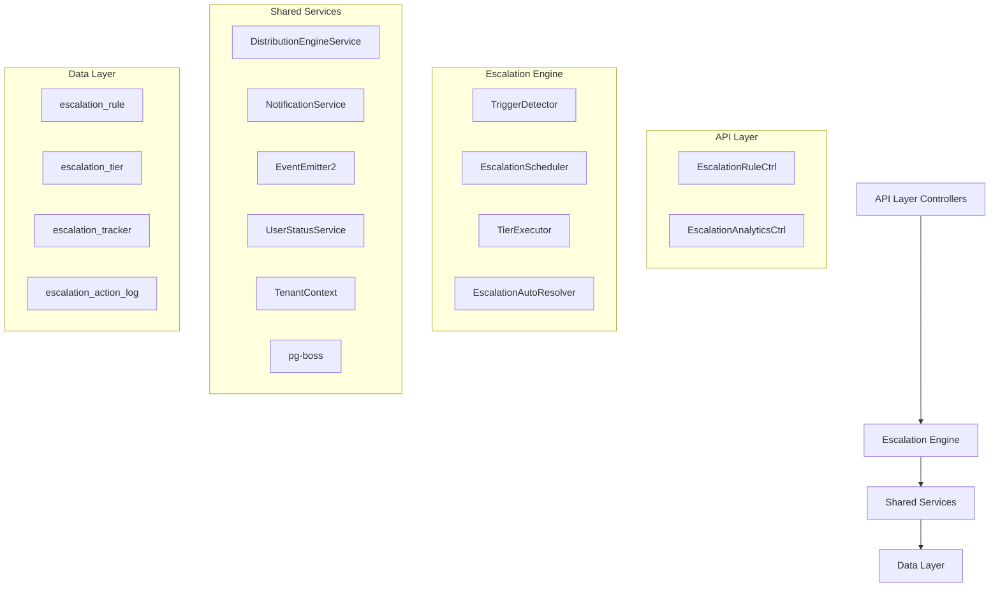

## Overview

The Escalation Module automates responses when assigned leads go stale. A scheduled engine detects trigger conditions (no first contact, went cold) and executes tiered escalation actions — notifications, temperature changes, tag additions, and redistribution to new agents.

<Info>
**Module Status:** Active — fully implemented  
**Module Path:** `src/modules/crm/escalation/`
</Info>

### Design Principles

| Principle | Decision |
| --- | --- |
| **pg-boss scheduling** | Escalation scheduler uses pg-boss recurring job for reliability |
| **Tiered actions** | Rules have ordered tiers with configurable delays; actions execute in sequence |
| **Auto-resolution** | Events (activity, stage change, reassignment) automatically resolve active trackers |
| **Idempotency** | Partial unique index + `ON CONFLICT DO NOTHING` prevents duplicate trackers |
| **Distribution delegation** | Reassignment uses the distribution engine (`REDISTRIBUTE` action), not a separate paradigm |
| **RLS compliance** | All entities carry `organization_id` for row-level security |

## Architecture

### High-Level Diagram



### Component Responsibilities

<CardGroup cols={2}>
  <Card title="EscalationScheduler" icon="clock">
    pg-boss recurring job that runs every 60 seconds to detect new triggers and process due escalations
  </Card>
  <Card title="TriggerDetector" icon="magnifying-glass">
    Scans leads for unmet conditions (no first contact, went cold); creates tracker records
  </Card>
  <Card title="TierExecutor" icon="play">
    Executes escalation tier actions (notify, redistribute, change temp, add tag)
  </Card>
  <Card title="EscalationAutoResolver" icon="check">
    Listens to domain events and resolves active trackers when conditions change
  </Card>
</CardGroup>

## Entity Specifications

### EscalationRule

Defines when and how a lead should be escalated. Evaluated by `TriggerDetector`.

<AccordionGroup>
  <Accordion title="Schema Definition">
    | Column | Type | Notes |
    | --- | --- | --- |
    | `id` | uuid PK | Primary key |
    | `organization_id` | uuid FK | Row-level security |
    | `name` | varchar | Human-readable rule name |
    | `is_active` | bool | Default true |
    | `priority` | int | Evaluation order |
    | `trigger_type` | enum | `NO_FIRST_CONTACT`, `WENT_COLD` |
    | `trigger_config` | jsonb | `{thresholdMinutes?, thresholdValue?, thresholdUnit?}` |
    | `conditions` | jsonb | `EscalationCondition[]` — AND-joined applicability filters |
    | `respect_business_hours` | bool | Default true. References org business hours schedule |
    | `created_by` | uuid FK | User who created the rule |
    | `created_at, updated_at` | timestamp | Audit timestamps |
    | `is_deleted` | bool | Soft delete flag |
  </Accordion>
  
  <Accordion title="EscalationCondition Interface">
    ```typescript
    interface EscalationCondition {
      field: 'temperature' | 'leadSource' | 'language' | 'sourceChannel';
      operator: 'eq' | 'in';
      value: string | string[];
    }
    ```
    
    **SQL Field Mapping:**
    
    | Field | SQL Column | Table | Notes |
    | --- | --- | --- | --- |
    | `temperature` | `l.temperature` | lead | |
    | `leadSource` | `l.lead_source` | lead | |
    | `sourceChannel` | `l.source_channel` | lead | |
    | `language` | `p.language` | person | Adds `LEFT JOIN person p ON p.id = l.person_id` |
  </Accordion>
</AccordionGroup>

### EscalationTier

Each tier in an escalation rule represents a delayed action set. Tiers execute in `tier_order` sequence.

| Column | Type | Notes |
| --- | --- | --- |
| `id` | uuid PK | Primary key |
| `escalation_rule_id` | uuid FK | Parent escalation rule |
| `organization_id` | uuid FK | Row-level security |
| `tier_order` | int | 1, 2, 3... (max 10) |
| `delay_minutes` | int | Tier 1: always 0. Subsequent tiers: minutes after previous tier |
| `actions` | jsonb | `TierAction[]` array |

<Note>
**Tier 1 Timing:** The lowest `tier_order` (tier 1) always has `delay_minutes = 0` because the threshold is the sole timing control for the first tier.
</Note>

### Tier Action Types

<Tabs>
  <Tab title="NOTIFY_AGENT">
    **Parameters:** `message?: string`
    
    Resolved from lead's current stakeholder (assigned agent).
  </Tab>
  
  <Tab title="NOTIFY_ADMIN">
    **Parameters:** `message?: string`
    
    **Self-resolving** — queries all org users with the `system.admin` permission key via `UserOrgRole → RolePermission → Permission`. Skipped if no admin users found.
  </Tab>
  
  <Tab title="NOTIFY_TEAM_LEAD">
    **Parameters:** `message?: string`
    
    **Self-resolving** — queries all team members with the `team.admin` permission key in the lead's assigned team. Skipped if the lead has no team stakeholder or no team leaders exist. Notifies ALL team leaders.
  </Tab>
  
  <Tab title="REDISTRIBUTE">
    **Parameters:** _(no params)_
    
    **Distribution engine delegation** — removes current stakeholders, calls `DistributionEngineService.redistribute()` which re-runs the full pipeline excluding the current assignee.
    
    <Warning>
    If the distribution outcome is `ASSIGNED`, the scheduler resolves the tracker with `resolvedBy = REDISTRIBUTED`.
    </Warning>
  </Tab>
  
  <Tab title="CHANGE_TEMPERATURE">
    **Parameters:** `temperature: LeadTemperature`
    
    Updates the lead's temperature field directly.
  </Tab>
  
  <Tab title="ADD_TAG">
    **Parameters:** `tagName: string`
    
    Adds a tag to the lead. Creates the tag if it doesn't exist in the organization.
  </Tab>
</Tabs>

### EscalationTracker

Tracks the escalation lifecycle for a specific lead. Created when a trigger condition is met.

| Column | Type | Notes |
| --- | --- | --- |
| `id` | uuid PK | Primary key |
| `organization_id` | uuid FK | Row-level security |
| `lead_id` | uuid FK | Target lead |
| `escalation_rule_id` | uuid FK | Applied rule |
| `trigger_type` | enum | `NO_FIRST_CONTACT`, `WENT_COLD` |
| `current_tier_order` | int | Current execution tier (1, 2, 3...) |
| `next_execution_at` | timestamp | When next tier should execute |
| `status` | enum | `ACTIVE`, `RESOLVED` |
| `resolved_by` | enum | `REDISTRIBUTED`, `ACTIVITY_DETECTED`, `STAGE_CHANGED`, `REASSIGNED`, `RULE_DEACTIVATED` |
| `resolved_at` | timestamp | Resolution timestamp |

<Check>
**Idempotency:** Partial unique index on `(lead_id, escalation_rule_id) WHERE status = 'ACTIVE'` prevents duplicate active trackers.
</Check>

## Escalation Engine

### Trigger Detection

The `TriggerDetector` runs every 60 seconds via pg-boss and evaluates leads against escalation rules:

<Steps>
  <Step title="Query Active Rules">
    Fetches all active escalation rules ordered by priority
  </Step>
  
  <Step title="Build Lead Query">
    Constructs SQL query based on trigger type and conditions:
    
    ```sql
    -- NO_FIRST_CONTACT example
    SELECT l.id 
    FROM lead l
    LEFT JOIN person p ON p.id = l.person_id
    WHERE l.organization_id = $1
      AND l.assigned_at IS NOT NULL
      AND l.assigned_at < NOW() - INTERVAL '${thresholdMinutes} minutes'
      AND NOT EXISTS (
        SELECT 1 FROM activity a 
        WHERE a.lead_id = l.id 
        AND a.activity_type = 'CONTACT'
      )
      -- Additional condition filters...
    ```
  </Step>
  
  <Step title="Create Trackers">
    For each matching lead, creates an `EscalationTracker` with:
    - `current_tier_order = 1`
    - `next_execution_at = NOW()` (tier 1 executes immediately)
    - `status = 'ACTIVE'`
  </Step>
</Steps>

### Tier Execution

The `TierExecutor` processes due escalations:

<Steps>
  <Step title="Fetch Due Trackers">
    Queries active trackers where `next_execution_at <= NOW()`
  </Step>
  
  <Step title="Execute Tier Actions">
    For each tracker, executes all actions in the current tier sequentially
  </Step>
  
  <Step title="Advance or Complete">
    - If more tiers exist: advance to next tier, set `next_execution_at`
    - If final tier: keep tracker active but clear `next_execution_at`
  </Step>
  
  <Step title="Log Actions">
    Records execution details in `escalation_action_log`
  </Step>
</Steps>

### Auto-Resolution

The `EscalationAutoResolver` listens for domain events and resolves active trackers:

| Event | Resolution Trigger | Resolved By |
| --- | --- | --- |
| `ActivityCreated` | Lead activity detected | `ACTIVITY_DETECTED` |
| `LeadStageChanged` | Stage progression | `STAGE_CHANGED` |
| `LeadReassigned` | Stakeholder change | `REASSIGNED` |
| Rule deactivation | Manual rule disable | `RULE_DEACTIVATED` |

## API Endpoints

### Escalation Rules

<CodeGroup>
```typescript POST /api/escalation/rules
// Create escalation rule
{
  "name": "No Contact Follow-up",
  "triggerType": "NO_FIRST_CONTACT",
  "triggerConfig": {
    "thresholdMinutes": 1440
  },
  "conditions": [
    {
      "field": "temperature",
      "operator": "in",
      "value": ["HOT", "WARM"]
    }
  ],
  "tiers": [
    {
      "tierOrder": 1,
      "delayMinutes": 0,
      "actions": [
        {
          "type": "NOTIFY_AGENT",
          "parameters": {
            "message": "Lead requires immediate attention"
          }
        }
      ]
    }
  ]
}
```

```typescript GET /api/escalation/rules
// List escalation rules
{
  "data": [
    {
      "id": "uuid",
      "name": "No Contact Follow-up",
      "isActive": true,
      "triggerType": "NO_FIRST_CONTACT",
      "priority": 1,
      "tiers": [...]
    }
  ],
  "pagination": {...}
}
```

```typescript PUT /api/escalation/rules/:id
// Update escalation rule
{
  "name": "Updated Rule Name",
  "isActive": false
}
```

```typescript DELETE /api/escalation/rules/:id
// Soft delete escalation rule
// Automatically resolves active trackers
```
</CodeGroup>

### Analytics & Metrics

<CodeGroup>
```typescript GET /api/escalation/analytics/summary
// Escalation overview metrics
{
  "totalActiveTrackers": 45,
  "totalRulesActive": 8,
  "executionsLast24h": 123,
  "resolutionBreakdown": {
    "REDISTRIBUTED": 15,
    "ACTIVITY_DETECTED": 30,
    "STAGE_CHANGED": 8
  }
}
```

```typescript GET /api/escalation/analytics/rule-performance
// Rule-specific performance data
{
  "data": [
    {
      "ruleId": "uuid",
      "ruleName": "No Contact Follow-up",
      "triggerCount": 50,
      "resolutionRate": 0.85,
      "avgResolutionTime": 2.5
    }
  ]
}
```
</CodeGroup>

## Security & Permissions

### Required Permissions

| Action | Permission Key | Scope |
| --- | --- | --- |
| **View rules** | `escalation.view` | Organization |
| **Create rules** | `escalation.manage` | Organization |
| **Edit rules** | `escalation.manage` | Organization |
| **Delete rules** | `escalation.manage` | Organization |
| **View analytics** | `escalation.analytics` | Organization |

### Row-Level Security

All escalation entities include `organization_id` for RLS enforcement:

```sql
-- Example RLS policy
CREATE POLICY escalation_rule_tenant_isolation 
ON escalation_rule 
FOR ALL 
USING (organization_id = current_setting('app.current_organization_id')::uuid);
```

<Warning>
**Tenant Isolation:** The escalation scheduler runs with elevated privileges but filters all queries by `organization_id` to maintain tenant boundaries.
</Warning>

## Edge Case Handling

### Business Hours Respect

<AccordionGroup>
  <Accordion title="Implementation Details">
    When `respect_business_hours = true`:
    
    1. **Threshold calculation** accounts for business hours only
    2. **Tier execution** is delayed until business hours resume
    3. **Weekend handling** extends deadlines appropriately
    
    ```typescript
    // Example: 24-hour threshold with business hours
    // Lead assigned Friday 6pm
    // Business hours: Mon-Fri 9am-5pm
    // Effective threshold: Monday 9am + 24 hours = Tuesday 9am
    ```
  </Accordion>
</AccordionGroup>

### Redistribution Failures

<Steps>
  <Step title="Distribution Attempt">
    Call `DistributionEngineService.redistribute()`
  </Step>
  
  <Step title="Check Outcome">
    If outcome is `NO_AGENTS_AVAILABLE` or `ASSIGNMENT_FAILED`:
  </Step>
  
  <Step title="Fallback Action">
    - Log the failure in `escalation_action_log`
    - Continue to next tier if available
    - Do NOT resolve the tracker
  </Step>
  
  <Step title="Admin Notification">
    Consider adding `NOTIFY_ADMIN` as fallback in higher tiers
  </Step>
</Steps>

### Concurrent Modifications

<Tip>
**Race Condition Protection:** The engine uses database transactions and row-level locking to prevent race conditions when multiple schedulers run simultaneously.
</Tip>

## Performance & Scaling

### Optimization Strategies

| Component | Optimization |
| --- | --- |
| **Trigger Detection** | Indexed queries on `assigned_at`, `organization_id` |
| **Tracker Processing** | Batch processing with configurable limits |
| **Event Listeners** | Async processing with queue-based architecture |
| **Database Queries** | Connection pooling and prepared statements |

### Monitoring Metrics

<CardGroup cols={2}>
  <Card title="Execution Latency" icon="clock">
    Track scheduler run duration and tier execution times
  </Card>
  <Card title="Queue Depth" icon="list">
    Monitor pg-boss job queue for escalation processing
  </Card>
  <Card title="Resolution Rates" icon="chart-line">
    Track how often escalations resolve naturally vs. requiring intervention
  </Card>
  <Card title="Error Rates" icon="exclamation-triangle">
    Monitor failed actions and redistribution failures
  </Card>
</CardGroup>

## Integration Points

### Distribution Engine

The escalation module delegates lead redistribution to the distribution engine:

```typescript
// Redistribution flow
const outcome = await this.distributionEngineService.redistribute(
  lead.id,
  { excludeUserIds: [currentAssigneeId] }
);

if (outcome === 'ASSIGNED') {
  // Resolve escalation tracker
  await this.resolveTracker(tracker.id, 'REDISTRIBUTED');
}
```

### Notification System

Escalation notifications integrate with the organization's notification preferences:

```typescript
await this.notificationService.send({
  type: 'ESCALATION_ALERT',
  recipientIds: [agentId],
  data: {
    leadId: lead.id,
    ruleName: rule.name,
    tierOrder: currentTier,
    message: action.parameters.message
  }
});
```

### Activity Tracking

All escalation actions are logged for audit and analytics:

```typescript
await this.escalationActionLogRepository.create({
  escalationTrackerId: tracker.id,
  action: action.type,
  executedAt: new Date(),
  result: 'SUCCESS',
  details: { recipientCount: 3, message: 'Custom alert' }
});
```

<Check>
The escalation module provides comprehensive automation for lead lifecycle management while maintaining flexibility through configurable rules and seamless integration with existing CRM workflows.
</Check>