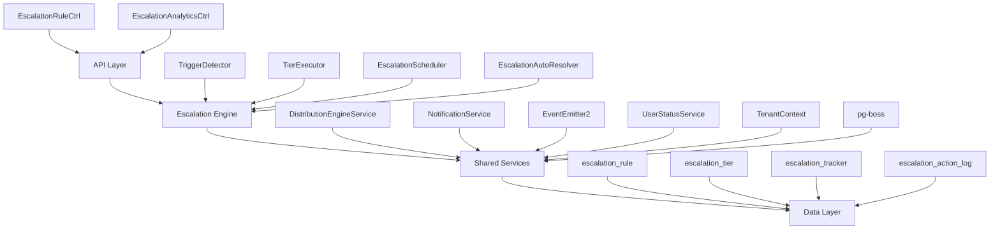

<Note>
**Status:** Active — fully implemented  
**Module Path:** `src/modules/crm/escalation/`
</Note>

## Overview

The Escalation Module automates responses when assigned leads go stale. A scheduled engine detects trigger conditions (no first contact, went cold) and executes tiered escalation actions — notifications, temperature changes, tag additions, and redistribution to new agents.

### Design Principles

| Principle | Decision |
|-----------|----------|
| pg-boss scheduling | Escalation scheduler uses pg-boss recurring job for reliability |
| Tiered actions | Rules have ordered tiers with configurable delays; actions execute in sequence |
| Auto-resolution | Events (activity, stage change, reassignment) automatically resolve active trackers |
| Idempotency | Partial unique index + `ON CONFLICT DO NOTHING` prevents duplicate trackers |
| Distribution delegation | Reassignment uses the distribution engine (`REDISTRIBUTE` action), not a separate paradigm |
| RLS compliance | All entities carry `organization_id` for row-level security |

## Architecture

### High-Level Diagram



### Component Responsibilities

<AccordionGroup>
<Accordion title="EscalationScheduler">
pg-boss recurring job that runs every 60 seconds to detect new triggers and process due escalations
</Accordion>

<Accordion title="TriggerDetector">
Scans leads for unmet conditions (no first contact, went cold); creates tracker records
</Accordion>

<Accordion title="TierExecutor">
Executes escalation tier actions (notify, redistribute, change temp, add tag)
</Accordion>

<Accordion title="EscalationAutoResolver">
Listens to domain events and resolves active trackers when conditions change
</Accordion>

<Accordion title="EscalationRuleService">
CRUD for escalation rules; handles tracker cancellation on deactivation/deletion
</Accordion>
</AccordionGroup>

## Entity Specifications

### EscalationRule

Defines when and how a lead should be escalated. Evaluated by `TriggerDetector`.

| Column | Type | Notes |
|--------|------|-------|
| id | uuid PK | |
| organization_id | uuid FK | RLS |
| name | varchar | Human-readable rule name |
| is_active | bool | default true |
| priority | int | Evaluation order |
| trigger_type | enum | `NO_FIRST_CONTACT`, `WENT_COLD` |
| trigger_config | jsonb | `{thresholdMinutes?, thresholdValue?, thresholdUnit?}` |
| conditions | jsonb | `EscalationCondition[]` — AND-joined applicability filters; `[]` = all leads |
| respect_business_hours | bool | default true. References org business hours schedule. |
| created_by | uuid FK | |
| created_at, updated_at | timestamp | |
| is_deleted | bool | soft delete |

<Info>
**EscalationCondition shape:**
```typescript
interface EscalationCondition {
  field: 'temperature' | 'leadSource' | 'language' | 'sourceChannel';
  operator: 'eq' | 'in';
  value: string | string[];
}
```
</Info>

#### SQL Field Mapping

Used by `TriggerDetector.buildApplicabilityExtraWhere`:

| Field | SQL Column | Table | Notes |
|-------|------------|-------|-------|
| `temperature` | `l.temperature` | lead | |
| `leadSource` | `l.lead_source` | lead | |
| `sourceChannel` | `l.source_channel` | lead | |
| `language` | `p.language` | person | Adds `LEFT JOIN person p ON p.id = l.person_id` |

### EscalationTier

Each tier in an escalation rule represents a delayed action set. Tiers execute in `tier_order` sequence.

| Column | Type | Notes |
|--------|------|-------|
| id | uuid PK | |
| escalation_rule_id | uuid FK | |
| organization_id | uuid FK | RLS |
| tier_order | int | 1, 2, 3... (max 10) |
| delay_minutes | int | Tier 1: always 0; subsequent tiers: minutes after previous tier |
| actions | jsonb | `TierAction[]` |

<Warning>
Tier 1 (lowest tier_order) always has `delay_minutes = 0` — the threshold is the sole timing control. Subsequent tiers delay minutes after the previous tier completed.
</Warning>

### Tier Action Types

<Tabs>
<Tab title="NOTIFY_AGENT">
**Parameters:** `message?: string`

Resolved from lead's current stakeholder (assigned agent)
</Tab>

<Tab title="NOTIFY_ADMIN">
**Parameters:** `message?: string`

Self-resolving — queries all org users with the `system.admin` permission key via `UserOrgRole → RolePermission → Permission`. Skipped if no admin users found.
</Tab>

<Tab title="NOTIFY_TEAM_LEAD">
**Parameters:** `message?: string`

Self-resolving — queries all team members with the `team.admin` permission key in the lead's assigned team. Skipped if the lead has no team stakeholder or no team leaders exist. Notifies ALL team leaders.
</Tab>

<Tab title="REDISTRIBUTE">
**Parameters:** _(no params)_

Distribution engine delegation — removes current stakeholders, calls `DistributionEngineService.redistribute()` which re-runs the full pipeline excluding the current assignee. If outcome is `ASSIGNED`, scheduler resolves tracker with `resolvedBy = REDISTRIBUTED`.
</Tab>

<Tab title="CHANGE_TEMPERATURE">
**Parameters:** `temperature: LeadTemperature`

Updates lead's temperature field directly
</Tab>

<Tab title="ADD_TAG">
**Parameters:** `tagName: string`

Creates or associates existing tag with the lead
</Tab>
</Tabs>

### EscalationTracker

Tracks active escalation instances for leads. One tracker per lead per rule.

| Column | Type | Notes |
|--------|------|-------|
| id | uuid PK | |
| organization_id | uuid FK | RLS |
| escalation_rule_id | uuid FK | |
| lead_id | uuid FK | |
| trigger_type | enum | Copied from rule |
| triggered_at | timestamp | When tracker was created |
| next_due_at | timestamp | Next tier execution time |
| current_tier_order | int | 1-based; null = completed all tiers |
| resolved_at | timestamp | null = active |
| resolved_by | enum | `MANUAL`, `REDISTRIBUTED`, `ACTIVITY`, `STAGE_CHANGE`, `ASSIGNMENT_CHANGE` |
| created_at | timestamp | |

<Check>
Unique constraint: `(lead_id, escalation_rule_id)` WHERE `resolved_at IS NULL` prevents duplicate active trackers.
</Check>

### EscalationActionLog

Audit trail for executed escalation actions.

| Column | Type | Notes |
|--------|------|-------|
| id | uuid PK | |
| organization_id | uuid FK | RLS |
| escalation_tracker_id | uuid FK | |
| tier_order | int | |
| action_type | enum | |
| action_config | jsonb | Parameters used |
| executed_at | timestamp | |
| success | bool | |
| error_message | text | If success = false |
| execution_details | jsonb | Results/metadata |

## Escalation Engine

### Scheduling System

<Steps>
<Step title="Job Registration">
`EscalationScheduler` registers a recurring pg-boss job named `escalation-processor` that runs every 60 seconds.
</Step>

<Step title="Trigger Detection">
`TriggerDetector` scans for leads matching active escalation rules:
- NO_FIRST_CONTACT: No activity records
- WENT_COLD: Last activity older than threshold
</Step>

<Step title="Tracker Creation">
Creates `EscalationTracker` records for qualifying leads using `ON CONFLICT DO NOTHING` for idempotency.
</Step>

<Step title="Tier Execution">
`TierExecutor` processes trackers where `next_due_at <= NOW()`, executing configured actions.
</Step>
</Steps>

### Trigger Types

<CardGroup cols={2}>
<Card title="NO_FIRST_CONTACT" icon="clock">
Detects leads with no activity records within the configured threshold period since assignment.

**Threshold Configuration:**
- `thresholdMinutes`: Direct minute value
- OR `thresholdValue` + `thresholdUnit`: Computed minutes
</Card>

<Card title="WENT_COLD" icon="snowflake">
Detects leads where the most recent activity is older than the threshold period.

**Query Logic:**
```sql
l.assigned_at IS NOT NULL 
AND NOT EXISTS (
  SELECT 1 FROM activity a 
  WHERE a.lead_id = l.id
  AND a.created_at > (NOW() - INTERVAL '{threshold} minutes')
)
```
</Card>
</CardGroup>

### Business Hours Handling

When `respect_business_hours = true`:

1. **Threshold calculation** includes only business hours using `BusinessHoursService.addBusinessMinutes()`
2. **Next due timing** schedules execution at the next business hour if currently outside business hours
3. **Timezone handling** uses organization's configured timezone

<Note>
Business hours are defined per organization and include weekday schedules, holidays, and timezone settings.
</Note>

## API Endpoints

### Escalation Rules

<CodeGroup>
```typescript POST /api/escalation-rules
interface CreateEscalationRuleRequest {
  name: string;
  triggerType: EscalationTriggerType;
  triggerConfig: TriggerConfig;
  conditions?: EscalationCondition[];
  respectBusinessHours?: boolean;
  priority?: number;
  tiers: CreateEscalationTierDto[];
}
```

```typescript GET /api/escalation-rules
interface GetEscalationRulesQuery {
  page?: number;
  limit?: number;
  isActive?: boolean;
  triggerType?: EscalationTriggerType;
  sortBy?: 'name' | 'priority' | 'createdAt';
  sortOrder?: 'asc' | 'desc';
}
```

```typescript PUT /api/escalation-rules/:id
interface UpdateEscalationRuleRequest {
  name?: string;
  isActive?: boolean;
  triggerConfig?: TriggerConfig;
  conditions?: EscalationCondition[];
  respectBusinessHours?: boolean;
  priority?: number;
  tiers?: UpdateEscalationTierDto[];
}
```
</CodeGroup>

### Analytics & Metrics

<CodeGroup>
```typescript GET /api/escalation-rules/:id/analytics
interface EscalationAnalyticsResponse {
  ruleId: string;
  totalTriggers: number;
  activeTrackers: number;
  resolvedTrackers: number;
  avgResolutionTimeMinutes: number;
  tierExecutionStats: TierExecutionStats[];
  resolutionReasons: Record<EscalationResolutionReason, number>;
  timeSeriesData: EscalationTimeSeriesData[];
}
```

```typescript GET /api/escalation-analytics/summary
interface EscalationSummaryResponse {
  totalActiveTrackers: number;
  totalResolvedToday: number;
  topTriggeringRules: Array<{
    ruleId: string;
    ruleName: string;
    triggerCount: number;
  }>;
  resolutionBreakdown: Record<EscalationResolutionReason, number>;
}
```
</CodeGroup>

## Security & Permissions

### Required Permissions

| Operation | Permission Key | Notes |
|-----------|----------------|-------|
| View escalation rules | `escalation.view` | |
| Create/edit escalation rules | `escalation.manage` | |
| View escalation analytics | `escalation.analytics` | |
| System admin operations | `system.admin` | For NOTIFY_ADMIN actions |

### Row-Level Security (RLS)

All escalation entities include `organization_id` and are filtered by the tenant context:

```sql
-- Example RLS policy
CREATE POLICY escalation_rule_tenant_isolation ON escalation_rule
FOR ALL TO authenticated
USING (organization_id = current_setting('app.current_organization_id')::uuid);
```

<Warning>
The escalation scheduler runs in system context and bypasses RLS. All queries manually include organization_id filters for security.
</Warning>

## Performance & Scaling

### Indexing Strategy

<CodeGroup>
```sql Core Indexes
-- Escalation rule lookups
CREATE INDEX idx_escalation_rule_active_priority 
ON escalation_rule (organization_id, is_active, priority) 
WHERE is_deleted = false;

-- Tracker processing
CREATE INDEX idx_escalation_tracker_due_processing 
ON escalation_tracker (organization_id, next_due_at, resolved_at) 
WHERE resolved_at IS NULL;

-- Lead trigger detection
CREATE INDEX idx_lead_assigned_temp_source 
ON lead (organization_id, assigned_at, temperature, lead_source) 
WHERE assigned_at IS NOT NULL;
```

```sql Analytics Indexes
-- Action log analytics
CREATE INDEX idx_escalation_action_log_analytics 
ON escalation_action_log (organization_id, executed_at, success);

-- Tracker resolution analytics
CREATE INDEX idx_escalation_tracker_resolved 
ON escalation_tracker (organization_id, resolved_at, resolved_by) 
WHERE resolved_at IS NOT NULL;
```
</CodeGroup>

### Batch Processing Limits

| Operation | Batch Size | Reasoning |
|-----------|------------|-----------|
| Trigger detection | 1000 leads | Memory usage balance |
| Tracker processing | 500 trackers | Action execution overhead |
| Auto-resolution | 200 trackers | Event processing load |

### Performance Monitoring

<Tip>
Key metrics to monitor:
- Average trigger detection time
- Escalation processing queue depth
- Action execution success rates
- Business hours calculation performance
</Tip>

## Edge Case Handling

### Concurrent Modifications

<AccordionGroup>
<Accordion title="Rule Deactivation During Execution">
**Scenario:** Rule is deactivated while trackers are being processed.

**Handling:** 
- In-flight tier executions complete normally
- `EscalationRuleService.update()` cancels remaining trackers
- Future scheduler runs skip inactive rules
</Accordion>

<Accordion title="Lead Reassignment">
**Scenario:** Lead is reassigned to a different agent during active escalation.

**Handling:**
- `EscalationAutoResolver` listens to assignment change events
- Resolves active trackers with `resolvedBy = ASSIGNMENT_CHANGE`
- New assignment may trigger new escalation rules
</Accordion>

<Accordion title="Organization Timezone Changes">
**Scenario:** Organization changes timezone affecting business hours.

**Handling:**
- Next execution times are recalculated on the fly
- No retroactive adjustments to existing schedules
- May cause temporary timing inconsistencies
</Accordion>
</AccordionGroup>

### Data Consistency

<Check>
**Tracker Uniqueness:** Partial unique index prevents multiple active trackers for the same lead-rule combination.
</Check>

<Check>
**Tier Order Validation:** Application-level validation ensures tier_order values are sequential (1, 2, 3...) with no gaps.
</Check>

<Check>
**Action Parameter Validation:** Each action type has specific parameter requirements validated before execution.
</Check>

## Integration Points

### Distribution Engine

```typescript
// Redistribution delegation
await this.distributionEngineService.redistribute({
  leadId: tracker.leadId,
  excludeUserIds: [currentAssignedUserId],
  reason: 'ESCALATION_REDISTRIBUTION',
  escalationTrackerId: tracker.id
});
```

### Notification System

```typescript
// Multi-recipient notification
await this.notificationService.sendBulk({
  recipients: adminUsers,
  template: 'escalation-admin-alert',
  data: {
    leadId: tracker.leadId,
    ruleName: rule.name,
    message: action.message
  }
});
```

### Event System

The module both emits and listens to domain events:

<Tabs>
<Tab title="Emitted Events">
- `escalation.triggered`
- `escalation.tier.executed`
- `escalation.resolved`
- `escalation.failed`
</Tab>

<Tab title="Consumed Events">
- `lead.activity.created`
- `lead.stage.changed`
- `lead.assigned`
- `lead.unassigned`
</Tab>
</Tabs>

## Module Structure

```
src/modules/crm/escalation/
├── controllers/
│   ├── escalation-rule.controller.ts
│   └── escalation-analytics.controller.ts
├── services/
│   ├── escalation-rule.service.ts
│   ├── escalation-scheduler.service.ts
│   ├── escalation-engine.service.ts
│   └── escalation-analytics.service.ts
├── entities/
│   ├── escalation-rule.entity.ts
│   ├── escalation-tier.entity.ts
│   ├── escalation-tracker.entity.ts
│   └── escalation-action-log.entity.ts
├── dto/
│   ├── create-escalation-rule.dto.ts
│   ├── update-escalation-rule.dto.ts
│   └── escalation-analytics.dto.ts
├── types/
│   └── escalation.types.ts
├── jobs/
│   └── escalation-processor.job.ts
└── escalation.module.ts
```

<Note>
This comprehensive specification covers all aspects of the escalation module implementation, from high-level architecture to specific edge cases and performance considerations.
</Note>