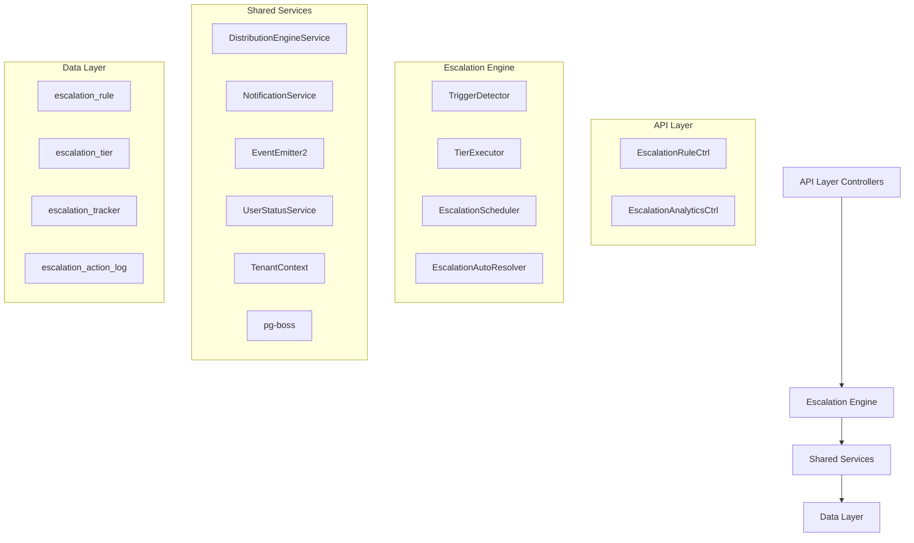

The Escalation Module automates responses when assigned leads go stale. A scheduled engine detects trigger conditions (no first contact, went cold) and executes tiered escalation actions — notifications, temperature changes, tag additions, and redistribution to new agents.

<Note>
**Status:** Active — fully implemented  
**Module Path:** `src/modules/crm/escalation/`
</Note>

## Design principles

The Escalation Module follows these core design principles:

<CardGroup cols={2}>
  <Card title="pg-boss scheduling" icon="clock">
    Escalation scheduler uses pg-boss recurring job for reliability
  </Card>
  <Card title="Tiered actions" icon="layer-group">
    Rules have ordered tiers with configurable delays; actions execute in sequence
  </Card>
  <Card title="Auto-resolution" icon="check-circle">
    Events (activity, stage change, reassignment) automatically resolve active trackers
  </Card>
  <Card title="Idempotency" icon="shield">
    Partial unique index + `ON CONFLICT DO NOTHING` prevents duplicate trackers
  </Card>
  <Card title="Distribution delegation" icon="share-nodes">
    Reassignment uses the distribution engine (`REDISTRIBUTE` action), not a separate paradigm
  </Card>
  <Card title="RLS compliance" icon="lock">
    All entities carry `organization_id` for row-level security
  </Card>
</CardGroup>

## Architecture

### High-level diagram



### Component responsibilities

<AccordionGroup>
  <Accordion title="EscalationScheduler">
    pg-boss recurring job that runs every 60 seconds to detect new triggers and process due escalations
  </Accordion>
  <Accordion title="TriggerDetector">
    Scans leads for unmet conditions (no first contact, went cold); creates tracker records
  </Accordion>
  <Accordion title="TierExecutor">
    Executes escalation tier actions (notify, redistribute, change temp, add tag)
  </Accordion>
  <Accordion title="EscalationAutoResolver">
    Listens to domain events and resolves active trackers when conditions change
  </Accordion>
  <Accordion title="EscalationRuleService">
    CRUD for escalation rules; handles tracker cancellation on deactivation/deletion
  </Accordion>
</AccordionGroup>

## Entity specifications

### EscalationRule

Defines when and how a lead should be escalated. Evaluated by `TriggerDetector`.

| Column | Type | Notes |
|--------|------|-------|
| id | uuid PK | |
| organization_id | uuid FK | RLS |
| name | varchar | Human-readable rule name |
| is_active | bool | default true |
| priority | int | Evaluation order |
| trigger_type | enum | `NO_FIRST_CONTACT`, `WENT_COLD` |
| trigger_config | jsonb | `{thresholdMinutes?, thresholdValue?, thresholdUnit?}` |
| conditions | jsonb | `EscalationCondition[]` — AND-joined applicability filters; `[]` = all leads |
| respect_business_hours | bool | default true. References org business hours schedule. |
| created_by | uuid FK | |
| created_at, updated_at | timestamp | |
| is_deleted | bool | soft delete |

<Info>
**EscalationCondition shape:**
```typescript
interface EscalationCondition {
  field: 'temperature' | 'leadSource' | 'language' | 'sourceChannel';
  operator: 'eq' | 'in';
  value: string | string[];
}
```
</Info>

**SQL field mapping (used by `TriggerDetector.buildApplicabilityExtraWhere`):**

| Field | SQL Column | Table | Notes |
|-------|------------|-------|-------|
| `temperature` | `l.temperature` | lead | |
| `leadSource` | `l.lead_source` | lead | |
| `sourceChannel` | `l.source_channel` | lead | |
| `language` | `p.language` | person | Adds `LEFT JOIN person p ON p.id = l.person_id` |

### EscalationTier

Each tier in an escalation rule represents a delayed action set. Tiers execute in `tier_order` sequence.

| Column | Type | Notes |
|--------|------|-------|
| id | uuid PK | |
| escalation_rule_id | uuid FK | |
| organization_id | uuid FK | RLS |
| tier_order | int | 1, 2, 3... (max 10) |
| delay_minutes | int | Tier 1 (lowest tier_order): always 0 — threshold is the sole timing control. Subsequent tiers: minutes after the previous tier completed. |
| actions | jsonb | `TierAction[]` — see Tier Actions below |

**Tier Action Types:**

<Tabs>
  <Tab title="Notification Actions">
    | Action Type | Parameters | Resolution |
    |-------------|------------|------------|
    | `NOTIFY_AGENT` | `message?: string` | Resolved from lead's current stakeholder (assigned agent) |
    | `NOTIFY_ADMIN` | `message?: string` | **Self-resolving** — queries all org users with the `system.admin` permission key via `UserOrgRole → RolePermission → Permission`. Skipped if no admin users found. |
    | `NOTIFY_TEAM_LEAD` | `message?: string` | **Self-resolving** — queries all team members with the `team.admin` permission key in the lead's assigned team. Skipped if the lead has no team stakeholder or no team leaders exist. Notifies ALL team leaders. |
  </Tab>
  <Tab title="Lead Actions">
    | Action Type | Parameters | Resolution |
    |-------------|------------|------------|
    | `REDISTRIBUTE` | _(no params)_ | **Distribution engine delegation** — removes current stakeholders, calls `DistributionEngineService.redistribute()` which re-runs the full pipeline excluding the current assignee. A `distribution_log` entry with `distributionMethod: 'REDISTRIBUTION'` is written. **If the outcome is `ASSIGNED`, the scheduler resolves the tracker with `resolvedBy = REDISTRIBUTED`.** |
    | `CHANGE_TEMPERATURE` | `temperature: string` | Updates `lead.temperature` |
    | `ADD_TAG` | `tagName: string` | Creates or assigns existing tag to lead |
  </Tab>
</Tabs>

### EscalationTracker

Active escalation state for a lead. Created when a trigger condition is met, resolved when conditions change.

| Column | Type | Notes |
|--------|------|-------|
| id | uuid PK | |
| organization_id | uuid FK | RLS |
| lead_id | uuid FK | |
| escalation_rule_id | uuid FK | |
| current_tier | int | 1-based; next tier to execute |
| status | enum | `ACTIVE`, `RESOLVED` |
| triggered_at | timestamp | When tracker was created |
| last_tier_executed_at | timestamp | null initially |
| resolved_at | timestamp | null if active |
| resolved_by | enum | `MANUAL`, `ACTIVITY`, `STAGE_CHANGE`, `REASSIGNMENT`, `REDISTRIBUTED` |

<Warning>
**Partial unique index:** `UNIQUE (lead_id, escalation_rule_id) WHERE status = 'ACTIVE'` prevents multiple active trackers for the same lead+rule combination.
</Warning>

### EscalationActionLog

Audit trail of all escalation actions executed.

| Column | Type | Notes |
|--------|------|-------|
| id | uuid PK | |
| organization_id | uuid FK | RLS |
| escalation_tracker_id | uuid FK | |
| tier_order | int | Which tier this action belonged to |
| action_type | enum | `NOTIFY_AGENT`, `NOTIFY_ADMIN`, `NOTIFY_TEAM_LEAD`, `REDISTRIBUTE`, `CHANGE_TEMPERATURE`, `ADD_TAG` |
| action_data | jsonb | Action parameters and execution results |
| executed_at | timestamp | |
| success | bool | Whether the action completed successfully |
| error_message | text | null if successful |

## Type definitions

<CodeGroup>
```typescript TypeScript Enums
enum TriggerType {
  NO_FIRST_CONTACT = 'NO_FIRST_CONTACT',
  WENT_COLD = 'WENT_COLD'
}

enum TrackerStatus {
  ACTIVE = 'ACTIVE',
  RESOLVED = 'RESOLVED'
}

enum TrackerResolvedBy {
  MANUAL = 'MANUAL',
  ACTIVITY = 'ACTIVITY',
  STAGE_CHANGE = 'STAGE_CHANGE',
  REASSIGNMENT = 'REASSIGNMENT',
  REDISTRIBUTED = 'REDISTRIBUTED'
}

enum TierActionType {
  NOTIFY_AGENT = 'NOTIFY_AGENT',
  NOTIFY_ADMIN = 'NOTIFY_ADMIN',
  NOTIFY_TEAM_LEAD = 'NOTIFY_TEAM_LEAD',
  REDISTRIBUTE = 'REDISTRIBUTE',
  CHANGE_TEMPERATURE = 'CHANGE_TEMPERATURE',
  ADD_TAG = 'ADD_TAG'
}
```

```typescript TypeScript Interfaces
interface EscalationCondition {
  field: 'temperature' | 'leadSource' | 'language' | 'sourceChannel';
  operator: 'eq' | 'in';
  value: string | string[];
}

interface TriggerConfig {
  thresholdMinutes?: number;
  thresholdValue?: number;
  thresholdUnit?: 'MINUTES' | 'HOURS' | 'DAYS';
}

interface TierAction {
  type: TierActionType;
  message?: string;
  temperature?: string;
  tagName?: string;
}
```
</CodeGroup>

## Escalation engine

### Escalation scheduler

<Steps>
  <Step title="Job Registration">
    pg-boss recurring job `escalation-scheduler` runs every 60 seconds
  </Step>
  <Step title="Trigger Detection">
    `TriggerDetector.detectAndCreateTrackers()` scans for new escalation triggers
  </Step>
  <Step title="Due Processing">
    `TierExecutor.processDueEscalations()` executes ready escalation tiers
  </Step>
  <Step title="Error Handling">
    Individual failures are logged but don't stop the overall process
  </Step>
</Steps>

### Trigger detector

The `TriggerDetector` identifies leads that meet escalation rule conditions:

<Tabs>
  <Tab title="NO_FIRST_CONTACT">
    ```sql
    SELECT l.id, l.organization_id, l.created_at
    FROM lead l
    LEFT JOIN lead_stakeholder ls ON ls.lead_id = l.id 
        AND ls.stakeholder_type = 'USER' 
        AND ls.is_active = true
    WHERE l.organization_id = $1
      AND l.stage != 'CLOSED'
      AND ls.stakeholder_id IS NOT NULL
      AND NOT EXISTS (
          SELECT 1 FROM interaction i 
          WHERE i.lead_id = l.id 
            AND i.direction = 'OUTBOUND'
      )
      AND l.created_at <= NOW() - INTERVAL '{{thresholdMinutes}} minutes'
      AND NOT EXISTS (
          SELECT 1 FROM escalation_tracker et 
          WHERE et.lead_id = l.id 
            AND et.escalation_rule_id = $2 
            AND et.status = 'ACTIVE'
      )
    ```
  </Tab>
  <Tab title="WENT_COLD">
    ```sql
    SELECT l.id, l.organization_id, last_activity.last_activity_at
    FROM lead l
    LEFT JOIN lead_stakeholder ls ON ls.lead_id = l.id 
        AND ls.stakeholder_type = 'USER' 
        AND ls.is_active = true
    LEFT JOIN LATERAL (
        SELECT MAX(created_at) as last_activity_at
        FROM interaction i2 
        WHERE i2.lead_id = l.id
    ) last_activity ON true
    WHERE l.organization_id = $1
      AND l.stage != 'CLOSED'
      AND ls.stakeholder_id IS NOT NULL
      AND last_activity.last_activity_at IS NOT NULL
      AND last_activity.last_activity_at <= NOW() - INTERVAL '{{thresholdMinutes}} minutes'
      AND NOT EXISTS (
          SELECT 1 FROM escalation_tracker et 
          WHERE et.lead_id = l.id 
            AND et.escalation_rule_id = $2 
            AND et.status = 'ACTIVE'
      )
    ```
  </Tab>
</Tabs>

### Tier executor

The `TierExecutor` processes escalation tiers that are due for execution:

<Steps>
  <Step title="Query Due Trackers">
    Find active trackers where the current tier's delay has elapsed
  </Step>
  <Step title="Execute Actions">
    Process each action in the tier sequentially
  </Step>
  <Step title="Update Tracker">
    Increment `current_tier` and update `last_tier_executed_at`
  </Step>
  <Step title="Auto-resolve">
    If `REDISTRIBUTE` action results in `ASSIGNED`, resolve tracker
  </Step>
</Steps>

### Auto-resolver

The `EscalationAutoResolver` listens to domain events and automatically resolves active trackers:

| Event | Resolution Reason | Notes |
|-------|-------------------|-------|
| `InteractionCreated` | `ACTIVITY` | Any new interaction on the lead |
| `LeadStageChanged` | `STAGE_CHANGE` | Lead stage updated |
| `LeadStakeholderAssigned` | `REASSIGNMENT` | New stakeholder assigned |

<Note>
The auto-resolver uses a debounced approach (100ms delay) to handle rapid-fire events efficiently.
</Note>

## API endpoints

### Escalation rules

<CodeGroup>
```typescript POST /api/escalation/rules
// Create escalation rule
{
  name: string;
  triggerType: TriggerType;
  triggerConfig: TriggerConfig;
  conditions: EscalationCondition[];
  respectBusinessHours: boolean;
  priority: number;
  tiers: {
    tierOrder: number;
    delayMinutes: number;
    actions: TierAction[];
  }[];
}
```

```typescript GET /api/escalation/rules
// List escalation rules
{
  rules: EscalationRule[];
  total: number;
}
```

```typescript PUT /api/escalation/rules/:id
// Update escalation rule
{
  name?: string;
  isActive?: boolean;
  triggerConfig?: TriggerConfig;
  conditions?: EscalationCondition[];
  respectBusinessHours?: boolean;
  priority?: number;
}
```

```typescript DELETE /api/escalation/rules/:id
// Soft delete escalation rule
// Also cancels all active trackers
```
</CodeGroup>

### Analytics

<CodeGroup>
```typescript GET /api/escalation/analytics/summary
// Get escalation metrics summary
{
  totalActiveTrackers: number;
  totalRules: number;
  totalEscalationsToday: number;
  avgResolutionTimeHours: number;
}
```

```typescript GET /api/escalation/analytics/by-rule
// Get escalation metrics by rule
{
  ruleId: string;
  ruleName: string;
  triggeredCount: number;
  resolvedCount: number;
  activeCount: number;
  avgTiersExecuted: number;
}[]
```

```typescript GET /api/escalation/trackers
// List escalation trackers with filters
{
  trackers: EscalationTracker[];
  total: number;
}
```
</CodeGroup>

## Security & permissions

### Required permissions

| Permission | Scope | Description |
|------------|-------|-------------|
| `escalation.manage` | Organization | Create, update, delete escalation rules |
| `escalation.view` | Organization | View escalation rules and analytics |
| `system.admin` | Organization | Receive admin escalation notifications |
| `team.admin` | Team | Receive team lead escalation notifications |

### RLS policies

All escalation entities include `organization_id` for row-level security:

<CodeGroup>
```sql Escalation Rules Policy
CREATE POLICY escalation_rules_org_isolation ON escalation_rule
USING (organization_id = current_setting('app.current_organization_id')::uuid);
```

```sql Escalation Trackers Policy
CREATE POLICY escalation_trackers_org_isolation ON escalation_tracker
USING (organization_id = current_setting('app.current_organization_id')::uuid);
```

```sql Escalation Tiers Policy
CREATE POLICY escalation_tiers_org_isolation ON escalation_tier
USING (organization_id = current_setting('app.current_organization_id')::uuid);
```
</CodeGroup>

## Analytics & metrics

### Key metrics tracked

<CardGroup cols={2}>
  <Card title="Escalation volume" icon="chart-line">
    Total escalations triggered per time period
  </Card>
  <Card title="Resolution rates" icon="percentage">
    How many escalations resolve automatically vs. manually
  </Card>
  <Card title="Tier completion" icon="layer-group">
    Average number of tiers executed before resolution
  </Card>
  <Card title="Response times" icon="clock">
    Time from escalation to first agent response
  </Card>
</CardGroup>

### Analytics queries

<CodeGroup>
```sql Escalations by Day
SELECT 
  DATE(triggered_at) as date,
  COUNT(*) as escalation_count,
  COUNT(*) FILTER (WHERE status = 'RESOLVED') as resolved_count
FROM escalation_tracker 
WHERE organization_id = $1 
  AND triggered_at >= $2 
GROUP BY DATE(triggered_at)
ORDER BY date DESC;
```

```sql Average Tiers Executed
SELECT 
  er.name,
  AVG(et.current_tier - 1) as avg_tiers_executed
FROM escalation_tracker et
JOIN escalation_rule er ON er.id = et.escalation_rule_id
WHERE et.organization_id = $1 
  AND et.status = 'RESOLVED'
GROUP BY er.id, er.name;
```

```sql Resolution Time Analysis
SELECT 
  resolved_by,
  COUNT(*) as count,
  AVG(EXTRACT(EPOCH FROM (resolved_at - triggered_at))/3600) as avg_hours
FROM escalation_tracker 
WHERE organization_id = $1 
  AND status = 'RESOLVED'
GROUP BY resolved_by;
```
</CodeGroup>

## Edge case handling

### Business hours respect

When `respect_business_hours = true`:

<Steps>
  <Step title="Threshold Adjustment">
    Only count business hours toward trigger thresholds
  </Step>
  <Step title="Execution Timing">
    Queue tier executions for next business hours period
  </Step>
  <Step title="Weekend Handling">
    Pause escalation processing during weekends (configurable)
  </Step>
</Steps>

### Distribution failures

When `REDISTRIBUTE` action fails:

<Warning>
If redistribution returns `NO_AVAILABLE_AGENTS` or `ERROR`, the escalation continues to the next tier without resolving the tracker.
</Warning>

### Notification failures

<Tip>
Individual notification failures are logged but don't stop tier execution. The system attempts to notify all specified recipients regardless of individual failures.
</Tip>

### Rule deactivation

When an escalation rule is deactivated:

<Steps>
  <Step title="Stop Processing">
    Active trackers stop executing new tiers
  </Step>
  <Step title="Preserve State">
    Existing trackers remain in database for analytics
  </Step>
  <Step title="Audit Trail">
    Deactivation reason logged in action log
  </Step>
</Steps>

## Performance & scaling

### Database optimizations

<CodeGroup>
```sql Key Indexes
-- Escalation tracker lookups
CREATE INDEX idx_escalation_tracker_lead_rule_active 
ON escalation_tracker (lead_id, escalation_rule_id) 
WHERE status = 'ACTIVE';

-- Due escalation processing
CREATE INDEX idx_escalation_tracker_due 
ON escalation_tracker (organization_id, status, current_tier, last_tier_executed_at);

-- Analytics queries
CREATE INDEX idx_escalation_tracker_analytics 
ON escalation_tracker (organization_id, triggered_at, status);
```

```sql Partial Indexes
-- Only index active trackers
CREATE UNIQUE INDEX idx_escalation_tracker_unique_active
ON escalation_tracker (lead_id, escalation_rule_id) 
WHERE status = 'ACTIVE';

-- Only index active rules
CREATE INDEX idx_escalation_rule_active
ON escalation_rule (organization_id, priority) 
WHERE is_active = true AND is_deleted = false;
```
</CodeGroup>

### Scaling considerations

| Aspect | Consideration | Solution |
|--------|---------------|----------|
| **Job frequency** | 60-second intervals may be too frequent for large orgs | Configurable interval per organization |
| **Batch processing** | Large result sets in trigger detection | Chunked processing with LIMIT/OFFSET |
| **Notification load** | High volume of notifications | Queue-based async notification processing |
| **Database load** | Complex trigger detection queries | Read replicas for analytics queries |

## Integration points

### Distribution engine

The escalation module delegates lead reassignment to the distribution engine:

<Steps>
  <Step title="Remove Stakeholders">
    Clear existing lead stakeholders when executing `REDISTRIBUTE` action
  </Step>
  <Step title="Call Distribution">
    Use `DistributionEngineService.redistribute()` with current assignee exclusion
  </Step>
  <Step title="Log Distribution">
    Create distribution log entry with method `REDISTRIBUTION`
  </Step>
  <Step title="Auto-resolve">
    If outcome is `ASSIGNED`, resolve escalation tracker
  </Step>
</Steps>

### Notification system

Escalation notifications integrate with the centralized notification service:

```typescript
interface EscalationNotification {
  type: 'escalation';
  leadId: string;
  escalationRuleName: string;
  tierOrder: number;
  message?: string;
  urgency: 'normal' | 'high';
}
```

### Event system

The escalation module both emits and listens to domain events:

<Tabs>
  <Tab title="Emitted Events">
    - `escalation.tracker.created`
    - `escalation.tracker.resolved`
    - `escalation.tier.executed`
    - `escalation.action.completed`
  </Tab>
  <Tab title="Listened Events">
    - `interaction.created`
    - `lead.stage.changed`
    - `lead.stakeholder.assigned`
    - `lead.stakeholder.removed`
  </Tab>
</Tabs>

## Module structure

```
src/modules/crm/escalation/
├── controllers/
│   ├── escalation-rule.controller.ts
│   └── escalation-analytics.controller.ts
├── entities/
│   ├── escalation-rule.entity.ts
│   ├── escalation-tier.entity.ts
│   ├── escalation-tracker.entity.ts
│   └── escalation-action-log.entity.ts
├── services/
│   ├── escalation-rule.service.ts
│   ├── escalation-engine.service.ts
│   ├── trigger-detector.service.ts
│   ├── tier-executor.service.ts
│   └── escalation-auto-resolver.service.ts
├── jobs/
│   └── escalation-scheduler.job.ts
├── dto/
│   ├── create-escalation-rule.dto.ts
│   ├── update-escalation-rule.dto.ts
│   └── escalation-analytics.dto.ts
├── types/
│   └── escalation.types.ts
└── escalation.module.ts
```

<Check>
The Escalation Module provides comprehensive automation for lead follow-up, ensuring no leads fall through the cracks while maintaining flexibility through configurable rules and tiered actions.
</Check>