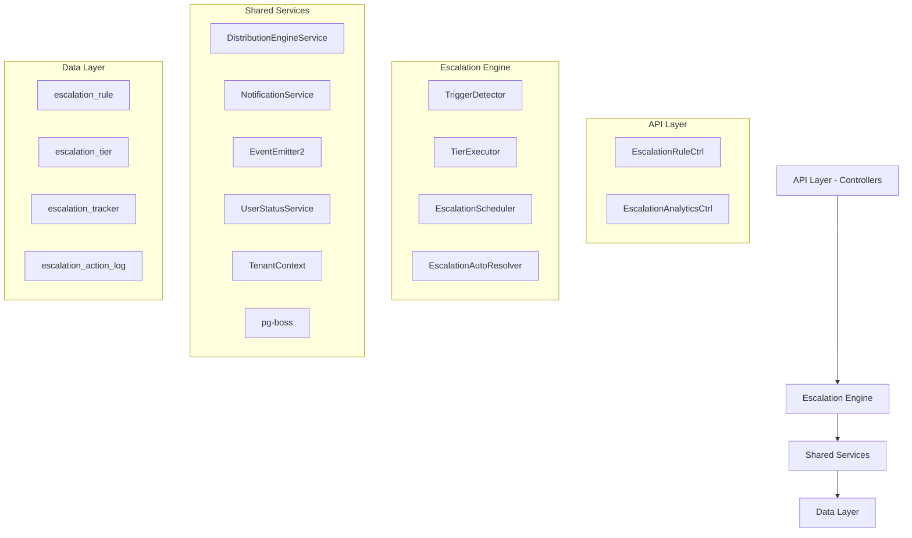

# Escalation Module Specification v9

<Info>
**Status:** Active — fully implemented  
**Module Path:** `src/modules/crm/escalation/`
</Info>

## Overview

The Escalation Module automates responses when assigned leads go stale. A scheduled engine detects trigger conditions (no first contact, went cold) and executes tiered escalation actions — notifications, temperature changes, tag additions, and redistribution to new agents.

### Design Principles

| Principle | Decision |
| --------- | -------- |
| pg-boss scheduling | Escalation scheduler uses pg-boss recurring job for reliability |
| Tiered actions | Rules have ordered tiers with configurable delays; actions execute in sequence |
| Auto-resolution | Events (activity, stage change, reassignment) automatically resolve active trackers |
| Idempotency | Partial unique index + `ON CONFLICT DO NOTHING` prevents duplicate trackers |
| Distribution delegation | Reassignment uses the distribution engine (`REDISTRIBUTE` action), not a separate paradigm |
| RLS compliance | All entities carry `organization_id` for row-level security |

## Architecture

### High-level diagram



### Component responsibilities

<AccordionGroup>
<Accordion title="EscalationScheduler">
pg-boss recurring job that runs every 60 seconds to detect new triggers and process due escalations
</Accordion>

<Accordion title="TriggerDetector">
Scans leads for unmet conditions (no first contact, went cold); creates tracker records
</Accordion>

<Accordion title="TierExecutor">
Executes escalation tier actions (notify, redistribute, change temp, add tag)
</Accordion>

<Accordion title="EscalationAutoResolver">
Listens to domain events and resolves active trackers when conditions change
</Accordion>

<Accordion title="EscalationRuleService">
CRUD for escalation rules; handles tracker cancellation on deactivation/deletion
</Accordion>
</AccordionGroup>

## Entity Specifications

### EscalationRule

<Note>
Defines when and how a lead should be escalated. Evaluated by `TriggerDetector`.
</Note>

| Column | Type | Notes |
| ------ | ---- | ----- |
| id | uuid PK | |
| organization_id | uuid FK | RLS |
| name | varchar | Human-readable rule name |
| is_active | bool | default true |
| priority | int | Evaluation order |
| trigger_type | enum | `NO_FIRST_CONTACT`, `WENT_COLD` |
| trigger_config | jsonb | `{thresholdMinutes?, thresholdValue?, thresholdUnit?}` |
| conditions | jsonb | `EscalationCondition[]` — AND-joined applicability filters; `[]` = all leads |
| respect_business_hours | bool | default true. References org business hours schedule. |
| created_by | uuid FK | |
| created_at, updated_at | timestamp | |
| is_deleted | bool | soft delete |

#### EscalationCondition shape

```typescript
interface EscalationCondition {
  field: 'temperature' | 'leadSource' | 'language' | 'sourceChannel';
  operator: 'eq' | 'in';
  value: string | string[];
}
```

#### SQL field mapping

<Tip>
Used by `TriggerDetector.buildApplicabilityExtraWhere`
</Tip>

| Field | SQL Column | Table | Notes |
| ----- | ---------- | ----- | ----- |
| `temperature` | `l.temperature` | lead | |
| `leadSource` | `l.lead_source` | lead | |
| `sourceChannel` | `l.source_channel` | lead | |
| `language` | `p.language` | person | Adds `LEFT JOIN person p ON p.id = l.person_id` |

### EscalationTier

<Note>
Each tier in an escalation rule represents a delayed action set. Tiers execute in `tier_order` sequence.
</Note>

| Column | Type | Notes |
| ------ | ---- | ----- |
| id | uuid PK | |
| escalation_rule_id | uuid FK | |
| organization_id | uuid FK | RLS |
| tier_order | int | 1, 2, 3... (max 10) |
| delay_minutes | int | Tier 1: always 0 — threshold is the sole timing control. Subsequent tiers: minutes after the previous tier completed. |
| actions | jsonb | `TierAction[]` — see Tier Actions below |

#### Tier action types

<CardGroup cols={2}>
<Card title="NOTIFY_AGENT" icon="bell">
**Parameters:** `message?: string`  
Resolved from lead's current stakeholder (assigned agent)
</Card>

<Card title="NOTIFY_ADMIN" icon="user-shield">
**Parameters:** `message?: string`  
Self-resolving — queries all org users with `system.admin` permission key
</Card>

<Card title="NOTIFY_TEAM_LEAD" icon="users">
**Parameters:** `message?: string`  
Self-resolving — queries team members with `team.admin` permission in lead's assigned team
</Card>

<Card title="REDISTRIBUTE" icon="refresh">
**Parameters:** _(none)_  
Distribution engine delegation — removes current stakeholders and reassigns
</Card>
</CardGroup>

### EscalationTracker

<Warning>
Active escalation state for a specific lead-rule combination. Only one active tracker per lead-rule pair.
</Warning>

| Column | Type | Notes |
| ------ | ---- | ----- |
| id | uuid PK | |
| organization_id | uuid FK | RLS |
| escalation_rule_id | uuid FK | |
| lead_id | uuid FK | |
| current_tier_order | int | Next tier to execute (1-based) |
| triggered_at | timestamp | When escalation started |
| next_action_at | timestamp | When next tier should execute |
| resolved_at | timestamp | When escalation completed/cancelled |
| resolved_by | enum | `MANUAL`, `ACTIVITY`, `STAGE_CHANGE`, `REASSIGNMENT`, `REDISTRIBUTED`, `RULE_DEACTIVATED` |
| created_at, updated_at | timestamp | |

**Unique constraint:** `(lead_id, escalation_rule_id)` where `resolved_at IS NULL`

### EscalationActionLog

<Info>
Audit trail for all escalation actions executed by the engine.
</Info>

| Column | Type | Notes |
| ------ | ---- | ----- |
| id | uuid PK | |
| organization_id | uuid FK | RLS |
| escalation_tracker_id | uuid FK | |
| tier_order | int | Which tier was executed |
| action_type | enum | `NOTIFY_AGENT`, `NOTIFY_ADMIN`, `NOTIFY_TEAM_LEAD`, `REDISTRIBUTE`, `CHANGE_TEMPERATURE`, `ADD_TAG` |
| action_config | jsonb | Original action configuration |
| execution_result | jsonb | Outcome details (success/failure, recipient counts, etc.) |
| executed_at | timestamp | |

## Type Definitions

<CodeGroup>
```typescript TypeScript Types
// Trigger types
enum TriggerType {
  NO_FIRST_CONTACT = 'NO_FIRST_CONTACT',
  WENT_COLD = 'WENT_COLD'
}

// Trigger configurations
interface NoFirstContactConfig {
  thresholdMinutes: number;
}

interface WentColdConfig {
  thresholdValue: number;
  thresholdUnit: 'DAYS' | 'WEEKS';
}

// Action types
enum TierActionType {
  NOTIFY_AGENT = 'NOTIFY_AGENT',
  NOTIFY_ADMIN = 'NOTIFY_ADMIN', 
  NOTIFY_TEAM_LEAD = 'NOTIFY_TEAM_LEAD',
  REDISTRIBUTE = 'REDISTRIBUTE',
  CHANGE_TEMPERATURE = 'CHANGE_TEMPERATURE',
  ADD_TAG = 'ADD_TAG'
}

// Action configurations
interface NotificationAction {
  type: 'NOTIFY_AGENT' | 'NOTIFY_ADMIN' | 'NOTIFY_TEAM_LEAD';
  message?: string;
}

interface RedistributeAction {
  type: 'REDISTRIBUTE';
}

interface ChangeTemperatureAction {
  type: 'CHANGE_TEMPERATURE';
  temperature: 'HOT' | 'WARM' | 'COLD';
}

interface AddTagAction {
  type: 'ADD_TAG';
  tagName: string;
}

type TierAction = NotificationAction | RedistributeAction | ChangeTemperatureAction | AddTagAction;

// Resolution reasons
enum EscalationResolutionReason {
  MANUAL = 'MANUAL',
  ACTIVITY = 'ACTIVITY',
  STAGE_CHANGE = 'STAGE_CHANGE', 
  REASSIGNMENT = 'REASSIGNMENT',
  REDISTRIBUTED = 'REDISTRIBUTED',
  RULE_DEACTIVATED = 'RULE_DEACTIVATED'
}
```
</CodeGroup>

## Escalation Engine

### EscalationScheduler

<Steps>
<Step title="Job Registration">
Registers a recurring pg-boss job `escalation-process` that runs every 60 seconds
</Step>

<Step title="Trigger Detection">
Calls `TriggerDetector` to scan for new escalation triggers
</Step>

<Step title="Due Processing">
Processes escalation trackers where `next_action_at <= NOW()`
</Step>

<Step title="Tier Execution">
Uses `TierExecutor` to run actions for due escalations
</Step>
</Steps>

### TriggerDetector

<Note>
Scans active leads to identify escalation trigger conditions and creates tracker records.
</Note>

#### NO_FIRST_CONTACT detection

```sql
SELECT DISTINCT l.id as lead_id
FROM lead l
LEFT JOIN stakeholder s ON s.lead_id = l.id AND s.role = 'ASSIGNEE'
WHERE l.organization_id = $1
  AND l.stage IN ('NEW', 'CONTACTED', 'QUALIFIED') 
  AND l.assigned_at IS NOT NULL
  AND l.assigned_at <= NOW() - INTERVAL '$2 minutes'
  AND NOT EXISTS (
    SELECT 1 FROM activity a 
    WHERE a.lead_id = l.id 
    AND a.is_first_contact = true
  )
  AND NOT EXISTS (
    SELECT 1 FROM escalation_tracker et
    WHERE et.lead_id = l.id 
    AND et.escalation_rule_id = $3
    AND et.resolved_at IS NULL
  )
```

#### WENT_COLD detection

```sql
SELECT DISTINCT l.id as lead_id  
FROM lead l
LEFT JOIN stakeholder s ON s.lead_id = l.id AND s.role = 'ASSIGNEE'
WHERE l.organization_id = $1
  AND l.stage IN ('NEW', 'CONTACTED', 'QUALIFIED')
  AND l.temperature = 'COLD'
  AND l.temperature_changed_at IS NOT NULL
  AND l.temperature_changed_at <= $2  -- threshold calculation
  AND NOT EXISTS (
    SELECT 1 FROM escalation_tracker et
    WHERE et.lead_id = l.id
    AND et.escalation_rule_id = $3  
    AND et.resolved_at IS NULL
  )
```

### TierExecutor

<Warning>
Executes individual tier actions and handles failures gracefully with detailed logging.
</Warning>

#### Action execution flow

<Steps>
<Step title="Action Resolution">
For notification actions, resolve target users (agents, admins, team leads)
</Step>

<Step title="Action Execution">
Execute the specific action type with error handling
</Step>

<Step title="Result Logging">
Log execution results to `escalation_action_log`
</Step>

<Step title="Tracker Update">
Update tracker's `current_tier_order` and `next_action_at`
</Step>

<Step title="Auto-Resolution Check">
For `REDISTRIBUTE` actions, check if lead was successfully reassigned
</Step>
</Steps>

### EscalationAutoResolver

<Info>
Event-driven component that automatically resolves active escalation trackers when conditions change.
</Info>

#### Resolution triggers

| Event | Resolution Reason | Condition |
| ----- | ---------------- | --------- |
| Activity Created | `ACTIVITY` | Activity has `is_first_contact = true` |
| Lead Stage Changed | `STAGE_CHANGE` | New stage not in `['NEW', 'CONTACTED', 'QUALIFIED']` |
| Lead Reassigned | `REASSIGNMENT` | Stakeholder role `ASSIGNEE` changed |
| Successful Redistribution | `REDISTRIBUTED` | Distribution outcome is `ASSIGNED` |
| Rule Deactivated/Deleted | `RULE_DEACTIVATED` | Rule `is_active = false` or `is_deleted = true` |

## API Endpoints

### Escalation Rules

<Tabs>
<Tab title="List Rules">
```http
GET /api/escalation/rules
Authorization: Bearer {token}

Query Parameters:
- page?: number
- limit?: number  
- isActive?: boolean
- triggerType?: string

Response:
{
  "data": EscalationRule[],
  "pagination": {
    "page": number,
    "limit": number,
    "total": number,
    "totalPages": number
  }
}
```
</Tab>

<Tab title="Create Rule">
```http
POST /api/escalation/rules
Authorization: Bearer {token}
Content-Type: application/json

{
  "name": "No Contact After 24h",
  "triggerType": "NO_FIRST_CONTACT",
  "triggerConfig": {"thresholdMinutes": 1440},
  "conditions": [
    {"field": "temperature", "operator": "in", "value": ["HOT", "WARM"]}
  ],
  "respectBusinessHours": true,
  "tiers": [
    {
      "tierOrder": 1,
      "delayMinutes": 0,
      "actions": [
        {"type": "NOTIFY_AGENT", "message": "Lead needs attention"}
      ]
    }
  ]
}
```
</Tab>

<Tab title="Update Rule">
```http
PUT /api/escalation/rules/{id}
Authorization: Bearer {token}
Content-Type: application/json

{
  "name": "Updated Rule Name",
  "isActive": false
}
```
</Tab>

<Tab title="Delete Rule">
```http
DELETE /api/escalation/rules/{id}
Authorization: Bearer {token}

Response: 204 No Content
```
</Tab>
</Tabs>

### Analytics

<Tabs>
<Tab title="Rule Performance">
```http
GET /api/escalation/analytics/rules/{ruleId}/performance
Authorization: Bearer {token}

Query Parameters:
- startDate: string (ISO date)
- endDate: string (ISO date)

Response:
{
  "ruleId": "uuid",
  "ruleName": "string", 
  "period": {"startDate": "string", "endDate": "string"},
  "metrics": {
    "totalTriggered": number,
    "totalResolved": number,
    "averageResolutionTimeHours": number,
    "resolutionReasons": {
      "ACTIVITY": number,
      "REASSIGNMENT": number,
      "REDISTRIBUTED": number
    }
  },
  "tierMetrics": [
    {
      "tierOrder": number,
      "actionsExecuted": number,
      "actionBreakdown": {
        "NOTIFY_AGENT": number,
        "REDISTRIBUTE": number
      }
    }
  ]
}
```
</Tab>

<Tab title="Organization Overview">
```http
GET /api/escalation/analytics/overview
Authorization: Bearer {token}

Query Parameters:
- period?: '7d' | '30d' | '90d' | 'custom'
- startDate?: string (for custom period)
- endDate?: string (for custom period)

Response:
{
  "period": {"startDate": "string", "endDate": "string"},
  "metrics": {
    "activeRules": number,
    "activeEscalations": number,
    "totalTriggered": number,
    "totalResolved": number,
    "averageResolutionTimeHours": number
  },
  "topRules": [
    {
      "ruleId": "uuid",
      "ruleName": "string",
      "triggeredCount": number
    }
  ]
}
```
</Tab>
</Tabs>

## Security & Permissions

### Required permissions

<CardGroup cols={2}>
<Card title="Rule Management" icon="shield">
- `escalation.rule.create`
- `escalation.rule.read` 
- `escalation.rule.update`
- `escalation.rule.delete`
</Card>

<Card title="Analytics Access" icon="chart-bar">
- `escalation.analytics.read`
- `escalation.tracker.read`
</Card>
</CardGroup>

### Row-level security

<Note>
All escalation entities include `organization_id` and are subject to RLS policies that enforce tenant isolation.
</Note>

```sql
-- Example RLS policy
CREATE POLICY escalation_rule_tenant_isolation ON escalation_rule
  USING (organization_id = current_setting('app.current_organization_id')::uuid);
```

## Analytics & Metrics

### Key performance indicators

| Metric | Description | Calculation |
| ------ | ----------- | ----------- |
| Trigger Rate | Escalations triggered per day | `COUNT(triggered_at) / days` |
| Resolution Rate | Percentage of escalations resolved | `resolved_count / triggered_count * 100` |
| Average Resolution Time | Mean time from trigger to resolution | `AVG(resolved_at - triggered_at)` |
| Action Success Rate | Percentage of successful action executions | `successful_actions / total_actions * 100` |

### Reporting queries

<CodeGroup>
```sql Rule Performance
SELECT 
  er.name,
  COUNT(et.id) as total_triggered,
  COUNT(et.resolved_at) as total_resolved,
  ROUND(AVG(EXTRACT(EPOCH FROM (et.resolved_at - et.triggered_at))/3600), 2) as avg_resolution_hours
FROM escalation_rule er
LEFT JOIN escalation_tracker et ON et.escalation_rule_id = er.id
WHERE er.organization_id = $1 
  AND et.triggered_at >= $2 
  AND et.triggered_at <= $3
GROUP BY er.id, er.name
ORDER BY total_triggered DESC;
```

```sql Action Breakdown
SELECT 
  eal.action_type,
  COUNT(*) as execution_count,
  SUM(CASE WHEN (eal.execution_result->>'success')::boolean THEN 1 ELSE 0 END) as success_count
FROM escalation_action_log eal
JOIN escalation_tracker et ON et.id = eal.escalation_tracker_id  
WHERE eal.organization_id = $1
  AND eal.executed_at >= $2
  AND eal.executed_at <= $3
GROUP BY eal.action_type
ORDER BY execution_count DESC;
```
</CodeGroup>

## Edge Case Handling

### Business hours compliance

<Warning>
When `respect_business_hours = true`, escalation timing calculations account for business hours.
</Warning>

<Steps>
<Step title="Threshold Calculation">
For trigger detection, only business hours count toward the threshold
</Step>

<Step title="Next Action Scheduling">
`next_action_at` is adjusted to the next business hour if calculated time falls outside business hours
</Step>

<Step title="Timezone Handling">
Business hours are interpreted in the organization's configured timezone
</Step>
</Steps>

### Concurrent execution protection

<Tip>
The system uses database constraints and idempotent operations to handle concurrent executions safely.
</Tip>

| Scenario | Protection Mechanism |
| -------- | -------------------- |
| Duplicate trackers | Unique constraint on `(lead_id, escalation_rule_id)` where `resolved_at IS NULL` |
| Concurrent tier execution | pg-boss job locking prevents multiple scheduler instances |
| Rule modification during execution | Trackers reference rule configuration at creation time |

### Failure recovery

<Check>
All operations are designed to be retryable and the system can recover from partial failures.
</Check>

- **Action failures:** Logged but don't prevent tier progression
- **Notification failures:** Retry with exponential backoff  
- **Distribution failures:** Logged; tracker continues to next tier
- **Scheduler crashes:** pg-boss handles job recovery automatically

## Performance & Scaling

### Database optimization

<AccordionGroup>
<Accordion title="Indexes">
```sql
-- Trigger detection optimization
CREATE INDEX escalation_trigger_detection_idx ON lead (organization_id, stage, assigned_at) 
WHERE assigned_at IS NOT NULL;

-- Tracker processing optimization  
CREATE INDEX escalation_tracker_due_idx ON escalation_tracker (organization_id, next_action_at)
WHERE resolved_at IS NULL;

-- Analytics optimization
CREATE INDEX escalation_action_log_analytics_idx ON escalation_action_log (organization_id, executed_at);
```
</Accordion>

<Accordion title="Query Performance">
- Trigger detection queries use covering indexes to minimize table scans
- Analytics queries leverage materialized views for complex aggregations
- Pagination uses cursor-based pagination for large result sets
</Accordion>
</AccordionGroup>

### Scaling considerations

| Component | Scaling Strategy |
| --------- | ---------------- |
| **Scheduler** | Single instance per deployment; pg-boss handles job distribution |
| **Trigger Detection** | Batch processing with configurable batch sizes |
| **Notifications** | Async processing with queue-based delivery |
| **Analytics** | Read replicas and materialized views for reporting |

## RLS Policies

<CodeGroup>
```sql Escalation Rule
CREATE POLICY escalation_rule_tenant_isolation ON escalation_rule
  USING (organization_id = current_setting('app.current_organization_id')::uuid);

CREATE POLICY escalation_rule_select_policy ON escalation_rule
  FOR SELECT USING (
    organization_id = current_setting('app.current_organization_id')::uuid
    AND has_permission(current_setting('app.current_user_id')::uuid, 'escalation.rule.read')
  );
```

```sql Escalation Tracker  
CREATE POLICY escalation_tracker_tenant_isolation ON escalation_tracker
  USING (organization_id = current_setting('app.current_organization_id')::uuid);

CREATE POLICY escalation_tracker_select_policy ON escalation_tracker
  FOR SELECT USING (
    organization_id = current_setting('app.current_organization_id')::uuid
    AND has_permission(current_setting('app.current_user_id')::uuid, 'escalation.tracker.read')
  );
```
</CodeGroup>

## Module Structure

```
src/modules/crm/escalation/
├── controllers/
│   ├── escalation-rule.controller.ts
│   └── escalation-analytics.controller.ts
├── services/
│   ├── escalation-rule.service.ts
│   ├── escalation-engine.service.ts
│   ├── trigger-detector.service.ts
│   ├── tier-executor.service.ts
│   └── escalation-auto-resolver.service.ts
├── entities/
│   ├── escalation-rule.entity.ts
│   ├── escalation-tier.entity.ts
│   ├── escalation-tracker.entity.ts
│   └── escalation-action-log.entity.ts
├── dto/
│   ├── create-escalation-rule.dto.ts
│   ├── update-escalation-rule.dto.ts
│   └── escalation-analytics.dto.ts
├── types/
│   └── escalation.types.ts
├── jobs/
│   └── escalation-scheduler.job.ts
└── escalation.module.ts
```

## Integration Points

### Distribution Engine

<Info>
The escalation module integrates with the distribution engine for lead reassignment.
</Info>

- **Service:** `DistributionEngineService.redistribute()`
- **Method:** Removes current stakeholders and reruns distribution
- **Logging:** Creates `distribution_log` entry with method `REDISTRIBUTION`
- **Resolution:** Auto-resolves tracker on successful assignment

### Notification System  

- **Service:** `NotificationService`
- **Channels:** Email, SMS, in-app notifications
- **Targeting:** Resolves notification recipients based on action type
- **Delivery:** Async processing with retry logic

### Event System

- **Publisher:** `EventEmitter2`
- **Events:** Lead activity, stage changes, reassignments
- **Subscribers:** `EscalationAutoResolver` listens for resolution triggers
- **Decoupling:** Events enable loose coupling between modules