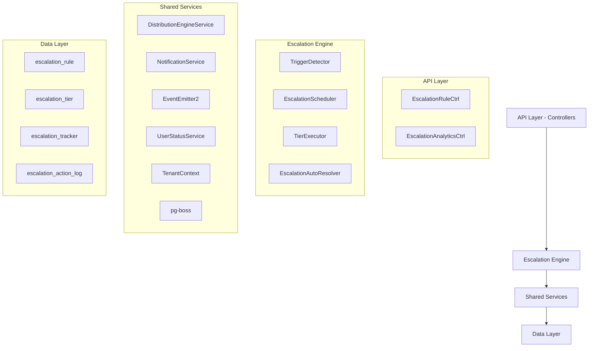

# Escalation Module - Comprehensive Specification

<Info>
**Status:** Active — fully implemented  
**Module Path:** `src/modules/crm/escalation/`
</Info>

The Escalation Module automates responses when assigned leads go stale. A scheduled engine detects trigger conditions (no first contact, went cold) and executes tiered escalation actions — notifications, temperature changes, tag additions, and redistribution to new agents.

## Overview

### Design Principles

The escalation system is built on several key architectural decisions:

<CardGroup cols={2}>
<Card title="pg-boss Scheduling" icon="clock">
Escalation scheduler uses pg-boss recurring job for reliability
</Card>
<Card title="Tiered Actions" icon="stairs">
Rules have ordered tiers with configurable delays; actions execute in sequence
</Card>
<Card title="Auto-resolution" icon="check">
Events (activity, stage change, reassignment) automatically resolve active trackers
</Card>
<Card title="Idempotency" icon="shield">
Partial unique index + `ON CONFLICT DO NOTHING` prevents duplicate trackers
</Card>
</CardGroup>

<Note>
Distribution delegation: Reassignment uses the distribution engine (`REDISTRIBUTE` action), not a separate paradigm. All entities carry `organization_id` for row-level security compliance.
</Note>

## Architecture

### High-Level System Design



### Component Responsibilities

<AccordionGroup>
<Accordion title="EscalationScheduler">
pg-boss recurring job that runs every 60 seconds to detect new triggers and process due escalations
</Accordion>

<Accordion title="TriggerDetector">
Scans leads for unmet conditions (no first contact, went cold); creates tracker records
</Accordion>

<Accordion title="TierExecutor">
Executes escalation tier actions (notify, redistribute, change temp, add tag)
</Accordion>

<Accordion title="EscalationAutoResolver">
Listens to domain events and resolves active trackers when conditions change
</Accordion>

<Accordion title="EscalationRuleService">
CRUD for escalation rules; handles tracker cancellation on deactivation/deletion
</Accordion>
</AccordionGroup>

## Entity Specifications

### EscalationRule

Defines when and how a lead should be escalated. Evaluated by `TriggerDetector`.

| Column | Type | Notes |
|--------|------|-------|
| id | uuid PK | |
| organization_id | uuid FK | RLS |
| name | varchar | Human-readable rule name |
| is_active | bool | default true |
| priority | int | Evaluation order |
| trigger_type | enum | `NO_FIRST_CONTACT`, `WENT_COLD` |
| trigger_config | jsonb | `{thresholdMinutes?, thresholdValue?, thresholdUnit?}` |
| conditions | jsonb | `EscalationCondition[]` — AND-joined applicability filters; `[]` = all leads |
| respect_business_hours | bool | default true. References org business hours schedule. |
| created_by | uuid FK | |
| created_at, updated_at | timestamp | |
| is_deleted | bool | soft delete |

#### EscalationCondition Structure

<CodeGroup>
```typescript EscalationCondition Interface
interface EscalationCondition {
  field: 'temperature' | 'leadSource' | 'language' | 'sourceChannel';
  operator: 'eq' | 'in';
  value: string | string[];
}
```

```sql SQL Field Mapping
-- Used by TriggerDetector.buildApplicabilityExtraWhere
-- temperature   -> l.temperature (lead table)
-- leadSource    -> l.lead_source (lead table)  
-- sourceChannel -> l.source_channel (lead table)
-- language      -> p.language (person table, requires LEFT JOIN)
```
</CodeGroup>

### EscalationTier

Each tier in an escalation rule represents a delayed action set. Tiers execute in `tier_order` sequence.

| Column | Type | Notes |
|--------|------|-------|
| id | uuid PK | |
| escalation_rule_id | uuid FK | |
| organization_id | uuid FK | RLS |
| tier_order | int | 1, 2, 3... (max 10) |
| delay_minutes | int | Tier 1: always 0. Subsequent tiers: minutes after previous tier completed. |
| actions | jsonb | `TierAction[]` — see Tier Actions below |

<Warning>
Tier 1 (lowest tier_order) always has `delay_minutes = 0` because the threshold is the sole timing control. Subsequent tiers specify minutes after the previous tier completed.
</Warning>

### Tier Action Types

<Tabs>
<Tab title="Notification Actions">
| Action Type | Parameters | Resolution |
|-------------|------------|------------|
| `NOTIFY_AGENT` | `message?: string` | Resolved from lead's current stakeholder (assigned agent) |
| `NOTIFY_ADMIN` | `message?: string` | **Self-resolving** — queries all org users with `system.admin` permission |
| `NOTIFY_TEAM_LEAD` | `message?: string` | **Self-resolving** — queries team members with `team.admin` permission |
</Tab>

<Tab title="Lead Actions">
| Action Type | Parameters | Resolution |
|-------------|------------|------------|
| `REDISTRIBUTE` | _(no params)_ | **Distribution engine delegation** — removes stakeholders, calls redistribution |
| `CHANGE_TEMPERATURE` | `temperature: LeadTemperature` | Direct lead update |
| `ADD_TAG` | `tag: string` | Appends to lead's existing tags array |
</Tab>
</Tabs>

<Note>
For `REDISTRIBUTE` action: If the outcome is `ASSIGNED`, the scheduler resolves the tracker with `resolvedBy = REDISTRIBUTED`.
</Note>

## Type Definitions

### Core Enums

<CodeGroup>
```typescript Trigger Types
export enum EscalationTriggerType {
  NO_FIRST_CONTACT = 'NO_FIRST_CONTACT',
  WENT_COLD = 'WENT_COLD'
}
```

```typescript Action Types
export enum TierActionType {
  NOTIFY_AGENT = 'NOTIFY_AGENT',
  NOTIFY_ADMIN = 'NOTIFY_ADMIN', 
  NOTIFY_TEAM_LEAD = 'NOTIFY_TEAM_LEAD',
  REDISTRIBUTE = 'REDISTRIBUTE',
  CHANGE_TEMPERATURE = 'CHANGE_TEMPERATURE',
  ADD_TAG = 'ADD_TAG'
}
```

```typescript Tracker Status
export enum EscalationTrackerStatus {
  ACTIVE = 'ACTIVE',
  RESOLVED = 'RESOLVED'
}

export enum TrackerResolvedBy {
  LEAD_ACTIVITY = 'LEAD_ACTIVITY',
  LEAD_STAGE_CHANGE = 'LEAD_STAGE_CHANGE', 
  LEAD_REASSIGNMENT = 'LEAD_REASSIGNMENT',
  REDISTRIBUTED = 'REDISTRIBUTED',
  RULE_DEACTIVATED = 'RULE_DEACTIVATED',
  MANUAL = 'MANUAL'
}
```
</Tabs>

## Escalation Engine

### Scheduling System

The escalation engine runs on a pg-boss recurring job pattern:

<Steps>
<Step title="Job Registration">
`EscalationScheduler.startRecurringJobs()` registers a job named `escalation-check` that runs every 60 seconds.
</Step>

<Step title="Trigger Detection">
On each run, `TriggerDetector` scans for leads meeting escalation conditions using optimized SQL queries.
</Step>

<Step title="Tracker Creation">
For each eligible lead, creates an `EscalationTracker` record with idempotency protection.
</Step>

<Step title="Tier Execution">
`TierExecutor` processes due escalation tiers based on timing calculations.
</Step>
</Steps>

### Trigger Detection Logic

<Tabs>
<Tab title="NO_FIRST_CONTACT">
```sql
SELECT l.id 
FROM lead l
LEFT JOIN activity a ON l.id = a.lead_id 
  AND a.activity_type = 'FIRST_CONTACT'
  AND a.deleted_at IS NULL
WHERE l.organization_id = $1
  AND l.assigned_at IS NOT NULL
  AND l.assigned_at <= NOW() - INTERVAL '{thresholdMinutes} minutes'
  AND l.stage != 'CONVERTED'
  AND l.stage != 'DISQUALIFIED'  
  AND a.id IS NULL
  AND NOT EXISTS (
    SELECT 1 FROM escalation_tracker et 
    WHERE et.lead_id = l.id 
      AND et.rule_id = $2
      AND et.status = 'ACTIVE'
  )
```
</Tab>

<Tab title="WENT_COLD">
```sql  
SELECT l.id
FROM lead l
LEFT JOIN activity a ON l.id = a.lead_id
  AND a.deleted_at IS NULL
WHERE l.organization_id = $1
  AND l.temperature = 'COLD'
  AND l.stage != 'CONVERTED' 
  AND l.stage != 'DISQUALIFIED'
  AND l.updated_at <= NOW() - INTERVAL '{thresholdMinutes} minutes'
  AND NOT EXISTS (
    SELECT 1 FROM escalation_tracker et
    WHERE et.lead_id = l.id
      AND et.rule_id = $2  
      AND et.status = 'ACTIVE'
  )
```
</Tab>
</Tabs>

### Auto-Resolution Events

The system automatically resolves active trackers when trigger conditions are no longer met:

<CardGroup cols={2}>
<Card title="Lead Activity" icon="activity">
Any new activity on the lead resolves `NO_FIRST_CONTACT` trackers
</Card>
<Card title="Stage Changes" icon="arrow-right">
Moving to CONVERTED or DISQUALIFIED resolves all active trackers
</Card>
<Card title="Temperature Changes" icon="thermometer">
Temperature changes from COLD resolve `WENT_COLD` trackers
</Card>
<Card title="Reassignment" icon="user-group">
Stakeholder changes resolve all active trackers for that lead
</Card>
</CardGroup>

## API Endpoints

### Escalation Rules

<CodeGroup>
```typescript GET /escalation-rules
// List escalation rules with pagination
interface ListEscalationRulesQuery {
  page?: number;
  limit?: number; 
  isActive?: boolean;
  triggerType?: EscalationTriggerType;
}

interface EscalationRuleListResponse {
  rules: EscalationRuleWithTiers[];
  pagination: PaginationMeta;
}
```

```typescript POST /escalation-rules
// Create new escalation rule
interface CreateEscalationRuleDto {
  name: string;
  triggerType: EscalationTriggerType;
  triggerConfig: TriggerConfig;
  conditions: EscalationCondition[];
  respectBusinessHours: boolean;
  priority: number;
  tiers: CreateTierDto[];
}
```

```typescript PUT /escalation-rules/:id
// Update escalation rule
interface UpdateEscalationRuleDto {
  name?: string;
  triggerConfig?: TriggerConfig;
  conditions?: EscalationCondition[];
  respectBusinessHours?: boolean;
  priority?: number;
  isActive?: boolean;
  tiers?: UpdateTierDto[];
}
```
</CodeGroup>

### Analytics & Tracking

<CodeGroup>
```typescript GET /escalation-analytics/overview
// Get escalation metrics overview
interface EscalationAnalyticsQuery {
  startDate: string;
  endDate: string;
  ruleIds?: string[];
}

interface EscalationOverviewResponse {
  totalEscalations: number;
  activeTrackers: number;
  resolutionRate: number;
  avgResolutionTime: number;
  escalationsByRule: RuleMetrics[];
  escalationsByTrigger: TriggerMetrics[];
}
```

```typescript GET /escalation-analytics/trackers
// List escalation trackers with filtering
interface TrackerListQuery {
  page?: number;
  limit?: number;
  status?: EscalationTrackerStatus;
  ruleId?: string;
  leadId?: string;
  startDate?: string;
  endDate?: string;
}
```
</CodeGroup>

## Security & Permissions

### Required Permissions

<Tabs>
<Tab title="Rule Management">
| Action | Permission | Notes |
|--------|------------|-------|
| Create Rule | `escalation.rule.create` | |
| Update Rule | `escalation.rule.update` | |
| Delete Rule | `escalation.rule.delete` | Soft delete only |
| View Rules | `escalation.rule.read` | |
| Toggle Rule Status | `escalation.rule.update` | isActive field |
</Tab>

<Tab title="Analytics">
| Action | Permission | Notes |
|--------|------------|-------|
| View Analytics | `escalation.analytics.read` | Dashboard access |
| Export Data | `escalation.analytics.export` | CSV/Excel exports |
| View Trackers | `escalation.tracker.read` | Individual tracker details |
</Tab>
</Tabs>

### Row Level Security

All escalation entities implement organization-scoped RLS policies:

<CodeGroup>
```sql escalation_rule RLS
CREATE POLICY escalation_rule_org_isolation ON escalation_rule
  FOR ALL TO authenticated
  USING (organization_id = get_current_organization_id());
```

```sql escalation_tracker RLS  
CREATE POLICY escalation_tracker_org_isolation ON escalation_tracker
  FOR ALL TO authenticated  
  USING (organization_id = get_current_organization_id());
```
</CodeGroup>

<Warning>
The `get_current_organization_id()` function must be properly set in the database session context before any escalation operations.
</Warning>

## Analytics & Metrics

### Key Performance Indicators

<CardGroup cols={2}>
<Card title="Escalation Volume" icon="chart-line">
- Total escalations triggered
- Escalations by rule and trigger type
- Peak escalation periods
</Card>
<Card title="Resolution Metrics" icon="target">
- Resolution rate percentage
- Average resolution time
- Resolution methods breakdown
</Card>
<Card title="Rule Effectiveness" icon="bullseye">
- Most triggered rules
- Rule performance comparison
- Tier execution distribution
</Card>
<Card title="Lead Impact" icon="users">
- Leads with multiple escalations
- Post-escalation conversion rates
- Temperature change effectiveness
</Card>
</CardGroup>

### Tracking Tables

<CodeGroup>
```sql escalation_tracker
-- Tracks active and resolved escalations
CREATE TABLE escalation_tracker (
  id uuid PRIMARY KEY,
  organization_id uuid NOT NULL,
  lead_id uuid NOT NULL,
  rule_id uuid NOT NULL,
  status escalation_tracker_status DEFAULT 'ACTIVE',
  triggered_at timestamp DEFAULT NOW(),
  last_tier_executed int DEFAULT 0,
  next_tier_due_at timestamp,
  resolved_at timestamp,
  resolved_by tracker_resolved_by,
  created_at timestamp DEFAULT NOW(),
  
  UNIQUE (lead_id, rule_id) WHERE status = 'ACTIVE'
);
```

```sql escalation_action_log
-- Audit trail of all escalation actions
CREATE TABLE escalation_action_log (
  id uuid PRIMARY KEY,
  organization_id uuid NOT NULL,
  tracker_id uuid NOT NULL,
  tier_id uuid NOT NULL,
  action_type tier_action_type NOT NULL,
  action_config jsonb,
  executed_at timestamp DEFAULT NOW(),
  execution_result jsonb,
  error_message text
);
```
</CodeGroup>

## Edge Case Handling

### Business Hours Compliance

<Steps>
<Step title="Schedule Check">
When `respect_business_hours = true`, the system checks the organization's business schedule before executing tiers.
</Step>

<Step title="Delay Calculation">
If execution would occur outside business hours, the next tier due time is calculated to the next business day start.
</Step>

<Step title="Weekend Handling">
Escalations due on weekends are delayed to the next business day unless 24/7 operation is configured.
</Step>
</Steps>

### Concurrent Modification Protection

<Note>
The system uses database-level constraints and application-level locking to prevent race conditions:

- Unique partial index on `(lead_id, rule_id)` where `status = 'ACTIVE'`
- `ON CONFLICT DO NOTHING` for tracker creation
- Optimistic locking with version fields for rule updates
</Note>

### Failed Action Recovery

<Tabs>
<Tab title="Notification Failures">
- Failed notifications are logged but don't block tier progression
- Retry logic with exponential backoff for transient failures
- Dead letter queue for persistent notification failures
</Tab>

<Tab title="Distribution Failures">
- If redistribution fails, the original assignment is preserved
- Error details logged in `escalation_action_log`
- Manual intervention required for redistribution failures
</Tab>
</Tabs>

## Performance & Scaling

### Query Optimization

The trigger detection queries are optimized for large datasets:

<CodeGroup>
```sql Optimized Indexes
-- Core indexes for trigger detection
CREATE INDEX CONCURRENTLY idx_lead_assigned_at_org 
  ON lead (organization_id, assigned_at) 
  WHERE assigned_at IS NOT NULL;

CREATE INDEX CONCURRENTLY idx_lead_temperature_stage_org
  ON lead (organization_id, temperature, stage);

CREATE INDEX CONCURRENTLY idx_escalation_tracker_active
  ON escalation_tracker (lead_id, rule_id, status)
  WHERE status = 'ACTIVE';
```

```sql Batch Processing
-- Process triggers in batches to avoid long-running transactions
SELECT l.id 
FROM lead l
WHERE /* trigger conditions */
ORDER BY l.assigned_at ASC
LIMIT 1000; -- Configurable batch size
```
</CodeGroup>

### Memory Management

<Tip>
The escalation scheduler processes leads in configurable batches (default 1000) to prevent memory exhaustion on large organizations with millions of leads.
</Tip>

### Monitoring & Alerting

Key metrics to monitor:

- Escalation job execution time
- Failed escalation attempts
- Queue depth and processing lag
- Database connection pool usage during peak processing

<Check>
Set up alerts when escalation job execution exceeds 30 seconds or when more than 5% of escalations fail within an hour.
</Check>

## Integration Points

### External Systems

<CardGroup cols={2}>
<Card title="Notification Service" icon="bell">
Handles email, SMS, and in-app notifications for escalation actions
</Card>
<Card title="Distribution Engine" icon="share">
Manages lead reassignment through the redistribution pipeline
</Card>
<Card title="Activity Tracking" icon="list">
Monitors lead activities to trigger auto-resolution
</Card>
<Card title="Business Hours Service" icon="clock">
Provides organization schedule data for timing calculations
</Card>
</CardGroup>

### Event Integration

The escalation system both emits and consumes domain events:

<Tabs>
<Tab title="Emitted Events">
```typescript
// Events emitted by escalation system
interface EscalationTriggeredEvent {
  leadId: string;
  ruleId: string;
  trackerId: string;
  triggerType: EscalationTriggerType;
}

interface EscalationResolvedEvent {
  leadId: string;
  trackerId: string;
  resolvedBy: TrackerResolvedBy;
  resolutionTime: number;
}
```
</Tab>

<Tab title="Consumed Events">
```typescript
// Events that trigger auto-resolution
interface LeadActivityEvent {
  leadId: string;
  activityType: string;
  timestamp: Date;
}

interface LeadStageChangedEvent {
  leadId: string;
  oldStage: string;
  newStage: string;
  timestamp: Date;
}

interface LeadReassignedEvent {
  leadId: string;
  oldAssigneeId?: string;
  newAssigneeId?: string;
  timestamp: Date;
}
```
</Tab>
</Tabs>

This comprehensive escalation module provides automated, configurable, and scalable lead management with full audit trails and robust error handling.