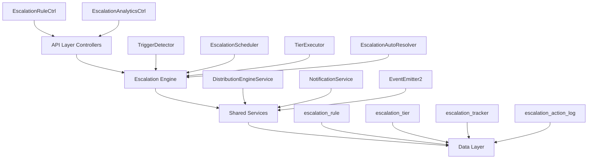

# Escalation Module Specification - Comprehensive

<Note>
**Status:** Active — fully implemented  
**Module Path:** `src/modules/crm/escalation/`
</Note>

## Overview

The Escalation Module automates responses when assigned leads go stale. A scheduled engine detects trigger conditions (no first contact, went cold) and executes tiered escalation actions — notifications, temperature changes, tag additions, and redistribution to new agents.

### Design Principles

<CardGroup cols={2}>
  <Card title="pg-boss Scheduling" icon="clock">
    Escalation scheduler uses pg-boss recurring job for reliability
  </Card>
  <Card title="Tiered Actions" icon="layer-group">
    Rules have ordered tiers with configurable delays; actions execute in sequence
  </Card>
  <Card title="Auto-resolution" icon="check-circle">
    Events (activity, stage change, reassignment) automatically resolve active trackers
  </Card>
  <Card title="Distribution Delegation" icon="random">
    Reassignment uses the distribution engine (`REDISTRIBUTE` action), not a separate paradigm
  </Card>
</CardGroup>

| Principle | Decision |
|-----------|----------|
| **Idempotency** | Partial unique index + `ON CONFLICT DO NOTHING` prevents duplicate trackers |
| **RLS Compliance** | All entities carry `organization_id` for row-level security |

## Architecture

### High-Level Diagram



### Component Responsibilities

<AccordionGroup>
  <Accordion title="EscalationScheduler">
    pg-boss recurring job that runs every 60 seconds to detect new triggers and process due escalations
  </Accordion>
  <Accordion title="TriggerDetector">
    Scans leads for unmet conditions (no first contact, went cold); creates tracker records
  </Accordion>
  <Accordion title="TierExecutor">
    Executes escalation tier actions (notify, redistribute, change temp, add tag)
  </Accordion>
  <Accordion title="EscalationAutoResolver">
    Listens to domain events and resolves active trackers when conditions change
  </Accordion>
  <Accordion title="EscalationRuleService">
    CRUD for escalation rules; handles tracker cancellation on deactivation/deletion
  </Accordion>
</AccordionGroup>

## Entity Specifications

### EscalationRule

Defines when and how a lead should be escalated. Evaluated by `TriggerDetector`.

<CodeGroup>
```sql Schema
CREATE TABLE escalation_rule (
  id uuid PRIMARY KEY,
  organization_id uuid NOT NULL REFERENCES organization(id),
  name varchar NOT NULL,
  is_active boolean DEFAULT true,
  priority integer NOT NULL,
  trigger_type escalation_trigger_type NOT NULL,
  trigger_config jsonb NOT NULL DEFAULT '{}',
  condition_groups jsonb NOT NULL DEFAULT '[]',
  respect_business_hours boolean DEFAULT true,
  created_by uuid REFERENCES "user"(id),
  created_at timestamp DEFAULT now(),
  updated_at timestamp DEFAULT now(),
  is_deleted boolean DEFAULT false
);
```

```typescript Types
interface EscalationRule {
  id: string;
  organizationId: string;
  name: string;
  isActive: boolean;
  priority: number;
  triggerType: 'NO_FIRST_CONTACT' | 'WENT_COLD';
  triggerConfig: {
    thresholdMinutes?: number;
    thresholdValue?: number;
    thresholdUnit?: 'MINUTES' | 'HOURS' | 'DAYS';
  };
  conditionGroups: ConditionGroup[];
  respectBusinessHours: boolean;
  createdBy: string;
  createdAt: Date;
  updatedAt: Date;
  isDeleted: boolean;
}
```
</CodeGroup>

<Warning>
Rules are evaluated in ascending `priority` order (lower number = higher priority). Active rules must use unique priorities within the organization.
</Warning>

#### Priority Management

<Steps>
  <Step title="Frontend Defaults">
    When creating a rule, the frontend defaults `priority` to one greater than the highest active escalation rule priority from the loaded rule list
  </Step>
  <Step title="Edit Mode">
    Edit mode preserves the existing rule priority
  </Step>
  <Step title="Validation">
    Frontend create/edit sheet disables submission when an active rule would reuse another active rule's priority
  </Step>
  <Step title="Backend Enforcement">
    Backend enforces the invariant on create, priority update, and reactivation
  </Step>
</Steps>

#### Duplicate Rule Prevention

Rule `name` is a display label only — duplicate names are allowed. The backend rejects create/update when another **non-deleted** rule in the same organization has an identical **behavior fingerprint**.

<Tip>
Fingerprint includes: `triggerType`, normalized `triggerConfig`, canonical `conditionGroups`, and canonical tiers/actions
</Tip>

#### Applicability Conditions

Escalation reuses the shared rule-condition module. Stored shape matches distribution rules:

```typescript
interface ConditionGroup {
  conditions: RuleCondition[]; // AND within group
}
// A lead matches when ANY group fully passes. Empty conditionGroups[] = all leads.
```

### EscalationTier

Each tier in an escalation rule represents a delayed action set. Tiers execute in `tier_order` sequence.

<CodeGroup>
```sql Schema
CREATE TABLE escalation_tier (
  id uuid PRIMARY KEY,
  escalation_rule_id uuid NOT NULL REFERENCES escalation_rule(id) ON DELETE CASCADE,
  tier_order integer NOT NULL,
  delay_minutes integer NOT NULL,
  created_at timestamp DEFAULT now(),
  updated_at timestamp DEFAULT now()
);
```

```typescript Types
interface EscalationTier {
  id: string;
  escalationRuleId: string;
  tierOrder: number;
  delayMinutes: number;
  createdAt: Date;
  updatedAt: Date;
}
```
</CodeGroup>

### EscalationAction

Actions within a tier that execute when the tier triggers.

<CodeGroup>
```sql Schema
CREATE TABLE escalation_action (
  id uuid PRIMARY KEY,
  escalation_tier_id uuid NOT NULL REFERENCES escalation_tier(id) ON DELETE CASCADE,
  action_type escalation_action_type NOT NULL,
  action_params jsonb NOT NULL DEFAULT '{}',
  created_at timestamp DEFAULT now(),
  updated_at timestamp DEFAULT now()
);
```

```typescript Types
interface EscalationAction {
  id: string;
  escalationTierId: string;
  actionType: 'NOTIFY' | 'REDISTRIBUTE' | 'CHANGE_TEMPERATURE' | 'ADD_TAG';
  actionParams: {
    userIds?: string[];
    message?: string;
    temperature?: string;
    tagId?: string;
  };
  createdAt: Date;
  updatedAt: Date;
}
```
</CodeGroup>

### EscalationTracker

Tracks the escalation lifecycle for a specific lead-rule pair.

<CodeGroup>
```sql Schema
CREATE TABLE escalation_tracker (
  id uuid PRIMARY KEY,
  organization_id uuid NOT NULL REFERENCES organization(id),
  lead_id uuid NOT NULL REFERENCES lead(id) ON DELETE CASCADE,
  escalation_rule_id uuid NOT NULL REFERENCES escalation_rule(id) ON DELETE CASCADE,
  current_tier_order integer DEFAULT 0,
  next_escalation_at timestamp,
  status escalation_status DEFAULT 'ACTIVE',
  resolved_at timestamp,
  resolved_reason varchar,
  created_at timestamp DEFAULT now(),
  updated_at timestamp DEFAULT now()
);
```

```typescript Types
interface EscalationTracker {
  id: string;
  organizationId: string;
  leadId: string;
  escalationRuleId: string;
  currentTierOrder: number;
  nextEscalationAt?: Date;
  status: 'ACTIVE' | 'RESOLVED' | 'CANCELLED';
  resolvedAt?: Date;
  resolvedReason?: string;
  createdAt: Date;
  updatedAt: Date;
}
```
</CodeGroup>

## Type Definitions

### Trigger Types

<Tabs>
  <Tab title="NO_FIRST_CONTACT">
    Triggers when a lead has been assigned but no first contact has been made within the threshold period.
    
    ```typescript
    triggerConfig: {
      thresholdValue: number;
      thresholdUnit: 'MINUTES' | 'HOURS' | 'DAYS';
    }
    ```
  </Tab>
  <Tab title="WENT_COLD">
    Triggers when a lead's temperature changes to COLD.
    
    ```typescript
    triggerConfig: {} // No additional config needed
    ```
  </Tab>
</Tabs>

### Action Types

<AccordionGroup>
  <Accordion title="NOTIFY">
    Send notifications to specified users
    ```typescript
    actionParams: {
      userIds: string[];
      message?: string;
    }
    ```
  </Accordion>
  
  <Accordion title="REDISTRIBUTE">
    Reassign lead using distribution engine
    ```typescript
    actionParams: {} // Uses default distribution logic
    ```
  </Accordion>
  
  <Accordion title="CHANGE_TEMPERATURE">
    Change lead temperature
    ```typescript
    actionParams: {
      temperature: 'HOT' | 'WARM' | 'COLD';
    }
    ```
  </Accordion>
  
  <Accordion title="ADD_TAG">
    Add tag to lead
    ```typescript
    actionParams: {
      tagId: string;
    }
    ```
  </Accordion>
</AccordionGroup>

## Escalation Engine

### Scheduler Architecture

The escalation engine runs on a pg-boss recurring job every 60 seconds:

<Steps>
  <Step title="Trigger Detection">
    Scan for leads that meet escalation trigger conditions
  </Step>
  <Step title="Tracker Creation">
    Create new escalation trackers for triggered leads
  </Step>
  <Step title="Tier Processing">
    Execute actions for trackers with due escalations
  </Step>
  <Step title="Business Hours">
    Respect organization business hours when configured
  </Step>
</Steps>

### Trigger Detection Logic

<CodeGroup>
```typescript NO_FIRST_CONTACT
async detectNoFirstContactTriggers(rule: EscalationRule): Promise<Lead[]> {
  const thresholdDate = this.calculateThresholdDate(
    rule.triggerConfig,
    rule.respectBusinessHours
  );
  
  return this.leadScanService.scanLeads({
    organizationId: rule.organizationId,
    assignedBefore: thresholdDate,
    hasFirstContact: false,
    conditionGroups: rule.conditionGroups,
    excludeExistingTrackers: true
  });
}
```

```typescript WENT_COLD
async detectWentColdTriggers(rule: EscalationRule): Promise<Lead[]> {
  return this.leadScanService.scanLeads({
    organizationId: rule.organizationId,
    temperature: 'COLD',
    conditionGroups: rule.conditionGroups,
    excludeExistingTrackers: true,
    temperatureChangedSince: this.getLastRunTime()
  });
}
```
</CodeGroup>

### Auto-Resolution

The escalation engine automatically resolves active trackers when leads change state:

<Info>
Resolution events include: activity logged, stage change, temperature change, reassignment, lead deletion
</Info>

```typescript
@OnEvent('lead.activity.created')
async handleLeadActivity(event: LeadActivityEvent): Promise<void> {
  await this.escalationTrackerService.resolveActiveTrackers(
    event.leadId,
    'ACTIVITY_LOGGED'
  );
}
```

## API Endpoints

### Escalation Rules

<CodeGroup>
```typescript GET /escalation-rules
// List escalation rules with pagination
interface GetEscalationRulesQuery {
  page?: number;
  limit?: number;
  search?: string;
  isActive?: boolean;
}

interface EscalationRuleListResponse {
  data: EscalationRuleDto[];
  total: number;
  page: number;
  limit: number;
}
```

```typescript POST /escalation-rules
// Create new escalation rule
interface CreateEscalationRuleDto {
  name: string;
  triggerType: EscalationTriggerType;
  triggerConfig: TriggerConfigDto;
  conditionGroups?: ConditionGroupDto[];
  respectBusinessHours?: boolean;
  tiers: CreateEscalationTierDto[];
}
```

```typescript PUT /escalation-rules/:id
// Update escalation rule
interface UpdateEscalationRuleDto {
  name?: string;
  isActive?: boolean;
  priority?: number;
  triggerConfig?: TriggerConfigDto;
  conditionGroups?: ConditionGroupDto[];
  respectBusinessHours?: boolean;
  tiers?: UpdateEscalationTierDto[];
}
```

```typescript DELETE /escalation-rules/:id
// Soft delete escalation rule
// Returns 204 No Content on success
```
</CodeGroup>

### Analytics

<CodeGroup>
```typescript GET /escalation-rules/:id/analytics
// Get escalation rule analytics
interface EscalationAnalyticsResponse {
  ruleId: string;
  totalTriggers: number;
  activeTrackers: number;
  resolvedTrackers: number;
  averageResolutionTime: number;
  actionBreakdown: {
    [actionType: string]: number;
  };
  triggerTrend: Array<{
    date: string;
    count: number;
  }>;
}
```

```typescript GET /escalation-rules/:id/trackers
// List escalation trackers for a rule
interface GetTrackersQuery {
  page?: number;
  limit?: number;
  status?: EscalationStatus;
  leadId?: string;
}
```
</CodeGroup>

## Security & Permissions

### Row-Level Security

<Warning>
All escalation entities include `organization_id` and are protected by RLS policies
</Warning>

```sql
-- Example RLS policy for escalation_rule
CREATE POLICY escalation_rule_org_isolation ON escalation_rule
  FOR ALL
  TO authenticated
  USING (organization_id = current_setting('app.current_organization_id')::uuid);
```

### Permission Requirements

<Tabs>
  <Tab title="Create Rules">
    - `escalation:rules:create`
    - Must be organization admin or have escalation management permissions
  </Tab>
  <Tab title="Update Rules">
    - `escalation:rules:update`
    - Can only modify rules within own organization
  </Tab>
  <Tab title="View Analytics">
    - `escalation:analytics:view`
    - Can view analytics for rules within own organization
  </Tab>
  <Tab title="Manage Trackers">
    - `escalation:trackers:manage`
    - Can manually resolve or cancel trackers
  </Tab>
</Tabs>

## Analytics & Metrics

### Key Metrics

<CardGroup cols={2}>
  <Card title="Trigger Rate" icon="chart-line">
    Number of escalations triggered per time period
  </Card>
  <Card title="Resolution Rate" icon="percentage">
    Percentage of escalations that resolve automatically
  </Card>
  <Card title="Average Resolution Time" icon="stopwatch">
    Mean time from trigger to resolution
  </Card>
  <Card title="Action Effectiveness" icon="target">
    Success rate by action type
  </Card>
</CardGroup>

### Reporting Queries

<CodeGroup>
```sql Trigger Trends
SELECT 
  DATE_TRUNC('day', created_at) as date,
  COUNT(*) as trigger_count
FROM escalation_tracker 
WHERE organization_id = $1 
  AND created_at >= $2
GROUP BY DATE_TRUNC('day', created_at)
ORDER BY date;
```

```sql Resolution Analysis
SELECT 
  resolved_reason,
  COUNT(*) as count,
  AVG(EXTRACT(EPOCH FROM (resolved_at - created_at))/60) as avg_resolution_minutes
FROM escalation_tracker 
WHERE organization_id = $1 
  AND status = 'RESOLVED'
  AND resolved_at >= $2
GROUP BY resolved_reason;
```
</CodeGroup>

## Edge Case Handling

### Business Hours Calculation

<Steps>
  <Step title="Timezone Handling">
    All business hours calculations use organization timezone
  </Step>
  <Step title="Weekend Exclusion">
    Escalation delays pause during weekends when business hours are respected
  </Step>
  <Step title="Holiday Support">
    Integration with organization holiday calendar (future enhancement)
  </Step>
</Steps>

### Concurrent Modifications

<Check>
The system handles concurrent rule modifications gracefully:
</Check>

- **Rule Deletion**: Active trackers are cancelled automatically
- **Rule Deactivation**: Existing trackers continue but no new ones are created
- **Priority Changes**: Validated to prevent conflicts with other active rules
- **Condition Updates**: Existing trackers continue with original conditions

### Error Recovery

<Warning>
Failed escalation actions are logged but don't block subsequent tiers
</Warning>

```typescript
try {
  await this.executeAction(action, tracker);
} catch (error) {
  await this.logActionError(action, tracker, error);
  // Continue with next action
}
```

## Performance & Scaling

### Database Optimization

<AccordionGroup>
  <Accordion title="Indexes">
    ```sql
    -- Escalation rule lookup
    CREATE INDEX idx_escalation_rule_org_active 
    ON escalation_rule(organization_id, is_active, priority);
    
    -- Tracker processing
    CREATE INDEX idx_escalation_tracker_next_escalation 
    ON escalation_tracker(organization_id, status, next_escalation_at);
    
    -- Lead scanning
    CREATE INDEX idx_lead_assigned_temperature 
    ON lead(organization_id, assigned_to_user_id, temperature, assigned_at);
    ```
  </Accordion>
  
  <Accordion title="Partitioning Strategy">
    - Consider partitioning `escalation_action_log` by month for high-volume organizations
    - Archive resolved trackers older than 1 year
  </Accordion>
</AccordionGroup>

### Scaling Considerations

<Tabs>
  <Tab title="Horizontal Scaling">
    - pg-boss ensures only one scheduler instance runs at a time
    - Multiple API instances can handle read/write operations
    - Database connection pooling for optimal resource usage
  </Tab>
  <Tab title="Batch Processing">
    - Process escalations in batches to avoid long-running transactions
    - Configurable batch size based on organization size
    - Rate limiting for notification actions
  </Tab>
</Tabs>

### Performance Monitoring

<CodeGroup>
```typescript Metrics
// Key performance indicators
interface EscalationMetrics {
  schedulerRunTime: number;
  triggersProcessed: number;
  actionsExecuted: number;
  errorRate: number;
  queueDepth: number;
}
```

```typescript Alerts
// Performance alerts
const PERFORMANCE_THRESHOLDS = {
  MAX_RUN_TIME: 30000, // 30 seconds
  MAX_ERROR_RATE: 0.05, // 5%
  MAX_QUEUE_DEPTH: 1000
};
```
</CodeGroup>

## RLS Policies

All escalation entities implement row-level security for multi-tenant isolation:

<CodeGroup>
```sql Escalation Rules
CREATE POLICY escalation_rule_org_isolation ON escalation_rule
  FOR ALL TO authenticated
  USING (organization_id = current_setting('app.current_organization_id')::uuid);

CREATE POLICY escalation_rule_created_by ON escalation_rule
  FOR UPDATE TO authenticated
  USING (created_by = current_setting('app.current_user_id')::uuid);
```

```sql Escalation Trackers
CREATE POLICY escalation_tracker_org_isolation ON escalation_tracker
  FOR ALL TO authenticated
  USING (organization_id = current_setting('app.current_organization_id')::uuid);
```

```sql Action Logs
CREATE POLICY escalation_action_log_org_isolation ON escalation_action_log
  FOR ALL TO authenticated
  USING (organization_id = current_setting('app.current_organization_id')::uuid);
```
</CodeGroup>

## Module Structure

```
src/modules/crm/escalation/
├── controllers/
│   ├── escalation-rule.controller.ts
│   └── escalation-analytics.controller.ts
├── services/
│   ├── escalation-rule.service.ts
│   ├── escalation-tracker.service.ts
│   ├── escalation-engine.service.ts
│   └── escalation-analytics.service.ts
├── entities/
│   ├── escalation-rule.entity.ts
│   ├── escalation-tier.entity.ts
│   ├── escalation-action.entity.ts
│   ├── escalation-tracker.entity.ts
│   └── escalation-action-log.entity.ts
├── dto/
│   ├── create-escalation-rule.dto.ts
│   ├── update-escalation-rule.dto.ts
│   └── escalation-analytics.dto.ts
├── types/
│   └── escalation.types.ts
├── utils/
│   └── escalation-rule-fingerprint.util.ts
└── escalation.module.ts
```

## Integration Points

### Distribution Engine

<Info>
Escalation rules use the distribution engine for lead reassignment via the `REDISTRIBUTE` action type
</Info>

```typescript
await this.distributionEngineService.redistributeLead({
  leadId: tracker.leadId,
  reason: 'ESCALATION',
  escalationRuleId: tracker.escalationRuleId
});
```

### Notification System

<CodeGroup>
```typescript Email Notifications
await this.notificationService.sendEscalationAlert({
  recipients: action.actionParams.userIds,
  leadId: tracker.leadId,
  escalationRuleId: tracker.escalationRuleId,
  message: action.actionParams.message,
  tier: currentTier.tierOrder
});
```

```typescript In-App Notifications
await this.notificationService.createInAppNotification({
  userId: recipientId,
  type: 'ESCALATION_ALERT',
  entityType: 'lead',
  entityId: tracker.leadId,
  data: {
    escalationRuleId: tracker.escalationRuleId,
    tierOrder: currentTier.tierOrder
  }
});
```
</CodeGroup>

### Event System

The escalation module integrates with the domain event system for automatic resolution:

```typescript
// Event listeners for auto-resolution
@OnEvent('lead.activity.created')
@OnEvent('lead.stage.changed')  
@OnEvent('lead.temperature.changed')
@OnEvent('lead.assigned')
@OnEvent('lead.deleted')
async handleLeadEvent(event: LeadEvent): Promise<void> {
  await this.resolveActiveTrackers(event.leadId, event.type);
}
```

<Tip>
This comprehensive specification covers all aspects of the escalation module including architecture, data models, API design, security, and performance considerations.
</Tip>