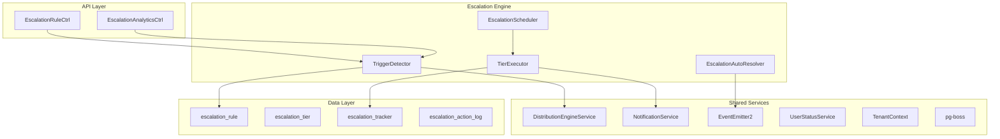

<Note>
**Status:** Active — fully implemented  
**Module Path:** `src/modules/crm/escalation/`
</Note>

The Escalation Module automates responses when assigned leads go stale. A scheduled engine detects trigger conditions (no first contact, went cold) and executes tiered escalation actions — notifications, temperature changes, tag additions, and redistribution to new agents.

## Design principles

<CardGroup cols={2}>
  <Card title="pg-boss Scheduling" icon="clock">
    Escalation scheduler uses pg-boss recurring job for reliability
  </Card>
  <Card title="Tiered Actions" icon="layer-group">
    Rules have ordered tiers with configurable delays; actions execute in sequence
  </Card>
  <Card title="Auto-resolution" icon="check-circle">
    Events (activity, stage change, reassignment) automatically resolve active trackers
  </Card>
  <Card title="Idempotency" icon="shield">
    Partial unique index + `ON CONFLICT DO NOTHING` prevents duplicate trackers
  </Card>
  <Card title="Distribution Delegation" icon="arrow-right-arrow-left">
    Reassignment uses the distribution engine (`REDISTRIBUTE` action), not a separate paradigm
  </Card>
  <Card title="RLS Compliance" icon="lock">
    All entities carry `organization_id` for row-level security
  </Card>
</CardGroup>

## Architecture

### High-level diagram



### Component responsibilities

| Component | Responsibility |
|-----------|----------------|
| **EscalationScheduler** | pg-boss recurring job that runs every 60 seconds to detect new triggers and process due escalations |
| **TriggerDetector** | Scans leads for unmet conditions (no first contact, went cold); creates tracker records |
| **TierExecutor** | Executes escalation tier actions (notify, redistribute, change temp, add tag) |
| **EscalationAutoResolver** | Listens to domain events and resolves active trackers when conditions change |
| **EscalationRuleService** | CRUD for escalation rules; handles tracker cancellation on deactivation/deletion |

## Entity specifications

### EscalationRule

<Info>
Defines when and how a lead should be escalated. Evaluated by `TriggerDetector`.
</Info>

| Column | Type | Notes |
|--------|------|-------|
| `id` | uuid PK | |
| `organization_id` | uuid FK | RLS |
| `name` | varchar | Human-readable rule name |
| `is_active` | bool | default true |
| `priority` | int | Evaluation order |
| `trigger_type` | enum | `NO_FIRST_CONTACT`, `WENT_COLD` |
| `trigger_config` | jsonb | `{thresholdMinutes?, thresholdValue?, thresholdUnit?}` |
| `conditions` | jsonb | `EscalationCondition[]` — AND-joined applicability filters; `[]` = all leads |
| `respect_business_hours` | bool | default true. References org business hours schedule |
| `created_by` | uuid FK | |
| `created_at`, `updated_at` | timestamp | |
| `is_deleted` | bool | soft delete |

<Warning>
Rules are evaluated in ascending `priority` order (lower number = higher priority). Active rules must use unique priorities within the organization. The backend enforces this invariant on create, priority update, and reactivation.
</Warning>

#### EscalationCondition shape

```typescript
interface EscalationCondition {
  field: 'temperature' | 'leadSource' | 'language' | 'sourceChannel';
  operator: 'eq' | 'in';
  value: string | string[];
}
```

#### SQL field mapping

| Field | SQL Column | Table | Notes |
|-------|------------|-------|-------|
| `temperature` | `l.temperature` | lead | |
| `leadSource` | `l.lead_source` | lead | |
| `sourceChannel` | `l.source_channel` | lead | |
| `language` | `p.languages` | person | Adds `LEFT JOIN person p ON p.id = l.person_id`; matches JSONB entries by `languages[].code` |

### EscalationTier

<Info>
Each tier in an escalation rule represents a delayed action set. Tiers execute in `tier_order` sequence.
</Info>

| Column | Type | Notes |
|--------|------|-------|
| `id` | uuid PK | |
| `escalation_rule_id` | uuid FK | |
| `organization_id` | uuid FK | RLS |
| `tier_order` | int | 1, 2, 3... (max 10) |
| `delay_minutes` | int | Tier 1: always 0. Subsequent tiers: minutes after previous tier completed |
| `actions` | jsonb | `TierAction[]` — see Tier Actions below |

#### Tier action types

| Action Type | Parameters | Resolution |
|-------------|------------|------------|
| `NOTIFY_AGENT` | `message?: string` | Resolved from lead's current stakeholder (assigned agent) |
| `NOTIFY_ADMIN` | `message?: string` | **Self-resolving** — queries all org users with the `system.admin` permission key |
| `CHANGE_TEMPERATURE` | `temperature: string` | Direct update to lead record |
| `ADD_TAG` | `tagName: string` | Creates tag if not exists, then associates with lead |
| `REDISTRIBUTE` | `distributionPoolId?: uuid` | Uses distribution engine to reassign lead |

### EscalationTracker

<Info>
Active escalation state for a specific lead-rule pair. Created when trigger conditions are met.
</Info>

| Column | Type | Notes |
|--------|------|-------|
| `id` | uuid PK | |
| `organization_id` | uuid FK | RLS |
| `lead_id` | uuid FK | |
| `escalation_rule_id` | uuid FK | |
| `trigger_type` | enum | `NO_FIRST_CONTACT`, `WENT_COLD` |
| `triggered_at` | timestamp | When trigger condition was first detected |
| `current_tier` | int | Current tier being processed (1-based) |
| `next_action_at` | timestamp | When next tier should execute |
| `status` | enum | `ACTIVE`, `RESOLVED`, `CANCELLED` |
| `resolved_at` | timestamp | When tracker was resolved |
| `resolution_reason` | enum | `ACTIVITY_DETECTED`, `STAGE_CHANGED`, `REASSIGNED`, etc. |
| `created_at`, `updated_at` | timestamp | |

<Warning>
Unique constraint on `(lead_id, escalation_rule_id)` WHERE `status = 'ACTIVE'` prevents duplicate active trackers.
</Warning>

### EscalationActionLog

<Info>
Audit trail for all escalation actions taken.
</Info>

| Column | Type | Notes |
|--------|------|-------|
| `id` | uuid PK | |
| `organization_id` | uuid FK | RLS |
| `escalation_tracker_id` | uuid FK | |
| `tier_order` | int | Which tier this action belonged to |
| `action_type` | enum | `NOTIFY_AGENT`, `NOTIFY_ADMIN`, etc. |
| `action_config` | jsonb | Parameters used for this action |
| `executed_at` | timestamp | When action was executed |
| `success` | bool | Whether action completed successfully |
| `error_message` | text | Error details if action failed |
| `metadata` | jsonb | Additional context (user IDs notified, etc.) |

## Escalation engine

### TriggerDetector

<Steps>
<Step title="Load active rules">
Query all active, non-deleted escalation rules for the organization, ordered by priority
</Step>

<Step title="Build base query">
Construct SQL query to find leads that could match trigger conditions:
```sql
SELECT l.id, l.temperature, l.assigned_user_id, l.stage, l.created_at
FROM lead l
WHERE l.organization_id = $1
AND l.assigned_user_id IS NOT NULL
AND l.stage NOT IN ('CONVERTED', 'LOST', 'DISQUALIFIED')
```
</Step>

<Step title="Apply rule-specific filters">
For each rule, add trigger-specific and condition-based WHERE clauses
</Step>

<Step title="Check for existing trackers">
Exclude leads that already have active trackers for the current rule
</Step>

<Step title="Create tracker records">
Insert new `EscalationTracker` records for matched leads
</Step>
</Steps>

### TierExecutor

<Steps>
<Step title="Find due trackers">
Query trackers where `next_action_at <= NOW()` and `status = 'ACTIVE'`
</Step>

<Step title="Load tier configuration">
Get the tier actions for the current tier from the associated rule
</Step>

<Step title="Execute actions">
Process each action in the tier sequentially:
- **NOTIFY_AGENT**: Send notification to assigned user
- **NOTIFY_ADMIN**: Send notification to all org admins
- **CHANGE_TEMPERATURE**: Update lead temperature
- **ADD_TAG**: Associate tag with lead
- **REDISTRIBUTE**: Trigger distribution engine
</Step>

<Step title="Update tracker state">
Advance to next tier or mark as resolved if all tiers complete
</Step>
</Steps>

### EscalationAutoResolver

Listens for domain events and automatically resolves active trackers:

<Tabs>
<Tab title="Activity Events">
```typescript
@OnEvent('lead.activity.created')
async handleActivityCreated(event: LeadActivityCreatedEvent) {
  await this.resolveActiveTrackers(
    event.leadId,
    'ACTIVITY_DETECTED'
  );
}
```
</Tab>

<Tab title="Stage Changes">
```typescript
@OnEvent('lead.stage.updated')
async handleStageUpdated(event: LeadStageUpdatedEvent) {
  if (['CONVERTED', 'LOST', 'DISQUALIFIED'].includes(event.newStage)) {
    await this.resolveActiveTrackers(
      event.leadId,
      'STAGE_CHANGED'
    );
  }
}
```
</Tab>

<Tab title="Reassignment">
```typescript
@OnEvent('lead.assigned.updated')
async handleAssignmentUpdated(event: LeadAssignedUpdatedEvent) {
  await this.resolveActiveTrackers(
    event.leadId,
    'REASSIGNED'
  );
}
```
</Tab>
</Tabs>

## API endpoints

### Escalation rules

<CodeGroup>
```typescript GET /api/escalation-rules
// List escalation rules
interface EscalationRuleListParams {
  page?: number;
  limit?: number;
  isActive?: boolean;
  search?: string;
}

interface EscalationRuleListResponse {
  data: EscalationRuleWithTiers[];
  meta: PaginationMeta;
}
```

```typescript POST /api/escalation-rules
// Create escalation rule
interface CreateEscalationRuleRequest {
  name: string;
  triggerType: EscalationTriggerType;
  triggerConfig: EscalationTriggerConfig;
  conditions: EscalationCondition[];
  respectBusinessHours: boolean;
  priority?: number; // Optional, defaults to next available
  tiers: CreateEscalationTierRequest[];
}
```

```typescript PUT /api/escalation-rules/:id
// Update escalation rule
interface UpdateEscalationRuleRequest {
  name?: string;
  triggerConfig?: EscalationTriggerConfig;
  conditions?: EscalationCondition[];
  respectBusinessHours?: boolean;
  priority?: number;
  tiers?: UpdateEscalationTierRequest[];
}
```

```typescript DELETE /api/escalation-rules/:id
// Soft delete escalation rule
// Automatically cancels all active trackers
```
</CodeGroup>

### Rule management

<CodeGroup>
```typescript POST /api/escalation-rules/:id/activate
// Activate a paused rule
// Validates priority conflicts before activation
```

```typescript POST /api/escalation-rules/:id/deactivate
// Deactivate an active rule
// Cancels all active trackers
```

```typescript POST /api/escalation-rules/:id/duplicate
// Duplicate existing rule with new name and priority
interface DuplicateRuleRequest {
  name: string;
  priority?: number;
}
```
</CodeGroup>

### Analytics

<CodeGroup>
```typescript GET /api/escalation-analytics/overview
// Get escalation metrics overview
interface EscalationOverviewParams {
  startDate: string;
  endDate: string;
  ruleIds?: uuid[];
}

interface EscalationOverviewResponse {
  totalTriggered: number;
  totalResolved: number;
  resolutionRate: number;
  avgResolutionTime: number;
  topTriggerTypes: Array<{
    type: EscalationTriggerType;
    count: number;
  }>;
}
```

```typescript GET /api/escalation-analytics/performance
// Get rule performance metrics
interface RulePerformanceResponse {
  rules: Array<{
    id: uuid;
    name: string;
    triggeredCount: number;
    resolvedCount: number;
    avgResolutionTime: number;
    resolutionRate: number;
  }>;
}
```
</CodeGroup>

## Security & permissions

### Required permissions

| Action | Permission Key | Notes |
|--------|----------------|-------|
| List rules | `escalation.rule.read` | View escalation rules |
| Create rule | `escalation.rule.create` | Create new escalation rules |
| Update rule | `escalation.rule.update` | Modify existing rules |
| Delete rule | `escalation.rule.delete` | Soft delete rules |
| View analytics | `escalation.analytics.read` | Access escalation metrics |

### RLS policies

<AccordionGroup>
<Accordion title="escalation_rule RLS">
```sql
CREATE POLICY escalation_rule_org_isolation ON escalation_rule
  USING (organization_id = current_setting('app.current_organization_id')::uuid);
```
</Accordion>

<Accordion title="escalation_tier RLS">
```sql
CREATE POLICY escalation_tier_org_isolation ON escalation_tier
  USING (organization_id = current_setting('app.current_organization_id')::uuid);
```
</Accordion>

<Accordion title="escalation_tracker RLS">
```sql
CREATE POLICY escalation_tracker_org_isolation ON escalation_tracker
  USING (organization_id = current_setting('app.current_organization_id')::uuid);
```
</Accordion>

<Accordion title="escalation_action_log RLS">
```sql
CREATE POLICY escalation_action_log_org_isolation ON escalation_action_log
  USING (organization_id = current_setting('app.current_organization_id')::uuid);
```
</Accordion>
</AccordionGroup>

## Edge case handling

### Business hours respect

<Steps>
<Step title="Check rule configuration">
If `respect_business_hours` is false, escalations execute immediately when due
</Step>

<Step title="Query business hours">
Load organization business hours configuration from settings
</Step>

<Step title="Calculate next business time">
If current time is outside business hours, defer `next_action_at` to next business period
</Step>

<Step title="Handle holidays">
Skip configured organization holidays when calculating business time
</Step>
</Steps>

### Concurrent escalations

<Warning>
Multiple rules can trigger for the same lead simultaneously. Each creates a separate tracker.
</Warning>

- Rules are evaluated by priority order
- Lower priority number = higher precedence
- Each rule-lead pair gets its own tracker
- Actions from different rules can execute in parallel

### Tracker resolution conflicts

<Info>
When multiple events could resolve a tracker simultaneously, the first successful resolution wins.
</Info>

```typescript
// Idempotent resolution using optimistic locking
UPDATE escalation_tracker 
SET 
  status = 'RESOLVED',
  resolved_at = NOW(),
  resolution_reason = $3
WHERE id = $1 
  AND status = 'ACTIVE'  -- Prevents double-resolution
  AND updated_at = $2;   -- Optimistic lock
```

### Distribution engine failures

<Steps>
<Step title="Detect failure">
`REDISTRIBUTE` action fails if distribution engine returns error
</Step>

<Step title="Log failure">
Record failure in `escalation_action_log` with error details
</Step>

<Step title="Continue tier">
Other actions in the same tier still execute
</Step>

<Step title="Retry logic">
Tier will retry on next scheduler run if tracker remains active
</Step>
</Steps>

## Performance & scaling

### Database optimization

| Optimization | Implementation |
|-------------|----------------|
| **Tracker queries** | Index on `(organization_id, status, next_action_at)` |
| **Lead filtering** | Index on `(organization_id, assigned_user_id, stage)` |
| **Rule loading** | Index on `(organization_id, is_active, priority)` |
| **Audit queries** | Index on `(organization_id, executed_at)` |

### Batch processing

<Tip>
The escalation scheduler processes multiple trackers per run to improve efficiency.
</Tip>

```typescript
const BATCH_SIZE = 100;

async processDueEscalations() {
  let offset = 0;
  
  while (true) {
    const trackers = await this.findDueTrackers(BATCH_SIZE, offset);
    
    if (trackers.length === 0) break;
    
    await Promise.allSettled(
      trackers.map(tracker => this.processTracker(tracker))
    );
    
    offset += BATCH_SIZE;
  }
}
```

### Monitoring

<CardGroup cols={2}>
  <Card title="Scheduler Health" icon="heartbeat">
    Monitor pg-boss job success rate and execution time
  </Card>
  <Card title="Action Success Rate" icon="chart-line">
    Track escalation action success/failure rates
  </Card>
  <Card title="Trigger Detection" icon="search">
    Monitor trigger detection performance and accuracy
  </Card>
  <Card title="Resolution Patterns" icon="clock">
    Analyze tracker resolution times and reasons
  </Card>
</CardGroup>

## Integration points

### Distribution engine

<Info>
Escalation module delegates lead reassignment to the distribution engine for consistency.
</Info>

```typescript
// REDISTRIBUTE action implementation
async executeRedistributeAction(
  lead: Lead, 
  action: RedistributeAction
): Promise<void> {
  await this.distributionEngineService.redistributeLead({
    leadId: lead.id,
    poolId: action.distributionPoolId,
    reason: 'ESCALATION_REDISTRIBUTE',
    excludeUsers: [lead.assignedUserId], // Don't reassign to same user
  });
}
```

### Notification service

<Steps>
<Step title="Template resolution">
Use organization notification templates for escalation messages
</Step>

<Step title="User preference handling">
Respect user notification preferences (email, in-app, etc.)
</Step>

<Step title="Delivery tracking">
Log notification delivery status in action log metadata
</Step>
</Steps>

### Event system

The module publishes events for external integrations:

<CodeGroup>
```typescript Tracker Created
{
  event: 'escalation.tracker.created',
  data: {
    trackerId: uuid,
    leadId: uuid,
    ruleId: uuid,
    triggerType: string
  }
}
```

```typescript Action Executed
{
  event: 'escalation.action.executed',
  data: {
    trackerId: uuid,
    actionType: string,
    tierOrder: number,
    success: boolean
  }
}
```

```typescript Tracker Resolved
{
  event: 'escalation.tracker.resolved',
  data: {
    trackerId: uuid,
    resolutionReason: string,
    resolvedAt: timestamp
  }
}
```
</CodeGroup>