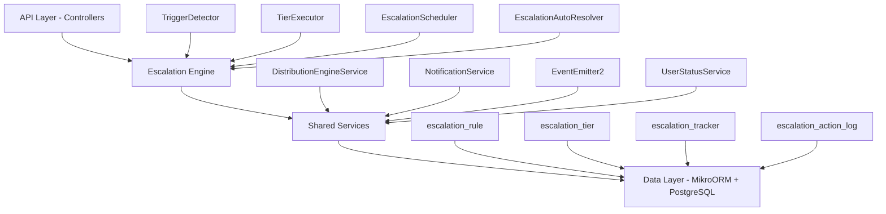

The Escalation Module automates responses when assigned leads go stale. A scheduled engine detects trigger conditions (no first contact, went cold) and executes tiered escalation actions — notifications, temperature changes, tag additions, and redistribution to new agents.

<Note>
**Status:** Active — fully implemented  
**Module Path:** `src/modules/crm/escalation/`
</Note>

## Overview

### Design Principles

| Principle | Decision |
|-----------|----------|
| pg-boss scheduling | Escalation scheduler uses pg-boss recurring job for reliability |
| Tiered actions | Rules have ordered tiers with configurable delays; actions execute in sequence |
| Auto-resolution | Events (activity, stage change, reassignment) automatically resolve active trackers |
| Idempotency | Partial unique index + `ON CONFLICT DO NOTHING` prevents duplicate trackers |
| Distribution delegation | Reassignment uses the distribution engine (`REDISTRIBUTE` action), not a separate paradigm |
| RLS compliance | All entities carry `organization_id` for row-level security |

## Architecture

### High-Level Diagram



### Component Responsibilities

<AccordionGroup>
<Accordion title="EscalationScheduler">
pg-boss recurring job that runs every 60 seconds to detect new triggers and process due escalations
</Accordion>

<Accordion title="TriggerDetector">
Scans leads for unmet conditions (no first contact, went cold); creates tracker records
</Accordion>

<Accordion title="TierExecutor">
Executes escalation tier actions (notify, redistribute, change temp, add tag)
</Accordion>

<Accordion title="EscalationAutoResolver">
Listens to domain events and resolves active trackers when conditions change
</Accordion>

<Accordion title="EscalationRuleService">
CRUD for escalation rules; handles tracker cancellation on deactivation/deletion
</Accordion>
</AccordionGroup>

## Entity Specifications

### EscalationRule

Defines when and how a lead should be escalated. Evaluated by `TriggerDetector`.

<Info>
Rules are evaluated in ascending `priority` order (lower number = higher priority). Active rules must use unique priorities within the organization.
</Info>

| Column | Type | Notes |
|--------|------|-------|
| id | uuid PK | |
| organization_id | uuid FK | RLS |
| name | varchar | Human-readable rule name |
| is_active | bool | default true |
| priority | int | Evaluation order |
| trigger_type | enum | `NO_FIRST_CONTACT`, `WENT_COLD` |
| trigger_config | jsonb | `{thresholdMinutes?, thresholdValue?, thresholdUnit?}` |
| conditions | jsonb | `EscalationCondition[]` — AND-joined applicability filters |
| respect_business_hours | bool | default true |
| created_by | uuid FK | |
| created_at, updated_at | timestamp | |
| is_deleted | bool | soft delete |

#### EscalationCondition Interface

```typescript
interface EscalationCondition {
  field: 'temperature' | 'leadSource' | 'language' | 'sourceChannel';
  operator: 'eq' | 'in';
  value: string | string[];
}
```

#### SQL Field Mapping

| Field | SQL Column | Table | Notes |
|-------|------------|-------|-------|
| `temperature` | `l.temperature` | lead | |
| `leadSource` | `l.lead_source` | lead | |
| `sourceChannel` | `l.source_channel` | lead | |
| `language` | `p.languages` | person | Adds `LEFT JOIN person p ON p.id = l.person_id` |

### EscalationTier

Each tier in an escalation rule represents a delayed action set. Tiers execute in `tier_order` sequence.

| Column | Type | Notes |
|--------|------|-------|
| id | uuid PK | |
| escalation_rule_id | uuid FK | |
| organization_id | uuid FK | RLS |
| tier_order | int | 1, 2, 3... (max 10) |
| delay_minutes | int | Tier 1: always 0. Subsequent tiers: minutes after previous tier |
| actions | jsonb | `TierAction[]` |

<Warning>
Tier 1 (lowest tier_order) always has `delay_minutes = 0` — the threshold is the sole timing control for the first tier.
</Warning>

#### Tier Action Types

| Action Type | Parameters | Resolution |
|-------------|------------|------------|
| `NOTIFY_AGENT` | `message?: string` | Resolved from lead's current stakeholder (assigned agent) |
| `NOTIFY_ADMIN` | `message?: string` | Self-resolving — queries all org users with `system.admin` permission |
| `NOTIFY_MANAGER` | `message?: string` | Resolved from agent's manager via `UserOrgRole.manager_user_id` |
| `NOTIFY_SPECIFIC_USERS` | `userIds: string[], message?: string` | Direct user IDs |
| `CHANGE_TEMPERATURE` | `temperature: string` | Updates lead temperature |
| `ADD_TAG` | `tagName: string` | Adds tag to lead |
| `REDISTRIBUTE` | `distributionStrategy?: string` | Uses distribution engine |

### EscalationTracker

Tracks escalation state for individual leads. Created when triggers are detected, resolved when conditions change.

| Column | Type | Notes |
|--------|------|-------|
| id | uuid PK | |
| organization_id | uuid FK | RLS |
| lead_id | uuid FK | |
| escalation_rule_id | uuid FK | |
| trigger_type | enum | Copy from rule |
| status | enum | `ACTIVE`, `RESOLVED`, `CANCELLED` |
| current_tier | int | Currently executing tier (1-based) |
| triggered_at | timestamp | When tracker was created |
| next_tier_due_at | timestamp | When next tier should execute |
| resolved_at | timestamp | When resolved/cancelled |
| resolution_reason | enum | `MANUAL_RESOLUTION`, `LEAD_ACTIVITY`, etc. |

<Note>
Partial unique index prevents duplicate active trackers: `(lead_id, escalation_rule_id) WHERE status = 'ACTIVE'`
</Note>

### EscalationActionLog

Audit trail for executed escalation actions.

| Column | Type | Notes |
|--------|------|-------|
| id | uuid PK | |
| organization_id | uuid FK | RLS |
| escalation_tracker_id | uuid FK | |
| tier_order | int | Which tier executed |
| action_type | enum | Type of action executed |
| action_config | jsonb | Action parameters |
| executed_at | timestamp | |
| execution_result | jsonb | Success/failure details |

## Type Definitions

<CodeGroup>
```typescript TypeScript Enums
enum EscalationTriggerType {
  NO_FIRST_CONTACT = 'NO_FIRST_CONTACT',
  WENT_COLD = 'WENT_COLD'
}

enum EscalationTrackerStatus {
  ACTIVE = 'ACTIVE',
  RESOLVED = 'RESOLVED', 
  CANCELLED = 'CANCELLED'
}

enum EscalationResolutionReason {
  MANUAL_RESOLUTION = 'MANUAL_RESOLUTION',
  LEAD_ACTIVITY = 'LEAD_ACTIVITY',
  STAGE_CHANGE = 'STAGE_CHANGE',
  TEMPERATURE_CHANGE = 'TEMPERATURE_CHANGE',
  LEAD_REASSIGNMENT = 'LEAD_REASSIGNMENT',
  RULE_DEACTIVATION = 'RULE_DEACTIVATION',
  RULE_DELETION = 'RULE_DELETION'
}

enum TierActionType {
  NOTIFY_AGENT = 'NOTIFY_AGENT',
  NOTIFY_ADMIN = 'NOTIFY_ADMIN', 
  NOTIFY_MANAGER = 'NOTIFY_MANAGER',
  NOTIFY_SPECIFIC_USERS = 'NOTIFY_SPECIFIC_USERS',
  CHANGE_TEMPERATURE = 'CHANGE_TEMPERATURE',
  ADD_TAG = 'ADD_TAG',
  REDISTRIBUTE = 'REDISTRIBUTE'
}
```

```typescript Interface Definitions
interface TierAction {
  type: TierActionType;
  config: Record<string, any>;
}

interface TriggerConfig {
  thresholdMinutes?: number;
  thresholdValue?: number;
  thresholdUnit?: 'hours' | 'days';
}

interface EscalationCondition {
  field: 'temperature' | 'leadSource' | 'language' | 'sourceChannel';
  operator: 'eq' | 'in';
  value: string | string[];
}
```
</CodeGroup>

## Escalation Engine

### TriggerDetector

<Steps>
<Step title="Load Active Rules">
Fetches all active escalation rules for the organization, ordered by priority
</Step>

<Step title="Query Eligible Leads">
For each rule, builds a SQL query to find leads matching:
- Trigger conditions (no first contact / went cold)
- Rule applicability conditions
- No existing active tracker for this rule
</Step>

<Step title="Create Trackers">
Creates `EscalationTracker` records with `status = 'ACTIVE'` and `next_tier_due_at` set appropriately
</Step>
</Steps>

#### Trigger Logic

<Tabs>
<Tab title="NO_FIRST_CONTACT">
```sql
-- Lead has been assigned but no first contact activity
SELECT l.id 
FROM lead l
WHERE l.organization_id = $1
  AND l.stakeholder_id IS NOT NULL  -- assigned
  AND l.stage != 'DISQUALIFIED'
  AND NOT EXISTS (
    SELECT 1 FROM activity a 
    WHERE a.lead_id = l.id 
    AND a.activity_type = 'FIRST_CONTACT'
  )
  AND l.assigned_at < (NOW() - INTERVAL '${thresholdMinutes} minutes')
```
</Tab>

<Tab title="WENT_COLD">
```sql
-- Lead had activity but has been inactive for threshold period
SELECT l.id
FROM lead l  
WHERE l.organization_id = $1
  AND l.stakeholder_id IS NOT NULL
  AND l.stage != 'DISQUALIFIED'
  AND l.temperature = 'COLD'
  AND l.last_activity_at < (NOW() - INTERVAL '${thresholdMinutes} minutes')
```
</Tab>
</Tabs>

### TierExecutor

Processes escalation trackers where `next_tier_due_at <= NOW()` and executes the appropriate tier actions.

<Steps>
<Step title="Load Due Trackers">
Query active trackers with `next_tier_due_at` in the past
</Step>

<Step title="Execute Tier Actions">
For each tracker, execute all actions in the current tier
</Step>

<Step title="Update Tracker State">
- Increment `current_tier`
- Set `next_tier_due_at` for next tier (if exists)
- Log actions in `EscalationActionLog`
</Step>

<Step title="Complete or Continue">
If no more tiers, mark tracker as `RESOLVED` with reason `ESCALATION_COMPLETE`
</Step>
</Steps>

### EscalationAutoResolver

Listens to domain events and automatically resolves active trackers when conditions change.

#### Resolution Events

| Event | Resolution Reason | Logic |
|-------|------------------|-------|
| Lead Activity Created | `LEAD_ACTIVITY` | Any new activity on the lead |
| Lead Stage Changed | `STAGE_CHANGE` | Stage changed to any value |
| Lead Temperature Changed | `TEMPERATURE_CHANGE` | Temperature updated |
| Lead Reassigned | `LEAD_REASSIGNMENT` | Stakeholder changed |
| Rule Deactivated | `RULE_DEACTIVATION` | Rule set to inactive |
| Rule Deleted | `RULE_DELETION` | Rule soft deleted |

<Info>
Auto-resolution ensures escalations stop immediately when the underlying condition is addressed, preventing unnecessary notifications.
</Info>

## API Endpoints

### Escalation Rules

<CodeGroup>
```http GET /api/escalation/rules
GET /api/escalation/rules?page=1&limit=10&search=urgent&isActive=true

Response:
{
  "data": [
    {
      "id": "uuid",
      "name": "No First Contact - 24h", 
      "isActive": true,
      "priority": 1,
      "triggerType": "NO_FIRST_CONTACT",
      "triggerConfig": { "thresholdMinutes": 1440 },
      "conditions": [],
      "respectBusinessHours": true,
      "tiers": [...],
      "createdAt": "2024-01-01T00:00:00Z"
    }
  ],
  "meta": {
    "total": 5,
    "page": 1, 
    "limit": 10,
    "totalPages": 1
  }
}
```

```http POST /api/escalation/rules
POST /api/escalation/rules

Body:
{
  "name": "Cold Lead Follow-up",
  "triggerType": "WENT_COLD",
  "triggerConfig": { "thresholdValue": 3, "thresholdUnit": "days" },
  "conditions": [
    { "field": "temperature", "operator": "eq", "value": "COLD" }
  ],
  "respectBusinessHours": true,
  "tiers": [
    {
      "tierOrder": 1,
      "delayMinutes": 0,
      "actions": [
        { "type": "NOTIFY_AGENT", "config": { "message": "Lead went cold" } }
      ]
    }
  ]
}
```

```http PUT /api/escalation/rules/:id
PUT /api/escalation/rules/550e8400-e29b-41d4-a716-446655440000

Body: { "name": "Updated Rule Name", "isActive": false }
```

```http DELETE /api/escalation/rules/:id
DELETE /api/escalation/rules/550e8400-e29b-41d4-a716-446655440000
```
</CodeGroup>

### Escalation Analytics

<CodeGroup>
```http GET /api/escalation/analytics/overview
GET /api/escalation/analytics/overview?startDate=2024-01-01&endDate=2024-01-31

Response:
{
  "totalEscalations": 145,
  "activeEscalations": 23,
  "resolvedEscalations": 122,
  "averageResolutionTime": 4.5,
  "escalationsByTrigger": {
    "NO_FIRST_CONTACT": 89,
    "WENT_COLD": 56
  },
  "escalationsByRule": [
    { "ruleName": "24h No Contact", "count": 45 }
  ]
}
```

```http GET /api/escalation/analytics/trackers
GET /api/escalation/analytics/trackers?status=ACTIVE&ruleId=uuid

Response: {
  "data": [
    {
      "id": "uuid",
      "leadId": "uuid", 
      "leadName": "John Doe",
      "ruleName": "No First Contact",
      "status": "ACTIVE",
      "currentTier": 2,
      "triggeredAt": "2024-01-15T10:00:00Z",
      "nextTierDueAt": "2024-01-16T10:00:00Z"
    }
  ]
}
```
</CodeGroup>

### Manual Operations

<CodeGroup>
```http POST /api/escalation/trackers/:id/resolve
POST /api/escalation/trackers/550e8400-e29b-41d4-a716-446655440000/resolve

Body: { "reason": "Issue manually resolved" }
```

```http POST /api/escalation/trackers/:id/execute-tier
POST /api/escalation/trackers/550e8400-e29b-41d4-a716-446655440000/execute-tier

Response: { "success": true, "actionsExecuted": 3 }
```
</CodeGroup>

## Security & Permissions

### Required Permissions

<CardGroup cols={2}>
<Card title="View Escalations" icon="eye">
`escalation.rules.read` - View escalation rules and trackers
</Card>

<Card title="Manage Rules" icon="gear">
`escalation.rules.write` - Create, edit, delete escalation rules
</Card>

<Card title="Manual Resolution" icon="check">
`escalation.trackers.resolve` - Manually resolve active trackers
</Card>

<Card title="Analytics Access" icon="chart-bar">
`escalation.analytics.read` - View escalation metrics and reports
</Card>
</CardGroup>

### Row Level Security

All escalation entities include `organization_id` and are protected by RLS policies:

```sql
-- Example RLS policy for escalation_rule
CREATE POLICY escalation_rule_tenant_isolation ON escalation_rule
  USING (organization_id = current_setting('app.current_organization_id')::uuid);
```

<Warning>
Escalation rules with `NOTIFY_ADMIN` actions automatically resolve target users. If no admin users exist in the organization, the action is skipped and logged.
</Warning>

## Analytics & Metrics

### Key Metrics Tracked

- **Total Escalations**: Count of all trackers created
- **Active vs Resolved**: Current escalation status breakdown  
- **Resolution Time**: Average time from trigger to resolution
- **Escalations by Trigger Type**: NO_FIRST_CONTACT vs WENT_COLD distribution
- **Escalations by Rule**: Performance per escalation rule
- **Tier Progression**: How far escalations typically progress before resolution

### Business Hours Integration

When `respect_business_hours = true`:
- Tier execution only occurs during business hours
- `next_tier_due_at` automatically adjusts to next business period
- Weekend and holiday escalations are deferred to next business day

<Tip>
Business hours are defined per organization and can include multiple time zones for distributed teams.
</Tip>

## Edge Case Handling

### Concurrent Modifications

<AccordionGroup>
<Accordion title="Rule Priority Conflicts">
Backend validates unique priorities among active rules. Frontend prevents submission of conflicting priorities and blocks reactivation of paused rules with conflicts.
</Accordion>

<Accordion title="Lead State Changes">
Auto-resolver handles rapid lead changes (multiple activities, quick reassignments) by resolving all applicable trackers immediately.
</Accordion>

<Accordion title="Rule Deletion During Execution">
Active trackers are cancelled with `RULE_DELETION` reason when parent rule is deleted.
</Accordion>
</AccordionGroup>

### Notification Failures

| Failure Type | Handling |
|-------------|----------|
| User not found | Log error, continue with remaining notifications |
| External service down | Retry with exponential backoff (pg-boss) |
| Invalid notification config | Log validation error, skip action |

### Business Hours Edge Cases

- **Tier due during non-business hours**: Deferred to next business period
- **Multiple time zones**: Uses organization's primary time zone
- **Holiday handling**: Integrates with organization holiday calendar

## Performance & Scaling

### Optimization Strategies

<Steps>
<Step title="Efficient Queries">
`TriggerDetector` uses optimized queries with proper indexes on `assigned_at`, `last_activity_at`, and `stakeholder_id`
</Step>

<Step title="Batch Processing">
Escalation scheduler processes multiple trackers in batches to reduce database load
</Step>

<Step title="Selective Updates">
Only update `next_tier_due_at` when tier progression occurs, avoiding unnecessary writes
</Step>

<Step title="Event Debouncing">
Auto-resolver debounces rapid events (multiple activities) to prevent excessive tracker updates
</Step>
</Steps>

### Scaling Considerations

- **Large Organizations**: Rules are organization-scoped; each tenant's escalations process independently
- **High Lead Volume**: Trigger detection uses `LIMIT` clauses and pagination for large lead sets
- **Notification Load**: Integrates with notification service rate limiting and queuing

## RLS Policies

<CodeGroup>
```sql Escalation Rule Policies
-- Read access
CREATE POLICY escalation_rule_read ON escalation_rule FOR SELECT
  USING (organization_id = current_setting('app.current_organization_id')::uuid);

-- Write access (requires permission)
CREATE POLICY escalation_rule_write ON escalation_rule FOR ALL
  USING (
    organization_id = current_setting('app.current_organization_id')::uuid
    AND current_setting('app.user_permissions')::text[] @> ARRAY['escalation.rules.write']
  );
```

```sql Escalation Tracker Policies  
-- Read access
CREATE POLICY escalation_tracker_read ON escalation_tracker FOR SELECT
  USING (organization_id = current_setting('app.current_organization_id')::uuid);

-- Manual resolution (requires permission)
CREATE POLICY escalation_tracker_resolve ON escalation_tracker FOR UPDATE
  USING (
    organization_id = current_setting('app.current_organization_id')::uuid
    AND current_setting('app.user_permissions')::text[] @> ARRAY['escalation.trackers.resolve']
  );
```
</CodeGroup>

## Module Structure

```
src/modules/crm/escalation/
├── controllers/
│   ├── escalation-rule.controller.ts
│   └── escalation-analytics.controller.ts
├── services/
│   ├── escalation-rule.service.ts
│   ├── escalation-scheduler.service.ts
│   ├── trigger-detector.service.ts
│   ├── tier-executor.service.ts
│   └── escalation-auto-resolver.service.ts
├── entities/
│   ├── escalation-rule.entity.ts
│   ├── escalation-tier.entity.ts
│   ├── escalation-tracker.entity.ts
│   └── escalation-action-log.entity.ts
├── dtos/
│   ├── create-escalation-rule.dto.ts
│   ├── update-escalation-rule.dto.ts
│   └── escalation-analytics.dto.ts
└── types/
    ├── escalation.enums.ts
    └── escalation.interfaces.ts
```

## Integration Points

### External Dependencies

| Service | Usage | Fallback |
|---------|-------|----------|
| Distribution Engine | Lead redistribution actions | Log error, continue |
| Notification Service | All notification actions | Retry with exponential backoff |
| Business Hours Service | Schedule validation | Skip business hours checks |
| Event System | Auto-resolution triggers | Manual resolution available |

### Event Emissions

The escalation module emits events for other systems to consume:

- `escalation.tracker.created`
- `escalation.tracker.resolved` 
- `escalation.tier.executed`
- `escalation.rule.activated`
- `escalation.rule.deactivated`

<Check>
The escalation module is fully implemented and active, providing automated lead follow-up with comprehensive tracking, flexible configuration, and robust error handling.
</Check>